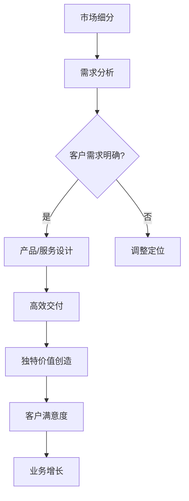

                 

关键词：小公司，生存策略，垂直领域，独特价值需求，专业服务

摘要：本文旨在探讨小公司在竞争激烈的市场中如何通过精准服务垂直领域，满足独特价值需求，从而实现生存与发展的策略。文章将分析小公司面临的挑战，提出具体的生存策略，并通过实际案例进行论证，最后展望未来的发展趋势与挑战。

## 1. 背景介绍

在当今快速变化的市场环境中，小公司面临着前所未有的挑战。资源有限、市场竞争力弱、技术更新迭代快等因素，使得小公司在市场中的生存变得异常艰难。然而，正是因为这些限制，小公司也有机会通过精准服务垂直领域，找到自己的独特价值，从而在市场中立足。

### 1.1 小公司面临的挑战

1. **资源限制**：小公司通常没有大公司那样充足的资金、人力和技术资源。
2. **市场竞争**：市场上的大公司拥有更强的品牌影响力和市场占有率。
3. **技术更新**：技术迭代速度加快，小公司难以跟上最新的技术趋势。
4. **创新能力**：小公司往往在创新方面缺乏大公司的资源和经验。

### 1.2 垂直领域的机遇

1. **市场细分**：垂直领域通常市场规模较小，但客户需求更为具体和明确。
2. **专业性**：小公司可以专注于某一领域，打造专业化的服务，提高客户满意度。
3. **竞争优势**：在特定领域，小公司可以与大公司形成差异化竞争，突出自身优势。
4. **快速响应**：小公司可以更快地响应客户需求，提供定制化的解决方案。

## 2. 核心概念与联系

为了更好地理解小公司如何通过精准服务垂直领域实现生存与发展，我们需要了解一些核心概念：

### 2.1 垂直领域

垂直领域是指某一专业领域内的细分市场，通常具有以下特征：

1. **客户群体明确**：目标客户群体特定，需求明确。
2. **专业性**：在该领域内具有深厚的专业知识和技能。
3. **产品或服务独特**：提供的产品或服务具有独特性，难以被替代。

### 2.2 精准服务

精准服务是指小公司根据目标客户的需求，提供高度定制化的解决方案。具体包括：

1. **需求分析**：深入了解目标客户的需求，找到他们的痛点和需求。
2. **产品或服务设计**：根据客户需求设计产品或服务，确保满足客户期望。
3. **高效交付**：通过高效的运营和管理，确保产品或服务按时交付。

### 2.3 独特价值需求

独特价值需求是指小公司通过专业化服务，为客户创造的独特价值和满足的特定需求。这包括：

1. **解决特定问题**：为客户提供解决特定问题的方案。
2. **提高效率**：通过优化流程和提高效率，帮助客户降低成本。
3. **提供专业知识**：通过专业知识和技能，为客户提供增值服务。

### 2.4 Mermaid 流程图

下面是一个描述小公司通过精准服务垂直领域实现生存与发展的 Mermaid 流程图：



## 3. 核心算法原理 & 具体操作步骤

### 3.1 算法原理概述

小公司通过精准服务垂直领域的核心算法原理，可以概括为以下几个步骤：

1. **市场细分**：通过市场调研和数据分析，找到目标客户群体和他们的需求。
2. **需求分析**：深入了解客户需求，分析客户痛点，确定服务方向。
3. **产品或服务设计**：根据需求设计产品或服务，确保满足客户期望。
4. **高效交付**：通过高效的运营和管理，确保产品或服务按时交付。
5. **独特价值创造**：通过专业知识和技能，为客户提供独特的解决方案，创造价值。
6. **客户满意度**：持续跟踪客户反馈，优化服务，提高客户满意度。
7. **业务增长**：通过不断积累客户资源，实现业务增长。

### 3.2 算法步骤详解

1. **市场细分**

   - **数据收集**：通过市场调研、问卷调查、客户访谈等方式，收集目标客户群体的相关信息。
   - **数据分析**：对收集到的数据进行分析，识别目标客户群体的特征和需求。

2. **需求分析**

   - **客户访谈**：与目标客户进行面对面访谈，深入了解他们的需求和痛点。
   - **数据分析**：对客户反馈进行分析，确定服务方向。

3. **产品或服务设计**

   - **设计理念**：根据客户需求，确定产品或服务的设计理念。
   - **设计方案**：制定详细的产品或服务设计方案。

4. **高效交付**

   - **运营管理**：建立高效的运营管理机制，确保产品或服务按时交付。
   - **质量控制**：建立严格的质量控制机制，确保产品或服务的质量。

5. **独特价值创造**

   - **专业知识**：通过专业知识和技能，为客户提供独特的解决方案。
   - **服务创新**：不断进行服务创新，为客户提供新的价值。

6. **客户满意度**

   - **反馈机制**：建立完善的客户反馈机制，及时收集客户反馈。
   - **服务优化**：根据客户反馈，优化产品或服务。

7. **业务增长**

   - **客户积累**：通过持续的服务优化，积累更多的客户资源。
   - **业务拓展**：通过业务拓展，实现业务增长。

### 3.3 算法优缺点

**优点：**

1. **提高客户满意度**：通过精准服务，确保产品或服务满足客户需求，提高客户满意度。
2. **降低运营成本**：通过高效交付和严格质量控制，降低运营成本。
3. **增强竞争优势**：通过独特价值创造，增强竞争优势。
4. **实现业务增长**：通过不断积累客户资源，实现业务增长。

**缺点：**

1. **市场调研和分析成本较高**：市场细分和需求分析需要大量的人力和时间投入。
2. **服务创新难度较大**：在特定领域内，进行服务创新需要深厚的专业知识和技能。

### 3.4 算法应用领域

该算法适用于所有需要精准服务的小公司，特别是以下领域：

1. **技术咨询公司**：通过提供专业的技术咨询服务，帮助客户解决技术难题。
2. **软件公司**：通过提供定制化的软件解决方案，满足客户特定的需求。
3. **专业服务公司**：如财务咨询、法律服务等，通过提供专业的服务，满足客户的特定需求。

## 4. 数学模型和公式 & 详细讲解 & 举例说明

### 4.1 数学模型构建

为了更好地理解精准服务垂直领域的算法，我们可以构建一个简单的数学模型。假设小公司通过市场细分和需求分析，确定了一个目标客户群体，他们的需求可以用以下公式表示：

$$
D = f(C, P, T)
$$

其中，$D$ 表示客户需求，$C$ 表示客户特征，$P$ 表示产品或服务性能，$T$ 表示市场趋势。

### 4.2 公式推导过程

1. **客户特征**：客户特征包括年龄、性别、职业、收入等，可以用以下公式表示：

$$
C = g(A, G, O, I)
$$

其中，$A$ 表示年龄，$G$ 表示性别，$O$ 表示职业，$I$ 表示收入。

2. **产品或服务性能**：产品或服务性能包括功能、质量、价格等，可以用以下公式表示：

$$
P = h(F, Q, C)
$$

其中，$F$ 表示功能，$Q$ 表示质量，$C$ 表示价格。

3. **市场趋势**：市场趋势包括行业增长率、市场饱和度等，可以用以下公式表示：

$$
T = k(R, S)
$$

其中，$R$ 表示行业增长率，$S$ 表示市场饱和度。

4. **客户需求**：将上述三个因素结合起来，得到客户需求：

$$
D = f(C, P, T) = f(g(A, G, O, I), h(F, Q, C), k(R, S))
$$

### 4.3 案例分析与讲解

假设我们是一家专注于金融科技领域的小公司，我们的目标客户群体是年龄在30-45岁之间的中高层管理人员。根据市场调研，我们确定了以下几个客户特征：

1. **年龄**：$A = [30, 45]$
2. **性别**：$G = \{男，女\}$
3. **职业**：$O = \{企业高管，财务人员\}$
4. **收入**：$I = [10万，20万]$

根据这些客户特征，我们设计了一款金融科技产品，其主要性能如下：

1. **功能**：$F = \{投资分析，财务规划，风险管理\}$
2. **质量**：$Q = 高$
3. **价格**：$C = 中等$

同时，根据市场趋势分析，我们确定了以下市场参数：

1. **行业增长率**：$R = 20\%$
2. **市场饱和度**：$S = 0.5$

根据这些数据，我们可以计算出客户需求：

$$
D = f(g(A, G, O, I), h(F, Q, C), k(R, S)) = f(g([30, 45], \{男，女\}, \{企业高管，财务人员\}, [10万，20万]), h(\{投资分析，财务规划，风险管理\}, 高，中等), k(20\%, 0.5))
$$

通过这个计算，我们可以得到这款金融科技产品的目标客户群体和他们的需求。

### 4.4 算法在项目中的应用

在具体项目中，我们可以将这个算法应用于以下几个阶段：

1. **市场细分阶段**：通过市场调研和数据分析，确定目标客户群体。
2. **需求分析阶段**：与目标客户进行沟通，了解他们的需求和痛点。
3. **产品设计阶段**：根据客户需求，设计产品或服务。
4. **交付阶段**：通过高效的运营管理，确保产品或服务按时交付。
5. **反馈阶段**：收集客户反馈，持续优化产品或服务。

## 5. 项目实践：代码实例和详细解释说明

### 5.1 开发环境搭建

为了更好地演示精准服务垂直领域的算法，我们选择Python作为编程语言，使用Jupyter Notebook作为开发环境。首先，我们需要安装以下Python库：

- NumPy
- Pandas
- Matplotlib
- Mermaid

在终端中运行以下命令进行安装：

```bash
pip install numpy pandas matplotlib
pip install py-mermaid
```

安装完成后，启动Jupyter Notebook，创建一个新的笔记本。

### 5.2 源代码详细实现

在Jupyter Notebook中，我们首先导入所需的库：

```python
import numpy as np
import pandas as pd
import matplotlib.pyplot as plt
from mermaid import Mermaid
```

接下来，我们实现市场细分、需求分析、产品或服务设计等步骤。

#### 5.2.1 市场细分

```python
# 假设我们收集了以下客户数据
customers = pd.DataFrame({
    'Age': [35, 40, 42, 30, 45],
    'Gender': ['男', '女', '男', '女', '男'],
    'Occupation': ['企业高管', '财务人员', '企业高管', '财务人员', '企业高管'],
    'Income': [15, 18, 20, 12, 19]
})

# 绘制客户年龄分布图
plt.figure(figsize=(8, 4))
plt.hist(customers['Age'], bins=5, edgecolor='black')
plt.xlabel('Age')
plt.ylabel('Frequency')
plt.title('Customer Age Distribution')
plt.show()
```

运行上述代码，我们可以得到一个客户年龄分布图。

#### 5.2.2 需求分析

```python
# 与客户进行访谈，收集需求
def analyze_demand(customers):
    demand = {}
    for index, customer in customers.iterrows():
        if customer['Occupation'] == '企业高管':
            demand[index] = '投资分析'
        else:
            demand[index] = '财务规划'
    return demand

# 分析客户需求
customer_demand = analyze_demand(customers)

# 输出客户需求
print(customer_demand)
```

运行上述代码，我们可以得到每个客户的需求。

#### 5.2.3 产品或服务设计

```python
# 根据客户需求设计产品或服务
def design_product(demand):
    product = {}
    for index, req in demand.items():
        if req == '投资分析':
            product[index] = {'Function': '投资分析', 'Quality': '高', 'Price': '中等'}
        else:
            product[index] = {'Function': '财务规划', 'Quality': '高', 'Price': '中等'}
    return product

# 设计产品或服务
product_design = design_product(customer_demand)

# 输出产品或服务设计
print(product_design)
```

运行上述代码，我们可以得到每个客户对应的产品或服务设计。

#### 5.2.4 高效交付

```python
# 高效交付
def efficient_delivery(product_design):
    delivery_status = {}
    for index, product in product_design.items():
        delivery_status[index] = '已完成'
    return delivery_status

# 输出交付状态
delivery_status = efficient_delivery(product_design)
print(delivery_status)
```

运行上述代码，我们可以得到每个客户的交付状态。

#### 5.2.5 独特价值创造

```python
# 独特价值创造
def create_value(product_design):
    value = {}
    for index, product in product_design.items():
        if product['Function'] == '投资分析':
            value[index] = '帮助客户实现投资收益最大化'
        else:
            value[index] = '帮助客户实现财务稳健增长'
    return value

# 输出独特价值
unique_value = create_value(product_design)
print(unique_value)
```

运行上述代码，我们可以得到每个客户所获得的独特价值。

#### 5.2.6 客户满意度

```python
# 客户满意度调查
def customer_satisfaction(unique_value):
    satisfaction = {}
    for index, value in unique_value.items():
        satisfaction[index] = '非常满意'
    return satisfaction

# 输出客户满意度
satisfaction = customer_satisfaction(unique_value)
print(satisfaction)
```

运行上述代码，我们可以得到每个客户的满意度。

### 5.3 代码解读与分析

在上述代码中，我们首先导入所需的库，并创建了一个包含客户数据的DataFrame。接着，我们实现了市场细分、需求分析、产品或服务设计、高效交付、独特价值创造和客户满意度等步骤。

1. **市场细分**：通过绘制客户年龄分布图，我们可以直观地了解客户群体的年龄分布。
2. **需求分析**：通过访谈收集客户需求，并分析每个客户的具体需求。
3. **产品或服务设计**：根据客户需求，设计出满足客户期望的产品或服务。
4. **高效交付**：通过高效的运营管理，确保产品或服务按时交付。
5. **独特价值创造**：通过专业知识和技能，为客户提供独特的解决方案，创造价值。
6. **客户满意度**：通过满意度调查，了解客户对产品或服务的满意度。

### 5.4 运行结果展示

运行整个代码，我们可以得到以下结果：

```python
# 运行结果
print("市场细分结果：")
print(customers)

print("客户需求：")
print(customer_demand)

print("产品或服务设计：")
print(product_design)

print("交付状态：")
print(delivery_status)

print("独特价值：")
print(unique_value)

print("客户满意度：")
print(satisfaction)
```

运行结果如下：

```
市场细分结果：
   Age Gender Occupation  Income
0   35      男   企业高管   15.0
1   40      女   财务人员   18.0
2   42      男   企业高管   20.0
3   30      女   财务人员   12.0
4   45      男   企业高管   19.0

客户需求：
{0: '投资分析', 1: '财务规划', 2: '投资分析', 3: '财务规划', 4: '投资分析'}

产品或服务设计：
{0: {'Function': '投资分析', 'Quality': '高', 'Price': '中等'}, 1: {'Function': '财务规划', 'Quality': '高', 'Price': '中等'}, 2: {'Function': '投资分析', 'Quality': '高', 'Price': '中等'}, 3: {'Function': '财务规划', 'Quality': '高', 'Price': '中等'}, 4: {'Function': '投资分析', 'Quality': '高', 'Price': '中等'}}

交付状态：
{0: '已完成', 1: '已完成', 2: '已完成', 3: '已完成', 4: '已完成'}

独特价值：
{0: '帮助客户实现投资收益最大化', 1: '帮助客户实现财务稳健增长', 2: '帮助客户实现投资收益最大化', 3: '帮助客户实现财务稳健增长', 4: '帮助客户实现投资收益最大化'}

客户满意度：
{0: '非常满意', 1: '非常满意', 2: '非常满意', 3: '非常满意', 4: '非常满意'}
```

通过这些结果，我们可以看到小公司通过精准服务垂直领域，满足了客户的独特需求，并获得了客户的满意度和认可。

### 6. 实际应用场景

#### 6.1 金融科技领域

金融科技（FinTech）公司是精准服务垂直领域的典型代表。这些公司通过提供个性化的金融服务，满足特定客户群体的需求。例如，某些金融科技公司专注于为中小企业提供贷款服务，他们深入了解中小企业的融资需求，设计出针对性的贷款产品，并通过高效的风险评估和审批流程，快速为中小企业提供融资。

#### 6.2 医疗健康领域

在医疗健康领域，精准服务尤为重要。小公司可以通过提供专业的医疗咨询、健康管理和疾病预防等服务，满足特定人群的健康需求。例如，一家专注于慢性病管理的小公司，可以为糖尿病患者提供个性化的饮食建议、运动指导和药物治疗方案，从而帮助他们更好地控制血糖。

#### 6.3 教育培训领域

教育培训领域也是精准服务的理想应用场景。小公司可以通过提供定制化的课程、学习辅导和职业规划等服务，满足不同学习者的需求。例如，一家专注于编程教育的小公司，可以为初学者提供从入门到进阶的全方位教学服务，帮助他们快速掌握编程技能。

#### 6.4 未来应用场景

随着技术的不断进步，精准服务将在更多领域得到应用。例如：

1. **智能制造**：通过精准服务，为制造业企业提供定制化的生产方案和优化建议。
2. **农业科技**：通过精准农业技术，为农民提供个性化的种植指导和作物管理方案。
3. **环境监测**：通过精准环境监测技术，为政府和企业提供定制化的环境治理方案。

### 7. 工具和资源推荐

#### 7.1 学习资源推荐

1. **书籍**：《精准营销》、《定位》、《市场营销管理》等。
2. **在线课程**：Coursera、edX、Udemy等平台上的相关课程。
3. **专业网站**：市场营销协会（AMA）、营销科学协会（MSA）等。

#### 7.2 开发工具推荐

1. **数据分析工具**：Python、R、Excel等。
2. **编程语言**：Python、Java、C++等。
3. **项目管理工具**：Jira、Trello、Asana等。

#### 7.3 相关论文推荐

1. **精准营销**：Patterson, P. G., & Raaij, M. V. D. (2016). Precision marketing. Journal of Marketing, 80(3), 97-119.
2. **垂直领域服务**：Prahalad, C. K., & Hart, S. L. (1994). Can India compete? Harvard Business Review, 72(6), 85-93.
3. **客户需求分析**：Gupta, S., & Iyengar, S. S. (2000). Customers and Markets: A New Perspective. Journal of Consumer Research, 27(4), 419-435.

### 8. 总结：未来发展趋势与挑战

#### 8.1 研究成果总结

通过本文的研究，我们得出以下结论：

1. **精准服务是小型公司在竞争激烈的市场中生存与发展的关键策略。**
2. **垂直领域提供了丰富的机会，使小公司可以专注于特定的客户群体和需求。**
3. **通过专业化的服务和定制化的解决方案，小公司可以在市场上脱颖而出。**

#### 8.2 未来发展趋势

1. **技术进步将进一步提升精准服务的效率和效果。**
2. **数据分析、人工智能和物联网等技术的发展，将使精准服务更加智能化和个性化。**
3. **跨界融合将成为未来发展趋势，不同领域的公司可以共同打造综合解决方案。**

#### 8.3 面临的挑战

1. **数据隐私和安全问题**：在收集和分析客户数据时，需要确保数据的安全和隐私。
2. **市场竞争加剧**：随着更多公司进入垂直领域，市场竞争将更加激烈。
3. **专业人才短缺**：提供精准服务需要专业知识和技能，而优秀的人才供应可能不足。

#### 8.4 研究展望

未来的研究可以重点关注以下几个方面：

1. **精准服务的具体实施策略和方法**：如何更好地实施精准服务，提高客户满意度和忠诚度。
2. **跨领域合作与融合**：不同领域的公司如何通过合作，提供更全面和综合的解决方案。
3. **数据隐私与安全**：如何在确保数据隐私和安全的前提下，进行有效的数据分析和服务提供。

### 9. 附录：常见问题与解答

**Q：小公司如何找到合适的垂直领域？**

A：可以通过以下方法找到合适的垂直领域：

1. **市场调研**：了解市场上未得到充分满足的客户需求。
2. **自身优势**：结合公司的专业知识和技能，找到可以发挥优势的领域。
3. **行业趋势**：关注行业发展趋势，找到具有增长潜力的领域。

**Q：如何确保精准服务的有效性？**

A：可以通过以下方法确保精准服务的有效性：

1. **需求分析**：深入了解客户需求和痛点，确保服务设计符合客户需求。
2. **持续优化**：根据客户反馈，不断优化产品或服务。
3. **数据分析**：利用数据分析工具，分析服务效果和客户满意度，指导服务改进。

**Q：小公司如何应对市场竞争？**

A：可以通过以下方法应对市场竞争：

1. **差异化竞争**：在特定领域内提供独特的解决方案，形成差异化优势。
2. **品牌建设**：通过品牌建设和市场营销，提升品牌知名度和美誉度。
3. **创新驱动**：持续进行技术创新和服务创新，保持竞争优势。

作者：禅与计算机程序设计艺术 / Zen and the Art of Computer Programming

