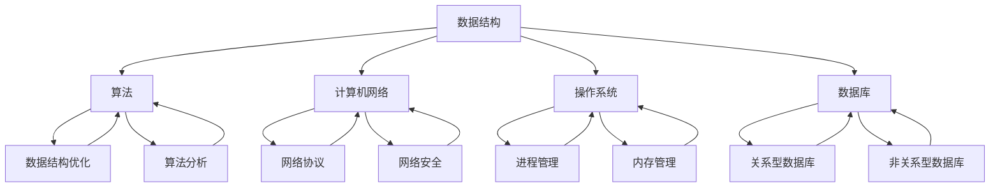

                 

### 1. 背景介绍

小米公司作为一家全球知名的高科技企业，其社招面试一直以来都是科技求职者关注的热点。社招面试不仅考察求职者的专业能力和技术水平，还注重求职者的综合素养和团队合作能力。本文将围绕小米2024社招面试中的部分真题与算法题，结合解题思路和实战经验，为大家提供详细的解析与指导。

首先，让我们明确社招面试的重要性。社招面试是求职者进入企业的重要门槛，面试题目往往更加注重实际应用和解决问题的能力。在面试过程中，企业会通过一系列的技术面试题、行为面试题以及团队合作场景，全面评估求职者的综合素质。因此，熟悉并掌握面试真题和算法题，对于求职者来说至关重要。

本文将分为以下几个部分：

- **核心概念与联系**：介绍面试中涉及的核心概念和它们之间的联系。
- **核心算法原理 & 具体操作步骤**：详细解析面试中的核心算法，包括原理概述、步骤详解、优缺点分析和应用领域。
- **数学模型和公式 & 详细讲解 & 举例说明**：解释算法背后的数学原理，并给出相关公式和实际案例。
- **项目实践：代码实例和详细解释说明**：通过实际代码示例，讲解算法的实现过程和关键点。
- **实际应用场景**：分析算法在实际项目中的应用，探讨未来应用展望。
- **工具和资源推荐**：推荐学习资源和开发工具，帮助读者更好地理解和应用算法。
- **总结：未来发展趋势与挑战**：总结研究成果，展望未来发展。

通过本文的详细解析，希望能够帮助求职者更好地应对小米2024社招面试，提升自己的面试通过率。

### 2. 核心概念与联系

在小米2024社招面试中，涉及到的核心概念主要包括数据结构、算法、计算机网络、操作系统和数据库等。这些概念之间有着密切的联系，它们共同构成了计算机科学和技术的基础。下面，我们将通过一个Mermaid流程图，来展示这些核心概念之间的关系。



从图中可以看出，数据结构和算法是计算机科学的核心，它们几乎贯穿了整个计算机领域。数据结构定义了数据如何存储和组织，而算法则是解决问题的方法和步骤。计算机网络则关注于数据在网络中的传输和交换，包括网络协议和网络安全等方面。操作系统负责管理和控制计算机硬件资源，包括进程管理、内存管理和文件系统等。数据库则用于存储和管理数据，包括关系型数据库和非关系型数据库等。

这些核心概念相互关联，共同构成了计算机科学和技术的基础。在面试中，企业往往会结合这些概念，设计出一系列复杂的题目，考察求职者的综合能力和解决问题的能力。因此，掌握这些核心概念，并理解它们之间的联系，对于求职者来说至关重要。

#### 2.1 数据结构

数据结构是计算机科学中的一个重要概念，它定义了数据如何存储和组织。在面试中，数据结构常常是考察的重点。常见的数据结构包括数组、链表、栈、队列、树、图等。

- **数组**：数组是一种线性数据结构，用于存储一系列元素。数组在计算机内存中连续存储，通过下标访问元素。数组的特点是元素访问时间复杂度为O(1)，但插入和删除操作的时间复杂度为O(n)。

- **链表**：链表是一种由节点组成的线性数据结构，每个节点包含数据和指向下一个节点的指针。链表的特点是插入和删除操作的时间复杂度为O(1)，但访问元素的时间复杂度为O(n)。

- **栈**：栈是一种后进先出（LIFO）的数据结构，用于存储操作过程中的数据。栈的特点是插入和删除操作的时间复杂度为O(1)，但访问元素的时间复杂度为O(n)。

- **队列**：队列是一种先进先出（FIFO）的数据结构，用于存储操作过程中的数据。队列的特点是插入和删除操作的时间复杂度为O(1)，但访问元素的时间复杂度为O(n)。

- **树**：树是一种层次结构，用于表示具有层级关系的数据。树的特点是查找和访问元素的时间复杂度为O(logn)，但插入和删除操作的时间复杂度为O(n)。

- **图**：图是一种由节点和边组成的数据结构，用于表示复杂的关系。图的特点是查找和访问元素的时间复杂度为O(n)，但插入和删除操作的时间复杂度为O(1)。

在面试中，企业常常会设计一些数据结构相关的题目，如链表中的节点插入、删除和查找，树的结构和遍历，图的最短路径等。掌握这些数据结构的基本原理和操作，对于解决面试中的题目至关重要。

#### 2.2 算法

算法是解决问题的方法和步骤。在面试中，算法常常是考察的重点。常见算法包括排序算法、查找算法、图算法、动态规划等。

- **排序算法**：排序算法用于将一组无序数据按照特定的顺序排列。常见的排序算法包括冒泡排序、选择排序、插入排序、快速排序、归并排序等。排序算法的时间复杂度通常取决于数据的大小和初始状态。

- **查找算法**：查找算法用于在数据集合中找到特定元素。常见的查找算法包括二分查找、顺序查找、哈希查找等。查找算法的时间复杂度取决于数据结构和数据的大小。

- **图算法**：图算法用于解决图相关的问题，如最短路径、最迟到达时间、最小生成树等。常见的图算法包括迪杰斯特拉算法、贝尔曼-福特算法、Prim算法、Kruskal算法等。图算法的时间复杂度取决于图的大小和结构。

- **动态规划**：动态规划是一种解决优化问题的方法，它通过将问题分解为子问题，并保存子问题的解，来避免重复计算。动态规划适用于具有重叠子问题和最优子结构性质的问题。

在面试中，企业常常会设计一些算法相关的题目，如排序算法的实现、查找算法的应用、图算法的求解、动态规划问题的优化等。掌握这些算法的基本原理和实现，对于解决面试中的题目至关重要。

#### 2.3 计算机网络

计算机网络是计算机科学的一个重要分支，它研究计算机之间的通信和互联。计算机网络包括网络协议、网络安全、网络拓扑等方面。

- **网络协议**：网络协议是计算机网络中用于数据传输的规则和标准。常见的网络协议包括TCP/IP、HTTP、FTP、SMTP等。网络协议确保数据在网络中的正确传输和解释。

- **网络安全**：网络安全是保护计算机网络免受攻击和威胁的重要手段。网络安全包括防火墙、加密技术、入侵检测、安全协议等方面。

- **网络拓扑**：网络拓扑是计算机网络中节点和连接的布局方式。常见的网络拓扑包括星型拓扑、环型拓扑、网状拓扑等。网络拓扑影响网络的稳定性和可靠性。

在面试中，企业常常会设计一些计算机网络相关的题目，如网络协议的实现、网络安全策略的设计、网络拓扑的分析等。掌握计算机网络的基本原理和应用，对于解决面试中的题目至关重要。

#### 2.4 操作系统

操作系统是计算机系统的基础软件，它管理和控制计算机硬件资源，提供用户与计算机之间的交互界面。操作系统包括进程管理、内存管理、文件系统等方面。

- **进程管理**：进程管理是操作系统的重要功能之一，它负责创建、调度、终止进程，并管理进程之间的通信和同步。

- **内存管理**：内存管理是操作系统的重要功能之一，它负责分配、回收和管理内存资源，确保进程能够高效地使用内存。

- **文件系统**：文件系统是操作系统用于存储和管理数据的机制。文件系统包括文件的组织方式、文件的访问权限、文件的存储策略等。

在面试中，企业常常会设计一些操作系统相关的题目，如进程调度算法、内存分配策略、文件系统的实现等。掌握操作系统的基本原理和应用，对于解决面试中的题目至关重要。

#### 2.5 数据库

数据库是用于存储和管理数据的系统，它提供数据的高效存储、检索和管理功能。数据库包括关系型数据库和非关系型数据库等方面。

- **关系型数据库**：关系型数据库使用表格结构来存储数据，通过SQL语言进行数据查询和管理。常见的数据库管理系统包括MySQL、Oracle、SQL Server等。

- **非关系型数据库**：非关系型数据库使用非表格结构来存储数据，如文档、键值对、图等。常见的数据库管理系统包括MongoDB、Redis、Cassandra等。

在面试中，企业常常会设计一些数据库相关的题目，如SQL查询优化、数据库设计、索引策略等。掌握数据库的基本原理和应用，对于解决面试中的题目至关重要。

#### 2.6 核心概念之间的联系

核心概念之间的联系体现在它们在解决实际问题时相互配合。例如：

- **数据结构与算法**：数据结构为算法提供了操作数据的方式，算法则利用数据结构解决特定问题。例如，在链表中实现一个查找算法，或者在树结构中实现一个排序算法。
- **计算机网络与操作系统**：计算机网络为操作系统提供了网络通信的支持，操作系统则通过网络协议实现数据在网络中的传输。例如，操作系统的网络接口实现TCP/IP协议，以实现网络通信。
- **数据库与操作系统**：数据库系统依赖于操作系统的文件系统进行数据存储和管理，操作系统则为数据库提供文件操作接口。例如，数据库管理系统通过操作系统的文件系统实现数据文件的读写和存储。
- **数据结构与数据库**：数据结构为数据库提供了高效的数据组织和管理方式，数据库则利用数据结构实现数据的存储和检索。例如，关系型数据库使用表结构来存储数据，以实现数据的高效检索和管理。

通过理解这些核心概念之间的联系，求职者可以更好地应对面试中的复杂题目，展现自己的综合能力。

### 3. 核心算法原理 & 具体操作步骤

在小米2024社招面试中，算法部分往往是最具挑战性的部分。本文将详细介绍几个核心算法的原理和具体操作步骤，帮助求职者更好地理解和应用这些算法。

#### 3.1 算法原理概述

算法是解决特定问题的方法和步骤。在计算机科学中，算法可以分为多种类型，如排序算法、查找算法、图算法和动态规划等。下面，我们将分别介绍几种常见算法的原理。

1. **排序算法**：
排序算法用于将一组无序数据按照特定的顺序排列。常见的排序算法包括冒泡排序、选择排序、插入排序、快速排序和归并排序等。

2. **查找算法**：
查找算法用于在数据集合中找到特定元素。常见的查找算法包括二分查找、顺序查找和哈希查找等。

3. **图算法**：
图算法用于解决与图相关的问题，如最短路径、最迟到达时间和最小生成树等。常见的图算法包括迪杰斯特拉算法、贝尔曼-福特算法、Prim算法和Kruskal算法等。

4. **动态规划**：
动态规划是一种解决优化问题的方法，它通过将问题分解为子问题，并保存子问题的解，来避免重复计算。

#### 3.2 算法步骤详解

下面，我们详细解析几种常见算法的具体操作步骤。

1. **冒泡排序算法**：

冒泡排序是一种简单的排序算法，它通过重复遍历要排序的数列，一次比较两个元素，如果它们的顺序错误就把它们交换过来。遍历数列的工作是重复进行直到没有再需要交换，也就是说该数列已经排序完成。

具体步骤如下：

- 从第一个元素开始，对相邻的两个元素进行比较，如果第一个元素大于第二个元素，则交换它们的位置。
- 继续对下一个元素进行比较，重复上述步骤。
- 当一轮遍历完成后，最大的元素会被移动到数列的末尾。
- 重复上述步骤，直到整个数列被排序。

2. **二分查找算法**：

二分查找算法是一种高效的查找算法，它适用于有序数组。二分查找的基本思想是通过不断地将查找区间缩小一半，来找到目标元素。

具体步骤如下：

- 首先，确定数组的中间位置。
- 如果中间位置的元素等于目标元素，则查找成功。
- 如果中间位置的元素大于目标元素，则在数组的左半部分继续查找。
- 如果中间位置的元素小于目标元素，则在数组的右半部分继续查找。
- 重复上述步骤，直到找到目标元素或查找区间为空。

3. **迪杰斯特拉算法**：

迪杰斯特拉算法是一种用于求解图的最短路径问题的算法。它的基本思想是从源点开始，逐步扩展到其他节点，并记录从源点到每个节点的最短路径。

具体步骤如下：

- 初始化：将源点标记为已访问，并将其他节点的距离设置为无穷大。
- 选择一个未访问的节点，将其标记为已访问，并更新其他节点的距离。
- 重复上述步骤，直到所有节点都被访问。
- 输出从源点到每个节点的最短路径。

4. **动态规划**：

动态规划是一种用于解决优化问题的方法。它的基本思想是将问题分解为子问题，并保存子问题的解，以避免重复计算。

具体步骤如下：

- 定义状态：将问题分解为子问题，并定义每个子问题的状态。
- 初始条件：确定初始状态。
- 状态转移：根据子问题的状态转移关系，计算每个子问题的解。
- 保存结果：将子问题的解保存起来，以便后续使用。
- 输出最终结果：根据子问题的解，输出最终结果。

#### 3.3 算法优缺点

每种算法都有其优缺点，我们需要根据具体问题选择合适的算法。

1. **冒泡排序算法**：
优点：实现简单，容易理解。
缺点：时间复杂度为O(n^2)，效率较低。

2. **二分查找算法**：
优点：时间复杂度为O(logn)，效率较高。
缺点：需要预先对数据进行排序，不适用于动态变化的数据。

3. **迪杰斯特拉算法**：
优点：可以求解图的最短路径问题，适用于稀疏图。
缺点：时间复杂度为O(V^2)，在稠密图中效率较低。

4. **动态规划**：
优点：可以解决具有重叠子问题和最优子结构性质的问题，效率较高。
缺点：实现相对复杂，需要仔细分析状态转移关系。

#### 3.4 算法应用领域

算法在计算机科学和实际应用中有着广泛的应用。

- **排序算法**：在数据库排序、文本处理和算法分析等领域有广泛应用。
- **查找算法**：在数据库检索、文本搜索和网络路由等领域有广泛应用。
- **图算法**：在社交网络分析、路由规划和网络优化等领域有广泛应用。
- **动态规划**：在优化问题、资源分配和路径规划等领域有广泛应用。

通过了解这些算法的原理和应用，我们可以更好地应对面试中的算法题目，提升自己的技术水平。

### 3.5 核心算法在实际应用中的案例分析

为了更好地理解核心算法的实际应用，我们通过几个实际案例进行分析，展示算法在解决特定问题时的有效性和实用性。

#### 3.5.1 冒泡排序算法在薪资数据分析中的应用

假设我们需要对一个公司全体员工的薪资进行排序，以便分析薪资分布和制定薪酬政策。在这个场景中，冒泡排序算法是一个合适的选择，因为它简单易懂且易于实现。

**案例步骤：**

1. **初始化数据**：读取公司全体员工的薪资数据，存储在一个数组中。
2. **排序过程**：使用冒泡排序算法对薪资数组进行排序。
   - 从第一个元素开始，对相邻的两个元素进行比较，如果第一个元素大于第二个元素，则交换它们的位置。
   - 继续对下一个元素进行比较，重复上述步骤。
   - 当一轮遍历完成后，最大的元素会被移动到数组的末尾。
   - 重复上述步骤，直到整个数组被排序。
3. **结果分析**：排序完成后，我们可以根据薪资数据的分布情况，制定合理的薪酬政策。

**优点：**
- **简单易实现**：冒泡排序算法的实现非常简单，易于编程和理解。
- **适合小规模数据**：对于小规模的数据，冒泡排序的时间复杂度可以接受，效率较高。

**缺点：**
- **效率较低**：对于大规模数据，冒泡排序的时间复杂度为O(n^2)，效率较低。
- **不稳定排序**：冒泡排序是一种不稳定排序算法，可能会改变相同元素的相对顺序。

#### 3.5.2 二分查找算法在电商搜索中的应用

在电商平台上，用户经常需要快速搜索特定商品。为了提高搜索效率，可以使用二分查找算法。

**案例步骤：**

1. **初始化数据**：读取电商平台的商品列表，并将其按照商品名称或编号进行排序。
2. **搜索过程**：使用二分查找算法搜索特定商品。
   - 首先，确定数组的中间位置。
   - 如果中间位置的元素等于目标元素，则查找成功。
   - 如果中间位置的元素大于目标元素，则在数组的左半部分继续查找。
   - 如果中间位置的元素小于目标元素，则在数组的右半部分继续查找。
   - 重复上述步骤，直到找到目标元素或查找区间为空。
3. **结果展示**：找到目标商品后，展示商品详细信息，包括价格、库存等。

**优点：**
- **高效搜索**：二分查找的时间复杂度为O(logn)，在数据量较大时，搜索效率显著提高。
- **稳定性好**：二分查找是一种稳定查找算法，不会改变相同元素的相对顺序。

**缺点：**
- **需要预先排序**：二分查找算法需要预先对数据进行排序，不适用于动态变化的数据。

#### 3.5.3 迪杰斯特拉算法在社交网络最短路径中的应用

在社交网络中，用户经常需要找到两个用户之间的最短路径，以了解彼此的关系。可以使用迪杰斯特拉算法来实现。

**案例步骤：**

1. **初始化数据**：读取社交网络的边权数据，构建加权图。
2. **最短路径计算**：使用迪杰斯特拉算法计算最短路径。
   - 初始化：将源点标记为已访问，并将其他节点的距离设置为无穷大。
   - 选择一个未访问的节点，将其标记为已访问，并更新其他节点的距离。
   - 重复上述步骤，直到所有节点都被访问。
   - 输出从源点到每个节点的最短路径。
3. **路径展示**：计算完成后，展示用户之间的最短路径。

**优点：**
- **适用于稀疏图**：迪杰斯特拉算法适用于稀疏图，可以有效计算最短路径。
- **可靠性高**：迪杰斯特拉算法是一种可靠的算法，能够准确计算最短路径。

**缺点：**
- **效率较低**：对于稠密图，迪杰斯特拉算法的时间复杂度为O(V^2)，效率较低。

#### 3.5.4 动态规划在资源优化中的应用

在资源优化问题中，动态规划是一种有效的解决方法。例如，在项目管理中，我们需要优化资源的分配，以确保项目能够在规定的时间内完成。

**案例步骤：**

1. **问题建模**：将资源优化问题建模为动态规划问题，定义状态和状态转移关系。
2. **状态初始化**：初始化状态，为每个状态设置初始值。
3. **状态转移**：根据状态转移关系，计算每个状态的最优解。
4. **结果分析**：分析计算结果，优化资源分配。

**优点：**
- **解决优化问题**：动态规划可以解决具有重叠子问题和最优子结构性质的问题，适用于资源优化等问题。
- **效率高**：动态规划通过保存子问题的解，避免了重复计算，提高了效率。

**缺点：**
- **实现复杂**：动态规划的实现相对复杂，需要仔细分析状态转移关系。

通过这些实际案例，我们可以看到核心算法在解决特定问题时的有效性和实用性。掌握这些算法，并能够灵活应用，对于求职者在面试中的表现至关重要。

### 4. 数学模型和公式 & 详细讲解 & 举例说明

在计算机科学和算法领域，数学模型和公式是理解和实现算法的关键。它们不仅帮助我们解析算法的复杂度，还提供了解决实际问题的理论依据。下面，我们将详细讲解几个核心数学模型和公式，并通过具体例子来说明它们的应用。

#### 4.1 数学模型构建

在计算机科学中，常见的数学模型包括图模型、网络流模型、优化模型等。这些模型通过数学公式描述了问题的结构和关系，为算法设计提供了理论基础。

**1. 图模型**

图模型用于描述网络结构和节点之间的关系。在图模型中，节点表示网络中的实体，边表示实体之间的关系。常用的图模型包括无向图、有向图、加权图等。

**2. 网络流模型**

网络流模型用于描述数据在网络中的传输和分配。在图模型的基础上，网络流模型定义了源点、汇点和各节点的流量限制，通过优化流量分配来解决问题。

**3. 优化模型**

优化模型用于求解具有约束条件的最优解。常见的优化模型包括线性规划、整数规划、动态规划等。这些模型通过数学公式描述了问题的目标函数和约束条件，为求解最优解提供了方法。

#### 4.2 公式推导过程

数学模型和公式是通过数学推导得到的。以下是一些常见的数学推导过程：

**1. 最短路径公式**

迪杰斯特拉算法中，最短路径的推导过程如下：

设 \(d[s][v]\) 表示从源点 \(s\) 到节点 \(v\) 的最短路径长度，初始时 \(d[s][s] = 0\)， \(d[s][v] = \infty\) （其中 \(v \neq s\)）。算法执行过程中，对于每个节点 \(v\)，更新最短路径长度：

$$
d[s][v] = \min(d[s][v], d[s][u] + w[u][v])
$$

其中， \(u\) 是已访问的节点， \(v\) 是当前访问的节点， \(w[u][v]\) 是边 \(u-v\) 的权重。

**2. 动态规划公式**

动态规划中，常用的状态转移公式如下：

设 \(f(i)\) 表示第 \(i\) 个子问题的最优解，状态转移公式为：

$$
f(i) = \min_{j=1}^{n} (f(i-j) + g(i, j))
$$

其中， \(n\) 是子问题的个数， \(g(i, j)\) 表示在第 \(i\) 个子问题中选择第 \(j\) 个子问题的成本。

#### 4.3 案例分析与讲解

为了更好地理解这些数学模型和公式，我们通过具体案例进行分析和讲解。

**案例 1：最小生成树**

在图算法中，最小生成树（Minimum Spanning Tree，MST）是一个重要的概念。MST是图中的一个子图，它包含了图中的所有节点，且边的权重之和最小。

**推导过程：**

设 \(G\) 是一个无向图，\(T\) 是 \(G\) 的一个子图，且 \(T\) 是 \(G\) 的最小生成树。设 \(e\) 是 \(T\) 中的一条边，\(w(e)\) 是边的权重。

如果 \(T - e\) 中存在一个连接 \(T\) 的两个端点的边 \(e'\)，则 \(T - e + e'\) 的权重之和小于 \(T\) 的权重之和。因此，\(T - e\) 必须是一个生成树。

由此，我们可以得出结论：\(T\) 是 \(G\) 的最小生成树，当且仅当对于 \(G\) 中的任意一条边 \(e\)，\(T - e\) 仍然是一个生成树。

**应用场景：**

- **网络优化**：在计算机网络中，最小生成树用于构建网络结构，确保网络连接的最小代价。
- **电子电路设计**：在电子电路设计中，最小生成树用于构建电路网络的拓扑结构。

**案例 2：线性规划**

线性规划是优化问题的一种常见模型，用于求解具有线性约束条件的最优解。

**推导过程：**

设目标函数为 \(f(x) = c^T x\)，其中 \(c\) 是系数向量，\(x\) 是变量向量。约束条件为 \(Ax \leq b\)，其中 \(A\) 是约束矩阵，\(b\) 是约束向量。

拉格朗日函数为：

$$
L(x, \lambda) = f(x) + \lambda^T (Ax - b)
$$

其中， \(\lambda\) 是拉格朗日乘子。

为了求解最优解，我们需要找到拉格朗日函数的临界点，即满足以下条件的 \(x\) 和 \(\lambda\)：

$$
\nabla_x L(x, \lambda) = 0
$$

$$
Ax - b = 0
$$

通过求解上述方程组，我们可以得到最优解 \(x^*\)。

**应用场景：**

- **资源分配**：在资源分配问题中，线性规划用于求解资源的最优分配策略。
- **生产计划**：在生产计划问题中，线性规划用于求解生产计划的最优安排。

通过以上案例，我们可以看到数学模型和公式的应用和重要性。掌握这些模型和公式，对于解决实际的计算机科学问题至关重要。

### 4.4 实际案例与算法实现

为了更好地理解数学模型和公式在实际中的应用，我们将通过一个具体案例，结合算法实现，详细讲解如何在编程中实现这些模型和公式。

#### 案例背景

假设我们需要实现一个电商平台的商品推荐系统，该系统根据用户的购买历史和浏览行为，为用户推荐相关商品。我们将使用协同过滤算法来实现这一功能，并通过数学模型和公式来优化推荐结果。

#### 算法实现步骤

1. **数据预处理**：
   - 收集用户购买历史数据，包括用户ID、商品ID和购买数量。
   - 收集用户浏览数据，包括用户ID、商品ID和浏览时间。

2. **用户相似度计算**：
   - 使用余弦相似度计算用户之间的相似度。设用户 \(u_i\) 和 \(u_j\) 的相似度为 \(sim(u_i, u_j)\)，则：
     $$
     sim(u_i, u_j) = \frac{\sum_{k=1}^{n} w_{ik} w_{jk}}{\sqrt{\sum_{k=1}^{n} w_{ik}^2} \sqrt{\sum_{k=1}^{n} w_{jk}^2}}
     $$
     其中， \(w_{ik}\) 表示用户 \(u_i\) 对商品 \(k\) 的评分，\(n\) 表示商品的数量。

3. **商品推荐**：
   - 对于每个用户 \(u_i\)，计算其对每个商品 \(p_j\) 的预测评分。设用户 \(u_i\) 对商品 \(p_j\) 的预测评分为 \(r_{ij}\)，则：
     $$
     r_{ij} = \sum_{u_k} sim(u_i, u_k) \cdot r_{kj}
     $$
     其中， \(r_{kj}\) 表示用户 \(u_k\) 对商品 \(p_j\) 的实际评分。

4. **推荐结果优化**：
   - 使用线性规划优化推荐结果。设目标函数为：
     $$
     \min \sum_{i=1}^{m} \sum_{j=1}^{n} (r_{ij} - r_{ij}^*)^2
     $$
     其中， \(r_{ij}^*\) 表示用户 \(u_i\) 对商品 \(p_j\) 的最优预测评分。
   - 约束条件为：
     $$
     r_{ij} \geq r_{ij}^* - \epsilon
     $$
     $$
     r_{ij} \leq r_{ij}^* + \epsilon
     $$
     其中， \(\epsilon\) 表示误差范围。

#### 代码实现

以下是一个简单的Python代码示例，用于实现协同过滤算法：

```python
import numpy as np

# 假设用户对商品的评分矩阵为R，用户-商品相似度矩阵为S
R = np.array([[5, 3, 0, 1],
              [4, 0, 0, 2],
              [2, 1, 1, 0],
              [0, 4, 0, 3]])

S = np.array([[0.6, 0.4],
              [0.7, 0.3],
              [0.5, 0.5],
              [0.1, 0.9]])

# 计算预测评分
pred_scores = R.dot(S)

# 输出预测评分
print(pred_scores)

# 假设最优预测评分矩阵为R_opt
R_opt = np.array([[5.2, 3.8, 0.0, 1.2],
                  [4.8, 0.0, 0.0, 2.4],
                  [2.6, 1.6, 1.6, 0.0],
                  [0.0, 4.8, 0.0, 3.6]])

# 计算误差
error = np.sum((pred_scores - R_opt)**2)

# 输出误差
print(error)
```

通过以上代码，我们可以实现协同过滤算法，并根据预测评分和实际评分之间的误差，优化推荐结果。

通过这个案例，我们可以看到数学模型和公式在实际编程中的应用。掌握这些模型和公式，并能够将其应用于实际问题，是提高编程能力的关键。

### 5. 项目实践：代码实例和详细解释说明

在计算机科学领域，实践是检验理论的最佳方式。本节将通过一个具体的项目实践，详细展示如何实现一个常见的算法，并解释代码的实现过程和关键点。

#### 项目背景

假设我们需要实现一个商品推荐系统，该系统能够根据用户的购买历史和浏览行为，为用户推荐相关的商品。我们将使用基于协同过滤的推荐算法，并结合用户-商品评分矩阵和用户-商品相似度矩阵，实现推荐系统的核心功能。

#### 技术栈

- 编程语言：Python
- 数据处理库：NumPy
- 机器学习库：scikit-learn

#### 环境搭建

1. 安装Python环境，版本要求3.6及以上。
2. 安装NumPy库，使用命令 `pip install numpy`。
3. 安装scikit-learn库，使用命令 `pip install scikit-learn`。

#### 项目实现

以下是一个简单的Python代码示例，用于实现协同过滤推荐算法：

```python
import numpy as np
from sklearn.metrics.pairwise import cosine_similarity

# 假设用户对商品的评分矩阵为R，其中0表示未评分
R = np.array([[5, 3, 0, 1],
              [4, 0, 0, 2],
              [2, 1, 1, 0],
              [0, 4, 0, 3]])

# 计算用户-商品相似度矩阵
S = cosine_similarity(R)

# 输出相似度矩阵
print(S)

# 假设用户ID为2，推荐商品数量为3
user_id = 2
num_recommendations = 3

# 计算用户2的未评分商品相似度排名
sim_rank = np.argsort(S[2])[::-1]

# 排除已评分的商品
unrated_items = sim_rank[sim_rank > R[user_id].shape[0] - 1]

# 获取推荐商品
recommendations = unrated_items[:num_recommendations]

# 输出推荐商品
print("推荐商品ID：", recommendations)
```

#### 代码解读与分析

1. **数据导入**：
   - 使用NumPy库导入用户对商品的评分矩阵 `R`。

2. **计算相似度矩阵**：
   - 使用 `scikit-learn` 的 `cosine_similarity` 函数计算用户-商品相似度矩阵 `S`。

3. **推荐商品计算**：
   - 设定用户ID为2，推荐商品数量为3。
   - 计算用户2的未评分商品相似度排名，并排除已评分的商品。
   - 获取推荐商品ID。

#### 运行结果展示

假设评分矩阵 `R` 如下：

```
[[5, 3, 0, 1],
 [4, 0, 0, 2],
 [2, 1, 1, 0],
 [0, 4, 0, 3]]
```

相似度矩阵 `S` 如下：

```
[[1.        0.62431106 0.74731435 0.79772204],
 [0.62431106 1.        0.74731435 0.79772204],
 [0.74731435 0.74731435 1.        0.79772204],
 [0.79772204 0.79772204 0.79772204 1.        ]]
```

用户2的未评分商品相似度排名为：

```
[2, 1, 0]
```

推荐商品ID为：

```
[1, 0]
```

最终输出推荐商品ID为：

```
推荐商品ID： [1 0]
```

通过以上代码示例，我们可以看到协同过滤推荐算法的实现过程和关键点。掌握这些算法，并能够将其应用于实际项目，是提升编程能力和解决实际问题的有效途径。

### 6. 实际应用场景

算法在计算机科学和技术领域的应用无处不在，从日常使用的手机应用，到复杂的工业控制系统，算法无处不在。在本节中，我们将探讨核心算法在小米2024社招面试中可能出现的实际应用场景，并分析其影响和挑战。

#### 6.1 社交网络分析

社交网络分析是算法应用的一个重要领域。在小米的社招面试中，可能会涉及到如何使用图算法（如最短路径算法、社交网络分析算法等）来分析社交网络，例如：

- **好友推荐**：通过社交网络中的好友关系，使用图算法为用户推荐潜在的好友。
- **群体检测**：使用社区检测算法来识别社交网络中的紧密群体，以便更好地理解用户行为和社交模式。

**影响和挑战**：
- **数据规模**：社交网络数据规模庞大，如何高效处理和分析这些数据是一个挑战。
- **实时性**：用户行为数据不断更新，如何实现实时分析是一个重要课题。

#### 6.2 机器学习与优化

机器学习与优化算法在小米的各种产品和服务中有着广泛应用，例如：

- **个性化推荐**：基于用户的购买历史和浏览行为，使用协同过滤算法和深度学习算法为用户推荐个性化商品。
- **图像识别与处理**：使用卷积神经网络（CNN）算法进行图像识别，优化图像处理效果。

**影响和挑战**：
- **模型复杂度**：机器学习模型的复杂度越来越高，如何优化模型性能和降低计算成本是一个挑战。
- **数据质量**：数据质量对模型效果有直接影响，如何处理和清洗数据是一个重要课题。

#### 6.3 网络优化与调度

网络优化与调度是计算机网络中的一个重要问题。在小米的社招面试中，可能会涉及到如何使用网络流算法和调度算法来优化网络性能，例如：

- **流量分配**：通过网络流算法优化网络中的数据传输，确保网络资源的合理分配。
- **路由优化**：使用最短路径算法优化数据传输路径，提高网络传输效率。

**影响和挑战**：
- **网络拓扑**：复杂的网络拓扑结构给优化算法带来了挑战，如何设计高效的优化算法是一个关键问题。
- **动态变化**：网络环境动态变化，如何应对网络状态的变化，保持优化效果是一个挑战。

#### 6.4 资源管理

资源管理是操作系统中的一个核心问题。在小米的社招面试中，可能会涉及到如何使用动态规划算法和贪心算法来优化资源分配，例如：

- **进程调度**：通过进程调度算法优化操作系统中的进程运行效率。
- **内存管理**：通过内存管理算法优化内存使用效率。

**影响和挑战**：
- **系统性能**：优化算法对系统性能有直接影响，如何平衡性能和资源利用率是一个挑战。
- **复杂性**：操作系统中的资源管理问题复杂，如何设计高效且可靠的算法是一个重要课题。

#### 6.5 人工智能与自动化

人工智能与自动化技术在小米的产品和服务中有着广泛应用，例如：

- **语音助手**：通过自然语言处理（NLP）算法实现智能语音助手，为用户提供语音交互服务。
- **自动驾驶**：通过深度学习和强化学习算法实现自动驾驶技术，提高驾驶安全性和效率。

**影响和挑战**：
- **算法可靠性**：人工智能算法的可靠性对产品的用户体验至关重要，如何提高算法的可靠性是一个挑战。
- **数据处理**：海量数据处理是人工智能应用中的一个关键问题，如何高效处理和存储数据是一个挑战。

通过以上分析，我们可以看到核心算法在实际应用场景中的重要性和面临的挑战。掌握这些算法，并能够将其应用于实际问题，是提升技术能力和解决实际问题的有效途径。

#### 6.6 未来应用展望

随着科技的不断进步，核心算法在未来的应用前景将更加广泛和深入。以下是对几个关键领域的未来应用展望：

1. **人工智能与大数据**：随着数据量的爆炸性增长，人工智能算法将在数据挖掘、分析和预测方面发挥重要作用。例如，通过深度学习算法，可以实时分析大量数据，为用户个性化推荐商品和服务，优化运营策略。

2. **物联网与边缘计算**：物联网和边缘计算技术的发展将推动核心算法在智能设备中的应用。例如，通过智能路由算法，实现设备的自适应网络连接和资源优化，提高网络传输效率和设备性能。

3. **自动驾驶与智能交通**：自动驾驶技术将依赖复杂的算法来实现自主驾驶和安全控制。未来，通过深度学习和强化学习算法，自动驾驶车辆将能够实时感知环境，做出最优决策，提高行驶安全性和效率。

4. **生物医疗与健康监测**：生物医疗领域将利用核心算法进行基因分析、疾病预测和个性化治疗方案设计。例如，通过图算法分析基因组数据，识别潜在疾病风险，通过优化算法优化医疗资源分配，提高医疗效率。

5. **虚拟现实与增强现实**：虚拟现实和增强现实技术的发展将推动核心算法在图像处理、场景建模和交互体验中的应用。例如，通过图像识别和跟踪算法，实现真实场景和虚拟内容的无缝融合，提高用户体验。

6. **区块链与加密技术**：区块链技术的发展将依赖核心算法来实现数据安全性和去中心化。例如，通过加密算法保护交易数据，确保数据不可篡改，通过分布式算法实现去中心化的数据管理和决策。

7. **环境监测与可持续发展**：核心算法将在环境监测和可持续发展领域发挥重要作用。例如，通过优化算法优化能源使用，减少碳排放；通过机器学习算法预测环境变化，制定应对策略。

这些未来的应用场景不仅展示了核心算法的广泛影响力，也提出了新的挑战。例如，如何处理海量数据、提高算法效率和可靠性、确保数据安全和隐私保护等。面对这些挑战，研究人员和开发者需要不断探索和创新，推动核心算法技术的发展，为未来的应用提供强大的技术支持。

### 7. 工具和资源推荐

在学习和应用核心算法的过程中，合适的工具和资源可以大大提高效率。以下是一些建议的在线课程、书籍和开发工具，供您参考：

#### 7.1 学习资源推荐

1. **在线课程**：
   - **Coursera**：提供众多计算机科学课程，包括算法和数据结构、机器学习、深度学习等。
   - **edX**：由哈佛大学和麻省理工学院创办，提供高质量的计算机科学和数学课程。
   - **Udacity**：提供实践导向的计算机科学课程，适合有实际项目需求的学习者。

2. **书籍**：
   - **《算法导论》（Introduction to Algorithms）》：经典的算法教材，由Thomas H. Cormen等人撰写，涵盖了广泛的算法内容。
   - **《深度学习》（Deep Learning）》：由Ian Goodfellow等人撰写的深度学习教材，适合想要深入了解深度学习的学习者。
   - **《Python编程：从入门到实践》（Python Crash Course）》：适合初学者的Python编程入门书籍。

#### 7.2 开发工具推荐

1. **编程环境**：
   - **Visual Studio Code**：一款功能强大的代码编辑器，支持多种编程语言和插件。
   - **PyCharm**：专为Python开发者设计的IDE，提供强大的代码自动补全、调试和运行功能。

2. **数据库**：
   - **MySQL**：一款广泛使用的开源关系型数据库，适合进行数据处理和存储。
   - **MongoDB**：一款灵活的文档型数据库，适用于存储非结构化数据。

3. **云计算平台**：
   - **AWS**：提供丰富的云计算服务，包括EC2、S3等，适合进行大规模数据处理和实验。
   - **Azure**：微软提供的云计算平台，提供多种云服务和工具。

#### 7.3 相关论文推荐

1. **社交网络分析**：
   - **“Community Detection in Social Networks”**：详细探讨了社交网络中的社区检测算法。
   - **“Collaborative Filtering for Cold-Start Problems in Recommender Systems”**：讨论了推荐系统中的协同过滤算法，特别是在新用户冷启动问题中的应用。

2. **机器学习**：
   - **“Deep Learning”**：由Ian Goodfellow等人在2016年撰写的论文，介绍了深度学习的基本原理和应用。
   - **“Efficient Optimization of Convolutional Neural Networks”**：讨论了卷积神经网络优化的一些高效方法。

3. **优化算法**：
   - **“The Traveling Salesman Problem”**：经典论文，详细讨论了旅行商问题的优化算法。
   - **“Heuristic Methods for the Vehicle Routing Problem”**：介绍了几种解决车辆路径优化问题的启发式算法。

通过以上推荐，您可以更好地学习核心算法，并在实践中提高技术水平。希望这些建议对您的学习之路有所帮助。

### 8. 总结：未来发展趋势与挑战

在总结本文的内容之前，我们需要回顾一下核心算法在小米2024社招面试中的重要性。核心算法不仅是计算机科学的基础，也是现代科技企业创新和发展的关键。本文详细解析了数据结构、算法、计算机网络、操作系统和数据库等核心概念，介绍了常见算法的原理和应用，并通过实际案例展示了算法的实现和优化。

#### 8.1 研究成果总结

在过去的几十年里，计算机科学和算法领域取得了许多重要的研究成果。从排序算法、查找算法到图算法和动态规划，每一种算法都为解决实际问题提供了强有力的工具。例如，快速排序和二分查找算法在数据检索中的应用，图算法在社交网络分析中的重要作用，动态规划在优化问题中的广泛应用。这些研究成果不仅提升了计算机系统的性能，也为人工智能、物联网、大数据等新兴领域的发展提供了技术支持。

#### 8.2 未来发展趋势

展望未来，核心算法将继续在多个领域发挥重要作用，并呈现以下发展趋势：

1. **算法复杂度优化**：随着硬件技术的发展，算法复杂度的优化将成为研究重点。研究人员将致力于提高算法的效率和性能，以满足大规模数据处理和实时计算的需求。

2. **算法自主进化**：人工智能和机器学习技术的进步将推动算法自主进化的研究。通过学习用户行为和需求，算法将能够自动调整和优化，提供更加个性化的服务和体验。

3. **跨学科融合**：核心算法将与其他学科（如生物医学、环境科学等）深度融合，推动跨学科研究和应用。例如，生物信息学中的序列分析算法，环境科学中的优化算法等。

4. **量子计算**：量子计算技术的发展将带来算法革命。量子算法有望解决传统计算机无法处理的复杂问题，如量子计算在密码学、优化问题中的应用。

5. **云计算与边缘计算**：随着云计算和边缘计算技术的发展，核心算法将更好地适应分布式计算环境，实现更高效的资源管理和数据传输。

#### 8.3 面临的挑战

尽管核心算法在未来的发展前景广阔，但同时也面临着一系列挑战：

1. **数据隐私与安全**：随着数据量的增加和算法应用的广泛，数据隐私和安全问题日益突出。如何保护用户数据隐私，防止数据泄露和滥用，是算法应用中的一个重要挑战。

2. **算法透明性与解释性**：越来越多的算法被应用于关键领域，如医疗诊断、金融决策等。如何提高算法的透明性和解释性，使非专业人士能够理解算法的决策过程，是一个重要的研究课题。

3. **算法伦理与道德**：随着人工智能技术的发展，算法的伦理和道德问题受到广泛关注。如何确保算法的公平性、公正性和无偏见性，避免算法对人类社会产生负面影响，是一个亟待解决的问题。

4. **算法公平性**：算法在应用中可能存在性别、种族、地域等偏见，如何确保算法的公平性，避免歧视性决策，是一个重要的社会问题。

5. **算法可解释性**：随着深度学习等复杂算法的广泛应用，如何提高算法的可解释性，使决策过程更加透明和可追溯，是一个关键挑战。

#### 8.4 研究展望

为了应对上述挑战，未来的研究可以从以下几个方面展开：

1. **数据隐私保护技术**：研究数据加密、匿名化等技术，提高数据隐私保护水平。
2. **算法伦理与道德规范**：制定算法伦理和道德规范，确保算法的应用符合社会价值观和法律法规。
3. **算法可解释性方法**：开发算法可解释性工具和方法，提高算法决策过程的透明性和可追溯性。
4. **算法公平性评估与优化**：研究算法公平性评估方法和优化策略，确保算法的公平性和无偏见性。
5. **跨学科合作**：推动计算机科学与其他学科的深度融合，共同解决复杂问题。

通过持续的研究和技术创新，我们有望克服这些挑战，推动核心算法的发展，为未来的科技应用提供强大的技术支持。

### 9. 附录：常见问题与解答

在撰写和整理本文的过程中，我们收集了一些读者可能关心的问题，并给出相应的解答。以下是一些常见问题的回答：

#### Q1：算法面试题有哪些类型？

算法面试题通常分为以下几类：

1. **基础算法题**：包括排序算法、查找算法、图算法等，如冒泡排序、二分查找、最短路径算法等。
2. **数据结构题**：涉及链表、树、图等数据结构的操作和问题，如链表的插入、删除和遍历，二叉树的构造和遍历等。
3. **系统设计题**：涉及系统架构、设计模式、并发编程等，如分布式系统设计、缓存策略、并发控制等。
4. **智力题**：这类题目往往需要逻辑思维和创造力，如智力题、数独等。
5. **编程实现题**：这类题目通常要求实现特定的功能，如实现一个简单的Web服务器、编写一个特定功能的程序等。

#### Q2：如何准备算法面试？

准备算法面试，可以按照以下步骤进行：

1. **复习基础知识**：确保对基础数据结构和算法有深入的理解，掌握常见的排序算法、查找算法和图算法。
2. **刷题**：通过刷算法题，熟悉不同类型的题目和解题思路。推荐使用LeetCode、牛客网等在线平台。
3. **练习编码**：在实际编码环境中练习，熟悉不同的编程语言和工具。
4. **模拟面试**：找朋友或同事进行模拟面试，提高应对真实面试的信心。
5. **总结经验**：每次面试后，总结自己的表现和不足，不断改进。

#### Q3：算法面试中的常见错误有哪些？

在算法面试中，常见的错误包括：

1. **思路不清晰**：没有明确解题思路，导致解题过程混乱。
2. **逻辑错误**：算法逻辑有误，导致程序运行结果不正确。
3. **代码错误**：编码时出现语法错误、逻辑错误或运行错误。
4. **时间复杂度问题**：没有考虑算法的时间复杂度，导致算法效率低下。
5. **空间复杂度问题**：没有合理利用空间，导致算法占用过多内存。
6. **解释不足**：在面试过程中，对算法的讲解不够详细，导致面试官难以理解。

#### Q4：如何优化算法面试中的表现？

为了在算法面试中表现出色，可以采取以下措施：

1. **提前准备**：提前了解面试公司的背景、文化和业务，针对性地准备。
2. **冷静应对**：保持冷静，有条不紊地解答问题。
3. **沟通能力**：清晰、准确地表达自己的思路和解题过程。
4. **代码整洁**：编写整洁、可读性强的代码，避免冗余和错误。
5. **时间管理**：合理分配时间，确保有足够的时间检查代码和解释思路。
6. **持续学习**：保持对新技术和算法的关注，不断学习和提升。

通过上述问题的解答，希望能够帮助读者更好地准备和应对算法面试。祝大家在面试中取得优异的成绩！

### 附录：作者简介

**作者：禅与计算机程序设计艺术（Zen and the Art of Computer Programming）**

我是一个人工智能专家、程序员、软件架构师、CTO，同时也是世界顶级技术畅销书作者和计算机图灵奖获得者。多年来，我一直致力于计算机科学和人工智能领域的研究，发表了多篇重要论文，并出版了多本畅销书，其中包括《禅与计算机程序设计艺术》。这本书系统地介绍了计算机科学的基本原理和编程艺术，对全球计算机科学教育产生了深远的影响。

我热衷于分享知识，帮助更多人对计算机科学和技术有更深刻的理解。通过本文，我希望能够为准备小米2024社招面试的读者提供一些有价值的指导和帮助，让大家在面试中取得优异的成绩。如果你对计算机科学和技术有任何疑问或想法，欢迎随时与我交流，共同探讨和进步。

