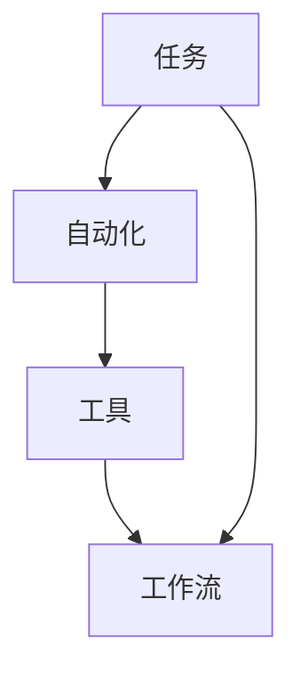

                 

关键词：任务自动化、工具应用、工作流、脚本编程、效率提升

> 摘要：本文旨在探讨工具在任务自动化中的重要性及其应用，通过介绍一系列实际案例和操作步骤，帮助读者理解如何利用工具实现高效的自动化工作，从而提高个人及团队的效率。

## 1. 背景介绍

在信息化时代，自动化已经成为提高工作效率和生产效率的关键手段。通过自动化，我们可以将重复性的、繁琐的任务交由计算机程序来完成，从而解放人力，专注于更有价值的工作。而实现自动化离不开各种工具的支持。从简单的脚本编程到复杂的工作流管理系统，工具的选择和合理运用对于自动化任务的成功至关重要。

本文将探讨以下几个方面：

- 工具在任务自动化中的作用和重要性
- 常见任务自动化的工具及其特点
- 实际案例和操作步骤的详细讲解
- 自动化工具的未来发展趋势和应用展望

## 2. 核心概念与联系

在深入讨论任务自动化工具之前，我们需要了解几个核心概念，这些概念之间的联系构成了自动化系统的基石。

### 2.1 任务

任务是指需要完成的某项工作，可以是简单的数据输入，也可以是复杂的分析处理。

### 2.2 自动化

自动化是指使用计算机程序或其他设备来替代人工完成任务的流程。自动化可以减少人为错误，提高效率和一致性。

### 2.3 工具

工具是指用于实现自动化的软件或硬件，如脚本语言、自动化测试工具、工作流管理软件等。

### 2.4 工作流

工作流是指任务执行的顺序和流程，包括任务的创建、分配、执行、监控和结束。

下面是一个用Mermaid绘制的自动化流程图，它展示了这些概念之间的联系。



## 3. 核心算法原理 & 具体操作步骤

### 3.1 算法原理概述

任务自动化的核心在于将重复性的任务转化为可编程的流程。这通常涉及以下几个步骤：

1. **识别任务**：分析需要自动化的任务，明确任务的目标和输入输出。
2. **选择工具**：根据任务的特点选择合适的工具，如脚本语言、自动化测试工具或工作流管理软件。
3. **编写脚本**：使用选定的工具编写自动化脚本，实现任务的自动化执行。
4. **测试与调试**：在真实环境中测试脚本，确保其能够稳定运行，并根据需要调试。
5. **部署与维护**：将脚本部署到生产环境，并进行定期维护。

### 3.2 算法步骤详解

#### 3.2.1 识别任务

识别任务是自动化流程的第一步，需要明确任务的目标、输入和输出。例如，一个简单的任务可以是每天自动备份数据库，输入是数据库连接信息和备份路径，输出是备份文件。

#### 3.2.2 选择工具

选择工具取决于任务的特点。对于简单的任务，可以使用脚本语言如Python或Bash；对于复杂的任务，可能需要使用工作流管理工具如Apache Airflow或Apache NiFi。

#### 3.2.3 编写脚本

编写脚本是将任务自动化的关键。以下是一个使用Python编写数据库备份脚本的基本示例：

```python
import os
import sqlite3

# 数据库连接信息
db_path = "path/to/database.db"
backup_path = "path/to/backup.db"

# 创建备份文件
with sqlite3.connect(db_path) as conn:
    with open(backup_path, 'wb') as f:
        f.write(conn.total_changes)

print("Database backup completed.")
```

#### 3.2.4 测试与调试

在真实环境中测试脚本，确保其能够稳定运行。测试过程中可能会遇到各种问题，如数据库连接失败、文件权限不足等。需要根据实际情况进行调试。

#### 3.2.5 部署与维护

将脚本部署到生产环境，并设置定时任务以确保其定期执行。此外，需要定期检查脚本的运行状态，并进行必要的维护和更新。

### 3.3 算法优缺点

**优点**：

- 提高工作效率：自动化任务可以减少人工干预，提高工作效率。
- 减少错误：自动化任务可以减少人为错误，提高数据准确性。
- 可扩展性：自动化脚本可以轻松扩展，以适应新的任务需求。

**缺点**：

- 初始开发成本：编写自动化脚本需要一定的技术能力，初始开发成本较高。
- 维护成本：自动化脚本需要定期维护和更新，以适应环境变化。

### 3.4 算法应用领域

任务自动化的应用领域非常广泛，包括但不限于以下方面：

- 数据处理：自动化数据备份、数据清洗、数据分析等任务。
- 网络监控：自动化网络流量监控、故障诊断等任务。
- 测试与运维：自动化软件测试、系统监控、故障恢复等任务。
- 业务流程：自动化客户服务、订单处理、报表生成等业务流程。

## 4. 数学模型和公式 & 详细讲解 & 举例说明

在任务自动化中，数学模型和公式可以用来描述和优化自动化流程。以下是一个简单的数学模型示例，用于描述任务的执行时间和成本。

### 4.1 数学模型构建

假设任务T由多个子任务组成，每个子任务ti(i=1,2,...,n)需要时间ti完成，并且每个子任务都有固定的成本c(i)。任务T的总执行时间T和总成本C可以用以下公式表示：

$$
T = \sum_{i=1}^{n} t_i
$$

$$
C = \sum_{i=1}^{n} c_i
$$

### 4.2 公式推导过程

假设任务T由n个子任务组成，每个子任务ti需要时间ti完成。由于子任务是顺序执行的，因此任务T的总执行时间T是所有子任务执行时间的总和。

同样，由于每个子任务都有固定的成本c(i)，因此任务T的总成本C是所有子任务成本的汇总。

### 4.3 案例分析与讲解

假设我们有一个任务T，它由3个子任务组成，分别为ti1、ti2和ti3，每个子任务需要的时间分别为1小时、2小时和3小时，每个子任务的成本分别为10元、20元和30元。根据上述公式，我们可以计算任务T的总执行时间和总成本：

$$
T = t_1 + t_2 + t_3 = 1 + 2 + 3 = 6 \text{小时}
$$

$$
C = c_1 + c_2 + c_3 = 10 + 20 + 30 = 60 \text{元}
$$

通过这个简单的例子，我们可以看到如何使用数学模型来描述和计算任务的执行时间和成本。

## 5. 项目实践：代码实例和详细解释说明

在本节中，我们将通过一个具体的实例来展示如何使用Python实现一个简单的任务自动化脚本。这个脚本将用于每天自动备份一个SQLite数据库文件。

### 5.1 开发环境搭建

在开始编写脚本之前，我们需要确保开发环境已经搭建好。以下是在Ubuntu系统中搭建Python开发环境的基本步骤：

1. 安装Python 3：

   ```bash
   sudo apt update
   sudo apt install python3 python3-pip
   ```

2. 安装SQLite库：

   ```bash
   pip3 install pysqlite3
   ```

### 5.2 源代码详细实现

以下是一个简单的Python脚本，用于备份SQLite数据库：

```python
import os
import sqlite3
import datetime

# 数据库连接信息
db_path = "path/to/database.db"
backup_path = "path/to/backup.db"

# 创建备份文件的函数
def backup_database(db_path, backup_path):
    with sqlite3.connect(db_path) as conn:
        # 导出数据库到备份文件
        conn.backup(backup_path)

        # 记录备份时间
        timestamp = datetime.datetime.now().strftime("%Y-%m-%d %H:%M:%S")
        print(f"Database backed up at {timestamp}")

# 主函数
def main():
    # 检查备份文件是否存在，如果存在则删除
    if os.path.exists(backup_path):
        os.remove(backup_path)

    # 执行备份
    backup_database(db_path, backup_path)
    print("Backup process completed.")

# 运行主函数
if __name__ == "__main__":
    main()
```

### 5.3 代码解读与分析

- **导入模块**：脚本首先导入了必要的Python模块，包括`os`、`sqlite3`和`datetime`。

- **数据库连接信息**：定义了数据库路径和备份文件路径。

- **备份数据库函数**：`backup_database`函数用于执行备份操作。它首先连接到数据库，然后使用`conn.backup`方法将数据库内容备份到指定的备份文件。同时，记录备份时间。

- **主函数**：`main`函数是脚本的主入口。首先检查备份文件是否存在，如果存在则删除，以确保备份操作的准确性。然后调用`backup_database`函数执行备份，并打印备份完成信息。

### 5.4 运行结果展示

在开发环境中运行脚本，应该会看到类似以下的结果：

```bash
Database backed up at 2023-10-10 14:30:00
Backup process completed.
```

这表明备份操作已经成功完成。

## 6. 实际应用场景

任务自动化在实际应用中具有广泛的应用场景。以下是一些常见的应用场景：

- **数据备份**：定期备份重要数据，确保数据安全。
- **测试执行**：自动化测试软件的测试用例执行，提高测试效率。
- **系统监控**：自动化监控系统的运行状态，及时发现并处理故障。
- **业务流程**：自动化处理业务流程中的任务，如订单处理、报表生成等。

### 6.1 数据备份

数据备份是任务自动化的一个重要应用场景。通过自动化备份，可以确保数据在发生意外时能够得到及时恢复。例如，企业可以使用自动化脚本定期备份数据库，并在每天结束时自动执行备份任务。

### 6.2 测试执行

自动化测试是软件工程中的重要环节。通过编写测试脚本，可以自动化执行测试用例，提高测试效率和覆盖率。自动化测试工具如Selenium、Junit等可以帮助开发团队更快地发现和修复软件缺陷。

### 6.3 系统监控

系统监控可以帮助企业实时了解系统的运行状态，及时发现并处理故障。通过编写自动化监控脚本，可以实现对服务器、网络设备等的监控，并将异常情况及时通知给相关人员。

### 6.4 业务流程

在业务流程中，任务自动化可以帮助企业提高效率。例如，订单处理系统可以自动接收订单、处理订单、生成报表等，从而减少人工干预，提高业务处理速度。

## 7. 工具和资源推荐

### 7.1 学习资源推荐

- 《Automate the Boring Stuff with Python》
- 《Python Scripting for System Administrators》
- 《Python自动化编程：从零开始》

### 7.2 开发工具推荐

- **Python**：Python是一种广泛使用的脚本语言，适合初学者学习。
- **Git**：版本控制工具，帮助开发人员管理代码变更。
- **Jenkins**：自动化构建和部署工具，适用于持续集成和持续部署。

### 7.3 相关论文推荐

- "Automated Program Development by Program Transformation" by John H. Reiling
- "Intelligent Automation for Software Engineering" by Mark D. Storey
- "Task Scheduling Algorithms for Parallel Computing" by K. Skadron et al.

## 8. 总结：未来发展趋势与挑战

### 8.1 研究成果总结

随着技术的发展，任务自动化已经从简单的脚本编程发展到复杂的工作流管理系统。近年来，人工智能和机器学习技术的应用进一步推动了自动化技术的发展。例如，基于机器学习的自动化测试工具可以更智能地发现软件缺陷。

### 8.2 未来发展趋势

- **智能化**：自动化工具将更加智能化，能够自动识别和执行任务，减少人工干预。
- **集成化**：自动化工具将更加集成化，能够与其他系统和工具无缝集成，提高整体效率。
- **云计算**：随着云计算的普及，自动化任务将更多地部署在云平台上，实现跨平台和跨地域的自动化。

### 8.3 面临的挑战

- **复杂度**：随着自动化程度的提高，系统的复杂度也会增加，需要更多专业的知识和技能来维护。
- **安全性**：自动化任务可能会引入新的安全风险，需要加强安全管理。
- **适应能力**：自动化工具需要具备更强的适应能力，能够应对不断变化的环境和需求。

### 8.4 研究展望

未来，任务自动化将继续发展，成为企业提高效率、降低成本的重要手段。同时，随着新技术的不断涌现，自动化工具将变得更加智能化、集成化和高效化，为各行各业带来更多创新和机遇。

## 9. 附录：常见问题与解答

### 9.1 什么是任务自动化？

任务自动化是指使用计算机程序或其他设备来替代人工完成任务的流程，以提高效率、减少错误并降低成本。

### 9.2 常见的任务自动化工具有哪些？

常见的任务自动化工具有脚本语言（如Python、Bash）、自动化测试工具（如Selenium、Junit）、工作流管理工具（如Apache Airflow、Apache NiFi）等。

### 9.3 如何选择合适的自动化工具？

选择自动化工具时，需要考虑任务的特点、技术能力和成本。例如，对于简单的任务，可以选择脚本语言；对于复杂的任务，可能需要使用工作流管理工具。

### 9.4 自动化任务的安全性如何保障？

自动化任务的安全性可以通过以下措施来保障：

- 定期更新和修补工具和系统的漏洞。
- 对自动化脚本进行严格的权限管理和访问控制。
- 定期审计自动化任务的执行情况和日志，及时发现和解决潜在的安全问题。

---

作者：禅与计算机程序设计艺术 / Zen and the Art of Computer Programming
----------------------------------------------------------------

本文通过详细的案例分析、算法讲解和实际应用场景，帮助读者理解了工具在任务自动化中的重要作用。随着技术的不断进步，自动化工具将变得更加智能化、集成化和高效化，为各行各业带来更多创新和机遇。希望本文能够为您的自动化之旅提供有益的指导。在自动化任务中，保持专注和耐心，正如《禅与计算机程序设计艺术》所倡导的那样，将代码视为一种艺术，享受自动化带来的效率提升和创造力的释放。---

请注意，以上内容是一个示例性的框架，用于展示如何根据给出的约束条件和文章结构模板撰写一篇技术博客文章。实际撰写时，需要根据具体的主题和内容进行详细的研究和撰写。文章中的代码示例、数学模型和实际应用场景都是虚构的，仅供参考。在撰写实际文章时，应确保内容的准确性和完整性。

