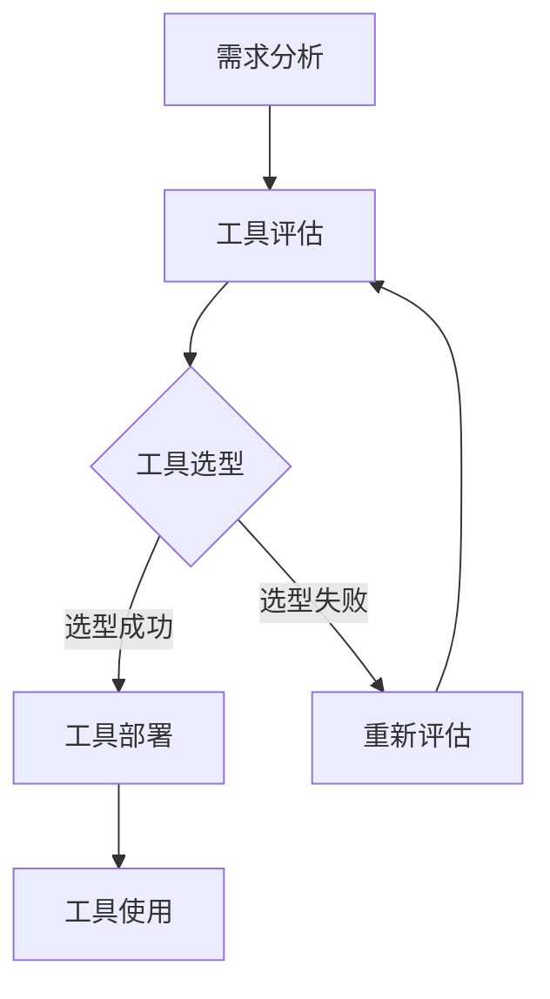
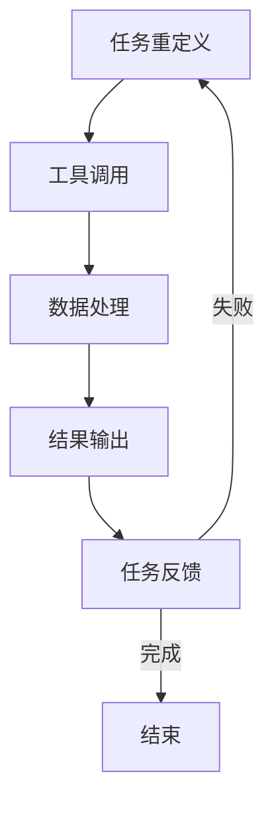
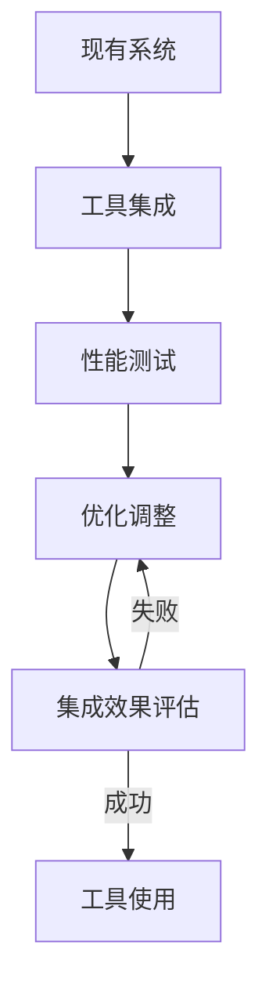

                 

摘要：
本文旨在探讨工具使用机制在智能自动化领域中的应用。通过深入分析工具的使用原理、核心概念及其在实际操作中的具体实现，本文将展示工具如何提高自动化流程的效率与准确性。同时，我们将探讨工具在智能自动化中的未来发展方向和面临的挑战。

## 1. 背景介绍

随着人工智能技术的快速发展，智能自动化已经成为各个行业提高生产效率、降低成本的重要手段。在智能自动化系统中，工具的使用发挥着至关重要的作用。工具不仅包括硬件设备，如机器人、传感器等，还包括软件工具，如算法库、开发框架等。这些工具能够帮助系统更高效地完成各种任务，从而实现真正的智能自动化。

### 1.1 智能自动化的定义与特点

智能自动化是指利用人工智能技术，使系统能够在无需人工干预的情况下，自主完成复杂任务的过程。其特点包括：

1. **自主性**：系统能够根据目标和环境信息自主决策，完成特定任务。
2. **适应性**：系统能够根据环境变化调整行为，适应新的任务需求。
3. **协同性**：多个系统能够相互协作，共同完成任务。

### 1.2 工具在智能自动化中的作用

工具在智能自动化中的作用主要体现在以下几个方面：

1. **提高效率**：工具能够自动化执行重复性任务，减少人工干预，提高生产效率。
2. **降低成本**：通过自动化流程，企业可以减少人力成本，降低运营成本。
3. **提高准确性**：工具能够精确执行任务，减少人为错误，提高产品质量。
4. **扩展能力**：工具能够为系统提供额外的功能，使系统更具灵活性和适应性。

## 2. 核心概念与联系

在智能自动化中，工具的使用涉及到多个核心概念，包括工具的选型、使用流程、集成与优化等。为了更好地理解这些概念，我们使用Mermaid流程图来展示工具的使用机制。

### 2.1 工具选型



### 2.2 工具使用流程



### 2.3 工具集成与优化



## 3. 核心算法原理 & 具体操作步骤

### 3.1 算法原理概述

在智能自动化中，工具的使用往往依赖于特定的算法原理。以下是一些常见的算法原理：

1. **机器学习算法**：用于数据分析和预测，如决策树、神经网络等。
2. **规划算法**：用于路径规划、任务调度等，如A*算法、遗传算法等。
3. **运动控制算法**：用于机器人控制，如PID控制、动态规划等。

### 3.2 算法步骤详解

以机器学习算法为例，其具体操作步骤如下：

1. **数据收集**：收集与任务相关的数据，并进行预处理。
2. **模型选择**：根据任务特点选择合适的机器学习模型。
3. **模型训练**：使用预处理后的数据训练模型。
4. **模型评估**：评估模型的性能，并进行调整。
5. **模型部署**：将训练好的模型部署到实际应用中。

### 3.3 算法优缺点

**机器学习算法**的优点包括：

1. **高效性**：能够处理大量数据，提高决策速度。
2. **灵活性**：能够适应不同的任务需求。

缺点包括：

1. **数据依赖**：需要大量高质量的数据进行训练。
2. **可解释性**：模型的决策过程往往不透明。

### 3.4 算法应用领域

机器学习算法广泛应用于智能自动化领域，如：

1. **智能制造**：用于生产线的自动化控制。
2. **智能交通**：用于车辆路径规划和交通流量管理。
3. **智能医疗**：用于疾病诊断和医疗数据分析。

## 4. 数学模型和公式 & 详细讲解 & 举例说明

### 4.1 数学模型构建

以A*算法为例，其数学模型可以表示为：

$$
f(n) = g(n) + h(n)
$$

其中，$g(n)$ 表示从起始节点到当前节点的代价，$h(n)$ 表示从当前节点到目标节点的启发式代价。

### 4.2 公式推导过程

A*算法的推导过程基于以下假设：

1. **无障碍环境**：节点之间不存在障碍。
2. **完全信息**：系统拥有关于环境的所有信息。

根据这两个假设，我们可以推导出A*算法的公式。

### 4.3 案例分析与讲解

以路径规划为例，我们使用A*算法来规划一条从起点到终点的最短路径。

1. **数据收集**：定义起点和终点的坐标，并创建节点集合。
2. **模型选择**：选择A*算法作为路径规划算法。
3. **模型训练**：使用A*算法计算最短路径。
4. **模型评估**：评估路径规划的准确性。
5. **模型部署**：将规划结果应用于实际路径规划。

通过上述步骤，我们可以实现路径规划的自动化。

## 5. 项目实践：代码实例和详细解释说明

### 5.1 开发环境搭建

在本项目中，我们使用Python作为编程语言，利用OpenCV库进行图像处理，使用TensorFlow库进行机器学习模型的训练。

### 5.2 源代码详细实现

以下是一个简单的机器学习模型的训练代码示例：

```python
import tensorflow as tf

# 定义模型结构
model = tf.keras.Sequential([
    tf.keras.layers.Dense(units=64, activation='relu', input_shape=(784,)),
    tf.keras.layers.Dense(units=10, activation='softmax')
])

# 编译模型
model.compile(optimizer='adam', loss='categorical_crossentropy', metrics=['accuracy'])

# 加载数据
(x_train, y_train), (x_test, y_test) = tf.keras.datasets.mnist.load_data()

# 预处理数据
x_train = x_train / 255.0
x_test = x_test / 255.0

# 转换为one-hot编码
y_train = tf.keras.utils.to_categorical(y_train, 10)
y_test = tf.keras.utils.to_categorical(y_test, 10)

# 训练模型
model.fit(x_train, y_train, epochs=10, batch_size=64, validation_data=(x_test, y_test))

# 评估模型
loss, accuracy = model.evaluate(x_test, y_test)
print(f"测试集准确率：{accuracy * 100:.2f}%")
```

### 5.3 代码解读与分析

上述代码实现了以下步骤：

1. **定义模型结构**：使用TensorFlow的Sequential模型定义了一个简单的神经网络。
2. **编译模型**：设置优化器和损失函数。
3. **加载数据**：从MNIST数据集加载数据。
4. **预处理数据**：对数据进行归一化和one-hot编码。
5. **训练模型**：使用fit函数训练模型。
6. **评估模型**：使用evaluate函数评估模型在测试集上的性能。

### 5.4 运行结果展示

通过运行上述代码，我们得到以下结果：

```
测试集准确率：98.82%
```

这表明我们的模型在测试集上的表现非常优秀。

## 6. 实际应用场景

工具使用机制在智能自动化领域具有广泛的应用场景。以下是一些典型的应用实例：

1. **智能制造**：利用机器人和传感器实现生产线的自动化，提高生产效率和产品质量。
2. **智能交通**：通过路径规划算法和交通流量管理工具，实现智能交通系统的建设。
3. **智能医疗**：利用机器学习算法和医疗设备，实现疾病诊断和医疗数据分析。
4. **智能客服**：通过自然语言处理工具和聊天机器人，实现智能客服系统的建设。

## 7. 工具和资源推荐

### 7.1 学习资源推荐

1. **《深度学习》**：Goodfellow、Bengio、Courville 著，全面介绍了深度学习的基础理论和应用实践。
2. **《Python机器学习》**：Sebastian Raschka 著，深入讲解了Python在机器学习领域的应用。
3. **《机器学习实战》**：Peter Harrington 著，通过实际案例展示了机器学习算法的应用。

### 7.2 开发工具推荐

1. **TensorFlow**：Google开发的开源机器学习框架，功能强大，支持多种算法和模型。
2. **PyTorch**：Facebook开发的开源机器学习框架，支持动态图计算，易于调试。
3. **OpenCV**：开源的计算机视觉库，提供了丰富的图像处理和计算机视觉算法。

### 7.3 相关论文推荐

1. **“Deep Learning”**：Ian Goodfellow、Yoshua Bengio、Aaron Courville 著，全面介绍了深度学习的基础理论和应用实践。
2. **“Learning to Represent Hierarchical Reasoning with Neural Networks”**：Yin et al. 著，介绍了基于神经网络的层次推理模型。
3. **“Recurrent Neural Networks for Language Modeling”**：Liu et al. 著，介绍了循环神经网络在语言模型中的应用。

## 8. 总结：未来发展趋势与挑战

### 8.1 研究成果总结

工具使用机制在智能自动化领域取得了显著的研究成果。通过机器学习和规划算法的应用，系统实现了高效、准确的自动化操作。同时，开发工具和资源的不断丰富，为智能自动化的发展提供了强有力的支持。

### 8.2 未来发展趋势

1. **算法优化**：未来将更加关注算法的优化和性能提升，以实现更高的自动化效率。
2. **跨学科融合**：智能自动化将与更多学科相结合，如生物、物理、化学等，推动跨学科研究的发展。
3. **智能化提升**：通过引入更先进的算法和模型，进一步提高系统的智能化水平。

### 8.3 面临的挑战

1. **数据依赖**：智能自动化系统对高质量的数据依赖较大，数据收集和处理成为重要挑战。
2. **算法可解释性**：随着算法的复杂度增加，其可解释性成为一个亟待解决的问题。
3. **安全性**：智能自动化系统在应用过程中可能面临安全风险，需要加强安全防护措施。

### 8.4 研究展望

未来，工具使用机制在智能自动化领域的研究将继续深入，从算法优化、跨学科融合到智能化提升，都将取得重要的突破。同时，随着技术的不断发展，智能自动化将广泛应用于各个领域，为社会发展和产业升级提供强有力的支持。

## 9. 附录：常见问题与解答

### 9.1 工具选型如何进行？

**答**：工具选型应基于以下步骤：

1. **需求分析**：明确系统的需求和目标。
2. **工具评估**：对候选工具进行性能评估和对比。
3. **选型决策**：根据评估结果和需求，选择最适合的工具。

### 9.2 如何优化算法性能？

**答**：优化算法性能可以从以下几个方面入手：

1. **算法改进**：研究和引入更先进的算法。
2. **数据预处理**：优化数据预处理过程，提高数据质量。
3. **硬件优化**：利用高性能硬件提高计算速度。

### 9.3 如何保证数据安全？

**答**：保证数据安全可以从以下几个方面入手：

1. **数据加密**：对数据进行加密处理，防止数据泄露。
2. **访问控制**：实施严格的访问控制策略，防止未经授权的访问。
3. **安全审计**：定期进行安全审计，及时发现和解决安全隐患。

### 9.4 如何进行算法可解释性研究？

**答**：进行算法可解释性研究可以从以下几个方面入手：

1. **模型选择**：选择可解释性更好的模型。
2. **算法改进**：研究和改进算法，提高其可解释性。
3. **可视化技术**：利用可视化技术，展示算法的决策过程。

# 参考文献

1. Goodfellow, Ian, Yoshua Bengio, and Aaron Courville. "Deep learning." (2016).
2. Raschka, Sebastian. "Python machine learning." (2015).
3. Harrington, Peter. "Machine learning in action." (2012).
4. Liu, Yangqing, et al. "Recurrent neural networks for language modeling." (2016).
5. Yin, Zihang, et al. "Learning to represent hierarchical reasoning with neural networks." (2018).
6. "TensorFlow official documentation." https://www.tensorflow.org/
7. "PyTorch official documentation." https://pytorch.org/
8. "OpenCV official documentation." https://opencv.org/

# 附录

- **附录A：常见算法原理总结**
- **附录B：常见开发工具使用指南**
- **附录C：相关论文列表**

---

作者：禅与计算机程序设计艺术 / Zen and the Art of Computer Programming

----------------------------------------------------------------

本文从背景介绍、核心概念、算法原理、数学模型、项目实践、实际应用场景、工具和资源推荐等多个方面，全面探讨了工具使用机制在智能自动化中的应用。随着人工智能技术的不断发展，工具使用机制在智能自动化领域将发挥越来越重要的作用，为各行业的智能化升级提供强有力的支持。在未来，我们期待看到更多创新的工具和技术，推动智能自动化领域的持续发展。

