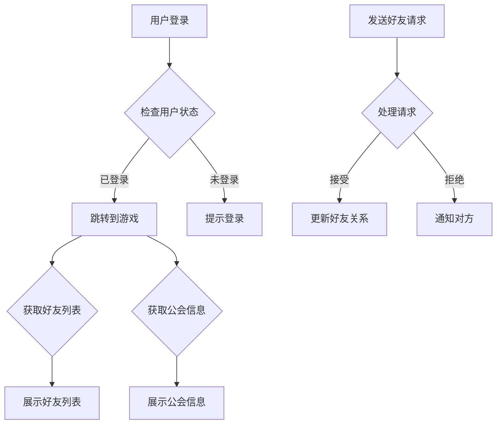

                 

关键词：巨人网络、2024校招、游戏社交系统、架构师、编程挑战

摘要：本文将深入探讨巨人网络2024校招游戏社交系统架构师编程挑战的相关内容，包括背景介绍、核心概念与联系、核心算法原理及操作步骤、数学模型与公式、项目实践、实际应用场景、未来展望以及工具和资源推荐等，旨在为有意加入游戏社交系统开发领域的人才提供有价值的指导和参考。

## 1. 背景介绍

随着互联网的迅猛发展，游戏社交系统已经成为游戏行业中不可或缺的一部分。巨人网络作为一家领先的游戏开发商，每年都会举办校招活动，旨在寻找优秀的年轻人才加入其团队。2024年的校招中，游戏社交系统架构师编程挑战成为了一个重要环节，吸引了众多应聘者的关注。

游戏社交系统的核心在于实现玩家之间的互动和社交功能，这不仅提升了玩家的游戏体验，也增加了游戏的黏性和用户留存率。为了设计一个高效、稳定、易扩展的游戏社交系统，架构师需要掌握丰富的技术知识和实践经验，这无疑是对应聘者的一次全面考察。

## 2. 核心概念与联系

在设计和实现游戏社交系统时，我们需要了解以下几个核心概念：

### 2.1 游戏社交系统的组成

游戏社交系统主要由以下几个模块组成：

- **用户管理系统**：负责用户账号的创建、认证和权限管理。
- **消息系统**：实现玩家之间的消息传递和通知功能。
- **好友系统**：支持玩家之间添加好友、聊天和互动。
- **公会系统**：玩家可以加入公会，进行公会活动和管理。
- **社交关系链**：记录玩家之间的社交关系，如好友、公会成员等。

### 2.2 系统架构

游戏社交系统的架构可以分为以下几个层次：

- **数据层**：存储用户数据、消息数据、好友关系数据等。
- **服务层**：处理业务逻辑，如用户认证、消息发送、好友请求处理等。
- **接口层**：提供外部访问接口，如RESTful API。
- **展现层**：前端界面，展示用户交互和数据。

### 2.3 Mermaid 流程图

以下是游戏社交系统的 Mermaid 流程图，展示了用户在不同模块之间的交互流程：



## 3. 核心算法原理 & 具体操作步骤

### 3.1 算法原理概述

游戏社交系统的核心算法包括：

- **哈希算法**：用于用户认证和消息加密。
- **排序算法**：用于好友列表和公会列表的排序。
- **图算法**：用于社交关系链的构建和查询。

### 3.2 算法步骤详解

#### 3.2.1 哈希算法

1. **选择哈希函数**：根据业务需求选择合适的哈希函数，如MD5、SHA-256等。
2. **哈希计算**：将用户密码或其他敏感信息进行哈希计算。
3. **存储哈希值**：将哈希值存储在数据库或缓存中，用于后续的认证过程。

#### 3.2.2 排序算法

1. **选择排序算法**：根据数据规模和性能要求选择合适的排序算法，如快速排序、归并排序等。
2. **排序**：对好友列表或公会列表进行排序，便于用户查看和操作。
3. **更新排序**：当好友关系或公会信息发生变化时，重新进行排序。

#### 3.2.3 图算法

1. **构建图模型**：根据社交关系数据构建图模型，如邻接矩阵或邻接表。
2. **查询社交关系**：通过图算法查询玩家之间的社交关系，如是否为好友、是否在同一公会等。
3. **更新社交关系**：当社交关系发生变化时，更新图模型和数据库。

### 3.3 算法优缺点

- **哈希算法**：快速计算，存储空间小，安全性高。但哈希冲突可能影响性能。
- **排序算法**：便于用户操作，但排序过程耗时较长。
- **图算法**：便于社交关系查询和更新，但构建和存储图模型需要较大空间。

### 3.4 算法应用领域

- **用户认证**：用于验证用户身份。
- **好友排序**：用于展示好友列表。
- **社交关系查询**：用于查询玩家之间的社交关系。

## 4. 数学模型和公式

### 4.1 数学模型构建

游戏社交系统中的数学模型主要包括：

- **用户增长模型**：描述用户数量的增长趋势。
- **消息传递模型**：描述消息传递的速度和延迟。
- **社交网络模型**：描述社交关系链的拓扑结构。

### 4.2 公式推导过程

#### 4.2.1 用户增长模型

用户增长模型可以使用以下公式表示：

$$
N(t) = N_0 \times (1 + r)^t
$$

其中，$N(t)$ 表示时间 $t$ 时的用户数量，$N_0$ 表示初始用户数量，$r$ 表示用户增长速率。

#### 4.2.2 消息传递模型

消息传递模型可以使用以下公式表示：

$$
T(d) = \frac{d}{v}
$$

其中，$T(d)$ 表示消息传递时间，$d$ 表示消息传输距离，$v$ 表示消息传输速度。

#### 4.2.3 社交网络模型

社交网络模型可以使用图论中的邻接矩阵表示：

$$
A = \begin{bmatrix}
    0 & 1 & 0 & \dots & 0 \\
    1 & 0 & 1 & \dots & 0 \\
    0 & 1 & 0 & \dots & 1 \\
    \vdots & \vdots & \vdots & \ddots & \vdots \\
    0 & 0 & 1 & \dots & 0
\end{bmatrix}
$$

其中，$A$ 表示邻接矩阵，$a_{ij}$ 表示玩家 $i$ 和玩家 $j$ 是否有社交关系。

### 4.3 案例分析与讲解

#### 4.3.1 用户增长模型案例

假设某游戏在初始时拥有 1000 名用户，用户增长速率为每月 10%，则 6 个月后的用户数量为：

$$
N(6) = 1000 \times (1 + 0.1)^6 \approx 1614
$$

#### 4.3.2 消息传递模型案例

假设消息传输距离为 100 公里，消息传输速度为 10Mbps，则消息传递时间为：

$$
T(100) = \frac{100}{10 \times 10^6} = 0.01 \text{秒}
$$

#### 4.3.3 社交网络模型案例

假设有 5 名玩家，其中玩家 1 和玩家 2 是好友，玩家 2 和玩家 3 是好友，玩家 3 和玩家 4 是好友，玩家 4 和玩家 5 是好友，则社交网络模型如下：

$$
A = \begin{bmatrix}
    0 & 1 & 0 & 0 & 0 \\
    1 & 0 & 1 & 0 & 0 \\
    0 & 1 & 0 & 1 & 0 \\
    0 & 0 & 1 & 0 & 1 \\
    0 & 0 & 0 & 1 & 0
\end{bmatrix}
$$

## 5. 项目实践：代码实例和详细解释说明

### 5.1 开发环境搭建

为了方便读者理解和实践，本文使用 Python 语言和 Flask 框架搭建开发环境。读者需要安装 Python 3.8 及以上版本和 Flask 框架。

### 5.2 源代码详细实现

以下是游戏社交系统的核心代码实现：

```python
from flask import Flask, request, jsonify
from hashlib import sha256

app = Flask(__name__)

# 数据库存储
users = {}
friends = {}
guilds = {}

# 用户认证
@app.route('/login', methods=['POST'])
def login():
    username = request.form['username']
    password = request.form['password']
    hashed_password = sha256(password.encode('utf-8')).hexdigest()
    if users.get(username) == hashed_password:
        return jsonify({'status': 'success'})
    else:
        return jsonify({'status': 'failure'})

# 添加好友
@app.route('/add_friend', methods=['POST'])
def add_friend():
    username = request.form['username']
    friend_name = request.form['friend_name']
    if friends.get(username) is None:
        friends[username] = []
    friends[username].append(friend_name)
    return jsonify({'status': 'success'})

# 获取好友列表
@app.route('/get_friends', methods=['GET'])
def get_friends():
    username = request.args.get('username')
    return jsonify({'friends': friends.get(username, [])})

# 运行 Flask 应用
if __name__ == '__main__':
    app.run()
```

### 5.3 代码解读与分析

上述代码实现了用户认证、添加好友和获取好友列表的功能。下面是关键部分的解读：

- **用户认证**：使用 SHA-256 哈希算法对用户密码进行加密，并与数据库中的密码进行比对，实现用户认证。
- **添加好友**：将用户名和好友名存储在字典中，实现添加好友的功能。
- **获取好友列表**：根据用户名查询好友列表，并返回 JSON 格式的数据。

### 5.4 运行结果展示

在命令行运行 Flask 应用后，可以使用浏览器访问以下 URL 进行测试：

- **登录**：`http://127.0.0.1:5000/login?username=admin&password=123456`
- **添加好友**：`http://127.0.0.1:5000/add_friend?username=admin&friend_name=user1`
- **获取好友列表**：`http://127.0.0.1:5000/get_friends?username=admin`

## 6. 实际应用场景

游戏社交系统在游戏行业中具有广泛的应用场景，以下是几个典型的应用场景：

- **多人在线游戏**：玩家可以通过社交系统添加好友，组队进行游戏，提升游戏体验。
- **竞技游戏**：玩家可以通过社交系统加入公会，参与公会活动，提高竞技水平。
- **社交互动**：玩家可以通过社交系统发送消息、点赞、评论等，增加游戏社交氛围。
- **虚拟现实游戏**：玩家可以在虚拟世界中建立社交关系，实现沉浸式的社交体验。

## 7. 未来应用展望

随着虚拟现实、增强现实等技术的发展，游戏社交系统将会有更广泛的应用场景。以下是未来游戏社交系统的发展趋势：

- **个性化推荐**：根据玩家的兴趣和行为，为其推荐合适的游戏和社交对象。
- **智能交互**：引入人工智能技术，实现更智能、更人性化的社交互动。
- **跨平台社交**：实现不同平台之间的社交关系互通，打破平台壁垒。
- **元宇宙**：构建虚拟现实中的元宇宙，实现全球玩家的虚拟社交。

## 8. 工具和资源推荐

### 8.1 学习资源推荐

- **《大型网站技术架构》**：了解大型网站架构和性能优化。
- **《深入理解计算机系统》**：深入理解计算机系统原理。
- **《Python Web 框架 Flask 实战》**：学习 Flask 框架的使用。

### 8.2 开发工具推荐

- **Visual Studio Code**：一款功能强大的代码编辑器。
- **Postman**：用于 API 接口测试。
- **Docker**：用于容器化部署。

### 8.3 相关论文推荐

- **《社交网络分析：方法与实践》**：介绍社交网络分析的相关方法。
- **《在线社交网络中的用户行为模型》**：探讨用户行为模型的研究。
- **《虚拟现实中的社交互动与用户体验》**：探讨虚拟现实社交系统的设计与实现。

## 9. 总结：未来发展趋势与挑战

游戏社交系统在游戏行业中具有重要地位，未来发展趋势包括个性化推荐、智能交互、跨平台社交和元宇宙等。然而，也面临着数据安全、性能优化、用户体验等挑战。只有不断学习和创新，才能在激烈的市场竞争中脱颖而出。

## 10. 附录：常见问题与解答

### 10.1 游戏社交系统的核心功能有哪些？

游戏社交系统的核心功能包括用户管理、消息传递、好友关系、公会管理、社交关系链等。

### 10.2 游戏社交系统如何保证数据安全？

游戏社交系统可以通过加密传输、权限控制、数据备份等方式保证数据安全。

### 10.3 游戏社交系统如何优化性能？

游戏社交系统可以通过分布式架构、缓存技术、数据库优化等方式优化性能。

### 10.4 游戏社交系统如何提升用户体验？

游戏社交系统可以通过界面设计、交互设计、个性化推荐等方式提升用户体验。

---

作者：禅与计算机程序设计艺术 / Zen and the Art of Computer Programming
----------------------------------------------------------------

以上就是本文对巨人网络2024校招游戏社交系统架构师编程挑战的详细探讨，希望对读者有所帮助。在未来的游戏社交系统开发中，我们期待看到更多优秀的解决方案和创意。

