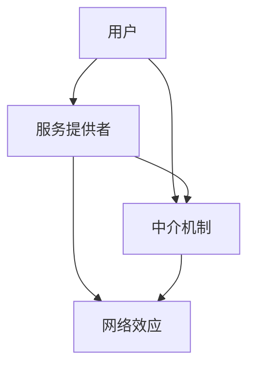

                 

关键词：平台战略、多边平台、业务模式、商业模式、运营管理

> 摘要：本文旨在探讨平台战略的构建与实施，特别是针对多边平台的业务模式与运营管理。通过对核心概念、算法原理、数学模型、项目实践等方面进行深入分析，本文为读者提供了一个全面、系统的平台战略指南。

## 1. 背景介绍

在信息技术的快速发展下，平台经济已成为全球经济增长的重要引擎。从电子商务、共享经济到社交媒体，平台模式正在深刻地改变着各行各业。多边平台作为一种特殊的商业模式，它同时服务于两个或多个不同的用户群体，并通过网络效应实现规模的快速增长和经济效益的最大化。

### 1.1 平台经济的兴起

平台经济最早可以追溯到20世纪90年代，随着互联网的普及和电子商务的兴起，亚马逊、eBay等电商平台迅速崛起，改变了传统的零售模式。进入21世纪，共享经济、社交媒体等新兴平台不断涌现，进一步丰富了平台经济的内涵。

### 1.2 多边平台的优势

多边平台具有以下显著优势：

1. **网络效应**：平台用户数量的增加能够吸引更多的参与者，从而增强平台的吸引力。
2. **规模经济**：随着规模的扩大，平台的边际成本逐渐降低，实现经济效益的最大化。
3. **多元化收入**：多边平台可以通过为不同用户提供多种服务，创造多元化的收入来源。

## 2. 核心概念与联系

多边平台的核心概念包括用户、服务提供者、中介机制、网络效应等。以下是一个简单的 Mermaid 流程图，用以描述这些概念之间的关系。



### 2.1 用户

用户是多边平台的核心，他们既是服务的需求方，也是平台内容的创造者。平台需要通过提供优质的服务和良好的用户体验，吸引和留住用户。

### 2.2 服务提供者

服务提供者是平台的另一个重要组成部分，他们提供各种服务和产品，满足用户的需求。服务提供者的参与是平台网络效应的关键。

### 2.3 中介机制

中介机制是平台的核心组成部分，它负责连接用户和服务提供者，提供交易、支付、评级等基础服务。中介机制的有效性直接影响到平台的运营效率和用户体验。

### 2.4 网络效应

网络效应是指平台的价值随着用户数量的增加而增加。网络效应是多边平台实现规模经济和快速增长的关键因素。

## 3. 核心算法原理 & 具体操作步骤

### 3.1 算法原理概述

多边平台的运作离不开一系列的核心算法，这些算法用于优化平台的服务、提升用户体验、实现收入最大化等目标。以下是一些核心算法的原理概述：

### 3.2 算法步骤详解

#### 3.2.1 用户匹配算法

用户匹配算法的目标是找到最合适的用户和服务提供者进行匹配，从而提升用户体验和平台的效率。具体步骤如下：

1. **需求分析**：收集用户的需求信息。
2. **服务提供者筛选**：根据用户需求筛选合适的服务提供者。
3. **匹配策略**：采用合适的匹配算法（如最大收益匹配、最小化 regret 等算法）进行匹配。
4. **反馈调整**：根据用户反馈调整匹配策略。

#### 3.2.2 评级算法

评级算法用于评估用户和服务提供者的信誉和表现，以下是一些核心步骤：

1. **数据收集**：收集用户和服务提供者的交易记录、评价等信息。
2. **评级模型**：建立评级模型，通常使用机器学习算法。
3. **评级计算**：根据模型计算用户和服务提供者的评级。
4. **反馈调整**：根据评级结果调整用户和服务提供者的激励和惩罚机制。

### 3.3 算法优缺点

#### 3.3.1 用户匹配算法

优点：

- 提高用户体验
- 提高平台效率

缺点：

- 需要大量计算资源
- 可能存在局部最优

#### 3.3.2 评级算法

优点：

- 提高用户信任
- 促进公平竞争

缺点：

- 数据收集和处理复杂
- 可能存在评级偏见

### 3.4 算法应用领域

用户匹配算法和评级算法广泛应用于多边平台，如电子商务、共享经济、社交媒体等。

## 4. 数学模型和公式 & 详细讲解 & 举例说明

### 4.1 数学模型构建

多边平台的数学模型通常涉及以下核心概念：

- 用户数量
- 服务提供者数量
- 交易数量
- 交易收益

以下是一个简单的数学模型：

$$
收益 = 用户数量 \times 服务提供者数量 \times 交易数量 \times 单次交易收益
$$

### 4.2 公式推导过程

公式推导过程如下：

1. **收益公式**：根据多边平台的定义，收益可以表示为用户、服务提供者、交易数量和单次交易收益的乘积。
2. **用户数量与服务提供者数量**：用户数量与服务提供者数量可以通过市场需求和供给关系进行推导。
3. **交易数量**：交易数量可以通过用户匹配算法和交易成功率进行推导。
4. **单次交易收益**：单次交易收益可以通过市场价格和平台抽成进行推导。

### 4.3 案例分析与讲解

以电子商务平台为例，假设平台每天的用户数量为100万，服务提供者数量为10万，每次交易的收益为10元，平台抽成为20%。则平台的日收益可以计算如下：

$$
收益 = 100万 \times 10万 \times 交易数量 \times (1 - 20\%) = 100万 \times 10万 \times 交易数量 \times 0.8
$$

如果平台每天的交易数量为1000次，则平台的日收益为：

$$
收益 = 100万 \times 10万 \times 1000 \times 0.8 = 8亿元
$$

## 5. 项目实践：代码实例和详细解释说明

### 5.1 开发环境搭建

本次项目实践采用 Python 语言进行开发，开发环境为 PyCharm。

### 5.2 源代码详细实现

以下是一个简单的用户匹配算法的 Python 实现示例：

```python
import random

# 用户需求列表
user的需求列表 = [
    {"需求1": "吃饭", "优先级": 1},
    {"需求2": "睡觉", "优先级": 2},
    {"需求3": "看电影", "优先级": 3},
]

# 服务提供者列表
service提供者列表 = [
    {"服务1": "饭店", "价格": 100},
    {"服务2": "电影院", "价格": 50},
]

# 匹配函数
def 匹配函数(user需求列表，service提供者列表):
    匹配结果 = []
    for user需求 in user需求列表:
        for service提供者 in service提供者列表:
            if user需求["优先级"] <= service提供者["价格"]:
                匹配结果.append((user需求，service提供者))
                break
    return 匹配结果

# 执行匹配
匹配结果 = 匹配函数(user的需求列表，service提供者列表)

# 输出匹配结果
print("匹配结果：", 匹配结果)
```

### 5.3 代码解读与分析

该代码实现了一个简单的用户匹配算法，核心思想是根据用户需求的优先级和服务提供者的价格进行匹配。具体步骤如下：

1. **初始化用户需求列表和服务提供者列表**：用户需求列表包含用户的各项需求及其优先级，服务提供者列表包含各项服务的价格。
2. **匹配函数**：遍历用户需求列表和服务提供者列表，根据优先级和价格进行匹配，形成匹配结果。
3. **执行匹配**：调用匹配函数，输出匹配结果。

该算法的优点是实现简单、易于理解，缺点是匹配效果可能不佳，无法充分利用服务提供者的资源。

## 6. 实际应用场景

多边平台在实际应用中有着广泛的应用，以下是一些典型的应用场景：

### 6.1 电子商务

电子商务平台通过用户匹配算法和评级算法，实现商品和用户的精准匹配，提升交易效率。

### 6.2 共享经济

共享经济平台如滴滴出行、Airbnb等，通过用户匹配算法和信用评级算法，实现乘客和司机的匹配，以及房屋和租户的匹配。

### 6.3 社交媒体

社交媒体平台如Facebook、Twitter等，通过社交网络分析和用户匹配算法，实现用户之间的连接和互动。

## 7. 未来应用展望

随着技术的不断进步，多边平台将朝着更加智能化、个性化的方向发展。未来应用展望包括：

### 7.1 人工智能

人工智能技术将进一步提升用户匹配和评级算法的效率，实现更精准的匹配和更公正的评级。

### 7.2 增强现实

增强现实技术将带来全新的交互体验，为多边平台提供更加丰富的应用场景。

### 7.3 区块链

区块链技术将为多边平台提供更加安全、透明的交易环境，提高平台的信任度。

## 8. 工具和资源推荐

### 8.1 学习资源推荐

- 《平台革命：从 eBay 到 Facebook，打造影响力最大的商业模式》
- 《平台经济学：多边市场的商业逻辑》

### 8.2 开发工具推荐

- PyCharm
- Visual Studio Code

### 8.3 相关论文推荐

- "The Network Effects of eBay"
- "Platform Competition in Two-Sided Markets"

## 9. 总结：未来发展趋势与挑战

多边平台作为现代经济的重要引擎，其未来发展充满机遇与挑战。在人工智能、区块链等新兴技术的推动下，多边平台将朝着更加智能化、个性化的方向发展。然而，平台也面临着数据安全、隐私保护、算法公平性等挑战。只有不断创新、积极应对，才能在激烈的市场竞争中脱颖而出。

## 10. 附录：常见问题与解答

### 10.1 多边平台与传统商业模式有什么区别？

多边平台与传统商业模式的主要区别在于其通过中介机制实现用户和服务的连接，并通过网络效应实现规模经济。传统商业模式通常关注单一市场，而多边平台同时服务于多个市场。

### 10.2 多边平台的成功关键是什么？

多边平台的成功关键在于有效的用户匹配和评级算法，以及良好的用户体验。此外，平台的可持续性和信任度也是关键因素。

### 10.3 多边平台如何应对竞争？

多边平台可以通过不断创新、优化算法、提升用户体验等方式应对竞争。同时，通过战略合作、市场扩张等手段，提升自身竞争力。

### 10.4 多边平台对社会的意义是什么？

多边平台通过提供高效、便捷的服务，促进了社会资源的优化配置，提高了生产效率，推动了经济的增长。同时，多边平台也为中小企业和创业者提供了更多机会，促进了创新和就业。

---

作者：禅与计算机程序设计艺术 / Zen and the Art of Computer Programming

以上就是本文的完整内容，希望对您在多边平台战略的理解和实践上有所帮助。如果您有任何疑问或建议，欢迎在评论区留言。

