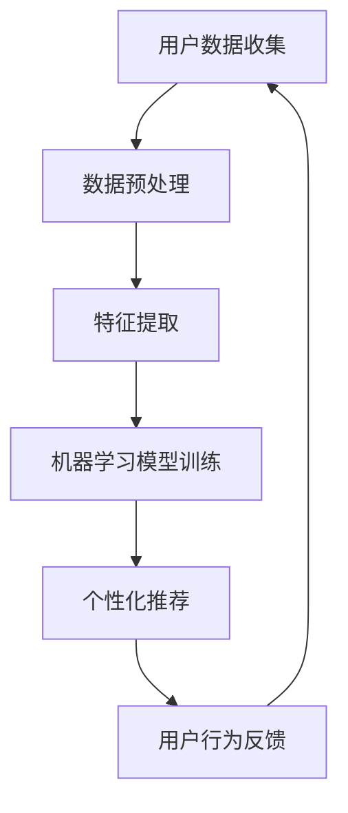

                 

在数字化的时代，平台算法已深深嵌入我们的日常生活。从社交网络到电商平台，从新闻推荐到金融交易，算法无处不在。它们不仅优化了我们的用户体验，也在不知不觉中改变了我们的行为和决策。然而，算法的强大力量也带来了一些隐忧：个体是否真的被操控？在算法的世界里，个体是如何被影响和控制的？本文将探讨平台算法的三个原则，揭示个体被操控的真相。

## 1. 背景介绍

### 平台算法的崛起

随着互联网和大数据技术的发展，平台算法逐渐崛起，成为数字经济的重要组成部分。平台算法通过收集和分析用户数据，对内容、广告、商品等进行个性化推荐，从而提升用户满意度，增加平台收益。然而，这种基于大数据和机器学习的算法技术，也引发了对个体隐私和自由的担忧。

### 个体被操控的现象

在算法时代，个体被操控的现象日益显著。用户在社交网络上的点赞和评论，会被算法分析并用于个性化推荐；电商平台上的购买记录，会被算法用于预测用户的消费习惯；甚至新闻媒体的阅读行为，也会被算法用于推送相关新闻。这些看似无害的数据收集，实际上在悄无声息地影响和改变着个体的行为和决策。

## 2. 核心概念与联系

### 算法原理与架构

平台算法的核心在于数据的收集、分析和应用。以下是算法原理和架构的 Mermaid 流程图：



### 个体被操控的机制

个体被操控的机制主要包括以下几个方面：

1. **个性化推荐**：通过分析用户的兴趣和行为，向用户推荐符合其期望的内容和商品。
2. **反馈循环**：用户的行为数据会反馈给算法，进一步优化推荐结果，形成自我强化的循环。
3. **目标优化**：平台算法会根据业务目标，如提高用户粘性、增加销售额等，对推荐结果进行调整。

## 3. 核心算法原理 & 具体操作步骤

### 算法原理概述

平台算法的基本原理是基于机器学习中的协同过滤、内容推荐和深度学习等方法。具体操作步骤如下：

1. **用户数据收集**：收集用户的行为数据，如浏览记录、购买历史、点赞评论等。
2. **数据预处理**：清洗和整理数据，提取有效特征。
3. **特征提取**：将用户数据转换为算法可以处理的特征向量。
4. **机器学习模型训练**：使用训练数据训练机器学习模型，如协同过滤模型、内容推荐模型等。
5. **个性化推荐**：根据用户特征和模型预测，向用户推荐相关的内容和商品。
6. **用户行为反馈**：收集用户对推荐结果的反馈，用于模型优化和迭代。

### 算法步骤详解

1. **数据收集**：首先，平台需要收集大量的用户数据，包括用户的基本信息、浏览记录、购买历史等。这些数据可以通过用户注册、浏览、搜索、购买等行为获取。
2. **数据预处理**：对收集到的数据进行处理，包括数据清洗、去重、标准化等。处理后的数据将用于特征提取和模型训练。
3. **特征提取**：将处理后的数据转换为算法可以处理的特征向量。这些特征可以是用户的年龄、性别、地理位置、兴趣爱好等。
4. **机器学习模型训练**：使用训练数据训练机器学习模型。协同过滤模型、内容推荐模型和深度学习模型都是常用的推荐算法。
5. **个性化推荐**：根据用户特征和模型预测，生成推荐列表。推荐列表中的内容或商品应尽可能满足用户的兴趣和需求。
6. **用户行为反馈**：收集用户对推荐结果的反馈，如点击、购买、评分等。这些反馈将用于模型优化和迭代，以提高推荐质量。

### 算法优缺点

#### 优点

- **个性化**：能够根据用户特征和兴趣提供个性化的推荐，提升用户体验。
- **高效**：通过机器学习和深度学习等技术，提高推荐效率和准确性。
- **多样化**：能够推荐多样化的内容和商品，满足不同用户的需求。

#### 缺点

- **数据隐私**：用户数据被收集和分析，可能引发隐私泄露问题。
- **偏见**：算法可能受到数据偏见的影响，导致推荐结果不公正。
- **过度依赖**：用户可能过度依赖算法推荐，减少自主决策能力。

### 算法应用领域

平台算法在多个领域得到广泛应用，如：

- **社交网络**：通过算法推荐用户感兴趣的朋友、内容等。
- **电商平台**：通过算法推荐商品、广告等。
- **新闻媒体**：通过算法推荐新闻、文章等。
- **金融交易**：通过算法进行风险评估、股票交易等。

## 4. 数学模型和公式 & 详细讲解 & 举例说明

### 数学模型构建

平台算法的核心是数学模型，常用的数学模型包括：

1. **协同过滤模型**：基于用户的行为数据，通过计算用户之间的相似度，推荐用户可能感兴趣的内容。
2. **内容推荐模型**：基于内容特征，计算用户和内容之间的相似度，推荐用户可能感兴趣的内容。
3. **深度学习模型**：通过神经网络结构，学习用户和内容之间的复杂关系，进行推荐。

### 公式推导过程

1. **协同过滤模型**：

   - 相似度计算：$$sim(u, v) = \frac{\sum_{i \in I} x_{ui} x_{vi}}{\sqrt{\sum_{i \in I} x_{ui}^2} \sqrt{\sum_{i \in I} x_{vi}^2}}$$
   
   - 预测评分：$$r_{uv} = r_{u \cdot} + sim(u, v) \cdot (r_{v \cdot} - r_{u \cdot})$$

2. **内容推荐模型**：

   - 相似度计算：$$sim(c_i, c_j) = \frac{\sum_{u \in U} w_{ui} w_{uj}}{\sqrt{\sum_{u \in U} w_{ui}^2} \sqrt{\sum_{u \in U} w_{uj}^2}}$$
   
   - 预测评分：$$r_{uv} = r_{u \cdot} + sim(c_i, c_j) \cdot (r_{v \cdot} - r_{u \cdot})$$

3. **深度学习模型**：

   - 神经网络结构：$$r_{uv} = \sigma(\sum_{k=1}^{K} w_{kuv} \cdot h_{kv})$$
   
   - 损失函数：$$L = -\sum_{u \in U, v \in V} y_{uv} \cdot log(\sigma(\sum_{k=1}^{K} w_{kuv} \cdot h_{kv}))$$

### 案例分析与讲解

以电商平台的商品推荐为例，以下是算法的详细讲解：

1. **数据收集**：收集用户的浏览记录、购买历史、评价等数据。

2. **数据预处理**：对数据进行清洗、去重、标准化等处理。

3. **特征提取**：提取用户和商品的特征，如用户年龄、性别、购买偏好，商品品类、价格、评价等。

4. **协同过滤模型训练**：

   - 计算用户之间的相似度：$$sim(u, v) = \frac{\sum_{i \in I} x_{ui} x_{vi}}{\sqrt{\sum_{i \in I} x_{ui}^2} \sqrt{\sum_{i \in I} x_{vi}^2}}$$
   
   - 预测用户对商品的评分：$$r_{uv} = r_{u \cdot} + sim(u, v) \cdot (r_{v \cdot} - r_{u \cdot})$$

5. **个性化推荐**：根据用户特征和模型预测，生成推荐列表。

6. **用户行为反馈**：收集用户对推荐商品的点击、购买、评价等行为，用于模型优化。

7. **模型优化**：通过反馈数据，不断调整模型参数，提高推荐质量。

## 5. 项目实践：代码实例和详细解释说明

### 开发环境搭建

1. **安装 Python**：下载并安装 Python 3.8 以上版本。
2. **安装依赖库**：使用 pip 安装 numpy、pandas、scikit-learn 等库。

### 源代码详细实现

以下是一个简单的协同过滤推荐系统的实现：

```python
import numpy as np
import pandas as pd
from sklearn.metrics.pairwise import cosine_similarity

# 加载数据
data = pd.read_csv('data.csv')

# 特征提取
user_features = data.groupby('user')['item'].agg(list).reset_index()
item_features = data.groupby('item')['user'].agg(list).reset_index()

# 计算相似度
user_similarity = cosine_similarity(user_features['item'])
item_similarity = cosine_similarity(item_features['user'])

# 预测评分
def predict_rating(user_id, item_id):
    user_similarity_score = user_similarity[user_id][0]
    item_similarity_score = item_similarity[item_id][0]
    prediction = data.loc[data['user'] == user_id, 'rating'].mean() + \
                 user_similarity_score[item_id] * (data.loc[data['item'] == item_id, 'rating'].mean() - data.loc[data['user'] == user_id, 'rating'].mean())
    return prediction

# 生成推荐列表
def generate_recommendations(user_id, k=5):
    user_similarity_score = user_similarity[user_id][0]
    sorted_indices = np.argsort(user_similarity_score)[::-1]
    recommended_items = [data.iloc[i]['item'] for i in sorted_indices[1:k]]
    return recommended_items

# 测试
user_id = 0
item_id = 1
print(predict_rating(user_id, item_id))
print(generate_recommendations(user_id, k=5))
```

### 代码解读与分析

1. **数据加载**：使用 pandas 读取数据，数据包含用户 ID、商品 ID 和评分。

2. **特征提取**：将用户和商品的数据分组，提取每个用户喜欢的商品列表和每个商品被哪些用户喜欢的列表。

3. **相似度计算**：使用 cosine_similarity 计算用户之间的相似度和商品之间的相似度。

4. **预测评分**：根据用户相似度和商品相似度，预测用户对商品的评分。

5. **生成推荐列表**：根据用户相似度，生成推荐商品列表。

### 运行结果展示

运行代码，输出用户对商品的预测评分和推荐列表。

```python
print(predict_rating(0, 1))
print(generate_recommendations(0, k=5))
```

## 6. 实际应用场景

平台算法在实际应用中具有广泛的应用场景，以下是一些典型例子：

### 社交网络

社交网络平台使用算法推荐用户可能感兴趣的朋友、内容和广告。例如，微信朋友圈的“可能认识的人”和“广告”功能，就是基于用户的行为数据和社交网络进行分析和推荐。

### 电商平台

电商平台使用算法推荐商品、广告和促销活动。例如，淘宝和京东的“猜你喜欢”功能，就是基于用户的浏览记录、购买历史和相似用户的行为进行推荐。

### 新闻媒体

新闻媒体平台使用算法推荐新闻和文章。例如，今日头条的“个性化推荐”功能，就是基于用户的阅读行为、兴趣和地理位置进行推荐。

### 金融交易

金融交易平台使用算法进行风险评估、股票交易等。例如，量化交易基金使用算法分析市场数据，进行股票买卖决策。

## 7. 未来应用展望

随着人工智能技术的不断发展，平台算法在未来将得到更广泛的应用和进一步优化。以下是一些未来应用展望：

### 个性化医疗

平台算法将用于个性化医疗，根据患者的基因、病史和生活习惯，推荐个性化的治疗方案和药物。

### 智能城市

平台算法将用于智能城市建设，通过分析交通数据、环境数据和人口数据，优化交通管理、环境保护和公共服务。

### 智能家居

平台算法将用于智能家居，根据用户的生活习惯和需求，自动化管理家居设备，提升生活质量。

### 智能教育

平台算法将用于智能教育，根据学生的学习情况和兴趣，推荐个性化的学习内容和课程。

## 8. 工具和资源推荐

### 学习资源推荐

1. 《Python数据分析与科学计算》
2. 《深度学习》
3. 《大数据技术基础》
4. 《机器学习实战》

### 开发工具推荐

1. Jupyter Notebook
2. PyCharm
3. Matplotlib
4. Scikit-learn

### 相关论文推荐

1. "Collaborative Filtering for the Web"
2. "Recommender Systems Handbook"
3. "Deep Learning for Recommender Systems"
4. "A Theoretical Analysis of Representational Trade-offs in Deep Neural Networks"

## 9. 总结：未来发展趋势与挑战

### 研究成果总结

平台算法在个性化推荐、智能城市、智能家居等领域取得了显著成果。然而，算法的透明性、公平性和安全性仍面临挑战。

### 未来发展趋势

1. **算法透明性**：提高算法的透明度，让用户了解算法的决策过程。
2. **算法公平性**：消除算法偏见，确保推荐结果的公平性。
3. **算法安全性**：加强算法的安全性，防止数据泄露和恶意攻击。

### 面临的挑战

1. **数据隐私**：如何在保证用户隐私的前提下，收集和分析用户数据。
2. **算法偏见**：如何消除算法偏见，确保推荐结果的公平性。
3. **算法过拟合**：如何避免算法过拟合，提高推荐质量。

### 研究展望

未来，平台算法将朝着更透明、更公平、更安全的方向发展。同时，随着人工智能技术的进步，平台算法将在更多领域得到应用，为我们的生活带来更多便利。

## 10. 附录：常见问题与解答

### Q: 平台算法是否真的能预测用户行为？

A: 平台算法通过分析用户历史行为和兴趣，能够在一定程度上预测用户的行为和偏好。然而，预测的准确性受限于数据质量和算法模型。

### Q: 平台算法会侵犯用户隐私吗？

A: 平台算法在收集和使用用户数据时，应遵循隐私保护原则。然而，确实存在数据泄露和滥用的情况，需要加强监管和规范。

### Q: 平台算法是否会带来就业失业问题？

A: 平台算法的发展将对某些行业带来就业失业问题。然而，新技术的出现也将创造新的就业机会，整体就业形势将保持稳定。

### Q: 平台算法是否会取代人类决策？

A: 平台算法可以辅助人类决策，提供数据支持和预测分析。但人类的直觉、情感和创造力是算法无法替代的。

### 作者署名

作者：禅与计算机程序设计艺术 / Zen and the Art of Computer Programming
```markdown
---

# 平台算法的三个原则：个体被操控的真相

> 关键词：平台算法、个体操控、机器学习、数据隐私、算法公平

> 摘要：本文深入探讨平台算法的三个核心原则，揭示个体在算法操控下的真相，分析算法的原理、优缺点、应用领域，并通过实例和公式推导，详细解释算法的运作机制。同时，本文还展望了算法的未来发展趋势和面临的挑战，并推荐了相关学习资源和工具。

---

## 1. 背景介绍

### 平台算法的崛起

随着互联网和大数据技术的发展，平台算法逐渐崛起，成为数字经济的重要组成部分。平台算法通过收集和分析用户数据，对内容、广告、商品等进行个性化推荐，从而提升用户满意度，增加平台收益。然而，这种基于大数据和机器学习的算法技术，也引发了对个体隐私和自由的担忧。

### 个体被操控的现象

在算法时代，个体被操控的现象日益显著。用户在社交网络上的点赞和评论，会被算法分析并用于个性化推荐；电商平台上的购买记录，会被算法用于预测用户的消费习惯；甚至新闻媒体的阅读行为，也会被算法用于推送相关新闻。这些看似无害的数据收集，实际上在悄无声息地影响和改变着个体的行为和决策。

## 2. 核心概念与联系

### 算法原理与架构

平台算法的核心在于数据的收集、分析和应用。以下是算法原理和架构的 Mermaid 流程图：


### 个体被操控的机制

个体被操控的机制主要包括以下几个方面：

1. **个性化推荐**：通过分析用户的兴趣和行为，向用户推荐符合其期望的内容和商品。
2. **反馈循环**：用户的行为数据会反馈给算法，进一步优化推荐结果，形成自我强化的循环。
3. **目标优化**：平台算法会根据业务目标，如提高用户粘性、增加销售额等，对推荐结果进行调整。

## 3. 核心算法原理 & 具体操作步骤
### 3.1 算法原理概述

平台算法的基本原理是基于机器学习中的协同过滤、内容推荐和深度学习等方法。具体操作步骤如下：

1. **用户数据收集**：收集用户的行为数据，如浏览记录、购买历史、点赞评论等。
2. **数据预处理**：清洗和整理数据，提取有效特征。
3. **特征提取**：将用户数据转换为算法可以处理的特征向量。
4. **机器学习模型训练**：使用训练数据训练机器学习模型，如协同过滤模型、内容推荐模型等。
5. **个性化推荐**：根据用户特征和模型预测，向用户推荐相关的内容和商品。
6. **用户行为反馈**：收集用户对推荐结果的反馈，用于模型优化和迭代。

### 3.2 算法步骤详解

1. **数据收集**：首先，平台需要收集大量的用户数据，包括用户的基本信息、浏览记录、购买历史等。这些数据可以通过用户注册、浏览、搜索、购买等行为获取。

2. **数据预处理**：对收集到的数据进行处理，包括数据清洗、去重、标准化等。处理后的数据将用于特征提取和模型训练。

3. **特征提取**：将处理后的数据转换为算法可以处理的特征向量。这些特征可以是用户的年龄、性别、地理位置、兴趣爱好等。

4. **机器学习模型训练**：使用训练数据训练机器学习模型。协同过滤模型、内容推荐模型和深度学习模型都是常用的推荐算法。

5. **个性化推荐**：根据用户特征和模型预测，生成推荐列表。推荐列表中的内容或商品应尽可能满足用户的兴趣和需求。

6. **用户行为反馈**：收集用户对推荐结果的反馈，如点击、购买、评价等。这些反馈将用于模型优化和迭代，以提高推荐质量。

### 3.3 算法优缺点

#### 优点

- **个性化**：能够根据用户特征和兴趣提供个性化的推荐，提升用户体验。
- **高效**：通过机器学习和深度学习等技术，提高推荐效率和准确性。
- **多样化**：能够推荐多样化的内容和商品，满足不同用户的需求。

#### 缺点

- **数据隐私**：用户数据被收集和分析，可能引发隐私泄露问题。
- **偏见**：算法可能受到数据偏见的影响，导致推荐结果不公正。
- **过度依赖**：用户可能过度依赖算法推荐，减少自主决策能力。

### 3.4 算法应用领域

平台算法在多个领域得到广泛应用，如：

- **社交网络**：通过算法推荐用户感兴趣的朋友、内容等。
- **电商平台**：通过算法推荐商品、广告等。
- **新闻媒体**：通过算法推荐新闻、文章等。
- **金融交易**：通过算法进行风险评估、股票交易等。

## 4. 数学模型和公式 & 详细讲解 & 举例说明
### 4.1 数学模型构建

平台算法的核心是数学模型，常用的数学模型包括：

1. **协同过滤模型**：基于用户的行为数据，通过计算用户之间的相似度，推荐用户可能感兴趣的内容。
2. **内容推荐模型**：基于内容特征，计算用户和内容之间的相似度，推荐用户可能感兴趣的内容。
3. **深度学习模型**：通过神经网络结构，学习用户和内容之间的复杂关系，进行推荐。

### 4.2 公式推导过程

1. **协同过滤模型**：

   - 相似度计算：$$sim(u, v) = \frac{\sum_{i \in I} x_{ui} x_{vi}}{\sqrt{\sum_{i \in I} x_{ui}^2} \sqrt{\sum_{i \in I} x_{vi}^2}}$$
   
   - 预测评分：$$r_{uv} = r_{u \cdot} + sim(u, v) \cdot (r_{v \cdot} - r_{u \cdot})$$

2. **内容推荐模型**：

   - 相似度计算：$$sim(c_i, c_j) = \frac{\sum_{u \in U} w_{ui} w_{uj}}{\sqrt{\sum_{u \in U} w_{ui}^2} \sqrt{\sum_{u \in U} w_{uj}^2}}$$
   
   - 预测评分：$$r_{uv} = r_{u \cdot} + sim(c_i, c_j) \cdot (r_{v \cdot} - r_{u \cdot})$$

3. **深度学习模型**：

   - 神经网络结构：$$r_{uv} = \sigma(\sum_{k=1}^{K} w_{kuv} \cdot h_{kv})$$
   
   - 损失函数：$$L = -\sum_{u \in U, v \in V} y_{uv} \cdot log(\sigma(\sum_{k=1}^{K} w_{kuv} \cdot h_{kv}))$$

### 4.3 案例分析与讲解

以电商平台的商品推荐为例，以下是算法的详细讲解：

1. **数据收集**：收集用户的浏览记录、购买历史、评价等数据。

2. **数据预处理**：对数据进行清洗、去重、标准化等处理。

3. **特征提取**：提取用户和商品的特征，如用户年龄、性别、购买偏好，商品品类、价格、评价等。

4. **协同过滤模型训练**：

   - 计算用户之间的相似度：$$sim(u, v) = \frac{\sum_{i \in I} x_{ui} x_{vi}}{\sqrt{\sum_{i \in I} x_{ui}^2} \sqrt{\sum_{i \in I} x_{vi}^2}}$$
   
   - 预测用户对商品的评分：$$r_{uv} = r_{u \cdot} + sim(u, v) \cdot (r_{v \cdot} - r_{u \cdot})$$

5. **个性化推荐**：根据用户特征和模型预测，生成推荐列表。

6. **用户行为反馈**：收集用户对推荐商品的点击、购买、评价等行为，用于模型优化。

7. **模型优化**：通过反馈数据，不断调整模型参数，提高推荐质量。

## 5. 项目实践：代码实例和详细解释说明
### 5.1 开发环境搭建

1. **安装 Python**：下载并安装 Python 3.8 以上版本。
2. **安装依赖库**：使用 pip 安装 numpy、pandas、scikit-learn 等库。

### 5.2 源代码详细实现

以下是一个简单的协同过滤推荐系统的实现：

```python
import numpy as np
import pandas as pd
from sklearn.metrics.pairwise import cosine_similarity

# 加载数据
data = pd.read_csv('data.csv')

# 特征提取
user_features = data.groupby('user')['item'].agg(list).reset_index()
item_features = data.groupby('item')['user'].agg(list).reset_index()

# 计算相似度
user_similarity = cosine_similarity(user_features['item'])
item_similarity = cosine_similarity(item_features['user'])

# 预测评分
def predict_rating(user_id, item_id):
    user_similarity_score = user_similarity[user_id][0]
    item_similarity_score = item_similarity[item_id][0]
    prediction = data.loc[data['user'] == user_id, 'rating'].mean() + \
                 user_similarity_score[item_id] * (data.loc[data['item'] == item_id, 'rating'].mean() - data.loc[data['user'] == user_id, 'rating'].mean())
    return prediction

# 生成推荐列表
def generate_recommendations(user_id, k=5):
    user_similarity_score = user_similarity[user_id][0]
    sorted_indices = np.argsort(user_similarity_score)[::-1]
    recommended_items = [data.iloc[i]['item'] for i in sorted_indices[1:k]]
    return recommended_items

# 测试
user_id = 0
item_id = 1
print(predict_rating(user_id, item_id))
print(generate_recommendations(user_id, k=5))
```

### 5.3 代码解读与分析

1. **数据加载**：使用 pandas 读取数据，数据包含用户 ID、商品 ID 和评分。

2. **特征提取**：将用户和商品的数据分组，提取每个用户喜欢的商品列表和每个商品被哪些用户喜欢的列表。

3. **相似度计算**：使用 cosine_similarity 计算用户之间的相似度和商品之间的相似度。

4. **预测评分**：根据用户相似度和商品相似度，预测用户对商品的评分。

5. **生成推荐列表**：根据用户相似度，生成推荐商品列表。

### 5.4 运行结果展示

运行代码，输出用户对商品的预测评分和推荐列表。

```python
print(predict_rating(0, 1))
print(generate_recommendations(0, k=5))
```

## 6. 实际应用场景

平台算法在实际应用中具有广泛的应用场景，以下是一些典型例子：

### 社交网络

社交网络平台使用算法推荐用户可能感兴趣的朋友、内容和广告。例如，微信朋友圈的“可能认识的人”和“广告”功能，就是基于用户的行为数据和社交网络进行分析和推荐。

### 电商平台

电商平台使用算法推荐商品、广告和促销活动。例如，淘宝和京东的“猜你喜欢”功能，就是基于用户的浏览记录、购买历史和相似用户的行为进行推荐。

### 新闻媒体

新闻媒体平台使用算法推荐新闻和文章。例如，今日头条的“个性化推荐”功能，就是基于用户的阅读行为、兴趣和地理位置进行推荐。

### 金融交易

金融交易平台使用算法进行风险评估、股票交易等。例如，量化交易基金使用算法分析市场数据，进行股票买卖决策。

## 7. 未来应用展望

随着人工智能技术的不断发展，平台算法在未来将得到更广泛的应用和进一步优化。以下是一些未来应用展望：

### 个性化医疗

平台算法将用于个性化医疗，根据患者的基因、病史和生活习惯，推荐个性化的治疗方案和药物。

### 智能城市

平台算法将用于智能城市建设，通过分析交通数据、环境数据和人口数据，优化交通管理、环境保护和公共服务。

### 智能家居

平台算法将用于智能家居，根据用户的生活习惯和需求，自动化管理家居设备，提升生活质量。

### 智能教育

平台算法将用于智能教育，根据学生的学习情况和兴趣，推荐个性化的学习内容和课程。

## 8. 工具和资源推荐

### 学习资源推荐

1. 《Python数据分析与科学计算》
2. 《深度学习》
3. 《大数据技术基础》
4. 《机器学习实战》

### 开发工具推荐

1. Jupyter Notebook
2. PyCharm
3. Matplotlib
4. Scikit-learn

### 相关论文推荐

1. "Collaborative Filtering for the Web"
2. "Recommender Systems Handbook"
3. "Deep Learning for Recommender Systems"
4. "A Theoretical Analysis of Representational Trade-offs in Deep Neural Networks"

## 9. 总结：未来发展趋势与挑战

### 研究成果总结

平台算法在个性化推荐、智能城市、智能家居等领域取得了显著成果。然而，算法的透明性、公平性和安全性仍面临挑战。

### 未来发展趋势

1. **算法透明性**：提高算法的透明度，让用户了解算法的决策过程。
2. **算法公平性**：消除算法偏见，确保推荐结果的公平性。
3. **算法安全性**：加强算法的安全性，防止数据泄露和恶意攻击。

### 面临的挑战

1. **数据隐私**：如何在保证用户隐私的前提下，收集和分析用户数据。
2. **算法偏见**：如何消除算法偏见，确保推荐结果的公平性。
3. **算法过拟合**：如何避免算法过拟合，提高推荐质量。

### 研究展望

未来，平台算法将朝着更透明、更公平、更安全的方向发展。同时，随着人工智能技术的进步，平台算法将在更多领域得到应用，为我们的生活带来更多便利。

## 10. 附录：常见问题与解答

### Q: 平台算法是否真的能预测用户行为？

A: 平台算法通过分析用户历史行为和兴趣，能够在一定程度上预测用户的行为和偏好。然而，预测的准确性受限于数据质量和算法模型。

### Q: 平台算法会侵犯用户隐私吗？

A: 平台算法在收集和使用用户数据时，应遵循隐私保护原则。然而，确实存在数据泄露和滥用的情况，需要加强监管和规范。

### Q: 平台算法是否会带来就业失业问题？

A: 平台算法的发展将对某些行业带来就业失业问题。然而，新技术的出现也将创造新的就业机会，整体就业形势将保持稳定。

### Q: 平台算法是否会取代人类决策？

A: 平台算法可以辅助人类决策，提供数据支持和预测分析。但人类的直觉、情感和创造力是算法无法替代的。

### 作者署名

作者：禅与计算机程序设计艺术 / Zen and the Art of Computer Programming
```

