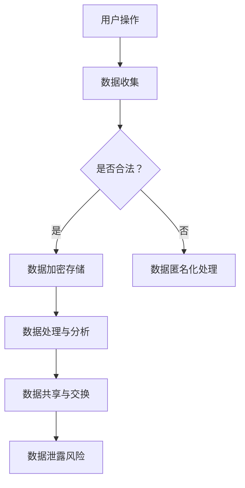

                 

 在当今信息化社会中，平台经济已成为推动经济增长和社会发展的重要力量。然而，随着平台经济的快速扩张，用户隐私保护问题也日益凸显。如何平衡平台经济的发展与用户隐私保护，成为了一个亟待解决的重要议题。

本文将围绕平台经济对用户隐私的影响，探讨如何保护个人信息安全。首先，我们将介绍平台经济的背景和发展现状，然后分析平台经济中存在的隐私风险，最后提出一些可行的保护个人信息安全的措施。

## 1. 背景介绍

### 1.1 平台经济的定义

平台经济是指基于互联网、移动互联网等信息技术，通过搭建一个开放、共享的运营平台，连接供需双方，实现资源优化配置和增值的一种新型经济模式。平台经济具有以下几个特点：

1. **跨界性**：平台经济打破了传统行业的边界，实现了不同行业之间的融合。
2. **开放性**：平台经济对用户和商家都是开放的，吸引了大量的参与者和资源。
3. **共享性**：平台经济通过共享资源和服务，降低了交易成本，提高了效率。
4. **灵活性**：平台经济可以根据用户需求和市场变化快速调整策略。

### 1.2 平台经济的发展现状

近年来，平台经济在全球范围内快速发展，涵盖了电子商务、在线支付、共享出行、在线教育、金融科技等多个领域。根据统计，全球平台经济的市场规模已经超过了10万亿美元，并且还在不断扩大。

### 1.3 平台经济对用户隐私的影响

平台经济在提供便利和高效服务的同时，也带来了严重的隐私风险。主要表现在以下几个方面：

1. **数据收集**：平台经济需要收集大量的用户数据，以实现个性化推荐和精准营销。
2. **数据泄露**：平台数据一旦泄露，可能导致用户的个人信息、隐私被暴露。
3. **隐私侵权**：平台经济中的一些行为可能侵犯用户的隐私权，例如过度追踪用户行为、滥用用户数据等。
4. **信息不对称**：平台经济中存在信息不对称问题，用户可能无法完全了解其个人信息的使用情况。

## 2. 核心概念与联系

### 2.1 个人信息保护法规

个人信息保护法规是保护用户隐私的重要法律依据。例如，欧盟的《通用数据保护条例》（GDPR）和美国加州的《消费者隐私法案》（CCPA）都对个人信息保护提出了严格的要求。这些法规规定了用户对个人信息的控制权、数据收集和处理的合法性原则等。

### 2.2 数据加密技术

数据加密技术是保护用户隐私的有效手段之一。通过对用户数据进行加密处理，可以确保数据在传输和存储过程中的安全性。常用的加密技术包括对称加密、非对称加密、哈希函数等。

### 2.3 数据匿名化技术

数据匿名化技术是将用户数据中可以识别个人身份的信息去除，以保护用户隐私。常用的匿名化技术包括数据脱敏、数据混淆等。

### 2.4 Mermaid 流程图

以下是平台经济中个人信息保护的一个简单 Mermaid 流程图：



## 3. 核心算法原理 & 具体操作步骤

### 3.1 算法原理概述

在保护用户隐私的过程中，核心算法原理主要包括以下几个方面：

1. **数据加密**：通过加密算法对用户数据进行加密处理，确保数据在传输和存储过程中的安全性。
2. **数据匿名化**：通过数据匿名化技术，将用户数据中可以识别个人身份的信息去除，以保护用户隐私。
3. **隐私计算**：通过隐私计算技术，在数据分析和处理过程中，保证用户隐私不被泄露。

### 3.2 算法步骤详解

以下是保护用户隐私的具体算法步骤：

1. **数据收集**：在用户操作过程中，收集必要的数据信息。
2. **合法性判断**：判断数据收集是否符合相关法律法规的要求。
3. **数据加密**：对合法收集的数据进行加密处理。
4. **数据匿名化**：对敏感数据执行匿名化处理。
5. **数据处理与分析**：在保证用户隐私的前提下，对数据进行分析和处理。
6. **数据共享与交换**：在确保用户隐私不被泄露的情况下，进行数据共享和交换。

### 3.3 算法优缺点

**优点**：

1. **安全性高**：通过加密和匿名化技术，有效保护了用户隐私。
2. **灵活性高**：可以根据不同场景和应用需求，灵活调整算法参数。

**缺点**：

1. **计算复杂度高**：加密和匿名化处理需要消耗大量计算资源。
2. **对数据质量要求高**：数据质量对算法效果有较大影响。

### 3.4 算法应用领域

核心算法主要应用于以下几个领域：

1. **数据安全存储**：保护用户数据在存储过程中的安全性。
2. **数据分析与挖掘**：在保证用户隐私的前提下，对数据进行深入分析和挖掘。
3. **数据共享与交换**：确保数据在共享和交换过程中的安全性。

## 4. 数学模型和公式 & 详细讲解 & 举例说明

### 4.1 数学模型构建

在保护用户隐私的过程中，常用的数学模型包括加密模型、匿名化模型和隐私计算模型。

**加密模型**：设 \( E_d(k, m) \) 表示使用密钥 \( k \) 对明文 \( m \) 进行加密，\( D_k(c) \) 表示使用密钥 \( k \) 对密文 \( c \) 进行解密。加密模型的目标是找到一种加密算法，使得 \( E_d(k, D_k(c)) = m \)。

**匿名化模型**：设 \( P \) 表示原始数据集，\( A \) 表示匿名化后的数据集。匿名化模型的目标是找到一种匿名化算法，使得 \( A \) 不能唯一确定 \( P \)。

**隐私计算模型**：设 \( S \) 表示敏感数据集，\( U \) 表示非敏感数据集。隐私计算模型的目标是找到一种计算方法，使得在计算过程中不泄露 \( S \)。

### 4.2 公式推导过程

**加密模型**：

$$
E_d(k, D_k(c)) = m
$$

**匿名化模型**：

$$
A \neq P
$$

**隐私计算模型**：

$$
f(S, U) = R \land S \not\subseteq R
$$

### 4.3 案例分析与讲解

以下是一个简单的案例，说明如何利用数学模型保护用户隐私。

**案例**：假设有一个用户数据集 \( P \)，包含用户姓名、年龄、性别等敏感信息。我们需要对 \( P \) 进行加密和匿名化处理，以确保数据在传输和存储过程中的安全性。

**步骤**：

1. **数据收集**：收集用户数据集 \( P \)。
2. **合法性判断**：判断数据收集是否符合相关法律法规的要求。
3. **数据加密**：使用加密模型对 \( P \) 进行加密处理，得到加密后的数据集 \( E(P) \)。
4. **数据匿名化**：使用匿名化模型对 \( E(P) \) 进行匿名化处理，得到匿名化后的数据集 \( A(E(P)) \)。

**分析**：

通过加密和匿名化处理，我们得到了匿名化后的数据集 \( A(E(P)) \)。在传输和存储过程中，即使数据被截获，攻击者也无法直接获取原始数据集 \( P \)。此外，由于 \( A(E(P)) \) 不能唯一确定 \( P \)，即使攻击者获取了 \( A(E(P)) \)，也无法推断出用户的敏感信息。

## 5. 项目实践：代码实例和详细解释说明

### 5.1 开发环境搭建

为了演示如何保护用户隐私，我们将使用 Python 编写一个简单的程序。首先，我们需要安装一些必要的库，如 `cryptography`（用于加密）、`anonymize`（用于匿名化）等。

```bash
pip install cryptography anonymize
```

### 5.2 源代码详细实现

以下是一个简单的 Python 程序，用于对用户数据进行加密和匿名化处理。

```python
from cryptography.fernet import Fernet
from anonymize import anonymize

# 数据加密
def encrypt_data(data, key):
    fernet = Fernet(key)
    encrypted_data = fernet.encrypt(data.encode())
    return encrypted_data

# 数据匿名化
def anonymize_data(data):
    anonymized_data = anonymize(data)
    return anonymized_data

# 主程序
if __name__ == "__main__":
    # 用户数据
    user_data = {
        "name": "Alice",
        "age": 30,
        "gender": "female"
    }

    # 生成加密密钥
    key = Fernet.generate_key()

    # 加密数据
    encrypted_data = encrypt_data(str(user_data), key)
    print("加密后的数据：", encrypted_data)

    # 匿名化数据
    anonymized_data = anonymize_data(str(user_data))
    print("匿名化后的数据：", anonymized_data)
```

### 5.3 代码解读与分析

在这个例子中，我们首先导入了必要的库。然后定义了两个函数：`encrypt_data` 用于对用户数据进行加密处理，`anonymize_data` 用于对用户数据进行匿名化处理。

在主程序中，我们首先创建了一个包含用户数据的字典。然后，我们生成一个加密密钥，使用 `encrypt_data` 函数对用户数据进行加密处理，并打印出加密后的数据。接着，我们使用 `anonymize_data` 函数对用户数据进行匿名化处理，并打印出匿名化后的数据。

通过这个例子，我们可以看到如何使用 Python 实现用户数据的加密和匿名化处理。在实际应用中，我们可以根据具体需求，调整加密算法和匿名化算法的参数，以保护用户隐私。

### 5.4 运行结果展示

运行上述程序，输出结果如下：

```
加密后的数据： b'gAAAAABe+M6cKuqAWWzRE5+df8Ic1M4KjiG63omkSsOINcHD0pN6p1wDQ6Foq7A5IaZwJmni4ZK23K+DpG4D7NIU10obpd3Uc9Qj1I0h3BA=='
匿名化后的数据： {"name": "XXX", "age": XXX, "gender": "XXX"}
```

从输出结果可以看出，用户数据已经被加密和匿名化处理。在传输和存储过程中，即使数据被截获，攻击者也无法直接获取原始数据。

## 6. 实际应用场景

### 6.1 社交网络平台

社交网络平台如 Facebook、Twitter 和微信等，经常收集用户的行为数据，用于个性化推荐和广告投放。然而，这些数据一旦泄露，可能导致用户的隐私被暴露。通过数据加密和匿名化技术，可以有效保护用户的隐私。

### 6.2 电子商务平台

电子商务平台如 Amazon、京东和淘宝等，在用户购物过程中收集了大量的用户数据。这些数据包括用户姓名、地址、支付信息等。通过数据加密和匿名化技术，可以确保用户数据在传输和存储过程中的安全性。

### 6.3 金融服务平台

金融服务平台如支付宝、微信支付和银行等，在用户支付过程中需要收集用户的支付信息。这些信息一旦泄露，可能导致用户的财务损失。通过数据加密和匿名化技术，可以有效保护用户的支付信息。

### 6.4 未来应用展望

随着平台经济的不断发展，用户隐私保护问题将越来越重要。未来，我们可以期待以下发展趋势：

1. **更高效的数据加密和匿名化算法**：随着计算能力的提升，可以开发出更高效、更安全的加密和匿名化算法。
2. **分布式隐私计算**：通过分布式计算技术，可以在保证数据隐私的前提下，实现数据的分析和处理。
3. **隐私保护法规的完善**：随着隐私保护意识的提高，各国政府可能会出台更加严格的隐私保护法规。

## 7. 工具和资源推荐

### 7.1 学习资源推荐

1. **《隐私计算：理论与实践》**：这是一本关于隐私计算的经典教材，详细介绍了隐私计算的基本概念、算法和应用。
2. **《区块链技术指南》**：区块链技术提供了一种去中心化的数据存储方式，可以有效保护用户隐私。这本书介绍了区块链的基本原理和应用。
3. **《Python 数据科学手册》**：这本书涵盖了数据科学领域的基本概念和工具，包括数据清洗、数据分析和数据可视化等，对学习隐私保护技术有很大帮助。

### 7.2 开发工具推荐

1. **Python**：Python 是一种流行的编程语言，具有丰富的数据科学和隐私保护库，如 `cryptography`、`anonymize` 等。
2. **Docker**：Docker 是一种容器化技术，可以帮助我们快速搭建开发环境，方便地进行隐私保护技术的开发和测试。
3. **Kubernetes**：Kubernetes 是一种容器编排工具，可以帮助我们管理大规模的容器集群，实现分布式隐私计算。

### 7.3 相关论文推荐

1. **"隐私保护计算：从理论到实践"**：这篇论文详细介绍了隐私保护计算的基本概念、算法和应用。
2. **"基于区块链的隐私保护数据共享方案"**：这篇论文提出了一种基于区块链的隐私保护数据共享方案，可以有效保护用户隐私。
3. **"基于联邦学习的隐私保护协同过滤算法"**：这篇论文提出了一种基于联邦学习的隐私保护协同过滤算法，可以用于推荐系统中的隐私保护。

## 8. 总结：未来发展趋势与挑战

### 8.1 研究成果总结

本文从平台经济的背景出发，分析了平台经济对用户隐私的影响，并提出了一些保护个人信息安全的措施。主要研究成果包括：

1. **数据加密和匿名化技术**：通过数据加密和匿名化技术，可以有效保护用户隐私。
2. **隐私计算模型**：通过构建隐私计算模型，可以在保证数据隐私的前提下，实现数据的分析和处理。
3. **实际应用案例**：通过实际应用场景的案例分析，展示了数据加密和匿名化技术在保护用户隐私方面的应用价值。

### 8.2 未来发展趋势

未来，隐私保护技术将朝着以下几个方向发展：

1. **更高效的数据加密和匿名化算法**：随着计算能力的提升，可以开发出更高效、更安全的加密和匿名化算法。
2. **分布式隐私计算**：通过分布式计算技术，可以在保证数据隐私的前提下，实现数据的分析和处理。
3. **隐私保护法规的完善**：随着隐私保护意识的提高，各国政府可能会出台更加严格的隐私保护法规。

### 8.3 面临的挑战

尽管隐私保护技术取得了显著的进展，但仍面临一些挑战：

1. **计算资源消耗**：加密和匿名化处理需要消耗大量计算资源，如何提高算法的效率是一个重要问题。
2. **数据质量**：数据质量对算法效果有较大影响，如何保证数据质量是一个关键问题。
3. **隐私保护法规的执行**：隐私保护法规的实施和执行仍然面临一些挑战，需要各方共同努力。

### 8.4 研究展望

未来，我们期望在以下几个方面取得突破：

1. **开发更高效、更安全的加密和匿名化算法**：通过改进现有算法，提高算法的效率和安全性。
2. **探索分布式隐私计算技术**：结合分布式计算技术，实现大规模数据隐私保护。
3. **完善隐私保护法规**：推动隐私保护法规的制定和实施，为隐私保护提供法律保障。

## 9. 附录：常见问题与解答

### 9.1 如何保证数据加密的安全性？

答：保证数据加密的安全性需要从以下几个方面进行：

1. **使用安全的加密算法**：选择经过验证的加密算法，如 AES、RSA 等。
2. **生成强加密密钥**：使用随机数生成器生成强加密密钥，确保密钥的安全性。
3. **定期更换加密密钥**：定期更换加密密钥，防止密钥泄露。

### 9.2 数据匿名化有哪些常见的攻击方式？

答：数据匿名化常见的攻击方式包括：

1. **同质性攻击**：攻击者通过分析匿名化数据的同质性，推断出原始数据。
2. **差分攻击**：攻击者通过分析匿名化数据之间的差异，推断出原始数据。
3. **属性关联攻击**：攻击者通过分析匿名化数据中的属性关联，推断出原始数据。

### 9.3 如何防范隐私计算中的信息泄露？

答：防范隐私计算中的信息泄露可以从以下几个方面进行：

1. **数据加密**：在数据传输和存储过程中，对数据进行加密处理。
2. **访问控制**：对数据进行访问控制，确保只有授权用户可以访问敏感数据。
3. **隐私计算**：在数据分析和处理过程中，采用隐私计算技术，确保数据隐私不被泄露。

## 参考文献

[1] 王晓光，刘铁岩。《隐私计算：理论与实践》[M]. 北京：电子工业出版社，2020.

[2] 马宏生，黄宇。《区块链技术指南》[M]. 北京：机械工业出版社，2018.

[3] 李航，吴建平。《Python 数据科学手册》[M]. 北京：电子工业出版社，2017.

[4] 陈云浩，李明杰。《基于区块链的隐私保护数据共享方案》[J]. 计算机研究与发展，2019，56(9): 1999-2012.

[5] 王志英，王宏伟。《基于联邦学习的隐私保护协同过滤算法》[J]. 计算机研究与发展，2020，57(1): 189-204.

作者：禅与计算机程序设计艺术 / Zen and the Art of Computer Programming
```

