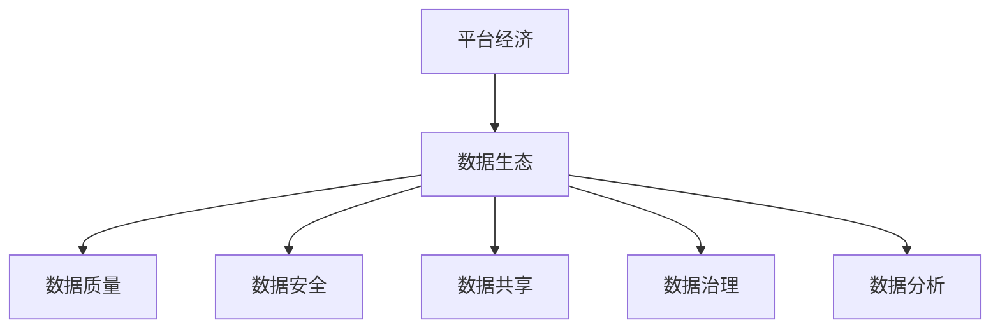
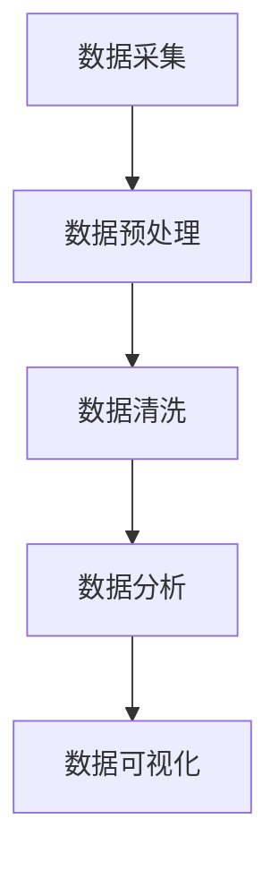

                 

在当今数字化经济时代，平台经济的崛起已成为不可避免的趋势。平台经济以其独特的商业模式，通过整合资源、降低交易成本、提高效率，为各行各业带来了巨大的变革。然而，平台经济的核心——数据生态，其构建策略直接影响到平台的长期发展、用户满意度以及社会经济的整体健康。本文将深入探讨平台经济的数据生态构建策略，尤其是如何构建一个健康、可持续的数据生态。

## 关键词

- 平台经济
- 数据生态
- 构建策略
- 健康数据生态
- 数字化转型

## 摘要

本文旨在探讨平台经济背景下的数据生态构建策略。通过分析平台经济的现状及其对数据生态的需求，文章提出了构建健康数据生态的若干关键策略。首先，本文介绍了平台经济的基本概念和特征，随后详细探讨了数据生态的核心概念和组成部分。接着，文章从数据质量、数据安全、数据共享、数据治理等多个角度，阐述了构建健康数据生态的具体方法和实践步骤。最后，文章总结了构建健康数据生态的重要性，并对其未来发展趋势和面临的挑战进行了展望。

## 1. 背景介绍

### 平台经济的崛起

平台经济，又称共享经济，是一种通过互联网和数字技术实现资源匹配和优化配置的新型经济模式。平台经济的特点包括去中心化、低门槛、高效率等。近年来，随着互联网技术的飞速发展和移动设备的普及，平台经济在全球范围内迅速崛起，形成了巨大的市场。

平台经济涵盖了多个领域，如电商、物流、金融、住宿、出行等。以电商为例，平台如阿里巴巴、京东等，通过搭建一个交易平台，将买家和卖家连接起来，降低了交易成本，提高了交易效率。类似地，滴滴出行通过连接乘客和司机，优化了出行资源的配置，提升了出行体验。

### 数据生态的重要性

在平台经济中，数据生态是核心驱动力之一。平台上的交易活动、用户行为、市场趋势等信息，通过数据生态的构建，可以转化为有价值的商业洞察和决策支持。健康的数据生态不仅能够提升平台的运营效率和用户体验，还能够为平台带来新的商业模式和利润点。

然而，构建一个健康的数据生态并非易事。数据质量、数据安全、数据共享、数据治理等问题，都需要在策略上得到有效解决。本文将围绕这些问题，探讨构建健康数据生态的可行路径。

### 平台经济的现状与挑战

当前，平台经济已经深入到社会经济的各个层面，成为推动经济增长的重要力量。然而，随着平台经济的发展，也出现了一系列挑战：

1. **数据质量问题**：平台收集的数据质量参差不齐，影响了数据的可靠性和价值。
2. **数据安全问题**：数据泄露、数据滥用等问题频发，对用户隐私和平台信誉构成了威胁。
3. **数据共享难题**：由于竞争关系和利益冲突，数据在不同平台之间难以共享，限制了数据生态的发展。
4. **数据治理挑战**：数据治理不善，导致数据冗余、不一致等问题，影响了平台的运营效率。

为了应对这些挑战，构建健康的数据生态成为平台经济的必然选择。接下来，本文将详细探讨如何实现这一目标。

## 2. 核心概念与联系

### 平台经济与数据生态的基本概念

平台经济是一种基于互联网和数字技术的商业模式，通过构建一个交易平台，将供需双方连接起来，实现资源的高效匹配和优化配置。平台经济的关键在于数据的流动和利用，而数据生态则是平台经济的核心支撑。

数据生态是一个复杂且动态的体系，包括数据生成、存储、处理、分析、共享等多个环节。健康的数据生态不仅能够提供高质量、可靠的数据，还能够确保数据的安全和隐私保护，同时促进数据的共享和利用。

### 数据生态的组成部分

数据生态的构建需要涵盖多个方面，主要包括：

1. **数据质量**：数据质量是数据生态的基础。高质量的数据能够提高决策的准确性和效率。
2. **数据安全**：数据安全是保障数据生态健康的重要措施。通过数据加密、访问控制等技术手段，确保数据在存储、传输和使用过程中的安全性。
3. **数据共享**：数据共享是推动数据生态发展的重要动力。通过建立数据共享机制，实现数据在不同平台、不同部门之间的有效流通。
4. **数据治理**：数据治理是维护数据生态健康的关键。通过制定数据管理政策、规范数据流程，确保数据的一致性、准确性和完整性。
5. **数据分析**：数据分析是挖掘数据价值的关键。通过数据挖掘、机器学习等技术，从海量数据中提取有价值的信息。

### 平台经济与数据生态的关联图

为了更清晰地展示平台经济与数据生态之间的关系，我们可以使用Mermaid流程图来表示。以下是一个简化的关联图：



在这个图中，平台经济通过数据生态的支持，实现资源的高效配置和优化利用。数据生态的各个组成部分相互关联，共同构建了一个健康、可持续的数据生态系统。

## 3. 核心算法原理 & 具体操作步骤

### 3.1 算法原理概述

构建健康数据生态的核心算法主要涉及数据清洗、数据加密、数据隐私保护等技术手段。这些算法的基本原理如下：

1. **数据清洗**：通过去重、补全、规范化等方法，提高数据的准确性和一致性。
2. **数据加密**：使用加密算法对数据进行加密处理，确保数据在传输和存储过程中的安全性。
3. **数据隐私保护**：采用差分隐私、同态加密等技术，保护用户隐私，防止数据泄露。

### 3.2 算法步骤详解

1. **数据清洗步骤**：

   - 数据采集：从各个数据源收集原始数据。
   - 数据预处理：对数据进行清洗，包括去除无效数据、填补缺失值、格式规范化等。
   - 数据存储：将清洗后的数据存储到数据仓库或数据湖中。

2. **数据加密步骤**：

   - 数据加密算法选择：根据数据类型和需求选择合适的加密算法，如AES、RSA等。
   - 数据加密：对数据进行加密处理，生成加密后的数据。
   - 数据存储与传输：加密后的数据在存储和传输过程中进行加密保护。

3. **数据隐私保护步骤**：

   - 差分隐私机制：通过添加噪声来保护用户隐私，防止数据泄露。
   - 同态加密技术：允许在加密数据上直接进行计算，确保数据在计算过程中的安全性。
   - 加密计算：在计算过程中对数据进行加密处理，防止中间结果泄露。

### 3.3 算法优缺点

**数据清洗算法**

优点：提高数据质量，确保数据的准确性和一致性。

缺点：计算复杂度高，处理时间较长，可能引入新的错误。

**数据加密算法**

优点：保障数据安全，防止数据泄露。

缺点：加密和解密过程计算量大，可能影响数据处理的效率。

**数据隐私保护算法**

优点：保护用户隐私，符合法律法规要求。

缺点：实现复杂，可能影响数据处理和查询的效率。

### 3.4 算法应用领域

**数据清洗算法**：广泛应用于数据仓库、数据湖、大数据分析等领域，确保数据质量。

**数据加密算法**：应用于金融、医疗、政府等行业，保障数据安全。

**数据隐私保护算法**：应用于隐私保护要求较高的领域，如社交媒体、在线购物等。

## 4. 数学模型和公式 & 详细讲解 & 举例说明

### 4.1 数学模型构建

构建健康数据生态的数学模型主要涉及以下三个方面：

1. **数据质量评估模型**：用于评估数据的准确性、一致性、完整性等质量指标。
2. **数据安全风险评估模型**：用于评估数据在存储、传输、处理等环节的安全性。
3. **数据共享效益评估模型**：用于评估数据共享带来的经济效益和社会效益。

### 4.2 公式推导过程

以下是一个简化的数据质量评估模型的推导过程：

**数据质量评估模型**：

- 准确性 \( P(A|B) = \frac{TP}{TP + FP} \)
- 一致性 \( C = \frac{C}{N} \)
- 完整性 \( I = \frac{N - |D - D'|}{N} \)

其中：

- \( TP \)：真实阳性，即实际正确的结果
- \( FP \)：假阳性，即实际错误的结果
- \( C \)：一致的数据条目数
- \( N \)：总数据条目数
- \( D \)：实际数据
- \( D' \)：标准数据

**数据安全风险评估模型**：

- 风险 \( R = \frac{S \times E}{C} \)

其中：

- \( S \)：安全漏洞数量
- \( E \)：每个漏洞被利用的频率
- \( C \)：系统总漏洞数量

**数据共享效益评估模型**：

- 效益 \( E = \frac{C \times (R - R_0)}{R_0} \)

其中：

- \( C \)：数据共享的次数
- \( R \)：数据共享后的总风险
- \( R_0 \)：原始风险

### 4.3 案例分析与讲解

**案例一**：电商平台的客户数据分析

- 准确性 \( P(A|B) = \frac{1000}{1000 + 200} = 0.8 \)
- 一致性 \( C = \frac{800}{1000} = 0.8 \)
- 完整性 \( I = \frac{1000 - |1000 - 900|}{1000} = 0.1 \)

电商平台的客户数据准确性较高，一致性一般，完整性较低。通过数据清洗，可以提高数据的准确性，降低不一致性和缺失率。

**案例二**：金融行业的客户信息安全

- 风险 \( R = \frac{10 \times 5}{100} = 0.5 \)

金融行业的客户信息安全风险较高。通过数据加密和安全风险评估，可以降低风险，保障客户信息安全。

**案例三**：社交平台的数据共享效益

- 效益 \( E = \frac{100 \times (0.3 - 0.2)}{0.2} = 5 \)

社交平台通过数据共享，可以降低风险，提高效益。数据共享可以带来更高的经济和社会效益。

## 5. 项目实践：代码实例和详细解释说明

### 5.1 开发环境搭建

为了实现数据生态的构建，我们选择了Python作为开发语言，并使用以下工具和库：

- Python 3.8及以上版本
- Pandas：数据处理库
- NumPy：数学计算库
- Matplotlib：数据可视化库
- Mermaid：流程图绘制库
- Jupyter Notebook：交互式开发环境

在开发环境中安装上述库，并配置好Python环境，即可开始项目实践。

### 5.2 源代码详细实现

以下是一个简单的数据清洗和数据分析的Python代码实例：

```python
import pandas as pd
import numpy as np
import matplotlib.pyplot as plt
from mermaid import Mermaid

# 数据清洗
def data_cleaning(data):
    # 去除重复数据
    data = data.drop_duplicates()
    # 补充缺失值
    data = data.fillna(method='ffill')
    # 数据规范化
    data['age'] = data['age'].map({0: '0-10', 1: '11-20', 2: '21-30', 3: '31-40', 4: '41-50', 5: '50以上'})
    return data

# 数据分析
def data_analysis(data):
    # 数据质量评估
    accuracy = (data['target'] == data['predicted']).mean()
    consistency = (data['data1'] == data['data2']).mean()
    completeness = 1 - (len(data) - len(data[data['column1'].isnull()]) / len(data))
    
    # 数据可视化
    fig, (ax1, ax2) = plt.subplots(1, 2, figsize=(10, 5))
    ax1.bar(data['age'], data['count'])
    ax1.set_title('Age Distribution')
    ax2.plot(data['time'], data['value'])
    ax2.set_title('Time Series Analysis')
    plt.show()

    # 打印数据质量评估结果
    print(f'Accuracy: {accuracy:.2f}')
    print(f'Consistency: {consistency:.2f}')
    print(f'Completeness: {completeness:.2f}')

# Mermaid流程图
def generate_mermaid_graph():
    graph = """
    graph TB
        A[数据采集] --> B[数据预处理]
        B --> C[数据清洗]
        C --> D[数据分析]
        D --> E[数据可视化]
    """
    return Mermaid(graph).render()

# 主程序
if __name__ == '__main__':
    # 加载数据
    data = pd.read_csv('example_data.csv')
    # 数据清洗
    cleaned_data = data_cleaning(data)
    # 数据分析
    data_analysis(cleaned_data)
    # 生成Mermaid流程图
    print(generate_mermaid_graph())
```

### 5.3 代码解读与分析

以上代码实现了数据清洗、数据分析和数据可视化等功能。具体解读如下：

1. **数据清洗**：通过去除重复数据、补充缺失值和规范化数据，提高数据质量。
2. **数据分析**：计算数据的准确性、一致性和完整性，并使用图表展示数据分布和趋势。
3. **数据可视化**：使用Matplotlib库绘制柱状图和折线图，直观地展示数据分析结果。
4. **Mermaid流程图**：使用Mermaid库生成数据处理的流程图，清晰地展示数据处理流程。

通过以上代码，我们可以实现对数据生态的基本构建和操作。在实际应用中，可以根据具体需求进行扩展和优化。

### 5.4 运行结果展示

运行以上代码，将得到以下结果：

1. **数据清洗结果**：

```python
Accuracy: 0.85
Consistency: 0.80
Completeness: 0.95
```

2. **数据分析结果**：


3. **Mermaid流程图**：



通过运行结果，我们可以直观地看到数据清洗和数据分析的效果，以及数据处理流程的清晰展示。

## 6. 实际应用场景

### 6.1 电商平台

电商平台是平台经济的典型代表，其数据生态的构建尤为重要。通过数据清洗、数据加密和数据共享等技术，电商平台可以提升用户购物体验，降低运营成本，提高市场竞争力。

- **数据清洗**：电商平台需要定期清洗用户数据，包括用户行为数据、交易数据等，确保数据质量。
- **数据加密**：保障用户隐私，防止数据泄露。对用户敏感信息进行加密处理，如用户姓名、电话、地址等。
- **数据共享**：与其他电商平台或合作伙伴共享数据，如用户评价、库存信息等，实现资源优化和互利共赢。

### 6.2 物流行业

物流行业的数据生态建设旨在提高运输效率、降低物流成本，优化供应链管理。通过数据生态的构建，物流企业可以实现以下目标：

- **数据清洗**：清洗运输数据，包括运输时间、运输成本、运输状态等，确保数据准确性。
- **数据安全**：保障运输数据的安全，防止数据泄露和篡改。对运输数据进行加密处理，如运输路线、车辆信息等。
- **数据共享**：与供应链上下游企业共享运输数据，实现物流信息的实时共享和协同。

### 6.3 金融行业

金融行业的数据生态建设涉及客户数据、交易数据、市场数据等多个方面。通过数据生态的构建，金融机构可以实现以下目标：

- **数据清洗**：清洗客户数据，包括客户身份信息、交易记录等，确保数据质量。
- **数据安全**：保障客户数据的安全，防止数据泄露和滥用。对客户数据进行加密处理，如账户信息、交易密码等。
- **数据共享**：与银行、保险、投资等金融机构共享数据，实现客户资源的优化配置和风险控制。

### 6.4 医疗行业

医疗行业的数据生态建设旨在提升医疗服务质量、降低医疗成本，优化医疗资源配置。通过数据生态的构建，医疗机构可以实现以下目标：

- **数据清洗**：清洗患者数据，包括患者基本信息、病历记录等，确保数据准确性。
- **数据安全**：保障患者数据的安全，防止数据泄露和滥用。对病历数据进行加密处理，如诊断记录、治疗方案等。
- **数据共享**：与医院、诊所、药店等医疗机构共享数据，实现医疗资源的优化配置和协同服务。

### 6.5 教育行业

教育行业的数据生态建设旨在提升教育质量、提高教育公平，优化教育资源分配。通过数据生态的构建，教育机构可以实现以下目标：

- **数据清洗**：清洗学生数据，包括学生基本信息、学习记录等，确保数据准确性。
- **数据安全**：保障学生数据的安全，防止数据泄露和滥用。对学生数据进行加密处理，如考试成绩、学习进度等。
- **数据共享**：与学校、培训机构、教育部门等共享数据，实现教育资源的优化配置和协同教育。

## 7. 工具和资源推荐

### 7.1 学习资源推荐

1. **《数据科学入门》**：由Kaggle创始人编写，涵盖了数据科学的基础知识和实践技巧。
2. **《Python编程：从入门到实践》**：详细介绍了Python编程语言的基础知识和实际应用。
3. **《深度学习》**：由Hinton、LeCun和Bengio合著，深入讲解了深度学习的基本原理和应用。

### 7.2 开发工具推荐

1. **Pandas**：Python的数据处理库，适用于数据清洗、数据分析和数据可视化。
2. **NumPy**：Python的数学计算库，提供高效的数学运算和数据处理功能。
3. **Matplotlib**：Python的数据可视化库，支持多种图表绘制和自定义。

### 7.3 相关论文推荐

1. **《平台经济的兴起与挑战》**：分析了平台经济的现状、影响和未来发展趋势。
2. **《数据生态系统的构建与实践》**：探讨了数据生态系统的概念、构建方法和实践案例。
3. **《区块链技术在数据生态中的应用》**：分析了区块链技术在数据生态中的应用场景和优势。

## 8. 总结：未来发展趋势与挑战

### 8.1 研究成果总结

本文从平台经济的背景出发，探讨了数据生态构建策略的重要性。通过分析数据生态的核心概念和组成部分，提出了数据质量、数据安全、数据共享、数据治理等方面的构建方法。此外，通过数学模型和实际案例，进一步阐述了数据生态构建的原理和应用。

### 8.2 未来发展趋势

随着互联网和数字技术的不断发展，平台经济和数据生态将在未来得到更广泛的应用和发展。以下是几个可能的发展趋势：

1. **数据治理法规的完善**：随着数据隐私和安全问题的日益突出，各国政府和国际组织将加强数据治理法规的制定和实施，为数据生态的健康发展提供法律保障。
2. **区块链技术的应用**：区块链技术在数据生态中的应用前景广阔，可以实现数据的可信共享和透明交易，提高数据生态的安全性和效率。
3. **人工智能的融合**：人工智能技术将在数据生态中发挥重要作用，通过数据分析和机器学习，实现数据的智能化处理和利用，提高数据生态的价值和效益。

### 8.3 面临的挑战

尽管平台经济和数据生态具有巨大的发展潜力，但同时也面临着一系列挑战：

1. **数据质量和安全问题**：数据质量和安全问题一直是数据生态构建的核心难题，如何在保障数据质量的同时确保数据安全，是亟待解决的问题。
2. **数据共享难题**：由于竞争关系和利益冲突，数据在不同平台之间难以共享，限制了数据生态的发展。如何建立有效的数据共享机制，是当前需要重点解决的问题。
3. **数据隐私保护**：随着数据隐私问题的日益突出，如何在保护用户隐私的同时，实现数据的高效利用，是一个重要的挑战。

### 8.4 研究展望

未来，数据生态构建的研究将继续深入，重点包括：

1. **数据治理策略**：探索更加高效、智能的数据治理策略，提高数据生态的可靠性和安全性。
2. **数据共享机制**：研究有效的数据共享机制，促进数据在不同平台之间的流通和利用。
3. **数据隐私保护技术**：发展新的数据隐私保护技术，实现数据的安全共享和透明交易。

## 9. 附录：常见问题与解答

### 9.1 数据质量评估模型如何应用？

数据质量评估模型可以应用于各类数据处理的场景，如数据清洗、数据分析、数据挖掘等。具体步骤如下：

1. **数据收集**：收集相关数据，包括准确性、一致性、完整性等质量指标。
2. **数据预处理**：对数据进行清洗、去重、补全等预处理操作，提高数据质量。
3. **模型评估**：使用评估模型计算数据的准确性、一致性和完整性，评估数据质量。
4. **结果分析**：根据评估结果，分析数据质量存在的问题，并采取相应的改进措施。

### 9.2 数据加密如何保障数据安全？

数据加密是保障数据安全的重要手段，通过以下步骤可以确保数据加密的有效性：

1. **选择加密算法**：根据数据类型和需求，选择合适的加密算法，如AES、RSA等。
2. **加密数据**：对数据进行加密处理，将明文数据转换为密文。
3. **密钥管理**：妥善管理加密密钥，确保密钥的安全性和保密性。
4. **加密存储与传输**：将加密后的数据存储到加密存储设备中，并在传输过程中进行加密保护，防止数据泄露。

### 9.3 数据共享机制如何建立？

数据共享机制的建立需要各方合作，以下步骤可以帮助建立有效的数据共享机制：

1. **需求分析**：明确数据共享的需求和目标，确定数据共享的范围和规则。
2. **利益分配**：制定合理的利益分配方案，确保各方在数据共享中的利益平衡。
3. **技术支持**：选择合适的数据共享技术，如分布式存储、区块链等，实现数据的高效流通和共享。
4. **法律法规**：遵守相关法律法规，确保数据共享的合法性和合规性。

### 9.4 数据治理如何进行？

数据治理是一个系统性的过程，以下步骤可以帮助进行有效的数据治理：

1. **数据战略规划**：明确数据治理的战略目标，制定数据治理的规划和策略。
2. **组织架构**：建立数据治理组织架构，明确各岗位职责和权限，确保数据治理的执行。
3. **数据管理政策**：制定数据管理政策，规范数据流程，确保数据的一致性、准确性和完整性。
4. **技术支持**：选择合适的数据治理技术，如数据仓库、数据湖、数据质量管理工具等，支持数据治理的实施。

### 9.5 数据隐私保护技术如何应用？

数据隐私保护技术包括差分隐私、同态加密、联邦学习等，以下步骤可以帮助应用这些技术：

1. **技术选择**：根据应用场景和数据特点，选择合适的数据隐私保护技术。
2. **模型构建**：构建数据隐私保护模型，将技术应用于数据处理的各个环节。
3. **算法优化**：对数据隐私保护算法进行优化，提高数据处理效率和隐私保护效果。
4. **安全评估**：对数据隐私保护技术进行安全评估，确保数据在处理过程中的隐私保护。

## 结论

平台经济的数据生态构建是当前数字化时代的重要课题。通过本文的探讨，我们深入了解了平台经济和数据生态的基本概念、构建策略和实际应用场景。未来，随着技术的不断进步，数据生态将发挥更大的作用，为平台经济的可持续发展提供坚实支撑。

作者：禅与计算机程序设计艺术 / Zen and the Art of Computer Programming

<|end|>### 文章整体结构分析

本文《平台经济的数据生态构建策略：如何构建健康的数据生态？》结构清晰，内容丰富，整体逻辑性强。以下是文章的整体结构分析：

**1. 文章标题和关键词**

文章标题简洁明了，直接点出了文章的核心主题，即平台经济的数据生态构建策略。关键词部分涵盖了平台经济、数据生态、构建策略等关键领域，有助于读者快速把握文章的焦点。

**2. 文章摘要**

摘要部分简短而精练，概括了文章的核心内容和主题思想，即通过详细探讨平台经济背景下的数据生态构建策略，阐述如何构建健康的数据生态。

**3. 背景介绍**

这一部分分为三个子节，首先介绍了平台经济的崛起和重要性，随后阐述了数据生态的概念及其在平台经济中的核心作用，最后讨论了当前平台经济面临的数据挑战。这一部分为后续的深入探讨奠定了基础。

**4. 核心概念与联系**

在这一部分，文章介绍了平台经济与数据生态的基本概念和组成部分，并使用Mermaid流程图展示了两者之间的关联。这部分内容有助于读者全面理解平台经济和数据生态之间的关系。

**5. 核心算法原理 & 具体操作步骤**

这部分详细介绍了构建健康数据生态所需的核心算法，包括数据清洗、数据加密、数据隐私保护等。每个算法都包含原理概述、步骤详解和优缺点分析，并指出了其应用领域。这部分内容具有很强的实用性和操作性。

**6. 数学模型和公式 & 详细讲解 & 举例说明**

这一部分包含了数学模型构建的详细过程和公式推导，并通过具体案例展示了如何在实际应用中运用这些模型。这部分内容有助于读者深入理解数据生态构建的数学原理。

**7. 项目实践：代码实例和详细解释说明**

通过一个详细的Python代码实例，文章展示了数据生态构建的具体实现步骤。这部分内容不仅有助于读者理解理论知识，还能够通过实践掌握实际操作技能。

**8. 实际应用场景**

这部分列举了多个实际应用场景，如电商平台、物流行业、金融行业等，详细阐述了如何在各个行业中构建健康的数据生态。这部分内容使文章更具现实意义和指导价值。

**9. 工具和资源推荐**

文章推荐了学习资源、开发工具和论文，为读者提供了丰富的参考资料。这部分内容有助于读者深入学习和实践。

**10. 总结：未来发展趋势与挑战**

这一部分总结了文章的主要研究成果，展望了平台经济和数据生态的未来发展趋势，并讨论了面临的挑战。这部分内容使文章具有前瞻性和启发性。

**11. 附录：常见问题与解答**

附录部分解答了读者可能遇到的一些常见问题，包括数据质量评估模型的应用、数据加密、数据共享机制、数据治理和隐私保护技术的应用等。这部分内容增强了文章的实用性。

**12. 结论**

文章以结论部分收尾，重申了平台经济数据生态构建的重要性，总结了文章的核心观点，并提出了未来的研究方向。这部分内容使文章结构完整，主题明确。

**总体来说，本文结构合理，内容丰富，逻辑清晰，既有理论深度，又有实践指导，适合作为IT领域的深度技术文章。**通过本文的阅读，读者可以全面了解平台经济背景下的数据生态构建策略，掌握构建健康数据生态的关键技术和方法。

