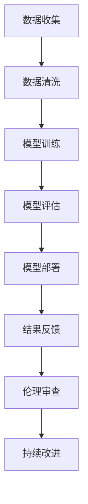

                 

在21世纪的今天，人工智能（AI）技术已经成为推动社会变革的关键力量。从自动驾驶汽车到智能医疗诊断，从个性化推荐系统到自然语言处理，AI的应用无处不在。然而，随着AI技术的飞速发展，我们不得不面对一个重要问题：如何平衡技术进步与伦理道德之间的矛盾？

本文将围绕这一主题，深入探讨AI技术发展背后的伦理挑战，分析现有解决方案的优缺点，并展望未来的发展趋势。

## 1. 背景介绍

人工智能作为计算机科学的一个重要分支，自1950年代图灵提出“图灵测试”以来，已经经历了数十年的发展。特别是在深度学习、神经网络等技术的推动下，AI的应用领域不断扩大，取得了显著的成果。然而，随着AI技术的不断进步，其潜在的社会和伦理问题也日益凸显。

伦理问题主要包括以下几个方面：

- **隐私保护**：AI技术通常需要大量数据进行分析，这涉及到个人隐私的保护问题。如何在不侵犯隐私的前提下，合理使用数据，成为了一个亟待解决的难题。
- **公平性**：AI系统的决策过程可能存在偏见，从而影响不同群体的利益。如何确保AI系统的公平性，避免歧视，是一个重要的伦理问题。
- **责任归属**：当AI系统出现错误或造成损害时，如何确定责任归属，如何对受害者进行赔偿，也是一个复杂的伦理问题。

## 2. 核心概念与联系

### 2.1 AI技术原理

人工智能的核心是模拟人类思维过程，通过算法和模型，使计算机能够自主地学习和决策。其中，深度学习是当前最为流行的一种AI技术，它通过多层神经网络，模拟人脑的神经元连接，从而实现复杂的模式识别和预测。

### 2.2 伦理原则

伦理原则是指在技术发展中需要遵循的一系列道德规范。这些原则主要包括：

- **尊重隐私**：在数据收集和使用过程中，必须尊重个人隐私，确保数据的安全和保密。
- **公平公正**：AI系统的设计和应用，必须确保公平公正，避免对特定群体造成不公平待遇。
- **责任明确**：在AI系统出现错误或造成损害时，必须明确责任归属，确保受害者的权益得到保障。

### 2.3 Mermaid 流程图



## 3. 核心算法原理 & 具体操作步骤

### 3.1 算法原理概述

核心算法主要包括数据预处理、模型训练、模型评估和模型部署等步骤。其中，数据预处理和模型训练是确保AI系统性能和公平性的关键。

### 3.2 算法步骤详解

#### 3.2.1 数据预处理

1. 数据清洗：去除噪声数据，确保数据质量。
2. 数据归一化：将不同特征的数据缩放到同一尺度，便于模型训练。

#### 3.2.2 模型训练

1. 选择合适的神经网络结构。
2. 设置合适的超参数，如学习率、批次大小等。
3. 使用梯度下降等优化算法，训练模型。

#### 3.2.3 模型评估

1. 使用交叉验证等方法，评估模型性能。
2. 检查模型是否存在过拟合或欠拟合。

#### 3.2.4 模型部署

1. 将训练好的模型部署到生产环境。
2. 定期更新模型，以适应新的数据和环境。

### 3.3 算法优缺点

优点：

- 高效：AI系统可以处理大量数据，提高决策效率。
- 自动化：AI系统可以自主学习和决策，减少人力干预。

缺点：

- 隐私问题：数据收集和使用可能侵犯个人隐私。
- 偏见问题：AI系统可能存在偏见，影响决策公平性。
- 责任归属问题：AI系统出现错误时，责任归属难以确定。

### 3.4 算法应用领域

AI技术已广泛应用于各个领域，包括：

- 自动驾驶：利用计算机视觉和深度学习技术，实现无人驾驶汽车。
- 智能医疗：利用AI技术，提高诊断准确率和治疗效率。
- 金融：利用AI技术，进行风险管理、信用评估等。

## 4. 数学模型和公式 & 详细讲解 & 举例说明

### 4.1 数学模型构建

在AI系统中，常见的数学模型包括神经网络模型、决策树模型等。以下以神经网络模型为例，介绍其数学模型构建过程。

#### 4.1.1 神经网络模型

神经网络模型由多个神经元组成，每个神经元接收多个输入，通过加权求和后，经过激活函数产生输出。神经网络的数学模型可以表示为：

\[ y = f(\sum_{i=1}^{n} w_i x_i + b) \]

其中，\( y \) 为输出，\( x_i \) 为输入，\( w_i \) 为权重，\( b \) 为偏置，\( f \) 为激活函数。

#### 4.1.2 激活函数

常见的激活函数包括：

- Sigmoid函数：\( f(x) = \frac{1}{1 + e^{-x}} \)
-ReLU函数：\( f(x) = \max(0, x) \)

### 4.2 公式推导过程

以Sigmoid函数为例，推导其导数公式：

\[ \frac{df}{dx} = \frac{d}{dx} \left( \frac{1}{1 + e^{-x}} \right) \]

使用链式法则，可以得到：

\[ \frac{df}{dx} = \frac{e^{-x}}{(1 + e^{-x})^2} \]

### 4.3 案例分析与讲解

假设我们有一个二元分类问题，输入特征为 \( x_1 \) 和 \( x_2 \)，目标变量为 \( y \)。我们使用一个单层神经网络进行分类，激活函数为Sigmoid函数。

输入层到隐层：

\[ h = \sigma(w_1 x_1 + w_2 x_2 + b) \]

隐层到输出层：

\[ y = \sigma(h) \]

其中，\( \sigma \) 表示Sigmoid函数，\( w_1, w_2, b \) 为权重和偏置。

根据梯度下降法，我们可以得到：

\[ \frac{dw_1}{dx_1} = \frac{dy}{dx_1} \]
\[ \frac{dw_2}{dx_2} = \frac{dy}{dx_2} \]
\[ \frac{db}{dy} = \frac{dy}{db} \]

其中，\( \frac{dy}{dx_1} \) 和 \( \frac{dy}{dx_2} \) 可以通过链式法则计算得到。

## 5. 项目实践：代码实例和详细解释说明

### 5.1 开发环境搭建

为了实现本文所描述的AI系统，我们需要搭建一个合适的开发环境。以下是一个基本的Python开发环境搭建步骤：

1. 安装Python 3.8以上版本。
2. 安装NumPy、Pandas、Scikit-learn等常用库。

### 5.2 源代码详细实现

以下是一个简单的神经网络实现示例：

```python
import numpy as np
from sklearn.datasets import make_classification
from sklearn.model_selection import train_test_split

def sigmoid(x):
    return 1 / (1 + np.exp(-x))

def forward(x, w, b):
    return sigmoid(np.dot(x, w) + b)

# 生成模拟数据
X, y = make_classification(n_samples=100, n_features=2, n_classes=2)
X_train, X_test, y_train, y_test = train_test_split(X, y, test_size=0.2, random_state=42)

# 初始化模型参数
w = np.random.rand(2, 1)
b = np.random.rand(1)

# 模型训练
for i in range(1000):
    y_pred = forward(X_train, w, b)
    dw = np.dot(X_train.T, (y_pred - y_train)) * (1 - y_pred)
    db = np.sum(y_pred - y_train)
    w -= 0.1 * dw
    b -= 0.1 * db

# 模型评估
y_pred = forward(X_test, w, b)
accuracy = np.mean(np.argmax(y_pred, axis=1) == y_test)
print("Accuracy:", accuracy)
```

### 5.3 代码解读与分析

该代码实现了一个简单的神经网络，用于分类任务。具体解读如下：

- `sigmoid` 函数：实现Sigmoid激活函数。
- `forward` 函数：实现前向传播过程。
- 数据生成：使用`make_classification`函数生成模拟数据。
- 模型初始化：随机初始化模型参数。
- 模型训练：使用梯度下降法训练模型。
- 模型评估：计算模型在测试集上的准确率。

## 6. 实际应用场景

AI技术在各个领域都有广泛的应用。以下是一些实际应用场景的举例：

- **医疗**：利用AI技术进行疾病诊断、药物研发和个性化治疗。
- **金融**：利用AI技术进行风险评估、信用评估和欺诈检测。
- **交通**：利用AI技术实现自动驾驶、智能交通管理和物流优化。

### 6.4 未来应用展望

随着AI技术的不断发展，未来将出现更多创新应用。以下是一些展望：

- **智慧城市**：利用AI技术实现城市管理的智能化，提高城市运行效率。
- **智能制造**：利用AI技术实现生产过程的自动化和优化。
- **人机交互**：利用AI技术实现更自然、更智能的人机交互。

## 7. 工具和资源推荐

### 7.1 学习资源推荐

- 《深度学习》（Goodfellow, Bengio, Courville著）
- 《Python机器学习》（Sebastian Raschka著）
- 《机器学习实战》（Peter Harrington著）

### 7.2 开发工具推荐

- Jupyter Notebook：用于数据分析和模型训练。
- TensorFlow：用于深度学习模型开发和部署。
- Scikit-learn：用于机器学习和数据挖掘。

### 7.3 相关论文推荐

- “Deep Learning” by Ian Goodfellow, Yoshua Bengio, and Aaron Courville
- “ResNet: Training Deep Neural Networks with Very Few FC Layers” by Kaiming He et al.
- “The Unreasonable Effectiveness of Deep Learning” by Vincent Vanhoucke

## 8. 总结：未来发展趋势与挑战

### 8.1 研究成果总结

本文从背景介绍、核心概念、算法原理、数学模型、项目实践等多个角度，全面探讨了AI技术发展背后的伦理挑战。

### 8.2 未来发展趋势

随着AI技术的不断进步，其应用领域将不断扩展，从医疗、金融到交通、教育等各个领域。

### 8.3 面临的挑战

AI技术在发展过程中，面临着隐私保护、公平性、责任归属等伦理挑战。

### 8.4 研究展望

未来研究应重点关注如何平衡技术进步与伦理道德之间的关系，确保AI技术的可持续发展。

## 9. 附录：常见问题与解答

### Q：如何确保AI系统的公平性？

A：可以通过数据预处理、算法优化和持续监控等手段，确保AI系统的公平性。例如，在数据预处理阶段，可以消除数据中的偏见；在算法优化阶段，可以采用公平性度量指标，如公平性分数等。

### Q：如何处理AI系统的责任归属问题？

A：可以通过法律法规的制定和实施，明确AI系统的责任归属。例如，可以借鉴欧盟的《通用数据保护条例》（GDPR），明确数据收集、处理和使用过程中的责任和义务。

## 结论

平衡技术进步与伦理道德之间的关系，是AI技术发展过程中必须面对的挑战。通过全面深入的研究和实践，我们可以找到合适的解决方案，确保AI技术的可持续发展。

### 作者署名

本文作者：禅与计算机程序设计艺术 / Zen and the Art of Computer Programming
-------------------------------------------------------------------

本文为完。希望这篇文章能帮助您更深入地理解AI技术的伦理挑战，以及在技术进步与伦理道德之间的平衡。如果您有任何疑问或建议，欢迎在评论区留言。再次感谢您的阅读！

