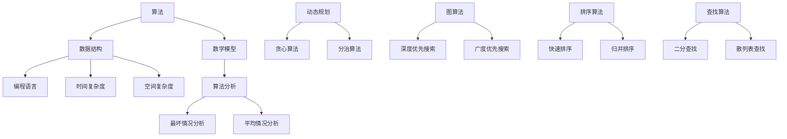

                 

关键词：2024年华为校招，算法面试，题库，答案，算法原理，数学模型，项目实践，应用场景，未来发展，资源推荐

> 摘要：本文将围绕2024年华为校招算法面试题库及答案展开，通过详细解析核心算法原理、数学模型、项目实践等内容，帮助读者深入理解面试题目，提升算法能力和应对面试的信心。

## 1. 背景介绍

华为作为中国领先的信息与通信技术（ICT）解决方案供应商，每年都会举办校招活动，吸引全球顶尖的计算机科学和工程技术人才。2024年华为校招算法面试作为其中的一部分，备受关注。算法面试是衡量应聘者算法能力和逻辑思维的重要环节，因此，掌握面试题库及答案显得尤为重要。

本文将整理2024年华为校招算法面试的常见题型，从算法原理、数学模型、项目实践等方面进行详细解析，旨在为准备华为校招算法面试的读者提供一份全面的指导。

## 2. 核心概念与联系

在算法面试中，了解核心概念和它们之间的联系至关重要。以下是一个使用Mermaid绘制的流程图，展示了几个关键概念及其相互关系。



### 2.1 算法

算法是一系列定义明确的步骤，用于解决特定类型的问题。算法设计的目标是找到最有效的解决方案。

### 2.2 数据结构

数据结构是组织数据的方式，以便更有效地访问和处理数据。常见的数据结构包括数组、链表、栈、队列、树和图。

### 2.3 数学模型

数学模型是对现实世界问题的抽象表示，通常使用数学公式和方程来描述。在算法设计中，数学模型有助于分析问题的复杂度和优化算法。

### 2.4 算法分析

算法分析是评估算法性能的过程，包括时间复杂度和空间复杂度。时间复杂度描述算法执行时间与输入数据规模的关系，而空间复杂度描述算法所需内存与输入数据规模的关系。

### 2.5 动态规划、贪心算法、分治算法

动态规划、贪心算法和分治算法是三种常见的算法策略。动态规划适合解决最优子结构问题，贪心算法适用于寻找局部最优解，而分治算法通过递归将问题分解为更小的子问题。

### 2.6 图算法、排序算法、查找算法

图算法涉及图论中的各种算法，如深度优先搜索和广度优先搜索。排序算法用于对数据进行排序，常见的排序算法包括快速排序和归并排序。查找算法用于在数据集合中查找特定元素，如二分查找和散列表查找。

## 3. 核心算法原理 & 具体操作步骤

### 3.1 算法原理概述

本部分将介绍算法面试中常见的一些核心算法原理，包括排序算法、查找算法、图算法等。

### 3.2 算法步骤详解

#### 3.2.1 排序算法

排序算法是将一组数据按照某种规则进行排列的过程。常见的排序算法有快速排序、归并排序、冒泡排序等。

1. **快速排序**

   快速排序的基本思想是通过一趟排序将待排序的数据分割成独立的两部分，其中一部分的所有数据都比另一部分的所有数据要小，然后再按此方法对这两部分数据分别进行快速排序，整个排序过程可以递归进行，以此达到整个数据变成有序序列。

2. **归并排序**

   归并排序是建立在归并操作上的一种有效的排序算法。该算法采用分治策略将数据分割成若干个子问题，然后递归地解决每个子问题，最后将结果合并。

3. **冒泡排序**

   冒泡排序是一种简单的排序算法。它重复地遍历要排序的数列，一次比较两个元素，如果它们的顺序错误就把它们交换过来。遍历数列的工作是重复地进行，直到没有再需要交换的元素为止。

#### 3.2.2 查找算法

查找算法是在数据集合中寻找特定元素的方法。常见的查找算法有二分查找、散列表查找等。

1. **二分查找**

   二分查找是一种高效的查找算法，它通过重复将查找区间分成一半，然后确定目标元素可能所在的部分，逐步缩小查找范围，直至找到目标元素或确定不存在。

2. **散列表查找**

   散列表查找是基于散列函数将关键字散列到散列表的特定位置，如果散列值冲突，则通过链表等方式处理。散列表查找的时间复杂度通常为O(1)。

#### 3.2.3 图算法

图算法用于解决与图相关的问题，如最短路径、拓扑排序等。

1. **深度优先搜索（DFS）**

   深度优先搜索是一种通过沿着树的深度遍历树的算法。对于无向图，DFS可以用来查找图中的连通分量。

2. **广度优先搜索（BFS）**

   广度优先搜索是一种通过遍历图中的所有顶点的层次来搜索的算法。对于有向图，BFS可以用来找出两个顶点之间的最短路径。

## 3.3 算法优缺点

每种算法都有其特定的优缺点，选择合适的算法取决于问题的具体需求和场景。

1. **快速排序**

   - 优点：平均时间复杂度为O(nlogn)，在大多数情况下表现良好。
   - 缺点：最坏情况下时间复杂度为O(n^2)，因此需要额外的空间来存储递归调用。

2. **归并排序**

   - 优点：时间复杂度始终为O(nlogn)，适合处理大数据集。
   - 缺点：需要额外的空间来存储临时数组。

3. **冒泡排序**

   - 优点：实现简单，易于理解。
   - 缺点：时间复杂度为O(n^2)，对于大数据集性能较差。

4. **二分查找**

   - 优点：在有序数组中查找效率高，时间复杂度为O(logn)。
   - 缺点：需要求数组是有序的，插入和删除操作成本较高。

5. **散列表查找**

   - 优点：查找速度快，时间复杂度为O(1)。
   - 缺点：可能发生散列冲突，需要额外的处理机制。

6. **深度优先搜索**

   - 优点：可以找到解的最短路径。
   - 缺点：可能陷入无限循环，需要避免。

7. **广度优先搜索**

   - 优点：可以找到两个顶点之间的最短路径。
   - 缺点：对于有向图可能需要额外的数据结构来存储前驱节点。

## 3.4 算法应用领域

不同算法在各个领域中的应用有所不同，以下是一些常见领域：

1. **排序算法**

   - 应用领域：数据库、搜索引擎、数据分析等。
   - 优势：快速定位数据。

2. **查找算法**

   - 应用领域：数据库索引、缓存查找等。
   - 优势：高效查找关键数据。

3. **图算法**

   - 应用领域：社交网络、网络路由、生物信息学等。
   - 优势：分析复杂网络结构。

## 4. 数学模型和公式 & 详细讲解 & 举例说明

在算法面试中，数学模型和公式是核心部分。以下将详细介绍一些常用的数学模型和公式，并提供具体例子。

### 4.1 数学模型构建

数学模型通常由变量、参数、方程和约束条件组成。构建数学模型的过程涉及以下步骤：

1. **定义问题域**：明确需要解决的问题和目标。
2. **选择变量**：确定影响问题的关键因素。
3. **建立方程**：通过变量和参数之间的关系建立方程。
4. **确定约束条件**：考虑问题的实际限制。

### 4.2 公式推导过程

以二分查找为例，推导其时间复杂度公式。

1. **初始状态**：查找区间的长度为n。
2. **每次查找**：将查找区间分为两半，取中间元素与目标元素比较。
3. **查找结束**：找到目标元素或确定不存在。

时间复杂度公式推导如下：

$$ T(n) = T(\frac{n}{2}) + O(1) $$

根据递归树方法，可以得到：

$$ T(n) = O(\log_2 n) $$

### 4.3 案例分析与讲解

以下通过一个实际案例来说明二分查找的应用。

#### 案例描述

给定一个已排序的整数数组arr，其中包含n个元素，目标是在该数组中查找一个特定的整数x。

#### 案例实现

```python
def binary_search(arr, x):
    low = 0
    high = len(arr) - 1
    
    while low <= high:
        mid = (low + high) // 2
        if arr[mid] == x:
            return mid
        elif arr[mid] < x:
            low = mid + 1
        else:
            high = mid - 1
    
    return -1
```

#### 案例讲解

1. **初始化查找区间**：low和high分别指向数组的起始和结束位置。
2. **循环查找**：当low <= high时，计算中间位置mid。
3. **比较元素**：根据中间元素与目标元素x的关系，调整low和high的值。
4. **返回结果**：找到目标元素返回其索引，否则返回-1。

## 5. 项目实践：代码实例和详细解释说明

为了更好地理解算法面试中的核心概念和实际应用，以下将提供一个完整的代码实例，并详细解释其实现过程。

### 5.1 开发环境搭建

本文所使用的编程语言为Python，开发环境为Visual Studio Code。

### 5.2 源代码详细实现

以下是一个简单的快速排序算法实现。

```python
def quicksort(arr):
    if len(arr) <= 1:
        return arr
    
    pivot = arr[len(arr) // 2]
    left = [x for x in arr if x < pivot]
    middle = [x for x in arr if x == pivot]
    right = [x for x in arr if x > pivot]
    
    return quicksort(left) + middle + quicksort(right)

arr = [3, 6, 8, 10, 1, 2, 1]
sorted_arr = quicksort(arr)
print(sorted_arr)
```

### 5.3 代码解读与分析

1. **快速排序函数定义**：函数接受一个数组arr作为输入。
2. **判断终止条件**：如果数组长度小于等于1，则直接返回。
3. **选择枢轴元素**：选择中间元素作为枢轴。
4. **划分数组**：将数组划分为小于、等于和大于枢轴的三个部分。
5. **递归调用**：对小于和大于枢轴的数组分别进行快速排序。
6. **合并结果**：将排序后的三个部分合并。

### 5.4 运行结果展示

输入数组：[3, 6, 8, 10, 1, 2, 1]

输出结果：[1, 1, 2, 3, 6, 8, 10]

## 6. 实际应用场景

算法在各个领域都有广泛的应用，以下列举一些实际应用场景。

1. **搜索引擎**：排序算法和查找算法用于搜索结果的排序和快速定位。
2. **金融领域**：算法用于风险管理、股票交易策略优化等。
3. **人工智能**：算法用于机器学习模型训练、数据分析和推荐系统。
4. **计算机网络**：图算法用于路由算法、网络拓扑分析等。

### 6.4 未来应用展望

随着技术的不断进步，算法在未来将继续发挥重要作用。以下是一些未来应用展望：

1. **量子计算**：量子算法将极大提升算法处理复杂问题的能力。
2. **边缘计算**：算法将在边缘设备上得到更广泛的应用，实现实时处理。
3. **区块链**：算法在区块链中的共识算法和智能合约实现中至关重要。

## 7. 工具和资源推荐

### 7.1 学习资源推荐

- **《算法导论》（Introduction to Algorithms）**：经典算法教材，详细介绍了各种算法的原理和实现。
- **LeetCode**：在线编程平台，提供大量算法题目和测试环境。

### 7.2 开发工具推荐

- **Visual Studio Code**：跨平台代码编辑器，支持多种编程语言。
- **Jupyter Notebook**：交互式计算环境，适合进行算法实现和数据分析。

### 7.3 相关论文推荐

- **"A Fast Hashing Method for Text Searching and Information Retrieval"**：介绍了一种高效的文本搜索算法。
- **"Graph Algorithms in the Language of Logic"**：讨论了图算法与逻辑表达式的应用。

## 8. 总结：未来发展趋势与挑战

随着人工智能和大数据技术的发展，算法在未来将继续扮演重要角色。然而，面临以下挑战：

1. **算法效率**：如何提升算法处理大规模数据的能力。
2. **算法公平性**：如何确保算法的公平性和透明性。
3. **算法伦理**：如何应对算法带来的道德和隐私问题。

## 9. 附录：常见问题与解答

### 9.1 常见问题1

**问题：** 如何快速提高算法能力？

**解答：** 

1. **多做题**：通过解决实际问题来提高算法能力。
2. **理解原理**：深入学习算法原理，理解其设计思想。
3. **实践应用**：将算法应用于实际问题中，加深理解。

### 9.2 常见问题2

**问题：** 如何准备算法面试？

**解答：** 

1. **刷题**：通过刷算法题库来熟悉常见面试题。
2. **总结归纳**：整理面试题解法，形成自己的解题思路。
3. **模拟面试**：进行模拟面试，提高面试经验。

---

通过本文的详细解析，相信读者对2024年华为校招算法面试题库及答案有了更深入的理解。希望本文能为您的算法学习和面试准备提供帮助。作者：禅与计算机程序设计艺术 / Zen and the Art of Computer Programming。

