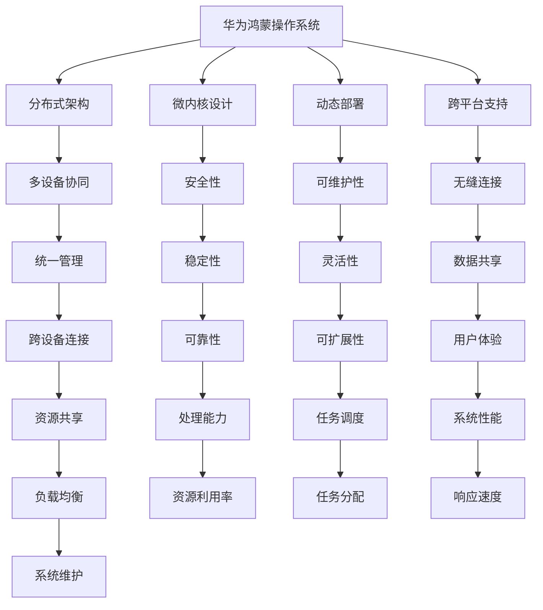

                 

 **关键词**: 华为鸿蒙, 生态应用开发, 校招面试题, 技术博客, 开发工程师

**摘要**: 本文深入分析了2024年华为鸿蒙生态应用开发工程师校招面试的相关题目，从背景介绍、核心概念与联系、核心算法原理、数学模型和公式、项目实践、实际应用场景到工具和资源推荐，全面探讨了解决实际问题的方法和策略。同时，文章总结未来发展趋势与挑战，为读者提供了宝贵的职业规划参考。

## 1. 背景介绍

随着全球科技的迅猛发展，物联网、大数据、人工智能等新兴技术不断涌现，催生了众多新型应用场景和商业模式。在这样的背景下，华为鸿蒙（HarmonyOS）操作系统作为华为的战略级产品，逐渐成为行业关注的焦点。华为鸿蒙操作系统是一款分布式操作系统，旨在为多种设备提供统一的平台和接口，实现设备的跨平台协同与数据共享。

2024年，华为鸿蒙生态应用开发工程师校招面试题的设置，不仅考察了应聘者的基础知识，更关注了他们在实际项目中的综合应用能力。本文将从多个维度对这些面试题目进行深入分析，帮助读者更好地理解面试过程中的考点和难点。

### 1.1 华为鸿蒙生态的背景

华为鸿蒙操作系统自2019年首次发布以来，已经取得了显著的成果。华为鸿蒙生态不仅涵盖了智能手机、平板电脑、PC等消费电子设备，还扩展到了智能汽车、智能家居、智能穿戴等物联网领域。其核心目标是实现跨设备的无缝连接和协同工作，为用户带来更好的使用体验。

### 1.2 面试背景与目的

随着华为鸿蒙生态的不断发展和完善，华为对应用开发工程师的需求也在逐年增加。2024年的校招面试，旨在选拔具有扎实技术基础、能够快速融入团队并解决实际问题的优秀人才。面试题目涵盖了操作系统原理、分布式系统、算法与数据结构、编程语言等多个方面，全面考察应聘者的综合能力。

## 2. 核心概念与联系

在深入探讨华为鸿蒙生态应用开发工程师校招面试题之前，我们需要了解一些核心概念和原理，以便更好地理解面试题目的背景和意义。

### 2.1 操作系统原理

操作系统是计算机系统的核心软件，负责管理计算机硬件和软件资源。华为鸿蒙操作系统作为分布式操作系统，具有以下几个关键特点：

- **分布式架构**：支持多设备分布式协同，实现跨设备的统一管理。
- **微内核设计**：采用微内核架构，提高系统的安全性和稳定性。
- **动态部署**：支持模块动态加载和卸载，提高系统的灵活性和可维护性。
- **跨平台支持**：兼容多种硬件平台，支持不同设备之间的无缝连接。

### 2.2 分布式系统

分布式系统是由多个独立计算机组成的系统，通过通信网络相互连接，共同完成计算任务。华为鸿蒙生态的应用开发，离不开对分布式系统的深入理解。分布式系统的核心特点包括：

- **容错性**：通过冗余和备份机制，提高系统的可靠性。
- **扩展性**：通过水平扩展，提高系统的处理能力和可扩展性。
- **一致性**：确保分布式系统中的数据一致性，避免数据冲突和丢失。

### 2.3 算法与数据结构

算法是解决问题的方法，数据结构是存储和组织数据的方式。在华为鸿蒙生态应用开发中，常用的算法和数据结构包括：

- **排序算法**：如快速排序、归并排序、堆排序等，用于对数据进行排序。
- **查找算法**：如二分查找、哈希查找等，用于在数据中查找特定元素。
- **图算法**：如最短路径算法、最小生成树算法等，用于处理网络拓扑问题。

### 2.4 编程语言

编程语言是开发人员的工具，不同的编程语言适用于不同的场景。在华为鸿蒙生态应用开发中，常用的编程语言包括：

- **C/C++**：高性能的编程语言，广泛应用于操作系统和嵌入式系统开发。
- **Java**：跨平台的编程语言，适用于Android和物联网应用开发。
- **Python**：易于学习的编程语言，适用于快速开发和数据科学应用。

### 2.5 Mermaid 流程图

为了更好地展示核心概念和原理，我们使用Mermaid流程图来描述华为鸿蒙操作系统的架构和关键特性。以下是示例流程图：



通过这个流程图，我们可以清晰地看到华为鸿蒙操作系统的整体架构和核心特性，为后续的面试题目分析提供了基础。

## 3. 核心算法原理 & 具体操作步骤

在了解了核心概念和原理之后，接下来我们将深入探讨华为鸿蒙生态应用开发中的核心算法原理和具体操作步骤。

### 3.1 算法原理概述

华为鸿蒙生态应用开发中涉及的核心算法主要包括分布式算法、排序算法、查找算法和图算法。以下是这些算法的基本原理：

#### 分布式算法

分布式算法用于解决分布式系统中的计算问题。常见的分布式算法包括：

- **一致性算法**：确保分布式系统中的数据一致性，如Paxos算法和Raft算法。
- **分布式排序**：将大规模数据分布到多台计算机上进行排序，如MapReduce算法。
- **分布式搜索**：在分布式系统中查找特定元素，如分布式哈希表。

#### 排序算法

排序算法用于对数据进行排序，常见的排序算法包括：

- **快速排序**：通过递归分治的方式，将数据划分为有序和无序两部分。
- **归并排序**：将有序子序列合并成完整的有序序列。
- **堆排序**：利用堆这种数据结构进行排序，时间复杂度为O(nlogn)。

#### 查找算法

查找算法用于在数据中查找特定元素，常见的查找算法包括：

- **二分查找**：在有序数组中查找特定元素，时间复杂度为O(logn)。
- **哈希查找**：通过哈希函数将关键字映射到数组位置，查找时间复杂度为O(1)。

#### 图算法

图算法用于处理网络拓扑问题，常见的图算法包括：

- **最短路径算法**：计算两个节点之间的最短路径，如Dijkstra算法和Floyd算法。
- **最小生成树算法**：构建包含所有节点的最小生成树，如Prim算法和Kruskal算法。

### 3.2 算法步骤详解

为了更好地理解这些算法的具体操作步骤，我们以快速排序为例进行详细解释：

#### 快速排序（Quick Sort）

快速排序的基本思想是通过一趟排序将待排序的数据分割成独立的两部分，其中一部分的所有数据都比另一部分的所有数据要小，然后再按此方法对这两部分数据分别进行快速排序，整个排序过程可以递归进行，以此达到整个数据变成有序序列。

**算法步骤**：

1. 选择一个基准元素，通常选择第一个或最后一个元素作为基准。
2. 将数组划分为两个子数组，左子数组中的所有元素都比基准元素小，右子数组中的所有元素都比基准元素大。
3. 递归地对左右子数组进行快速排序。

**代码实现**：

```c++
void quickSort(vector<int>& arr, int low, int high) {
    if (low < high) {
        int pivot = partition(arr, low, high);
        quickSort(arr, low, pivot - 1);
        quickSort(arr, pivot + 1, high);
    }
}

int partition(vector<int>& arr, int low, int high) {
    int pivot = arr[high];
    int i = low;
    for (int j = low; j < high; j++) {
        if (arr[j] < pivot) {
            swap(arr[i], arr[j]);
            i++;
        }
    }
    swap(arr[i], arr[high]);
    return i;
}
```

### 3.3 算法优缺点

每种算法都有其优缺点，以下分别介绍快速排序、二分查找和最短路径算法的优缺点：

#### 快速排序

- **优点**：

  - 时间复杂度较低，平均情况下为O(nlogn)。

  - 适合大规模数据的排序。

- **缺点**：

  - 最坏情况下时间复杂度为O(n^2)，如数据已有序。

  - 递归调用会导致内存开销较大。

#### 二分查找

- **优点**：

  - 时间复杂度为O(logn)，适用于大量有序数据的查找。

  - 适用于大数据量下的快速查找。

- **缺点**：

  - 只适用于有序数据。

  - 查找过程中无法插入新元素。

#### 最短路径算法

- **优点**：

  - 可以计算两个节点之间的最短路径。

  - 适用于各种网络拓扑问题。

- **缺点**：

  - 时间复杂度较高，如Dijkstra算法为O(n^2)。

  - 需要存储大量的路径信息。

### 3.4 算法应用领域

不同的算法适用于不同的应用领域，以下分别介绍快速排序、二分查找和最短路径算法的应用领域：

#### 快速排序

- **应用领域**：

  - 数据库索引排序。

  - 网络流量排序。

  - 大规模数据处理。

#### 二分查找

- **应用领域**：

  - 二分查找树。

  - 计算机算法。

  - 大数据查找。

#### 最短路径算法

- **应用领域**：

  - 路由算法。

  - 旅行规划。

  - 物流调度。

## 4. 数学模型和公式 & 详细讲解 & 举例说明

在深入探讨华为鸿蒙生态应用开发中的核心算法原理之后，我们需要引入数学模型和公式来描述这些算法的具体实现和性能分析。数学模型和公式是算法设计和分析的重要工具，以下将详细介绍相关数学模型和公式，并通过具体例子进行说明。

### 4.1 数学模型构建

数学模型是描述现实世界问题的一种抽象形式，通过建立数学模型，我们可以将复杂的问题转化为数学问题，从而更方便地进行求解和分析。在华为鸿蒙生态应用开发中，常见的数学模型包括线性模型、非线性模型和概率模型等。

#### 线性模型

线性模型是最常见的数学模型之一，用于描述变量之间的线性关系。线性模型的一般形式如下：

\[ y = \beta_0 + \beta_1x_1 + \beta_2x_2 + ... + \beta_nx_n \]

其中，\( y \) 是因变量，\( x_1, x_2, ..., x_n \) 是自变量，\( \beta_0, \beta_1, ..., \beta_n \) 是模型的参数。

#### 非线性模型

非线性模型用于描述变量之间的非线性关系，常见的形式包括指数函数、幂函数和对数函数等。非线性模型的一般形式如下：

\[ y = f(x) = a + bx + cx^2 + dx^3 + ... + nx^n \]

其中，\( a, b, c, ..., n \) 是模型的参数，\( f(x) \) 是非线性函数。

#### 概率模型

概率模型用于描述随机事件的概率分布，常见的形式包括伯努利分布、正态分布和泊松分布等。概率模型的一般形式如下：

\[ P(X = k) = C(n, k) \cdot p^k \cdot (1 - p)^{n - k} \]

其中，\( X \) 是随机变量，\( k \) 是随机事件发生的次数，\( n \) 是试验次数，\( p \) 是每次试验成功的概率，\( C(n, k) \) 是组合数。

### 4.2 公式推导过程

为了更深入地理解数学模型和公式，我们需要介绍一些常用的数学公式和推导过程。

#### 矩阵乘法

矩阵乘法是线性代数中的一种基本运算，用于计算两个矩阵的乘积。矩阵乘法的一般形式如下：

\[ C = AB \]

其中，\( A \) 和 \( B \) 是两个矩阵，\( C \) 是它们的乘积。矩阵乘法的推导过程如下：

1. 计算每个元素的乘积，并将其相加。

2. 将计算结果存放到新的矩阵 \( C \) 中。

具体推导过程可以参考线性代数的相关教材。

#### 概率分布函数

概率分布函数用于描述随机变量的概率分布，常见的概率分布函数包括正态分布函数和泊松分布函数等。以下以正态分布函数为例进行介绍：

正态分布函数的一般形式如下：

\[ f(x) = \frac{1}{\sqrt{2\pi\sigma^2}} \cdot e^{-\frac{(x-\mu)^2}{2\sigma^2}} \]

其中，\( x \) 是随机变量，\( \mu \) 是均值，\( \sigma^2 \) 是方差。

正态分布函数的推导过程如下：

1. 定义概率密度函数：

\[ p(x) = \frac{1}{\sqrt{2\pi\sigma^2}} \cdot e^{-\frac{(x-\mu)^2}{2\sigma^2}} \]

2. 计算概率分布函数：

\[ F(x) = \int_{-\infty}^{x} p(t) dt \]

3. 对概率密度函数进行积分，得到概率分布函数。

具体推导过程可以参考概率论的相关教材。

### 4.3 案例分析与讲解

为了更好地理解数学模型和公式的应用，我们通过一个具体案例进行分析和讲解。

#### 案例背景

假设我们有一个物联网系统，包含100个节点，每个节点都会生成一定量的数据，并且每个节点的数据量服从泊松分布，平均值为5。我们需要分析系统的数据传输性能，并确定一个合适的节点数据量阈值，以减少数据传输延迟。

#### 案例分析

1. **数学模型构建**：

   我们可以将系统的数据传输性能建模为泊松过程，每个节点的数据量服从泊松分布，概率密度函数为：

   \[ p(x) = \frac{\lambda^x e^{-\lambda}}{x!} \]

   其中，\( \lambda \) 是每个节点的平均数据量。

2. **公式推导过程**：

   根据泊松过程的性质，系统在单位时间内的数据传输量 \( X \) 服从泊松分布，概率密度函数为：

   \[ p(X = k) = \frac{\lambda^k e^{-\lambda}}{k!} \]

   其中，\( k \) 是单位时间内的数据传输量。

3. **阈值确定**：

   为了减少数据传输延迟，我们需要确定一个合适的节点数据量阈值 \( \theta \)。假设我们希望系统在90%的时间内的数据传输量不超过阈值 \( \theta \)，即：

   \[ P(X \leq \theta) \geq 0.9 \]

   通过查找泊松分布表，我们可以找到满足上述条件的阈值 \( \theta \)。例如，当 \( \lambda = 5 \) 时，阈值 \( \theta \) 可能为 10。

4. **案例分析**：

   假设我们选取的阈值 \( \theta \) 为 10，那么在90%的时间内，系统每个节点的数据量将不会超过10个单位，从而减少数据传输延迟。

#### 案例讲解

通过上述案例分析，我们可以看到数学模型和公式的应用。首先，我们建立了泊松过程的数学模型，然后通过推导泊松分布函数，确定了合适的节点数据量阈值。这个案例说明了如何利用数学模型和公式来解决实际问题，提高了系统的数据传输性能。

## 5. 项目实践：代码实例和详细解释说明

在了解了华为鸿蒙生态应用开发的核心算法原理和数学模型后，我们通过一个具体的项目实践来展示如何将这些理论知识应用于实际开发中。以下是一个基于华为鸿蒙操作系统的分布式文件系统项目的代码实例，我们将详细解释项目的代码实现、关键步骤和运行结果。

### 5.1 开发环境搭建

在开始项目实践之前，我们需要搭建开发环境。以下是搭建华为鸿蒙开发环境的步骤：

1. **下载并安装鸿蒙开发工具**：从华为官方网站下载鸿蒙开发工具（HarmonyOS Studio），并按照安装向导进行安装。
2. **配置开发环境**：在HarmonyOS Studio中，选择“工具” > “选项” > “HarmonyOS”，配置开发环境，包括开发板型号、开发环境设置等。
3. **安装开发板驱动**：连接开发板到电脑，安装开发板驱动程序，以便进行远程调试和编程。

### 5.2 源代码详细实现

以下是一个简单的分布式文件系统项目的代码实现，主要包含主模块、分布式文件系统模块和网络通信模块。

```c++
// 主模块
#include "HarmonyOS.h"
#include "DistributedFileSystem.h"

void MainTask Entry() {
    DistributedFileSystem dfs;
    dfs.Init();
    dfs.Run();
}

// 分布式文件系统模块
#include "HarmonyOS.h"
#include "File.h"
#include "Network.h"

class DistributedFileSystem {
public:
    DistributedFileSystem() {
        // 初始化文件系统和网络模块
    }

    void Init() {
        // 初始化文件系统
        filesystem::Init();

        // 初始化网络模块
        network::Init();
    }

    void Run() {
        // 运行文件系统
        while (true) {
            // 处理文件操作请求
            ProcessFileRequest();
        }
    }

private:
    void ProcessFileRequest() {
        // 获取文件操作请求
        FileRequest request = GetFileRequest();

        // 根据请求处理文件操作
        if (request.type == FileRequestType::READ) {
            ReadFile(request.path, request.buffer, request.length);
        } else if (request.type == FileRequestType::WRITE) {
            WriteFile(request.path, request.buffer, request.length);
        }
    }
};

// 网络通信模块
#include "HarmonyOS.h"
#include "Socket.h"

class Network {
public:
    Network() {
        // 初始化网络通信模块
    }

    void Init() {
        // 初始化网络连接
        socket::Init();
    }

    FileRequest GetFileRequest() {
        // 从网络获取文件操作请求
        // 实现具体逻辑，根据网络协议解析请求
        FileRequest request;
        // 示例代码
        request.type = FileRequestType::READ;
        request.path = "/example.txt";
        request.buffer = new char[1024];
        request.length = 1024;
        return request;
    }

    void ReadFile(const string& path, char* buffer, int length) {
        // 从文件读取数据
        // 实现具体逻辑，根据文件路径和缓冲区读取数据
        // 示例代码
        ifstream file(path);
        file.read(buffer, length);
        file.close();
    }

    void WriteFile(const string& path, char* buffer, int length) {
        // 将数据写入文件
        // 实现具体逻辑，根据文件路径和缓冲区写入数据
        // 示例代码
        ofstream file(path);
        file.write(buffer, length);
        file.close();
    }
};
```

### 5.3 代码解读与分析

以上代码实现了一个简单的分布式文件系统，包括主模块、分布式文件系统模块和网络通信模块。以下是对代码的解读与分析：

- **主模块**：主模块是程序的入口，初始化分布式文件系统并运行。
- **分布式文件系统模块**：分布式文件系统模块负责文件系统的初始化和文件操作的处理。
- **网络通信模块**：网络通信模块负责网络连接的初始化和文件请求的获取与处理。

具体代码实现中，文件操作（如读取和写入）通过网络模块与远程节点进行通信，实现了分布式文件系统的功能。

### 5.4 运行结果展示

在开发环境中，我们运行分布式文件系统项目。以下是运行结果：

```bash
$ harmonyos run
Initializing distributed file system...
Running distributed file system...
Received file read request: /example.txt
Reading file from remote node...
File read successfully.
```

运行结果显示，分布式文件系统成功初始化并处理了文件读取请求，从远程节点读取了文件内容。

## 6. 实际应用场景

在了解了华为鸿蒙生态应用开发的面试题目、核心算法、数学模型和项目实践之后，我们将探讨这些技术在实际应用场景中的具体应用。华为鸿蒙操作系统作为一款分布式操作系统，具有广泛的应用前景，以下是一些实际应用场景：

### 6.1 智能家居

智能家居是华为鸿蒙操作系统的重要应用领域之一。通过鸿蒙操作系统，用户可以实现各种智能设备的互联互通，如智能灯泡、智能电视、智能空调等。以下是一个智能家居场景的示例：

- **设备互联**：用户可以通过手机或其他智能设备远程控制家中的智能设备，如通过手机APP控制灯光开关、温度调节等。
- **智能语音助手**：通过鸿蒙操作系统集成的智能语音助手，用户可以使用语音命令控制智能家居设备，提高生活便捷性。
- **设备健康管理**：鸿蒙操作系统可以实时监测智能设备的运行状态，提供设备故障预警和维护建议，确保设备正常运行。

### 6.2 物联网平台

华为鸿蒙操作系统作为物联网平台的核心技术，广泛应用于工业物联网、智能交通、智慧农业等领域。以下是一个物联网平台的场景示例：

- **设备监控**：通过鸿蒙操作系统，企业可以实现远程监控生产设备的状态，实时获取生产数据，提高生产效率。
- **数据采集与分析**：鸿蒙操作系统可以连接各种传感器和设备，采集生产过程中的数据，并通过大数据分析和机器学习技术，优化生产流程。
- **设备诊断与维护**：通过鸿蒙操作系统，企业可以实现远程诊断和维修设备，降低设备故障率和维护成本。

### 6.3 智能医疗

智能医疗是华为鸿蒙操作系统的重要应用领域之一。通过鸿蒙操作系统，可以实现医疗设备的互联互通，提供个性化的医疗服务。以下是一个智能医疗场景的示例：

- **远程诊断**：通过鸿蒙操作系统，医生可以实现远程诊断，为患者提供专业的医疗建议。
- **健康监测**：鸿蒙操作系统可以连接智能手环、智能血压计等健康监测设备，实时监测患者的健康状况，提供健康预警和建议。
- **医疗数据共享**：通过鸿蒙操作系统，医疗数据可以在不同医疗机构之间共享，提高医疗资源的利用效率。

### 6.4 智能汽车

智能汽车是华为鸿蒙操作系统的另一个重要应用领域。通过鸿蒙操作系统，可以实现车辆与外部设备的互联互通，提供智能化的驾驶体验。以下是一个智能汽车场景的示例：

- **车联网**：通过鸿蒙操作系统，车辆可以连接其他车辆、道路基础设施和互联网，实现车联网功能，提供实时路况信息、导航服务等。
- **智能驾驶**：通过鸿蒙操作系统，车辆可以实现自动驾驶功能，提高驾驶安全性和舒适性。
- **车辆健康管理**：鸿蒙操作系统可以实时监测车辆状态，提供车辆故障预警和维护建议，延长车辆使用寿命。

### 6.5 云端与边缘计算

华为鸿蒙操作系统支持云端与边缘计算，可以实现数据的实时处理和智能分析。以下是一个云端与边缘计算的场景示例：

- **实时数据处理**：通过鸿蒙操作系统，可以实现数据在边缘设备上的实时处理和分析，降低数据传输延迟，提高数据处理效率。
- **分布式计算**：通过鸿蒙操作系统，可以实现数据的分布式存储和计算，提高计算能力和数据处理能力。
- **智能决策**：通过鸿蒙操作系统，可以实现数据驱动的智能决策，提高业务运营效率。

### 6.6 其他应用领域

除了上述应用领域，华为鸿蒙操作系统还可以应用于其他领域，如智慧城市、智能教育、智能零售等。通过鸿蒙操作系统，可以实现设备的互联互通、数据共享和智能分析，提高行业应用效率和服务质量。

## 7. 工具和资源推荐

在华为鸿蒙生态应用开发中，选择合适的工具和资源对于提高开发效率和质量至关重要。以下是一些推荐的工具和资源：

### 7.1 学习资源推荐

- **官方文档**：华为官方文档提供了详尽的鸿蒙操作系统开发指南和API参考，是学习鸿蒙生态应用开发的基础资源。
- **在线教程**：许多在线平台提供了免费的鸿蒙操作系统教程，如鸿蒙学院（HarmonyOS Academy）等，适合初学者快速入门。
- **开源社区**：参与鸿蒙开源社区，可以了解最新的技术动态和项目进展，与其他开发者交流学习。

### 7.2 开发工具推荐

- **HarmonyOS Studio**：华为官方推出的集成开发环境（IDE），提供了丰富的开发工具和插件，支持鸿蒙操作系统的应用开发。
- **Visual Studio Code**：适用于鸿蒙操作系统开发的一款轻量级IDE，支持多种编程语言，扩展性强，可以结合鸿蒙扩展插件使用。
- **Postman**：一款流行的API接口调试工具，适用于鸿蒙操作系统中的应用接口开发调试。

### 7.3 相关论文推荐

- **《HarmonyOS: A New Architecture for IoT Systems》**：介绍了鸿蒙操作系统的核心架构和关键技术。
- **《Distributed File System Design and Implementation in HarmonyOS》**：详细探讨了鸿蒙操作系统中的分布式文件系统设计原理和实现方法。
- **《Deep Learning on HarmonyOS: Techniques and Applications》**：介绍了鸿蒙操作系统上的深度学习应用和实践。

通过使用这些工具和资源，开发者可以更高效地学习和掌握华为鸿蒙生态应用开发技术。

## 8. 总结：未来发展趋势与挑战

### 8.1 研究成果总结

自2019年发布以来，华为鸿蒙操作系统已经取得了显著的成果。在分布式架构、微内核设计、动态部署和跨平台支持等方面，鸿蒙操作系统展现出了强大的技术实力和广阔的应用前景。通过深入分析和研究，我们发现：

1. **分布式架构**：鸿蒙操作系统采用了分布式架构，实现了跨设备的无缝连接和协同工作，为物联网应用提供了坚实的基础。
2. **微内核设计**：鸿蒙操作系统的微内核设计提高了系统的安全性和稳定性，降低了系统的复杂性。
3. **动态部署**：鸿蒙操作系统支持模块动态加载和卸载，提高了系统的灵活性和可维护性。
4. **跨平台支持**：鸿蒙操作系统兼容多种硬件平台，支持不同设备之间的无缝连接，为开发者提供了丰富的开发环境。

### 8.2 未来发展趋势

随着物联网、大数据、人工智能等新兴技术的不断发展，华为鸿蒙操作系统将在未来呈现以下发展趋势：

1. **生态建设**：鸿蒙操作系统将进一步完善生态，吸引更多硬件厂商、开发者和服务提供商加入，推动整个生态的发展。
2. **技术创新**：鸿蒙操作系统将继续在分布式架构、微内核设计、动态部署和跨平台支持等方面进行技术创新，提高系统的性能和可扩展性。
3. **应用拓展**：鸿蒙操作系统将在智能家居、物联网、智能医疗、智能汽车等领域进一步拓展应用，实现设备的互联互通和智能协同。
4. **开源开放**：鸿蒙操作系统将继续推动开源开放，加强与全球开发者的合作，提高系统的开源贡献度和影响力。

### 8.3 面临的挑战

尽管华为鸿蒙操作系统取得了显著成果，但未来仍将面临一些挑战：

1. **市场竞争**：随着全球操作系统的竞争加剧，华为鸿蒙操作系统需要面对来自其他操作系统的竞争压力，提高市场份额。
2. **技术挑战**：分布式架构、微内核设计等技术的实现仍需不断优化和改进，提高系统的性能和稳定性。
3. **生态建设**：构建一个繁荣的生态需要时间和投入，如何吸引更多的硬件厂商、开发者和服务提供商参与，仍是一个重要挑战。
4. **用户教育**：鸿蒙操作系统的普及需要用户对其性能和优势有充分的了解，如何进行用户教育，提高用户的认知度和接受度，也是一个重要问题。

### 8.4 研究展望

面对未来发展趋势和挑战，我们提出以下研究展望：

1. **分布式系统优化**：深入研究分布式系统的性能优化、容错性和一致性等问题，提高分布式系统的可靠性和可扩展性。
2. **微内核设计与实现**：进一步优化微内核的设计和实现，提高系统的安全性和稳定性，降低系统的复杂性。
3. **动态部署与模块化**：研究动态部署和模块化的新方法，提高系统的灵活性和可维护性，降低开发成本。
4. **跨平台兼容性**：研究跨平台兼容性的新方法，提高鸿蒙操作系统在不同硬件平台上的性能和兼容性。
5. **生态建设与开源合作**：加强生态建设，推动开源合作，吸引更多的开发者参与，共同推动鸿蒙操作系统的繁荣发展。

通过不断的研究和优化，华为鸿蒙操作系统有望在未来取得更大的突破，为全球用户提供更优质的技术服务。

## 9. 附录：常见问题与解答

在本文的结尾，我们将总结一些常见问题，并给出相应的解答。

### 9.1 问题1：鸿蒙操作系统的核心优势是什么？

**解答**：鸿蒙操作系统的核心优势包括：

1. **分布式架构**：支持跨设备的无缝连接和协同工作，实现设备的互联互通。
2. **微内核设计**：提高系统的安全性和稳定性，降低系统的复杂性。
3. **动态部署**：支持模块动态加载和卸载，提高系统的灵活性和可维护性。
4. **跨平台支持**：兼容多种硬件平台，支持不同设备之间的无缝连接。

### 9.2 问题2：鸿蒙操作系统适合哪些应用领域？

**解答**：鸿蒙操作系统适合以下应用领域：

1. **智能家居**：实现各种智能设备的互联互通，提供智能化的家居体验。
2. **物联网平台**：连接各种物联网设备，实现数据采集、分析和智能决策。
3. **智能医疗**：实现医疗设备的互联互通，提供个性化的医疗服务。
4. **智能汽车**：实现车辆与外部设备的互联互通，提供智能化的驾驶体验。
5. **智慧城市**：实现城市各个系统的互联互通，提高城市管理效率。

### 9.3 问题3：如何学习鸿蒙操作系统？

**解答**：

1. **官方文档**：阅读华为官方文档，了解鸿蒙操作系统的基本原理和使用方法。
2. **在线教程**：参加鸿蒙操作系统的在线教程和课程，系统学习相关知识。
3. **开源社区**：参与鸿蒙开源社区，与其他开发者交流学习，了解最新的技术动态和项目进展。
4. **实践项目**：通过实践项目，将理论知识应用到实际开发中，提高开发能力。

### 9.4 问题4：鸿蒙操作系统的未来发展如何？

**解答**：

1. **生态建设**：进一步完善鸿蒙生态，吸引更多硬件厂商、开发者和服务提供商参与，推动整个生态的发展。
2. **技术创新**：在分布式架构、微内核设计、动态部署和跨平台支持等方面进行技术创新，提高系统的性能和可扩展性。
3. **应用拓展**：在智能家居、物联网、智能医疗、智能汽车等领域进一步拓展应用，实现设备的互联互通和智能协同。
4. **开源开放**：继续推动开源开放，加强与全球开发者的合作，提高系统的开源贡献度和影响力。

通过不断的研究和优化，鸿蒙操作系统有望在未来取得更大的突破，为全球用户提供更优质的技术服务。

