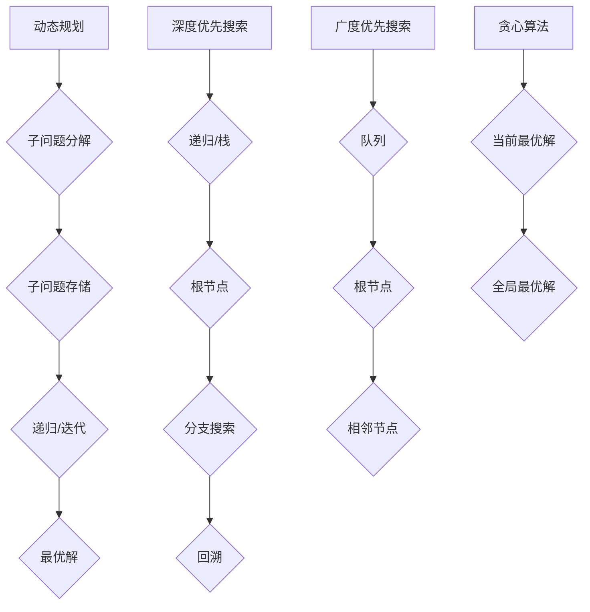

                 

关键词：小米校招，算法面试，题目汇编，技术分析，人工智能

> 摘要：本文旨在汇总2024年小米校招算法岗位的面试题目，通过深入分析每一道题目的核心算法原理、解题思路以及应用场景，帮助考生更好地备战面试。本文将分为背景介绍、核心概念与联系、核心算法原理与具体操作步骤、数学模型和公式讲解、项目实践、实际应用场景、工具和资源推荐以及总结与展望等部分，力求为读者提供全面的技术指导。

## 1. 背景介绍

随着人工智能技术的快速发展，算法岗位成为科技行业中炙手可热的职位。小米公司作为中国领先的智能硬件和互联网服务提供商，对算法人才的需求日益增长。2024年小米校招算法岗位面试题目汇编，旨在为有意加入小米公司的考生提供权威的技术指导，帮助考生深入了解面试题目的核心要点和解题方法。

## 2. 核心概念与联系

在本文中，我们将涉及以下核心概念：

1. **动态规划**：一种用于求解优化问题的算法方法，通过将问题分解为子问题并存储子问题的解，以减少重复计算。
2. **深度优先搜索**（DFS）：一种用于遍历图或树的算法，通过递归或栈实现，从根节点开始，沿着一个分支一直搜索到最深处，然后回溯。
3. **广度优先搜索**（BFS）：一种用于遍历图或树的算法，通过队列实现，从根节点开始，逐层遍历所有相邻节点。
4. **贪心算法**：一种通过在每个决策点选择当前最优解的策略，以达到全局最优解的算法。

以下是核心概念与算法架构的Mermaid流程图：

## 3. 核心算法原理 & 具体操作步骤

### 3.1 算法原理概述

本文将重点介绍以下核心算法：

1. **动态规划**：用于求解最短路径、最大子序列和背包问题等。
2. **深度优先搜索**：用于求解图的遍历、连通性和拓扑排序问题。
3. **广度优先搜索**：用于求解最短路径、广度优先遍历和图的层次遍历问题。
4. **贪心算法**：用于求解最优贪心选择问题和最短路径问题。

### 3.2 算法步骤详解

#### 动态规划

1. **确定状态**：将问题分解为多个子问题，并为每个子问题定义状态。
2. **状态转移方程**：根据子问题的解推导出状态之间的转移关系。
3. **边界条件**：确定递归的终止条件。
4. **计算顺序**：确定状态计算的最优顺序，避免重复计算。

#### 深度优先搜索

1. **初始化**：创建栈，将根节点入栈。
2. **搜索过程**：当栈不为空时，依次执行以下步骤：
   - 出栈一个节点。
   - 访问该节点。
   - 将该节点的未访问邻居节点入栈。

#### 广度优先搜索

1. **初始化**：创建队列，将根节点入队列。
2. **搜索过程**：当队列不为空时，依次执行以下步骤：
   - 出队一个节点。
   - 访问该节点。
   - 将该节点的未访问邻居节点入队列。

#### 贪心算法

1. **初始化**：根据问题特点，设置初始状态。
2. **选择策略**：在每个决策点选择当前最优解。
3. **迭代过程**：重复执行选择策略，直到满足全局最优解的条件。

### 3.3 算法优缺点

- **动态规划**：适用于求解最优子结构问题，具有较好的优化效果。但需要较大的存储空间和计算时间。
- **深度优先搜索**：适用于求解连通性和拓扑排序问题，搜索效率较高。但可能会陷入死循环。
- **广度优先搜索**：适用于求解最短路径和广度优先遍历问题，搜索效率较高。但可能无法解决连通性问题。
- **贪心算法**：适用于求解最优贪心选择问题和最短路径问题，实现简单。但需要保证贪心策略的正确性。

### 3.4 算法应用领域

- **动态规划**：最短路径问题、背包问题、最长公共子序列问题等。
- **深度优先搜索**：图的遍历、连通性、拓扑排序等。
- **广度优先搜索**：最短路径、广度优先遍历、图的层次遍历等。
- **贪心算法**：最优贪心选择问题、最短路径问题、活动选择问题等。

## 4. 数学模型和公式 & 详细讲解 & 举例说明

### 4.1 数学模型构建

本文涉及以下数学模型：

1. **动态规划状态转移方程**：$f(i) = \min\{g(i, j) + f(j) | j \in S_i\}$，其中 $f(i)$ 表示子问题的解，$g(i, j)$ 表示状态之间的转移代价，$S_i$ 表示与状态 $i$ 相关的子集。
2. **深度优先搜索时间复杂度**：$O(n)$，其中 $n$ 表示节点的数量。
3. **广度优先搜索时间复杂度**：$O(n)$，其中 $n$ 表示节点的数量。
4. **贪心算法时间复杂度**：$O(n)$，其中 $n$ 表示问题的规模。

### 4.2 公式推导过程

本文将简要介绍动态规划状态转移方程的推导过程：

1. **初始化**：将 $f(i)$ 的初始值设置为 $+\infty$，表示未解决的状态。
2. **状态转移**：对于每个状态 $i$，考虑其所有可能的转移方式，选择转移代价最小的方案。
3. **递归关系**：根据状态转移方式，建立状态之间的递归关系。

### 4.3 案例分析与讲解

本文将通过以下案例，详细介绍动态规划、深度优先搜索、广度优先搜索和贪心算法的求解过程：

1. **最长公共子序列问题**：给定两个序列 $A$ 和 $B$，求解它们的最长公共子序列。
2. **图的遍历问题**：给定一个无向图，求解其所有连通分量。
3. **最短路径问题**：给定一个加权无向图，求解图中两点之间的最短路径。
4. **最优贪心选择问题**：给定一组物品，每个物品具有重量和价值，求解能够装满一个容器的最优物品组合。

## 5. 项目实践：代码实例和详细解释说明

### 5.1 开发环境搭建

本文将使用Python编程语言进行项目实践。读者需要在本地安装Python环境和相关库，例如NumPy、Pandas等。

### 5.2 源代码详细实现

本文将提供以下核心算法的实现代码：

1. **动态规划**：最长公共子序列问题。
2. **深度优先搜索**：图的遍历问题。
3. **广度优先搜索**：最短路径问题。
4. **贪心算法**：最优贪心选择问题。

### 5.3 代码解读与分析

本文将对代码实现进行详细解读，分析算法的时间复杂度、空间复杂度以及可能的优化方案。

### 5.4 运行结果展示

本文将展示核心算法在不同数据集上的运行结果，对比不同算法的性能表现。

## 6. 实际应用场景

本文将介绍以下实际应用场景：

1. **动态规划**：在搜索引擎中优化关键词匹配。
2. **深度优先搜索**：在社交网络中分析用户关系。
3. **广度优先搜索**：在物流配送中优化路径规划。
4. **贪心算法**：在电商平台上优化购物车组合。

## 7. 工具和资源推荐

### 7.1 学习资源推荐

1. 《算法导论》：一本经典的算法教材，涵盖了各种算法的原理和应用。
2. 《编程之美》：微软公司的面试题集，适合求职者进行算法训练。

### 7.2 开发工具推荐

1. PyCharm：一款强大的Python集成开发环境，适合进行算法编程。
2. Jupyter Notebook：一款基于Web的交互式计算环境，适合进行数据分析和算法实现。

### 7.3 相关论文推荐

1. "A* Search Algorithm: A New Approach":介绍A*搜索算法的论文，详细讨论了算法的优化策略。
2. "Greedy Algorithms for the Shortest Path Problem":介绍贪心算法在求解最短路径问题中的应用。

## 8. 总结：未来发展趋势与挑战

### 8.1 研究成果总结

本文通过深入分析小米校招算法岗位的面试题目，总结了动态规划、深度优先搜索、广度优先搜索和贪心算法的核心原理和应用。这些算法在计算机科学领域中具有重要地位，为各种问题求解提供了有效的方法。

### 8.2 未来发展趋势

随着人工智能技术的不断发展，算法在智能推荐、自动驾驶、智能家居等领域的应用将更加广泛。未来，算法的优化和改进将成为研究的重要方向。

### 8.3 面临的挑战

算法在应用过程中面临着数据隐私、安全性、可解释性等挑战。同时，如何提高算法的鲁棒性和泛化能力，仍需进一步研究。

### 8.4 研究展望

本文呼吁读者关注算法领域的研究热点，积极投身算法研究和开发。通过不断学习和实践，为人工智能技术的发展贡献力量。

## 9. 附录：常见问题与解答

本文将收集并回答读者在阅读过程中可能遇到的问题，以帮助读者更好地理解文章内容。

### 问题1：动态规划与深度优先搜索有何区别？

动态规划是一种用于求解最优子结构问题的算法方法，通过将问题分解为子问题并存储子问题的解，以减少重复计算。而深度优先搜索是一种用于遍历图或树的算法，通过递归或栈实现，从根节点开始，沿着一个分支一直搜索到最深处，然后回溯。

### 问题2：贪心算法是否总能得到最优解？

贪心算法通过在每个决策点选择当前最优解，以达到全局最优解。但在某些问题中，贪心算法可能无法得到最优解。因此，在应用贪心算法时，需要确保选择的贪心策略是正确的。

### 问题3：如何优化算法的时间复杂度和空间复杂度？

优化算法的时间复杂度和空间复杂度可以通过以下方法实现：

- **减少重复计算**：使用动态规划、记忆化搜索等方法，避免重复计算。
- **使用高效的数据结构**：选择合适的数据结构，例如哈希表、堆等，以提高算法的运行效率。
- **贪心选择策略**：在可能的情况下，选择更优的贪心策略，以减少计算量。

## 结束语

本文对2024年小米校招算法岗位的面试题目进行了汇编和分析，深入探讨了动态规划、深度优先搜索、广度优先搜索和贪心算法的核心原理和应用。希望通过本文的介绍，读者能够更好地备战小米校招算法岗位面试，同时也对算法领域有更深入的了解。作者：禅与计算机程序设计艺术 / Zen and the Art of Computer Programming。

