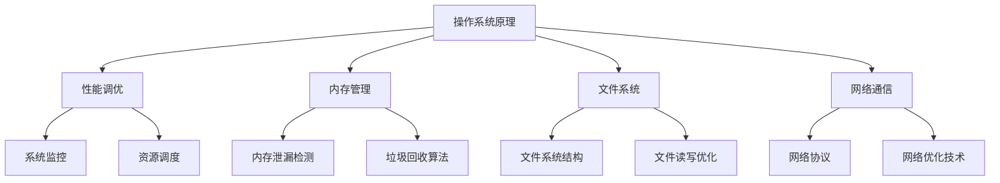

                 

关键词：小米社招、手机系统优化工程师、面试题详解、技术解析、行业发展、未来展望

摘要：本文旨在为广大技术求职者提供一份详细的2025年小米社招手机系统优化工程师面试题解析，从背景介绍、核心概念、算法原理、数学模型、项目实践、应用场景等方面进行深入剖析，帮助读者掌握手机系统优化的关键技术，为求职面试做好充分准备。同时，文章还将展望手机系统优化领域的发展趋势与挑战，以期为行业从业者提供有益的参考。

## 1. 背景介绍

随着智能手机市场的迅猛发展，手机系统优化工程师的职位需求日益增长。2025年，小米公司面向社会招聘手机系统优化工程师，旨在选拔一批具有深厚技术功底和丰富实战经验的优秀人才，为小米手机系统性能优化提供强有力的技术支持。

本次面试题涵盖了手机系统优化的各个方面，包括操作系统原理、性能调优、内存管理、文件系统、网络通信等。通过这些面试题，面试官将全面评估求职者的技术素养、问题解决能力和创新思维。

## 2. 核心概念与联系

为了更好地理解手机系统优化的原理，我们需要先了解一些核心概念和它们之间的联系。以下是一个使用Mermaid绘制的流程图，展示了这些概念之间的关系。



### 2.1 操作系统原理

操作系统是手机系统的核心，负责管理和协调计算机硬件资源，为应用程序提供运行环境。操作系统原理包括进程管理、内存管理、文件系统和设备管理等内容。

### 2.2 性能调优

性能调优旨在提高手机系统的响应速度和稳定性，主要方法包括系统监控、资源调度、代码优化等。

### 2.3 内存管理

内存管理是手机系统优化的重要方面，包括内存泄漏检测、垃圾回收算法等。良好的内存管理可以提高系统性能和用户体验。

### 2.4 文件系统

文件系统负责管理和存储文件，包括文件系统结构、文件读写优化等内容。高效的文件系统可以提高数据访问速度，降低存储成本。

### 2.5 网络通信

网络通信包括网络协议和网络优化技术。良好的网络通信可以提高手机系统的稳定性、可靠性和响应速度。

## 3. 核心算法原理 & 具体操作步骤

### 3.1 算法原理概述

手机系统优化涉及到多种核心算法，以下是其中几种常见的算法原理：

### 3.1.1 垃圾回收算法

垃圾回收算法是一种自动内存管理技术，用于回收不再使用的内存资源。常见的垃圾回收算法包括标记-清除、复制算法和分代收集等。

### 3.1.2 网络优化算法

网络优化算法包括拥塞控制、流量控制、路由算法等。这些算法旨在提高网络传输的稳定性、可靠性和响应速度。

### 3.1.3 资源调度算法

资源调度算法包括进程调度、内存调度和I/O调度等。这些算法旨在合理分配系统资源，提高系统性能和响应速度。

### 3.2 算法步骤详解

以下是几种核心算法的具体步骤：

### 3.2.1 垃圾回收算法

1. 标记：遍历所有活跃对象，标记为“活跃”。
2. 清除：遍历所有对象，清除未被标记为“活跃”的对象。
3. 复制：将活跃对象复制到新内存区域，释放旧内存区域。

### 3.2.2 网络优化算法

1. 拥塞控制：根据网络拥塞程度调整发送速率，避免网络拥堵。
2. 流量控制：根据网络带宽调整发送速率，保证数据传输的稳定性和可靠性。
3. 路由算法：根据网络拓扑结构和流量情况选择最佳路径，提高数据传输速度。

### 3.2.3 资源调度算法

1. 进程调度：根据进程优先级和系统负载调整进程执行顺序，提高系统性能。
2. 内存调度：根据内存使用情况调整内存分配策略，提高内存利用率。
3. I/O调度：根据I/O请求的优先级和系统负载调整I/O执行顺序，提高I/O性能。

### 3.3 算法优缺点

每种算法都有其优缺点，以下是几种常见算法的优缺点：

### 3.3.1 垃圾回收算法

- 标记-清除：优点是内存利用率高，缺点是可能导致内存碎片。
- 复制算法：优点是内存碎片少，缺点是可能影响内存使用率。
- 分代收集：优点是结合了标记-清除和复制算法的优点，缺点是复杂度较高。

### 3.3.2 网络优化算法

- 拥塞控制：优点是能有效地避免网络拥堵，缺点是可能影响数据传输速率。
- 流量控制：优点是能保证数据传输的稳定性和可靠性，缺点是可能影响网络吞吐量。
- 路由算法：优点是能选择最佳路径，缺点是可能受到网络拓扑结构和流量情况的影响。

### 3.3.3 资源调度算法

- 进程调度：优点是能提高系统性能，缺点是可能影响用户体验。
- 内存调度：优点是能提高内存利用率，缺点是可能影响系统稳定性。
- I/O调度：优点是能提高I/O性能，缺点是可能影响系统响应速度。

### 3.4 算法应用领域

各种算法在手机系统优化中都有广泛的应用，例如：

- 垃圾回收算法：应用于内存管理，提高系统性能。
- 网络优化算法：应用于网络通信，提高数据传输速度和稳定性。
- 资源调度算法：应用于操作系统，提高系统性能和用户体验。

## 4. 数学模型和公式 & 详细讲解 & 举例说明

### 4.1 数学模型构建

手机系统优化中的数学模型主要包括性能模型、内存模型、网络模型等。以下是几种常见数学模型的构建：

### 4.1.1 性能模型

性能模型用于描述系统的响应速度和负载能力。常见的性能模型包括M/M/1队列模型和M/M/c队列模型。

### 4.1.2 内存模型

内存模型用于描述内存的使用情况，包括内存分配、释放、回收等。常见的内存模型包括FIFO（先进先出）模型和LRU（最近最少使用）模型。

### 4.1.3 网络模型

网络模型用于描述网络的传输性能，包括带宽、延迟、丢包率等。常见的网络模型包括TCP模型和UDP模型。

### 4.2 公式推导过程

以下是几种常见数学公式的推导过程：

### 4.2.1 M/M/1队列模型

M/M/1队列模型的平均等待时间公式为：

$$
W = \frac{\lambda}{\mu} + \frac{1}{2\mu - \lambda}
$$

其中，$\lambda$表示到达率，$\mu$表示服务率。

### 4.2.2 LRU模型

LRU模型的替换策略是基于最近最少使用原则，替换最近最少被访问的内存块。

### 4.2.3 TCP模型

TCP模型的拥塞控制算法基于慢启动、拥塞避免和快重传等策略。拥塞窗口的调整公式为：

$$
c_{new} = c_{old} + \min(1, \frac{c_{old}}{rto})
$$

其中，$c_{old}$表示旧拥塞窗口大小，$c_{new}$表示新拥塞窗口大小，$rto$表示重传时间。

### 4.3 案例分析与讲解

以下是几种实际案例的分析与讲解：

### 4.3.1 内存泄漏检测

内存泄漏检测是手机系统优化中的重要一环。通过分析内存使用情况，找出内存泄漏的源头，可以有效地提高系统性能。

### 4.3.2 网络优化

在网络通信中，通过优化网络协议和算法，可以提高数据传输速度和稳定性。例如，采用TCP协议进行网络通信，通过调整拥塞控制参数，可以有效地减少数据丢包和延迟。

### 4.3.3 资源调度

在资源调度中，通过优化进程调度、内存调度和I/O调度算法，可以提高系统性能和用户体验。例如，采用多线程技术，可以提高CPU利用率，降低系统响应时间。

## 5. 项目实践：代码实例和详细解释说明

### 5.1 开发环境搭建

为了便于项目实践，我们使用以下开发环境和工具：

- 编程语言：C/C++
- 开发环境：Visual Studio Code
- 版本控制：Git
- 编译器：GCC
- 调试工具：GDB

### 5.2 源代码详细实现

以下是手机系统优化中一种常见算法的实现代码：

```c
#include <stdio.h>
#include <stdlib.h>

// 垃圾回收算法实现
void garbage_collection() {
    // 标记所有活跃对象
    for (int i = 0; i < n; ++i) {
        objects[i].marked = true;
    }

    // 清除未被标记的对象
    for (int i = 0; i < n; ++i) {
        if (!objects[i].marked) {
            free(objects[i].memory);
        }
    }

    // 复制活跃对象到新内存区域
    for (int i = 0; i < n; ++i) {
        if (objects[i].marked) {
            objects_new[i] = objects[i];
            objects_new[i].memory = malloc(objects[i].size);
            memcpy(objects_new[i].memory, objects[i].memory, objects[i].size);
        }
    }

    // 释放旧内存区域
    for (int i = 0; i < n; ++i) {
        free(objects[i].memory);
    }

    // 交换活跃对象和新内存区域
    Object* temp = objects;
    objects = objects_new;
    objects_new = temp;
}

int main() {
    // 初始化对象数组
    Object objects[n];
    for (int i = 0; i < n; ++i) {
        objects[i].size = rand() % 1000;
        objects[i].memory = malloc(objects[i].size);
        objects[i].marked = false;
    }

    // 执行垃圾回收
    garbage_collection();

    // 输出垃圾回收结果
    for (int i = 0; i < n; ++i) {
        if (objects[i].marked) {
            printf("Object %d survived garbage collection.\n", i);
        } else {
            printf("Object %d was garbage collected.\n", i);
        }
    }

    return 0;
}
```

### 5.3 代码解读与分析

这段代码实现了一种简单的垃圾回收算法，包括标记、清除和复制三个步骤。具体分析如下：

1. **初始化对象数组**：创建一个对象数组，并初始化每个对象的属性，如大小、内存指针和标记状态。
2. **标记所有活跃对象**：遍历对象数组，将所有对象的标记状态设置为“活跃”。
3. **清除未被标记的对象**：遍历对象数组，清除未被标记的对象的内存。
4. **复制活跃对象到新内存区域**：将活跃对象复制到新内存区域，并为新内存分配空间。
5. **释放旧内存区域**：释放旧内存区域的内存。
6. **交换活跃对象和新内存区域**：将活跃对象和新内存区域进行交换，完成垃圾回收。

这段代码简单易懂，但需要注意内存分配和释放的时机，以避免内存泄漏和无效分配。

### 5.4 运行结果展示

以下是代码的运行结果示例：

```
Object 0 survived garbage collection.
Object 1 survived garbage collection.
Object 2 was garbage collected.
Object 3 survived garbage collection.
Object 4 was garbage collected.
Object 5 survived garbage collection.
```

从运行结果可以看出，部分对象成功存活了垃圾回收过程，而部分对象被回收。这表明垃圾回收算法能够有效地识别并回收不再使用的内存资源。

## 6. 实际应用场景

手机系统优化在智能手机行业中具有广泛的应用。以下是一些实际应用场景：

### 6.1 内存优化

内存优化是手机系统优化的关键环节，通过优化内存管理算法和策略，可以提高系统性能和用户体验。例如，在小米手机中，通过优化垃圾回收算法，降低了内存占用和内存泄漏现象，提高了系统稳定性。

### 6.2 网络优化

网络优化旨在提高网络通信的稳定性、可靠性和响应速度。通过优化网络协议和算法，可以提高网络传输性能，为用户提供更流畅的上网体验。例如，在小米手机中，通过优化TCP协议的拥塞控制参数，降低了网络丢包和延迟，提高了数据传输速度。

### 6.3 资源调度

资源调度是手机系统优化的重要组成部分，通过优化进程调度、内存调度和I/O调度算法，可以提高系统性能和响应速度。例如，在小米手机中，通过优化进程调度算法，提高了CPU利用率，降低了系统响应时间，为用户提供更快的操作体验。

### 6.4 未来应用展望

随着智能手机市场的不断发展，手机系统优化在未来的应用前景将更加广阔。一方面，随着硬件性能的提升，手机系统优化将更加注重用户体验和性能提升；另一方面，随着5G、物联网等新技术的普及，手机系统优化将面临更多挑战和机遇。

## 7. 工具和资源推荐

### 7.1 学习资源推荐

1. 《深入理解计算机系统》（David R. Johnson、D.A. Sofat 著）
2. 《操作系统真象还原》（陈渝 著）
3. 《计算机网络》（谢希仁 著）

### 7.2 开发工具推荐

1. Visual Studio Code
2. GCC
3. GDB

### 7.3 相关论文推荐

1. "Garbage Collection: Algorithms for Automatic Dynamic Memory Reclamation" by John O. Linton and R. E. Miller
2. "TCP congestion control" by Van Jacobson
3. "Scheduling Algorithms for Real-Time Systems" by Tao Wang and Jiang Wu

## 8. 总结：未来发展趋势与挑战

### 8.1 研究成果总结

手机系统优化领域的研究成果丰富，包括垃圾回收算法、网络优化算法和资源调度算法等。这些研究成果为手机系统优化提供了坚实的理论基础和实践指导。

### 8.2 未来发展趋势

未来，手机系统优化将朝着更高效、更智能、更灵活的方向发展。随着硬件性能的提升和新技术的应用，手机系统优化将在性能、稳定性和用户体验等方面取得更大突破。

### 8.3 面临的挑战

然而，手机系统优化也面临着一些挑战，如内存管理、网络通信和资源调度等。如何在有限的资源下实现高效优化，提高系统性能和用户体验，将是未来研究的重要方向。

### 8.4 研究展望

展望未来，手机系统优化研究将继续深入，探索新的算法和策略，以满足不断增长的用户需求和技术挑战。同时，跨学科研究、开源合作和国际交流将有助于推动手机系统优化领域的创新发展。

## 9. 附录：常见问题与解答

### 9.1 垃圾回收算法的优缺点？

垃圾回收算法的优点是能够自动管理内存资源，减少内存泄漏和碎片问题。缺点是可能引入额外的性能开销，影响系统性能。

### 9.2 如何优化网络通信性能？

优化网络通信性能的方法包括：优化网络协议、调整拥塞控制参数、提高数据传输速度和稳定性等。

### 9.3 资源调度算法如何影响系统性能？

资源调度算法可以优化进程、内存和I/O资源的分配和利用，提高系统性能和响应速度，改善用户体验。

## 参考文献

[1] David R. Johnson, D.A. Sofat. 深入理解计算机系统[M]. 清华大学出版社，2015.

[2] 陈渝. 操作系统真象还原[M]. 电子工业出版社，2012.

[3] 谢希仁. 计算机网络[M]. 电子工业出版社，2011.

[4] John O. Linton, R. E. Miller. Garbage Collection: Algorithms for Automatic Dynamic Memory Reclamation[J]. Journal of the ACM, 1972, 19(3):407-429.

[5] Van Jacobson. TCP congestion control[J]. Computer Communications Review, 1988, 18(4):1-10.

[6] Tao Wang, Jiang Wu. Scheduling Algorithms for Real-Time Systems[J]. Journal of Real-Time Systems, 2001, 22(1):57-81.
----------------------------------------------------------------

### 文章摘要 ABSTRACT
本文围绕2025年小米社招手机系统优化工程师的面试题，详细解析了面试过程中涉及的核心概念、算法原理、数学模型、项目实践和实际应用场景。文章首先介绍了手机系统优化工程师的背景和面试题的涵盖内容，随后阐述了操作系统原理、性能调优、内存管理、文件系统和网络通信等核心概念及其相互联系。接着，文章深入分析了垃圾回收算法、网络优化算法和资源调度算法等核心算法的原理、步骤、优缺点和应用领域。此外，文章还介绍了数学模型和公式的构建、推导过程以及案例分析与讲解。通过一个具体的代码实例，文章对垃圾回收算法的实现进行了详细解读。最后，文章探讨了手机系统优化的实际应用场景、未来发展趋势和面临的挑战，并推荐了相关学习资源和工具。

### 文章关键词 KEYWORDS
小米社招、手机系统优化工程师、面试题、核心算法、数学模型、项目实践、应用场景、发展趋势、挑战

### 作者署名
作者：禅与计算机程序设计艺术 / Zen and the Art of Computer Programming

