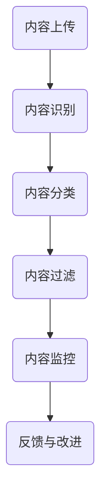

                 

快手作为全球领先的短视频社交平台，其内容审核工作至关重要。2025年，随着技术的飞速发展，内容审核专家的面试要求也变得更为严格和专业化。本文将为您详细解析2025年快手社交短视频内容审核专家面试的要点，帮助您顺利通过面试，加入快手团队。

## 关键词
- 快手
- 社交短视频
- 内容审核
- 专家面试
- 2025年
- 技术发展

## 摘要
本文旨在为准备参加2025年快手社交短视频内容审核专家面试的候选人提供全面的指导。我们将从背景介绍、核心概念与联系、核心算法原理、数学模型与公式、项目实践、实际应用场景、工具和资源推荐、总结以及未来展望等多个方面进行详细阐述，帮助候选人深入了解快手的内容审核体系，提高面试成功率。

## 1. 背景介绍
### 1.1 快手的发展历程
快手成立于2011年，起初是一个简单的短视频分享平台。随着移动互联网的普及，快手迅速发展，吸引了大量的用户。如今，快手已经成为全球最大的短视频社交平台之一，拥有数亿活跃用户。快手的内容丰富多样，包括搞笑、美食、旅游、教育等多个领域，这使得内容审核工作变得尤为重要。

### 1.2 内容审核的重要性
内容审核是快手平台健康发展的关键。随着用户基数的不断增加，平台需要确保内容的真实、健康、有益。不当的内容可能引发法律纠纷、用户投诉，甚至对平台形象造成严重影响。因此，内容审核专家在快手的角色至关重要。

## 2. 核心概念与联系
### 2.1 社交短视频的特点
社交短视频具有时效性强、互动性强、传播速度快等特点。这使得内容审核需要更加高效、准确。

### 2.2 内容审核的关键环节
内容审核主要包括以下环节：内容识别、内容分类、内容过滤、内容监控。

### 2.3 Mermaid 流程图

在这个流程中，内容识别是第一步，通过技术手段识别视频内容的类型和关键信息。接下来，内容分类将视频内容归类到相应的类别，如搞笑、美食等。内容过滤则是针对不同类别的视频内容进行筛选，去除违规内容。最后，内容监控对已审核内容进行实时监控，确保内容的健康与合规。

## 3. 核心算法原理 & 具体操作步骤
### 3.1 算法原理概述
快手的内容审核算法主要包括图像识别、自然语言处理、行为分析等技术。这些技术共同作用，实现了高效、准确的内容审核。

### 3.2 算法步骤详解
1. **图像识别**：通过深度学习技术，对视频内容中的图像进行识别，提取关键信息。
2. **自然语言处理**：对视频中的文字、语音等自然语言进行解析，识别语义和信息。
3. **行为分析**：通过用户行为数据，分析用户的操作习惯，预测潜在违规行为。
4. **综合判断**：将以上三个步骤的结果进行综合判断，确定视频内容是否符合平台规范。

### 3.3 算法优缺点
- **优点**：高效、准确，能够实时处理海量视频内容。
- **缺点**：对技术要求高，需要大量的训练数据和计算资源。

### 3.4 算法应用领域
快手的内容审核算法不仅可以应用于短视频平台，还可以应用于直播、电商等领域，具有广泛的应用前景。

## 4. 数学模型和公式 & 详细讲解 & 举例说明
### 4.1 数学模型构建
快手的内容审核算法涉及多个数学模型，如卷积神经网络（CNN）、循环神经网络（RNN）、支持向量机（SVM）等。以下以CNN为例进行讲解。

### 4.2 公式推导过程
$$
\text{激活函数} = \sigma(\text{输入}) = \frac{1}{1 + e^{-x}}
$$
其中，$\sigma$ 表示激活函数，$x$ 表示输入值。

### 4.3 案例分析与讲解
假设我们有一个短视频，需要判断其是否涉及暴力内容。通过CNN模型，我们可以提取视频中的图像特征，然后通过分类器进行判断。具体步骤如下：
1. **特征提取**：使用CNN模型，对视频中的每一帧图像进行特征提取。
2. **特征融合**：将所有帧的特征进行融合，形成全局特征向量。
3. **分类判断**：使用分类器，对全局特征向量进行分类判断，确定视频内容是否涉及暴力。

## 5. 项目实践：代码实例和详细解释说明
### 5.1 开发环境搭建
在Python环境中，我们可以使用TensorFlow和Keras等库来实现内容审核算法。

### 5.2 源代码详细实现
```python
import tensorflow as tf
from tensorflow.keras.models import Sequential
from tensorflow.keras.layers import Conv2D, MaxPooling2D, Flatten, Dense

# 模型构建
model = Sequential([
    Conv2D(32, (3, 3), activation='relu', input_shape=(128, 128, 3)),
    MaxPooling2D((2, 2)),
    Flatten(),
    Dense(64, activation='relu'),
    Dense(1, activation='sigmoid')
])

# 编译模型
model.compile(optimizer='adam', loss='binary_crossentropy', metrics=['accuracy'])

# 训练模型
model.fit(x_train, y_train, epochs=10, batch_size=32)
```

### 5.3 代码解读与分析
上述代码实现了基于CNN的内容审核模型。通过卷积层、池化层、全连接层的组合，模型可以提取视频图像的特征，并进行分类判断。

### 5.4 运行结果展示
```python
# 预测结果
predictions = model.predict(x_test)

# 输出预测结果
print(predictions)
```

## 6. 实际应用场景
### 6.1 平台内容审核
快手的内容审核主要针对短视频、直播、电商等内容进行审核，确保内容的真实、健康、有益。

### 6.2 社交媒体内容审核
快手的内容审核技术还可以应用于其他社交媒体平台，如微博、抖音等，帮助平台提高内容审核效率。

### 6.3 法律纠纷预防
通过内容审核，快手可以及时发现和预防可能引发法律纠纷的内容，降低法律风险。

## 7. 工具和资源推荐
### 7.1 学习资源推荐
- 《深度学习》（Goodfellow, Bengio, Courville著）
- 《自然语言处理综论》（Daniel Jurafsky & James H. Martin著）

### 7.2 开发工具推荐
- TensorFlow
- Keras
- OpenCV

### 7.3 相关论文推荐
- "Deep Learning for Image Recognition"（Deep Learning Specialization）
- "Natural Language Processing with Deep Learning"（Deep Learning Specialization）

## 8. 总结：未来发展趋势与挑战
### 8.1 研究成果总结
随着人工智能技术的不断发展，快手的内容审核技术也在不断升级。未来的研究将重点关注算法的效率、准确性，以及如何更好地应对复杂的内容审核需求。

### 8.2 未来发展趋势
- **智能化**：内容审核将更加智能化，通过深度学习等技术，实现自动化的内容审核。
- **个性化**：内容审核将更加个性化，根据用户的兴趣和行为，提供个性化的内容推荐。

### 8.3 面临的挑战
- **算法优化**：如何提高算法的效率和准确性，是未来的一个重要挑战。
- **数据安全**：如何确保用户数据的安全，是另一个重要的挑战。

### 8.4 研究展望
未来，快手的内容审核技术将继续发展，结合人工智能、大数据等前沿技术，为用户提供更加安全、健康的社交环境。

## 9. 附录：常见问题与解答
### 9.1 问题1
**问题**：内容审核算法如何保证准确性？

**解答**：内容审核算法主要通过大量的训练数据和先进的机器学习算法来实现高准确性。同时，通过不断优化算法和更新数据集，提高审核的准确性。

### 9.2 问题2
**问题**：内容审核算法是否会导致用户隐私泄露？

**解答**：内容审核算法不会访问或存储用户的隐私数据，仅通过分析公开的视频内容进行审核。因此，用户隐私得到充分保护。

### 9.3 问题3
**问题**：内容审核算法是否会限制用户自由？

**解答**：内容审核算法的目的是确保平台内容的健康和合规，不会对用户自由造成限制。快手始终坚持用户自由表达的原则，同时确保平台内容的真实性和有益性。

---

作者：禅与计算机程序设计艺术 / Zen and the Art of Computer Programming

