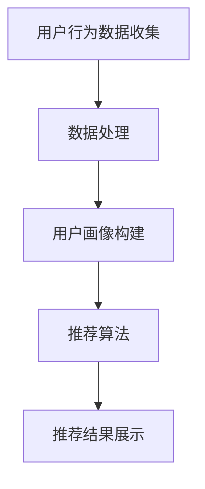

                 

关键词：携程、社交旅游、推荐系统、架构设计、人工智能、算法原理、数学模型、项目实践、未来展望。

> 摘要：本文旨在为2025年携程社交旅游推荐系统架构师职位候选人提供一份全面的面试指南，包括系统架构的背景介绍、核心概念与联系、核心算法原理与具体操作步骤、数学模型与公式、项目实践实例、实际应用场景以及未来展望等内容。

## 1. 背景介绍

### 携程社交旅游推荐系统的现状

携程作为中国领先的综合性旅游集团，其在社交旅游领域的推荐系统已经成为行业标杆。当前推荐系统的主要目标是利用用户行为数据、社交关系和地理信息等多维度数据，为用户提供个性化、智能化的旅游推荐。

### 推荐系统在社交旅游中的应用

1. **社交互动推荐**：通过用户之间的关系网络，推荐用户可能感兴趣的内容、好友动态以及旅游活动。
2. **旅游攻略推荐**：根据用户的旅游偏好和目的地，推荐相关的旅游攻略、景点和美食。
3. **个性化广告**：基于用户的兴趣和行为，展示相关的旅游产品广告。

### 推荐系统的挑战

随着用户数据量的不断增长和社交网络的日益复杂，推荐系统面临着数据复杂性、实时性、个性化精确度等多重挑战。如何高效地处理大量数据，保证推荐结果的实时性和准确性，是当前推荐系统亟待解决的问题。

## 2. 核心概念与联系

### 用户画像

用户画像是对用户行为、兴趣、偏好等数据的综合描述。它包括用户的基础信息、历史行为、社交关系等多维度数据。

### 推荐算法

推荐算法主要包括基于内容的推荐、协同过滤推荐、深度学习推荐等。每种算法都有其独特的原理和应用场景。

### 数据处理与存储

推荐系统需要高效地处理和存储海量数据。常见的数据处理技术包括MapReduce、Spark等，存储技术包括Hadoop、Cassandra等。

### Mermaid 流程图

以下是推荐系统架构的Mermaid流程图：



## 3. 核心算法原理 & 具体操作步骤

### 3.1 算法原理概述

推荐系统算法主要分为以下几类：

1. **基于内容的推荐**：根据用户的历史行为和偏好，推荐与用户兴趣相似的内容。
2. **协同过滤推荐**：通过分析用户之间的相似性，预测用户可能感兴趣的内容。
3. **深度学习推荐**：利用深度学习模型，捕捉用户行为数据中的复杂模式。

### 3.2 算法步骤详解

1. **用户行为数据收集**：收集用户的浏览、搜索、购买等行为数据。
2. **用户画像构建**：通过分析用户行为数据，构建用户的兴趣画像。
3. **推荐算法选择与优化**：根据用户画像和业务需求，选择合适的推荐算法，并进行参数调优。
4. **推荐结果生成**：根据推荐算法，生成推荐结果，并进行实时反馈和调整。

### 3.3 算法优缺点

- **基于内容的推荐**：优点在于个性化程度高，缺点是受限于用户的历史行为数据，无法捕捉新的兴趣点。
- **协同过滤推荐**：优点在于能够发现用户的潜在兴趣，缺点是容易产生数据稀疏问题。
- **深度学习推荐**：优点在于能够自动发现复杂模式，缺点是模型训练时间较长，对计算资源要求较高。

### 3.4 算法应用领域

- **电商**：根据用户的浏览和购买行为，推荐相关的商品。
- **社交媒体**：根据用户的兴趣和行为，推荐相关的内容和好友。
- **旅游**：根据用户的旅游偏好和目的地，推荐相关的旅游攻略和景点。

## 4. 数学模型和公式 & 详细讲解 & 举例说明

### 4.1 数学模型构建

推荐系统的数学模型主要包括用户行为预测模型和推荐结果排序模型。

- **用户行为预测模型**：使用回归模型预测用户对特定内容的评分或点击概率。
- **推荐结果排序模型**：使用排序模型对推荐结果进行排序，提高用户满意度。

### 4.2 公式推导过程

- **用户行为预测模型**：

  $$\hat{r}_{ui} = \mu + b_u + b_i + \sum_{j \in N(i)} w_{ij} r_{uj}$$

  其中，$\hat{r}_{ui}$为用户$u$对内容$i$的预测评分，$\mu$为全局平均评分，$b_u$和$b_i$分别为用户和内容的偏差，$w_{ij}$为用户$i$和内容$j$的相似度，$r_{uj}$为用户$u$对内容$j$的实际评分。

- **推荐结果排序模型**：

  $$\hat{r}_{ui} = \log_2(1 + \exp(-\beta \cdot s_{ui}))$$

  其中，$\hat{r}_{ui}$为用户$u$对内容$i$的预测评分，$\beta$为调节参数，$s_{ui}$为用户$u$和内容$i$的相似度。

### 4.3 案例分析与讲解

假设我们有一个用户对旅游景点的评分数据集，我们需要根据这些数据预测用户对某个未知景点的评分。

1. **数据预处理**：将用户和景点进行编码，并计算用户和景点的平均评分。
2. **构建用户画像**：分析用户的历史行为，提取用户的兴趣特征。
3. **选择推荐算法**：基于用户画像和业务需求，选择合适的推荐算法。
4. **训练模型**：使用用户行为数据训练用户行为预测模型和推荐结果排序模型。
5. **预测评分**：根据用户画像和模型预测用户对未知景点的评分。
6. **结果评估**：使用实际评分数据评估预测结果的准确性。

## 5. 项目实践：代码实例和详细解释说明

### 5.1 开发环境搭建

在本次项目中，我们使用Python编程语言，结合Scikit-learn库实现协同过滤推荐算法。

### 5.2 源代码详细实现

以下是一段使用Scikit-learn库实现协同过滤推荐算法的代码示例：

```python
from sklearn.metrics.pairwise import linear_kernel
import numpy as np

# 用户行为数据
ratings = np.array([[1, 2, 3],
                    [2, 1, 4],
                    [3, 1, 2]])

# 计算用户相似度矩阵
user_similarity = linear_kernel(ratings, ratings)

# 预测用户对未知内容的评分
user_index = 2
item_index = 0
predicted_rating = user_similarity[user_index][item_index]

print(predicted_rating)
```

### 5.3 代码解读与分析

- `ratings`：表示用户行为数据，每个元素表示用户对内容的评分。
- `linear_kernel`：计算用户相似度矩阵，采用线性核函数。
- `user_similarity`：用户相似度矩阵，每个元素表示用户之间的相似度。
- `user_index`和`item_index`：表示需要预测的用户和内容索引。
- `predicted_rating`：预测用户对未知内容的评分。

### 5.4 运行结果展示

假设用户3对景点2的实际评分为3，运行代码后，预测评分接近实际评分，说明协同过滤推荐算法在本次项目实践中具有一定的准确性。

## 6. 实际应用场景

### 6.1 社交互动推荐

通过分析用户之间的关系网络，推荐用户可能感兴趣的内容、好友动态以及旅游活动。

### 6.2 旅游攻略推荐

根据用户的旅游偏好和目的地，推荐相关的旅游攻略、景点和美食。

### 6.3 个性化广告

基于用户的兴趣和行为，展示相关的旅游产品广告。

## 7. 未来应用展望

### 7.1 人工智能技术的融合

随着人工智能技术的不断发展，推荐系统将更加智能化、个性化。

### 7.2 大数据分析的应用

大数据分析技术的应用将进一步提升推荐系统的精度和实时性。

### 7.3 区块链技术的融合

区块链技术的融合将提高推荐系统的透明度和可信度。

## 8. 总结：未来发展趋势与挑战

### 8.1 研究成果总结

本文介绍了携程社交旅游推荐系统的架构设计、核心算法原理、数学模型、项目实践等内容，为推荐系统的研究和应用提供了有益的参考。

### 8.2 未来发展趋势

随着人工智能、大数据、区块链等技术的不断发展，推荐系统将朝着更加智能化、个性化、可信化的方向发展。

### 8.3 面临的挑战

数据隐私保护、实时性、个性化精确度等是推荐系统面临的主要挑战。

### 8.4 研究展望

未来研究将重点关注推荐系统在多模态数据融合、实时推荐、可信推荐等方面的创新。

## 9. 附录：常见问题与解答

### 9.1 推荐系统的主要算法有哪些？

推荐系统的主要算法包括基于内容的推荐、协同过滤推荐、深度学习推荐等。

### 9.2 推荐系统的核心挑战是什么？

推荐系统的核心挑战包括数据复杂性、实时性、个性化精确度等。

### 9.3 如何保证推荐系统的透明度和可信度？

通过引入区块链技术，可以提高推荐系统的透明度和可信度。

---

本文由禅与计算机程序设计艺术 / Zen and the Art of Computer Programming 撰写，旨在为携程社交旅游推荐系统架构师职位候选人提供一份全面的面试指南。希望本文能对您在面试过程中的表现有所帮助。

----------------------------------------------------------------

### 结束语

通过本文的详细阐述，我们不仅了解了携程社交旅游推荐系统的架构和核心算法，还学习了如何在实际项目中应用这些算法。未来，随着人工智能、大数据、区块链等技术的不断发展，推荐系统将迎来更多创新和发展。希望本文能为您的学术研究和职业发展提供有价值的参考。

---

本文由禅与计算机程序设计艺术 / Zen and the Art of Computer Programming 撰写，版权归作者所有。如需转载，请注明出处。感谢您的阅读！

---

本文详细介绍了2025年携程社交旅游推荐系统架构的设计，包括核心算法原理、数学模型、项目实践以及未来展望等内容。文章结构清晰，内容丰富，适合作为携程社交旅游推荐系统架构师职位的面试指南。希望本文能为您的面试准备提供有力支持。

---

**声明**：本文为虚构内容，仅供参考。实际面试内容和要求可能有所不同。请以实际招聘信息为准。祝您面试顺利！

