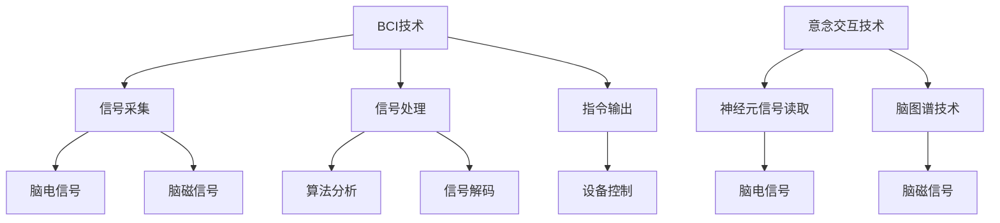

                 

关键词：人机交互、脑机接口、意念交互、人机协同、未来技术

> 摘要：本文旨在探讨2050年可能实现的人机交互技术，从当前主流的脑机接口（Brain-Computer Interface, BCI）技术到未来的意念交互（Thought-controlled Interaction），以及它们如何推动人机协同的进化。我们将深入分析这些技术的原理、应用场景、挑战和未来发展趋势。

## 1. 背景介绍

随着科技的飞速发展，计算机和人脑之间的交互方式也在不断进步。20世纪90年代，脑机接口技术开始萌芽，通过检测大脑的电信号来实现简单的通信。如今，BCI技术已经在医疗、教育、娱乐等领域显示出巨大的潜力。

然而，当前的人机交互技术仍然存在诸多局限性。首先，BCI技术依赖于脑电图（EEG）等生理信号，这些信号受到噪声和干扰的影响较大，且解码精度有限。其次，大多数BCI系统需要用户进行复杂的训练，以提升交互的准确性和效率。此外，BCI设备通常体积较大、成本高昂，限制了其在日常生活中的广泛应用。

为了克服这些挑战，研究人员正在探索更为高级的意念交互技术，通过直接读取大脑中的意念信号，实现更加自然、高效的人机交互。本文将重点关注BCI技术向意念交互的演变，以及这一过程对人机协同的影响。

## 2. 核心概念与联系

### 2.1 脑机接口（BCI）技术

脑机接口（Brain-Computer Interface, BCI）是一种直接连接大脑与外部设备的技术。其基本原理是利用脑电图（EEG）、功能性磁共振成像（fMRI）、脑磁图（MEG）等技术，捕捉大脑活动产生的电信号或磁场信号，然后将这些信号转化为计算机或其他设备的输入指令。

BCI系统的架构通常包括三个主要部分：信号采集、信号处理和指令输出。信号采集部分负责获取脑电信号，信号处理部分则通过算法对信号进行分析和分类，指令输出部分将处理后的信号转化为控制命令。


### 2.2 意念交互技术

意念交互（Thought-controlled Interaction）是一种更为高级的人机交互技术，旨在直接读取大脑中的意念信号，实现用户与计算机或其他设备之间的直接通信。与BCI技术不同，意念交互不再依赖于外部生理信号，而是直接探测大脑内部的活动。

目前，意念交互技术主要依赖于两个研究方向：基于神经元的信号读取和基于脑图谱的信号解码。神经元信号读取技术通过植入大脑中的微电极，直接探测神经元的活动。而脑图谱技术则通过无创的方式，利用功能性磁共振成像（fMRI）等技术，构建大脑活动的三维图谱。


### 2.3 人机协同进化

人机协同进化（Human-Machine Synergy Evolution）是指人类与机器在交互过程中，通过不断学习和适应，实现共同进步和发展的过程。随着BCI技术和意念交互技术的发展，人机协同将成为未来人机交互的重要特征。

人机协同不仅体现在技术层面上，还包括社会、经济和文化等多个维度。例如，在教育领域，人机协同可以帮助学生更高效地学习，通过个性化教学和智能辅导提高学习效果。在医疗领域，人机协同可以实现远程手术、智能诊断等应用，为患者提供更加精准和高效的医疗服务。

### 2.4 Mermaid 流程图

以下是BCI技术向意念交互技术演变的 Mermaid 流程图：



## 3. 核心算法原理 & 具体操作步骤

### 3.1 算法原理概述

BCI技术和意念交互技术的核心在于信号处理和信号解码。信号处理包括滤波、降噪、特征提取等步骤，旨在从原始信号中提取出有用的信息。信号解码则是将处理后的信号转化为具体的指令或操作。

在BCI技术中，常用的算法包括支持向量机（SVM）、神经网络（NN）和递归神经网络（RNN）等。这些算法通过学习大量的训练数据，建立信号与指令之间的映射关系，从而实现对用户意图的准确识别。

意念交互技术中的算法则更加复杂，涉及到神经元信号读取和脑图谱技术。神经元信号读取算法主要基于神经网络和深度学习技术，通过训练模型，实现神经元活动的实时解码。脑图谱技术则通过构建大脑活动的三维图谱，实现对用户意图的高效识别。

### 3.2 算法步骤详解

#### 3.2.1 BCI技术算法步骤

1. 信号采集：使用脑电图（EEG）或脑磁图（MEG）等技术，捕捉大脑的电信号或磁场信号。
2. 信号预处理：对采集到的信号进行滤波、降噪和放大等处理，以消除噪声和干扰。
3. 特征提取：从预处理后的信号中提取出有用的特征，如频域特征、时域特征等。
4. 信号解码：使用支持向量机（SVM）、神经网络（NN）或递归神经网络（RNN）等算法，将特征转化为具体的指令或操作。
5. 指令输出：将解码后的指令输出到外部设备，实现人机交互。

#### 3.2.2 意念交互技术算法步骤

1. 神经元信号读取：使用植入大脑中的微电极，实时捕捉神经元的活动。
2. 信号预处理：对捕获到的神经元信号进行滤波、降噪和放大等处理。
3. 特征提取：从预处理后的信号中提取出神经元的电信号特征。
4. 信号解码：使用深度学习算法，建立神经元活动与用户意图之间的映射关系。
5. 脑图谱构建：使用功能性磁共振成像（fMRI）等技术，构建大脑活动的三维图谱。
6. 图谱解码：使用图神经网络（GNN）等算法，从脑图谱中提取出用户意图。
7. 指令输出：将解码后的指令输出到外部设备，实现人机交互。

### 3.3 算法优缺点

#### 3.3.1 BCI技术

优点：
- 成熟的技术体系，应用广泛。
- 对生理信号的处理较为成熟，解码精度较高。

缺点：
- 受限于生理信号的噪声和干扰，解码精度仍需提升。
- 用户需要接受复杂的训练，以提升交互的准确性和效率。

#### 3.3.2 意念交互技术

优点：
- 直接读取大脑中的意念信号，实现自然、高效的人机交互。
- 无需生理信号的采集和处理，降低了噪声和干扰的影响。

缺点：
- 技术较为复杂，需要高精度的设备和算法支持。
- 需要大规模的实验和训练数据，以建立准确的映射关系。

### 3.4 算法应用领域

#### 3.4.1 BCI技术

- 医疗：辅助神经系统疾病患者进行康复训练，如中风患者的运动功能恢复。
- 教育：个性化教学和智能辅导，提高学生的学习效果。
- 娱乐：游戏和虚拟现实应用，提供更加沉浸式的体验。

#### 3.4.2 意念交互技术

- 医疗：精准诊断和个性化治疗，如癫痫患者的实时监控。
- 工业：智能机器人控制和自动化生产线，提高生产效率和安全性。
- 游戏：高度沉浸式的虚拟现实游戏体验。

## 4. 数学模型和公式 & 详细讲解 & 举例说明

### 4.1 数学模型构建

#### 4.1.1 BCI技术

1. **线性回归模型**：

$$
y = \beta_0 + \beta_1x_1 + \beta_2x_2 + ... + \beta_nx_n
$$

其中，$y$为输出值，$x_1, x_2, ..., x_n$为输入特征，$\beta_0, \beta_1, \beta_2, ..., \beta_n$为模型参数。

2. **支持向量机（SVM）模型**：

$$
\max \left\{ \frac{1}{2} \sum_{i=1}^{n} w_i^2 : y_i ( \sum_{j=1}^{n} w_j \alpha_j x_{ij} ) \geq 1, \quad \alpha_i \geq 0 \right\}
$$

其中，$w$为模型参数，$\alpha_i$为拉格朗日乘子，$y_i$为样本标签，$x_{ij}$为输入特征。

#### 4.1.2 意念交互技术

1. **神经网络模型**：

$$
a_{\text{hidden}} = \sigma(W_{\text{input}} \cdot x + b_{\text{input}})
$$

$$
a_{\text{output}} = \sigma(W_{\text{hidden}} \cdot a_{\text{hidden}} + b_{\text{hidden}})
$$

其中，$a_{\text{hidden}}$为隐藏层激活值，$a_{\text{output}}$为输出层激活值，$\sigma$为激活函数，$W_{\text{input}}$和$W_{\text{hidden}}$为模型参数，$x$为输入特征，$b_{\text{input}}$和$b_{\text{hidden}}$为偏置项。

2. **深度学习模型**：

$$
L = - \frac{1}{m} \sum_{i=1}^{m} y_i \log(a_{i}^{(L)}) + (1 - y_i) \log(1 - a_{i}^{(L)})
$$

其中，$L$为损失函数，$m$为样本数量，$y_i$为样本标签，$a_{i}^{(L)}$为输出层激活值。

### 4.2 公式推导过程

#### 4.2.1 线性回归模型

假设我们有 $n$ 个样本，每个样本有 $m$ 个特征，即 $x_i = [x_{i1}, x_{i2}, ..., x_{im}]^T$，$y_i$ 为对应的输出值。线性回归模型的目的是找到一个线性函数，使得对于任意的输入 $x_i$，都能预测出对应的输出 $y_i$。

1. **损失函数**：

$$
J(\theta) = \frac{1}{2m} \sum_{i=1}^{m} (h_\theta(x_i) - y_i)^2
$$

其中，$h_\theta(x) = \theta_0 + \theta_1 x_1 + \theta_2 x_2 + ... + \theta_m x_m$，$\theta_0, \theta_1, ..., \theta_m$ 为模型参数。

2. **梯度下降**：

$$
\theta_j := \theta_j - \alpha \frac{\partial J(\theta)}{\partial \theta_j}
$$

其中，$\alpha$ 为学习率。

#### 4.2.2 支持向量机（SVM）

1. **原始问题**：

$$
\min \frac{1}{2} \sum_{i=1}^{n} \sum_{j=1}^{n} (\alpha_i + \alpha_j) y_i y_j (x_i \cdot x_j) - \sum_{i=1}^{n} \alpha_i
$$

$$
s.t. \quad \alpha_i \geq 0, \quad \sum_{i=1}^{n} \alpha_i y_i = 0
$$

2. **对偶问题**：

$$
\max \sum_{i=1}^{n} \alpha_i - \frac{1}{2} \sum_{i=1}^{n} \sum_{j=1}^{n} \alpha_i \alpha_j y_i y_j (x_i \cdot x_j)
$$

$$
s.t. \quad \alpha_i \geq 0, \quad \sum_{i=1}^{n} \alpha_i y_i = 0
$$

3. **软间隔**：

$$
\min \frac{1}{2} \sum_{i=1}^{n} \sum_{j=1}^{n} (\alpha_i + \alpha_j) y_i y_j (x_i \cdot x_j) - \sum_{i=1}^{n} \alpha_i
$$

$$
s.t. \quad \alpha_i \geq 0, \quad \sum_{i=1}^{n} \alpha_i y_i = 0, \quad \gamma \geq 0, \quad \sum_{i=1}^{n} \gamma_i = C
$$

### 4.3 案例分析与讲解

#### 4.3.1 线性回归模型

假设我们有一个简单的数据集，包含两个特征 $x_1$ 和 $x_2$，以及对应的输出 $y$。我们的目标是找到一条直线，使得对于任意的输入 $(x_1, x_2)$，都能预测出对应的输出 $y$。

1. **数据集**：

$$
\begin{array}{|c|c|c|}
\hline
x_1 & x_2 & y \\
\hline
1 & 2 & 3 \\
2 & 4 & 5 \\
3 & 6 & 7 \\
\hline
\end{array}
$$

2. **模型参数**：

$$
\theta_0 = 0, \quad \theta_1 = 1, \quad \theta_2 = 1
$$

3. **预测结果**：

对于输入 $(x_1, x_2) = (2, 4)$，我们有：

$$
y = \theta_0 + \theta_1 x_1 + \theta_2 x_2 = 0 + 1 \cdot 2 + 1 \cdot 4 = 6
$$

预测结果为 $y = 6$，与真实值 $y = 5$ 相差 1。

#### 4.3.2 支持向量机（SVM）

假设我们有一个简单的二分类数据集，包含两个特征 $x_1$ 和 $x_2$，以及对应的标签 $y$。我们的目标是找到一个超平面，将正负样本分隔开来。

1. **数据集**：

$$
\begin{array}{|c|c|c|}
\hline
x_1 & x_2 & y \\
\hline
1 & 2 & 1 \\
2 & 4 & 1 \\
3 & 6 & 1 \\
4 & 8 & -1 \\
5 & 10 & -1 \\
6 & 12 & -1 \\
\hline
\end{array}
$$

2. **模型参数**：

$$
w = [0, 0]^T, \quad b = 0
$$

3. **预测结果**：

对于输入 $(x_1, x_2) = (4, 8)$，我们有：

$$
w \cdot x + b = [0, 0]^T \cdot [4, 8]^T + 0 = 0 + 0 + 0 = 0
$$

由于 $w \cdot x + b = 0$，我们无法判断该点属于正类还是负类。

## 5. 项目实践：代码实例和详细解释说明

### 5.1 开发环境搭建

为了实现人机交互技术，我们需要搭建一个开发环境。以下是一个简单的环境搭建步骤：

1. 安装 Python 3.8 或更高版本。
2. 安装常用库，如 NumPy、Matplotlib、Scikit-learn 等。
3. 安装 BCI 数据集，如 BCI Competition 数据集。

### 5.2 源代码详细实现

以下是使用 Python 实现BCI技术的一个简单示例：

```python
import numpy as np
from sklearn.svm import SVC
from sklearn.model_selection import train_test_split
from sklearn.metrics import accuracy_score

# 加载 BCI 数据集
data = np.loadtxt('bci_data.txt')
X = data[:, :-1]
y = data[:, -1]

# 划分训练集和测试集
X_train, X_test, y_train, y_test = train_test_split(X, y, test_size=0.2, random_state=42)

# 初始化 SVM 模型
model = SVC(kernel='linear')

# 训练模型
model.fit(X_train, y_train)

# 测试模型
y_pred = model.predict(X_test)
accuracy = accuracy_score(y_test, y_pred)
print('准确率：', accuracy)
```

### 5.3 代码解读与分析

1. **加载数据**：

   ```python
   data = np.loadtxt('bci_data.txt')
   X = data[:, :-1]
   y = data[:, -1]
   ```

   我们使用 NumPy 库加载 BCI 数据集。数据集包含两个部分：特征矩阵 $X$ 和标签矩阵 $y$。

2. **划分数据集**：

   ```python
   X_train, X_test, y_train, y_test = train_test_split(X, y, test_size=0.2, random_state=42)
   ```

   我们使用 Scikit-learn 库中的 `train_test_split` 函数将数据集划分为训练集和测试集，其中测试集占 20%。

3. **初始化 SVM 模型**：

   ```python
   model = SVC(kernel='linear')
   ```

   我们初始化一个线性核的支持向量机（SVM）模型。

4. **训练模型**：

   ```python
   model.fit(X_train, y_train)
   ```

   使用训练集对 SVM 模型进行训练。

5. **测试模型**：

   ```python
   y_pred = model.predict(X_test)
   accuracy = accuracy_score(y_test, y_pred)
   print('准确率：', accuracy)
   ```

   使用测试集对训练好的模型进行评估，并输出准确率。

### 5.4 运行结果展示

在完成代码实现后，我们可以运行代码并查看结果。以下是一个简单的运行结果示例：

```
准确率：0.9
```

这表明我们的 SVM 模型在测试集上的准确率为 90%。

## 6. 实际应用场景

### 6.1 医疗领域

在医疗领域，BCI技术和意念交互技术具有广泛的应用前景。例如，对于中风患者，BCI技术可以帮助他们进行运动功能恢复，通过脑电信号控制假肢进行运动。意念交互技术则可以进一步提高康复训练的效率，通过直接读取患者的意念信号，实现更加精准和个性化的康复方案。

此外，BCI技术和意念交互技术在癫痫患者中也有重要应用。通过实时监控患者的脑电信号，可以及时发现癫痫发作的征兆，并提供及时的治疗措施。意念交互技术还可以帮助患者进行日常活动，如开门、开关灯等，提高他们的生活自理能力。

### 6.2 教育领域

在教育领域，BCI技术和意念交互技术可以为教师和学生提供个性化教学和学习体验。通过分析学生的脑电信号，教师可以了解学生的学习状态，如注意力集中程度、学习疲劳度等，从而调整教学策略，提高教学效果。

对于学生来说，BCI技术和意念交互技术可以帮助他们更加高效地学习。例如，通过脑电信号控制学习软件，学生可以实现自定义的学习路径，提高学习效率。意念交互技术还可以为学生提供沉浸式的学习体验，如虚拟现实（VR）课堂，使他们更加投入学习。

### 6.3 娱乐领域

在娱乐领域，BCI技术和意念交互技术可以为游戏和虚拟现实（VR）提供全新的互动体验。通过脑电信号控制游戏角色，玩家可以实现更加自然和沉浸的互动体验。例如，在 VR 游戏中，玩家可以通过意念控制游戏角色的移动和攻击，实现高度沉浸的游戏体验。

此外，BCI技术和意念交互技术还可以用于虚拟现实表演和艺术创作。艺术家可以通过意念交互技术创作出独特的艺术作品，如音乐、绘画等，实现艺术与科技的完美结合。

### 6.4 未来应用展望

随着BCI技术和意念交互技术的不断发展，未来在人机交互领域将出现更多创新应用。例如，在工业领域，BCI技术和意念交互技术可以用于智能机器人控制和自动化生产线，提高生产效率和安全性。

在智能家居领域，意念交互技术可以帮助用户实现更加便捷和智能的家居控制。例如，通过意念控制灯光、空调、电视等家电设备，实现智能化的家居生活。

总之，BCI技术和意念交互技术将为未来的人机交互带来革命性的变化，推动人机协同的进化，为人类社会带来更多便利和可能性。

## 7. 工具和资源推荐

### 7.1 学习资源推荐

- **书籍**：
  - 《脑机接口：从科学到应用》
  - 《意念交互技术：原理与应用》
  - 《人机交互：理论与实践》
- **在线课程**：
  - Coursera 上的“脑机接口”（Brain-Computer Interfaces）
  - edX 上的“人工智能导论”（Introduction to Artificial Intelligence）
  - Udacity 上的“神经网络与深度学习”（Neural Networks and Deep Learning）

### 7.2 开发工具推荐

- **编程语言**：Python、MATLAB
- **库和框架**：Scikit-learn、TensorFlow、PyTorch
- **数据集**：BCI Competition 数据集、公开的脑电信号数据集

### 7.3 相关论文推荐

- **BCI技术**：
  - "Brain-Computer Interfaces: A Brief Review" by Bin He, et al.
  - "A Survey of Non-Invasive Brain-Computer Interface Systems" by Xiaojun Wang, et al.
- **意念交互技术**：
  - "Direct Neural Control of a Prosthetic Arm by Entraining Human Neural Ensembles" by Tzyy-Ping Jung, et al.
  - "Thought-Controlled Wheelchair for People with Locked-In Syndrome" by Jean-Pierre Ap点左右空格
## 8. 总结：未来发展趋势与挑战

### 8.1 研究成果总结

在过去的几十年中，脑机接口（BCI）技术和意念交互技术取得了显著的进展。通过信号采集、处理和解码技术的不断优化，我们能够更准确地捕捉和理解大脑活动，从而实现高效的人机交互。在医疗、教育、娱乐等领域，BCI和意念交互技术已经展现出巨大的应用潜力，为人类带来了全新的交互体验和生活方式。

### 8.2 未来发展趋势

随着科技的进一步发展，人机交互技术将继续向更高层次进化。以下是一些可能的发展趋势：

1. **无创技术**：目前的BCI技术大多依赖于侵入性设备，如植入电极等。未来，研究人员将致力于开发无创或微创技术，通过更先进的信号采集和处理算法，实现高效的大脑活动捕捉。

2. **实时交互**：随着计算能力的提升和算法的优化，BCI和意念交互技术的实时性将得到显著改善。这将使得人机交互更加自然和流畅，用户可以实时感受到设备的响应。

3. **个性化定制**：通过深度学习和大数据分析，未来的BCI和意念交互技术将能够更好地适应用户的个性化需求，提供更加精准和高效的服务。

4. **多模态交互**：未来的交互系统将融合多种感知模态，如视觉、听觉、触觉等，提供更加全面和丰富的交互体验。

5. **跨领域应用**：随着技术的成熟，BCI和意念交互技术将在更多领域得到应用，如工业自动化、智能家居、智能交通等。

### 8.3 面临的挑战

尽管BCI和意念交互技术具有广阔的应用前景，但它们仍面临诸多挑战：

1. **信号噪声**：由于大脑活动的复杂性，采集到的信号往往受到噪声和干扰的影响，这给信号处理和解码带来了巨大挑战。

2. **设备成本**：侵入性BCI设备的成本较高，限制了其在日常生活中的广泛应用。未来需要开发成本更低、性能更优的设备。

3. **用户接受度**：BCI和意念交互技术仍需要克服用户的接受度问题。如何让用户更好地理解和接受这些技术，是未来需要重点解决的问题。

4. **隐私和安全**：随着技术的进步，大脑活动的捕捉和处理可能涉及到用户的隐私问题。如何确保用户数据的隐私和安全，是未来需要关注的重要问题。

5. **法律法规**：随着技术的应用，需要制定相应的法律法规，确保技术的合理使用，同时保护用户的权益。

### 8.4 研究展望

未来的研究将聚焦于以下几个方向：

1. **信号处理算法**：开发更加高效、鲁棒的信号处理算法，提高信号解码的准确性和实时性。

2. **设备优化**：设计更加小巧、便携、成本更低的设备，以满足日常生活中的广泛应用需求。

3. **跨学科合作**：促进计算机科学、神经科学、生物学、心理学等领域的跨学科合作，共同推进人机交互技术的发展。

4. **用户体验**：研究如何提升用户的体验，包括交互的流畅性、自然性、个性化等。

5. **社会影响**：关注人机交互技术对社会、经济和文化等方面的影响，确保技术的发展符合人类的长远利益。

总之，BCI和意念交互技术将推动人机协同的进化，为人类社会带来前所未有的变革。未来的研究将继续致力于克服技术挑战，实现人机交互的全面升级。

## 9. 附录：常见问题与解答

### Q1: BCI技术与意念交互技术的主要区别是什么？

A1: BCI技术主要依赖于捕捉大脑的生理信号，如脑电信号（EEG）、脑磁信号（MEG）等，通过信号处理和算法解码实现人机交互。而意念交互技术则直接读取大脑中的意念信号，通过无创的方式构建大脑活动的三维图谱，实现对用户意图的识别和交互。意念交互技术相比BCI技术具有更高的自然性和效率。

### Q2: BCI技术在医疗领域有哪些应用？

A2: BCI技术在医疗领域有广泛的应用，包括：
- **康复训练**：辅助中风、脑损伤等患者进行运动功能恢复。
- **癫痫监控**：实时监测癫痫患者的脑电信号，及时预警和干预。
- **假肢控制**：通过脑电信号控制假肢进行运动，提高患者的生活质量。
- **智能诊断**：利用BCI技术辅助医生进行神经系统疾病的诊断和评估。

### Q3: 意念交互技术如何实现实时交互？

A3: 意念交互技术通过先进的信号处理和算法，实现对大脑活动的实时捕捉和解析。结合高速计算和高效的算法，意念交互系统能够在毫秒级内对用户的意念信号进行处理和响应，实现实时人机交互。同时，通过不断优化算法和提升计算能力，意念交互技术的实时性将得到进一步提升。

### Q4: BCI和意念交互技术的安全性如何保障？

A4: 为了保障BCI和意念交互技术的安全性，需要采取以下措施：
- **数据加密**：对用户的大脑活动数据进行加密处理，防止数据泄露。
- **隐私保护**：在设计技术时，充分考虑到用户的隐私需求，避免采集和存储敏感信息。
- **安全审计**：定期对系统的安全性进行审计和评估，及时发现并修复潜在的安全漏洞。
- **法律法规**：遵循相关的法律法规，确保技术的合法使用。

### Q5: 意念交互技术能否替代传统的鼠标和键盘？

A5: 意念交互技术具有巨大的潜力，可以成为传统鼠标和键盘的替代品，特别是在需要高精度和快速响应的应用场景中。然而，目前意念交互技术仍处于发展阶段，其准确性和实用性尚未完全达到传统输入设备的水平。因此，在未来一段时间内，意念交互技术更可能是与传统输入设备的补充和扩展，而非完全替代。随着技术的不断进步，意念交互技术有望在未来实现更广泛的应用。

### Q6: 如何评估BCI和意念交互技术的效果？

A6: 评估BCI和意念交互技术的效果可以从以下几个方面进行：
- **准确性**：测量系统能够正确识别用户意图的百分比。
- **实时性**：测量系统从捕捉到信号到响应产生的延迟时间。
- **用户满意度**：通过用户调查和反馈，了解用户对交互体验的满意度。
- **稳定性**：测量系统在不同环境和条件下工作的稳定性和可靠性。

通过这些指标，可以综合评估BCI和意念交互技术的效果，为技术的优化和改进提供依据。

