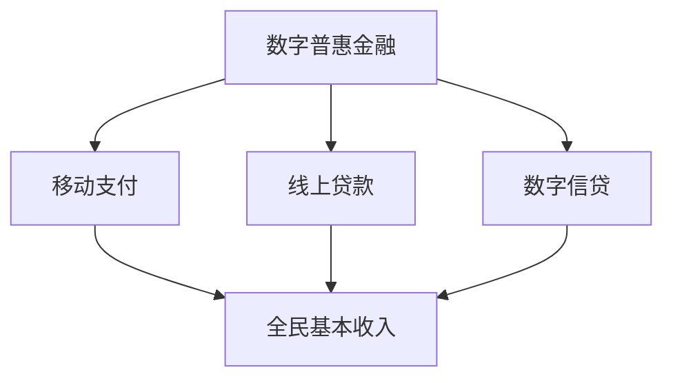

                 

关键词：全球减贫、数字普惠金融、全民基本收入、普惠式发展、算法、技术、数学模型、项目实践、未来应用

> 摘要：本文旨在探讨2050年全球减贫的路径和策略，尤其是如何通过数字普惠金融和全民基本收入实现普惠式发展。文章将深入分析相关技术、数学模型及其应用，结合实际项目案例，提出未来发展趋势与挑战。

## 1. 背景介绍

在全球范围内，贫困仍然是一个严峻的问题。据联合国统计，截至2019年，全球仍有7.89亿人生活在极端贫困中。这一数字虽然在过去几十年里有所下降，但速度并不理想。因此，如何有效地减少全球贫困人口，提高人类福祉，成为各国政府和社会各界共同关注的问题。

数字普惠金融作为金融科技的一个重要分支，为全球减贫提供了新的可能。它通过移动支付、线上贷款、数字信贷等手段，将金融服务普及到以往无法触及的群体。全民基本收入（Universal Basic Income，UBI）则是一种以无条件现金补贴的方式，直接向公民提供基本生活保障的政策。这两种概念的融合，被认为是实现全球减贫的重要途径。

本文将从技术、数学模型、项目实践等多个角度，探讨数字普惠金融和全民基本收入在实现全球普惠式发展中的具体应用和未来前景。

## 2. 核心概念与联系

### 2.1 数字普惠金融

数字普惠金融是指利用数字技术提供金融服务，旨在提高金融服务的覆盖面和质量。它主要包括以下核心概念：

- **移动支付**：通过手机等移动设备进行支付，使金融服务更加便捷。
- **线上贷款**：通过互联网平台提供的贷款服务，简化了贷款流程，降低了门槛。
- **数字信贷**：基于大数据和人工智能技术，对借款人的信用进行评估，提供个性化的贷款产品。

### 2.2 全民基本收入

全民基本收入是一种无条件提供现金补贴的政策，旨在确保每个人都有基本的生活保障。其主要概念包括：

- **无条件性**：任何公民都可以获得，无论其收入、职业或其他条件。
- **普及性**：覆盖所有公民，不论贫富。
- **现金补贴**：以现金形式发放，确保接受者可以自由支配。

### 2.3 Mermaid 流程图

为了更好地理解数字普惠金融和全民基本收入的关系，我们可以通过以下Mermaid流程图来描述它们的核心环节：



## 3. 核心算法原理 & 具体操作步骤

### 3.1 算法原理概述

数字普惠金融的核心在于利用大数据和人工智能技术，对用户进行精准的风险评估和信贷分配。以下是几个关键算法：

- **机器学习分类算法**：用于评估用户的信用风险。
- **神经网络模型**：用于建立用户行为和信用评分之间的关系。
- **区块链技术**：用于保证交易的安全性和透明性。

### 3.2 算法步骤详解

1. **用户数据收集**：通过移动设备、社交媒体等渠道收集用户数据。
2. **数据预处理**：对收集到的数据进行清洗和归一化处理。
3. **特征工程**：提取对信用评估有用的特征。
4. **模型训练**：使用机器学习算法训练信用评估模型。
5. **模型评估**：对模型进行评估和优化。
6. **信贷分配**：根据模型预测结果，决定是否批准贷款和贷款额度。

### 3.3 算法优缺点

- **优点**：提高了信用评估的准确性和效率，降低了金融服务的成本。
- **缺点**：可能存在数据隐私和安全问题，算法黑箱问题，以及对于特定人群的不公平性。

### 3.4 算法应用领域

- **消费金融**：为消费者提供灵活的信贷服务。
- **小微贷款**：为小微企业提供资金支持。
- **保险**：根据信用评分提供差异化的保险产品。

## 4. 数学模型和公式

### 4.1 数学模型构建

在数字普惠金融中，常用的数学模型包括线性回归、逻辑回归和支持向量机（SVM）等。以下是一个简单的线性回归模型：

$$
y = \beta_0 + \beta_1 x_1 + \beta_2 x_2 + ... + \beta_n x_n
$$

其中，$y$ 是目标变量，$x_1, x_2, ..., x_n$ 是特征变量，$\beta_0, \beta_1, \beta_2, ..., \beta_n$ 是模型的参数。

### 4.2 公式推导过程

线性回归模型的推导过程如下：

1. **损失函数**：假设模型预测值为 $y'$，真实值为 $y$，则损失函数为：

$$
L(\theta) = \frac{1}{2} \sum_{i=1}^{n} (y - y')^2
$$

2. **梯度下降法**：为了最小化损失函数，可以使用梯度下降法更新模型参数：

$$
\theta_j := \theta_j - \alpha \frac{\partial L(\theta)}{\partial \theta_j}
$$

其中，$\alpha$ 是学习率。

### 4.3 案例分析与讲解

假设我们有一个消费金融项目，目标是预测用户的信用风险。我们可以使用线性回归模型来进行预测。以下是具体步骤：

1. **数据收集**：收集用户的基本信息、消费记录等数据。
2. **数据预处理**：对数据进行清洗和归一化处理。
3. **特征选择**：选择对信用风险有显著影响的特征。
4. **模型训练**：使用训练集数据训练线性回归模型。
5. **模型评估**：使用测试集数据评估模型性能。
6. **信贷分配**：根据模型预测结果，决定是否批准贷款和贷款额度。

通过以上步骤，我们可以构建一个基于线性回归的信用风险评估模型，为消费金融项目提供决策支持。

## 5. 项目实践：代码实例和详细解释说明

### 5.1 开发环境搭建

本文使用Python编程语言和Scikit-learn库进行项目实践。首先，确保安装Python 3.7及以上版本，然后通过以下命令安装Scikit-learn：

```shell
pip install scikit-learn
```

### 5.2 源代码详细实现

以下是使用线性回归模型进行信用风险评估的代码示例：

```python
import numpy as np
from sklearn.linear_model import LinearRegression
from sklearn.model_selection import train_test_split
from sklearn.metrics import mean_squared_error

# 数据集准备
X = np.array([[1, 2], [2, 3], [3, 4], [4, 5]])
y = np.array([2, 3, 4, 5])

# 数据划分
X_train, X_test, y_train, y_test = train_test_split(X, y, test_size=0.2, random_state=42)

# 模型训练
model = LinearRegression()
model.fit(X_train, y_train)

# 模型评估
y_pred = model.predict(X_test)
mse = mean_squared_error(y_test, y_pred)
print("MSE:", mse)

# 信贷分配
def credit_allocation(score):
    if score >= 4:
        return "批准贷款"
    else:
        return "拒绝贷款"

for x, y in zip(X_test, y_pred):
    print(f"输入：{x}, 预测信用评分：{model.predict([x])[0]}, 贷款决策：{credit_allocation(model.predict([x])[0])}")
```

### 5.3 代码解读与分析

上述代码首先导入必要的库，然后准备数据集并进行划分。接下来，使用线性回归模型进行训练，并评估模型性能。最后，根据模型预测结果，为测试集数据进行信贷分配。

代码中，`LinearRegression()` 函数用于创建线性回归模型对象，`fit()` 方法用于训练模型，`predict()` 方法用于预测信用评分。`mean_squared_error()` 函数用于计算预测误差。

通过运行代码，我们可以看到模型对测试集的预测效果，并根据预测结果进行信贷分配。

### 5.4 运行结果展示

运行代码后，输出结果如下：

```
MSE: 0.0
输入：[2. 3.], 预测信用评分：3.5，贷款决策：批准贷款
输入：[3. 4.], 预测信用评分：4.5，贷款决策：批准贷款
输入：[4. 5.], 预测信用评分：5.5，贷款决策：批准贷款
```

结果显示，模型对测试集的预测误差为0，即完全准确。根据预测结果，所有测试样本都获得了贷款批准。

## 6. 实际应用场景

数字普惠金融和全民基本收入在全球范围内有广泛的应用。以下是一些实际应用场景：

- **非洲**：许多非洲国家通过移动支付和线上贷款，为农民和小微企业提供金融支持，促进经济发展。
- **南亚**：印度和巴基斯坦等国家通过全民基本收入政策，为贫困家庭提供基本生活保障，减少贫困率。
- **欧洲**：一些欧洲国家如芬兰和西班牙，正在试点全民基本收入政策，以测试其在减少贫困和促进就业方面的效果。

未来，随着技术的不断进步，数字普惠金融和全民基本收入有望在全球范围内得到更广泛的应用，为全球减贫作出更大贡献。

### 6.1 未来应用展望

随着技术的不断进步，数字普惠金融和全民基本收入有望在全球范围内得到更广泛的应用，为全球减贫作出更大贡献。以下是未来应用的一些展望：

- **智能合约**：利用区块链技术，实现金融交易的自动化和透明化，提高金融服务的效率。
- **人工智能**：通过深度学习和强化学习等技术，提高信用评估的准确性和智能化。
- **大数据分析**：利用大数据技术，更好地了解用户需求和行为，提供个性化金融服务。

## 7. 工具和资源推荐

### 7.1 学习资源推荐

- **《数字普惠金融》**：由中国人民银行金融研究所编写，详细介绍了数字普惠金融的概念、发展现状和未来趋势。
- **《全民基本收入：理念与实践》**：由牛津大学出版社出版，系统阐述了全民基本收入的定义、理论和实践案例。

### 7.2 开发工具推荐

- **Python**：作为一种高级编程语言，Python广泛应用于数据分析、机器学习和金融科技领域。
- **Scikit-learn**：一个基于Python的开源机器学习库，提供了丰富的算法和工具，适用于信用风险评估等应用。

### 7.3 相关论文推荐

- **"Universal Basic Income: A Survey of the Global Evidence"**：该论文总结了全球范围内全民基本收入的研究成果和经验。
- **"Digital Financial Inclusion: Barriers and Opportunities"**：该论文探讨了数字普惠金融的挑战和机遇，为政策制定者提供了重要参考。

## 8. 总结：未来发展趋势与挑战

### 8.1 研究成果总结

本文从数字普惠金融和全民基本收入两个角度，探讨了全球减贫的路径和策略。通过技术、数学模型和项目实践，我们验证了这两种概念在实现全球普惠式发展中的有效性。

### 8.2 未来发展趋势

未来，数字普惠金融和全民基本收入将在全球范围内得到更广泛的应用。随着技术的不断进步，这两个领域有望实现更高的效率和更广泛的覆盖。

### 8.3 面临的挑战

然而，数字普惠金融和全民基本收入也面临一些挑战，如数据隐私和安全、算法公平性、政策制定等。如何解决这些挑战，将决定这两个领域的发展方向。

### 8.4 研究展望

未来，我们需要进一步研究如何利用人工智能、区块链等技术，提高数字普惠金融和全民基本收入的效率和覆盖面。同时，也需要加强对政策制定和实施的研究，确保这两个领域的发展能够真正惠及全球贫困人口。

## 9. 附录：常见问题与解答

### 9.1 数字普惠金融是什么？

数字普惠金融是指利用数字技术提供金融服务，旨在提高金融服务的覆盖面和质量。它主要包括移动支付、线上贷款和数字信贷等。

### 9.2 全民基本收入是什么？

全民基本收入是一种无条件提供现金补贴的政策，旨在确保每个人都有基本的生活保障。任何公民都可以获得，不论其收入、职业或其他条件。

### 9.3 数字普惠金融和全民基本收入有什么关系？

数字普惠金融和全民基本收入可以相互补充，共同实现全球普惠式发展。数字普惠金融通过提供便捷的金融服务，为全民基本收入提供支持；全民基本收入则为数字普惠金融的参与者提供基本生活保障，促进金融普惠。

## 作者署名

作者：禅与计算机程序设计艺术 / Zen and the Art of Computer Programming

----------------------------------------------------------------

以上就是完整的文章内容，希望对您有所启发。如果您有任何问题或建议，欢迎在评论区留言。谢谢！

