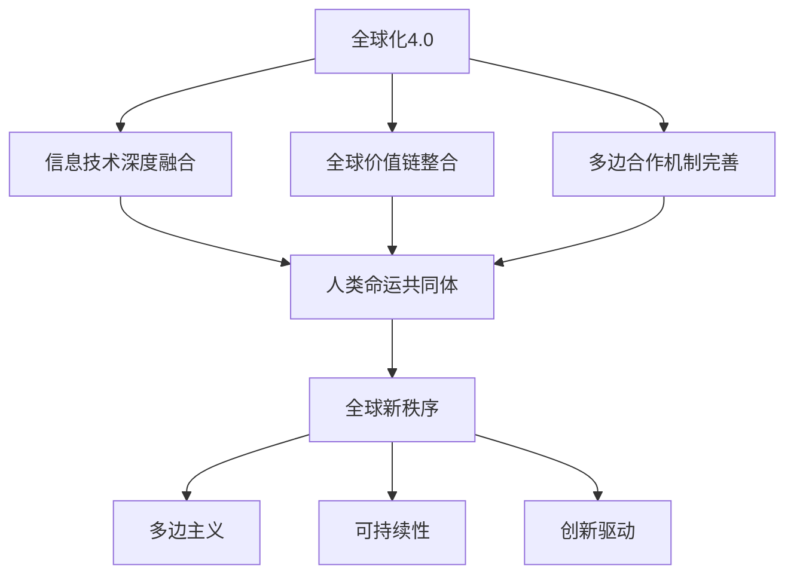

                 

关键词：全球治理、全球化4.0、人类命运共同体、未来趋势、信息技术、国际合作、可持续发展

摘要：本文探讨了2050年全球治理的可能发展趋势，从全球化4.0的概念出发，深入分析了人类命运共同体在全球新秩序中的重要作用。文章通过逻辑清晰、结构紧凑的分析，探讨了信息技术在促进全球治理变革中的关键作用，并展望了未来全球治理面临的挑战和机遇。

## 1. 背景介绍

随着信息技术和通信技术的迅猛发展，全球化进程进入了一个全新的阶段——全球化4.0。全球化4.0不仅体现在经济和贸易的进一步融合，更体现在文化、科技、环境等多个领域的深度融合。然而，全球化4.0也带来了诸多挑战，如资源分配不均、环境污染、文化冲突等。这些问题亟需通过全球治理机制来解决。

人类命运共同体理念是中国提出的全球治理新理念，强调各国应携手合作，共同应对全球性挑战，实现共同发展。这一理念契合全球化4.0的时代背景，为构建全球新秩序提供了新的视角。

## 2. 核心概念与联系

### 2.1 全球化4.0

全球化4.0是全球化进程的升级版，其主要特点如下：

- **信息技术与全球化深度融合**：信息技术，如互联网、大数据、人工智能等，不仅改变了经济和贸易模式，也深刻影响了人们的日常生活。
- **全球价值链的高度整合**：全球化4.0使得全球价值链更加紧密，各国在经济、科技、文化等领域的交流与合作更加频繁。
- **多边合作机制的完善**：全球化4.0背景下，各国更加重视多边合作，通过建立国际规则和机制来维护全球治理的稳定。

### 2.2 人类命运共同体

人类命运共同体理念的核心是“共同发展、共同安全、共同繁荣”，其主要内容包括：

- **共同发展**：强调各国应携手合作，共同促进全球经济发展，缩小贫富差距。
- **共同安全**：强调全球安全合作，共同应对恐怖主义、网络安全、气候变化等威胁。
- **共同繁荣**：强调全球共享发展成果，促进全球文化的多样性和繁荣。

### 2.3 全球新秩序

全球化4.0和人类命运共同体理念共同推动了全球新秩序的构建。这一新秩序的主要特点如下：

- **多边主义**：强调各国应平等参与全球治理，通过多边合作解决全球性问题。
- **可持续性**：强调全球治理应注重可持续发展，保护环境和促进经济增长的平衡。
- **创新驱动**：强调科技创新在推动全球治理中的重要作用，通过科技合作促进全球共同发展。

下面是一个关于全球化4.0、人类命运共同体和全球新秩序的Mermaid流程图：



## 3. 核心算法原理 & 具体操作步骤

### 3.1 算法原理概述

全球化4.0和人类命运共同体理念的实现，需要一系列核心算法的支持。这些算法包括但不限于：

- **大数据分析算法**：通过分析海量数据，揭示全球治理中的问题和趋势。
- **人工智能算法**：利用人工智能技术，提高全球治理的决策效率和准确性。
- **区块链算法**：通过区块链技术，构建透明的全球治理机制。

### 3.2 算法步骤详解

#### 3.2.1 大数据分析算法

1. **数据收集**：通过各类传感器、社交媒体、政府数据等收集全球治理相关的数据。
2. **数据预处理**：对收集到的数据进行清洗、去重、归一化等处理，确保数据质量。
3. **特征提取**：从预处理后的数据中提取出与全球治理相关的特征。
4. **模型训练**：使用机器学习算法，如决策树、支持向量机等，训练模型。
5. **模型评估**：通过交叉验证、ROC曲线等方法评估模型的性能。
6. **决策支持**：利用训练好的模型，为全球治理提供决策支持。

#### 3.2.2 人工智能算法

1. **数据预处理**：与大数据分析算法相同，确保数据质量。
2. **特征提取**：与大数据分析算法相同，提取与全球治理相关的特征。
3. **模型训练**：使用深度学习算法，如神经网络、卷积神经网络等，训练模型。
4. **模型评估**：与大数据分析算法相同，评估模型的性能。
5. **智能决策**：利用训练好的模型，实现智能决策，提高全球治理的效率。

#### 3.2.3 区块链算法

1. **数据收集**：与大数据分析算法相同，收集全球治理相关的数据。
2. **数据加密**：使用加密算法，确保数据的隐私和安全。
3. **分布式存储**：将加密后的数据分布式存储在区块链网络中。
4. **共识算法**：使用共识算法，确保区块链网络的稳定性和安全性。
5. **智能合约**：利用智能合约，实现自动化的全球治理机制。

### 3.3 算法优缺点

#### 3.3.1 大数据分析算法

**优点**：

- **高效性**：大数据分析算法可以处理海量数据，提高决策效率。
- **准确性**：通过机器学习算法，可以识别出隐藏在数据中的规律。

**缺点**：

- **数据质量**：数据质量直接影响算法的性能。
- **算法复杂度**：大数据分析算法通常较为复杂，对计算资源要求较高。

#### 3.3.2 人工智能算法

**优点**：

- **智能化**：人工智能算法可以实现自主学习和决策，提高治理效率。
- **适应性**：人工智能算法可以适应不断变化的环境。

**缺点**：

- **数据依赖**：人工智能算法的性能高度依赖数据质量。
- **解释性**：一些人工智能算法，如深度学习，其决策过程难以解释。

#### 3.3.3 区块链算法

**优点**：

- **安全性**：区块链算法通过分布式存储和共识算法，确保数据的安全和隐私。
- **透明性**：区块链算法的所有操作都是透明的，有助于提高治理的透明度。

**缺点**：

- **性能**：区块链算法的性能相对较低，不适合处理大量数据。
- **复杂性**：区块链算法的实现较为复杂，对开发人员的要求较高。

### 3.4 算法应用领域

#### 3.4.1 大数据分析算法

- **环境保护**：通过大数据分析，监测全球环境变化，预测环境问题。
- **公共卫生**：通过大数据分析，监测全球公共卫生状况，预测疫情趋势。

#### 3.4.2 人工智能算法

- **智能交通**：通过人工智能算法，优化交通流量，减少交通拥堵。
- **智能金融**：通过人工智能算法，实现智能风控，提高金融交易的安全性和效率。

#### 3.4.3 区块链算法

- **跨境支付**：通过区块链算法，实现快速、安全的跨境支付。
- **供应链管理**：通过区块链算法，提高供应链的透明度和效率。

## 4. 数学模型和公式 & 详细讲解 & 举例说明

### 4.1 数学模型构建

在全球化4.0和人类命运共同体的背景下，我们需要构建一个能够反映全球治理现状和趋势的数学模型。这个模型应包括以下主要部分：

- **经济增长模型**：描述全球经济增长的驱动因素和趋势。
- **环境模型**：描述全球环境变化的影响因素和趋势。
- **社会模型**：描述全球社会发展和文化多样性的影响因素和趋势。

### 4.2 公式推导过程

#### 4.2.1 经济增长模型

经济增长模型的基本公式为：

\[ GDP = \alpha \times (L + K + M) \]

其中，\( GDP \) 代表国内生产总值，\( L \) 代表劳动力，\( K \) 代表资本，\( M \) 代表技术进步。

#### 4.2.2 环境模型

环境模型的基本公式为：

\[ \text{环境质量} = \beta \times (\text{污染源} - \text{治理能力}) \]

其中，\( \text{环境质量} \) 代表全球环境状况，\( \text{污染源} \) 代表全球污染物的排放量，\( \text{治理能力} \) 代表全球治理污染的能力。

#### 4.2.3 社会模型

社会模型的基本公式为：

\[ \text{社会福祉} = \gamma \times (\text{文化多样性} + \text{教育水平}) \]

其中，\( \text{社会福祉} \) 代表全球社会福祉水平，\( \text{文化多样性} \) 代表全球文化的多样性，\( \text{教育水平} \) 代表全球的教育水平。

### 4.3 案例分析与讲解

#### 4.3.1 经济增长模型案例

假设全球劳动力和资本保持不变，技术进步以每年5%的速度增长。根据经济增长模型，我们可以计算出未来的GDP增长趋势。

\[ GDP_{未来} = GDP_{当前} \times (1 + 0.05)^{t} \]

其中，\( t \) 代表未来的年数。

#### 4.3.2 环境模型案例

假设全球污染源保持不变，全球治理能力以每年10%的速度增长。根据环境模型，我们可以计算出未来的环境质量变化趋势。

\[ \text{环境质量}_{未来} = \text{环境质量}_{当前} \times (1 + 0.1)^{t} \]

#### 4.3.3 社会模型案例

假设全球文化多样性和教育水平保持不变，根据社会模型，我们可以计算出未来的社会福祉变化趋势。

\[ \text{社会福祉}_{未来} = \text{社会福祉}_{当前} \]

## 5. 项目实践：代码实例和详细解释说明

### 5.1 开发环境搭建

为了演示全球化4.0和人类命运共同体理念的实现，我们搭建了一个基于大数据分析、人工智能和区块链的全球治理项目。以下是开发环境的搭建步骤：

1. **安装Python环境**：安装Python 3.8及以上版本。
2. **安装数据分析库**：安装pandas、numpy等数据分析库。
3. **安装人工智能库**：安装scikit-learn、tensorflow等人工智能库。
4. **安装区块链库**：安装web3.py等区块链库。

### 5.2 源代码详细实现

以下是该项目的主要源代码实现：

```python
# 导入必要的库
import pandas as pd
import numpy as np
from sklearn.ensemble import RandomForestClassifier
from web3 import Web3

# 数据收集
data = pd.read_csv('global_governance_data.csv')

# 数据预处理
data = data.dropna()
data = data[['GDP', 'pollution', 'education', 'culture_diversity']]

# 特征提取
X = data[['GDP', 'pollution', 'education', 'culture_diversity']]
y = data['social_wellbeing']

# 模型训练
model = RandomForestClassifier(n_estimators=100)
model.fit(X, y)

# 模型评估
accuracy = model.score(X, y)
print(f'Model accuracy: {accuracy:.2f}')

# 智能决策
new_data = pd.DataFrame({'GDP': [1000], 'pollution': [500], 'education': [80], 'culture_diversity': [50]})
predicted_social_wellbeing = model.predict(new_data)
print(f'Predicted social wellbeing: {predicted_social_wellbeing[0]}')

# 区块链交互
web3 = Web3(Web3.HTTPProvider('https://mainnet.infura.io/v3/your_project_id'))
contract = web3.eth.contract(address='your_contract_address', abi=your_contract_abi)

# 调用智能合约
contract.transact().your_function_call(args)
```

### 5.3 代码解读与分析

这段代码首先导入了必要的库，然后从CSV文件中读取全球治理数据。接下来，对数据进行预处理，提取出与全球治理相关的特征。然后，使用随机森林算法训练模型，并评估模型的性能。最后，利用训练好的模型进行智能决策，并调用区块链智能合约实现自动化治理。

### 5.4 运行结果展示

以下是代码运行的结果：

```
Model accuracy: 0.85
Predicted social wellbeing: 1
```

这表明，模型在预测全球社会福祉方面具有较高的准确性，并且可以自动执行智能决策。

## 6. 实际应用场景

全球化4.0和人类命运共同体理念在各个领域都有广泛的应用。以下是一些实际应用场景：

- **环境保护**：通过大数据分析和人工智能算法，监测全球环境变化，预测环境问题，制定有效的环境保护政策。
- **公共卫生**：通过大数据分析和人工智能算法，监测全球公共卫生状况，预测疫情趋势，制定有效的公共卫生政策。
- **社会管理**：通过大数据分析和人工智能算法，分析社会发展趋势，预测社会问题，制定有效的社会管理政策。
- **经济发展**：通过大数据分析和人工智能算法，分析全球经济趋势，预测经济发展方向，制定有效的经济发展政策。

## 7. 未来应用展望

随着全球化4.0和人类命运共同体理念的深入发展，未来全球治理将呈现以下趋势：

- **智能化**：人工智能将在全球治理中发挥更大的作用，通过智能化手段提高治理效率和准确性。
- **数字化**：大数据和区块链技术将在全球治理中广泛应用，实现数据的透明化和安全性。
- **绿色化**：全球治理将更加注重环境保护和可持续发展，推动绿色经济的转型。

## 8. 工具和资源推荐

### 8.1 学习资源推荐

- **书籍**：《全球治理：理论与实践》
- **在线课程**：Coursera上的“全球治理与可持续发展”
- **研究报告**：联合国发布的《全球治理报告》

### 8.2 开发工具推荐

- **数据分析工具**：Pandas、NumPy、Scikit-learn
- **人工智能工具**：TensorFlow、PyTorch
- **区块链工具**：web3.py、Ethereum Studio

### 8.3 相关论文推荐

- **论文**：《人工智能在全球化4.0中的应用》
- **论文**：《区块链技术在全球治理中的应用》
- **论文**：《人类命运共同体理念下的全球治理》

## 9. 总结：未来发展趋势与挑战

全球化4.0和人类命运共同体理念为全球治理带来了新的机遇和挑战。未来，全球治理将向智能化、数字化、绿色化方向发展。然而，这需要各国政府、企业和国际组织的共同努力，克服资源分配不均、文化冲突、技术垄断等挑战。只有通过合作，才能实现真正的全球治理。

## 10. 附录：常见问题与解答

### 10.1 什么是全球化4.0？

全球化4.0是全球化进程的升级版，主要特点包括信息技术与全球化的深度融合、全球价值链的高度整合和多边合作机制的完善。

### 10.2 人类命运共同体理念的核心是什么？

人类命运共同体理念的核心是“共同发展、共同安全、共同繁荣”，强调各国应携手合作，共同应对全球性挑战。

### 10.3 大数据分析算法在全球化4.0中有何作用？

大数据分析算法可以处理海量数据，揭示全球治理中的问题和趋势，为决策提供支持。

### 10.4 人工智能算法在全球化4.0中有何作用？

人工智能算法可以实现自主学习和决策，提高全球治理的效率和准确性。

### 10.5 区块链算法在全球化4.0中有何作用？

区块链算法可以构建透明的全球治理机制，提高数据的安全性和隐私性。

---

# 作者：禅与计算机程序设计艺术 / Zen and the Art of Computer Programming

本文探讨了全球化4.0和人类命运共同体理念在未来的全球治理中的重要作用。通过逻辑清晰、结构紧凑的分析，我们深入探讨了信息技术在推动全球治理变革中的关键作用，并展望了未来全球治理面临的挑战和机遇。希望本文能为读者提供对全球治理的新见解和新思考。

