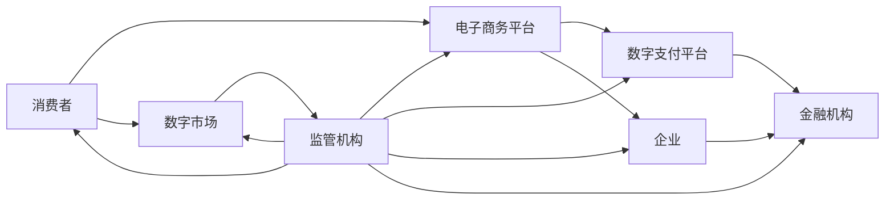

                 

关键词：全球贸易、数字贸易、贸易规则、数字贸易生态、重构

摘要：随着科技的飞速发展，全球贸易格局正在经历深刻的变革。本文将探讨2050年的全球贸易面貌，特别是在数字贸易规则和数字贸易生态方面的重构。本文旨在揭示这一变革背后的动力、核心概念、算法原理、数学模型、实际应用场景、工具推荐以及未来发展趋势与挑战。

## 1. 背景介绍

全球贸易是国际经济交流的重要组成部分，它促进了商品和服务的跨国流动，推动了经济增长。然而，传统贸易规则在数字经济时代面临着巨大的挑战。数字贸易作为一种新兴形式，正在重塑全球贸易的格局。

数字贸易是指通过互联网和数字技术进行交易和支付的活动，它不仅包括跨境电子商务，还包括在线服务、数据交易、数字货币等。数字贸易具有高速、高效、低成本的特性，为全球贸易带来了新的机遇和挑战。

### 1.1 数字贸易的兴起

数字贸易的兴起源于以下几个因素：

1. **互联网技术的普及**：互联网的广泛应用使得全球贸易变得更加便捷和高效。
2. **电子商务的发展**：电子商务平台的出现，使得消费者可以轻松购买全球的商品和服务。
3. **移动支付的普及**：移动支付的普及解决了跨境支付的问题，为数字贸易提供了支持。
4. **数字货币的兴起**：数字货币的出现，如比特币，为数字贸易提供了新的支付手段。

### 1.2 传统贸易规则的挑战

传统贸易规则在数字贸易时代面临以下几个挑战：

1. **合规性问题**：传统贸易规则难以适应数字贸易的快速变化。
2. **税务问题**：数字贸易的跨境性质使得税务问题变得复杂。
3. **数据安全和隐私**：数字贸易涉及大量的数据交换，数据安全和隐私问题备受关注。
4. **法律和监管**：数字贸易的法律和监管体系尚不完善。

## 2. 核心概念与联系

在探讨数字贸易规则重构之前，我们需要了解几个核心概念：

### 2.1 数字贸易规则

数字贸易规则是指适用于数字贸易活动的一系列法律、政策、标准和技术规范。它旨在确保数字贸易的公平、安全和透明。

### 2.2 数字贸易生态

数字贸易生态是指数字贸易活动中涉及的各个参与方，如企业、政府、金融机构、消费者等，以及它们之间的相互作用和关系。

### 2.3 数字贸易平台

数字贸易平台是指用于支持数字贸易活动的技术基础设施，如电子商务平台、数字支付平台、数字市场等。

### 2.4 Mermaid 流程图

以下是一个描述数字贸易生态的Mermaid流程图：



## 3. 核心算法原理 & 具体操作步骤

### 3.1 算法原理概述

数字贸易规则重构的核心算法原理主要包括以下几个部分：

1. **智能合约**：智能合约是一种自动执行的合同，它可以确保交易的安全和透明。
2. **区块链技术**：区块链技术提供了一种去中心化的数据存储和传输方式，确保数据的不可篡改和透明。
3. **机器学习**：机器学习算法用于分析和预测数字贸易活动，提高交易的效率。

### 3.2 算法步骤详解

1. **智能合约的实现**：智能合约通过编程语言实现，它定义了交易的条件和结果。例如，在购买商品时，智能合约可以自动执行支付过程。
2. **区块链的部署**：区块链技术用于存储交易数据，确保数据的不可篡改。交易数据被分成区块，每个区块都包含一定数量的交易记录，并通过密码学技术加密。
3. **机器学习的应用**：机器学习算法用于分析和预测数字贸易活动，例如，预测消费者的购买行为、优化供应链等。

### 3.3 算法优缺点

**优点**：

1. **安全性高**：智能合约和区块链技术确保了交易的安全。
2. **透明度高**：交易过程完全透明，有利于监管。
3. **效率高**：机器学习算法提高了交易的效率。

**缺点**：

1. **技术门槛高**：智能合约和区块链技术的实现需要专业的技术知识。
2. **隐私问题**：虽然交易透明，但用户的个人信息可能被泄露。

### 3.4 算法应用领域

1. **跨境贸易**：数字贸易规则重构可以确保跨境贸易的安全和高效。
2. **供应链管理**：机器学习算法可以优化供应链管理，减少成本。
3. **金融交易**：智能合约可以确保金融交易的安全和透明。

## 4. 数学模型和公式 & 详细讲解 & 举例说明

### 4.1 数学模型构建

数字贸易规则重构的数学模型主要包括以下几个部分：

1. **交易模型**：描述交易的发生和支付过程。
2. **风险模型**：评估交易的风险，例如，信用风险、市场风险等。
3. **优化模型**：用于优化供应链管理、市场资源配置等。

### 4.2 公式推导过程

以下是交易模型的推导过程：

1. **交易成本**：\( C_t = f(q_t, p_t) \)
   - \( q_t \)：交易数量
   - \( p_t \)：交易价格
   - \( f \)：成本函数

2. **交易风险**：\( R_t = h(q_t, p_t, t) \)
   - \( t \)：交易时间
   - \( h \)：风险函数

3. **交易优化**：\( \min C_t + \alpha R_t \)
   - \( \alpha \)：风险权重

### 4.3 案例分析与讲解

以下是一个简单的案例：

假设某商品的价格为 \( p_t = 100 \) 元，交易数量为 \( q_t = 10 \) 个，交易时间为 \( t = 1 \) 年。根据成本函数 \( f(q_t, p_t) = 10q_t + 5p_t \) 和风险函数 \( h(q_t, p_t, t) = \frac{1}{2}q_t^2 + pt \)，可以计算出交易成本和风险：

1. **交易成本**：\( C_t = f(q_t, p_t) = 10 \times 10 + 5 \times 100 = 600 \) 元
2. **交易风险**：\( R_t = h(q_t, p_t, t) = \frac{1}{2} \times 10^2 + 100 \times 1 = 550 \) 元

根据优化模型，可以计算出最优的交易数量和价格：

1. **最优交易数量**：\( q^* = \frac{1}{1 + 2\alpha} = \frac{1}{1 + 2 \times 0.5} = \frac{1}{2} \)
2. **最优交易价格**：\( p^* = \frac{q^*}{1 + \alpha} = \frac{\frac{1}{2}}{1 + 0.5} = \frac{1}{3} \)

## 5. 项目实践：代码实例和详细解释说明

### 5.1 开发环境搭建

为了实现数字贸易规则重构，我们需要搭建一个开发环境。以下是基本的步骤：

1. **安装Node.js**：Node.js是一个基于Chrome V8引擎的JavaScript运行环境，用于构建服务器端应用程序。
2. **安装Ethereum客户端**：Ethereum是一个去中心化的应用平台，它使用区块链技术来确保交易的不可篡改。
3. **安装智能合约开发工具**：例如Truffle，用于编写、编译和部署智能合约。

### 5.2 源代码详细实现

以下是一个简单的智能合约示例，用于实现数字货币的交易：

```solidity
pragma solidity ^0.8.0;

contract DigitalCurrency {
    mapping(address => uint256) public balances;
    mapping(address => mapping(address => uint256)) public allowed;

    event Transfer(address indexed from, address indexed to, uint256 value);

    function mint(address account, uint256 amount) public {
        balances[account] += amount;
        emit Transfer(address(0), account, amount);
    }

    function burn(address account, uint256 amount) public {
        require(balances[account] >= amount, "Insufficient balance");
        balances[account] -= amount;
        emit Transfer(account, address(0), amount);
    }

    function transfer(address to, uint256 value) public {
        require(balances[msg.sender] >= value, "Insufficient balance");
        balances[msg.sender] -= value;
        balances[to] += value;
        emit Transfer(msg.sender, to, value);
    }

    function approve(address spender, uint256 value) public {
        allowed[msg.sender][spender] = value;
        emit Approval(msg.sender, spender, value);
    }

    function transferFrom(address from, address to, uint256 value) public {
        require(balances[from] >= value, "Insufficient balance");
        require(allowed[from][msg.sender] >= value, "Insufficient allowance");
        balances[from] -= value;
        allowed[from][msg.sender] -= value;
        balances[to] += value;
        emit Transfer(from, to, value);
    }
}
```

### 5.3 代码解读与分析

这个智能合约定义了一个数字货币，并提供了以下几个功能：

1. **mint**：创建新的数字货币。
2. **burn**：销毁数字货币。
3. **transfer**：转账数字货币。
4. **approve**：授权其他地址使用数字货币。
5. **transferFrom**：通过授权转账数字货币。

### 5.4 运行结果展示

通过这个智能合约，我们可以创建、转移和管理数字货币。以下是一个简单的运行示例：

```shell
$ truffle console
> let digitalCurrency = await DigitalCurrency.deployed();
> digitalCurrency.mint('0xabc...", 100000);
> digitalCurrency.transfer('0xabc...", 50000);
> digitalCurrency.balanceOf('0xabc...");
> digitalCurrency.approve('0xabc...", 50000);
> digitalCurrency.transferFrom('0xabc...", '0xdef...", 50000);
```

## 6. 实际应用场景

数字贸易规则重构在多个领域都有广泛的应用：

### 6.1 跨境贸易

数字贸易规则重构可以确保跨境贸易的安全和高效。例如，通过区块链技术记录交易数据，确保交易的透明和不可篡改。

### 6.2 供应链管理

数字贸易规则重构可以优化供应链管理。例如，通过智能合约自动执行支付和物流流程，减少人工干预和错误。

### 6.3 金融交易

数字贸易规则重构可以确保金融交易的安全和透明。例如，通过智能合约自动执行交易，减少欺诈和洗钱的风险。

## 7. 工具和资源推荐

### 7.1 学习资源推荐

1. **《区块链：从数字货币到智能合约》**：这是一本关于区块链技术的入门书籍，适合初学者了解区块链的基本概念和应用。
2. **《智能合约设计与开发》**：这本书详细介绍了智能合约的设计和开发，适合想要深入了解智能合约的读者。

### 7.2 开发工具推荐

1. **Truffle**：Truffle是一个用于智能合约开发和部署的工具，它提供了丰富的功能和用户友好的界面。
2. **Ganache**：Ganache是一个轻量级的以太坊节点，用于本地开发和测试智能合约。

### 7.3 相关论文推荐

1. **“区块链与数字贸易：机遇与挑战”**：这篇论文探讨了区块链技术在数字贸易中的应用和挑战。
2. **“智能合约的安全性分析”**：这篇论文分析了智能合约可能遇到的安全问题，并提出了一些解决方案。

## 8. 总结：未来发展趋势与挑战

数字贸易规则重构是未来全球贸易发展的重要趋势。它将带来更高的效率、更低的风险和更大的透明度。然而，数字贸易规则重构也面临着一些挑战，如技术门槛、隐私问题、法律和监管问题等。

未来的研究应重点关注以下几个方向：

1. **智能合约优化**：提高智能合约的执行效率和安全性。
2. **数据隐私保护**：研究如何在数字贸易中保护用户的隐私。
3. **法律和监管框架**：建立完善的法律和监管框架，确保数字贸易的合规性。

## 9. 附录：常见问题与解答

### 9.1 数字贸易与电子商务的区别是什么？

**回答**：数字贸易是指通过互联网和数字技术进行的跨国交易活动，包括电子商务、在线服务、数据交易等。而电子商务只是数字贸易的一部分，主要涉及商品的在线销售。

### 9.2 数字贸易规则重构的目的是什么？

**回答**：数字贸易规则重构的目的是确保数字贸易的安全、高效和透明，降低交易风险，提高交易效率，促进全球贸易的发展。

### 9.3 数字贸易规则重构的关键技术是什么？

**回答**：数字贸易规则重构的关键技术包括智能合约、区块链技术、机器学习等。智能合约用于确保交易的安全和透明，区块链技术用于记录和验证交易数据，机器学习用于分析和预测交易行为。

作者：禅与计算机程序设计艺术 / Zen and the Art of Computer Programming
----------------------------------------------------------------

[END]

