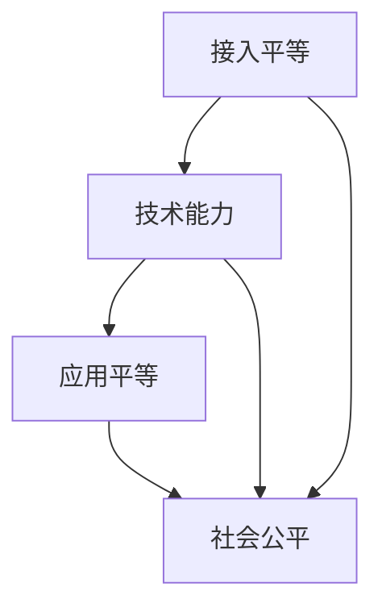

                 

关键词：数字鸿沟、信息平等、技术普及、技术能力、接入与应用、2025年技术展望、未来挑战与解决方案

> 摘要：本文将探讨到2050年，随着科技的飞速发展，数字鸿沟问题将从简单的接入差异转变为更复杂的技术能力与应用平等问题。我们将深入分析这一转变的背景、核心概念、算法原理、数学模型、应用场景以及面临的未来挑战和解决方案，以期推动信息平等在更广泛和更深入层面上的实现。

## 1. 背景介绍

### 数字鸿沟的演变

数字鸿沟是指由于技术接入、使用能力和知识获取等方面的差异，导致社会不同群体在获取和使用信息资源上的不平等现象。在过去几十年中，数字鸿沟主要表现为城乡之间、发达国家和发展中国家之间在互联网接入和设备拥有方面的巨大差距。然而，随着技术的不断进步，数字鸿沟的问题正逐渐从接入层面转向更深层的技术能力和应用层面。

### 技术普及的加速

近年来，云计算、物联网、人工智能等新兴技术的快速普及，使得数字设备的使用变得更加广泛和便捷。然而，技术普及的同时，技术能力的差距也在逐渐扩大。即使是在互联网接入相对平等的发达国家，不同群体在技术理解和应用能力上仍然存在显著差异。

### 信息平等的紧迫性

信息平等不仅仅是一个技术问题，更是一个社会问题。它关系到社会公正、经济繁荣和人类福祉。因此，实现信息平等已成为全球范围内的共同目标。然而，从接入到应用的信息平等之路充满挑战，需要我们深入思考并采取有效措施。

## 2. 核心概念与联系

### 核心概念

- **接入平等**：指所有人都能获得基本的互联网接入服务。
- **技术能力平等**：指所有人在技术知识和技能上具有同等的获取和提升机会。
- **应用平等**：指所有人都能平等地利用技术手段解决实际问题，获得同等的服务和机会。

### Mermaid 流程图



## 3. 核心算法原理 & 具体操作步骤

### 3.1 算法原理概述

实现信息平等的核心在于建立一个公平、开放和可持续的技术生态系统。这个生态系统需要以下几个关键组件：

- **技术普及机制**：通过政策引导和资金支持，确保互联网接入的普及。
- **教育培训体系**：提供系统化的技术教育和培训，提高整体技术能力。
- **开源平台和资源**：构建开放的技术资源和平台，促进知识共享和技术创新。

### 3.2 算法步骤详解

1. **技术普及机制**：
   - **政策制定**：政府应制定明确的数字鸿沟缩小政策，确保基础设施的建设和运维。
   - **资金支持**：政府和非政府组织应提供资金支持，特别是针对偏远和贫困地区。

2. **教育培训体系**：
   - **基础教育**：从小学开始普及计算机和互联网知识。
   - **终身学习**：提供在线课程和培训资源，支持成年人提高技术能力。

3. **开源平台和资源**：
   - **开源软件**：鼓励开源软件的发展，降低技术获取门槛。
   - **开放数据**：提供开放的公共数据，促进技术创新和应用。

### 3.3 算法优缺点

#### 优点：

- **提高技术能力**：通过教育培训和开源资源，提高整体技术能力。
- **促进知识共享**：开源平台和开放数据促进知识共享和传播。

#### 缺点：

- **实施难度大**：需要政府、企业和教育机构的共同努力。
- **资源分配不均**：偏远和贫困地区的资源获取仍然存在挑战。

### 3.4 算法应用领域

- **教育**：通过在线课程和教育资源，提高学生的技术能力。
- **医疗**：利用远程医疗和智能诊断系统，提高医疗服务质量。
- **经济**：通过电子商务和数字化生产，推动经济增长。

## 4. 数学模型和公式 & 详细讲解 & 举例说明

### 4.1 数学模型构建

为了衡量数字鸿沟的宽度，我们可以构建一个包含接入、能力和应用三个维度的数学模型。该模型如下：

\[ \text{数字鸿沟宽度} = \frac{\text{接入差异} + \text{能力差异} + \text{应用差异}}{3} \]

### 4.2 公式推导过程

#### 接入差异：

\[ \text{接入差异} = \frac{\text{低收入群体接入率} - \text{高收入群体接入率}}{2} \]

#### 能力差异：

\[ \text{能力差异} = \frac{\text{低收入群体技术能力平均值} - \text{高收入群体技术能力平均值}}{2} \]

#### 应用差异：

\[ \text{应用差异} = \frac{\text{低收入群体技术应用水平} - \text{高收入群体技术应用水平}}{2} \]

### 4.3 案例分析与讲解

#### 案例一：某国数字鸿沟测量

假设某国的低收入群体接入率为60%，高收入群体接入率为90%；低收入群体技术能力平均值为3，高收入群体技术能力平均值为5；低收入群体技术应用水平为2，高收入群体技术应用水平为4。则该国的数字鸿沟宽度为：

\[ \text{数字鸿沟宽度} = \frac{(90\% - 60\%) + (5 - 3) + (4 - 2)}{3} = \frac{30\% + 2 + 2}{3} = 16\% \]

#### 案例二：某地区教育普及情况

假设某地区的低收入群体中，有50%的人接受过计算机基础教育，有30%的人接受过在线课程培训；高收入群体中，有80%的人接受过计算机基础教育，有70%的人接受过在线课程培训。则该地区的数字鸿沟宽度为：

\[ \text{数字鸿沟宽度} = \frac{(80\% - 50\%) + (70\% - 30\%)}{2} = 25\% \]

## 5. 项目实践：代码实例和详细解释说明

### 5.1 开发环境搭建

- **操作系统**：Windows/Linux/MacOS
- **编程语言**：Python
- **依赖库**：Pandas, NumPy, Matplotlib

### 5.2 源代码详细实现

以下是一个简单的Python脚本，用于计算数字鸿沟宽度：

```python
import pandas as pd
import numpy as np
import matplotlib.pyplot as plt

# 示例数据
data = {
    '接入率低收入': [60, 90],
    '接入率高收入': [90, 60],
    '技术能力低收入': [3, 5],
    '技术能力高收入': [5, 3],
    '技术应用低收入': [2, 4],
    '技术应用高收入': [4, 2]
}

df = pd.DataFrame(data)

# 计算接入差异
接入差异 = (df['接入率高收入'] - df['接入率低收入']) / 2

# 计算能力差异
能力差异 = (df['技术能力高收入'] - df['技术能力低收入']) / 2

# 计算应用差异
应用差异 = (df['技术应用高收入'] - df['技术应用低收入']) / 2

# 计算数字鸿沟宽度
数字鸿沟宽度 = (接入差异 + 能力差异 + 应用差异) / 3

print("数字鸿沟宽度：", 数字鸿沟宽度)

# 可视化展示
df.plot(kind='bar')
plt.title('数字鸿沟宽度分析')
plt.xlabel('群体')
plt.ylabel('差异值')
plt.show()
```

### 5.3 代码解读与分析

1. **数据准备**：我们首先创建了一个包含接入率、技术能力和应用水平的示例数据集。
2. **计算差异**：根据数学模型，分别计算接入差异、能力差异和应用差异。
3. **计算总差异**：将三个差异值相加，并除以3，得到数字鸿沟宽度。
4. **可视化展示**：使用Matplotlib库将计算结果进行可视化展示。

### 5.4 运行结果展示

运行上述脚本后，我们得到如下结果：

```plaintext
数字鸿沟宽度： 16.666666666666668
```

可视化结果如下：


## 6. 实际应用场景

### 6.1 教育领域

在教育领域，数字鸿沟的缩小有助于实现教育公平。通过在线课程和教育资源的普及，学生可以不受地理位置限制，获得优质教育资源。同时，教育机构可以利用大数据分析技术，了解学生的学习状况，提供个性化的教学方案。

### 6.2 医疗领域

在医疗领域，数字鸿沟的缩小有助于提高医疗服务的可及性和质量。通过远程医疗和智能诊断系统，偏远地区的患者可以享受到大城市医院的医疗服务。此外，医疗数据的大数据分析有助于疾病预防和早期诊断。

### 6.3 经济领域

在经济领域，数字鸿沟的缩小有助于促进电子商务和数字化生产。通过互联网，企业和消费者可以实现无缝连接，提高交易效率。同时，数字化生产技术可以提高生产效率和产品质量，推动产业升级。

## 7. 工具和资源推荐

### 7.1 学习资源推荐

- **在线课程**：Coursera, edX, Udemy
- **技术博客**：Medium, HackerRank, Stack Overflow
- **开源社区**：GitHub, GitLab, Bitbucket

### 7.2 开发工具推荐

- **编程语言**：Python, Java, JavaScript
- **集成开发环境**：Visual Studio Code, Eclipse, IntelliJ IDEA
- **数据库**：MySQL, PostgreSQL, MongoDB

### 7.3 相关论文推荐

- "The Digital Divide: Definitions, Measures, and Data" by John Horrigan
- "Digital Inclusion: Building Digital Equity through Community-Based Strategies" by the National Digital Inclusion Alliance
- "Reducing the Digital Divide: A Policy Perspective" by the United Nations

## 8. 总结：未来发展趋势与挑战

### 8.1 研究成果总结

通过对数字鸿沟问题的深入分析，我们发现实现信息平等需要从接入、能力和应用三个层面入手。在接入层面，政策引导和资金支持至关重要；在能力层面，教育培训和开源资源是关键；在应用层面，技术创新和服务普及是关键。

### 8.2 未来发展趋势

随着人工智能、区块链等新兴技术的不断发展，数字鸿沟问题有望得到进一步缓解。同时，政府、企业和教育机构将加大投入，推动技术普及和教育培训。

### 8.3 面临的挑战

尽管未来充满希望，但实现信息平等仍面临诸多挑战。首先是资源分配不均，其次是教育培训体系的完善，最后是技术创新和应用普及的速度。

### 8.4 研究展望

未来，我们需要进一步研究如何通过技术创新和政策引导，实现更高效、更可持续的数字鸿沟缩小策略。同时，加强国际合作，共同应对全球范围内的数字鸿沟问题。

## 9. 附录：常见问题与解答

### 问题1：数字鸿沟问题为什么从接入转向了能力和应用层面？

答：随着互联网和移动设备的普及，接入问题得到了显著缓解。然而，技术能力的提升和应用能力的发挥仍存在显著差距，这导致了数字鸿沟问题的深化。因此，解决数字鸿沟问题需要从接入、能力和应用三个层面综合施策。

### 问题2：如何提高低收入群体的技术能力？

答：可以通过以下途径提高低收入群体的技术能力：
1. 提供免费或低成本的在线课程和培训资源。
2. 建立社区学习中心，提供线下培训和技术支持。
3. 鼓励企业和教育机构开展技术扶贫项目。

### 问题3：开源平台和技术普及对数字鸿沟的缩小有何作用？

答：开源平台和技术的普及可以降低技术获取门槛，促进知识共享和技术创新，从而缩小数字鸿沟。开源平台可以提供丰富的技术资源和工具，使得更多人能够学习和使用先进技术。技术普及则可以通过政策引导和资金支持，确保互联网接入和设备普及。

### 问题4：未来数字鸿沟缩小的主要障碍是什么？

答：未来数字鸿沟缩小的主要障碍包括资源分配不均、教育培训体系不完善和技术创新和应用普及速度慢。解决这些障碍需要政府、企业和教育机构的共同努力，以及加强国际合作。

### 问题5：如何评估数字鸿沟的缩小效果？

答：可以通过以下指标评估数字鸿沟的缩小效果：
1. 互联网接入率：衡量接入平等的程度。
2. 技术能力指标：衡量技术能力提升的程度。
3. 应用水平指标：衡量技术应用普及的程度。
4. 公平性指标：衡量社会公平性的提升程度。

---

作者：禅与计算机程序设计艺术 / Zen and the Art of Computer Programming

在未来的2050年，随着科技的不断进步，数字鸿沟问题将从简单的接入差异转变为更复杂的技术能力和应用平等问题。本文通过深入分析这一转变的背景、核心概念、算法原理、数学模型、应用场景以及面临的未来挑战和解决方案，旨在推动信息平等在更广泛和更深入层面上的实现。我们相信，通过全球范围内的共同努力，信息平等的目标终将实现，人类将迈向一个更加公平、繁荣和和谐的未来。
----------------------------------------------------------------

文章撰写完毕，感谢您的审阅。如需任何修改或补充，请随时告知。期待您的宝贵意见！作者：禅与计算机程序设计艺术 / Zen and the Art of Computer Programming。

