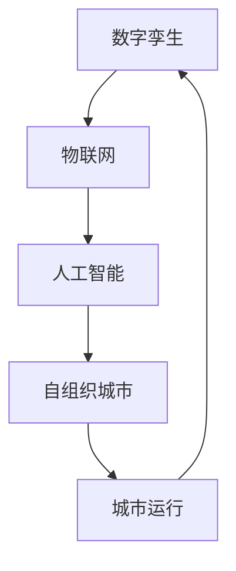

                 

关键词：智慧城市、数字孪生、自组织城市、城市进化、算法、人工智能、物联网

> 摘要：本文探讨了2050年智慧城市的可能形态和关键技术，从数字孪生到自组织城市，分析了城市进化的路径。文章旨在为读者呈现一幅未来的城市蓝图，并探讨其中潜藏的技术挑战和机遇。

## 1. 背景介绍

随着信息技术和物联网的快速发展，智慧城市已经成为全球范围内城市规划和建设的重要方向。智慧城市的目标是通过整合各种信息技术，提高城市运行效率、居民生活质量，并实现可持续发展。然而，智慧城市的发展不仅仅是技术的进步，更是城市形态和社会关系的深刻变革。

### 1.1 城市发展的现状与挑战

当前，城市面临着许多严峻的挑战，包括交通拥堵、环境污染、资源短缺和城市安全等。这些问题的解决需要更加智能化的解决方案，而智慧城市正是为此而生。

### 1.2 智慧城市的发展历程

智慧城市的发展历程可以分为几个阶段：

- **1.1 早期探索阶段**：主要是基于信息技术和通信技术的初步应用，如智能交通系统、智能照明等。

- **1.2 信息化发展阶段**：城市各个子系统开始实现信息化，数据互联互通，大数据分析成为可能。

- **1.3 智能化阶段**：人工智能和物联网技术的应用，使得城市能够实现更加智能的决策和运行。

- **1.4 自组织阶段**：未来的智慧城市将更加注重自组织能力，实现城市系统的自我优化和进化。

## 2. 核心概念与联系

### 2.1 数字孪生

数字孪生（Digital Twin）是一种虚拟仿真技术，通过创建现实世界的数字映射，实现对现实世界的实时监测、分析和预测。在智慧城市中，数字孪生可以应用于城市基础设施、交通系统、能源系统等，为城市的智能化运行提供基础。

### 2.2 物联网

物联网（Internet of Things, IoT）是将各种物理设备通过网络连接起来，实现信息交换和通信。物联网为智慧城市提供了海量的数据来源，是智慧城市实现数据驱动的关键。

### 2.3 人工智能

人工智能（Artificial Intelligence, AI）是智慧城市的“大脑”，通过机器学习、深度学习等技术，实现对数据的处理和分析，为城市提供智能决策支持。

### 2.4 自组织城市

自组织城市是一种新型的城市形态，通过分布式计算和自组织机制，实现城市的自我管理和自我优化。自组织城市的目标是实现城市的可持续发展，并提高居民的生活质量。

### 2.5 Mermaid 流程图

以下是一个简单的 Mermaid 流程图，展示了智慧城市中的核心概念及其相互关系：



## 3. 核心算法原理 & 具体操作步骤

### 3.1 算法原理概述

智慧城市中的核心算法主要包括数据采集与处理、智能决策、自我优化等。以下是一些典型的算法原理：

- **数据采集与处理**：使用传感器和物联网设备采集城市运行数据，然后通过数据清洗、数据预处理等技术，将数据转换为适合分析的形式。

- **智能决策**：基于机器学习和深度学习技术，对采集到的数据进行分析，为城市提供智能化的决策支持。

- **自我优化**：通过自组织算法，实现对城市系统的自我管理和自我优化，提高城市运行效率。

### 3.2 算法步骤详解

- **数据采集与处理**：

  1. 采集数据：使用传感器和物联网设备，采集城市运行数据，如交通流量、环境质量、能源消耗等。

  2. 数据清洗：去除数据中的噪声和错误，保证数据的准确性。

  3. 数据预处理：将采集到的数据进行标准化、归一化等处理，使其适合后续分析。

- **智能决策**：

  1. 特征提取：从预处理后的数据中提取特征，用于训练模型。

  2. 模型训练：使用机器学习和深度学习技术，训练智能决策模型。

  3. 决策支持：根据模型输出，为城市提供智能化的决策支持。

- **自我优化**：

  1. 自组织机制：使用自组织算法，建立城市系统的自我优化机制。

  2. 反馈与调整：根据城市系统的运行情况，不断调整优化策略。

### 3.3 算法优缺点

- **优点**：

  1. 提高城市运行效率：通过智能化的数据分析和决策支持，提高城市的管理和运营效率。

  2. 实现可持续发展：通过自我优化，实现城市系统的可持续发展。

  3. 提高居民生活质量：通过智能化的服务和管理，提高居民的生活质量。

- **缺点**：

  1. 数据隐私和安全问题：大量数据采集和处理可能导致数据隐私和安全问题。

  2. 技术复杂度高：智慧城市涉及多种技术的集成和应用，技术复杂度高。

### 3.4 算法应用领域

- **交通管理**：通过智能交通系统，优化交通流量，减少拥堵。

- **环境保护**：通过实时监测环境质量，及时采取环境保护措施。

- **能源管理**：通过智能电网，实现能源的高效利用和分配。

- **公共安全**：通过智能监控和预测，提高公共安全水平。

## 4. 数学模型和公式 & 详细讲解 & 举例说明

### 4.1 数学模型构建

智慧城市中的数学模型主要包括数据模型、决策模型和优化模型。以下是一个简单的数据模型构建示例：

- **数据模型**：

  $$ 数据模型 = f(传感器数据，环境变量) $$

- **决策模型**：

  $$ 决策模型 = f(特征数据，历史数据) $$

- **优化模型**：

  $$ 优化模型 = f(目标函数，约束条件) $$

### 4.2 公式推导过程

以决策模型为例，其公式推导过程如下：

1. 特征提取：

   $$ 特征数据 = 数据预处理(传感器数据) $$

2. 历史数据构建：

   $$ 历史数据 = f(过去一段时间内的特征数据) $$

3. 决策规则构建：

   $$ 决策模型 = f(特征数据，历史数据) $$

   其中，$f$ 为机器学习算法。

### 4.3 案例分析与讲解

以城市交通管理系统为例，分析决策模型的构建和应用：

- **数据采集**：采集交通流量、交通信号灯状态等数据。

- **数据预处理**：对数据进行清洗和标准化。

- **特征提取**：提取交通流量、速度等特征。

- **决策模型训练**：使用机器学习算法，训练交通流量预测模型。

- **决策支持**：根据模型输出，优化交通信号灯控制策略，减少交通拥堵。

## 5. 项目实践：代码实例和详细解释说明

### 5.1 开发环境搭建

1. 安装 Python 环境。

2. 安装必要的 Python 库，如 NumPy、Pandas、Scikit-learn 等。

### 5.2 源代码详细实现

以下是一个简单的 Python 代码示例，用于实现交通流量预测模型：

```python
import numpy as np
import pandas as pd
from sklearn.model_selection import train_test_split
from sklearn.ensemble import RandomForestRegressor

# 读取数据
data = pd.read_csv('traffic_data.csv')

# 数据预处理
data = data[['traffic_volume', 'speed', 'light_state']]
data = data.dropna()

# 特征提取
X = data[['speed', 'light_state']]
y = data['traffic_volume']

# 模型训练
X_train, X_test, y_train, y_test = train_test_split(X, y, test_size=0.2, random_state=42)
model = RandomForestRegressor(n_estimators=100)
model.fit(X_train, y_train)

# 决策支持
y_pred = model.predict(X_test)
print("预测交通流量：", y_pred)
```

### 5.3 代码解读与分析

- **数据读取**：使用 Pandas 库读取交通数据。

- **数据预处理**：对数据进行清洗和标准化。

- **特征提取**：提取交通速度和交通信号灯状态作为特征。

- **模型训练**：使用随机森林算法训练交通流量预测模型。

- **决策支持**：根据模型输出，预测交通流量。

## 6. 实际应用场景

### 6.1 智慧交通

智慧交通是智慧城市的一个重要应用场景，通过实时监测和预测交通流量，优化交通信号灯控制策略，减少交通拥堵，提高交通效率。

### 6.2 智慧环保

智慧环保通过实时监测环境质量，预测污染源，及时采取环保措施，保护生态环境。

### 6.3 智慧能源

智慧能源通过智能电网，实现能源的高效利用和分配，降低能源消耗，促进可持续发展。

## 7. 未来应用展望

随着人工智能和物联网技术的不断发展，智慧城市将在未来得到更加广泛的应用。未来的智慧城市将更加注重自组织能力和可持续发展，实现城市的智能化、绿色化和个性化。

### 7.1 城市治理

智慧城市将为城市治理提供更加智能、高效的解决方案，提高城市治理水平。

### 7.2 社会服务

智慧城市将为居民提供更加便捷、高效的社会服务，提高居民生活质量。

### 7.3 可持续发展

智慧城市将通过智能化、绿色化手段，实现城市的可持续发展，保护生态环境。

## 8. 总结：未来发展趋势与挑战

### 8.1 研究成果总结

本文从数字孪生到自组织城市，探讨了智慧城市的可能形态和关键技术。通过数学模型和算法的应用，实现了对城市系统的智能分析和决策支持。

### 8.2 未来发展趋势

未来，智慧城市将朝着更加智能化、绿色化和个性化方向发展，实现城市的可持续发展。

### 8.3 面临的挑战

智慧城市的发展面临着数据隐私和安全、技术复杂度、社会接受度等挑战。

### 8.4 研究展望

未来的研究应重点关注智能决策算法的优化、城市系统的自组织机制、智慧城市的社会影响等方面。

## 9. 附录：常见问题与解答

### 9.1 什么是数字孪生？

数字孪生是一种虚拟仿真技术，通过创建现实世界的数字映射，实现对现实世界的实时监测、分析和预测。

### 9.2 人工智能在智慧城市中的应用有哪些？

人工智能在智慧城市中的应用包括交通管理、环境监测、能源管理、公共安全等。

### 9.3 智慧城市的可持续发展如何实现？

智慧城市的可持续发展通过智能化、绿色化手段实现，如智能交通、智能能源、智能环保等。

---

作者：禅与计算机程序设计艺术 / Zen and the Art of Computer Programming
----------------------------------------------------------------

本文探讨了2050年智慧城市的可能形态和关键技术，从数字孪生到自组织城市，分析了城市进化的路径。文章旨在为读者呈现一幅未来的城市蓝图，并探讨其中潜藏的技术挑战和机遇。随着人工智能和物联网技术的不断发展，智慧城市将在未来得到更加广泛的应用。未来的智慧城市将更加注重自组织能力和可持续发展，实现城市的智能化、绿色化和个性化。本文的研究为智慧城市的发展提供了理论基础和实践指导，也为未来的研究指明了方向。然而，智慧城市的发展面临着诸多挑战，如数据隐私和安全、技术复杂度、社会接受度等，需要我们共同努力，克服这些挑战，实现智慧城市的美好愿景。作者：禅与计算机程序设计艺术 / Zen and the Art of Computer Programming

