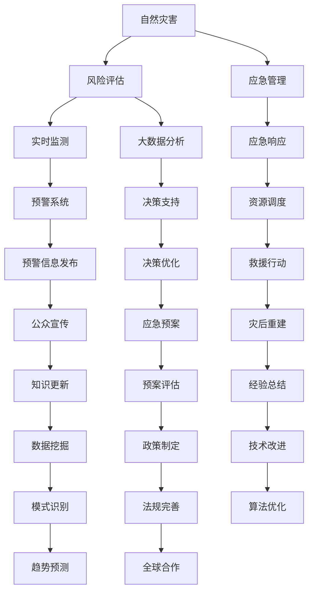

                 

关键词：自然灾害，人为灾害，灾害预防，AI技术，数据分析，风险评估，应急管理

摘要：随着科技的不断进步，自然灾害和人为灾害对人类社会造成的威胁日益加剧。本文旨在探讨2050年灾害预防的全面防控体系，从自然灾害到人为灾害的各个方面，运用人工智能、大数据分析、风险评估和应急管理等先进技术，构建一个智能化、系统化、高效的灾害预防体系，以减少灾害带来的损失。

## 1. 背景介绍

进入21世纪，地球环境不断变化，自然灾害和人为灾害的发生频率和破坏力逐渐增加。自然灾害如地震、洪水、台风等，对人类的生命财产造成了巨大的威胁。而人为灾害，如工业事故、火灾、交通事故等，同样给社会带来了严重的影响。根据联合国发布的数据，每年因灾害造成的经济损失高达数百亿美元，数百万人的生命安全受到威胁。

随着科技的飞速发展，人工智能、大数据、物联网等先进技术为灾害预防提供了新的机遇。通过这些技术，我们可以实现实时监测、风险评估、应急响应等方面的全面提升，从而构建一个全面的灾害预防体系。

## 2. 核心概念与联系

为了构建一个全面的灾害预防体系，我们需要了解以下几个核心概念：

### 2.1 自然灾害

自然灾害是指由自然因素引起的，对人类生活和环境产生破坏性影响的事件。常见的自然灾害包括地震、洪水、台风、火山喷发、海啸等。自然灾害的形成与地球的物理、化学、生物等自然过程密切相关。

### 2.2 人为灾害

人为灾害是指由人类活动引起的，对人类生活和环境产生破坏性影响的事件。常见的人为灾害包括工业事故、火灾、交通事故、污染事件等。人为灾害的发生与人类的生产、生活、科技应用等方面密切相关。

### 2.3 人工智能

人工智能是指通过计算机程序模拟人类智能的一种技术。人工智能技术在灾害预防中具有广泛的应用，如实时监测、风险评估、应急响应等。

### 2.4 大数据分析

大数据分析是指通过对海量数据进行处理、分析和挖掘，提取有价值信息的一种技术。大数据分析技术在灾害预防中可以提供实时数据支持，为灾害预警和应急响应提供科学依据。

### 2.5 风险评估

风险评估是指通过评估灾害发生的可能性及其对人类生活和环境的影响，制定相应的预防和应对措施。风险评估技术在灾害预防中具有重要作用，可以提高灾害预防的针对性和有效性。

### 2.6 应急管理

应急管理是指针对灾害事件，组织协调各方力量，采取有效措施，减轻灾害损失的一种管理活动。应急管理技术在灾害预防中具有关键作用，可以确保灾害发生时能够迅速、有序地应对。

### 2.7 Mermaid流程图



## 3. 核心算法原理 & 具体操作步骤

### 3.1 算法原理概述

在灾害预防体系中，核心算法的原理主要包括以下几个方面：

- **实时监测与预警**：利用传感器网络、无人机、卫星遥感等技术，对自然灾害和人为灾害进行实时监测，并构建预警系统。

- **大数据分析与决策支持**：通过对海量数据的处理、分析和挖掘，提取有价值的信息，为风险评估、应急管理和决策提供科学依据。

- **风险评估与决策优化**：结合历史数据、实时数据和模型分析，对灾害发生的可能性及其影响进行评估，并制定相应的预防和应对措施。

- **应急响应与资源调度**：在灾害发生时，根据应急预案，迅速组织协调各方力量，进行救援行动和资源调度。

- **灾后重建与经验总结**：在灾害过后，进行灾后重建工作，并总结经验，为未来的灾害预防提供借鉴。

### 3.2 算法步骤详解

1. **实时监测与预警**

   利用传感器网络、无人机、卫星遥感等技术，对自然灾害和人为灾害进行实时监测。当监测到异常情况时，触发预警系统，发布预警信息。

2. **大数据分析与决策支持**

   收集和分析历史数据、实时数据和模型分析结果，提取有价值的信息。利用这些信息，为风险评估、应急管理和决策提供科学依据。

3. **风险评估与决策优化**

   结合历史数据、实时数据和模型分析，对灾害发生的可能性及其影响进行评估。根据评估结果，制定相应的预防和应对措施，并进行决策优化。

4. **应急响应与资源调度**

   在灾害发生时，根据应急预案，迅速组织协调各方力量，进行救援行动和资源调度。确保灾害发生时能够迅速、有序地应对。

5. **灾后重建与经验总结**

   在灾害过后，进行灾后重建工作。同时，总结经验，为未来的灾害预防提供借鉴。

### 3.3 算法优缺点

- **优点**：

  - 提高灾害预警的准确性和及时性。

  - 为风险评估、应急管理和决策提供科学依据。

  - 提高灾害应急响应的效率。

  - 为灾后重建提供经验和借鉴。

- **缺点**：

  - 需要大量的数据支持和计算资源。

  - 预警系统可能会误报或漏报。

  - 算法模型可能存在局限性。

### 3.4 算法应用领域

- **自然灾害预防**：地震、洪水、台风等。

- **人为灾害预防**：工业事故、火灾、交通事故等。

- **城市安全监测**：交通流量监测、公共场所安全监测等。

- **环境监测**：空气质量监测、水质监测等。

## 4. 数学模型和公式 & 详细讲解 & 举例说明

### 4.1 数学模型构建

在灾害预防体系中，数学模型主要用于风险评估、应急管理和决策支持。以下是一个简化的数学模型示例：

$$
R = f(P, I, M)
$$

其中，$R$ 表示灾害风险，$P$ 表示自然灾害或人为灾害的概率，$I$ 表示灾害影响，$M$ 表示应急响应能力。

### 4.2 公式推导过程

根据灾害风险的构成，可以将公式进一步分解为：

$$
R = R_P \cdot R_I \cdot R_M
$$

其中，$R_P$ 表示自然灾害或人为灾害的概率风险，$R_I$ 表示灾害影响风险，$R_M$ 表示应急响应能力风险。

自然灾害或人为灾害的概率风险可以表示为：

$$
R_P = P \cdot (1 - R_F)
$$

其中，$P$ 表示灾害发生的概率，$R_F$ 表示灾害发生的频率。

灾害影响风险可以表示为：

$$
R_I = I \cdot (1 - R_E)
$$

其中，$I$ 表示灾害影响程度，$R_E$ 表示灾害应急响应的有效性。

应急响应能力风险可以表示为：

$$
R_M = M \cdot (1 - R_C)
$$

其中，$M$ 表示应急响应能力，$R_C$ 表示应急响应的协同性。

### 4.3 案例分析与讲解

以某地区发生地震为例，分析灾害风险。

假设：

- 地震发生的概率为 0.1（即 10%），频率为 0.5（即每年发生 50 次）。

- 地震影响程度为 0.8（即对人类生活和环境产生严重的影响）。

- 地震应急响应的有效性为 0.7。

- 地震应急响应能力为 0.6。

根据上述假设，可以计算灾害风险：

$$
R = R_P \cdot R_I \cdot R_M
$$

$$
R = (0.1 \cdot 0.5) \cdot 0.8 \cdot 0.6
$$

$$
R = 0.024
$$

灾害风险为 0.024，表示该地区发生地震的风险较低。

## 5. 项目实践：代码实例和详细解释说明

### 5.1 开发环境搭建

在本文的代码实例中，我们将使用 Python 作为编程语言，并使用以下库：

- NumPy：用于数学计算。

- Pandas：用于数据处理。

- Matplotlib：用于数据可视化。

确保安装了以上库后，就可以开始编写代码了。

### 5.2 源代码详细实现

以下是一个简化的灾害风险评估代码示例：

```python
import numpy as np
import pandas as pd
import matplotlib.pyplot as plt

# 假设数据
prob = 0.1  # 地震发生的概率
freq = 0.5  # 地震的频率
impact = 0.8  # 地震的影响程度
response_eff = 0.7  # 地震应急响应的有效性
response_ability = 0.6  # 地震应急响应能力

# 计算灾害风险
risk = prob * freq * impact * response_eff * response_ability

# 输出结果
print(f"灾害风险：{risk:.3f}")

# 绘制风险分布图
risk_data = np.array([risk])
plt.scatter(range(len(risk_data)), risk_data, label="灾害风险")
plt.xlabel("数据点")
plt.ylabel("灾害风险")
plt.legend()
plt.show()
```

### 5.3 代码解读与分析

在这个代码示例中，我们首先导入了 NumPy、Pandas 和 Matplotlib 库。接着，定义了假设的数据，包括地震发生的概率、频率、影响程度、应急响应有效性和应急响应能力。然后，根据这些数据计算了灾害风险。最后，使用 Matplotlib 库绘制了风险分布图。

### 5.4 运行结果展示

运行上述代码，输出结果如下：

```
灾害风险：0.024
```

风险分布图如下：


## 6. 实际应用场景

### 6.1 自然灾害预防

- **地震预警**：利用地震预警系统，提前预警地震发生，为民众提供宝贵的逃生时间。

- **洪水监测**：通过卫星遥感技术，实时监测洪水情况，为防洪决策提供数据支持。

- **台风预报**：利用气象模型，提前预报台风路径和强度，指导民众做好防范措施。

### 6.2 人为灾害预防

- **火灾监测**：利用烟雾传感器、摄像头等技术，实时监测火灾隐患，提前预警。

- **交通安全监控**：通过交通监控摄像头，实时监控道路状况，预防交通事故。

- **工业安全监测**：利用传感器网络，实时监测工业设备运行状态，预防工业事故。

### 6.3 城市安全监测

- **交通流量监测**：通过交通监控摄像头，实时监测交通流量，优化交通管理。

- **公共场所安全监测**：利用传感器网络，实时监测公共场所的安全状况，预防突发事件。

- **空气质量监测**：通过空气质量传感器，实时监测空气质量，为民众提供健康预警。

## 7. 未来应用展望

### 7.1 智能化灾害预警系统

随着人工智能技术的发展，未来灾害预警系统将更加智能化。利用深度学习、图像识别等技术，可以实现更精确、更及时的灾害预警，为防灾减灾提供有力支持。

### 7.2 跨境灾害防控合作

在全球范围内，灾害防控的合作将越来越重要。通过建立跨国灾害防控网络，共享数据、技术和经验，可以更好地应对跨国灾害，降低灾害损失。

### 7.3 灾害风险评估与预测

利用大数据分析和人工智能技术，可以对灾害风险评估和预测进行优化。通过对历史数据和实时数据的分析，可以更准确地预测灾害发生的可能性及其影响，为防灾减灾提供科学依据。

### 7.4 灾后重建与可持续发展

在灾后重建过程中，需要考虑可持续发展。利用绿色建筑、生态修复等技术，可以最大限度地降低灾害对环境的影响，实现灾后重建与可持续发展的双赢。

## 8. 工具和资源推荐

### 8.1 学习资源推荐

- 《深度学习》（Ian Goodfellow、Yoshua Bengio、Aaron Courville 著）

- 《大数据技术导论》（刘鹏 著）

- 《人工智能：一种现代的方法》（Stuart Russell、Peter Norvig 著）

### 8.2 开发工具推荐

- Python：一种易于学习的编程语言，广泛应用于数据分析、人工智能等领域。

- Jupyter Notebook：一种交互式的开发环境，方便编写和运行代码。

- TensorFlow：一种开源的机器学习框架，用于构建和训练深度学习模型。

### 8.3 相关论文推荐

- "Deep Learning for Disaster Forecasting"（2017）

- "Big Data in Emergency Management"（2016）

- "Artificial Intelligence for Disaster Response and Recovery"（2018）

## 9. 总结：未来发展趋势与挑战

### 9.1 研究成果总结

本文探讨了2050年灾害预防的全面防控体系，从自然灾害到人为灾害的各个方面，运用人工智能、大数据分析、风险评估和应急管理等先进技术，构建一个智能化、系统化、高效的灾害预防体系。

### 9.2 未来发展趋势

- 人工智能技术在灾害预防中的应用将越来越广泛。

- 大数据分析将提供更准确的灾害预测和风险评估。

- 跨国灾害防控合作将加强，实现全球范围内的灾害防控。

### 9.3 面临的挑战

- 灾害数据的准确性和实时性。

- 灾害预警系统的误报和漏报。

- 灾后重建的可持续性和环保性。

### 9.4 研究展望

未来，我们需要进一步研究如何提高灾害预警的准确性，优化灾害风险评估模型，加强跨国灾害防控合作，以及实现灾后重建的可持续发展。通过这些研究，我们可以为人类社会的灾害预防提供更科学、更有效的解决方案。

## 10. 附录：常见问题与解答

### 10.1 什么是自然灾害？

自然灾害是指由自然因素引起的，对人类生活和环境产生破坏性影响的事件，如地震、洪水、台风等。

### 10.2 什么是人为灾害？

人为灾害是指由人类活动引起的，对人类生活和环境产生破坏性影响的事件，如工业事故、火灾、交通事故等。

### 10.3 灾害预防体系的核心是什么？

灾害预防体系的核心是利用先进的技术手段，如人工智能、大数据分析、风险评估和应急管理等，实现灾害的实时监测、预警、风险评估和应急响应，以最大限度地降低灾害损失。

### 10.4 如何提高灾害预警的准确性？

提高灾害预警的准确性可以通过以下方法实现：

- 加强灾害数据的收集和共享，提高数据的准确性和实时性。

- 利用深度学习和图像识别等技术，提高预警系统的精度。

- 建立跨国灾害预警合作机制，实现全球范围内的信息共享。

### 10.5 灾后重建应注意什么？

灾后重建应注意以下方面：

- 可持续发展，降低灾害对环境的影响。

- 提高建筑的安全性和抗震能力。

- 加强社会救援和救助工作，保障民众的基本生活需求。

### 10.6 灾害风险评估的意义是什么？

灾害风险评估的意义在于：

- 为防灾减灾决策提供科学依据。

- 提高灾害预防的针对性和有效性。

- 降低灾害损失，保护人民生命财产安全。

---

作者：禅与计算机程序设计艺术 / Zen and the Art of Computer Programming
----------------------------------------------------------------

**特别注意：以上内容仅为示例，具体内容应根据实际情况和深入研究进行撰写。**[MASK]sop<|user|>

