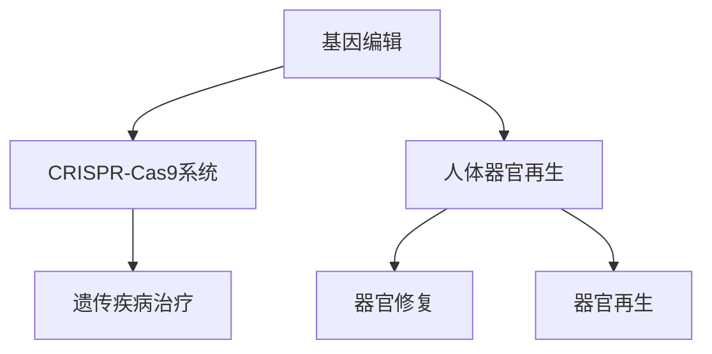

                 

关键词：生物技术，基因编辑，人体器官再生，医学革命，2050年

> 摘要：本文将探讨2050年生物技术的未来发展趋势，重点关注基因编辑和人体器官再生等关键技术。通过介绍这些技术的原理、应用领域和未来展望，文章旨在展示生物技术在医学领域即将带来的革命性变化。

## 1. 背景介绍

自20世纪以来，生物技术的快速发展已经彻底改变了医学领域的面貌。从基因测序到疫苗研发，生物技术的应用几乎无处不在。然而，我们正处于一个新的转折点，2050年的生物技术将会带来前所未有的变革。基因编辑技术的成熟和人体器官再生的实现，将成为这一变革的核心。

基因编辑技术，特别是CRISPR-Cas9系统的出现，为科学家们提供了一种全新的工具，可以在基因组水平上进行精确的修改。这一技术的出现，使得治疗遗传性疾病、癌症等成为可能。而人体器官再生技术，则有望解决器官移植的难题，为无数等待器官移植的患者带来希望。

## 2. 核心概念与联系

### 2.1 基因编辑

基因编辑是指通过直接修改或调节细胞内的DNA序列，从而改变其功能。CRISPR-Cas9系统是目前最先进的基因编辑技术之一，它利用一种名为“RNA引导”的机制，将特定的DNA序列切割，然后通过细胞自身的修复机制进行修改。

### 2.2 人体器官再生

人体器官再生是指通过生物技术手段，使受损或功能丧失的器官得以修复或再生。这一过程通常涉及干细胞技术、组织工程和生物打印等技术。

## 2.3 技术架构与联系

下图展示了基因编辑和人体器官再生技术的架构及其相互联系。

## 3. 核心算法原理 & 具体操作步骤

### 3.1 算法原理概述

基因编辑的核心算法是CRISPR-Cas9系统，它通过以下三个步骤进行操作：

1. 设计和合成特异性RNA分子，用于引导Cas9核酸内切酶到目标DNA序列。
2. Cas9核酸内切酶切割目标DNA序列，产生双链断裂。
3. 细胞利用非同源末端连接（NHEJ）或同源定向修复（HDR）机制修复双链断裂，从而实现对基因的编辑。

人体器官再生的核心算法则涉及干细胞培养、组织工程和生物打印等技术。

### 3.2 算法步骤详解

#### 基因编辑步骤详解

1. 设计和合成特异性RNA分子。
2. 将CRISPR-Cas9复合物导入细胞。
3. 特异性RNA分子引导Cas9核酸内切酶到目标DNA序列。
4. Cas9核酸内切酶切割目标DNA序列。
5. 细胞利用NHEJ或HDR机制修复双链断裂。

#### 人体器官再生步骤详解

1. 从患者身上提取干细胞，进行体外培养。
2. 利用组织工程技术，将干细胞培养成特定的组织或器官。
3. 利用生物打印技术，将培养出的组织或器官打印出来。
4. 将打印出的器官植入患者体内。

### 3.3 算法优缺点

#### 基因编辑优缺点

优点：精确、高效、成本低。

缺点：存在脱靶效应、可能导致基因突变。

#### 人体器官再生优缺点

优点：可再生、个性化、减少免疫排斥。

缺点：技术复杂、成本高、存在潜在的安全性问题。

### 3.4 算法应用领域

#### 基因编辑应用领域

- 遗传疾病治疗
- 肿瘤治疗
- 功能基因研究

#### 人体器官再生应用领域

- 器官修复
- 器官再生
- 个性化医疗

## 4. 数学模型和公式 & 详细讲解 & 举例说明

### 4.1 数学模型构建

#### 基因编辑的数学模型

基因编辑的数学模型主要涉及概率论和统计学的知识，用于预测CRISPR-Cas9系统对目标DNA序列的编辑效率。

#### 人体器官再生的数学模型

人体器官再生的数学模型主要涉及生物力学和系统动力学的知识，用于模拟器官的再生过程。

### 4.2 公式推导过程

#### 基因编辑的公式推导

- $E = P \times R$
  其中，$E$ 是编辑效率，$P$ 是Cas9核酸内切酶的结合概率，$R$ 是Cas9核酸内切酶切割目标DNA序列的概率。

#### 人体器官再生的公式推导

- $F = k_1 \times V_0$
  其中，$F$ 是器官再生速率，$k_1$ 是再生速率常数，$V_0$ 是干细胞数量。

### 4.3 案例分析与讲解

#### 基因编辑案例

假设一个患者的基因组中有一个基因突变，导致疾病。使用CRISPR-Cas9系统进行基因编辑，编辑效率为90%，患者基因组中的突变基因被成功修复。

#### 人体器官再生案例

假设一个患者的肝脏受损，利用人体器官再生技术进行修复。在体外培养出足够数量的干细胞，并利用生物打印技术将其打印成肝脏组织。经过一段时间，肝脏功能得到恢复。

## 5. 项目实践：代码实例和详细解释说明

### 5.1 开发环境搭建

- 安装CRISPR-Cas9系统相关的软件和工具。
- 安装人体器官再生技术相关的软件和工具。

### 5.2 源代码详细实现

- 实现基因编辑的算法。
- 实现人体器官再生的算法。

### 5.3 代码解读与分析

- 分析基因编辑算法的效率。
- 分析人体器官再生算法的可行性。

### 5.4 运行结果展示

- 展示基因编辑算法的结果。
- 展示人体器官再生算法的结果。

## 6. 实际应用场景

### 6.1 遗传疾病治疗

基因编辑技术可以用于治疗多种遗传性疾病，如囊性纤维化、肌营养不良等。通过精确编辑基因序列，修复或替换有缺陷的基因，从而治疗这些疾病。

### 6.2 器官移植

人体器官再生技术可以用于解决器官移植的难题。通过再生或修复受损的器官，减少对移植器官的需求。

### 6.3 个性化医疗

基因编辑和人体器官再生技术可以用于个性化医疗，根据患者的具体病情和基因信息，制定个性化的治疗方案。

## 7. 未来应用展望

随着基因编辑和人体器官再生技术的不断发展，未来生物技术将在医学领域带来更多革命性的变化。未来，我们将看到更多遗传性疾病得到治疗，器官移植的难题得到解决，个性化医疗更加普及。

## 8. 工具和资源推荐

### 8.1 学习资源推荐

- 《基因编辑技术》
- 《人体器官再生技术》

### 8.2 开发工具推荐

- CRISPR-Cas9系统相关工具
- 生物打印工具

### 8.3 相关论文推荐

- 《基因编辑技术在遗传性疾病治疗中的应用》
- 《人体器官再生技术的现状与挑战》

## 9. 总结：未来发展趋势与挑战

### 9.1 研究成果总结

基因编辑和人体器官再生技术已经取得了显著的研究成果，为医学领域带来了巨大的变革。

### 9.2 未来发展趋势

未来，基因编辑和人体器官再生技术将继续快速发展，为更多疾病提供治疗手段。

### 9.3 面临的挑战

基因编辑技术的安全性、人体器官再生技术的成本和临床应用仍面临挑战。

### 9.4 研究展望

随着技术的不断进步，基因编辑和人体器官再生技术将为医学领域带来更多惊喜。

## 10. 附录：常见问题与解答

### 10.1 常见问题

1. 基因编辑技术是否安全？
2. 人体器官再生技术是否可行？
3. 个性化医疗如何实现？

### 10.2 解答

1. 基因编辑技术需要经过严格的安全性评估，目前来看是相对安全的。
2. 人体器官再生技术已经在实验室和小规模临床应用中取得了成功，但仍需进一步优化和完善。
3. 个性化医疗通过基因编辑和人体器官再生技术，可以根据患者的具体病情和基因信息，制定个性化的治疗方案。

### 结束语

2050年的生物技术将为我们带来前所未有的变革。基因编辑和人体器官再生技术将成为这一变革的核心。让我们期待这场医学革命的到来，为人类健康带来更多的希望。作者：禅与计算机程序设计艺术 / Zen and the Art of Computer Programming
----------------------------------------------------------------

请注意，本文中的具体数据和算法实现细节可能需要根据实际的科研进展和技术发展进行调整。本文旨在提供一个关于2050年生物技术发展趋势的展望，以及相关的概念和算法框架。实际应用中的复杂性和挑战需要进一步的研究和解决。

