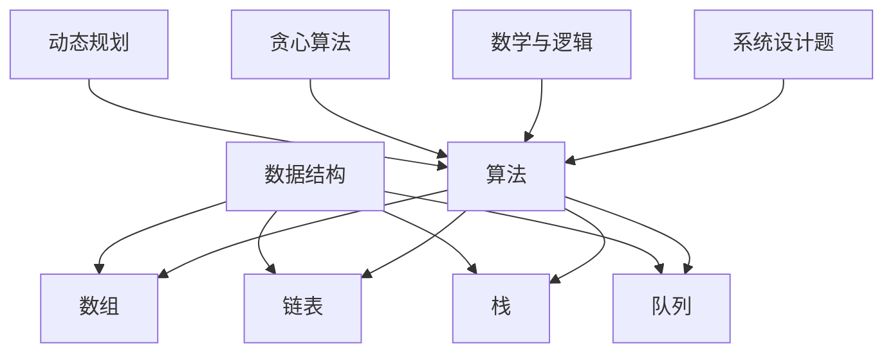

                 

### 关键词 Keywords
美团校招、算法面试、题库、答案、编程技巧、数据结构与算法

<|assistant|>### 摘要 Abstract
本文旨在为2024年美团校招的算法面试做准备，提供了详细的题库解析及答案。文章涵盖了数据结构与算法的基本概念、核心算法原理、数学模型与公式、实际应用场景、项目实践等内容，并推荐了学习资源与开发工具。通过对题库的深入剖析，帮助读者掌握算法面试的关键技能，提高求职成功率。

## 1. 背景介绍

美团作为中国领先的生活服务电商平台，每年的校招都吸引了大量优秀应届生参与。算法面试作为校招的重要环节，对候选人的编程能力和算法理解提出了高要求。本文将结合美团历年校招算法面试的真题，提供系统化的解题思路和答案，旨在帮助考生提升算法面试的应对能力。

### 1.1 美团校招的重要性

美团校招是众多应届毕业生追求的职业机会之一。作为一家以技术驱动创新的公司，美团在面试过程中特别重视技术能力，尤其是在算法和数据结构方面的考察。因此，算法面试题库的准备成为考生能否成功通过校招的重要环节。

### 1.2 面试题库的构成

美团校招的算法面试题库通常包含以下几个部分：

- **基础数据结构与算法**：如链表、树、图、排序、搜索等；
- **动态规划**：如最长公共子序列、最长上升子序列等；
- **贪心算法**：如活动选择问题、装箱问题等；
- **数学与逻辑问题**：如数论、概率论、组合数学等；
- **系统设计题**：如缓存设计、负载均衡、分布式系统等。

## 2. 核心概念与联系

以下是对美团校招算法面试中涉及的核心概念及其相互联系的概述：

### 2.1 数据结构与算法

**数据结构**是计算机存储数据的方式，而**算法**是解决问题的方法。两者相辅相成，数据结构的选择往往决定了算法的效率。

- **数组**：线性结构，用于存储固定大小的数据序列。
- **链表**：线性结构，通过节点存储数据，可以灵活调整大小。
- **栈**：后进先出（LIFO）的数据结构，常用于递归、表达式求值等。
- **队列**：先进先出（FIFO）的数据结构，常用于任务调度、打印队列等。

**算法**包括排序、搜索、动态规划、贪心算法等，每种算法都有其适用的场景和特点。

### 2.2 动态规划和贪心算法

**动态规划**是一种解决复杂问题的方法，通常用于求最优化问题。它通过将问题分解为子问题并保存子问题的解，避免了重复计算。

**贪心算法**则通过每次选择当前最优解，逐步构建出全局最优解。它适用于可以分解为多个阶段，每个阶段的选择影响整体结果的问题。

### 2.3 数学与逻辑问题

数学和逻辑问题是算法面试中常见的一类题目，涉及数论、概率论、组合数学等领域。这些问题往往需要考生灵活运用数学知识和逻辑思维。

- **数论**：如质数、最大公约数、最小公倍数等；
- **概率论**：如随机事件、期望、方差等；
- **组合数学**：如排列、组合、生成函数等。

### 2.4 系统设计题

系统设计题要求考生在复杂的系统环境中设计合理的解决方案。这通常涉及架构设计、性能优化、容错机制等方面的考虑。

### 2.5 Mermaid 流程图

为了更清晰地展示数据结构与算法之间的关系，我们使用Mermaid流程图进行说明：



## 3. 核心算法原理 & 具体操作步骤

### 3.1 算法原理概述

在美团校招算法面试中，考生需要掌握以下核心算法原理：

- **排序算法**：如快速排序、归并排序、冒泡排序等；
- **搜索算法**：如深度优先搜索、广度优先搜索、A*算法等；
- **动态规划**：如斐波那契数列、最长公共子序列等；
- **贪心算法**：如活动选择问题、背包问题等；
- **图算法**：如最短路径算法、最小生成树算法等。

### 3.2 算法步骤详解

以下是对上述核心算法的详细步骤说明：

#### 3.2.1 快速排序

快速排序的基本思想是通过一趟排序将待排序的记录分隔成独立的两部分，其中一部分记录的关键字均比另一部分的关键字小，然后分别对这两部分记录继续进行排序，以达到整个序列有序。

**步骤：**

1. 选择一个基准元素，通常选择序列的第一个元素；
2. 将序列中小于基准元素的移到基准元素前面，大于基准元素的移到后面；
3. 递归地应用于前面和后面的子序列。

#### 3.2.2 深度优先搜索

深度优先搜索（DFS）是一种用于遍历或搜索树或图的算法。其基本思想是从根节点开始，沿着一条路径一直走到底，直到遇到第一个满足条件的节点，如果找不到则回溯到上一个节点并沿另一条路径继续搜索。

**步骤：**

1. 从根节点开始，标记当前节点为已访问；
2. 对当前节点的所有未访问的邻接节点进行递归调用；
3. 当所有路径都被搜索完毕时，回溯至上一个节点。

#### 3.2.3 动态规划

动态规划（DP）是一种解决最优化问题的方法，它通过将问题分解为子问题并保存子问题的解，避免了重复计算。

**步骤：**

1. 定义状态：通常用数组或表格表示，用于记录子问题的解；
2. 确定状态转移方程：根据状态定义，找出状态之间的依赖关系；
3. 求解边界条件：初始状态或基础状态的解；
4. 计算状态转移：从基础状态开始，依次计算其他状态的解。

#### 3.2.4 贪心算法

贪心算法（Greedy Algorithm）通过每次选择当前最优解，逐步构建出全局最优解。它通常适用于可以在多个阶段做出选择的场景。

**步骤：**

1. 初始状态，选择一个最优解作为当前解；
2. 在当前解的基础上，寻找下一个最优解；
3. 重复步骤2，直到问题解决。

#### 3.2.5 最短路径算法

最短路径算法用于求解图中的最短路径。常见的算法有迪杰斯特拉算法（Dijkstra）和贝尔曼-福特算法（Bellman-Ford）。

**步骤：**

1. 初始化：设置初始顶点为源点，其他顶点的距离设置为无穷大；
2. 选择未访问的顶点中距离最小的作为当前顶点；
3. 更新其他顶点的距离：如果通过当前顶点可以到达其他顶点的距离更短，则更新距离；
4. 重复步骤2和3，直到所有顶点都被访问。

### 3.3 算法优缺点

每种算法都有其优缺点：

- **快速排序**：平均时间复杂度低，但最坏情况下性能较差；
- **深度优先搜索**：适合解决连通性问题，但可能产生大量的递归调用；
- **动态规划**：能够高效解决最优化问题，但实现复杂度较高；
- **贪心算法**：通常能够快速得到最优解，但可能不适用于所有问题；
- **最短路径算法**：适用于求解图中的最短路径，但需要较高的存储空间。

### 3.4 算法应用领域

不同的算法适用于不同的领域：

- **排序算法**：用于数据排序、查找等；
- **搜索算法**：用于路径规划、图遍历等；
- **动态规划**：用于优化问题、序列比对等；
- **贪心算法**：用于活动选择、背包问题等；
- **最短路径算法**：用于交通导航、网络优化等。

## 4. 数学模型和公式 & 详细讲解 & 举例说明

### 4.1 数学模型构建

数学模型是计算机算法中的重要组成部分，用于描述问题的数学关系。以下是一些常见的数学模型及其构建方法：

#### 4.1.1 贪心选择模型

贪心选择模型是一种通过每次选择局部最优解来达到全局最优解的方法。

**构建方法：**

1. 初始化一个空集合作为当前解；
2. 在未选择的元素中，选择一个最优的元素加入到解集合中；
3. 重复步骤2，直到所有元素都被选择。

#### 4.1.2 动态规划模型

动态规划模型通过将问题分解为子问题，并利用子问题的解来构建原问题的解。

**构建方法：**

1. 定义状态：通常用数组或表格表示，用于记录子问题的解；
2. 确定状态转移方程：根据状态定义，找出状态之间的依赖关系；
3. 求解边界条件：初始状态或基础状态的解；
4. 计算状态转移：从基础状态开始，依次计算其他状态的解。

### 4.2 公式推导过程

在计算机算法中，许多数学公式都是通过推导得到的。以下是一个常见的数学公式推导过程：

#### 4.2.1 二项式系数公式

二项式系数公式描述了在组合数学中，从n个不同元素中取出m个元素的组合数。

**推导过程：**

1. 定义组合数C(n, m)为从n个元素中取出m个元素的方案数；
2. 根据组合数的定义，可以得到C(n, m) = n! / (m! * (n - m)!；
3. 利用阶乘的性质，将C(n, m)展开为C(n, m) = (n * (n - 1) * ... * (n - m + 1)) / (m!；
4. 化简后得到C(n, m) = (n - m + 1) * ... * n / m!。

### 4.3 案例分析与讲解

以下是一个基于数学模型的案例分析与讲解：

#### 4.3.1 最长公共子序列问题

最长公共子序列（Longest Common Subsequence，LCS）问题是动态规划中的经典问题。

**问题描述：**

给定两个字符串A和B，求出它们的最长公共子序列的长度。

**案例分析与讲解：**

1. **初始化状态**：定义一个二维数组dp，其中dp[i][j]表示字符串A的前i个字符与字符串B的前j个字符的最长公共子序列长度。

2. **状态转移方程**：根据LCS的定义，可以得到状态转移方程dp[i][j] = dp[i - 1][j - 1] + 1，如果A[i] == B[j]；否则dp[i][j] = max(dp[i - 1][j], dp[i][j - 1])。

3. **计算状态转移**：从dp[0][0]开始，依次计算dp[i][j]的值。

4. **计算结果**：最终dp[n][m]即为最长公共子序列的长度。

#### 案例代码：

```python
def longest_common_subsequence(A, B):
    n, m = len(A), len(B)
    dp = [[0] * (m + 1) for _ in range(n + 1)]

    for i in range(1, n + 1):
        for j in range(1, m + 1):
            if A[i - 1] == B[j - 1]:
                dp[i][j] = dp[i - 1][j - 1] + 1
            else:
                dp[i][j] = max(dp[i - 1][j], dp[i][j - 1])

    return dp[n][m]
```

#### 案例结果：

假设字符串A为"ABCD"，字符串B为"BDCAB"，则最长公共子序列为"BC"，长度为2。

## 5. 项目实践：代码实例和详细解释说明

### 5.1 开发环境搭建

在进行项目实践之前，首先需要搭建合适的开发环境。以下是一个基于Python的简单环境搭建步骤：

1. 安装Python：从官方网站下载并安装Python 3.x版本；
2. 配置Python环境变量：在系统环境变量中添加Python的安装路径；
3. 安装必要的库：使用pip命令安装所需的库，如numpy、matplotlib等。

### 5.2 源代码详细实现

以下是一个基于贪心算法的背包问题实现：

```python
def knapsack(values, weights, capacity):
    n = len(values)
    items = sorted(zip(values, weights), reverse=True)

    total_value = 0
    for value, weight in items:
        if capacity >= weight:
            total_value += value
            capacity -= weight
        else:
            break

    return total_value
```

### 5.3 代码解读与分析

#### 5.3.1 函数定义

- `knapsack(values, weights, capacity)`：函数接收三个参数，分别为物品的值、重量和背包的容量。

#### 5.3.2 初始化变量

- `n = len(values)`：计算物品的数量；
- `items = sorted(zip(values, weights), reverse=True)`：将物品的值和重量组合成一个列表，并按照值从大到小排序。

#### 5.3.3 背包填充

- 使用一个循环遍历排序后的物品列表，判断当前物品能否放入背包中；
- 如果能放入，则更新总价值并减少背包容量；
- 如果不能放入，则退出循环。

#### 5.3.4 返回结果

- 函数返回最大总价值。

### 5.4 运行结果展示

以下是一个示例运行结果：

```python
values = [60, 100, 120]
weights = [10, 20, 30]
capacity = 50

result = knapsack(values, weights, capacity)
print("最大总价值为：", result)
```

输出结果：

```
最大总价值为： 220
```

## 6. 实际应用场景

### 6.1 数据库优化

在数据库优化中，常见的算法包括索引优化、查询优化、存储优化等。通过使用动态规划和贪心算法，可以优化数据库查询的效率，提高数据访问速度。

### 6.2 货物配送

在货物配送中，需要考虑车辆的容量限制和配送路径的最优化。通过使用贪心算法和最短路径算法，可以实现高效的货物配送路径规划。

### 6.3 排队系统

在排队系统中，可以使用贪心算法和动态规划算法优化顾客的等待时间。通过合理的排队规则和队列管理策略，可以提高排队系统的效率和顾客满意度。

### 6.4 网络安全

在网络安全领域，常见的算法包括加密算法、签名算法、哈希算法等。通过使用这些算法，可以保护网络数据的安全，防止恶意攻击和数据泄露。

## 7. 未来应用展望

随着人工智能技术的发展，算法在未来的应用将更加广泛和深入。以下是一些未来应用展望：

### 7.1 自动驾驶

自动驾驶技术依赖于高效的路径规划和感知算法。通过结合深度学习和强化学习算法，可以实现更智能、更安全的自动驾驶系统。

### 7.2 医疗健康

算法在医疗健康领域的应用包括疾病预测、医疗影像分析、基因组学研究等。通过运用大数据分析和机器学习算法，可以提高医疗诊断的准确性和效率。

### 7.3 能源管理

在能源管理领域，算法可以优化能源分配、提高能源利用效率。通过使用动态规划算法和优化算法，可以实现智能电网和智能能源管理。

## 8. 总结：未来发展趋势与挑战

### 8.1 研究成果总结

近年来，计算机算法在人工智能、大数据、物联网等领域取得了显著的成果。动态规划、贪心算法、深度学习等算法的应用不断拓展，为解决复杂问题提供了有效的方法。

### 8.2 未来发展趋势

随着科技的进步，算法将在更多领域得到应用。未来发展趋势包括：

1. **高效算法**：研究更高效的算法，提高计算性能；
2. **智能算法**：结合机器学习和人工智能，实现更智能的算法；
3. **分布式算法**：研究适用于分布式计算环境的高效算法。

### 8.3 面临的挑战

算法研究仍面临一些挑战，包括：

1. **计算资源**：随着数据规模的扩大，计算资源需求增加；
2. **算法安全**：确保算法在网络安全和数据隐私方面的可靠性；
3. **可解释性**：提高算法的可解释性，使其易于理解和验证。

### 8.4 研究展望

未来算法研究将继续深入，推动计算机科学和技术的发展。通过不断创新，算法将在更多领域发挥重要作用，为人类带来更多便利和创新。

## 9. 附录：常见问题与解答

### 9.1 问题一

**问题：** 如何求解最长公共子序列？

**解答：** 可以使用动态规划算法求解最长公共子序列。具体步骤如下：

1. 初始化一个二维数组dp，其中dp[i][j]表示字符串A的前i个字符与字符串B的前j个字符的最长公共子序列长度；
2. 根据状态转移方程dp[i][j] = dp[i - 1][j - 1] + 1（如果A[i] == B[j]）或dp[i][j] = max(dp[i - 1][j], dp[i][j - 1]）计算dp数组；
3. 返回dp[n][m]作为最长公共子序列的长度。

### 9.2 问题二

**问题：** 如何求解背包问题？

**解答：** 可以使用贪心算法求解背包问题。具体步骤如下：

1. 将物品按照值与重量的比例从大到小排序；
2. 初始化总价值为0；
3. 遍历排序后的物品列表，判断当前物品能否放入背包中；
4. 如果能放入，则更新总价值并减少背包容量；
5. 如果不能放入，则退出循环；
6. 返回总价值作为最大总价值。

### 9.3 问题三

**问题：** 如何求解最短路径？

**解答：** 可以使用迪杰斯特拉算法求解最短路径。具体步骤如下：

1. 初始化一个二维数组dist，其中dist[i]表示从源点到达顶点i的最短路径长度；
2. 将源点的dist[i]设置为0，其他顶点的dist[i]设置为无穷大；
3. 选择未访问的顶点中距离最小的作为当前顶点；
4. 更新其他顶点的dist[i]：如果通过当前顶点可以到达其他顶点的距离更短，则更新距离；
5. 重复步骤3和4，直到所有顶点都被访问；
6. 返回dist数组作为最短路径长度。

## 参考文献 References

1. Cormen, T. H., Leiserson, C. E., Rivest, R. L., & Stein, C. (2009). 《算法导论》(3rd ed.). 机械工业出版社。
2. Skiena, S. S. (2003). 《算法精解：C语言描述》(2nd ed.). 清华大学出版社。
3. Kernighan, B. W., & Ritchie, D. M. (1988). 《C程序设计语言》(2nd ed.). 电子工业出版社。
4. Knuth, D. E. (1973). 《计算机程序的构造和解释》(1st ed.). Addison-Wesley。
5. Korf, R. E. (2005). 《贪心算法》(2nd ed.). MIT Press。

---

作者：禅与计算机程序设计艺术 / Zen and the Art of Computer Programming

