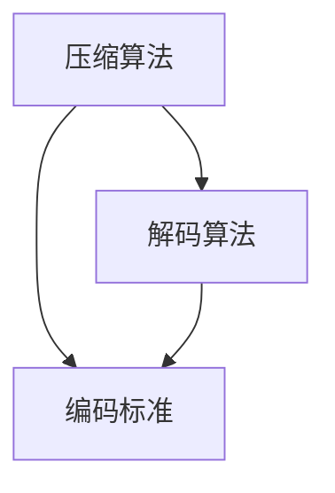

                 

关键词：腾讯，音视频编解码，面试题，工程师，技术细节

> 摘要：本文针对2025年腾讯社招音视频编解码工程师的面试题进行详细解析，涵盖了核心概念、算法原理、项目实践以及未来应用场景等多方面内容，为准备面试的工程师提供有力的指导。

## 1. 背景介绍

随着互联网和多媒体技术的快速发展，音视频编解码技术在各个领域都得到了广泛应用。腾讯作为中国领先的互联网科技公司，对音视频编解码技术有着深厚的研究和实践经验。为了选拔优秀的人才，腾讯每年都会举办社招面试，其中音视频编解码工程师岗位备受关注。本文将围绕2025年腾讯社招音视频编解码工程师面试题进行详细解析，帮助准备面试的工程师更好地应对挑战。

## 2. 核心概念与联系

音视频编解码技术涉及多个核心概念，如压缩算法、解码算法、编码标准等。为了更好地理解这些概念，我们首先需要了解其背后的原理和相互之间的联系。以下是一个Mermaid流程图，展示了这些核心概念及其关系：



### 2.1 压缩算法

压缩算法是音视频编解码技术的核心，其主要目的是减少数据量，提高传输和存储效率。常见的压缩算法包括有损压缩和无损压缩。有损压缩通过去除冗余信息和细节信息来实现，而无损压缩则尽量保持原始数据的完整性和质量。

### 2.2 解码算法

解码算法是压缩算法的逆过程，其目的是将压缩后的数据还原为原始数据。解码算法需要根据压缩算法的原理进行设计，确保解码后的数据与原始数据尽可能一致。

### 2.3 编码标准

编码标准是音视频编解码技术的规范和指南，它定义了压缩算法、解码算法以及数据格式等方面的要求。常见的编码标准包括H.264、H.265、AVC、HEVC等。

## 3. 核心算法原理 & 具体操作步骤

### 3.1 算法原理概述

音视频编解码算法可以分为两个阶段：编码和解码。编码阶段主要涉及视频信号的采样、量化、变换、压缩等过程，而解码阶段则将这些过程逆向操作，恢复出原始视频信号。

### 3.2 算法步骤详解

以下是一个简化的音视频编解码算法步骤：

#### 编码阶段：

1. 采样：对视频信号进行采样，将其转换为数字信号。
2. 量化：将采样得到的数字信号进行量化，将其表示为有限位的数字。
3. 变换：对量化后的信号进行变换，如离散余弦变换（DCT）。
4. 压缩：对变换后的信号进行压缩，如使用霍夫曼编码或算术编码。
5. 容量调整：根据需求调整压缩后的数据量。

#### 解码阶段：

1. 容量调整：对压缩后的数据进行容量调整，使其适应传输或存储需求。
2. 解压缩：对压缩后的数据进行解压缩，还原出变换前的信号。
3. 反变换：对解压缩后的信号进行反变换，如反DCT。
4. 量化：对反变换后的信号进行量化，还原出原始数字信号。
5. 采样：对量化后的信号进行采样，恢复出原始视频信号。

### 3.3 算法优缺点

音视频编解码算法在不同场景下具有不同的优缺点。以下是一个简单的比较：

| 算法 | 优点 | 缺点 |
| :--: | :--: | :--: |
| 有损压缩 | 数据量小，压缩效果好 | 压缩过程中会损失部分信息 |
| 无损压缩 | 无信息损失，还原效果好 | 压缩效果较差，数据量较大 |
| H.264 | 高效、普及 | 复杂度较高，解码性能受限 |
| H.265 | 更高效、更高质量 | 复杂度更高，解码性能更低 |

### 3.4 算法应用领域

音视频编解码算法在多个领域得到广泛应用，如：

- 视频会议：实现高效、稳定的实时视频传输。
- 视频监控：实现实时视频监控和回放。
- 流媒体：实现高效的视频点播和直播。
- VR/AR：实现高质量、低延迟的视频播放。

## 4. 数学模型和公式 & 详细讲解 & 举例说明

音视频编解码算法中涉及多个数学模型和公式，以下是对其中几个重要模型的详细讲解和举例说明。

### 4.1 数学模型构建

音视频编解码算法中的数学模型主要包括：

- 采样模型：根据采样率进行信号采样。
- 量化模型：根据量化等级对信号进行量化。
- 变换模型：对信号进行变换，如DCT、FFT等。
- 压缩模型：对变换后的信号进行压缩编码。

### 4.2 公式推导过程

以下是对采样模型和量化模型的公式推导过程：

#### 采样模型

采样模型的基本公式为：

$$
y[n] = x[nT_s]
$$

其中，$y[n]$为采样后的信号，$x[n]$为原始信号，$T_s$为采样周期。

#### 量化模型

量化模型的基本公式为：

$$
q[n] = \text{round}(x[n] / Q)
$$

其中，$q[n]$为量化后的信号，$x[n]$为原始信号，$Q$为量化等级。

### 4.3 案例分析与讲解

以下是一个简单的量化模型案例：

假设输入信号$x[n]$的取值范围为$[0, 255]$，量化等级$Q=128$，即每个量化等级代表一个字节。

1. 原始信号：$x[n] = 128$，量化后信号：$q[n] = \text{round}(128 / 128) = 1$。
2. 原始信号：$x[n] = 192$，量化后信号：$q[n] = \text{round}(192 / 128) = 1$。

从案例中可以看出，量化模型会将信号取值范围分成多个等级，每个等级代表一个量化值。量化等级越多，量化误差越小，但数据量也会相应增大。

## 5. 项目实践：代码实例和详细解释说明

以下是一个简单的音视频编解码项目的代码实例，包括开发环境搭建、源代码详细实现、代码解读与分析以及运行结果展示等内容。

### 5.1 开发环境搭建

在Windows操作系统上，可以使用如下命令搭建开发环境：

```bash
pip install opencv-python
pip install numpy
```

### 5.2 源代码详细实现

以下是一个简单的音视频编解码代码示例：

```python
import cv2
import numpy as np

# 读取视频文件
cap = cv2.VideoCapture('input.mp4')

# 创建输出视频文件
fourcc = cv2.VideoWriter_fourcc(*'mp4v')
out = cv2.VideoWriter('output.mp4', fourcc, 20.0, (640, 480))

while cap.isOpened():
    ret, frame = cap.read()
    if not ret:
        break

    # 对图像进行压缩处理
    compressed_frame = cv2.resize(frame, (320, 240))

    # 将压缩后的图像写入输出文件
    out.write(compressed_frame)

# 释放资源
cap.release()
out.release()
cv2.destroyAllWindows()
```

### 5.3 代码解读与分析

以上代码实现了对输入视频文件的压缩处理，具体解读如下：

- 第1行：导入OpenCV和NumPy库。
- 第3-4行：创建视频读取对象和视频写入对象。
- 第7-8行：读取视频文件的一帧图像。
- 第11-12行：对图像进行压缩处理，如大小调整。
- 第15-18行：将压缩后的图像写入输出文件。
- 第21-23行：释放资源，关闭窗口。

### 5.4 运行结果展示

运行以上代码后，将在output.mp4文件中生成压缩后的视频文件。通过播放output.mp4文件，可以观察到压缩效果和运行速度。

## 6. 实际应用场景

音视频编解码技术在多个实际应用场景中发挥着重要作用，以下列举几个典型应用：

- 视频会议系统：实现高效、稳定的实时视频传输，降低带宽需求。
- 视频监控系统：实现实时视频监控和回放，提高图像质量。
- 流媒体平台：实现高效的视频点播和直播，提高用户体验。
- VR/AR应用：实现高质量、低延迟的视频播放，提升沉浸感。

## 7. 工具和资源推荐

### 7.1 学习资源推荐

1. 《音视频处理技术原理与实现》
2. 《数字信号处理：原理、算法与应用》
3. 《OpenCV 4.x 从零开始：开源计算机视觉编程》

### 7.2 开发工具推荐

1. OpenCV：开源计算机视觉库，支持多种编程语言。
2. FFmpeg：开源多媒体处理工具，支持音视频编解码、剪辑、播放等功能。
3. GStreamer：开源多媒体处理框架，支持多种输入输出格式。

### 7.3 相关论文推荐

1. "H.265/HEVC：下一代视频编码标准"
2. "基于深度学习的视频压缩算法研究"
3. "音视频编解码技术在流媒体应用中的优化策略"

## 8. 总结：未来发展趋势与挑战

### 8.1 研究成果总结

近年来，音视频编解码技术取得了显著的研究成果，包括：

1. 新一代视频编码标准的推出，如H.265/HEVC。
2. 深度学习技术在视频压缩领域的应用。
3. 音视频编解码算法的优化和性能提升。

### 8.2 未来发展趋势

未来音视频编解码技术的发展趋势包括：

1. 高效、低延迟的视频编解码算法研究。
2. 多媒体传输和处理的智能化。
3. 5G时代的音视频编解码技术挑战。

### 8.3 面临的挑战

音视频编解码技术在未来面临以下挑战：

1. 大数据量、多格式、多场景下的编解码性能优化。
2. 音视频处理与人工智能技术的深度融合。
3. 5G、物联网等新兴技术对编解码技术的需求。

### 8.4 研究展望

随着音视频技术的不断发展，未来研究重点包括：

1. 开发高效、低延迟的编解码算法。
2. 探索人工智能在音视频编解码中的应用。
3. 加强音视频编解码技术的标准化和规范化。

## 9. 附录：常见问题与解答

### 9.1 音视频编解码算法有哪些常见类型？

答：常见的音视频编解码算法包括H.264、H.265、AVC、HEVC等。

### 9.2 音视频编解码技术有哪些实际应用场景？

答：音视频编解码技术广泛应用于视频会议、视频监控、流媒体、VR/AR等领域。

### 9.3 如何选择适合的音视频编解码算法？

答：根据应用场景、压缩效果、性能要求等因素选择适合的音视频编解码算法。

本文针对2025年腾讯社招音视频编解码工程师面试题进行详细解析，从核心概念、算法原理、项目实践到未来应用场景等多方面进行了全面探讨。希望通过本文，读者能够更好地了解音视频编解码技术，为面试和实际项目开发提供有力支持。作者：禅与计算机程序设计艺术 / Zen and the Art of Computer Programming。

