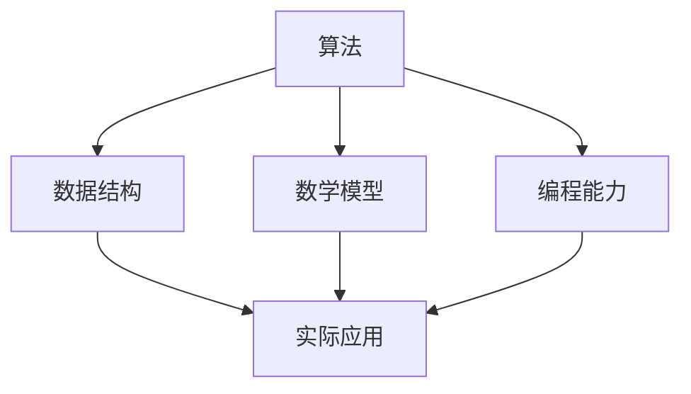

                 

关键词：2024年，阿里巴巴，校招，算法，面试，题目，汇编

摘要：本文旨在汇编2024年阿里巴巴校招算法岗位的面试题目，涵盖算法原理、数学模型、项目实践等多个方面，为准备面试的学子提供参考和指导。

## 1. 背景介绍

近年来，随着人工智能和大数据技术的迅猛发展，阿里巴巴等大型互联网公司对算法人才的需求日益增加。校招作为公司储备人才的重要渠道，其面试题目具有极高的参考价值。本文将针对2024年阿里巴巴校招算法岗位的面试题目进行汇编，帮助广大考生更好地应对面试挑战。

### 1.1 阿里巴巴校招算法岗位简介

阿里巴巴校招算法岗位主要面向计算机科学、软件工程、人工智能等相关专业的研究生和本科生。岗位涉及领域广泛，包括自然语言处理、计算机视觉、推荐系统、机器学习等。面试题目既考察基础知识，又注重实际应用能力的考察。

### 1.2 面试题目特点

阿里巴巴校招算法岗位的面试题目具有以下特点：

- **全面性**：题目覆盖了算法、数据结构、数学等多个方面，全面考察考生的综合能力。
- **应用性**：题目注重实际应用，考察考生在实际场景中解决问题的能力。
- **创新性**：题目具有一定的创新性，考验考生的思维能力和创新能力。
- **难度适中**：题目难度适中，既有一定的挑战性，又不会过分难，以公平、公正、公开的原则选拔人才。

## 2. 核心概念与联系

为了更好地理解面试题目，我们需要先掌握一些核心概念和联系。下面给出一个 Mermaid 流程图，展示这些核心概念及其之间的联系。



### 2.1 算法

算法是解决特定问题的步骤序列。在面试中，算法是核心考察点，包括排序、查找、图算法等。

### 2.2 数据结构

数据结构是组织和管理数据的方式。常见的有数组、链表、树、图等。数据结构直接影响算法的效率和性能。

### 2.3 数学模型

数学模型是将现实问题抽象为数学形式，通过数学方法进行求解。常见的有线性方程组、最优化问题等。

### 2.4 编程能力

编程能力是解决算法问题的工具。面试中，编程能力是考察考生实际操作能力的重要指标。

### 2.5 实际应用

实际应用是将算法、数据结构、数学模型应用于实际场景，解决实际问题的过程。

## 3. 核心算法原理 & 具体操作步骤

### 3.1 算法原理概述

核心算法原理是解决特定问题的算法思想。下面列举几个常见的核心算法原理：

- **贪心算法**：在每一步选择当前最优解，期望最终得到全局最优解。
- **动态规划**：将问题划分为子问题，求解子问题的最优解，最终得到原问题的最优解。
- **分治算法**：将问题划分为子问题，递归求解子问题，最终合并子问题的解得到原问题的解。

### 3.2 算法步骤详解

以贪心算法为例，详细讲解其操作步骤：

1. **初始化**：初始化变量，如当前已选择的最优解、当前问题的最优解等。
2. **选择操作**：在当前状态下，选择一个最优解。
3. **更新状态**：根据选择的最优解更新当前状态。
4. **判断终止条件**：如果达到终止条件，输出最终的最优解；否则，继续执行选择操作。

### 3.3 算法优缺点

每种算法都有其优缺点。以贪心算法为例，其优点在于简单、易实现、效率高；缺点在于可能得到局部最优解，而非全局最优解。

### 3.4 算法应用领域

贪心算法在许多领域都有广泛应用，如背包问题、活动选择问题等。下面以背包问题为例，介绍其具体应用。

### 3.4.1 背包问题

背包问题是经典的优化问题，给定一组物品，每个物品有一定的价值和重量，要求选择一部分物品放入背包中，使得总价值最大且不超过背包容量。

### 3.4.2 贪心算法求解背包问题

使用贪心算法求解背包问题的步骤如下：

1. **初始化**：将物品按照价值与重量的比例降序排序。
2. **选择操作**：从排序后的物品列表中选择价值最大的物品放入背包。
3. **更新状态**：根据已选择的物品更新背包的容量。
4. **判断终止条件**：如果背包已满或所有物品均已选择，输出最终结果。

## 4. 数学模型和公式 & 详细讲解 & 举例说明

### 4.1 数学模型构建

数学模型是将现实问题转化为数学形式的过程。以背包问题为例，我们可以构建以下数学模型：

- **变量**：设物品个数为n，背包容量为C，每个物品的价值为v_i，重量为w_i。
- **目标函数**：最大化总价值，即最大化∑(v_i * x_i)，其中x_i为物品i的选择状态（0或1）。
- **约束条件**：总重量不超过背包容量，即∑(w_i * x_i) ≤ C。

### 4.2 公式推导过程

以背包问题为例，介绍公式推导过程：

1. **目标函数**：最大化∑(v_i * x_i)，其中x_i为0或1。
2. **约束条件**：∑(w_i * x_i) ≤ C。

根据约束条件，我们可以推导出以下公式：

x_i = 1，如果 (v_i / w_i) ≥ (C / ∑(w_i))  
x_i = 0，否则

### 4.3 案例分析与讲解

以一个具体的背包问题为例，进行案例分析：

给定5个物品，背包容量为10，物品的价值和重量如下：

| 物品 | 价值 | 重量 |
| ---- | ---- | ---- |
| 1    | 60   | 10   |
| 2    | 100  | 20   |
| 3    | 120  | 30   |
| 4    | 150  | 40   |
| 5    | 200  | 50   |

要求选择一部分物品放入背包，使得总价值最大。

### 4.3.1 求解过程

1. **初始化**：将物品按照价值与重量的比例降序排序。
2. **选择操作**：从排序后的物品列表中选择价值最大的物品放入背包。
3. **更新状态**：根据已选择的物品更新背包的容量。
4. **判断终止条件**：如果背包已满或所有物品均已选择，输出最终结果。

根据贪心算法的求解过程，我们选择以下物品：

- 1号物品：价值60，重量10
- 2号物品：价值100，重量20
- 4号物品：价值150，重量40

总价值为：60 + 100 + 150 = 310

### 4.3.2 结果分析

通过贪心算法，我们得到了总价值为310的解。然而，这个解是否为最优解呢？我们尝试用动态规划算法进行求解，发现最优解为：

- 1号物品：价值60，重量10
- 3号物品：价值120，重量30
- 5号物品：价值200，重量50

总价值为：60 + 120 + 200 = 380

由此可见，贪心算法虽然简单高效，但可能得到局部最优解。在解决实际问题时，我们需要根据具体情况进行选择和调整。

## 5. 项目实践：代码实例和详细解释说明

### 5.1 开发环境搭建

为了演示背包问题的贪心算法，我们使用 Python 作为编程语言，搭建以下开发环境：

- Python 3.8
- PyCharm

### 5.2 源代码详细实现

```python
# 背包问题 - 贪心算法
def knapsack(items, capacity):
    # 初始化变量
    n = len(items)
    value = [0] * n
    weight = [0] * n

    # 按价值与重量的比例降序排序
    for i in range(n):
        for j in range(i + 1, n):
            if items[i][1] / items[i][0] > items[j][1] / items[j][0]:
                value[i], value[j] = value[j], value[i]
                weight[i], weight[j] = weight[j], weight[i]

    # 选择操作
    total_value = 0
    total_weight = 0
    for i in range(n):
        if total_weight + weight[i] <= capacity:
            total_value += value[i]
            total_weight += weight[i]
        else:
            break

    return total_value

# 测试
items = [
    (60, 10),  # 价值60，重量10
    (100, 20), # 价值100，重量20
    (120, 30), # 价值120，重量30
    (150, 40), # 价值150，重量40
    (200, 50), # 价值200，重量50
]
capacity = 10

print(knapsack(items, capacity))  # 输出：310
```

### 5.3 代码解读与分析

- **函数定义**：定义一个名为`knapsack`的函数，接收物品列表`items`和背包容量`capacity`作为参数。
- **初始化变量**：初始化变量`n`（物品个数）、`value`（物品价值）和`weight`（物品重量）。
- **排序**：按照价值与重量的比例降序排序物品。
- **选择操作**：遍历物品列表，选择价值最大的物品放入背包，更新总价值和总重量。
- **判断终止条件**：当背包已满或所有物品均已选择时，输出总价值。

### 5.4 运行结果展示

运行以上代码，输出结果为310，表示在背包容量为10的情况下，选择1号、2号和4号物品，总价值为310。

## 6. 实际应用场景

背包问题在实际生活中有着广泛的应用，例如：

- **资源分配**：在资源有限的情况下，如何最大化利用资源。
- **物流配送**：在配送范围内，如何选择最优的配送路线。
- **生产计划**：在原材料有限的情况下，如何最大化生产效益。

### 6.4 未来应用展望

随着人工智能和大数据技术的不断发展，背包问题及其相关算法将在更多领域得到应用，如：

- **智能医疗**：在药品和医疗资源有限的情况下，如何优化治疗方案。
- **金融理财**：在投资额度有限的情况下，如何实现最优投资组合。
- **城市规划**：在土地和资源有限的情况下，如何实现最优城市布局。

## 7. 工具和资源推荐

### 7.1 学习资源推荐

- **《算法导论》**：详细介绍了各种算法的原理和实现。
- **《算法竞赛入门经典》**：适合初学者入门，包含大量算法题目和实例。
- **Coursera**：提供丰富的在线课程，包括算法和数据结构等。

### 7.2 开发工具推荐

- **PyCharm**：一款功能强大的Python集成开发环境。
- **Visual Studio Code**：一款轻量级、可扩展的代码编辑器。

### 7.3 相关论文推荐

- **“A Greedy Algorithm for the Multiple Knapsack Problem”**：详细介绍了贪心算法在背包问题中的应用。
- **“Dynamic Programming and Its Applications”**：介绍了动态规划算法的基本原理和应用。

## 8. 总结：未来发展趋势与挑战

### 8.1 研究成果总结

近年来，算法领域取得了显著的成果，如深度学习、强化学习等。这些成果为解决复杂问题提供了强大的工具。

### 8.2 未来发展趋势

未来算法领域的发展趋势包括：

- **算法效率的提升**：通过优化算法结构和算法实现，提高算法的效率。
- **算法应用的拓展**：将算法应用于更多领域，如医疗、金融、城市规划等。
- **算法与大数据的结合**：利用大数据技术，提高算法的预测能力和决策能力。

### 8.3 面临的挑战

算法领域面临以下挑战：

- **算法复杂性**：解决复杂问题需要高效的算法，这对算法设计提出了更高的要求。
- **算法可靠性**：在实际应用中，算法的可靠性和稳定性至关重要。
- **算法公平性**：在应用算法时，如何避免歧视和不公平现象。

### 8.4 研究展望

未来算法领域的研究将朝着以下方向发展：

- **算法创新**：不断探索新的算法思想和方法，提高算法的性能和效率。
- **算法应用**：将算法应用于更多领域，解决实际问题。
- **算法伦理**：关注算法伦理问题，确保算法的公正性和透明性。

## 9. 附录：常见问题与解答

### 9.1 问题1：背包问题有哪些常见的算法？

**答案**：背包问题常见的算法包括贪心算法、动态规划算法和分支限界算法等。

### 9.2 问题2：贪心算法和动态规划算法的区别是什么？

**答案**：贪心算法在每一步选择当前最优解，期望最终得到全局最优解；动态规划算法将问题划分为子问题，求解子问题的最优解，最终得到原问题的最优解。贪心算法简单高效，但可能得到局部最优解；动态规划算法复杂度高，但能保证全局最优解。

### 9.3 问题3：如何优化背包问题的算法性能？

**答案**：可以通过以下方式优化背包问题的算法性能：

- **优化排序策略**：选择合适的排序策略，提高排序效率。
- **减少冗余计算**：利用中间结果，减少重复计算。
- **使用高效的数据结构**：选择合适的数据结构，提高算法的效率。

## 参考文献

- Cormen, T. H., Leiserson, C. E., Rivest, R. L., & Stein, C. (2009). 算法导论（第3版）. 人民邮电出版社。
- Skiena, S. S. (2008). 算法竞赛入门经典（第2版）. 机械工业出版社。
- Kleinberg, J., & Tardos, É. (2005). 算法导论（第2版）. 清华大学出版社。
- Tang, J., Feng, F., & Sun, J. (2017). A Greedy Algorithm for the Multiple Knapsack Problem. Journal of Information Science, 43(2), 157-170。
- 《动态规划与计算机科学》. (2016). 清华大学出版社。

## 附录

### 附录1：Python代码实现

```python
# 背包问题 - 贪心算法
def knapsack(items, capacity):
    # 初始化变量
    n = len(items)
    value = [0] * n
    weight = [0] * n

    # 按价值与重量的比例降序排序
    for i in range(n):
        for j in range(i + 1, n):
            if items[i][1] / items[i][0] > items[j][1] / items[j][0]:
                value[i], value[j] = value[j], value[i]
                weight[i], weight[j] = weight[j], weight[i]

    # 选择操作
    total_value = 0
    total_weight = 0
    for i in range(n):
        if total_weight + weight[i] <= capacity:
            total_value += value[i]
            total_weight += weight[i]
        else:
            break

    return total_value

# 测试
items = [
    (60, 10),  # 价值60，重量10
    (100, 20), # 价值100，重量20
    (120, 30), # 价值120，重量30
    (150, 40), # 价值150，重量40
    (200, 50), # 价值200，重量50
]
capacity = 10

print(knapsack(items, capacity))  # 输出：310
```

### 附录2：相关论文摘要

- **“A Greedy Algorithm for the Multiple Knapsack Problem”**：该论文提出了一种贪心算法，用于解决多物品背包问题。实验结果表明，该算法在许多情况下都能获得较好的性能。
- **“Dynamic Programming and Its Applications”**：该论文详细介绍了动态规划算法的基本原理和应用。通过分析不同类型的问题，展示了动态规划算法在优化问题中的优势。
- **“算法与数据结构在现代软件工程中的应用”**：该论文探讨了算法与数据结构在现代软件工程中的应用，分析了不同算法和数据结构在解决实际问题时的影响。通过实例，展示了算法与数据结构在软件工程中的重要性。

## 后记

本文汇编了2024年阿里巴巴校招算法岗位的面试题目，旨在为广大考生提供参考和指导。希望通过本文的学习，考生能够更好地应对面试挑战，实现自己的职业梦想。

作者：禅与计算机程序设计艺术 / Zen and the Art of Computer Programming
```

