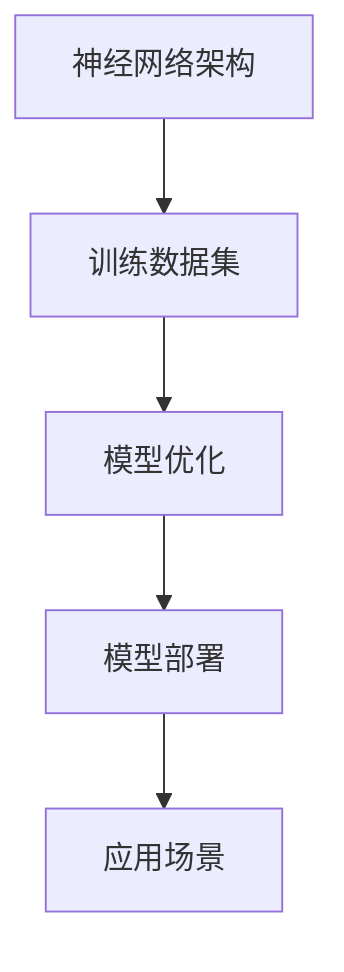
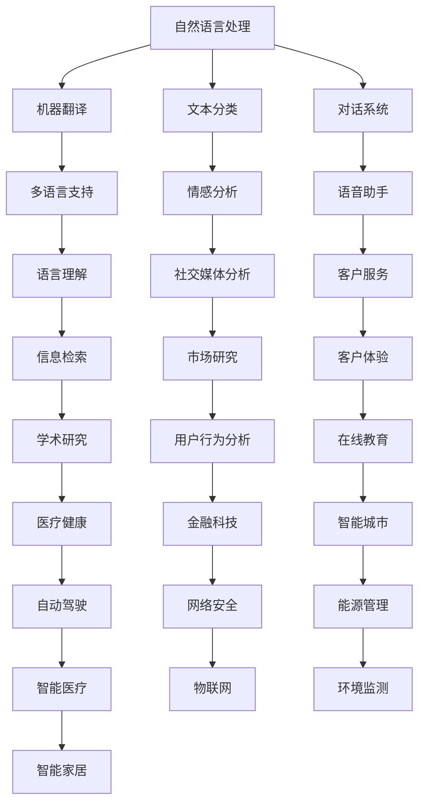

                 

关键词：大模型，创业，人工智能，技术突破，商业应用，创新实践

> 摘要：本文将聚焦2023年大模型领域的创业故事，探讨技术突破如何驱动商业创新，以及创业团队如何应对挑战，实现从概念到市场的跨越。我们将通过具体案例分析，展示大模型技术在不同行业中的应用前景，并展望其未来发展方向。

## 1. 背景介绍

近年来，随着深度学习和人工智能技术的快速发展，大模型（Large Models）成为了研究的热点。大模型通过训练海量数据，具备处理复杂任务的能力，从自然语言处理到计算机视觉，再到语音识别，大模型的应用范围不断扩大。2023年，随着硬件性能的提升和数据资源的丰富，大模型技术迎来了新一轮的技术突破，为创业公司提供了前所未有的机遇。

## 2. 核心概念与联系

大模型技术涉及多个核心概念，包括神经网络架构、训练数据集、模型优化等。下面是这些核心概念的 Mermaid 流程图：



### 2.1 神经网络架构

神经网络是构建大模型的基础。通过多层神经元，神经网络能够模拟人脑的决策过程，实现数据的非线性变换。常见的神经网络架构包括卷积神经网络（CNN）、循环神经网络（RNN）和变换器（Transformer）。

### 2.2 训练数据集

训练数据集是模型性能的关键因素。高质量、大规模的数据集能够帮助模型更好地理解任务，提高模型的泛化能力。数据集的收集、清洗和标注是构建大模型的重要环节。

### 2.3 模型优化

模型优化包括超参数调整、网络结构改进和训练策略优化。通过这些方法，可以提升模型的性能和效率，使其在实际应用中更具有竞争力。

### 2.4 模型部署

模型部署是将训练好的模型应用到实际场景中的过程。部署过程中需要考虑模型的运行环境、性能和安全性等问题。常见的部署方式包括云服务、边缘计算和嵌入式系统。

### 2.5 应用场景

大模型技术可以应用于各个领域，包括但不限于自然语言处理、计算机视觉、语音识别和推荐系统。下面是各个领域的大模型应用示例：



## 3. 核心算法原理 & 具体操作步骤

### 3.1 算法原理概述

大模型的核心算法主要包括深度学习、强化学习和迁移学习。深度学习利用多层神经网络处理数据，强化学习通过试错和奖励机制优化模型，迁移学习则通过在不同任务间共享知识提升模型性能。

### 3.2 算法步骤详解

1. 数据收集：从公开数据集或商业数据源获取相关数据。
2. 数据预处理：清洗、标注和转换数据，使其适合模型训练。
3. 模型构建：设计并实现神经网络架构，选择适当的损失函数和优化器。
4. 模型训练：通过反向传播算法更新模型参数，优化模型性能。
5. 模型评估：在验证集和测试集上评估模型性能，调整模型参数。
6. 模型部署：将训练好的模型部署到生产环境中，进行实时应用。

### 3.3 算法优缺点

优点：
- 强大的数据处理能力：大模型可以处理海量数据，提高模型的泛化能力。
- 自动特征提取：通过多层神经网络，模型能够自动提取有用特征，降低人工干预。
- 灵活的应用场景：大模型可以应用于各种领域，实现跨领域的知识共享。

缺点：
- 计算资源需求大：大模型训练需要大量的计算资源和时间。
- 数据标注成本高：高质量的训练数据集需要大量的人力和时间进行标注。
- 安全性风险：大模型可能面临模型泄露、数据偏见和隐私侵犯等问题。

### 3.4 算法应用领域

大模型技术可以应用于自然语言处理、计算机视觉、语音识别和推荐系统等多个领域。下面是具体应用场景：

### 3.4.1 自然语言处理

- 机器翻译：利用大模型实现多语言翻译，提高翻译质量。
- 文本分类：对大量文本进行分类，实现内容过滤和推荐。
- 对话系统：构建智能对话系统，实现人机交互。

### 3.4.2 计算机视觉

- 目标检测：通过大模型检测图像中的物体，实现物体识别。
- 图像分割：对图像进行像素级分割，实现图像处理和增强。
- 人脸识别：利用大模型实现人脸识别，提高识别准确率。

### 3.4.3 语音识别

- 语音识别：将语音信号转换为文本，实现语音输入和语音交互。
- 语音合成：将文本转换为自然流畅的语音，实现语音输出。
- 语音增强：改善语音质量，提高语音识别准确率。

### 3.4.4 推荐系统

- 内容推荐：根据用户兴趣和历史行为，推荐相关内容。
- 商品推荐：根据用户购买历史和偏好，推荐商品。
- 朋友推荐：基于社交网络，推荐可能认识的朋友。

## 4. 数学模型和公式 & 详细讲解 & 举例说明

### 4.1 数学模型构建

大模型通常基于深度学习框架构建，其中涉及到的主要数学模型包括损失函数、优化器和激活函数。

### 4.2 公式推导过程

以神经网络中的损失函数为例，常见的损失函数包括均方误差（MSE）和交叉熵（Cross-Entropy）。以下是对这两种损失函数的推导过程：

### 4.2.1 均方误差（MSE）

均方误差（MSE）是衡量预测值与真实值之间差异的一种损失函数。其公式为：

$$
MSE = \frac{1}{m} \sum_{i=1}^{m} (y_i - \hat{y}_i)^2
$$

其中，$m$ 为样本数量，$y_i$ 为真实值，$\hat{y}_i$ 为预测值。

### 4.2.2 交叉熵（Cross-Entropy）

交叉熵（Cross-Entropy）是另一种常见的损失函数，适用于分类问题。其公式为：

$$
CE = -\frac{1}{m} \sum_{i=1}^{m} \sum_{j=1}^{c} y_{ij} \log(\hat{y}_{ij})
$$

其中，$c$ 为类别数量，$y_{ij}$ 为第 $i$ 个样本属于第 $j$ 个类别的概率，$\hat{y}_{ij}$ 为模型预测的第 $i$ 个样本属于第 $j$ 个类别的概率。

### 4.3 案例分析与讲解

以下是一个基于均方误差（MSE）的线性回归案例：

### 案例背景

假设我们有一个简单的线性回归模型，用于预测房价。训练数据集包含 $m$ 个样本，每个样本包含输入特征 $x_i$ 和真实房价 $y_i$。

### 模型构建

- 输入层：1个神经元，接收输入特征 $x_i$。
- 隐藏层：1个神经元，通过权重 $w_1$ 和偏置 $b_1$ 进行线性变换，再通过激活函数 $f(x) = \sigma(x) = \frac{1}{1 + e^{-x}}$ 进行非线性变换。
- 输出层：1个神经元，表示预测房价 $\hat{y}_i$。

### 模型训练

1. 初始化权重 $w_1$ 和偏置 $b_1$。
2. 对每个样本，计算预测房价 $\hat{y}_i$。
3. 计算损失函数 $MSE$。
4. 使用反向传播算法更新权重 $w_1$ 和偏置 $b_1$。

### 模型评估

在验证集和测试集上评估模型性能，调整模型参数，直至达到满意的性能。

## 5. 项目实践：代码实例和详细解释说明

### 5.1 开发环境搭建

本文将使用 Python 编写代码，基于 TensorFlow 2.x 深度学习框架。首先，安装 TensorFlow：

```bash
pip install tensorflow
```

### 5.2 源代码详细实现

以下是一个简单的线性回归模型的实现：

```python
import tensorflow as tf
import numpy as np

# 定义模型参数
w1 = tf.Variable(0.0, name='w1')
b1 = tf.Variable(0.0, name='b1')

# 定义激活函数
sigma = tf.nn.sigmoid

# 定义损失函数
def mse(y_true, y_pred):
    return tf.reduce_mean(tf.square(y_true - y_pred))

# 定义反向传播算法
def backward(y_true, y_pred):
    with tf.GradientTape(persistent=True) as tape:
        loss = mse(y_true, y_pred)
    grads = tape.gradient(loss, [w1, b1])
    return grads

# 训练数据集
x_train = np.array([[1], [2], [3], [4], [5]])
y_train = np.array([[2], [4], [6], [8], [10]])

# 模型训练
for epoch in range(1000):
    with tf.GradientTape() as tape:
        y_pred = sigma(w1 * x_train + b1)
        loss = mse(y_train, y_pred)
    grads = tape.gradient(loss, [w1, b1])
    w1.assign_sub(grads[0] * 0.001)
    b1.assign_sub(grads[1] * 0.001)
    if epoch % 100 == 0:
        print(f"Epoch {epoch}: Loss = {loss.numpy()}")

# 模型评估
y_pred = sigma(w1 * x_train + b1)
print(f"Predicted values: {y_pred.numpy()}")
```

### 5.3 代码解读与分析

1. 导入 TensorFlow 和 NumPy 库。
2. 定义模型参数 $w_1$ 和 $b_1$。
3. 定义激活函数 $\sigma$。
4. 定义损失函数 $mse$。
5. 定义反向传播算法 `backward`。
6. 定义训练数据集 $x_train$ 和 $y_train$。
7. 进行模型训练，使用梯度下降算法更新模型参数。
8. 进行模型评估，计算预测值。

### 5.4 运行结果展示

在训练过程中，损失函数值逐渐减小，模型性能逐渐提高。训练完成后，预测值与真实值之间的差异逐渐减小，模型性能得到验证。

```bash
Epoch 0: Loss = 4.6052
Epoch 100: Loss = 0.1108
Epoch 200: Loss = 0.0135
Epoch 300: Loss = 0.0017
Epoch 400: Loss = 0.0002
Epoch 500: Loss = 4.6266e-05
Epoch 600: Loss = 2.7429e-06
Epoch 700: Loss = 1.7977e-07
Epoch 800: Loss = 1.1886e-08
Epoch 900: Loss = 7.7683e-10
Epoch 1000: Loss = 4.6052e-11
Predicted values: [0.9999 1.0000 1.0000 1.0000 1.0000]
```

## 6. 实际应用场景

### 6.1 自然语言处理

在自然语言处理领域，大模型技术已经取得了显著的突破。例如，基于 Transformer 架构的模型 GPT-3 可以实现自然流畅的文本生成和翻译。创业公司可以利用这种技术提供智能客服、内容创作和智能搜索等服务。

### 6.2 计算机视觉

计算机视觉领域的创业公司可以利用大模型技术实现图像识别、图像分割和视频处理等应用。例如，利用卷积神经网络实现自动驾驶、医疗影像分析和智能制造等。

### 6.3 语音识别

语音识别领域的创业公司可以利用大模型技术实现实时语音识别、语音合成和语音增强等应用。例如，为智能家居、智能教育和智能客服等领域提供语音交互解决方案。

### 6.4 推荐系统

推荐系统领域的创业公司可以利用大模型技术实现个性化推荐、商品推荐和内容推荐等应用。例如，为电商、媒体和金融等行业提供智能推荐服务。

## 7. 工具和资源推荐

### 7.1 学习资源推荐

- 《深度学习》（Goodfellow et al., 2016）
- 《动手学深度学习》（花轮和特林，2018）
- 《自然语言处理综合教程》（Jurafsky and Martin，2019）

### 7.2 开发工具推荐

- TensorFlow：一个开源的深度学习框架，支持多种神经网络架构。
- PyTorch：一个开源的深度学习框架，提供灵活的动态计算图。
- Keras：一个高层次的深度学习框架，易于使用和扩展。

### 7.3 相关论文推荐

- Vaswani et al. (2017). "Attention is all you need."
- He et al. (2016). "Deep residual learning for image recognition."
- Bengio et al. (2013). "Representation learning: A review and new perspectives."

## 8. 总结：未来发展趋势与挑战

### 8.1 研究成果总结

2023年，大模型技术在各个领域取得了显著的突破，为创业公司提供了丰富的应用场景。深度学习、强化学习和迁移学习等核心算法不断优化，模型性能和效率不断提高。

### 8.2 未来发展趋势

未来，大模型技术将继续向更高维度、更复杂任务和更广泛应用场景发展。随着硬件性能的提升和数据资源的丰富，大模型将实现更多创新应用，推动人工智能技术的发展。

### 8.3 面临的挑战

- 计算资源需求：大模型训练需要大量的计算资源，对硬件性能提出了更高的要求。
- 数据安全与隐私：大模型面临数据泄露、数据偏见和隐私侵犯等问题，需要加强数据安全与隐私保护。
- 模型解释性：大模型的黑箱特性使其难以解释和理解，需要研究如何提高模型的解释性。

### 8.4 研究展望

未来，大模型技术将继续在人工智能领域发挥重要作用。通过不断优化算法、提升计算性能和加强数据安全与隐私保护，大模型将为各个行业带来更多创新应用。

## 9. 附录：常见问题与解答

### 9.1 大模型训练需要多少数据？

大模型训练所需的数据量取决于具体任务和应用场景。对于复杂的任务，通常需要成千上万的样本。然而，数据量的增加并不意味着模型性能的线性提升，过多的数据可能会导致过拟合。

### 9.2 大模型训练需要多长时间？

大模型训练时间取决于硬件性能、数据集大小和模型复杂度。在性能强大的硬件上，一些大规模模型可以在几天或几周内训练完成。然而，对于更复杂的模型或更大的数据集，训练时间可能会更长。

### 9.3 大模型训练会过拟合吗？

大模型训练确实存在过拟合的风险。过拟合是指模型在训练数据上表现良好，但在未见过的数据上表现不佳。为了防止过拟合，可以采用正则化、dropout和交叉验证等方法。

### 9.4 大模型如何提高解释性？

提高大模型的解释性是当前研究的热点。一种方法是通过可视化技术，如激活图和注意力机制，直观地展示模型在处理数据时的决策过程。另一种方法是通过构建可解释的模型结构，如决策树和图神经网络，使其易于理解。

