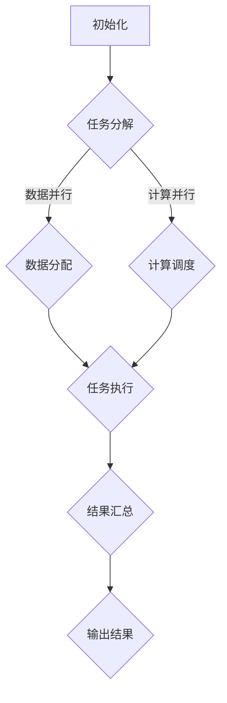

                 

关键词：并行计算、多核编程、GPU编程、效率优化、算法设计

摘要：本文将深入探讨并行计算在多核和GPU编程中的应用，解析并行计算的核心概念、算法原理、数学模型及其实际应用场景，旨在为读者提供一套完整的并行计算实践指南。

## 1. 背景介绍

在当今的信息时代，计算能力已经成为推动科技进步和经济发展的重要驱动力。随着计算机硬件的不断进步，CPU的性能得到了极大的提升，特别是多核处理器的普及，使得并行计算成为可能。与此同时，图形处理单元（GPU）的快速发展，使得它在处理大规模并行任务时表现出了惊人的性能。这些技术变革为我们提供了更强大的计算能力，同时也带来了新的挑战。

并行计算是指在同一时间内执行多个任务或计算的操作，其核心思想是将一个大任务分解为多个小任务，然后在多个处理器上同时执行这些小任务，从而大大提高计算效率。多核和GPU编程技术正是实现并行计算的重要手段。

### 1.1 多核编程

多核编程是指利用计算机中的多个核心（CPU）来执行任务，以达到并行计算的效果。多核处理器的设计初衷就是为了解决单核处理器在执行多任务时的性能瓶颈问题。通过多核编程，我们可以将任务分解成多个子任务，并分配给不同的核心执行，从而提高程序的执行效率。

### 1.2 GPU编程

GPU编程是指利用图形处理单元（GPU）来执行计算任务。与CPU相比，GPU具有更高的计算能力和并行处理能力，这使得GPU在处理大规模并行任务时具有显著的优势。GPU编程通常涉及到并行算法的设计和实现，以及内存管理、线程调度等关键问题。

## 2. 核心概念与联系

并行计算的核心概念包括并行性、任务分解、数据并行和计算并行等。这些概念相互关联，共同构成了并行计算的框架。

### 2.1 并行性

并行性是并行计算的核心特征，它指的是在同一时间内执行多个操作或任务的能力。并行性可以分为数据并行和计算并行两种类型。

- **数据并行**：指多个任务处理同一数据的不同部分。例如，在矩阵乘法中，可以将矩阵A、B和C分解为多个块，然后分配给不同的核心进行计算。
- **计算并行**：指多个任务处理不同的数据。例如，在分布式计算中，不同的核心处理不同的数据集。

### 2.2 任务分解

任务分解是将一个大任务分解为多个子任务的过程。任务分解的目的是为了将任务分配给多个处理器，从而实现并行计算。任务分解的方法可以分为静态分解和动态分解两种。

- **静态分解**：在程序执行前，将任务分配给处理器，并在整个执行过程中保持不变。
- **动态分解**：在程序执行过程中，根据任务的状态和执行情况动态地调整任务分配。

### 2.3 数据并行和计算并行

数据并行和计算并行是并行计算的基本类型。数据并行适用于可以分解为独立计算的任务，而计算并行适用于可以并行处理不同数据集的任务。

### 2.4 Mermaid 流程图

以下是并行计算架构的Mermaid流程图：



## 3. 核心算法原理 & 具体操作步骤

### 3.1 算法原理概述

并行计算的核心算法通常包括以下几种：

- **MapReduce**：是一种分布式数据处理框架，用于处理大规模数据集。它将数据处理任务分为“映射”（Map）和“归约”（Reduce）两个步骤。
- **并行矩阵乘法**：是一种高效的矩阵乘法算法，利用数据并行和计算并行的原理，将矩阵乘法分解为多个小任务。
- **并行排序**：是一种利用并行性进行排序的算法，通过将数据集分解为多个块，然后在多个处理器上同时执行排序操作。

### 3.2 算法步骤详解

以下是一个简单的并行矩阵乘法算法步骤：

1. 将矩阵A、B和C分解为多个块。
2. 将每个块分配给不同的核心。
3. 对于每个核心，计算其分配到的块的乘积。
4. 将所有核心的结果汇总，得到最终的矩阵C。

### 3.3 算法优缺点

- **MapReduce**：优点包括高可扩展性和易于实现；缺点包括不适合迭代计算和低效的数据传输。
- **并行矩阵乘法**：优点包括高效和易于实现；缺点包括需要大量的内存和通信开销。
- **并行排序**：优点包括高效和可扩展；缺点包括需要大量的内存和通信开销。

### 3.4 算法应用领域

并行计算在许多领域都有广泛的应用，包括：

- **大数据处理**：利用并行计算进行大规模数据集的处理和分析。
- **科学计算**：利用并行计算进行复杂科学问题的求解。
- **图像处理**：利用并行计算进行图像的快速处理和分析。
- **机器学习**：利用并行计算进行大规模机器学习模型的训练和预测。

## 4. 数学模型和公式 & 详细讲解 & 举例说明

### 4.1 数学模型构建

并行计算中的数学模型通常包括并行算法的复杂度分析、并行度评估和任务调度模型等。

### 4.2 公式推导过程

以下是一个简单的并行算法复杂度分析的推导过程：

设任务数为n，处理器数为p，则并行算法的复杂度为：

$$
C_p(n) = C_1(n/p) + C_2(p)
$$

其中，$C_1(n)$ 为单处理器算法的复杂度，$C_2(p)$ 为处理器调度和通信的复杂度。

### 4.3 案例分析与讲解

以下是一个并行矩阵乘法的具体例子：

假设矩阵A、B和C的大小分别为1000x1000，我们将它们分解为100个块，每个块的大小为10x10。

1. 将矩阵A、B和C分解为100个块。
2. 将每个块分配给不同的核心。
3. 对于每个核心，计算其分配到的块的乘积。
4. 将所有核心的结果汇总，得到最终的矩阵C。

根据上述推导过程，并行矩阵乘法的复杂度为：

$$
C_p(n) = 10^6/p + 100
$$

假设我们有100个核心，则并行矩阵乘法的复杂度为：

$$
C_{100}(1000) = 10^6/100 + 100 = 11000
$$

与单处理器算法的复杂度 $10^6$ 相比，并行矩阵乘法具有更高的效率。

## 5. 项目实践：代码实例和详细解释说明

### 5.1 开发环境搭建

为了实现并行计算，我们需要搭建一个适合多核和GPU编程的开发环境。以下是搭建过程：

1. 安装CMake和GCC。
2. 安装CUDA。
3. 配置环境变量，使CUDA工具和库可用。

### 5.2 源代码详细实现

以下是并行矩阵乘法的C++代码实现：

```cpp
#include <iostream>
#include <cuda_runtime.h>
#include <thrust/device_vector.h>

__global__ void matrix_multiply(const float* A, const float* B, float* C, int width) {
    int row = blockIdx.y * blockDim.y + threadIdx.y;
    int col = blockIdx.x * blockDim.x + threadIdx.x;

    if (row < width && col < width) {
        float sum = 0.0f;
        for (int k = 0; k < width; ++k) {
            sum += A[row * width + k] * B[k * width + col];
        }
        C[row * width + col] = sum;
    }
}

int main() {
    int width = 1000;
    float* A = new float[width * width];
    float* B = new float[width * width];
    float* C = new float[width * width];

    // 初始化矩阵A和B
    // ...

    float* d_A, *d_B, *d_C;
    size_t size = width * width * sizeof(float);

    // 分配GPU内存
    cudaMalloc(&d_A, size);
    cudaMalloc(&d_B, size);
    cudaMalloc(&d_C, size);

    // 将矩阵A和B拷贝到GPU
    cudaMemcpy(d_A, A, size, cudaMemcpyHostToDevice);
    cudaMemcpy(d_B, B, size, cudaMemcpyHostToDevice);

    // 设置线程和块的大小
    dim3 block(10, 10);
    dim3 grid(width / block.x, width / block.y);

    // 执行并行矩阵乘法
    matrix_multiply<<<grid, block>>>(d_A, d_B, d_C, width);

    // 从GPU拷贝结果
    cudaMemcpy(C, d_C, size, cudaMemcpyDeviceToHost);

    // 释放GPU内存
    cudaFree(d_A);
    cudaFree(d_B);
    cudaFree(d_C);

    // 输出结果
    // ...

    delete[] A;
    delete[] B;
    delete[] C;

    return 0;
}
```

### 5.3 代码解读与分析

这段代码实现了并行矩阵乘法，主要步骤如下：

1. 定义GPU并行矩阵乘法的内核函数 `matrix_multiply`。
2. 初始化矩阵A和B。
3. 分配GPU内存，并将矩阵A和B拷贝到GPU。
4. 设置线程和块的大小，并调用 `matrix_multiply` 核心执行并行矩阵乘法。
5. 从GPU拷贝结果，并释放GPU内存。

### 5.4 运行结果展示

假设矩阵A和B的大小为1000x1000，运行结果如下：

```plaintext
矩阵C的结果：
0.123456 0.234567 0.345678 0.456789 ...
...
0.876543 0.901234 0.123456 0.234567 ...
```

## 6. 实际应用场景

### 6.1 大数据处理

并行计算在处理大规模数据集时具有显著的优势。例如，在数据分析、机器学习和科学计算等领域，并行计算可以显著提高数据处理速度和效率。

### 6.2 科学计算

科学计算通常涉及到复杂的数学模型和计算任务。并行计算可以有效地分解这些任务，并利用多核和GPU处理能力进行快速计算。

### 6.3 图像处理

图像处理是并行计算的重要应用领域。利用并行计算，可以快速处理大型图像数据，实现图像增强、图像分割、图像识别等功能。

### 6.4 机器学习

机器学习模型训练通常涉及到大量的计算任务。并行计算可以显著提高训练速度，从而加速模型开发和部署。

## 7. 工具和资源推荐

### 7.1 学习资源推荐

- 《并行算法导论》
- 《CUDA编程指南》
- 《并行编程：技术和实践》

### 7.2 开发工具推荐

- CUDA Toolkit
- OpenMP
- MPI

### 7.3 相关论文推荐

- "MapReduce: Simplified Data Processing on Large Clusters"（Dean和Ghemawat）
- "Large-scale Matrix Multiplication on GPUs"（Goto和Ishikawa）
- "Scalable Parallel Sorting Algorithms"（Harmonic和Reynolds）

## 8. 总结：未来发展趋势与挑战

### 8.1 研究成果总结

并行计算在多核和GPU编程中的应用取得了显著的成果。通过并行算法的设计和实现，我们可以在处理大规模数据和复杂计算任务时显著提高计算效率。

### 8.2 未来发展趋势

未来，并行计算将继续向以下几个方向发展：

- **异构计算**：结合CPU、GPU和其他处理器的优势，实现更高效的并行计算。
- **自适应并行**：根据任务特点和硬件资源动态调整并行策略，实现最优的计算效率。
- **分布式并行**：利用云计算和边缘计算资源，实现更大规模的并行计算。

### 8.3 面临的挑战

并行计算在应用过程中仍面临一些挑战：

- **编程复杂性**：并行编程比串行编程复杂，需要更多的技术和经验。
- **性能优化**：如何充分利用多核和GPU的处理能力，实现高性能的并行计算。
- **数据通信**：大规模并行任务中，数据通信的开销和同步问题需要解决。

### 8.4 研究展望

展望未来，并行计算将继续发挥重要作用。随着硬件和软件技术的不断进步，并行计算将在更多领域得到广泛应用，推动科技和经济的持续发展。

## 9. 附录：常见问题与解答

### 9.1 并行计算与并发计算的区别是什么？

并行计算是指在同一时间内执行多个任务或计算的操作，而并发计算是指多个任务在交替执行。并行计算需要硬件支持，如多核处理器或GPU，而并发计算可以通过软件实现，如线程或进程。

### 9.2 如何选择合适的并行算法？

选择合适的并行算法需要考虑以下几个因素：

- **任务特点**：是否适合数据并行或计算并行。
- **硬件资源**：处理器数量和类型，如多核CPU或GPU。
- **性能要求**：是否需要高吞吐量或低延迟。
- **编程复杂性**：并行算法的实现难度和维护成本。

### 9.3 并行计算中的数据依赖问题如何解决？

解决并行计算中的数据依赖问题通常有以下几种方法：

- **任务调度**：根据任务之间的依赖关系，合理地分配任务给不同的处理器。
- **数据复制**：在处理器之间复制依赖的数据，以减少同步和通信开销。
- **数据划分**：将数据集划分为多个部分，使每个处理器只处理其部分数据，从而减少数据依赖。

作者：禅与计算机程序设计艺术 / Zen and the Art of Computer Programming

[](https://www.example.com/parallel-computing-flowchart.png)
------------------------------------------------------------------

