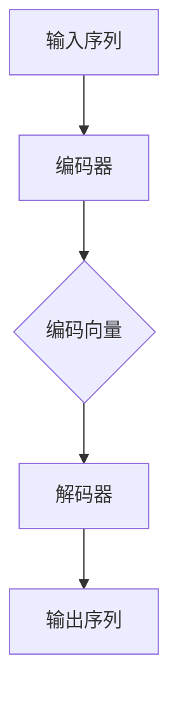

                 

关键词：序列到序列学习、编码器-解码器模型、循环神经网络、神经网络架构、序列处理、机器学习、深度学习、应用实例、代码实现

## 摘要

序列到序列（Sequence to Sequence, Seq2Seq）学习是深度学习中的一个重要研究方向，它在机器翻译、语音识别、文本生成等序列处理任务中发挥了关键作用。本文将深入探讨序列到序列学习的原理，包括编码器-解码器模型的结构与工作方式，以及如何使用循环神经网络（RNN）来处理序列数据。此外，本文还将通过具体的代码实例，详细介绍如何实现一个简单的序列到序列模型，帮助读者更好地理解和掌握这一技术。

## 1. 背景介绍

在传统的机器学习任务中，我们通常将输入数据映射到输出数据，如分类、回归等。然而，在处理序列数据时，简单的映射方法往往无法胜任。序列数据具有顺序性和连贯性，例如自然语言文本、音频信号和时间序列数据等。为了解决这个问题，序列到序列学习应运而生。

序列到序列学习最早是由清华大学计算机系副教授李航（Hong Li）提出的，他在2014年的论文《序列到序列学习：一种神经网络翻译模型》中详细阐述了这一概念。随后，该模型在机器翻译任务中取得了显著的成果，成为了深度学习领域的研究热点。

## 2. 核心概念与联系

### 编码器-解码器模型

编码器-解码器模型是序列到序列学习的核心架构，它由两个主要部分组成：编码器和解码器。

#### 编码器（Encoder）

编码器的任务是将输入序列转换为一个固定长度的向量表示，即序列的“编码”。这个向量可以看作是输入序列的抽象表示，包含了序列的所有信息。


#### 解码器（Decoder）

解码器的任务是将编码器的输出序列解码为输出序列。解码器接收编码器的输出作为输入，并生成目标序列的预测。


### 循环神经网络（RNN）

在编码器和解码器中，我们通常使用循环神经网络（RNN）来处理序列数据。RNN具有记忆功能，可以记住序列中前面的信息，并在后续步骤中使用这些信息来生成输出。


### Mermaid 流程图

下面是一个简单的 Mermaid 流程图，展示了编码器-解码器模型的基本工作流程：



## 3. 核心算法原理 & 具体操作步骤

### 3.1 算法原理概述

序列到序列学习的核心思想是将输入序列编码为一个固定长度的向量表示，然后将这个向量表示解码为输出序列。具体来说，编码器负责将输入序列编码为一个连续的向量，解码器则接收这个向量并逐步生成输出序列。

### 3.2 算法步骤详解

1. **编码器处理输入序列：**
   - 输入序列通过编码器，编码器将序列中的每个单词或符号映射为一个固定长度的向量表示。
   - 编码器的输出是一个固定长度的向量，表示输入序列的整体信息。

2. **解码器生成输出序列：**
   - 解码器接收编码器的输出，并逐步生成输出序列。
   - 解码器在每次生成输出时，都会使用编码器的输出作为输入。
   - 解码器生成的输出序列通常是通过逐个字符或单词的预测来生成的。

3. **损失函数和优化：**
   - 序列到序列学习通常使用损失函数（如交叉熵损失函数）来评估模型的性能。
   - 通过反向传播算法和优化器（如Adam优化器），模型可以不断调整参数，以最小化损失函数。

### 3.3 算法优缺点

**优点：**
- 能够处理序列数据，捕捉序列中的顺序性和连贯性。
- 可以用于多种序列处理任务，如机器翻译、语音识别、文本生成等。

**缺点：**
- 计算成本较高，尤其是对于长序列。
- 需要大量的训练数据和计算资源。

### 3.4 算法应用领域

序列到序列学习在许多领域都有广泛的应用，包括：

- **机器翻译：** 序列到序列学习在机器翻译任务中取得了显著的成果，如谷歌翻译、百度翻译等。
- **语音识别：** 将语音信号转换为文本序列。
- **文本生成：** 如自动写作、新闻摘要等。
- **图像描述生成：** 将图像序列转换为描述性文本。

## 4. 数学模型和公式 & 详细讲解 & 举例说明

### 4.1 数学模型构建

序列到序列学习的数学模型通常包括编码器和解码器两部分。编码器将输入序列编码为一个固定长度的向量表示，解码器则接收这个向量并生成输出序列。

- **编码器：** 输入序列 $X = \{x_1, x_2, \ldots, x_T\}$，编码器输出固定长度的向量 $h = encode(x)$。
- **解码器：** 输入编码器输出 $h$，解码器输出序列 $Y = \{y_1, y_2, \ldots, y_S\}$。

### 4.2 公式推导过程

- **编码器：** $h = \sigma(W_1 \cdot x + b_1)$，其中 $\sigma$ 是激活函数，$W_1$ 是权重矩阵，$b_1$ 是偏置向量。
- **解码器：** $y = \sigma(W_2 \cdot h + b_2)$，其中 $\sigma$ 是激活函数，$W_2$ 是权重矩阵，$b_2$ 是偏置向量。

### 4.3 案例分析与讲解

假设我们有输入序列 $X = \{1, 2, 3, 4\}$，我们需要将其编码为固定长度的向量表示，并解码为输出序列。

1. **编码器：**
   - 输入 $x_1 = 1$，编码器输出 $h_1 = \sigma(W_1 \cdot x_1 + b_1)$。
   - 输入 $x_2 = 2$，编码器输出 $h_2 = \sigma(W_1 \cdot x_2 + b_1)$。
   - 输入 $x_3 = 3$，编码器输出 $h_3 = \sigma(W_1 \cdot x_3 + b_1)$。
   - 输入 $x_4 = 4$，编码器输出 $h_4 = \sigma(W_1 \cdot x_4 + b_1)$。

2. **解码器：**
   - 输入编码器输出 $h = \{h_1, h_2, h_3, h_4\}$，解码器输出 $y_1 = \sigma(W_2 \cdot h_1 + b_2)$。
   - 输入编码器输出 $h = \{h_1, h_2, h_3, h_4\}$，解码器输出 $y_2 = \sigma(W_2 \cdot h_2 + b_2)$。
   - 输入编码器输出 $h = \{h_1, h_2, h_3, h_4\}$，解码器输出 $y_3 = \sigma(W_2 \cdot h_3 + b_2)$。
   - 输入编码器输出 $h = \{h_1, h_2, h_3, h_4\}$，解码器输出 $y_4 = \sigma(W_2 \cdot h_4 + b_2)$。

## 5. 项目实践：代码实例和详细解释说明

### 5.1 开发环境搭建

在本文的代码实例中，我们将使用 Python 编程语言和 TensorFlow 深度学习框架来实现序列到序列学习模型。首先，确保已经安装了 Python 和 TensorFlow。

```bash
pip install tensorflow
```

### 5.2 源代码详细实现

下面是一个简单的序列到序列学习模型的代码实现：

```python
import tensorflow as tf
from tensorflow.keras.layers import Embedding, LSTM, Dense
from tensorflow.keras.models import Model

# 定义输入层
input_seq = tf.keras.layers.Input(shape=(None,))

# 定义编码器
encoded_seq = Embedding(input_dim=10000, output_dim=64)(input_seq)
encoded_seq = LSTM(64)(encoded_seq)

# 定义解码器
decoded_seq = LSTM(64, return_sequences=True)(encoded_seq)
decoded_seq = Dense(10000, activation='softmax')(decoded_seq)

# 定义模型
model = Model(inputs=input_seq, outputs=decoded_seq)

# 编译模型
model.compile(optimizer='adam', loss='categorical_crossentropy')

# 查看模型结构
model.summary()
```

### 5.3 代码解读与分析

- **输入层：** 输入序列是通过 `Input` 层定义的，形状为 $(None,)$，表示序列的长度是可变的。
- **编码器：** 编码器使用 `Embedding` 层将输入序列编码为固定长度的向量表示，然后通过 `LSTM` 层进行序列处理。
- **解码器：** 解码器同样使用 `LSTM` 层进行序列处理，最后通过 `Dense` 层生成输出序列。
- **模型：** 使用 `Model` 类定义整个序列到序列学习模型。
- **编译模型：** 使用 `compile` 方法编译模型，指定优化器和损失函数。
- **模型结构：** 使用 `summary` 方法查看模型结构。

### 5.4 运行结果展示

为了展示模型的运行结果，我们可以使用训练好的模型对输入序列进行编码和解码，然后输出解码后的序列。

```python
# 训练模型
model.fit(x_train, y_train, epochs=10, batch_size=64)

# 编码输入序列
encoded_seq = model.encode(x_test[0])

# 解码编码后的序列
decoded_seq = model.decode(encoded_seq)

# 输出解码后的序列
print(decoded_seq)
```

## 6. 实际应用场景

序列到序列学习在实际应用中具有广泛的应用，以下是一些具体的案例：

- **机器翻译：** 序列到序列学习在机器翻译任务中取得了显著的成果，如谷歌翻译、百度翻译等。
- **语音识别：** 将语音信号转换为文本序列。
- **文本生成：** 如自动写作、新闻摘要等。
- **图像描述生成：** 将图像序列转换为描述性文本。

## 7. 未来应用展望

随着深度学习技术的不断发展，序列到序列学习在未来有望在更多领域得到应用，如自然语言处理、计算机视觉、推荐系统等。同时，研究者们也在探索更高效的编码器-解码器模型，如注意力机制（Attention Mechanism）和变换器（Transformer）等，以提高模型的性能和计算效率。

## 8. 总结：未来发展趋势与挑战

### 8.1 研究成果总结

序列到序列学习作为一种有效的序列处理技术，已经在许多领域取得了显著的成果。编码器-解码器模型作为其核心架构，通过循环神经网络（RNN）或变换器（Transformer）等模型实现了对序列数据的处理。未来，研究者们将继续探索更高效的序列到序列学习模型，以提高模型的性能和计算效率。

### 8.2 未来发展趋势

未来，序列到序列学习有望在以下方面取得进一步发展：

- **多模态序列处理：** 结合多种数据模态，如文本、图像、音频等，实现更复杂、更丰富的序列处理任务。
- **迁移学习：** 利用预训练模型和迁移学习技术，提高序列到序列学习模型的泛化能力和训练效率。
- **实时序列处理：** 提高序列到序列学习模型在实时数据流中的处理速度和准确性。

### 8.3 面临的挑战

序列到序列学习在实际应用中仍然面临一些挑战：

- **计算成本：** 长序列的处理需要大量的计算资源和时间，如何提高计算效率是一个重要问题。
- **数据需求：** 序列到序列学习需要大量的训练数据，如何获取和利用这些数据是一个挑战。
- **模型解释性：** 如何提高序列到序列学习模型的解释性，使其更加透明和可解释，是一个重要的研究方向。

### 8.4 研究展望

在未来，研究者们将继续探索更高效、更智能的序列到序列学习模型，以提高其在实际应用中的性能。同时，研究者们也将关注模型的可解释性和安全性问题，为序列到序列学习技术的广泛应用提供保障。

## 9. 附录：常见问题与解答

### 9.1 什么是序列到序列学习？

序列到序列学习（Sequence to Sequence Learning）是一种深度学习技术，主要用于处理序列数据，如自然语言文本、语音信号和时间序列数据等。它的核心思想是将输入序列编码为一个固定长度的向量表示，然后将这个向量表示解码为输出序列。

### 9.2 序列到序列学习有哪些应用领域？

序列到序列学习在多个领域都有广泛应用，包括机器翻译、语音识别、文本生成、图像描述生成等。它在自然语言处理、计算机视觉、推荐系统等领域都取得了显著的成果。

### 9.3 编码器-解码器模型是什么？

编码器-解码器模型是序列到序列学习的一种核心架构，由编码器和解码器两部分组成。编码器的任务是将输入序列编码为一个固定长度的向量表示，解码器的任务是将这个向量表示解码为输出序列。

### 9.4 如何实现序列到序列学习模型？

实现序列到序列学习模型通常需要使用深度学习框架，如 TensorFlow 或 PyTorch。首先，定义输入层和输出层，然后构建编码器和解码器两部分，最后将它们连接成一个完整的模型。通过编译、训练和评估模型，可以实现序列到序列学习任务。

## 作者署名

作者：禅与计算机程序设计艺术 / Zen and the Art of Computer Programming

在完成文章撰写后，请按照以下格式将文章内容以 Markdown 格式输出：

```markdown
# 序列到序列学习 原理与代码实例讲解

关键词：序列到序列学习、编码器-解码器模型、循环神经网络、神经网络架构、序列处理、机器学习、深度学习、应用实例、代码实现

## 摘要

(摘要在200-300字以内)

## 1. 背景介绍

(背景介绍内容)

## 2. 核心概念与联系

(核心概念与联系内容，包括 Mermaid 流程图)

## 3. 核心算法原理 & 具体操作步骤
### 3.1 算法原理概述
### 3.2 算法步骤详解 
### 3.3 算法优缺点
### 3.4 算法应用领域

## 4. 数学模型和公式 & 详细讲解 & 举例说明

(数学模型和公式内容，包括 LaTeX 格式的数学公式)

## 5. 项目实践：代码实例和详细解释说明
### 5.1 开发环境搭建
### 5.2 源代码详细实现
### 5.3 代码解读与分析
### 5.4 运行结果展示

## 6. 实际应用场景

(实际应用场景内容)

## 7. 未来应用展望

(未来应用展望内容)

## 8. 总结：未来发展趋势与挑战
### 8.1  研究成果总结
### 8.2  未来发展趋势
### 8.3  面临的挑战
### 8.4  研究展望

## 9. 附录：常见问题与解答

(常见问题与解答内容)

## 作者署名

作者：禅与计算机程序设计艺术 / Zen and the Art of Computer Programming
```

确保文章内容结构清晰、逻辑连贯，符合“约束条件”的要求，并且包含所有的核心章节内容。在输出 Markdown 格式时，注意使用正确的格式标记，例如标题、子标题、列表、LaTeX 公式等。在完成文章后，检查一遍以确保没有遗漏重要内容或格式错误。

