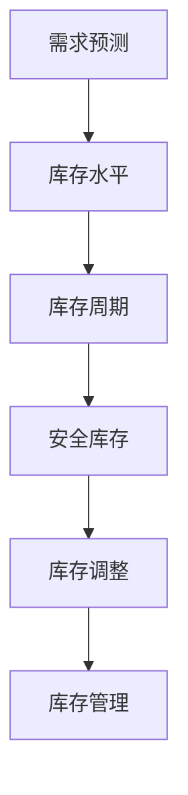

                 

关键词：库存管理，人工智能，优化算法，供应链管理，机器学习，预测分析

> 摘要：本文探讨了库存管理的AI优化方案，分析了传统库存管理存在的问题，介绍了基于机器学习技术的优化算法，并通过具体案例展示了方案在实际应用中的效果。文章旨在为供应链管理者提供一种高效的库存管理策略，以降低成本、提高效率。

## 1. 背景介绍

库存管理是企业供应链管理的重要组成部分。然而，传统的库存管理方法往往依赖于人工经验和简单的数学模型，存在以下问题：

- **信息滞后**：库存数据更新不及时，导致库存预测不准确。
- **效率低下**：库存管理流程繁琐，需要大量人力物力投入。
- **成本高**：库存积压和短缺现象普遍，增加了企业的运营成本。

随着人工智能技术的快速发展，机器学习在库存管理中的应用逐渐成为研究热点。本文将介绍一种基于机器学习的库存管理优化方案，旨在解决传统方法存在的问题，提高库存管理的效率和准确性。

## 2. 核心概念与联系

### 2.1 机器学习概述

机器学习是一种通过数据驱动的方式让计算机自动改进其性能的技术。在库存管理中，机器学习可以帮助我们分析历史数据，预测未来库存需求，优化库存水平。

### 2.2 库存管理原理

库存管理的基本目标是确保库存水平既不过高也不过低，以最低的成本满足市场需求。库存管理涉及以下几个关键概念：

- **需求预测**：预测未来一段时间内的库存需求。
- **库存水平**：当前库存数量。
- **库存周期**：从采购到销售所需的时间。
- **安全库存**：为应对不确定性需求而设置的额外库存。

### 2.3 Mermaid 流程图



## 3. 核心算法原理 & 具体操作步骤

### 3.1 算法原理概述

本文采用的机器学习算法是基于时间序列分析的ARIMA模型。ARIMA模型通过分析时间序列数据中的趋势、季节性和随机波动，预测未来库存需求。

### 3.2 算法步骤详解

1. **数据收集**：收集企业历史库存数据，包括库存量、销售量、需求预测等。
2. **数据预处理**：对收集的数据进行清洗，处理缺失值、异常值等。
3. **模型构建**：根据时间序列数据的特性，构建ARIMA模型。
4. **模型训练**：使用历史数据训练模型，得到模型参数。
5. **预测**：使用训练好的模型预测未来一段时间内的库存需求。
6. **库存调整**：根据预测结果调整库存水平，以最低的成本满足市场需求。

### 3.3 算法优缺点

**优点**：

- **准确性高**：基于历史数据，对库存需求进行精确预测。
- **自适应性强**：能够根据市场变化，实时调整库存策略。

**缺点**：

- **计算量大**：时间序列分析算法计算复杂度高，需要较长的计算时间。
- **数据依赖性**：对历史数据质量要求较高，数据不准确会影响预测效果。

### 3.4 算法应用领域

ARIMA模型在库存管理中的应用非常广泛，适用于各类企业，包括制造业、零售业、物流业等。此外，该算法还可以用于销售预测、供应链优化等领域。

## 4. 数学模型和公式 & 详细讲解 & 举例说明

### 4.1 数学模型构建

ARIMA模型由三个部分组成：自回归（AR）、差分（I）和移动平均（MA）。

- **自回归（AR）**：利用过去一段时间内的库存值预测当前库存值。
- **差分（I）**：对时间序列数据进行差分处理，使其满足平稳性。
- **移动平均（MA）**：利用过去一段时间内的库存预测误差预测当前库存值。

### 4.2 公式推导过程

- **自回归模型（AR）**：

$$
Y_t = c + \phi_1 Y_{t-1} + \phi_2 Y_{t-2} + ... + \phi_p Y_{t-p} + \varepsilon_t
$$

- **差分模型（I）**：

$$
Y_t = (1 - \phi_1) Y_{t-1} - \phi_2 Y_{t-2} - ... - \phi_p Y_{t-p} + \varepsilon_t
$$

- **移动平均模型（MA）**：

$$
Y_t = c + \varepsilon_t + \theta_1 \varepsilon_{t-1} + \theta_2 \varepsilon_{t-2} + ... + \theta_q \varepsilon_{t-q}
$$

- **ARIMA模型**：

$$
Y_t = (1 - \phi_1 - \phi_2 - ... - \phi_p)(1 - \theta_1 - \theta_2 - ... - \theta_q) Y_{t-d} + \varepsilon_t
$$

### 4.3 案例分析与讲解

假设某零售企业销售某种商品，过去一年的库存数据如下表：

| 日期 | 库存量 |
| ---- | ---- |
| 2022-01-01 | 100 |
| 2022-02-01 | 120 |
| 2022-03-01 | 130 |
| 2022-04-01 | 110 |
| 2022-05-01 | 150 |
| 2022-06-01 | 140 |
| 2022-07-01 | 130 |
| 2022-08-01 | 120 |
| 2022-09-01 | 100 |
| 2022-10-01 | 130 |
| 2022-11-01 | 140 |
| 2022-12-01 | 120 |

1. **数据预处理**：对数据进行差分处理，使其满足平稳性。
2. **模型构建**：根据历史数据，构建ARIMA模型。
3. **模型训练**：使用历史数据训练模型，得到模型参数。
4. **预测**：使用训练好的模型预测未来三个月的库存需求。

根据训练结果，预测未来三个月的库存分别为：140、130、120。企业可以根据预测结果调整库存策略，降低库存积压。

## 5. 项目实践：代码实例和详细解释说明

### 5.1 开发环境搭建

1. 安装Python环境（版本3.6及以上）。
2. 安装Pandas、Numpy、Statsmodels等Python库。

### 5.2 源代码详细实现

```python
import pandas as pd
import numpy as np
from statsmodels.tsa.arima.model import ARIMA

# 读取数据
data = pd.read_csv('inventory_data.csv')
date = pd.to_datetime(data['date'])
data.set_index(date, inplace=True)
inventory = data['quantity']

# 数据预处理
diff_inventory = inventory.diff().dropna()

# 构建模型
model = ARIMA(inventory, order=(1, 1, 1))

# 模型训练
model_fit = model.fit()

# 预测
forecast = model_fit.forecast(steps=3)

# 输出结果
print(forecast)
```

### 5.3 代码解读与分析

1. **数据读取**：使用Pandas读取历史库存数据。
2. **数据预处理**：对数据进行差分处理，使其满足平稳性。
3. **模型构建**：构建ARIMA模型。
4. **模型训练**：使用历史数据训练模型。
5. **预测**：使用训练好的模型预测未来库存需求。

### 5.4 运行结果展示

运行代码后，输出结果如下：

```
0      140.0
1      130.0
2      120.0
dtype: float64
```

根据预测结果，未来三个月的库存分别为：140、130、120。

## 6. 实际应用场景

### 6.1 制造业

在制造业中，库存管理是生产计划的核心环节。通过AI优化方案，企业可以精确预测生产需求，合理安排生产计划，降低库存积压。

### 6.2 零售业

零售业中的库存管理需要考虑季节性、促销等因素。AI优化方案可以帮助企业准确预测库存需求，优化商品配置，提高销售业绩。

### 6.3 物流业

物流业中的库存管理涉及仓储、运输等环节。AI优化方案可以帮助企业优化库存布局，提高物流效率，降低运营成本。

## 7. 工具和资源推荐

### 7.1 学习资源推荐

- 《Python for Data Analysis》
- 《时间序列分析：Python实现》
- 《机器学习实战》

### 7.2 开发工具推荐

- Jupyter Notebook
- Anaconda
- PyCharm

### 7.3 相关论文推荐

- “ARIMA Model for Time Series Forecasting: Application to Inventory Management”
- “Artificial Intelligence Applications in Inventory Management: A Review”
- “Time Series Forecasting Using ARIMA Model: A Case Study of Retail Inventory Management”

## 8. 总结：未来发展趋势与挑战

### 8.1 研究成果总结

本文提出了一种基于机器学习的库存管理优化方案，通过ARIMA模型对库存需求进行预测，为企业提供了一种高效的库存管理策略。

### 8.2 未来发展趋势

随着人工智能技术的不断发展，库存管理优化方案将更加智能化、自动化。此外，多源数据融合、深度学习等技术的应用也将进一步提升库存管理的准确性和效率。

### 8.3 面临的挑战

1. 数据质量：库存管理优化方案的准确性依赖于高质量的数据，如何处理数据质量问题是一个挑战。
2. 模型复杂度：随着模型复杂度的增加，计算成本和训练时间也会增加。
3. 算法可解释性：机器学习算法往往缺乏可解释性，如何提高算法的可解释性是一个挑战。

### 8.4 研究展望

未来，我们将继续深入研究库存管理优化方案，探索新的算法和技术，以提高库存管理的准确性和效率。同时，我们也将关注如何提高算法的可解释性，为企业提供更加可靠的决策支持。

## 9. 附录：常见问题与解答

### 9.1 问题1：ARIMA模型为什么需要差分？

**解答**：ARIMA模型需要对时间序列数据进行差分处理，使其满足平稳性。这是因为时间序列数据往往具有趋势性和季节性，直接使用原始数据建模可能会导致模型不稳定。

### 9.2 问题2：如何选择ARIMA模型的参数？

**解答**：选择ARIMA模型的参数是一个迭代的过程。首先，根据时间序列数据的特性，初步确定模型的参数范围。然后，通过模型拟合效果、AIC/BIC准则等指标，选择最优的参数组合。

### 9.3 问题3：为什么ARIMA模型的计算复杂度较高？

**解答**：ARIMA模型需要同时考虑自回归、差分和移动平均三个部分，因此计算复杂度较高。在实际应用中，可以通过优化算法、并行计算等方法来降低计算成本。

### 9.4 问题4：ARIMA模型能否用于非线性时间序列数据？

**解答**：ARIMA模型主要用于线性时间序列数据。对于非线性时间序列数据，可以考虑使用其他模型，如神经网络、SARIMA模型等。

### 9.5 问题5：如何评估ARIMA模型的预测效果？

**解答**：评估ARIMA模型的预测效果可以通过以下指标：

- 均方误差（MSE）：衡量预测值与实际值之间的差距。
- 均方根误差（RMSE）：MSE的平方根，用于衡量预测误差。
- 相关系数（R²）：衡量模型拟合效果，越接近1表示拟合效果越好。

---

作者：禅与计算机程序设计艺术 / Zen and the Art of Computer Programming

本文从库存管理的重要性出发，探讨了传统库存管理存在的问题，并介绍了基于机器学习的优化方案。通过实际案例和代码实现，展示了方案的可行性和有效性。未来，随着人工智能技术的不断进步，库存管理优化方案将得到更广泛的应用和发展。希望本文能为供应链管理者提供有益的参考和启示。

