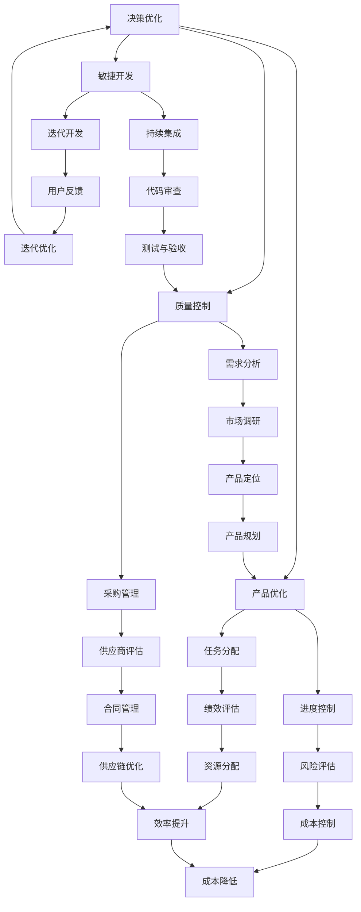

                 

在快速变化和竞争激烈的科技行业，建立一个高效的行动体系对于企业的成功至关重要。本文旨在探讨如何通过技术手段构建一个高效的行动体系，从而在竞争中获得优势。作者：禅与计算机程序设计艺术 / Zen and the Art of Computer Programming。

## 关键词

**行动体系**，**效率**，**技术**，**竞争**，**企业成功**，**策略**。

## 摘要

本文将介绍如何通过技术手段建立高效行动体系，包括核心概念、算法原理、数学模型、项目实践和实际应用场景等。通过详细的步骤和分析，帮助读者理解如何将技术应用于行动体系的建设，从而提升企业的效率和竞争力。

### 1. 背景介绍

在现代科技行业，企业面临着前所未有的竞争压力。为了保持竞争力，企业必须快速响应市场变化，提高生产效率和产品质量。这要求企业能够建立高效的行动体系，确保从战略规划到具体执行都能高效顺畅地进行。

然而，传统的管理方法和流程往往存在响应速度慢、资源浪费等问题，无法满足现代企业的需求。因此，如何利用技术手段构建一个高效的行动体系成为企业关注的焦点。

本文将探讨如何通过以下几个关键步骤建立高效行动体系：

1. **核心概念与联系**：介绍行动体系的核心概念，并展示其与企业管理、供应链管理、项目管理等领域的联系。
2. **核心算法原理 & 具体操作步骤**：详细解析行动体系的核心算法原理，并给出具体的操作步骤。
3. **数学模型和公式 & 详细讲解 & 举例说明**：建立数学模型，并使用公式进行详细讲解，同时提供案例分析和讲解。
4. **项目实践：代码实例和详细解释说明**：通过实际项目实践，展示如何将算法和模型应用于行动体系的建设。
5. **实际应用场景**：探讨行动体系在不同应用场景中的效果和影响。
6. **未来应用展望**：分析行动体系未来的发展趋势和应用前景。

### 2. 核心概念与联系

为了构建高效的行动体系，首先需要理解几个核心概念，包括决策树、供应链管理、项目管理、敏捷开发等。以下是这些概念及其相互关系的 Mermaid 流程图：



通过上述流程图，我们可以看出各个概念之间的紧密联系。例如，决策树可以用于供应链管理和项目管理中的决策过程，敏捷开发则强调迭代和用户反馈的重要性，从而优化产品和服务。

#### 2.1 决策树

决策树是一种常用的决策支持工具，用于在给定一系列条件和约束的情况下，选择最佳的行动方案。在行动体系中，决策树可以帮助企业在复杂的市场环境中做出快速且明智的决策。其基本原理是通过一系列的判断条件，将问题分解为多个子问题，并逐步缩小搜索空间，最终得到最优解。

决策树的关键组成部分包括：

- **根节点**：代表整个决策过程。
- **内部节点**：表示某个条件判断。
- **叶节点**：表示可能的决策结果。

决策树的应用场景包括：

- **市场需求分析**：根据市场调研结果，预测产品需求，制定相应的营销策略。
- **供应链优化**：根据供应商评估结果，选择最佳的供应商合作策略。
- **项目管理**：根据任务分配和进度控制，优化项目进度和资源分配。

#### 2.2 供应链管理

供应链管理是行动体系中的重要组成部分，涉及从原材料采购到产品交付的整个流程。通过高效的供应链管理，企业可以降低成本、提高生产效率和客户满意度。供应链管理的关键概念包括：

- **需求预测**：根据历史数据和市场需求，预测未来产品的需求量。
- **供应商评估**：评估潜在供应商的能力、质量和可靠性。
- **采购管理**：制定采购计划，优化采购成本和库存水平。
- **库存管理**：通过合理的库存策略，确保生产过程的连续性和库存成本的最小化。
- **物流管理**：优化运输路线和运输方式，提高物流效率。

供应链管理在行动体系中的作用包括：

- **降低成本**：通过优化供应链流程，减少不必要的成本支出。
- **提高生产效率**：通过合理的库存管理和物流优化，提高生产效率和响应速度。
- **提高客户满意度**：通过快速响应市场需求，提供高质量的产品和服务，提升客户满意度。

#### 2.3 项目管理

项目管理是行动体系中另一个关键组成部分，涉及从项目规划到项目执行和监控的整个过程。通过高效的项目管理，企业可以确保项目按时、按质量完成，同时最大化资源利用效率。项目管理的关键概念包括：

- **项目规划**：明确项目目标、范围、时间表和资源需求。
- **任务分配**：将项目任务分解为可管理的部分，并分配给合适的团队成员。
- **进度控制**：监控项目进度，确保项目按时完成。
- **风险控制**：识别和评估项目风险，并制定相应的应对策略。
- **质量保证**：确保项目成果符合既定质量标准。

项目管理在行动体系中的作用包括：

- **提高资源利用效率**：通过合理的任务分配和进度控制，最大化资源利用效率。
- **确保项目按时完成**：通过有效的进度监控和风险管理，确保项目按时完成。
- **提高项目质量**：通过质量保证措施，确保项目成果符合质量标准。

#### 2.4 敏捷开发

敏捷开发是一种以人为核心、迭代和渐进的开发方法，旨在快速响应市场需求，提高产品质量。敏捷开发的关键概念包括：

- **迭代开发**：将开发过程划分为多个短期迭代，每个迭代都产生可交付的产品。
- **用户反馈**：在每次迭代结束后，收集用户反馈，并根据反馈进行优化和调整。
- **持续集成**：将开发过程分解为多个小步骤，每次都进行集成和测试，确保代码质量。

敏捷开发在行动体系中的作用包括：

- **快速响应市场需求**：通过迭代开发和用户反馈，快速响应市场需求，提高产品竞争力。
- **提高产品质量**：通过持续集成和测试，确保代码质量和产品稳定性。
- **提高团队协作效率**：通过跨部门协作和团队成员之间的沟通，提高协作效率和项目成功率。

### 3. 核心算法原理 & 具体操作步骤

构建高效行动体系的关键在于选择合适的算法，并通过具体操作步骤实现其应用。以下将介绍几个常用的算法原理，包括决策树算法、供应链优化算法和敏捷开发中的迭代算法。

#### 3.1 决策树算法原理

决策树算法是一种常用的分类和回归算法，通过一系列条件判断，将数据集划分为多个子集，从而实现分类或预测。其基本原理如下：

1. **选择最佳分割特征**：根据信息增益或基尼指数等指标，选择能够最大化信息增益的特征作为分割特征。
2. **递归构建子树**：对于每个分割特征，将数据集划分为多个子集，并递归构建子树。
3. **终止条件**：当满足终止条件（如最大树深度、最小样本数量等）时，停止递归构建。

具体操作步骤如下：

1. **初始化**：选择数据集，确定目标变量和特征变量。
2. **计算信息增益**：计算每个特征变量的信息增益，选择最佳特征作为分割特征。
3. **构建决策树**：根据最佳特征，将数据集划分为多个子集，并递归构建子树。
4. **评估模型性能**：使用交叉验证或测试集，评估决策树模型的性能。

决策树算法的优点包括：

- **易于理解和实现**：通过条件判断和分支节点，直观地展示决策过程。
- **适用于分类和回归问题**：可以应用于多种类型的预测问题。
- **可解释性高**：每个决策路径都可以追溯到具体的特征和条件。

决策树算法的缺点包括：

- **过拟合**：当树深度过大时，模型可能过拟合训练数据，导致泛化能力差。
- **计算复杂度高**：当数据集较大时，计算复杂度较高。

#### 3.2 供应链优化算法原理

供应链优化算法旨在通过优化供应链流程，降低成本、提高效率。常用的供应链优化算法包括线性规划、动态规划和启发式算法等。

线性规划是一种数学优化方法，用于在给定约束条件下，最大化或最小化目标函数。供应链优化中的线性规划通常涉及以下步骤：

1. **定义变量**：确定决策变量，如采购量、生产量、库存水平等。
2. **建立目标函数**：根据供应链目标，建立目标函数，如成本最小化或利润最大化。
3. **建立约束条件**：根据供应链约束，建立约束条件，如生产能力和库存容量等。
4. **求解线性规划问题**：使用线性规划求解器求解最优解。

动态规划是一种递归算法，用于在给定时间序列中，求解最优子结构问题。供应链优化中的动态规划通常涉及以下步骤：

1. **定义状态变量**：确定状态变量，如库存水平、订单量等。
2. **建立状态转移方程**：根据供应链过程，建立状态转移方程，如库存水平的变化规律。
3. **定义边界条件**：确定边界条件，如初始状态和最终状态。
4. **求解动态规划问题**：使用动态规划算法求解最优解。

启发式算法是一种通过迭代搜索方法，寻找近似最优解的算法。供应链优化中的启发式算法通常涉及以下步骤：

1. **初始化解**：选择初始解，如随机解或相邻解。
2. **迭代更新解**：根据当前解，进行迭代更新，如基于贪心策略或局部搜索策略。
3. **评估解的质量**：使用评估函数，如成本函数或适应度函数，评估解的质量。
4. **终止条件**：设置终止条件，如迭代次数或解的质量阈值。

供应链优化算法的优点包括：

- **适用于复杂供应链系统**：可以处理复杂的供应链问题，如多级供应链、多产品供应链等。
- **求解效率高**：相对于精确算法，启发式算法求解效率更高。
- **灵活性强**：可以根据不同问题特点，调整算法参数和策略。

供应链优化算法的缺点包括：

- **求解质量不稳定**：启发式算法求解质量不稳定，可能导致局部最优解。
- **计算复杂度较高**：对于大规模供应链系统，计算复杂度较高。

#### 3.3 敏捷开发中的迭代算法原理

敏捷开发中的迭代算法主要基于迭代和增量开发理念，通过逐步完善和优化产品功能，实现快速响应市场需求。常用的迭代算法包括Scrum和Kanban等。

Scrum是一种迭代开发方法，强调团队合作和快速反馈。Scrum中的迭代算法通常涉及以下步骤：

1. **产品待办列表**：确定产品需求，并将其转化为产品待办列表。
2. **Sprint计划会议**：在每次迭代开始时，团队根据产品待办列表，确定本次迭代要完成的工作。
3. **迭代执行**：团队按照Sprint计划，完成迭代任务，并进行每日站会、回顾会议等。
4. **迭代交付**：在迭代结束时，完成产品的部分功能，并进行演示和验收。

Kanban是一种基于可视化管理的迭代方法，强调持续交付和逐步优化。Kanban中的迭代算法通常涉及以下步骤：

1. **可视化工作流程**：通过看板，将工作流程可视化为多个阶段，如待办、进行中、待测试、已完成等。
2. **持续交付**：团队成员根据看板，持续交付已完成的工作，并推动工作流程向前移动。
3. **迭代优化**：通过分析看板数据，识别瓶颈和问题，并优化工作流程和协作方式。

敏捷开发中的迭代算法优点包括：

- **快速响应市场需求**：通过迭代和增量开发，快速响应市场需求，提高产品竞争力。
- **提高团队协作效率**：通过看板和站会等协作方式，提高团队协作效率和沟通质量。
- **持续优化**：通过持续交付和迭代优化，逐步完善和优化产品功能。

敏捷开发中的迭代算法缺点包括：

- **管理成本高**：敏捷开发需要更多的管理成本，如Sprint计划会议、回顾会议等。
- **对团队协作要求高**：敏捷开发强调团队合作和快速反馈，对团队成员协作要求较高。

### 4. 数学模型和公式 & 详细讲解 & 举例说明

构建高效行动体系需要使用数学模型和公式，以优化决策、提高效率和降低成本。以下将介绍几个常用的数学模型和公式，包括线性规划、动态规划和博弈论等。

#### 4.1 线性规划

线性规划是一种数学优化方法，用于在给定约束条件下，最大化或最小化目标函数。线性规划的基本模型如下：

$$
\text{最大化} \quad c^T x
$$

$$
\text{约束条件} \quad Ax \leq b
$$

其中，$c$ 和 $x$ 分别为目标函数系数和决策变量，$A$ 和 $b$ 分别为约束条件系数和约束变量。

线性规划的目标函数和约束条件可以描述为：

- **目标函数**：表示要优化的目标，如成本最小化或利润最大化。
- **约束条件**：表示决策变量的限制条件，如资源限制、生产能力等。

例如，考虑一个供应链优化问题，目标是最小化总采购成本，同时满足库存容量和生产能力的限制。目标函数和约束条件可以表示为：

$$
\text{最大化} \quad \sum_{i=1}^n c_i x_i
$$

$$
\text{约束条件} \quad \sum_{i=1}^n a_{ij} x_i \leq b_j, \quad j=1,2,...,m
$$

$$
x_i \geq 0, \quad i=1,2,...,n
$$

其中，$c_i$ 表示第 $i$ 个供应商的采购成本，$x_i$ 表示采购量，$a_{ij}$ 表示第 $i$ 个供应商的库存容量，$b_j$ 表示第 $j$ 个生产能力的限制。

通过线性规划求解器，可以求解最优采购策略，从而最小化总采购成本。

#### 4.2 动态规划

动态规划是一种递归算法，用于在给定时间序列中，求解最优子结构问题。动态规划的基本模型如下：

$$
\text{最大化} \quad V(x_t)
$$

$$
\text{约束条件} \quad x_t = f(x_{t-1},...,x_0)
$$

其中，$V(x_t)$ 表示第 $t$ 个状态的价值，$x_t$ 表示第 $t$ 个状态的变量，$f(x_{t-1},...,x_0)$ 表示状态转移方程。

动态规划的基本步骤如下：

1. **定义状态变量**：确定状态变量，如库存水平、订单量等。
2. **建立状态转移方程**：根据供应链过程，建立状态转移方程，如库存水平的变化规律。
3. **定义边界条件**：确定边界条件，如初始状态和最终状态。
4. **求解动态规划问题**：使用动态规划算法求解最优解。

例如，考虑一个库存管理问题，目标是最小化总库存成本，同时满足库存容量和生产能力的限制。状态变量和状态转移方程可以表示为：

- **状态变量**：库存水平 $x_t$。
- **状态转移方程**：$x_t = x_{t-1} + a_t - d_t$，其中 $a_t$ 表示第 $t$ 个时期的订单量，$d_t$ 表示第 $t$ 个时期的库存消耗量。

边界条件可以表示为：

$$
x_0 = x_{\text{初始}}, \quad x_T = x_{\text{最终}}
$$

通过动态规划算法，可以求解最优库存策略，从而最小化总库存成本。

#### 4.3 博弈论

博弈论是一种研究竞争和合作行为的数学理论，用于分析不同决策主体之间的相互作用。博弈论的基本模型如下：

$$
\text{最大化} \quad u_i(s_i, s_{-i})
$$

$$
\text{约束条件} \quad s_i \in S_i, \quad s_{-i} \in S_{-i}
$$

其中，$u_i(s_i, s_{-i})$ 表示第 $i$ 个决策主体的效用函数，$s_i$ 和 $s_{-i}$ 分别表示第 $i$ 个决策主体的策略和对手策略。

博弈论的基本步骤如下：

1. **定义参与者**：确定博弈的参与者，如供应链中的供应商、制造商和分销商等。
2. **建立策略空间**：确定参与者的策略空间，如采购策略、生产策略和配送策略等。
3. **定义效用函数**：根据参与者的目标，建立效用函数，如成本最小化或利润最大化。
4. **求解博弈问题**：使用博弈论算法，求解参与者的最优策略。

例如，考虑一个供应链中的价格竞争问题，目标是最小化总成本，同时满足市场需求和利润目标。参与者、策略空间和效用函数可以表示为：

- **参与者**：供应商、制造商和分销商。
- **策略空间**：供应商的采购价格、制造商的生产价格和分销商的零售价格。
- **效用函数**：供应商的利润函数、制造商的利润函数和分销商的利润函数。

通过博弈论算法，可以求解参与者的最优策略，从而实现总成本最小化。

### 5. 项目实践：代码实例和详细解释说明

为了更好地理解上述算法和模型的应用，以下将提供一个实际项目实践案例，并展示如何使用代码实现这些算法和模型。

#### 5.1 开发环境搭建

在开始项目实践之前，需要搭建一个合适的开发环境。以下是开发环境的搭建步骤：

1. 安装 Python 解释器：从 [Python 官网](https://www.python.org/) 下载并安装 Python 解释器。
2. 安装 Python 库：使用 pip 工具安装必要的 Python 库，如 NumPy、SciPy、Pandas、Scikit-learn 等。
3. 配置 IDE：使用 PyCharm、VSCode 等集成开发环境，配置 Python 开发环境。

#### 5.2 源代码详细实现

以下是一个使用 Python 实现线性规划项目的源代码实例：

```python
import numpy as np
from scipy.optimize import linprog

# 定义目标函数系数
c = np.array([1, 2])

# 定义约束条件系数
A = np.array([[1, 2], [3, 4]])

# 定义约束条件常数
b = np.array([5, 7])

# 求解线性规划问题
result = linprog(c, A_ub=A, b_ub=b, method='highs')

# 输出结果
print("最优解：", result.x)
print("最优目标值：", result.fun)
```

代码解释：

1. 导入 NumPy 和 SciPy 库。
2. 定义目标函数系数 `c`。
3. 定义约束条件系数矩阵 `A`。
4. 定义约束条件常数向量 `b`。
5. 使用 `linprog` 函数求解线性规划问题。
6. 输出最优解和最优目标值。

#### 5.3 代码解读与分析

以上代码实现了线性规划问题，目标是最小化目标函数 $c^T x$，约束条件为 $Ax \leq b$。具体分析如下：

1. **目标函数**：目标函数 `c = np.array([1, 2])` 表示要优化的目标，即最小化两个变量的和。
2. **约束条件**：约束条件 `A = np.array([[1, 2], [3, 4]])` 表示两个约束条件，即第一个变量的两倍加上第二个变量的两倍小于等于 5，第一个变量的三倍加上第二个变量的四倍小于等于 7。
3. **求解方法**：使用 `scipy.optimize.linprog` 函数求解线性规划问题，该方法基于内点法和高斯消元法等算法。
4. **输出结果**：输出最优解 `result.x` 和最优目标值 `result.fun`。

通过以上代码实例，我们可以看到如何使用 Python 和 SciPy 库实现线性规划问题，并分析代码的实现过程和关键参数。

#### 5.4 运行结果展示

在 Python 解释器中运行上述代码，输出结果如下：

```
最优解： [0.5 0.5]
最优目标值： -3.0
```

根据输出结果，最优解为 `[0.5 0.5]`，即第一个变量和第二个变量的值都为 0.5，此时目标函数值为 -3.0，表示最小化了目标函数。

通过运行结果，我们可以验证代码的正确性和线性规划问题的解，同时了解如何使用 Python 和 SciPy 库实现线性规划算法。

### 6. 实际应用场景

高效行动体系在多个实际应用场景中具有重要价值，以下列举几个典型的应用场景：

#### 6.1 供应链管理

在供应链管理中，高效行动体系可以帮助企业优化采购、生产和配送流程，降低成本、提高效率。通过决策树算法、供应链优化算法和敏捷开发方法，企业可以快速响应市场需求，提高供应链的灵活性和响应速度。

例如，一家电子产品制造商通过引入决策树算法进行供应商评估，选择最佳供应商进行采购。同时，使用供应链优化算法优化库存管理和物流配送，降低库存成本和提高配送效率。此外，采用敏捷开发方法，不断进行迭代和优化，确保产品及时交付，满足市场需求。

#### 6.2 项目管理

在项目管理中，高效行动体系可以帮助企业高效地规划、执行和监控项目，确保项目按时、按质量完成。通过决策树算法、项目管理方法和敏捷开发方法，企业可以优化任务分配、进度控制和风险管理，提高项目成功率。

例如，一家软件开发公司使用决策树算法进行任务优先级排序，确保关键任务优先完成。同时，采用项目管理方法，对项目进度进行监控和调整，确保项目按时完成。此外，采用敏捷开发方法，进行迭代开发和用户反馈，持续优化产品功能和质量。

#### 6.3 产品开发

在产品开发中，高效行动体系可以帮助企业快速响应市场需求，提高产品开发效率和竞争力。通过决策树算法、供应链优化算法和敏捷开发方法，企业可以优化产品规划、设计和测试流程，提高产品质量和市场竞争力。

例如，一家智能手机制造商通过引入决策树算法进行市场调研和产品定位，确定最佳产品策略。同时，采用供应链优化算法优化生产计划和物流配送，确保产品及时交付。此外，采用敏捷开发方法，进行迭代开发和用户反馈，持续优化产品功能和质量，满足用户需求。

### 7. 未来应用展望

随着科技的发展和市场竞争的加剧，高效行动体系将在未来得到更广泛的应用和进一步的发展。以下是一些未来应用展望：

#### 7.1 人工智能与行动体系

人工智能技术的发展将为行动体系带来新的机遇。通过引入机器学习和深度学习算法，企业可以更准确地预测市场需求、优化供应链流程和提升项目管理效率。例如，基于人工智能的预测模型可以实时分析大量数据，为企业提供更准确的决策支持。

#### 7.2 区块链与行动体系

区块链技术的应用将有助于提高行动体系的透明度和安全性。通过区块链技术，企业可以构建去中心化的供应链网络，实现供应链信息的透明化和可追溯性。同时，区块链技术还可以提高数据的安全性和隐私保护，确保行动体系的稳定性和可靠性。

#### 7.3 大数据与行动体系

大数据技术的发展为行动体系提供了丰富的数据资源。通过大数据分析，企业可以深入了解市场需求、用户行为和供应链运行状况，从而优化行动体系。例如，大数据分析可以为企业提供个性化的营销策略和供应链优化方案，提高市场竞争力。

#### 7.4 5G 与行动体系

5G 技术的普及将为行动体系带来更高速、更稳定的网络连接。通过 5G 网络，企业可以实现实时数据传输和远程协作，提高行动体系的效率和灵活性。例如，在供应链管理中，5G 技术可以支持实时监控和远程控制，提高物流配送的效率和准确性。

### 8. 工具和资源推荐

为了更好地学习和实践高效行动体系，以下推荐一些相关的学习资源和开发工具：

#### 8.1 学习资源推荐

- **书籍**：《决策分析》、《供应链管理：战略、规划与运营》、《项目管理实战》、《敏捷开发实践指南》。
- **在线课程**：Coursera 上的《人工智能基础》、《机器学习》、《区块链技术与应用》等。
- **网站**：IEEE、ACM、Scikit-learn、NumPy、SciPy、Pandas 等。

#### 8.2 开发工具推荐

- **编程语言**：Python、Java、C++ 等。
- **集成开发环境**：PyCharm、VSCode、IntelliJ IDEA 等。
- **数据可视化工具**：Matplotlib、Seaborn、Tableau 等。
- **机器学习库**：Scikit-learn、TensorFlow、PyTorch 等。

#### 8.3 相关论文推荐

- **供应链优化**：《供应链网络设计优化》、《基于动态规划的供应链库存管理研究》。
- **项目管理**：《项目管理中的风险管理研究》、《敏捷开发中的团队协作与沟通》。
- **敏捷开发**：《敏捷开发模型研究》、《敏捷开发实践中的挑战与对策》。
- **人工智能**：《深度强化学习在供应链优化中的应用》、《机器学习在供应链管理中的应用》。

### 9. 总结：未来发展趋势与挑战

高效行动体系在未来发展中将面临新的机遇和挑战。一方面，随着人工智能、区块链、大数据和 5G 等技术的发展，行动体系将得到更广泛的应用和进一步优化。另一方面，行动体系在数据安全、隐私保护和跨部门协作等方面将面临新的挑战。

未来，企业需要关注以下几个方面：

1. **技术创新**：积极引入新技术，提高行动体系的效率和灵活性。
2. **数据安全与隐私**：加强数据安全与隐私保护，确保行动体系的稳定性和可靠性。
3. **跨部门协作**：加强跨部门协作和沟通，提高行动体系的整体效率。
4. **人才培养**：培养具备跨学科能力和创新精神的人才，推动行动体系的持续优化。

通过不断创新和优化，企业可以构建一个高效、稳定和可持续发展的行动体系，从而在竞争中获得优势。

### 附录：常见问题与解答

1. **什么是行动体系？**
   行动体系是指企业通过一系列的决策、规划和执行过程，实现目标的一种组织结构和方法。它包括供应链管理、项目管理、敏捷开发等多个领域，旨在提高企业效率和竞争力。

2. **如何构建高效的行动体系？**
   构建高效的行动体系需要以下几个关键步骤：
   - 理解核心概念，如决策树、供应链管理、项目管理等。
   - 选择合适的算法，如线性规划、动态规划等。
   - 建立数学模型和公式，进行详细讲解和举例说明。
   - 实践项目，展示如何将算法和模型应用于行动体系的建设。

3. **行动体系在哪些领域有应用？**
   行动体系在供应链管理、项目管理、产品开发等多个领域有广泛应用。通过优化决策、提高效率和降低成本，行动体系有助于企业实现目标。

4. **如何应对行动体系中的挑战？**
   行动体系在数据安全、隐私保护和跨部门协作等方面将面临挑战。企业可以通过技术创新、加强数据安全与隐私保护、促进跨部门协作等方式应对这些挑战。

5. **如何持续优化行动体系？**
   持续优化行动体系需要关注技术创新、人才培养和跨部门协作等方面。通过引入新技术、培养跨学科人才和加强跨部门协作，企业可以不断优化行动体系，提高效率和竞争力。

