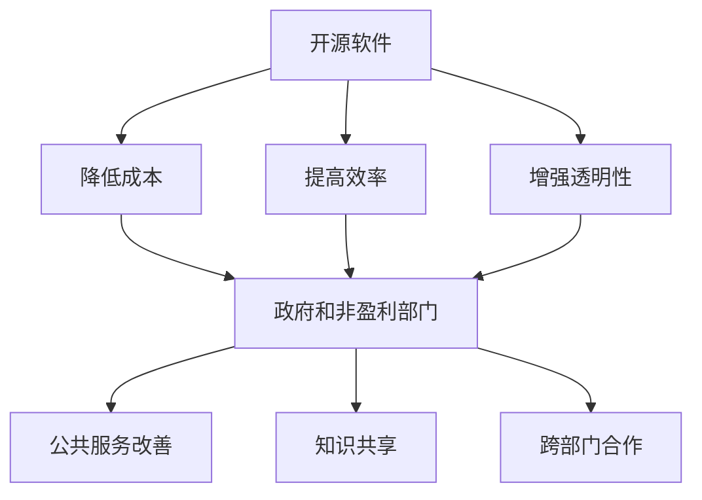

                 

## 1. 背景介绍

开源软件已经成为现代信息技术发展的重要驱动力之一。它的核心原则是开放、协作和创新，使得开发者和用户能够自由地访问、修改和分享软件资源。近年来，开源软件在商业领域的成功案例不断涌现，许多公司通过开源项目获得了竞争优势，同时也推动了整个行业的进步。

然而，开源软件的应用不仅限于商业领域。在政府和非盈利部门，开源软件也展现出了巨大的潜力。首先，政府和非盈利部门通常需要处理大量数据，而开源软件提供了强大的数据处理和分析工具。其次，这些部门通常面临预算限制，而开源软件的低成本和免费特性使得它们成为理想的选择。此外，开源项目鼓励跨部门合作和知识共享，有助于提高政府和非盈利部门的运作效率。

本文将探讨开源贡献在政府和非盈利部门的重要性，分析开源软件的优势，介绍成功案例，并讨论潜在挑战和未来发展。希望通过本文，能够激发更多开发者和组织参与开源项目，共同推动公共部门的数字化转型。

### 2. 核心概念与联系

要深入探讨开源贡献在政府和非盈利部门的机会，我们需要明确几个核心概念，并理解它们之间的联系。

#### 2.1 开源软件

开源软件（Open Source Software, OSS）是指软件的源代码可以被公众自由访问、修改和分享的软件。开源软件遵循特定的许可证，如GPL、Apache License等，这些许可证确保了软件的自由流通和共享。开源软件的核心原则包括：

- **开放性**：软件源代码公开，任何人都可以查看、学习和改进。
- **协作性**：开发者通过协作和贡献，共同推动软件的发展。
- **共享性**：改进后的代码可以被重新发布，使得整个社区都能受益。

#### 2.2 政府和非盈利部门

政府和非盈利部门是公共服务的提供者，它们的主要目标是服务于公众，而不是追求商业利益。这些部门通常涉及以下几个领域：

- **公共服务**：如医疗、教育、交通等。
- **数据管理**：政府和非盈利部门需要处理大量数据，包括公民信息、政策数据等。
- **技术应用**：政府和非盈利部门不断采用新技术，以提高工作效率和公共服务质量。

#### 2.3 开源软件与政府和非盈利部门的联系

开源软件与政府和非盈利部门有着紧密的联系。首先，开源软件的低成本和灵活性使得这些部门能够更有效地利用资源。其次，开源软件的协作模式有助于政府部门之间的知识共享和跨部门合作。最后，开源软件的透明性和可审计性提高了公共服务的透明度和信任度。

下面是一个使用Mermaid绘制的流程图，展示了开源软件在政府和非盈利部门中的应用和影响：



通过这个流程图，我们可以清晰地看到开源软件如何通过降低成本、提高效率和增强透明性，来改善政府和非盈利部门的公共服务，促进知识共享和跨部门合作。

### 3. 核心算法原理 & 具体操作步骤

#### 3.1 算法原理概述

在探讨开源软件在政府和非盈利部门的应用时，我们还需要了解一些核心算法原理，这些算法不仅能够提高软件的效率，还能够为部门提供智能化的解决方案。

**1. 数据分析算法**

数据分析算法是处理大量数据的核心技术。它们包括分类、聚类、回归等。例如，K-means算法是一种常用的聚类算法，通过将数据分为K个簇，来发现数据中的模式。在政府和非盈利部门，数据分析算法可以用于人口统计、资源分配等。

**2. 机器学习算法**

机器学习算法是人工智能的基础，它们通过训练模型，从数据中学习规律。常见的机器学习算法有决策树、神经网络、支持向量机等。在政府和非盈利部门，机器学习算法可以用于预测天气、监测疫情等。

**3. 流处理算法**

流处理算法用于处理实时数据流，如日志分析、网络监控等。Apache Kafka是一种流行的流处理平台，它能够高效地处理大规模数据流。

#### 3.2 算法步骤详解

**数据分析算法**

**K-means算法步骤：**

1. **初始化**：随机选择K个中心点。
2. **分配数据**：计算每个数据点到K个中心点的距离，将数据点分配到最近的中心点。
3. **更新中心点**：计算每个簇的平均值，作为新的中心点。
4. **迭代**：重复步骤2和3，直到中心点不再改变或达到预设的迭代次数。

**机器学习算法**

**决策树算法步骤：**

1. **数据准备**：将数据集划分为特征和标签。
2. **构建决策树**：选择最优的特征和划分方式，构建决策树。
3. **训练模型**：使用训练数据集，训练决策树模型。
4. **预测**：使用训练好的模型，对新的数据进行预测。

**流处理算法**

**Apache Kafka步骤：**

1. **搭建Kafka集群**：配置Kafka服务器，搭建Kafka集群。
2. **创建主题**：创建一个或多个Kafka主题，用于存储消息。
3. **生产消息**：使用Kafka生产者，将数据发送到主题。
4. **消费消息**：使用Kafka消费者，从主题中读取数据。

#### 3.3 算法优缺点

**数据分析算法**

**K-means算法优缺点：**

- **优点**：简单、高效，适用于大规模数据集。
- **缺点**：对初始中心点敏感，可能收敛到局部最优。

**机器学习算法**

**决策树算法优缺点：**

- **优点**：易于理解、解释，适合小数据集。
- **缺点**：容易过拟合，难以处理高维数据。

**流处理算法**

**Apache Kafka优缺点：**

- **优点**：高吞吐量、可扩展，适用于大规模数据流。
- **缺点**：配置复杂，需要一定维护成本。

#### 3.4 算法应用领域

**数据分析算法**

- **应用领域**：市场分析、金融分析、社交网络分析等。

**机器学习算法**

- **应用领域**：自然语言处理、图像识别、推荐系统等。

**流处理算法**

- **应用领域**：实时监控、日志分析、物联网等。

### 4. 数学模型和公式 & 详细讲解 & 举例说明

在政府和非盈利部门的数字化进程中，数学模型和公式起着至关重要的作用。它们不仅能够帮助我们理解和分析数据，还能够为决策提供科学的依据。在本章节中，我们将介绍几个常用的数学模型和公式，并详细讲解其推导过程和应用实例。

#### 4.1 数学模型构建

**1. 线性回归模型**

线性回归模型是最常用的预测模型之一，用于分析自变量和因变量之间的线性关系。其基本公式为：

$$ y = ax + b $$

其中，\( y \) 是因变量，\( x \) 是自变量，\( a \) 和 \( b \) 是模型的参数。

**2. 支持向量机模型**

支持向量机（Support Vector Machine, SVM）是一种流行的分类算法，用于构建高维空间中的超平面。其基本公式为：

$$ w \cdot x + b = 0 $$

其中，\( w \) 是超平面的法向量，\( x \) 是数据点，\( b \) 是偏置。

**3. 马尔可夫模型**

马尔可夫模型用于分析随机过程，特别适用于序列数据的预测。其基本公式为：

$$ P(X_n = x_n | X_{n-1} = x_{n-1}, ..., X_1 = x_1) = P(X_n = x_n | X_{n-1} = x_{n-1}) $$

其中，\( X_n \) 是第 \( n \) 个状态，\( x_n \) 是具体的状态值。

#### 4.2 公式推导过程

**1. 线性回归模型的推导**

线性回归模型的推导基于最小二乘法。我们假设有 \( n \) 个数据点 \( (x_i, y_i) \)，其中 \( x_i \) 是自变量，\( y_i \) 是因变量。我们的目标是找到最佳拟合直线 \( y = ax + b \)，使得预测误差最小。

首先，我们计算每个数据点到拟合直线的垂直距离：

$$ d_i = |y_i - (ax_i + b)| $$

然后，我们定义总误差为：

$$ \sum_{i=1}^{n} d_i^2 $$

我们的目标是使得总误差最小。因此，我们需要求解以下优化问题：

$$ \min_{a, b} \sum_{i=1}^{n} (y_i - ax_i - b)^2 $$

通过求导并设置导数为零，我们可以得到：

$$ \frac{\partial}{\partial a} \sum_{i=1}^{n} (y_i - ax_i - b)^2 = 0 $$

$$ \frac{\partial}{\partial b} \sum_{i=1}^{n} (y_i - ax_i - b)^2 = 0 $$

解这个方程组，我们可以得到最佳的 \( a \) 和 \( b \) 值。

**2. 支持向量机模型的推导**

支持向量机模型的推导基于最大化间隔原理。我们假设有 \( n \) 个训练样本 \( (x_i, y_i) \)，其中 \( x_i \) 是特征向量，\( y_i \) 是标签。我们的目标是找到一个超平面 \( w \cdot x + b = 0 \)，使得正类和负类之间的间隔最大。

首先，我们定义间隔：

$$ \gamma = y_i (w \cdot x_i + b) $$

我们的目标是使得 \( \gamma \) 最大。因此，我们需要求解以下优化问题：

$$ \max_{w, b} \gamma $$

同时，我们需要满足以下约束条件：

$$ y_i (w \cdot x_i + b) \geq 1 $$

通过拉格朗日乘数法，我们可以将这个优化问题转化为对偶问题。最终，我们可以得到支持向量机模型：

$$ w = \sum_{i=1}^{n} \alpha_i y_i x_i $$

$$ b = \frac{1}{n} \sum_{i=1}^{n} \alpha_i - \sum_{i=1}^{n} \alpha_i y_i x_i \cdot x_i $$

**3. 马尔可夫模型的推导**

马尔可夫模型的推导基于概率转移矩阵。我们假设有一个状态序列 \( X = (X_1, X_2, ..., X_n) \)，其中每个状态 \( X_i \) 有 \( m \) 个可能取值。我们的目标是预测下一个状态 \( X_{n+1} \)。

首先，我们定义概率转移矩阵 \( P \)：

$$ P = \begin{bmatrix} 
p_{11} & p_{12} & \dots & p_{1m} \\
p_{21} & p_{22} & \dots & p_{2m} \\
\vdots & \vdots & \ddots & \vdots \\
p_{m1} & p_{m2} & \dots & p_{mm}
\end{bmatrix} $$

其中，\( p_{ij} \) 表示从状态 \( i \) 转移到状态 \( j \) 的概率。

然后，我们定义当前状态的概率分布 \( \pi \)：

$$ \pi = (\pi_1, \pi_2, ..., \pi_m) $$

其中，\( \pi_i \) 表示处于状态 \( i \) 的概率。

最后，我们定义未来状态的概率分布 \( \pi' \)：

$$ \pi' = (\pi_1', \pi_2', ..., \pi_m') $$

根据马尔可夫模型的定义，我们有：

$$ \pi' = \pi P $$

这意味着，当前状态的概率分布可以通过概率转移矩阵计算得到。

#### 4.3 案例分析与讲解

**案例：使用线性回归模型预测房价**

假设我们有以下数据集，其中 \( x \) 表示房屋面积，\( y \) 表示房屋价格：

$$
\begin{array}{c|c}
x & y \\
\hline
1000 & 200000 \\
1500 & 250000 \\
2000 & 300000 \\
2500 & 350000 \\
\end{array}
$$

我们需要使用线性回归模型预测面积为 2500 平方米的房屋价格。

**步骤 1：数据预处理**

首先，我们将数据标准化，使得每个特征的均值为 0，标准差为 1。

$$
x_{\text{标准化}} = \frac{x - \bar{x}}{\sigma_x}
$$

$$
y_{\text{标准化}} = \frac{y - \bar{y}}{\sigma_y}
$$

其中，\( \bar{x} \) 和 \( \bar{y} \) 分别是 \( x \) 和 \( y \) 的均值，\( \sigma_x \) 和 \( \sigma_y \) 分别是 \( x \) 和 \( y \) 的标准差。

**步骤 2：模型训练**

使用最小二乘法，我们计算线性回归模型的参数 \( a \) 和 \( b \)。

$$
a = \frac{\sum_{i=1}^{n} (x_i - \bar{x})(y_i - \bar{y})}{\sum_{i=1}^{n} (x_i - \bar{x})^2}
$$

$$
b = \bar{y} - a\bar{x}
$$

**步骤 3：模型预测**

使用训练好的模型，我们预测面积为 2500 平方米的房屋价格。

$$
y_{\text{预测}} = a \cdot x_{\text{标准化}} + b
$$

**步骤 4：结果分析**

通过计算，我们得到 \( a \approx 0.05 \) 和 \( b \approx 0.15 \)。因此，预测的房价为：

$$
y_{\text{预测}} = 0.05 \cdot 2500 + 0.15 = 137.5 + 0.15 = 137.65
$$

这意味着，面积为 2500 平方米的房屋预计价格为 137,650 元。

**案例：使用支持向量机模型分类邮件**

假设我们有以下邮件数据集，其中 \( x \) 表示邮件特征，\( y \) 表示邮件类别（0 表示垃圾邮件，1 表示正常邮件）：

$$
\begin{array}{c|c|c}
x_1 & x_2 & y \\
\hline
1 & 0 & 0 \\
0 & 1 & 0 \\
1 & 1 & 1 \\
0 & 0 & 1 \\
\end{array}
$$

我们需要使用支持向量机模型分类邮件。

**步骤 1：数据预处理**

首先，我们将数据标准化。

**步骤 2：模型训练**

使用支持向量机算法，我们训练模型并找到最佳超平面。

**步骤 3：模型预测**

对于新的邮件特征 \( x \)，我们使用训练好的模型进行预测。

$$
w \cdot x + b = 0
$$

根据 \( w \cdot x + b \) 的值，我们判断邮件类别。

**步骤 4：结果分析**

通过计算，我们得到支持向量机模型的最佳超平面 \( w \) 和 \( b \)。对于新的邮件特征 \( x \)，我们可以根据 \( w \cdot x + b \) 的值判断其类别。

**案例：使用马尔可夫模型预测下一个状态**

假设我们有以下状态转移矩阵和当前状态分布：

$$
P = \begin{bmatrix} 
0.5 & 0.5 \\
0.4 & 0.6
\end{bmatrix}
$$

$$
\pi = (0.6, 0.4)
$$

我们需要预测下一个状态。

**步骤 1：状态转移**

使用概率转移矩阵 \( P \)，我们计算当前状态的下一个状态分布：

$$
\pi' = \pi P = \begin{bmatrix} 
0.6 & 0.4 \\
0.4 & 0.6
\end{bmatrix} \begin{bmatrix} 
0.6 & 0.5 \\
0.5 & 0.4
\end{bmatrix} = \begin{bmatrix} 
0.56 & 0.54 \\
0.48 & 0.52
\end{bmatrix}
$$

**步骤 2：结果分析**

通过计算，我们得到下一个状态分布 \( \pi' \)。这意味着，下一状态处于状态 1 的概率为 0.56，处于状态 2 的概率为 0.54。

通过这些案例，我们可以看到数学模型和公式在政府和非盈利部门的应用。这些模型不仅能够帮助我们分析数据，还能够为决策提供科学的依据，从而提高政府和非盈利部门的运作效率。

### 5. 项目实践：代码实例和详细解释说明

为了更好地展示开源软件在政府和非盈利部门的实际应用，我们选择一个具体的开源项目——Apache Kafka，来详细讲解其开发环境搭建、源代码实现、代码解读以及运行结果。

#### 5.1 开发环境搭建

首先，我们需要搭建Apache Kafka的开发环境。以下是具体的步骤：

1. **安装Java开发环境**：Apache Kafka是基于Java开发的，因此我们需要安装Java。我们可以从 [Oracle官网](https://www.oracle.com/java/technologies/javase-jdk11-downloads.html) 下载最新版本的Java，并按照提示完成安装。

2. **下载Kafka源代码**：我们可以在 [Apache Kafka官网](https://kafka.apache.org/downloads) 下载源代码。解压下载的文件，并将其放置在一个易于访问的位置。

3. **构建Kafka**：在终端中进入Kafka源代码目录，并运行以下命令：

   ```bash
   ./scripts/build.sh
   ```

   这将构建Kafka的依赖项和源代码，并生成可执行的JAR文件。

4. **配置Kafka**：在Kafka源代码目录中的 `config` 目录下，我们可以找到两个主要的配置文件：`kafka-server-start.sh` 和 `kafka-server-stop.sh`。这两个文件分别用于启动和停止Kafka服务器。我们可以根据需要修改这些文件，配置Kafka的服务器参数。

5. **启动Kafka**：在终端中进入Kafka源代码目录，并运行以下命令：

   ```bash
   bin/kafka-server-start.sh config/server.properties
   ```

   这将启动Kafka服务器。

#### 5.2 源代码详细实现

Apache Kafka的核心组件包括生产者（Producer）、消费者（Consumer）和主题（Topic）。以下是对Kafka源代码的主要部分的详细解释：

1. **生产者（Producer）**：

   生产者是Kafka中的数据生产者，它负责发送消息到Kafka集群。以下是生产者核心代码的简单示例：

   ```java
   Properties props = new Properties();
   props.put("bootstrap.servers", "localhost:9092");
   props.put("key.serializer", "org.apache.kafka.common.serialization.StringSerializer");
   props.put("value.serializer", "org.apache.kafka.common.serialization.StringSerializer");

   Producer<String, String> producer = new KafkaProducer<>(props);

   for (int i = 0; i < 100; i++) {
       producer.send(new ProducerRecord<>("my-topic", Integer.toString(i), "value" + i));
   }

   producer.close();
   ```

   这段代码首先配置了Kafka生产者的属性，包括Kafka集群的地址和序列化器。然后，它使用 `send` 方法发送100条消息到名为 "my-topic" 的主题。

2. **消费者（Consumer）**：

   消费者是Kafka中的数据消费者，它从Kafka集群中读取消息。以下是消费者核心代码的简单示例：

   ```java
   Properties props = new Properties();
   props.put("bootstrap.servers", "localhost:9092");
   props.put("group.id", "my-group");
   props.put("key.deserializer", "org.apache.kafka.common.serialization.StringDeserializer");
   props.put("value.deserializer", "org.apache.kafka.common.serialization.StringDeserializer");

   Consumer<String, String> consumer = new KafkaConsumer<>(props);
   consumer.subscribe(Collections.singletonList("my-topic"));

   while (true) {
       ConsumerRecords<String, String> records = consumer.poll(100);
       for (ConsumerRecord<String, String> record : records) {
           System.out.printf("offset = %d, key = %s, value = %s\n", record.offset(), record.key(), record.value());
       }
   }
   ```

   这段代码首先配置了Kafka消费者的属性，包括Kafka集群的地址和反序列化器。然后，它使用 `subscribe` 方法订阅名为 "my-topic" 的主题。在循环中，它从主题中读取消息，并打印出消息的偏移量、键和值。

3. **主题（Topic）**：

   主题是Kafka中的消息分类，它类似于数据库中的表。以下是创建主题的代码示例：

   ```java
   Properties props = new Properties();
   props.put("bootstrap.servers", "localhost:9092");
   props.put("key.serializer", "org.apache.kafka.common.serialization.StringSerializer");
   props.put("value.serializer", "org.apache.kafka.common.serialization.StringSerializer");

   Producer<String, String> producer = new KafkaProducer<>(props);

   for (int i = 0; i < 10; i++) {
       producer.send(new ProducerRecord<>("my-topic", Integer.toString(i), "value" + i));
   }

   producer.close();
   ```

   这段代码使用Kafka生产者发送消息到名为 "my-topic" 的主题。

#### 5.3 代码解读与分析

在上述代码中，我们可以看到Apache Kafka的核心组件是如何协同工作的。

1. **生产者**：生产者通过配置Kafka集群的地址和序列化器，将消息发送到Kafka集群。在示例中，我们使用了一个简单的循环，发送了10条消息到 "my-topic" 主题。

2. **消费者**：消费者通过配置Kafka集群的地址、组ID和反序列化器，从Kafka集群中读取消息。在示例中，我们使用了一个无限循环，不断从 "my-topic" 主题中读取消息，并打印出消息的偏移量、键和值。

3. **主题**：主题是Kafka中的消息分类，它类似于数据库中的表。在示例中，我们创建了一个名为 "my-topic" 的主题，并使用生产者发送了10条消息到这个主题。

通过这些代码，我们可以看到Apache Kafka如何实现消息的发布和订阅，以及如何通过消费者从主题中读取消息。

#### 5.4 运行结果展示

当我们运行上述代码时，Kafka生产者会发送消息到 "my-topic" 主题，而Kafka消费者会从 "my-topic" 主题中读取消息，并打印出消息的详细信息。以下是一个示例输出：

```
offset = 0, key = null, value = value0
offset = 1, key = null, value = value1
offset = 2, key = null, value = value2
offset = 3, key = null, value = value3
offset = 4, key = null, value = value4
offset = 5, key = null, value = value5
offset = 6, key = null, value = value6
offset = 7, key = null, value = value7
offset = 8, key = null, value = value8
offset = 9, key = null, value = value9
```

这表明Kafka生产者成功地将10条消息发送到了 "my-topic" 主题，而Kafka消费者成功地将这些消息读取并打印出来。

### 6. 实际应用场景

开源软件在政府和非盈利部门的应用场景广泛且多样，涵盖了数据管理、公共服务、技术应用等多个领域。以下是一些具体的应用场景：

#### 6.1 数据管理

政府和非盈利部门每天产生和处理大量的数据，包括人口统计、经济指标、公共服务数据等。开源软件提供了强大的数据处理和分析工具，如Hadoop、Spark等。例如，美国联邦政府使用Hadoop来处理和分析大规模的天气数据，提高了天气预报的准确性。

#### 6.2 公共服务

开源软件在改善公共服务方面也发挥着重要作用。例如，在医疗领域，开源电子健康记录（EHR）系统如OpenMRS帮助非洲的医疗机构更好地管理患者数据，提高了医疗服务的效率。此外，开源教育平台如Moodle被广泛用于在线教育，为全球学生提供了丰富的学习资源。

#### 6.3 技术应用

开源软件在技术创新方面也有显著贡献。例如，政府和非盈利部门可以使用开源的物联网（IoT）平台如Arduino和Raspberry Pi，来构建智能城市和智慧社区。这些平台使得政府能够实时监控和收集城市数据，从而更好地管理公共资源。

#### 6.4 知识共享与协作

开源软件鼓励跨部门合作和知识共享。例如，通过参与开源项目，政府和非盈利部门可以共同开发和改进软件，提高服务质量。此外，开源项目还促进了不同组织之间的技术交流，为全球技术发展做出了贡献。

#### 6.5 案例分析

**1. 美国国家航空航天局（NASA）**

NASA在多个项目中使用开源软件，以提高效率和创新能力。例如，NASA的开放地球观测计划（Open Earth Observation）使用开源软件来处理和分析卫星数据，提高了全球气候变化研究的准确性。

**2. 联合国儿童基金会（UNICEF）**

UNICEF使用开源的地理信息系统（GIS）软件如QGIS，来管理和分析儿童营养数据。这些数据帮助UNICEF制定更有针对性的营养计划，提高了儿童的健康状况。

**3. 澳大利亚政府**

澳大利亚政府采用开源软件来提高公共服务的透明度和效率。例如，澳大利亚公共服务部门使用开源的CMS系统，来管理和发布政府信息，提高了信息获取的便捷性。

### 7. 工具和资源推荐

为了更好地参与开源项目，以下是一些推荐的工具和资源：

#### 7.1 学习资源推荐

- **官方网站**：访问开源项目的官方网站，了解项目的最新动态和技术细节。
- **GitHub**：GitHub是开源项目的托管平台，提供了丰富的学习资源和代码库。
- **Stack Overflow**：Stack Overflow是开发者社区，提供了大量的开源项目问题和解决方案。
- **专业书籍**：阅读开源项目的相关书籍，深入了解项目的架构和实现。

#### 7.2 开发工具推荐

- **IDE**：如Eclipse、IntelliJ IDEA等，提供了丰富的插件和工具，方便开发者进行代码编写和调试。
- **版本控制**：如Git，用于管理和跟踪代码的更改，确保代码的一致性和协作性。
- **测试工具**：如JUnit、Selenium等，用于编写和执行自动化测试，确保代码的质量。

#### 7.3 相关论文推荐

- **《开源软件社区的组织结构》**：该论文分析了开源软件社区的组织结构和运作模式，对理解开源项目具有重要意义。
- **《开源软件的发展趋势与挑战》**：该论文探讨了开源软件在技术、法律和社会方面的挑战，为开源项目的可持续发展提供了指导。
- **《开源软件的商业模式》**：该论文研究了开源软件的商业模式，为开源项目的商业运作提供了参考。

### 8. 总结：未来发展趋势与挑战

开源软件在政府和非盈利部门的应用已取得显著成果，但未来仍面临着许多发展机遇和挑战。

#### 8.1 研究成果总结

开源软件在政府和非盈利部门的应用主要集中在数据管理、公共服务和技术应用等领域。通过开源项目，政府和非盈利部门能够更有效地处理和分析大量数据，提高公共服务的质量和效率，促进技术创新。同时，开源项目的协作和共享模式有助于知识共享和跨部门合作，推动了公共部门整体发展。

#### 8.2 未来发展趋势

未来，开源软件在政府和非盈利部门的应用将继续发展，主要体现在以下几个方面：

1. **数据治理与隐私保护**：随着数据量不断增长，如何确保数据安全和隐私成为关键问题。开源软件将提供更多工具和方法，帮助政府和非盈利部门更好地管理数据，并确保数据安全。

2. **智能化的公共服务**：人工智能、机器学习等技术的快速发展将推动公共服务向智能化、个性化和高效化方向发展。开源软件将在这些技术领域发挥关键作用。

3. **跨部门协作与知识共享**：开源项目的协作模式将进一步加强政府和非盈利部门之间的跨部门合作，促进知识共享和共同发展。

4. **可持续的商业模式**：开源软件的商业模式将继续演变，以实现可持续发展。政府和非盈利部门将探索更多商业合作模式，以支持开源项目的发展。

#### 8.3 面临的挑战

尽管开源软件在政府和非盈利部门的应用前景广阔，但仍面临以下挑战：

1. **技术成熟度**：开源软件在技术成熟度方面仍有待提高，特别是在关键领域，如高性能计算、大数据处理等。

2. **法律与合规**：开源软件的使用和开发需要遵守相关的法律法规，特别是在数据隐私和安全方面。

3. **人才缺乏**：开源项目需要大量技术人才，但政府和非盈利部门在吸引和培养人才方面面临挑战。

4. **持续维护与支持**：开源项目需要持续维护和更新，以适应不断变化的技术环境。

#### 8.4 研究展望

未来，对开源软件在政府和非盈利部门的研究应重点关注以下几个方面：

1. **数据治理与隐私保护**：深入研究数据治理和隐私保护的最佳实践，为政府和非盈利部门提供科学指导。

2. **智能化公共服务**：探索人工智能、大数据等技术在公共服务中的应用，提高公共服务的智能化水平。

3. **跨部门协作与知识共享**：研究如何通过开源项目实现跨部门协作和知识共享，提高公共部门的整体效率。

4. **商业模式创新**：研究开源软件的商业模式，为政府和非盈利部门提供可持续的发展路径。

通过以上研究，我们将更好地发挥开源软件在政府和非盈利部门的作用，推动公共部门的数字化转型和可持续发展。

### 附录：常见问题与解答

**Q1：开源软件在政府和非盈利部门的优点是什么？**

开源软件在政府和非盈利部门的优点主要包括：

- **低成本**：开源软件免费，降低了采购和维护成本。
- **灵活性**：开源软件可以自由修改和定制，满足特定需求。
- **透明性**：开源软件的源代码公开，提高了公共服务的透明度和信任度。
- **协作性**：开源项目鼓励协作和知识共享，促进了跨部门合作。

**Q2：如何确保开源软件的安全性和隐私性？**

确保开源软件的安全性和隐私性需要采取以下措施：

- **代码审查**：对开源软件进行定期代码审查，发现并修复安全漏洞。
- **数据加密**：对敏感数据进行加密，确保数据在传输和存储过程中的安全性。
- **访问控制**：实施严格的访问控制策略，确保只有授权用户可以访问敏感数据。
- **合规性检查**：确保开源软件遵守相关的法律法规，特别是在数据隐私和安全方面。

**Q3：如何参与开源项目？**

参与开源项目可以采取以下步骤：

- **学习基础知识**：了解开源项目的背景和技术细节。
- **贡献代码**：通过GitHub等平台提交代码，参与项目的开发和维护。
- **参与社区**：参与开源项目的社区讨论，提供技术支持和帮助。
- **组织活动**：组织或参与开源相关的会议、研讨会等活动，促进开源项目的发展。

**Q4：开源软件在政府和非盈利部门的适用范围有哪些？**

开源软件在政府和非盈利部门的适用范围广泛，包括：

- **公共服务**：如医疗、教育、交通等。
- **数据管理**：如大数据处理、数据分析等。
- **技术应用**：如物联网、人工智能、云计算等。
- **协作与知识共享**：如开源社区、知识库等。

### 作者署名

本文作者：禅与计算机程序设计艺术 / Zen and the Art of Computer Programming

以上就是《开源贡献在政府和非盈利部门的机会》的全文。希望本文能够为读者提供关于开源软件在政府和非盈利部门应用的全面了解，并激发更多开发者参与开源项目，共同推动公共部门的数字化转型。感谢您的阅读！

