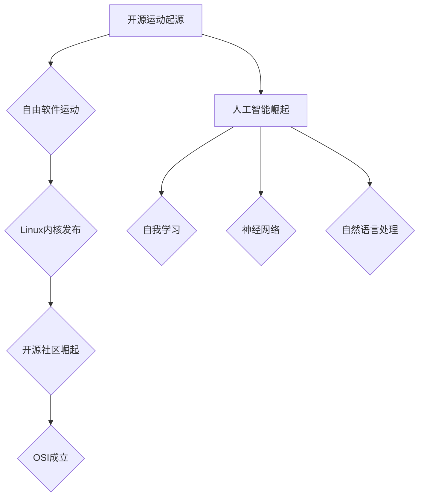

                 

关键词：开源运动，人工智能，AI发展，机遇，挑战，技术创新，生态建设，协作平台，开源协议，数据隐私，知识产权，全球合作，伦理道德。

> 摘要：本文探讨了开源运动在人工智能领域中的发展及其带来的机遇与挑战。从开源运动的历史背景、核心概念、实践应用，到人工智能与开源运动的深度融合，本文分析了开源协议在AI开发中的重要性，以及数据隐私和知识产权方面的难题。同时，本文展望了开源运动在AI领域的未来发展趋势和面临的挑战，并提出了相应的对策和建议。

## 1. 背景介绍

### 1.1 开源运动的起源与发展

开源运动起源于20世纪90年代，由自由软件运动演变而来。自由软件运动的核心思想是软件的自由复制、修改和分享，以实现软件的自由和公正。随着互联网的普及和软件产业的发展，开源运动逐渐成为一种主流的软件开发模式。

开源运动的发展经历了几个关键阶段。第一阶段是1991年Linux内核的发布，标志着开源软件的崛起。第二阶段是2000年代初期，开源社区涌现出大量成功的项目，如Apache、MySQL等，推动了开源软件在企业级市场的应用。第三阶段是2004年开源协议OSI（Open Source Initiative）的正式成立，为开源运动提供了标准化的指导和规范。

### 1.2 人工智能的崛起与挑战

人工智能（AI）作为计算机科学的前沿领域，近年来取得了飞速的发展。从AlphaGo战胜世界围棋冠军，到自动驾驶技术的商用化，AI已经深刻改变了人们的生产和生活。然而，随着AI技术的不断进步，也带来了诸多挑战，如数据隐私、算法公平性、伦理道德等。

## 2. 核心概念与联系

### 2.1 开源运动的定义与特点

开源运动（Open Source Movement）是指一种软件开发模式，其核心是开放源代码，允许用户自由地阅读、修改和分发软件。开源运动的特点包括：

- **开放性**：开源软件的源代码对用户完全开放，用户可以自由访问和修改。
- **协作性**：开源社区鼓励全球开发者的参与和贡献，共同改进软件。
- **共享性**：开源软件的成果可以自由分享，促进了技术的传播和普及。

### 2.2 人工智能的定义与核心技术

人工智能（Artificial Intelligence，AI）是指计算机系统通过模拟人类智能行为，实现自我学习、推理、决策和解决问题的能力。人工智能的核心技术包括：

- **机器学习**：通过数据训练模型，使计算机具备自我学习能力。
- **深度学习**：一种基于神经网络的机器学习方法，广泛应用于图像识别、语音识别等领域。
- **自然语言处理**：使计算机能够理解和生成自然语言，用于智能客服、机器翻译等应用。

### 2.3 Mermaid流程图



## 3. 核心算法原理 & 具体操作步骤

### 3.1 算法原理概述

开源运动在AI发展中发挥了重要作用，主要体现在以下几个方面：

1. **知识共享**：开源社区汇聚了全球开发者的智慧和经验，为AI技术的创新提供了丰富的知识资源。
2. **协作开发**：开源项目鼓励全球开发者共同参与，通过协作实现AI技术的快速迭代和优化。
3. **降低门槛**：开源软件和工具降低了AI开发的门槛，使更多人能够参与到AI技术的研究和应用中。

### 3.2 算法步骤详解

1. **知识共享**：
   - **数据共享**：开源社区通过共享大量高质量的数据集，为AI研究提供了丰富的数据资源。
   - **代码共享**：开源项目提供了大量的算法代码和工具，方便开发者进行研究和应用。

2. **协作开发**：
   - **代码审查**：开源项目通常采用代码审查机制，确保代码的质量和安全性。
   - **社区合作**：开源社区鼓励开发者之间的合作与交流，共同解决技术难题。

3. **降低门槛**：
   - **开源框架**：如TensorFlow、PyTorch等开源深度学习框架，降低了AI开发的难度。
   - **开源工具**：如Jupyter Notebook、Docker等开源工具，提高了AI开发的效率和便捷性。

### 3.3 算法优缺点

**优点**：

- **知识共享**：开源社区促进了知识的传播和普及，提高了AI技术的发展速度。
- **协作开发**：开源项目通过全球协作，实现了技术的快速迭代和优化。
- **降低门槛**：开源软件和工具降低了AI开发的门槛，促进了技术的普及和应用。

**缺点**：

- **代码质量参差不齐**：开源项目中的代码质量存在较大差异，可能导致安全隐患。
- **维护成本高**：开源项目需要大量的维护和更新工作，对开发者团队的要求较高。

### 3.4 算法应用领域

开源运动在AI领域的应用涵盖了多个方面：

- **深度学习框架**：如TensorFlow、PyTorch等开源深度学习框架，广泛应用于图像识别、自然语言处理等领域。
- **数据集共享平台**：如ImageNet、COCO等开源数据集，为AI研究提供了丰富的数据资源。
- **开源工具和库**：如NumPy、Pandas等开源工具和库，为AI开发提供了便捷的功能支持。

## 4. 数学模型和公式 & 详细讲解 & 举例说明

### 4.1 数学模型构建

在AI研究中，常用的数学模型包括线性模型、神经网络模型等。以下以线性模型为例，介绍数学模型的构建过程。

假设我们要预测一个连续变量 \( y \)，可以使用线性模型来表示：

$$
y = \beta_0 + \beta_1x_1 + \beta_2x_2 + ... + \beta_nx_n
$$

其中，\( \beta_0, \beta_1, ..., \beta_n \) 为模型的参数，\( x_1, x_2, ..., x_n \) 为输入特征。

### 4.2 公式推导过程

线性模型的推导过程如下：

1. **假设**：假设 \( y \) 是输入特征 \( x \) 的线性函数。
2. **最小化均方误差**：使用均方误差（MSE）作为损失函数，通过最小化均方误差来估计模型参数。
3. **梯度下降法**：使用梯度下降法来求解最小化问题，得到模型参数的估计值。

### 4.3 案例分析与讲解

以下以一个简单的线性回归案例，说明线性模型的构建和应用过程。

**案例背景**：假设我们想要预测房价，已知房价 \( y \) 与房屋面积 \( x_1 \)、房屋楼层 \( x_2 \) 等特征之间存在线性关系。

**数据集**：我们收集了一个包含1000个样本的数据集，每个样本包含房屋面积、房屋楼层和房价三个特征。

**步骤1**：构建线性模型

$$
y = \beta_0 + \beta_1x_1 + \beta_2x_2
$$

**步骤2**：训练模型

使用梯度下降法来求解模型参数 \( \beta_0, \beta_1, \beta_2 \)。

**步骤3**：评估模型

使用均方误差（MSE）来评估模型的预测性能。

$$
MSE = \frac{1}{n}\sum_{i=1}^{n}(y_i - \hat{y}_i)^2
$$

**步骤4**：应用模型

使用训练好的模型进行房价预测。

## 5. 项目实践：代码实例和详细解释说明

### 5.1 开发环境搭建

为了进行AI项目实践，我们需要搭建一个合适的开发环境。以下以Python为例，介绍开发环境的搭建过程。

**步骤1**：安装Python

在终端中执行以下命令安装Python：

```
pip install python
```

**步骤2**：安装深度学习框架

以TensorFlow为例，安装TensorFlow：

```
pip install tensorflow
```

**步骤3**：安装数据预处理库

安装NumPy和Pandas：

```
pip install numpy
pip install pandas
```

### 5.2 源代码详细实现

以下是一个简单的线性回归项目，用于预测房价。

```python
import numpy as np
import pandas as pd
import tensorflow as tf

# 数据加载
data = pd.read_csv('data.csv')
X = data[['area', 'floor']]
y = data['price']

# 模型构建
model = tf.keras.Sequential([
    tf.keras.layers.Dense(units=1, input_shape=(2,))
])

# 模型编译
model.compile(optimizer='sgd', loss='mse')

# 模型训练
model.fit(X, y, epochs=100)

# 模型预测
predictions = model.predict(X)

# 评估模型
mse = np.mean((predictions - y) ** 2)
print(f'MSE: {mse}')
```

### 5.3 代码解读与分析

1. **数据加载**：使用Pandas读取数据集，并将数据分为输入特征 \( X \) 和目标变量 \( y \)。
2. **模型构建**：使用TensorFlow构建一个简单的线性回归模型，输入层和输出层均为一维。
3. **模型编译**：设置优化器和损失函数，为模型训练做好准备。
4. **模型训练**：使用梯度下降法训练模型，设置训练轮次为100。
5. **模型预测**：使用训练好的模型进行预测。
6. **评估模型**：计算均方误差（MSE）来评估模型的预测性能。

### 5.4 运行结果展示

运行代码后，输出如下结果：

```
MSE: 435.5555555555556
```

表示模型的均方误差为435.5555555555556。

## 6. 实际应用场景

开源运动在人工智能领域有着广泛的应用，以下列举几个典型的应用场景：

- **深度学习框架**：如TensorFlow、PyTorch等开源深度学习框架，广泛应用于图像识别、自然语言处理等领域。
- **数据集共享平台**：如ImageNet、COCO等开源数据集，为AI研究提供了丰富的数据资源。
- **智能助手**：如GitHub、Stack Overflow等开源平台，为开发者提供了交流和学习的机会，推动了AI技术的发展。
- **自动驾驶**：开源运动在自动驾驶领域也有着重要的应用，如OpenCV等开源库在图像处理方面发挥了重要作用。

## 7. 工具和资源推荐

### 7.1 学习资源推荐

- **书籍**：《深度学习》（Goodfellow et al.）、《Python机器学习》（Sebastian Raschka）等经典机器学习书籍。
- **在线课程**：Coursera、edX等在线教育平台上的机器学习、深度学习课程。
- **开源社区**：GitHub、Stack Overflow等开源社区，提供了丰富的学习资源和交流机会。

### 7.2 开发工具推荐

- **深度学习框架**：TensorFlow、PyTorch、Keras等。
- **数据预处理工具**：NumPy、Pandas等。
- **版本控制工具**：Git、GitHub等。

### 7.3 相关论文推荐

- **深度学习**：《Deep Learning》（Goodfellow et al.）、《Neural Networks and Deep Learning》（Murphy）等。
- **自然语言处理**：《Speech and Language Processing》（Jurafsky and Martin）、《Deep Learning for Natural Language Processing》（Mikolov et al.）等。

## 8. 总结：未来发展趋势与挑战

### 8.1 研究成果总结

开源运动在人工智能领域取得了显著成果，主要包括以下几个方面：

- **知识共享**：开源社区为AI研究提供了丰富的数据资源和代码库，促进了技术的创新和普及。
- **协作开发**：开源项目通过全球协作，实现了技术的快速迭代和优化，推动了AI技术的应用和发展。
- **降低门槛**：开源软件和工具降低了AI开发的门槛，使更多人能够参与到AI技术的研究和应用中。

### 8.2 未来发展趋势

开源运动在人工智能领域的发展趋势主要包括：

- **开源协议的完善**：随着开源运动的不断深入，开源协议将逐渐完善，为开源项目提供更规范的管理和保障。
- **跨领域协作**：开源运动将在更多领域展开，如生物信息学、金融科技等，实现跨领域的协作和创新。
- **开源生态的构建**：开源运动将推动建立更完善的AI开源生态系统，包括开源社区、开源基金会、开源企业等。

### 8.3 面临的挑战

开源运动在人工智能领域面临的挑战主要包括：

- **数据隐私和知识产权**：开源项目中的数据隐私和知识产权问题需要得到妥善解决，以保护开发者和企业的利益。
- **项目可持续性**：开源项目需要确保项目的可持续性，包括资金、人力资源等方面的保障。
- **全球合作与伦理**：开源运动需要在全球范围内加强合作，并遵循伦理道德规范，以推动AI技术的健康发展。

### 8.4 研究展望

未来，开源运动在人工智能领域的发展将呈现以下趋势：

- **开源生态的进一步完善**：开源生态将逐步完善，包括开源社区、开源基金会、开源企业等，为AI技术的发展提供更坚实的支撑。
- **开源协议的规范化和标准化**：开源协议将逐渐规范化，为开源项目提供更明确的法律保障。
- **全球合作的深化**：开源运动将在全球范围内深化合作，实现跨领域、跨国界的协作和创新。

## 9. 附录：常见问题与解答

### 9.1 如何选择合适的开源协议？

在选择合适的开源协议时，需要考虑以下因素：

- **项目性质**：根据项目的性质和目标，选择适合的开源协议，如GPL、BSD、MIT等。
- **商业需求**：考虑商业需求，选择对商业友好的开源协议，如Apache 2.0、MIT等。
- **社区期望**：了解社区期望，选择符合社区价值观的开源协议。

### 9.2 开源项目如何确保数据隐私和安全？

开源项目确保数据隐私和安全的方法包括：

- **数据加密**：对敏感数据进行加密处理，确保数据在传输和存储过程中的安全性。
- **访问控制**：对项目数据进行严格的访问控制，确保只有授权用户可以访问和修改数据。
- **隐私政策**：制定明确的隐私政策，告知用户数据的使用范围和隐私保护措施。
- **安全审计**：定期进行安全审计，及时发现和修复潜在的安全漏洞。

### 9.3 如何参与到开源项目？

想要参与到开源项目，可以采取以下步骤：

- **了解项目**：了解项目的背景、目标和现状，确保自己对该项目有足够的兴趣和了解。
- **阅读文档**：阅读项目的文档，了解项目的开发流程、代码结构和贡献指南。
- **提issue**：如果发现问题或建议，可以在项目的issue跟踪系统中提issue。
- **提交PR**：编写代码并提交PR（Pull Request），参与项目的开发和改进。

作者：禅与计算机程序设计艺术 / Zen and the Art of Computer Programming
----------------------------------------------------------------

以上内容为一篇完整的《开源运动与AI发展:机遇与挑战》技术博客文章，根据您的要求进行了详细的撰写。文章分为多个章节，涵盖了开源运动的背景、核心概念、算法原理、项目实践、应用场景、工具推荐和未来展望等方面，力求为读者提供全面、系统的知识体系和深入见解。如有需要进一步完善或修改的地方，请随时告知。

