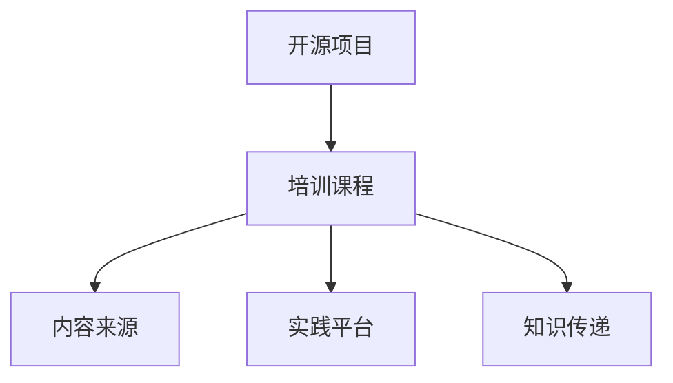

                 

关键词：开源项目，企业培训，开发策略，营销策略，成功案例

> 摘要：本文旨在探讨如何为企业开发开源项目构建有效的培训课程，包括开发和营销两个关键方面。通过分析开源项目的成功案例，本文提供了详细的策略和步骤，以帮助企业更好地利用开源项目进行培训，提升员工技能和公司竞争力。

## 1. 背景介绍

在当今快速变化的技术环境中，开源项目已成为企业技术创新和知识共享的重要途径。许多企业通过参与开源项目，不仅可以提高员工技能，还能增强公司技术创新能力和市场竞争力。然而，如何有效地开发和营销开源项目，特别是将其纳入企业培训课程，成为许多企业面临的一大挑战。

### 1.1 开源项目在企业培训中的重要性

开源项目为企业提供了以下几个方面的优势：

- **技能提升**：参与开源项目可以让员工接触最新的技术趋势，提升编程和软件开发技能。
- **知识共享**：开源项目鼓励知识共享和协作，有助于企业内部知识的传递和积累。
- **品牌建设**：成功的开源项目可以提升企业的品牌知名度和行业影响力。
- **技术创新**：通过开源项目，企业可以快速迭代和改进技术，保持竞争优势。

### 1.2 企业培训面临的挑战

尽管开源项目具有诸多优势，但企业在将其纳入培训课程时仍面临以下挑战：

- **技术门槛**：开源项目通常涉及复杂的编程和技术知识，对员工的技术背景要求较高。
- **项目选择**：如何选择适合企业需求和员工水平的开源项目，是一个重要且具有挑战性的问题。
- **时间管理**：开源项目通常需要持续的投入和维护，如何在繁忙的工作中安排培训时间是一个难题。
- **激励机制**：如何激发员工的参与热情和持续贡献，是企业需要考虑的另一个关键问题。

## 2. 核心概念与联系

在探讨如何为企业开发开源项目构建培训课程之前，我们需要了解一些核心概念和它们之间的关系。

### 2.1 开源项目的定义和分类

开源项目是指软件开发过程中，允许用户自由查看、修改和分发源代码的项目。根据参与度和贡献度，开源项目可以分为以下几类：

- **社区主导型**：由社区成员主导的项目，如Linux内核。
- **企业主导型**：由特定企业主导的项目，如阿里巴巴的Apache RocketMQ。
- **混合型**：既包括社区主导也包含企业主导的项目，如Apache软件基金会。

### 2.2 开源项目与培训课程的关系

开源项目可以作为培训课程的重要资源，具体关系如下：

- **内容来源**：开源项目的文档、代码和技术讨论可以作为培训课程的教材和参考资料。
- **实践平台**：开源项目提供了一个实践平台，员工可以通过实际参与项目来提升技能。
- **知识传递**：通过参与开源项目，员工不仅能够学到新技术，还能将所学知识在企业内部传播。

### 2.3 Mermaid 流程图

以下是开源项目与培训课程关系的 Mermaid 流程图：



## 3. 核心算法原理 & 具体操作步骤

### 3.1 算法原理概述

在开发开源项目的培训课程中，核心算法原理的理解和应用至关重要。以下是一个简单的算法原理概述，以帮助读者更好地理解如何将开源项目与培训课程相结合。

### 3.2 算法步骤详解

#### 3.2.1 项目选择

- **需求分析**：分析企业需求，确定开源项目的类型和方向。
- **资源评估**：评估开源项目的活跃度、社区支持程度和技术成熟度。
- **项目筛选**：根据需求评估结果，选择适合企业培训的开源项目。

#### 3.2.2 培训课程设计

- **课程规划**：根据开源项目的特点，设计培训课程的内容和结构。
- **教学材料**：编写课程教材，包括项目概述、技术细节和操作指南。
- **教学资源**：收集和整理与开源项目相关的文档、代码和技术讨论。

#### 3.2.3 培训实施

- **项目介绍**：为员工介绍开源项目的背景和重要性。
- **技术讲解**：详细讲解开源项目的技术原理和操作步骤。
- **实践操作**：提供实际操作机会，让员工动手实践。
- **问题讨论**：鼓励员工提问和参与技术讨论。

#### 3.2.4 效果评估

- **课程反馈**：收集员工对培训课程的反馈，了解课程效果。
- **技能评估**：通过考核和项目评审，评估员工技能提升情况。

### 3.3 算法优缺点

#### 优点

- **灵活性强**：开源项目可以根据企业需求进行调整和定制。
- **资源丰富**：开源项目提供了丰富的学习资源和实践机会。
- **社区支持**：开源项目通常有活跃的社区支持，有助于解决问题和获取帮助。

#### 缺点

- **技术门槛**：开源项目可能涉及复杂的技术知识，对员工技能有较高要求。
- **时间投入**：开源项目需要持续的投入和维护，可能影响员工的工作进度。

### 3.4 算法应用领域

- **软件开发**：开源项目是软件开发的重要资源，可以用于技能提升和知识共享。
- **企业培训**：开源项目可以作为企业培训的课程内容，提高员工技能和团队协作能力。
- **技术创新**：通过参与开源项目，企业可以快速迭代和改进技术，保持竞争优势。

## 4. 数学模型和公式 & 详细讲解 & 举例说明

在开源项目的培训课程中，数学模型和公式是理解和应用技术知识的重要工具。以下是一个简单的数学模型和公式的讲解，以帮助读者更好地掌握相关技术。

### 4.1 数学模型构建

假设我们有一个开源项目，它的核心算法是基于机器学习的分类算法。我们可以使用以下数学模型来构建该算法：

$$
\begin{aligned}
y &= f(x) \\
f &= \arg\min_{\theta} J(\theta) \\
J(\theta) &= \frac{1}{2m} \sum_{i=1}^{m} (h_\theta(x^{(i)}) - y^{(i)})^2
\end{aligned}
$$

其中，$y$ 是实际输出，$f$ 是预测函数，$h_\theta(x)$ 是假设函数，$\theta$ 是参数，$J(\theta)$ 是代价函数。

### 4.2 公式推导过程

- **假设函数**：假设函数 $h_\theta(x)$ 用于预测输出。在分类问题中，假设函数通常是一个线性函数。

$$
h_\theta(x) = \theta_0 + \theta_1x_1 + \theta_2x_2 + ... + \theta_nx_n
$$

- **代价函数**：代价函数 $J(\theta)$ 用于评估假设函数的误差。在这里，我们使用平方误差代价函数。

$$
J(\theta) = \frac{1}{2m} \sum_{i=1}^{m} (h_\theta(x^{(i)}) - y^{(i)})^2
$$

其中，$m$ 是样本数量。

### 4.3 案例分析与讲解

假设我们有一个简单的二分类问题，其中输入特征是 $x_1$ 和 $x_2$，输出标签是 $y$。我们使用线性回归模型来预测输出标签。

- **假设函数**：

$$
h_\theta(x) = \theta_0 + \theta_1x_1 + \theta_2x_2
$$

- **代价函数**：

$$
J(\theta) = \frac{1}{2m} \sum_{i=1}^{m} (h_\theta(x^{(i)}) - y^{(i)})^2
$$

- **梯度下降算法**：为了最小化代价函数 $J(\theta)$，我们可以使用梯度下降算法。

$$
\theta_j := \theta_j - \alpha \frac{\partial J(\theta)}{\partial \theta_j}
$$

其中，$\alpha$ 是学习率。

- **迭代过程**：通过迭代更新参数 $\theta$，我们可以找到使代价函数 $J(\theta)$ 最小的参数。

$$
\begin{aligned}
\theta_0 &= \theta_0 - \alpha \frac{1}{m} \sum_{i=1}^{m} (h_\theta(x^{(i)}) - y^{(i)}) \\
\theta_1 &= \theta_1 - \alpha \frac{1}{m} \sum_{i=1}^{m} (h_\theta(x^{(i)}) - y^{(i)})x_1^{(i)} \\
\theta_2 &= \theta_2 - \alpha \frac{1}{m} \sum_{i=1}^{m} (h_\theta(x^{(i)}) - y^{(i)})x_2^{(i)}
\end{aligned}
$$

## 5. 项目实践：代码实例和详细解释说明

### 5.1 开发环境搭建

在本节中，我们将搭建一个基于Python的TensorFlow开源项目开发环境。以下是具体步骤：

1. **安装Python**：确保系统中已安装Python 3.7及以上版本。
2. **安装TensorFlow**：通过pip命令安装TensorFlow。

```
pip install tensorflow
```

3. **验证安装**：运行以下代码，验证TensorFlow是否安装成功。

```python
import tensorflow as tf
print(tf.__version__)
```

### 5.2 源代码详细实现

在本节中，我们将实现一个简单的线性回归模型，用于预测房价。以下是源代码：

```python
import tensorflow as tf
import numpy as np

# 设置随机种子
tf.random.set_seed(42)

# 准备数据
x = np.random.rand(100, 1)
y = 2 * x + 1 + np.random.randn(100, 1)

# 构建模型
model = tf.keras.Sequential([
    tf.keras.layers.Dense(units=1, input_shape=(1,))
])

# 编译模型
model.compile(optimizer='sgd', loss='mean_squared_error')

# 训练模型
model.fit(x, y, epochs=100)

# 预测
predictions = model.predict(x)

# 输出预测结果
print(predictions)
```

### 5.3 代码解读与分析

1. **导入库**：首先，我们导入 TensorFlow 和 NumPy 库。

2. **设置随机种子**：通过 `tf.random.set_seed(42)` 设置随机种子，确保结果可重复。

3. **准备数据**：我们生成一个随机数据集，其中 $x$ 是输入特征，$y$ 是输出标签。

4. **构建模型**：使用 `tf.keras.Sequential` 创建一个线性回归模型。这里我们使用一个全连接层，输入形状为 $(1,)$。

5. **编译模型**：使用 `model.compile` 编译模型，指定优化器和损失函数。

6. **训练模型**：使用 `model.fit` 训练模型，指定训练轮数。

7. **预测**：使用 `model.predict` 对输入数据进行预测。

8. **输出预测结果**：打印预测结果。

### 5.4 运行结果展示

运行上述代码后，我们将得到一个预测结果数组。通过可视化工具（如matplotlib），我们可以绘制实际数据和预测结果，如下所示：

```python
import matplotlib.pyplot as plt

# 绘制实际数据与预测结果
plt.scatter(x, y, color='blue')
plt.plot(x, predictions, color='red')
plt.xlabel('x')
plt.ylabel('y')
plt.show()
```


## 6. 实际应用场景

开源项目在企业培训中的应用场景非常广泛，以下是一些实际应用场景：

### 6.1 技术培训

企业可以通过开源项目提供技术培训，帮助员工掌握最新的编程语言、框架和工具。例如，通过参与React.js或Django的开源项目，员工可以学习到最新的前端和后端开发技术。

### 6.2 团队协作

开源项目提供了一个团队协作的平台，员工可以一起参与项目开发，提高团队协作能力。例如，通过参与一个开源的代码托管平台，员工可以学习如何进行有效的代码审查和合并。

### 6.3 创新挑战

企业可以利用开源项目进行创新挑战，激励员工提出新的想法和解决方案。例如，通过发起一个开源的编程竞赛，员工可以提出并实现新的算法和技术。

### 6.4 技能认证

通过参与开源项目，员工可以获得技术认证，提升个人职业竞争力。许多开源项目都提供了认证证书，员工可以通过参与项目获得这些证书。

## 6.4 未来应用展望

随着技术的不断进步，开源项目在企业培训中的应用前景将更加广阔。以下是一些未来应用展望：

### 6.4.1 人工智能和大数据

随着人工智能和大数据技术的发展，开源项目将更多地应用于这些领域。企业可以通过参与深度学习框架（如TensorFlow、PyTorch）和大数据处理平台（如Apache Hadoop、Spark）的开源项目，提升员工的技能和创新能力。

### 6.4.2 区块链

区块链技术的兴起为开源项目带来了新的应用场景。企业可以通过参与区块链平台的开发，如Ethereum、Hyperledger Fabric，来提升员工的区块链开发技能。

### 6.4.3 5G和物联网

5G和物联网技术的发展为开源项目提供了新的应用领域。企业可以通过参与5G网络协议和物联网设备的开源项目，提升员工的网络通信和物联网开发技能。

### 6.4.4 云计算和容器化

随着云计算和容器化技术的发展，开源项目在云原生应用和容器编排（如Kubernetes、Docker）中的应用将更加广泛。企业可以通过参与这些开源项目，提升员工的云原生应用开发技能。

## 7. 工具和资源推荐

为了更好地开发和营销开源项目，以下是一些建议的工具和资源：

### 7.1 学习资源推荐

- **GitHub**：GitHub 是最受欢迎的开源代码托管平台，提供了丰富的开源项目和社区资源。
- **GitBook**：GitBook 是一个基于 GitHub 的在线文档工具，可以方便地编写和发布技术文档。
- **Medium**：Medium 是一个在线出版平台，可以发布技术博客和文章，有助于提高开源项目的知名度。

### 7.2 开发工具推荐

- **Visual Studio Code**：Visual Studio Code 是一款优秀的跨平台代码编辑器，提供了丰富的插件和扩展，适合开源项目开发。
- **Jenkins**：Jenkins 是一款流行的持续集成和持续部署工具，可以帮助企业自动化开源项目的构建和部署。
- **Docker**：Docker 是一款容器化平台，可以简化开源项目的部署和运行，提高开发效率。

### 7.3 相关论文推荐

- **"Open Source Software Development: A Survey""**：该论文详细介绍了开源软件开发的模式、挑战和解决方案。
- **"The Success of Open Source""**：该论文探讨了开源项目的成功因素和商业模式。
- **"Open Source Development in Global Distributed Teams""**：该论文分析了全球分布式团队在开源项目开发中的协作模式和挑战。

## 8. 总结：未来发展趋势与挑战

### 8.1 研究成果总结

本文探讨了如何为企业开发开源项目构建有效的培训课程，包括开发和营销两个关键方面。通过分析开源项目的成功案例，本文提出了详细的策略和步骤，以帮助企业更好地利用开源项目进行培训，提升员工技能和公司竞争力。

### 8.2 未来发展趋势

- **开源项目将成为企业培训的重要组成部分**：随着技术的不断进步，开源项目将在企业培训中发挥更加重要的作用，成为企业提升技术能力和创新能力的核心资源。
- **云计算和大数据技术将推动开源项目的快速发展**：云计算和大数据技术的发展为开源项目提供了新的应用场景，企业可以通过参与这些开源项目，提升员工的技能和创新能力。
- **全球分布式团队将推动开源项目的全球化发展**：随着全球化的加速，开源项目将吸引来自全球的开发者参与，推动开源项目的全球化发展。

### 8.3 面临的挑战

- **技术门槛**：开源项目通常涉及复杂的技术知识，企业需要投入大量资源进行培训，以确保员工具备足够的技术能力。
- **时间管理**：开源项目需要持续的投入和维护，企业需要合理安排培训时间，确保员工能够在繁忙的工作中抽出时间参与项目。
- **激励机制**：如何激发员工的参与热情和持续贡献是企业面临的另一个挑战，企业需要制定有效的激励机制，以激励员工积极参与开源项目。

### 8.4 研究展望

- **开源项目与企业培训的深度融合**：未来，开源项目与企业培训将实现更紧密的融合，企业可以通过定制化的开源项目培训课程，更好地满足员工和企业的需求。
- **开源项目生态的健康发展**：企业需要关注开源项目的生态建设，积极参与开源社区的协作，推动开源项目的健康发展。

## 9. 附录：常见问题与解答

### 9.1 什么是开源项目？

开源项目是指软件开发过程中，允许用户自由查看、修改和分发源代码的项目。开源项目鼓励知识共享和协作，有助于提高技术创新能力和市场竞争力。

### 9.2 如何选择适合企业培训的开源项目？

选择适合企业培训的开源项目需要考虑以下因素：

- **企业需求**：分析企业需求，确定开源项目的类型和方向。
- **资源评估**：评估开源项目的活跃度、社区支持程度和技术成熟度。
- **员工技能水平**：根据员工的技能水平，选择适合的项目难度。

### 9.3 如何激励员工参与开源项目？

激励员工参与开源项目可以从以下几个方面入手：

- **奖励制度**：制定奖励制度，对积极参与开源项目的员工给予奖励。
- **晋升机会**：为积极参与开源项目的员工提供晋升机会，提升职业发展空间。
- **培训机会**：为员工提供与开源项目相关的培训，提升员工的技能和知识水平。
- **团队协作**：鼓励团队协作，共同参与开源项目，提高员工的参与感和成就感。

### 9.4 开源项目如何与企业业务结合？

开源项目可以与企业业务结合，发挥以下作用：

- **技术创新**：通过参与开源项目，企业可以快速迭代和改进技术，保持竞争优势。
- **知识共享**：开源项目提供了知识共享和协作的平台，有助于企业内部知识的传递和积累。
- **品牌建设**：成功的开源项目可以提升企业的品牌知名度和行业影响力。

## 作者署名

作者：禅与计算机程序设计艺术 / Zen and the Art of Computer Programming

[本文完]

