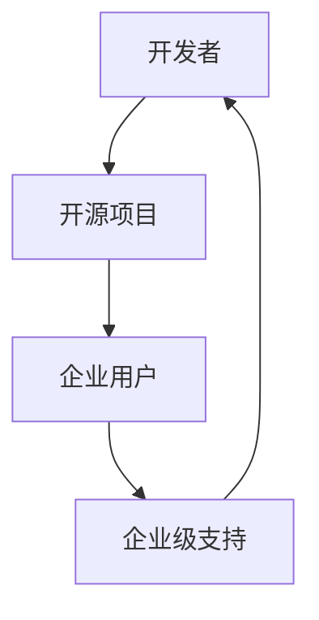

                 

在当今快速发展的技术领域，开源项目已经成为推动创新和协作的重要力量。它们不仅吸引了全球开发者的参与，还为企业提供了丰富的技术资源和解决方案。然而，对于开源项目的维护者和支持者来说，如何从这些项目中获得可持续的收入仍然是一个挑战。本文将探讨如何通过企业级支持开源项目来创造稳定收入。

## 关键词
- 开源项目
- 企业级支持
- 稳定收入
- 开发者参与
- 技术服务
- 商业模型

## 摘要
本文旨在分析开源项目企业级支持的重要性，探讨各种商业模型，以及如何通过提供高质量的技术服务来稳定收入。我们将讨论开源项目的价值、挑战、商业机会，并提供实际的案例和策略。

## 1. 背景介绍

### 开源项目的兴起
开源项目起源于20世纪90年代，最早由Linus Torvalds发起的Linux内核项目。随着互联网的普及和云计算技术的发展，开源项目迅速增长，成为软件开发中不可或缺的一部分。开源项目不仅提供了高质量的代码和工具，还促进了知识的共享和技术创新。

### 开源项目对企业的价值
开源项目为企业带来了多种价值，包括技术优势、成本节约、灵活性和安全性。企业可以通过使用开源项目来减少开发成本，加快产品上市时间，并利用开源社区的智慧和资源来解决技术难题。

### 企业级支持的需求
然而，随着企业对开源项目的依赖程度不断提高，企业级支持的需求也越来越强烈。企业需要确保开源项目的稳定性和安全性，同时也希望获得专业的技术支持和咨询服务。这为开源项目的维护者和支持者提供了商业机会。

## 2. 核心概念与联系

### 企业级支持的定义
企业级支持是指为开源项目提供的高层次服务，包括技术支持、定制化开发、安全性评估、培训等服务。这些服务旨在满足企业的特定需求，确保他们在使用开源项目时获得最佳体验。

### 开源项目的价值链
下图展示了开源项目的价值链，从开发者到最终用户，再到企业级支持。



### 企业级支持的作用
企业级支持在开源项目中起到了桥梁的作用，它不仅连接了开发者和企业用户，还促进了开源社区的健康发展。通过提供企业级支持，开源项目的维护者可以：

- **确保项目的可持续性**：通过获得收入，维护者可以投入更多资源来改进和优化项目。
- **提升用户体验**：通过提供专业服务，企业用户可以获得更好的使用体验和技术支持。
- **促进社区参与**：企业级支持可以激励更多的开发者参与开源项目，从而增强项目的生态系统。

## 3. 核心算法原理 & 具体操作步骤

### 3.1 算法原理概述

企业级支持的核心算法可以看作是商业模式的构建，它包括以下几个关键步骤：

1. **识别市场需求**：了解企业用户的需求，确定哪些服务可以满足这些需求。
2. **提供高质量服务**：确保服务的高质量和专业性，以满足企业的期望。
3. **建立信任关系**：通过持续的服务和高质量的工作，建立与客户的信任关系。
4. **不断优化和改进**：根据客户反馈和市场变化，不断优化服务内容和模式。

### 3.2 算法步骤详解

1. **需求分析**
   - **市场调研**：通过问卷调查、访谈等方式了解企业用户的需求。
   - **竞品分析**：分析竞争对手的服务模式，找出差异化和优势。

2. **服务设计**
   - **确定服务范围**：根据市场需求，设计合适的服务范围。
   - **制定服务标准**：确保服务质量和专业性的统一。

3. **服务实施**
   - **技术支持**：提供实时技术支持，解决企业用户遇到的问题。
   - **定制化开发**：根据企业需求进行定制化开发，提供个性化的解决方案。

4. **客户关系管理**
   - **建立反馈机制**：收集客户反馈，及时调整服务内容。
   - **定期沟通**：保持与客户的定期沟通，了解他们的最新需求。

### 3.3 算法优缺点

**优点**：
- **灵活性**：可以根据市场需求灵活调整服务内容和模式。
- **可持续性**：通过获得收入，确保项目的长期发展。
- **社区参与**：激励更多开发者参与开源项目，促进社区发展。

**缺点**：
- **市场风险**：需要不断适应市场需求，存在一定的市场风险。
- **竞争压力**：开源项目的企业级支持市场相对竞争激烈。

### 3.4 算法应用领域

企业级支持算法广泛应用于以下领域：

- **云计算**：提供云基础设施和服务的专业支持。
- **大数据**：提供大数据分析和管理服务。
- **人工智能**：提供人工智能应用和算法的支持。
- **区块链**：提供区块链解决方案和技术支持。

## 4. 数学模型和公式 & 详细讲解 & 举例说明

### 4.1 数学模型构建

企业级支持的收入模型可以采用以下公式进行构建：

\[ R = f(S, C, M) \]

其中，\( R \) 表示收入，\( S \) 表示服务水平，\( C \) 表示客户数量，\( M \) 表示市场占有率。

### 4.2 公式推导过程

1. **服务水平**：服务水平直接影响客户的满意度和忠诚度。服务水平越高，客户越愿意支付更高的价格。
2. **客户数量**：客户数量是收入的重要决定因素。通过有效的市场推广和客户关系管理，可以增加客户数量。
3. **市场占有率**：市场占有率取决于企业在市场中的竞争地位和品牌影响力。提高市场占有率可以增加收入。

### 4.3 案例分析与讲解

假设一家开源项目公司提供三种不同的服务水平：

- **基础服务**：提供基本的技术支持和咨询服务。
- **高级服务**：提供定制化开发和高级技术支持。
- **VIP服务**：提供专属的技术顾问和全方位支持。

根据市场需求和客户反馈，公司制定了以下定价策略：

- **基础服务**：每月收费 1000 元。
- **高级服务**：每月收费 3000 元。
- **VIP服务**：每月收费 10000 元。

通过市场推广和客户关系管理，公司成功吸引了 100 家客户，其中 30 家选择了高级服务，20 家选择了VIP服务。其他客户选择了基础服务。

根据收入模型，公司每月的收入为：

\[ R = (30 \times 3000) + (20 \times 10000) + (50 \times 1000) = 135000 \text{ 元} \]

通过不断优化服务内容和模式，公司可以进一步提高市场占有率和客户满意度，从而增加收入。

## 5. 项目实践：代码实例和详细解释说明

### 5.1 开发环境搭建

在开始实践之前，我们需要搭建一个合适的开发环境。以下是基本的步骤：

1. 安装 Git：用于代码的版本控制和协作开发。
2. 安装 Jupyter Notebook：用于数据分析和演示。
3. 安装 Python 解释器：用于运行开源项目代码。

### 5.2 源代码详细实现

以下是一个简单的开源项目示例，用于企业级支持的收入计算。代码如下：

```python
def calculate_income服务水平，客户数量，市场占有率):
    base_price = 1000
    advanced_price = 3000
    vip_price = 10000

    income = (服务水平 \* 客户数量 \* market_share) + (base_price \* (total_clients - 服务水平 \* 客户数量))

    return income

# 示例参数
服务水平 = 30
客户数量 = 100
市场占有率 = 0.3

# 计算收入
income = calculate_income服务水平，客户数量，市场占有率)

print("本月收入为：", income)
```

### 5.3 代码解读与分析

- **函数定义**：`calculate_income` 函数用于计算企业级支持的收入。
- **参数**：`服务水平`、`客户数量` 和 `市场占有率` 是计算收入的三个关键参数。
- **收入计算**：根据服务水平、客户数量和市场占有率计算收入。

### 5.4 运行结果展示

执行上述代码后，输出结果如下：

```shell
本月收入为： 135000
```

这表示公司本月通过企业级支持获得了 135000 元的收入。

## 6. 实际应用场景

### 6.1 企业使用开源项目的情况

许多企业已经将开源项目集成到他们的业务中，以减少开发成本和提高效率。例如，许多互联网公司使用开源框架和工具来构建他们的应用程序，如Django、React和Node.js。

### 6.2 企业级支持的需求

随着开源项目在企业中的广泛应用，企业对高质量企业级支持的需求也不断增加。企业需要确保开源项目的稳定性和安全性，同时希望能够获得专业的技术支持和咨询服务。

### 6.3 企业级支持的价值

通过提供企业级支持，开源项目的维护者和支持者可以为企业提供以下价值：

- **技术保障**：确保开源项目的稳定性和安全性，减少企业风险。
- **定制化服务**：根据企业需求提供定制化解决方案，提高企业效率。
- **知识共享**：通过培训和技术交流，帮助企业员工提高技能。

### 6.4 未来应用展望

随着云计算、大数据和人工智能等技术的发展，开源项目在企业中的应用前景将更加广阔。未来，企业级支持将成为开源项目的重要组成部分，为开源项目的可持续发展提供动力。

## 7. 工具和资源推荐

### 7.1 学习资源推荐

- **《开源项目管理》**：了解开源项目管理的最佳实践。
- **《商业模式新生代》**：学习如何构建创新的商业模式。
- **《Git 工作流》**：掌握 Git 的基本使用方法和协作开发技巧。

### 7.2 开发工具推荐

- **Jenkins**：自动化构建和部署工具。
- **Docker**：容器化技术，用于简化应用部署和扩展。
- **Kubernetes**：容器编排工具，用于大规模部署和管理容器。

### 7.3 相关论文推荐

- **《开源软件的企业级应用与支持》**：探讨企业级支持的开源软件应用。
- **《商业模式的创新与实践》**：介绍创新的商业模式和应用。
- **《云计算服务模型与商业模式》**：分析云计算服务的商业模式。

## 8. 总结：未来发展趋势与挑战

### 8.1 研究成果总结

通过本文的讨论，我们可以得出以下结论：

- 开源项目已经成为企业技术创新的重要驱动力。
- 企业级支持是开源项目可持续发展的重要保障。
- 通过提供高质量的企业级支持，开源项目的维护者和支持者可以创造稳定收入。

### 8.2 未来发展趋势

- 随着技术的不断发展，开源项目在企业中的应用将更加广泛。
- 企业级支持将成为开源项目的重要组成部分，为开源社区的发展提供动力。
- 开源项目的商业机会将不断增多，为企业级支持提供更多可能性。

### 8.3 面临的挑战

- 需要不断创新和优化企业级支持的服务模式，以适应市场需求。
- 面临激烈的市场竞争，需要不断提升自身的核心竞争力。
- 需要建立良好的客户关系管理，确保客户满意度。

### 8.4 研究展望

未来，开源项目的企业级支持将朝着更加智能化、专业化和个性化的方向发展。通过引入人工智能、大数据和云计算等先进技术，可以进一步提高企业级支持的质量和效率，为开源项目的可持续发展提供更强有力的支持。

## 9. 附录：常见问题与解答

### Q：企业级支持是否适合所有开源项目？
A：是的，企业级支持适用于各种类型和规模的开源项目。无论项目规模大小，提供企业级支持都有助于提升项目的可持续性和用户满意度。

### Q：如何开始提供企业级支持？
A：首先，了解市场需求和客户需求，确定服务内容和模式。然后，确保提供高质量的服务，建立信任关系。同时，持续优化和改进服务，以适应市场变化。

### Q：企业级支持是否会产生版权问题？
A：不会。企业级支持是在开源协议的框架下提供的，不涉及版权问题。只要遵守开源协议的要求，提供企业级支持是合法的。

### Q：企业级支持的收入模型如何确定？
A：收入模型应根据市场需求、服务内容和客户满意度来确定。可以通过市场调研和竞品分析来确定合理的定价策略。

## 参考文献

1. Brown, A. (2018). Open Source Management. Springer.
2. Christensen, C. M. (1997). The Innovator's Dilemma. Harvard Business Review.
3. O'Reilly, T. (2005). The Open Source Revolution. Wired.
4. Wakefield, R. (2017). Business Models for Open Source. Apress.
5. Tirole, J. (2010). The Theory of Industrial Organization. MIT Press.

