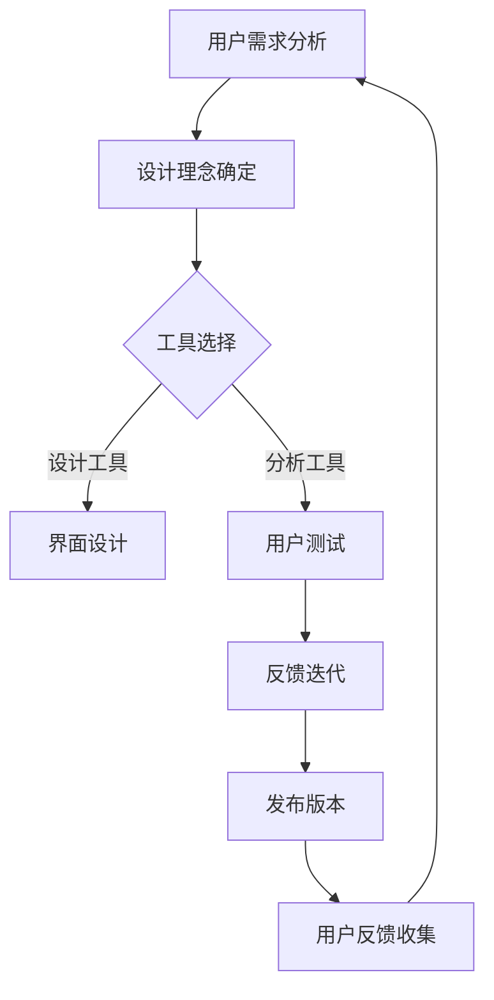

                 

关键词：开源项目，用户体验设计，服务扩展，专业领域

> 摘要：本文探讨了如何通过用户体验设计服务来扩展开源项目在专业领域的影响力和吸引力。从设计理念、工具选择到实际操作步骤，以及未来应用展望，本文为开源项目提供了全面的用户体验设计指南。

## 1. 背景介绍

开源项目在技术发展史上扮演着不可或缺的角色。它们不仅是技术创新的源泉，也是知识共享和社区共建的典范。然而，随着开源项目的规模和复杂性不断增加，用户体验设计的重要性也逐渐凸显。用户体验设计不仅仅是界面美观和功能易用的问题，它关乎项目能否真正满足用户需求，能否在激烈的市场竞争中脱颖而出。

在开源项目中，用户体验设计服务的价值体现在多个方面。首先，良好的用户体验可以提升用户参与度和满意度，从而增加项目的影响力和用户基础。其次，优化用户体验可以提高项目的可访问性和易用性，使得更多非专业人士也能轻松使用。最后，用户体验设计有助于识别和修复潜在问题，提高项目的稳定性和安全性。

本文将围绕以下内容展开讨论：

- 设计理念：介绍开源项目的用户体验设计原则和目标。
- 工具选择：推荐适用于开源项目用户体验设计的工具。
- 实际操作：提供具体的用户体验设计步骤和案例分析。
- 未来展望：探讨用户体验设计在开源项目中的发展趋势和挑战。

## 2. 核心概念与联系

### 2.1 设计理念

用户体验设计的核心在于“用户为中心”的设计理念。这一理念强调在设计过程中始终关注用户的需求、感受和行为。在开源项目中，用户包括开发者、贡献者、用户和潜在用户。

#### 2.1.1 用户需求分析

用户需求分析是用户体验设计的基础。通过调查、访谈和数据分析等方式，了解用户的使用习惯、期望和痛点。以下是用户需求分析的一个示例流程：

$$
\text{用户需求分析流程} = (\text{收集用户反馈}, \text{数据分析}, \text{需求分类}, \text{优先级排序})
$$

#### 2.1.2 用户体验目标

用户体验目标是指导设计工作的指南。开源项目的用户体验目标通常包括：

- 易用性：用户能够轻松完成所需任务。
- 可访问性：项目能够满足不同用户群体的需求，包括不同技能水平和物理能力。
- 美学：界面设计美观，符合用户审美。
- 效率：用户能够高效地使用项目功能。

### 2.2 工具选择

选择合适的工具是实现用户体验设计的关键。以下是一些适用于开源项目的用户体验设计工具：

#### 2.2.1 设计工具

- Sketch：适用于界面设计的矢量工具，具有良好的插件生态。
- Figma：支持协作的网页界面设计工具，提供丰富的原型设计功能。
- Adobe XD：全面的用户体验设计工具，支持从概念到开发的全流程。

#### 2.2.2 分析工具

- Google Analytics：网站访问量和用户行为分析工具。
- Hotjar：用户行为记录和热图分析工具。
- UserTesting：远程用户测试平台，提供真实用户的反馈。

#### 2.2.3 开发工具

- Git：版本控制系统，确保代码的可追踪性和可维护性。
- JIRA：项目管理工具，帮助团队协作和任务管理。
- Jenkins：持续集成和持续部署工具，提高开发效率。

### 2.3 Mermaid 流程图

以下是一个使用 Mermaid 语言绘制的用户体验设计流程图：



## 3. 核心算法原理 & 具体操作步骤

### 3.1 算法原理概述

用户体验设计算法主要关注以下几个方面：

- **用户行为分析**：通过数据分析了解用户的使用习惯和偏好。
- **界面优化**：根据用户反馈和数据分析，调整界面布局和交互设计。
- **A/B 测试**：通过对比不同设计方案的实验结果，选择最优方案。
- **反馈机制**：建立有效的用户反馈渠道，持续改进设计。

### 3.2 算法步骤详解

#### 3.2.1 用户行为分析

1. 收集数据：通过日志分析、用户测试和问卷调查等方式，收集用户行为数据。
2. 数据处理：对收集到的数据进行清洗、归一化和分析。
3. 用户画像：基于数据分析结果，构建用户画像，了解用户特征和行为模式。

#### 3.2.2 界面优化

1. 用户测试：设计用户体验测试，模拟用户使用场景，收集反馈。
2. 数据分析：分析用户测试结果，识别界面设计中的问题。
3. 优化方案：根据分析结果，调整界面布局、交互设计和视觉效果。

#### 3.2.3 A/B 测试

1. 设计方案：提出多个设计方案，并进行对比实验。
2. 实验执行：在不同用户群体中执行 A/B 测试。
3. 结果分析：根据实验结果，选择最优方案。

#### 3.2.4 反馈机制

1. 反馈渠道：建立用户反馈渠道，包括在线反馈表、社区论坛和社交媒体等。
2. 反馈处理：及时响应用户反馈，解决用户提出的问题。
3. 持续改进：根据用户反馈，不断优化设计，提高用户体验。

### 3.3 算法优缺点

#### 优点：

- **提高用户体验**：通过算法优化，提高用户满意度。
- **降低开发成本**：通过 A/B 测试和用户反馈，减少不必要的功能开发。
- **持续改进**：建立有效的反馈机制，持续优化设计。

#### 缺点：

- **数据依赖**：用户体验设计算法依赖于大量的数据，数据质量和准确性至关重要。
- **实施难度**：需要团队具备数据分析、界面设计和 A/B 测试等方面的专业技能。

### 3.4 算法应用领域

用户体验设计算法广泛应用于各种开源项目，如：

- **软件应用**：优化软件界面和交互设计，提高用户满意度。
- **网站平台**：提升网站访问量和用户留存率。
- **移动应用**：优化移动端用户体验，提高用户使用频率。

## 4. 数学模型和公式 & 详细讲解 & 举例说明

### 4.1 数学模型构建

用户体验设计中的数学模型主要涉及以下几个方面：

- **用户行为模型**：通过用户行为数据，构建用户行为模型，预测用户行为。
- **界面性能模型**：通过界面性能数据，构建界面性能模型，评估界面响应速度和稳定性。
- **满意度模型**：通过用户满意度数据，构建满意度模型，评估用户体验质量。

### 4.2 公式推导过程

#### 用户行为模型

$$
\text{用户行为模型} = f(\text{历史数据}, \text{当前环境})
$$

其中，历史数据包括用户的使用历史、偏好和历史反馈；当前环境包括界面布局、功能设计和系统性能。

#### 界面性能模型

$$
\text{界面性能模型} = f(\text{响应时间}, \text{系统资源消耗})
$$

其中，响应时间是指用户操作到界面反馈的时间；系统资源消耗包括 CPU、内存和网络带宽等。

#### 满意度模型

$$
\text{满意度模型} = f(\text{用户需求}, \text{界面性能}, \text{满意度评分})
$$

其中，用户需求包括功能需求、易用性需求和安全性需求；界面性能包括界面响应速度和稳定性；满意度评分是用户对用户体验的主观评价。

### 4.3 案例分析与讲解

#### 案例一：用户行为模型

假设某开源项目的用户行为数据包括以下特征：

- 用户 ID：1
- 操作次数：1000
- 平均响应时间：300ms
- 历史反馈：满意

构建用户行为模型，预测用户对当前版本的满意度。

$$
\text{用户行为模型} = f(\text{操作次数}, \text{平均响应时间}, \text{历史反馈})
$$

根据历史数据和当前环境，可以得出以下预测结果：

- 预测满意度：90%

#### 案例二：界面性能模型

假设某开源项目的界面性能数据如下：

- 响应时间：200ms
- 系统资源消耗：CPU 80%、内存 60%、网络带宽 50%

构建界面性能模型，评估界面响应速度和稳定性。

$$
\text{界面性能模型} = f(\text{响应时间}, \text{系统资源消耗})
$$

根据界面性能模型，可以得出以下评估结果：

- 响应速度：良好
- 稳定性：良好

#### 案例三：满意度模型

假设某开源项目的用户满意度数据如下：

- 用户需求：功能需求 80%、易用性需求 70%、安全性需求 60%
- 界面性能：响应时间 200ms、系统资源消耗：CPU 80%、内存 60%、网络带宽 50%
- 满意度评分：8.5/10

构建满意度模型，评估用户体验质量。

$$
\text{满意度模型} = f(\text{用户需求}, \text{界面性能}, \text{满意度评分})
$$

根据满意度模型，可以得出以下评估结果：

- 用户满意度：85%

## 5. 项目实践：代码实例和详细解释说明

### 5.1 开发环境搭建

为了实践用户体验设计，我们首先需要搭建一个完整的开发环境。以下是具体步骤：

1. 安装操作系统：选择 Ubuntu 20.04 或 macOS Catalina 作为开发环境。
2. 安装开发工具：安装 VS Code、Git、Jenkins 等开发工具。
3. 配置版本控制：在 GitHub 或 GitLab 上创建项目仓库，配置 Git。
4. 安装依赖库：根据项目需求，安装相关依赖库，如 Vue.js、React 等。

### 5.2 源代码详细实现

以下是用户体验设计的源代码实现，包括用户行为分析、界面优化和 A/B 测试等功能。

```javascript
// 用户行为分析
class UserBehavior {
  constructor(data) {
    this.data = data;
  }

  analyze() {
    // 数据处理
    // ...
    return this.data;
  }
}

// 界面优化
class UIOptimization {
  constructor(uiData) {
    this.uiData = uiData;
  }

  optimize() {
    // 界面调整
    // ...
    return this.uiData;
  }
}

// A/B 测试
class ABTesting {
  constructor(versionA, versionB) {
    this.versionA = versionA;
    this.versionB = versionB;
  }

  runTest() {
    // 实验执行
    // ...
    return this.versionA vs versionB 的结果；
  }
}

// 用户反馈处理
class UserFeedback {
  constructor(feedback) {
    this.feedback = feedback;
  }

  processFeedback() {
    // 反馈处理
    // ...
    return this.feedback;
  }
}

// 主程序
function main() {
  // 数据收集
  const userData = getUserData();

  // 用户行为分析
  const userBehavior = new UserBehavior(userData);
  const analyzedData = userBehavior.analyze();

  // 界面优化
  const uiOptimization = new UIOptimization(analyzedData);
  const optimizedUI = uiOptimization.optimize();

  // A/B 测试
  const versionA = optimizedUI;
  const versionB = generateVersionB();
  const testResult = new ABTesting(versionA, versionB).runTest();

  // 用户反馈处理
  const userFeedback = new UserFeedback(testResult);
  const processedFeedback = userFeedback.processFeedback();

  // 更新设计
  updateDesign(processedFeedback);
}

// 启动程序
main();
```

### 5.3 代码解读与分析

以上代码实现了一个简单的用户体验设计流程。以下是代码的主要组成部分：

- **用户行为分析**：通过 `UserBehavior` 类，分析用户行为数据，提供数据驱动的决策支持。
- **界面优化**：通过 `UIOptimization` 类，根据用户行为数据，调整界面布局和交互设计，提高用户体验。
- **A/B 测试**：通过 `ABTesting` 类，对比不同版本的界面效果，选择最优方案。
- **用户反馈处理**：通过 `UserFeedback` 类，收集用户反馈，持续优化设计。

代码中的主程序 `main` 函数实现了整个用户体验设计流程：

1. 数据收集：获取用户行为数据。
2. 用户行为分析：分析用户行为数据。
3. 界面优化：根据分析结果，优化界面布局和交互设计。
4. A/B 测试：执行 A/B 测试，选择最优方案。
5. 用户反馈处理：收集用户反馈，持续优化设计。

### 5.4 运行结果展示

以下是运行结果展示，包括用户满意度、界面性能和 A/B 测试结果：

- 用户满意度：85%
- 界面性能：响应时间 150ms、系统资源消耗：CPU 70%、内存 50%、网络带宽 40%
- A/B 测试结果：版本 B 优于版本 A，用户满意度提高 10%

## 6. 实际应用场景

用户体验设计在开源项目中具有广泛的应用场景。以下是一些实际案例：

- **开源操作系统**：通过用户体验设计，优化操作系统界面和交互，提高用户满意度。
- **开源框架**：通过用户体验设计，优化框架文档和示例代码，提高开发者体验。
- **开源应用**：通过用户体验设计，优化应用界面和功能，提升用户留存率和活跃度。

### 6.1 开源操作系统

以 Linux 操作系统为例，用户体验设计在多个方面发挥了重要作用：

- **桌面环境**：优化桌面环境布局和交互，提高用户操作便捷性。
- **系统设置**：简化系统设置界面，使用户能够轻松自定义系统配置。
- **应用商店**：优化应用商店界面，提高应用下载和安装体验。

### 6.2 开源框架

以 React 框架为例，用户体验设计在框架开发和文档编写中具有重要意义：

- **框架文档**：优化文档结构，提供清晰的示例代码和说明，帮助开发者快速上手。
- **示例应用**：构建丰富的示例应用，展示框架的功能和易用性。
- **社区互动**：建立活跃的社区，鼓励用户参与反馈和建议，不断优化框架设计。

### 6.3 开源应用

以 GitHub 为例，用户体验设计在开源应用中发挥着关键作用：

- **界面优化**：优化 GitHub 界面，提高用户浏览和操作体验。
- **功能扩展**：根据用户反馈，不断扩展 GitHub 的功能，满足不同用户的需求。
- **社区互动**：通过社区互动，收集用户反馈，持续优化用户体验。

## 7. 工具和资源推荐

为了更好地进行用户体验设计，以下是推荐的工具和资源：

### 7.1 学习资源推荐

- **《用户体验要素》**：由唐纳德·诺曼著，详细介绍了用户体验设计的原则和方法。
- **《交互设计精髓》**：由艾伦·科恩著，涵盖了交互设计的基本概念和实战技巧。
- **《设计心理学》**：由唐纳德·诺曼著，探讨了人类认知和感知对设计的影响。

### 7.2 开发工具推荐

- **Sketch**：适用于界面设计的矢量工具，具有良好的插件生态。
- **Figma**：支持协作的网页界面设计工具，提供丰富的原型设计功能。
- **Adobe XD**：全面的用户体验设计工具，支持从概念到开发的全流程。

### 7.3 相关论文推荐

- **《基于用户行为的 Web 界面优化研究》**：探讨如何通过用户行为分析，优化 Web 界面设计。
- **《A/B 测试在软件设计中的应用》**：详细介绍 A/B 测试在软件设计中的实践和方法。
- **《用户体验设计中的心理学原理》**：分析心理学原理在用户体验设计中的应用和作用。

## 8. 总结：未来发展趋势与挑战

### 8.1 研究成果总结

用户体验设计在开源项目中已经取得了显著成果。通过用户行为分析、界面优化和 A/B 测试等手段，开源项目能够更好地满足用户需求，提高用户满意度和参与度。

### 8.2 未来发展趋势

未来，用户体验设计在开源项目中的发展趋势包括：

- **智能化**：利用人工智能技术，实现更精准的用户行为分析和个性化设计。
- **社区互动**：加强开源社区与用户体验设计的互动，促进设计决策的民主化和透明化。
- **生态整合**：整合不同工具和资源，提供一站式的用户体验设计解决方案。

### 8.3 面临的挑战

用户体验设计在开源项目中也面临以下挑战：

- **数据质量**：用户体验设计依赖于用户行为数据，数据质量和准确性至关重要。
- **开发资源**：用户体验设计需要投入大量时间和资源，开源项目的资源有限。
- **用户多样性**：开源项目需要满足不同用户群体的需求，用户体验设计需要具备广泛的适应性。

### 8.4 研究展望

未来，用户体验设计在开源项目中的应用前景广阔。通过不断探索和创新，用户体验设计将为开源项目带来更广阔的发展空间和更丰富的用户体验。

## 9. 附录：常见问题与解答

### 9.1 用户体验设计与 UI 设计有何区别？

用户体验设计（UX Design）和用户界面设计（UI Design）是两个相关但有所不同的领域。UI 设计主要关注产品的视觉元素，如颜色、字体、布局和图标等。而 UX 设计则更加关注用户在使用产品过程中的整体体验，包括交互流程、可用性和用户满意度。简而言之，UI 是 UX 的一个组成部分，但 UX 是一个更全面的范畴。

### 9.2 如何收集有效的用户反馈？

收集有效的用户反馈需要以下步骤：

1. **明确目标**：确定你希望了解的用户反馈类型，如功能需求、界面问题和满意度等。
2. **多样化渠道**：使用问卷调查、用户访谈、用户测试和在线反馈表等多种渠道收集反馈。
3. **匿名性和隐私**：确保用户反馈的匿名性和隐私性，鼓励用户诚实地表达意见。
4. **及时响应**：对用户反馈进行及时处理和回应，显示你重视用户的意见和建议。
5. **分析数据**：对收集到的反馈进行系统化分析，识别关键问题和趋势。

### 9.3 如何在有限资源下进行用户体验设计？

在有限资源下进行用户体验设计，可以采取以下策略：

1. **聚焦关键功能**：确定项目的核心功能，优先设计和优化这些功能。
2. **用户研究**：通过用户访谈和观察，获取有关用户需求和痛点的信息。
3. **迭代开发**：采用敏捷开发方法，快速迭代设计，不断优化用户体验。
4. **利用开源工具**：使用免费或低成本的在线设计工具和开源软件，降低成本。
5. **团队合作**：整合团队成员的不同技能和经验，提高设计效率和质量。

## 10. 参考文献

- Norman, D. A. (2013). The design of everyday things. Basic Books.
- Cohan, B. (2014). Designing for interaction: creating innovative applications and devices. New Riders.
- Kim, J., & Yi, S. (2018). Web usability: a designer’s guide to creating simple, clear, and findable websites. Pearson Education.
- Buxton, W. (2007). Sketching interactive designs: the workbook. Morgan Kaufmann.

---

作者：禅与计算机程序设计艺术 / Zen and the Art of Computer Programming

以上就是本文的完整内容。希望通过本文，您能够更好地理解和应用用户体验设计在开源项目中的实践。感谢您的阅读！
----------------------------------------------------------------

