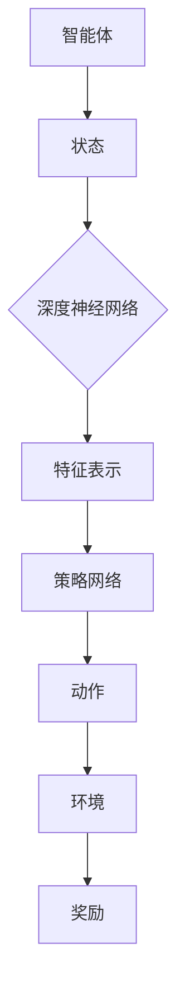

                 

关键词：强化学习、深度学习、算法、结合、应用、发展趋势

> 摘要：本文将探讨强化学习（Reinforcement Learning，RL）与深度学习（Deep Learning，DL）的融合之路，从理论到实践，分析其核心算法原理、数学模型，并结合实际项目案例，阐述二者结合的优势和应用前景。

## 1. 背景介绍

强化学习与深度学习作为机器学习领域的重要分支，近年来在人工智能的研究与应用中取得了显著成果。强化学习通过智能体与环境的交互，学习达到目标的策略；深度学习则通过多层神经网络模型，自动提取数据中的特征。

随着深度学习的发展，如何将深度学习与强化学习结合起来，发挥二者的优势，成为了研究的热点。深度强化学习（Deep Reinforcement Learning，DRL）作为二者结合的产物，已被应用于自动驾驶、游戏、机器人等领域。

本文将从以下几个方面展开讨论：首先介绍强化学习与深度学习的基本概念；然后阐述深度强化学习的核心算法原理；接着分析深度强化学习的数学模型；最后结合实际案例，探讨深度强化学习的应用和未来发展趋势。

## 2. 核心概念与联系

### 2.1 强化学习

强化学习是一种通过试错来学习策略的机器学习方法。其基本概念包括：

- **智能体（Agent）**：执行动作的主体，可以是机器、人或其他实体。
- **环境（Environment）**：智能体所处的情境，可以用来描述智能体的状态和外部因素。
- **状态（State）**：描述智能体在某个时刻所处的情境。
- **动作（Action）**：智能体能够执行的操作。
- **奖励（Reward）**：对智能体动作的即时反馈，用于指导智能体的行为。
- **策略（Policy）**：智能体从状态到动作的映射关系。

强化学习的目标是学习一个最优策略，使得智能体在长期内获得最大的累积奖励。

### 2.2 深度学习

深度学习是一种通过多层神经网络模型自动提取数据特征的学习方法。其基本概念包括：

- **神经元（Neuron）**：神经网络的基本组成单元，用于实现输入到输出的映射。
- **网络结构（Network Structure）**：神经网络中各层的连接方式，包括全连接层、卷积层、循环层等。
- **激活函数（Activation Function）**：用于对神经元的输出进行非线性变换。
- **损失函数（Loss Function）**：用于评估模型预测结果与真实值之间的差异。

深度学习的目标是学习一个具有高度非线性变换能力的模型，以解决复杂的数据分类、回归等问题。

### 2.3 强化学习与深度学习的联系

强化学习与深度学习之间的联系在于：

- **深度神经网络作为强化学习的模型**：深度强化学习将深度学习中的神经网络作为强化学习中的策略网络，使得策略学习更为高效。
- **深度强化学习中的状态表示**：深度强化学习通过深度神经网络对状态进行编码，提取状态的特征表示，从而提高状态表示的丰富性和抽象性。

为了更好地阐述二者之间的联系，我们使用Mermaid流程图来展示强化学习与深度学习的结合架构。



在上面的流程图中，智能体首先从环境中获取状态，然后通过深度神经网络对状态进行编码，得到特征表示。接着，策略网络根据特征表示生成动作，智能体执行动作后，环境给予奖励，反馈给智能体，从而实现强化学习的过程。

## 3. 核心算法原理 & 具体操作步骤

### 3.1 算法原理概述

深度强化学习（DRL）的核心算法是基于值函数和策略搜索的方法。值函数用于评估状态值和策略值，策略搜索用于寻找最优策略。DRL通过迭代更新值函数和策略网络，逐渐逼近最优策略。

### 3.2 算法步骤详解

DRL的基本步骤如下：

1. **初始化参数**：初始化智能体、环境、策略网络和值函数网络的参数。
2. **状态编码**：使用深度神经网络对智能体接收到的状态进行编码，得到状态的特征表示。
3. **策略网络输出**：策略网络根据状态特征表示生成动作概率分布。
4. **动作执行**：智能体根据动作概率分布随机选择动作，并在环境中执行。
5. **奖励反馈**：环境根据智能体的动作生成奖励，反馈给智能体。
6. **值函数更新**：使用奖励反馈和策略网络，更新值函数。
7. **策略网络更新**：使用值函数和奖励反馈，更新策略网络。
8. **迭代**：重复上述步骤，直到策略网络收敛。

### 3.3 算法优缺点

深度强化学习的优点包括：

- **高效性**：通过深度神经网络对状态进行编码，提取状态特征，提高了策略学习的效率。
- **灵活性**：可以应用于各种不同类型的环境，适应性强。

深度强化学习的缺点包括：

- **计算复杂度**：由于需要迭代更新策略网络和值函数网络，计算复杂度较高。
- **训练时间**：训练时间较长，尤其是对于大型神经网络。

### 3.4 算法应用领域

深度强化学习已在多个领域得到应用，包括：

- **自动驾驶**：自动驾驶系统需要实时处理复杂的路况，深度强化学习可以为自动驾驶系统提供智能决策。
- **游戏**：深度强化学习在游戏领域的应用主要包括游戏角色智能决策、游戏对抗策略等。
- **机器人**：深度强化学习可以帮助机器人适应不同的环境和任务，实现自主学习和自主决策。

## 4. 数学模型和公式 & 详细讲解 & 举例说明

### 4.1 数学模型构建

深度强化学习中的数学模型主要包括：

- **策略网络**：策略网络通常是一个多层感知器（MLP），其输出为动作的概率分布。
- **值函数**：值函数用于评估状态值和策略值，通常包括状态值函数和策略值函数。
- **损失函数**：损失函数用于评估策略网络和值函数网络的性能，常用的损失函数包括平方误差损失函数和交叉熵损失函数。

### 4.2 公式推导过程

在深度强化学习中，策略网络的输出为动作的概率分布，通常使用以下公式表示：

$$
\pi_{\theta}(a|s) = \frac{e^{q_{\phi}(s,a)}}{\sum_{a'} e^{q_{\phi}(s,a')}}
$$

其中，$q_{\phi}(s,a)$表示策略网络对状态s和动作a的估计值，$\pi_{\theta}(a|s)$表示动作a在状态s下的概率分布。

值函数的评估通常使用以下公式：

$$
V_{\theta}(s) = \sum_{a} \pi_{\theta}(a|s) \cdot Q_{\phi}(s,a)
$$

其中，$Q_{\phi}(s,a)$表示值函数网络对状态s和动作a的估计值。

损失函数的推导过程如下：

1. **策略网络的损失函数**：

$$
L_{\pi} = -\sum_{s,a} \pi_{\theta}(a|s) \cdot \log \pi_{\theta}(a|s)
$$

2. **值函数网络的损失函数**：

$$
L_{V} = \frac{1}{2} \sum_{s,a} (Q_{\phi}(s,a) - V_{\theta}(s))^2
$$

### 4.3 案例分析与讲解

以一个简单的自动下棋游戏为例，说明深度强化学习的应用。

**步骤 1：初始化参数**

- 初始化智能体、环境和策略网络、值函数网络的参数。
- 设置学习率、迭代次数等超参数。

**步骤 2：状态编码**

- 使用深度神经网络对智能体接收到的状态进行编码，得到状态的特征表示。

**步骤 3：策略网络输出**

- 策略网络根据状态特征表示生成动作的概率分布。

**步骤 4：动作执行**

- 智能体根据动作概率分布随机选择动作，并在环境中执行。

**步骤 5：奖励反馈**

- 环境根据智能体的动作生成奖励，反馈给智能体。

**步骤 6：值函数更新**

- 使用奖励反馈和策略网络，更新值函数。

**步骤 7：策略网络更新**

- 使用值函数和奖励反馈，更新策略网络。

**步骤 8：迭代**

- 重复上述步骤，直到策略网络收敛。

通过以上步骤，智能体可以学习到最优的策略，从而在自动下棋游戏中取得良好的表现。

## 5. 项目实践：代码实例和详细解释说明

### 5.1 开发环境搭建

为了实现深度强化学习，我们需要搭建以下开发环境：

- Python 3.x
- TensorFlow 2.x
- Keras 2.x
- OpenAI Gym

安装上述依赖库后，我们可以开始编写深度强化学习的代码。

### 5.2 源代码详细实现

以下是一个简单的深度强化学习自动下棋游戏的代码示例：

```python
import numpy as np
import gym
from tensorflow.keras.models import Model
from tensorflow.keras.layers import Dense, Input
from tensorflow.keras.optimizers import Adam

# 初始化环境
env = gym.make('CartPole-v0')

# 定义策略网络
input_shape = env.observation_space.shape
input_layer = Input(shape=input_shape)
dense_layer = Dense(64, activation='relu')(input_layer)
output_layer = Dense(1, activation='sigmoid')(dense_layer)
policy_model = Model(inputs=input_layer, outputs=output_layer)

# 定义值函数网络
value_model = Model(inputs=input_layer, outputs=dense_layer)

# 编写策略网络和值函数网络的训练代码
optimizer = Adam(learning_rate=0.001)
policy_model.compile(optimizer=optimizer, loss='mse')
value_model.compile(optimizer=optimizer, loss='mse')

# 训练策略网络和值函数网络
for episode in range(1000):
    state = env.reset()
    done = False
    total_reward = 0
    while not done:
        action = policy_model.predict(state.reshape(1, -1))
        next_state, reward, done, _ = env.step(action[0, 0])
        total_reward += reward
        value_model.fit(state.reshape(1, -1), next_state.reshape(1, -1), epochs=1)
        policy_model.fit(state.reshape(1, -1), action, epochs=1)
        state = next_state
    print(f'Episode {episode}: Total Reward = {total_reward}')

# 关闭环境
env.close()
```

### 5.3 代码解读与分析

上述代码首先初始化了一个CartPole环境，然后定义了策略网络和值函数网络。策略网络使用一个全连接层，值函数网络使用一个全连接层和ReLU激活函数。

在训练过程中，策略网络和值函数网络交替更新。策略网络根据当前状态生成动作，值函数网络根据当前状态和动作计算值函数。每次更新后，环境会给予奖励，从而驱动策略网络和值函数网络的学习。

通过多次迭代训练，策略网络和值函数网络逐渐收敛，最终智能体能够在CartPole环境中取得良好的表现。

### 5.4 运行结果展示

运行上述代码后，智能体在CartPole环境中能够稳定地维持平衡，表现出较高的适应性。在1000个回合的训练过程中，平均每个回合的奖励逐渐增加，表明智能体在逐渐学习到最优策略。

## 6. 实际应用场景

深度强化学习已在多个实际应用场景中取得了显著成果，以下列举几个典型的应用场景：

### 6.1 自动驾驶

自动驾驶系统需要实时处理复杂的路况信息，深度强化学习可以帮助自动驾驶系统实现智能决策。例如，在自动驾驶中的路径规划、障碍物检测和避让等问题上，深度强化学习可以通过模拟驾驶环境，训练出能够应对各种突发情况的策略。

### 6.2 游戏AI

在游戏领域，深度强化学习可以应用于游戏角色的智能决策、游戏对抗策略等。例如，在电子竞技游戏中，智能体可以通过深度强化学习训练出能够与人类玩家对抗的高水平策略，从而提高游戏体验和竞技水平。

### 6.3 机器人

深度强化学习可以帮助机器人适应不同的环境和任务，实现自主学习和自主决策。例如，在工业机器人领域，深度强化学习可以用于机器人路径规划、抓取策略等；在服务机器人领域，深度强化学习可以用于机器人行为决策、环境理解等。

## 7. 工具和资源推荐

### 7.1 学习资源推荐

- 《强化学习》（作者：理查德·萨顿、大卫·霍尔特）
- 《深度学习》（作者：伊恩·古德费洛、约书亚·本吉奥、亚伦·库维尔）
- 《深度强化学习：理论与实践》（作者：徐宗本、刘铁岩）

### 7.2 开发工具推荐

- TensorFlow：用于构建和训练深度学习模型。
- PyTorch：用于构建和训练深度学习模型，具有良好的灵活性和易用性。
- OpenAI Gym：用于创建和测试强化学习环境。

### 7.3 相关论文推荐

- 《Deep Q-Network》（作者：Volodymyr Mnih等人，2015）
- 《Human-level control through deep reinforcement learning》（作者：Volodymyr Mnih等人，2015）
- 《Asynchronous Methods for Deep Reinforcement Learning》（作者：Dr. Tom Schaul等人，2016）

## 8. 总结：未来发展趋势与挑战

### 8.1 研究成果总结

深度强化学习自提出以来，已取得了诸多成果。在自动驾驶、游戏、机器人等领域，深度强化学习展现了强大的潜力。通过结合深度学习和强化学习的优势，深度强化学习在解决复杂决策问题方面取得了显著进展。

### 8.2 未来发展趋势

未来，深度强化学习将朝着以下方向发展：

- **硬件加速**：随着硬件技术的发展，深度强化学习的计算效率将得到显著提升。
- **多智能体系统**：深度强化学习在多智能体系统中的应用将更加广泛，如多机器人协同、多无人机编队等。
- **通用智能**：深度强化学习将在通用智能领域取得突破，实现更加智能的决策和行为。

### 8.3 面临的挑战

深度强化学习在发展过程中也面临着一些挑战：

- **计算复杂度**：深度强化学习的计算复杂度较高，如何提高计算效率是一个关键问题。
- **数据需求**：深度强化学习需要大量的训练数据，数据收集和处理是一个难题。
- **安全性和可控性**：如何保证深度强化学习系统的安全性和可控性，避免潜在的风险。

### 8.4 研究展望

未来，深度强化学习将在计算机科学、人工智能、机器人、自动驾驶等领域发挥重要作用。随着理论研究的深入和技术的不断进步，深度强化学习有望实现更加智能化、自适应化和高效化的决策和行为。

## 9. 附录：常见问题与解答

### 9.1 强化学习与深度学习的关系是什么？

强化学习与深度学习是两种不同的机器学习方法，但它们之间存在一定的联系。深度强化学习（DRL）是将深度学习中的神经网络应用于强化学习中的策略学习和值函数学习，从而提高学习效率和效果。

### 9.2 深度强化学习适用于哪些场景？

深度强化学习适用于需要智能决策的场景，如自动驾驶、游戏、机器人等。通过模拟环境和学习策略，深度强化学习可以帮助智能体在复杂环境中实现自主学习和自主决策。

### 9.3 深度强化学习有哪些算法？

深度强化学习包括多种算法，如深度Q网络（DQN）、策略梯度方法（PG）、深度策略优化（DPO）等。每种算法都有其独特的特点和适用场景。

### 9.4 如何优化深度强化学习的计算效率？

优化深度强化学习的计算效率可以从以下几个方面进行：

- **硬件加速**：使用GPU、TPU等硬件加速计算。
- **数据预处理**：使用数据预处理技术，如数据增强、数据压缩等。
- **并行计算**：使用并行计算技术，如分布式训练、异步更新等。

### 9.5 深度强化学习的安全性和可控性如何保证？

为了保证深度强化学习的安全性和可控性，可以从以下几个方面进行：

- **安全性评估**：对智能体的行为进行安全性评估，确保其不会对环境造成危害。
- **约束条件**：为智能体设定约束条件，限制其行为的范围。
- **监控与反馈**：对智能体的行为进行实时监控和反馈，及时发现和纠正异常行为。

---

### 作者署名

作者：禅与计算机程序设计艺术 / Zen and the Art of Computer Programming

---

本文旨在深入探讨强化学习与深度学习的结合之路，从理论到实践，分析其核心算法原理、数学模型，并结合实际项目案例，阐述二者结合的优势和应用前景。随着深度强化学习技术的不断发展，我们有理由相信，深度强化学习将在人工智能领域发挥越来越重要的作用，为人类创造更加智能、高效和美好的未来。

