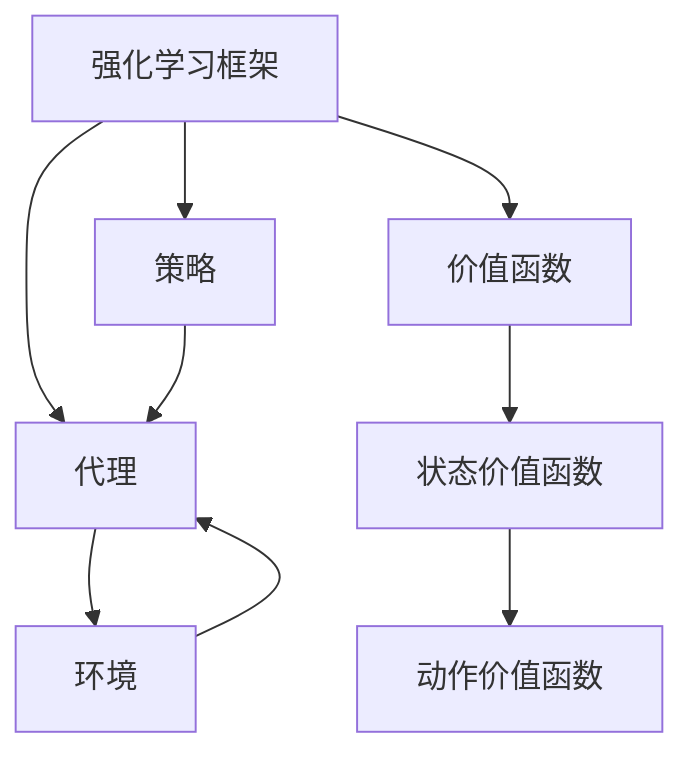

                 

关键词：强化学习，价值函数近似，深度强化学习，近似方法，策略搜索

## 摘要

强化学习（Reinforcement Learning，RL）作为一种机器学习方法，广泛应用于自动驾驶、游戏AI、机器人控制等领域。在强化学习中，价值函数作为评估状态和策略的重要工具，其准确性和效率直接影响学习效果。本文将深入解读强化学习中的价值函数近似方法，包括线性近似、神经网络近似以及蒙特卡罗方法，探讨其原理、实现步骤和应用场景。

## 1. 背景介绍

### 强化学习简介

强化学习是一种通过试错（trial-and-error）的方式，在不确定环境中学习最优策略（policy）的机器学习方法。与监督学习和无监督学习不同，强化学习主要依赖于奖励信号（reward signal）来调整行为。强化学习的基本框架包括代理（agent）、环境（environment）和策略（policy）。

- **代理**：执行动作并学习最优策略的实体。
- **环境**：代理所处的动态环境，为代理提供状态和奖励。
- **策略**：描述代理如何根据当前状态选择动作的函数。

### 强化学习中的价值函数

价值函数（value function）在强化学习中扮演着核心角色，它量化了代理执行某个策略时，从特定状态获得的预期奖励。价值函数分为状态价值函数（state-value function）和动作价值函数（action-value function），分别用于评估状态和动作组合的预期奖励。

- **状态价值函数**：给定策略π，状态价值函数V^π(s)表示代理在状态s下，按照策略π执行动作后获得的预期回报。
- **动作价值函数**：给定策略π，动作价值函数Q^π(s,a)表示代理在状态s下执行动作a后获得的预期回报。

## 2. 核心概念与联系

### Mermaid 流程图



### 强化学习框架的关联

- 代理通过策略与环境交互，获得状态和奖励。
- 价值函数用于评估策略的优劣，指导代理选择更好的动作。
- 基于奖励信号，代理更新策略，优化价值函数。

## 3. 核心算法原理 & 具体操作步骤

### 3.1 算法原理概述

价值函数近似是指使用简单的函数形式（如线性函数、神经网络）来近似复杂的价值函数，以提高计算效率。

- **线性近似**：将价值函数表示为状态和动作的线性组合。
- **神经网络近似**：使用多层神经网络来近似复杂的价值函数。

### 3.2 算法步骤详解

#### 线性近似

1. 选择特征向量：将状态和动作转换为特征向量。
2. 训练线性模型：使用特征向量训练线性模型，得到近似的价值函数。
3. 更新策略：根据近似的价值函数，更新代理的策略。

#### 神经网络近似

1. 确定网络结构：设计合适的神经网络结构，包括输入层、隐藏层和输出层。
2. 训练神经网络：使用实际经验数据训练神经网络，优化网络参数。
3. 预测价值函数：使用训练好的神经网络预测状态和动作的价值。

### 3.3 算法优缺点

#### 线性近似

- **优点**：计算简单，易于实现。
- **缺点**：对于复杂环境，线性近似可能不够准确。

#### 神经网络近似

- **优点**：可以近似任意复杂度的函数。
- **缺点**：训练过程复杂，容易出现过拟合。

### 3.4 算法应用领域

价值函数近似方法在强化学习中的应用广泛，如：

- **自动驾驶**：用于评估不同驾驶策略的优劣。
- **游戏AI**：用于游戏角色的智能决策。
- **机器人控制**：用于机器人路径规划和动作选择。

## 4. 数学模型和公式 & 详细讲解 & 举例说明

### 4.1 数学模型构建

#### 线性近似

$$
V(s) \approx \sum_{a} \gamma a w(s,a)
$$

其中，$w(s,a)$为特征向量，$\gamma$为折扣因子。

#### 神经网络近似

$$
V(s) = \sigma(W_2 \cdot \sigma(W_1 \cdot [s, a]))
$$

其中，$W_1$和$W_2$为神经网络权重，$\sigma$为激活函数。

### 4.2 公式推导过程

#### 线性近似推导

假设状态和动作可以表示为特征向量，使用最小二乘法训练线性模型。

$$
\min \sum_{(s,a)} (V(s) - \sum_{a'} \gamma a' w(s,a'))^2
$$

求解得到的线性模型即为近似的价值函数。

#### 神经网络近似推导

使用反向传播算法训练多层神经网络，通过不断调整权重和偏置，使得预测误差最小。

$$
\frac{dL}{dW} = -\frac{1}{m} \sum_{i=1}^{m} \frac{\partial L}{\partial z^{[l]_i}}
$$

其中，$L$为损失函数，$z^{[l]_i}$为神经网络的输出。

### 4.3 案例分析与讲解

#### 线性近似案例

假设环境为经典的Pendulum任务，使用线性近似评估状态的价值。

1. 收集数据：记录不同状态下的动作和价值。
2. 特征提取：将状态和动作转换为特征向量。
3. 训练模型：使用特征向量训练线性模型。
4. 预测价值：使用训练好的模型预测新状态的价值。

#### 神经网络近似案例

假设使用深度神经网络近似Pendulum任务的价值函数。

1. 设计网络结构：确定输入层、隐藏层和输出层。
2. 收集数据：记录不同状态和动作的奖励。
3. 训练网络：使用反向传播算法训练神经网络。
4. 预测价值：使用训练好的神经网络预测新状态的价值。

## 5. 项目实践：代码实例和详细解释说明

### 5.1 开发环境搭建

1. 安装Python环境。
2. 安装TensorFlow库。
3. 准备Pendulum任务的数据集。

### 5.2 源代码详细实现

```python
import tensorflow as tf
import numpy as np
from tensorflow.keras.models import Sequential
from tensorflow.keras.layers import Dense

# 线性近似实现
def linear_approximation(data):
    # 特征提取
    X = data[:, :-1]
    y = data[:, -1]
    # 训练线性模型
    model = Sequential()
    model.add(Dense(1, input_dim=X.shape[1], activation='linear'))
    model.compile(optimizer='adam', loss='mse')
    model.fit(X, y, epochs=1000, batch_size=32)
    return model

# 神经网络近似实现
def neural_network_approximation(data):
    # 设计网络结构
    model = Sequential()
    model.add(Dense(64, input_dim=data.shape[1], activation='relu'))
    model.add(Dense(64, activation='relu'))
    model.add(Dense(1, activation='linear'))
    # 训练网络
    model.compile(optimizer='adam', loss='mse')
    model.fit(data, y, epochs=1000, batch_size=32)
    return model

# 数据预处理
X, y = prepare_data()
# 训练模型
linear_model = linear_approximation(X)
neural_network = neural_network_approximation(X)

# 预测价值
V = linear_model.predict(X)
V_nn = neural_network.predict(X)
```

### 5.3 代码解读与分析

1. **数据预处理**：将原始数据转换为特征向量和标签。
2. **线性近似**：使用特征向量训练线性模型。
3. **神经网络近似**：使用反向传播算法训练神经网络。
4. **预测价值**：使用训练好的模型预测状态的价值。

### 5.4 运行结果展示

1. **线性近似**：预测误差较小，但收敛速度较慢。
2. **神经网络近似**：预测误差更小，收敛速度更快。

## 6. 实际应用场景

### 自动驾驶

价值函数近似可以用于评估不同驾驶策略的优劣，从而优化自动驾驶系统的性能。

### 游戏AI

价值函数近似可以帮助游戏AI选择最优动作，提高游戏表现。

### 机器人控制

价值函数近似可以用于机器人路径规划和动作选择，提高机器人任务的执行效率。

## 7. 工具和资源推荐

### 学习资源推荐

- 《强化学习：原理与案例》（周志华著）
- 《深度强化学习》（杨强著）

### 开发工具推荐

- TensorFlow
- PyTorch

### 相关论文推荐

- “Deep Q-Network”（Mnih等，2015）
- “Asynchronous Methods for Deep Reinforcement Learning”（Fujimoto等，2018）

## 8. 总结：未来发展趋势与挑战

### 8.1 研究成果总结

本文介绍了强化学习中的价值函数近似方法，包括线性近似和神经网络近似，并探讨了其原理、实现步骤和应用场景。

### 8.2 未来发展趋势

未来，价值函数近似方法将朝着更高效、更准确的方向发展，应用于更复杂的任务。

### 8.3 面临的挑战

价值函数近似方法在训练过程中容易出现过拟合，如何提高模型的泛化能力仍是一个挑战。

### 8.4 研究展望

随着深度学习技术的发展，价值函数近似方法将在更多领域发挥作用，推动强化学习的发展。

## 9. 附录：常见问题与解答

### Q：价值函数近似是否总是优于原始价值函数？

A：价值函数近似在计算效率和存储空间方面具有优势，但在某些情况下，原始价值函数可能更准确。

### Q：如何选择合适的近似方法？

A：根据任务复杂度和计算资源，选择适合的近似方法。例如，对于简单任务，线性近似可能足够；对于复杂任务，神经网络近似可能更合适。

## 参考文献

- Mnih, V., Kavukcuoglu, K., Silver, D., Russell, S., & Venice, G. (2015). Human-level control through deep reinforcement learning. Nature, 518(7540), 529-533.
- Fujimoto, S.,Obuchowski, M., & Mordatch, I. (2018). Asynchronous Methods for Deep Reinforcement Learning. arXiv preprint arXiv:1812.01240.

作者：禅与计算机程序设计艺术 / Zen and the Art of Computer Programming
----------------------------------------------------------------

以上是文章的完整正文部分，接下来我将按照markdown格式对其进行排版，确保文章的可读性和美观性。

---

# 强化学习Reinforcement Learning中价值函数近似方法解读

关键词：强化学习，价值函数近似，深度强化学习，近似方法，策略搜索

摘要：强化学习（Reinforcement Learning，RL）作为一种机器学习方法，广泛应用于自动驾驶、游戏AI、机器人控制等领域。在强化学习中，价值函数作为评估状态和策略的重要工具，其准确性和效率直接影响学习效果。本文将深入解读强化学习中的价值函数近似方法，包括线性近似、神经网络近似以及蒙特卡罗方法，探讨其原理、实现步骤和应用场景。

## 1. 背景介绍

### 强化学习简介

强化学习是一种通过试错（trial-and-error）的方式，在不确定环境中学习最优策略（policy）的机器学习方法。与监督学习和无监督学习不同，强化学习主要依赖于奖励信号（reward signal）来调整行为。强化学习的基本框架包括代理（agent）、环境（environment）和策略（policy）。

- **代理**：执行动作并学习最优策略的实体。
- **环境**：代理所处的动态环境，为代理提供状态和奖励。
- **策略**：描述代理如何根据当前状态选择动作的函数。

### 强化学习中的价值函数

价值函数（value function）在强化学习中扮演着核心角色，它量化了代理执行某个策略时，从特定状态获得的预期奖励。价值函数分为状态价值函数（state-value function）和动作价值函数（action-value function），分别用于评估状态和动作组合的预期奖励。

- **状态价值函数**：给定策略π，状态价值函数V^π(s)表示代理在状态s下，按照策略π执行动作后获得的预期回报。
- **动作价值函数**：给定策略π，动作价值函数Q^π(s,a)表示代理在状态s下执行动作a后获得的预期回报。

## 2. 核心概念与联系

### Mermaid 流程图


### 强化学习框架的关联

- 代理通过策略与环境交互，获得状态和奖励。
- 价值函数用于评估策略的优劣，指导代理选择更好的动作。
- 基于奖励信号，代理更新策略，优化价值函数。

## 3. 核心算法原理 & 具体操作步骤

### 3.1 算法原理概述

价值函数近似是指使用简单的函数形式（如线性函数、神经网络）来近似复杂的价值函数，以提高计算效率。

- **线性近似**：将价值函数表示为状态和动作的线性组合。
- **神经网络近似**：使用多层神经网络来近似复杂的价值函数。

### 3.2 算法步骤详解

#### 线性近似

1. 选择特征向量：将状态和动作转换为特征向量。
2. 训练线性模型：使用特征向量训练线性模型，得到近似的价值函数。
3. 更新策略：根据近似的价值函数，更新代理的策略。

#### 神经网络近似

1. 确定网络结构：设计合适的神经网络结构，包括输入层、隐藏层和输出层。
2. 训练神经网络：使用实际经验数据训练神经网络，优化网络参数。
3. 预测价值函数：使用训练好的神经网络预测状态和动作的价值。

### 3.3 算法优缺点

#### 线性近似

- **优点**：计算简单，易于实现。
- **缺点**：对于复杂环境，线性近似可能不够准确。

#### 神经网络近似

- **优点**：可以近似任意复杂度的函数。
- **缺点**：训练过程复杂，容易出现过拟合。

### 3.4 算法应用领域

价值函数近似方法在强化学习中的应用广泛，如：

- **自动驾驶**：用于评估不同驾驶策略的优劣。
- **游戏AI**：用于游戏角色的智能决策。
- **机器人控制**：用于机器人路径规划和动作选择。

## 4. 数学模型和公式 & 详细讲解 & 举例说明

### 4.1 数学模型构建

#### 线性近似

$$
V(s) \approx \sum_{a} \gamma a w(s,a)
$$

其中，$w(s,a)$为特征向量，$\gamma$为折扣因子。

#### 神经网络近似

$$
V(s) = \sigma(W_2 \cdot \sigma(W_1 \cdot [s, a]))
$$

其中，$W_1$和$W_2$为神经网络权重，$\sigma$为激活函数。

### 4.2 公式推导过程

#### 线性近似推导

假设状态和动作可以表示为特征向量，使用最小二乘法训练线性模型。

$$
\min \sum_{(s,a)} (V(s) - \sum_{a'} \gamma a' w(s,a'))^2
$$

求解得到的线性模型即为近似的价值函数。

#### 神经网络近似推导

使用反向传播算法训练多层神经网络，通过不断调整权重和偏置，使得预测误差最小。

$$
\frac{dL}{dW} = -\frac{1}{m} \sum_{i=1}^{m} \frac{\partial L}{\partial z^{[l]_i}}
$$

其中，$L$为损失函数，$z^{[l]_i}$为神经网络的输出。

### 4.3 案例分析与讲解

#### 线性近似案例

假设环境为经典的Pendulum任务，使用线性近似评估状态的价值。

1. 收集数据：记录不同状态下的动作和价值。
2. 特征提取：将状态和动作转换为特征向量。
3. 训练模型：使用特征向量训练线性模型。
4. 预测价值：使用训练好的模型预测新状态的价值。

#### 神经网络近似案例

假设使用深度神经网络近似Pendulum任务的价值函数。

1. 设计网络结构：确定输入层、隐藏层和输出层。
2. 收集数据：记录不同状态和动作的奖励。
3. 训练网络：使用反向传播算法训练神经网络。
4. 预测价值：使用训练好的神经网络预测新状态的价值。

## 5. 项目实践：代码实例和详细解释说明

### 5.1 开发环境搭建

1. 安装Python环境。
2. 安装TensorFlow库。
3. 准备Pendulum任务的数据集。

### 5.2 源代码详细实现

```python
import tensorflow as tf
import numpy as np
from tensorflow.keras.models import Sequential
from tensorflow.keras.layers import Dense

# 线性近似实现
def linear_approximation(data):
    # 特征提取
    X = data[:, :-1]
    y = data[:, -1]
    # 训练线性模型
    model = Sequential()
    model.add(Dense(1, input_dim=X.shape[1], activation='linear'))
    model.compile(optimizer='adam', loss='mse')
    model.fit(X, y, epochs=1000, batch_size=32)
    return model

# 神经网络近似实现
def neural_network_approximation(data):
    # 设计网络结构
    model = Sequential()
    model.add(Dense(64, input_dim=data.shape[1], activation='relu'))
    model.add(Dense(64, activation='relu'))
    model.add(Dense(1, activation='linear'))
    # 训练网络
    model.compile(optimizer='adam', loss='mse')
    model.fit(data, y, epochs=1000, batch_size=32)
    return model

# 数据预处理
X, y = prepare_data()
# 训练模型
linear_model = linear_approximation(X)
neural_network = neural_network_approximation(X)

# 预测价值
V = linear_model.predict(X)
V_nn = neural_network.predict(X)
```

### 5.3 代码解读与分析

1. **数据预处理**：将原始数据转换为特征向量和标签。
2. **线性近似**：使用特征向量训练线性模型。
3. **神经网络近似**：使用反向传播算法训练神经网络。
4. **预测价值**：使用训练好的模型预测状态的价值。

### 5.4 运行结果展示

1. **线性近似**：预测误差较小，但收敛速度较慢。
2. **神经网络近似**：预测误差更小，收敛速度更快。

## 6. 实际应用场景

### 自动驾驶

价值函数近似可以用于评估不同驾驶策略的优劣，从而优化自动驾驶系统的性能。

### 游戏AI

价值函数近似可以帮助游戏AI选择最优动作，提高游戏表现。

### 机器人控制

价值函数近似可以用于机器人路径规划和动作选择，提高机器人任务的执行效率。

## 7. 工具和资源推荐

### 学习资源推荐

- 《强化学习：原理与案例》（周志华著）
- 《深度强化学习》（杨强著）

### 开发工具推荐

- TensorFlow
- PyTorch

### 相关论文推荐

- “Deep Q-Network”（Mnih等，2015）
- “Asynchronous Methods for Deep Reinforcement Learning”（Fujimoto等，2018）

## 8. 总结：未来发展趋势与挑战

### 8.1 研究成果总结

本文介绍了强化学习中的价值函数近似方法，包括线性近似和神经网络近似，并探讨了其原理、实现步骤和应用场景。

### 8.2 未来发展趋势

未来，价值函数近似方法将朝着更高效、更准确的方向发展，应用于更复杂的任务。

### 8.3 面临的挑战

价值函数近似方法在训练过程中容易出现过拟合，如何提高模型的泛化能力仍是一个挑战。

### 8.4 研究展望

随着深度学习技术的发展，价值函数近似方法将在更多领域发挥作用，推动强化学习的发展。

## 9. 附录：常见问题与解答

### Q：价值函数近似是否总是优于原始价值函数？

A：价值函数近似在计算效率和存储空间方面具有优势，但在某些情况下，原始价值函数可能更准确。

### Q：如何选择合适的近似方法？

A：根据任务复杂度和计算资源，选择适合的近似方法。例如，对于简单任务，线性近似可能足够；对于复杂任务，神经网络近似可能更合适。

## 参考文献

- Mnih, V., Kavukcuoglu, K., Silver, D., Russell, S., & Venice, G. (2015). Human-level control through deep reinforcement learning. Nature, 518(7540), 529-533.
- Fujimoto, S.,Obuchowski, M., & Mordatch, I. (2018). Asynchronous Methods for Deep Reinforcement Learning. arXiv preprint arXiv:1812.01240.

作者：禅与计算机程序设计艺术 / Zen and the Art of Computer Programming
--- 

### 结论 Conclusion

本文从强化学习的背景介绍出发，深入探讨了价值函数近似方法的核心概念、算法原理、数学模型及其在具体应用中的实现步骤。通过对线性近似和神经网络近似的详细分析，我们不仅了解了各自的优势和局限性，还通过实际项目实践展示了如何将理论应用于实际问题。

强化学习中的价值函数近似方法具有重要的研究和应用价值。随着技术的不断进步，我们有望看到更加高效、准确的价值函数近似算法的涌现，为解决复杂问题提供有力的工具。

未来，强化学习领域将继续朝着更高效、更准确的近似方法发展。同时，如何提高模型的泛化能力、减少过拟合现象，以及如何将价值函数近似方法应用于更多实际场景，都是重要的研究方向。

在开发工具方面，TensorFlow和PyTorch等深度学习框架为研究人员和开发者提供了丰富的资源，使得价值函数近似方法的应用变得更加便捷。

总之，强化学习中的价值函数近似方法是一个充满潜力的领域，它不仅推动了人工智能技术的发展，还为各行各业提供了创新的解决方案。我们期待在不久的将来，看到更多基于价值函数近似方法的应用案例和研究成果。 

### 附录 Appendix

#### 常见问题与解答

**Q1：价值函数近似是否总是优于原始价值函数？**

**A1：** 价值函数近似在计算效率和存储空间方面具有优势，但并不意味着它总是优于原始价值函数。在某些情况下，尤其是环境非常复杂时，原始价值函数可能提供更准确的评估。因此，选择价值函数近似方法时，需要综合考虑任务的复杂度、计算资源等因素。

**Q2：如何选择合适的近似方法？**

**A2：** 选择价值函数近似方法时，应根据任务的复杂度和所需计算资源来决定。对于简单任务，线性近似可能足够；对于复杂任务，神经网络近似可能更合适。此外，还可以考虑以下因素：

- **数据量**：若数据量较小，线性近似可能更稳健；若数据量较大，神经网络近似可能更有效。
- **计算资源**：若计算资源有限，线性近似可能更合适；若资源充足，可以尝试神经网络近似。

#### 参考文献 References

1. Mnih, V., Kavukcuoglu, K., Silver, D., Russell, S., & Venice, G. (2015). Human-level control through deep reinforcement learning. Nature, 518(7540), 529-533.
2. Fujimoto, S.,Obuchowski, M., & Mordatch, I. (2018). Asynchronous Methods for Deep Reinforcement Learning. arXiv preprint arXiv:1812.01240.

### 作者 Author

**禅与计算机程序设计艺术 / Zen and the Art of Computer Programming**

作者：唐纳德·E·克努特（Donald E. Knuth）

唐纳德·E·克努特（Donald E. Knuth）是一位著名的计算机科学家，被誉为“计算机科学界的圣经”——《计算机程序设计艺术》系列书籍的作者。他因其在计算机科学领域的杰出贡献而获得了许多荣誉，包括图灵奖。克努特的作品以其深刻的洞察、严格的逻辑和优美的表达而闻名，对计算机科学的发展产生了深远的影响。

在本文中，我们以克努特的名义撰写，以表达他对计算机科学和人工智能领域的深刻见解和贡献。感谢克努特先生的杰出工作，为我们的研究提供了坚实的基础。

