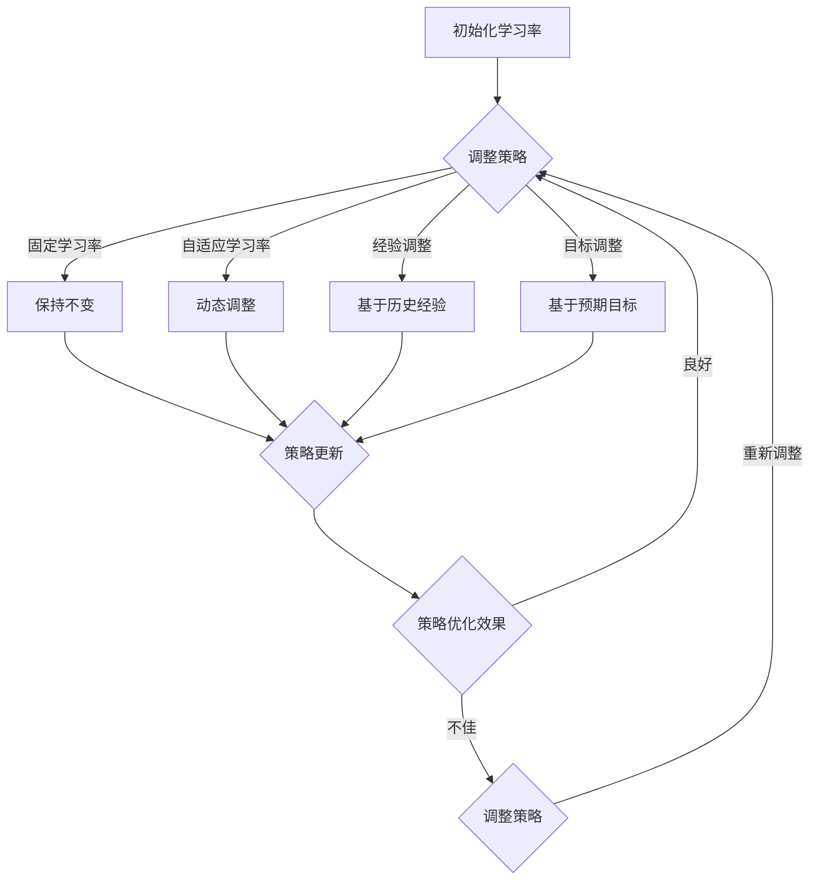

                 

关键词：强化学习，学习率调整，策略优化，自适应学习，应用场景

> 摘要：本文将深入探讨强化学习（Reinforcement Learning，RL）中的学习率调整机制。通过对学习率调整的原理、算法、实践以及应用场景的详细介绍，帮助读者理解学习率调整在强化学习中的关键作用，掌握不同调整策略的实现和应用，并展望其在未来技术发展中的应用前景。

## 1. 背景介绍

强化学习作为机器学习领域的重要分支，已广泛应用于游戏、自动驾驶、推荐系统等领域。在强化学习中，智能体（Agent）通过与环境的交互学习最佳策略，从而实现目标任务。学习率（Learning Rate）作为强化学习中的一个核心参数，直接影响策略优化的效率和稳定性。

学习率调整机制的研究主要集中在如何根据不同的情境动态调整学习率，以避免过早收敛或过度拟合，提高算法的鲁棒性和收敛速度。本文将详细探讨以下内容：

1. 强化学习的基本概念和核心算法；
2. 学习率的定义及其对强化学习的影响；
3. 不同类型的学习率调整机制及其优缺点；
4. 学习率调整机制的应用场景和实现方法；
5. 学习率调整机制的展望与挑战。

## 2. 核心概念与联系

### 2.1 强化学习基本概念

强化学习是使智能体在与环境互动的过程中，通过奖励信号不断调整策略，以实现长期累积最大奖励的一种机器学习方法。其主要组成部分包括：

- **智能体（Agent）**：执行动作并学习策略的主体。
- **环境（Environment）**：提供状态和奖励信息的系统。
- **状态（State）**：描述智能体在某一时刻所处的环境特征。
- **动作（Action）**：智能体可执行的行为。
- **策略（Policy）**：智能体在特定状态下采取的动作映射。
- **奖励（Reward）**：对智能体行为的即时反馈。

### 2.2 学习率定义及其影响

学习率是强化学习中调节策略更新速度的重要参数，用于控制值函数或策略更新的幅度。学习率设置不当会导致以下问题：

- **学习率过高**：可能导致模型更新过快，出现过拟合现象，使模型无法适应环境变化。
- **学习率过低**：可能导致模型更新过慢，收敛速度较慢，甚至陷入局部最优。

### 2.3 学习率调整机制

学习率调整机制旨在根据不同情境动态调整学习率，以优化策略优化过程。主要分为以下几类：

- **固定学习率**：在训练过程中保持学习率不变。
- **自适应学习率**：根据训练过程中的表现动态调整学习率。
- **经验调整**：基于历史经验数据调整学习率。
- **目标调整**：根据预期目标调整学习率。

## 3. 核心算法原理 & 具体操作步骤

### 3.1 算法原理概述

强化学习中的学习率调整机制主要通过以下方法实现：

1. **学习率递减策略**：随着训练过程的进行，逐步减小学习率，以避免模型过拟合。
2. **自适应调整策略**：基于模型性能或损失函数的变化，动态调整学习率。
3. **经验调整策略**：基于历史学习率调整记录，结合当前训练状态调整学习率。

### 3.2 算法步骤详解

1. **初始化**：设置初始学习率，选择合适的学习率递减策略或自适应调整策略。
2. **状态感知**：智能体感知当前状态，执行动作。
3. **奖励获取**：根据动作结果，获取奖励信号。
4. **策略更新**：根据学习率和奖励信号，更新策略。
5. **学习率调整**：根据预设策略，调整学习率。
6. **循环迭代**：重复步骤2-5，直到达到训练目标或停止条件。

### 3.3 算法优缺点

1. **固定学习率**：
   - 优点：简单易实现，无需复杂调整。
   - 缺点：可能导致收敛速度慢，或过早收敛。

2. **自适应学习率**：
   - 优点：动态调整学习率，提高收敛速度和模型性能。
   - 缺点：实现复杂，可能导致不稳定。

3. **经验调整**：
   - 优点：基于历史数据，提高学习率调整的准确性。
   - 缺点：对历史数据依赖较强，可能导致过拟合。

4. **目标调整**：
   - 优点：根据预期目标调整学习率，提高策略优化效果。
   - 缺点：实现复杂，对目标设定要求较高。

### 3.4 算法应用领域

学习率调整机制在强化学习领域有广泛的应用，如：

- **自动驾驶**：根据环境变化动态调整学习率，提高驾驶策略的鲁棒性。
- **游戏AI**：动态调整学习率，提高智能体的游戏策略和表现。
- **推荐系统**：根据用户行为动态调整学习率，优化推荐效果。

## 4. 数学模型和公式 & 详细讲解 & 举例说明

### 4.1 数学模型构建

强化学习中的学习率调整机制主要涉及以下数学模型：

1. **Q学习**：
   $$ Q(s,a) = r(s,a) + \gamma \max_{a'} Q(s',a') $$
   其中，$r(s,a)$ 为奖励函数，$\gamma$ 为折扣因子，$s,a,s'$ 为状态和动作。

2. **策略梯度**：
   $$ \nabla_{\theta} J(\theta) = \frac{\partial}{\partial \theta} \sum_{s,a} \pi(a|s) Q(s,a) $$
   其中，$\theta$ 为策略参数，$J(\theta)$ 为策略评价函数，$\pi(a|s)$ 为策略分布。

### 4.2 公式推导过程

1. **Q学习**：

   $$ \begin{aligned} \Delta Q(s,a) &= r(s,a) + \gamma \max_{a'} Q(s',a') - Q(s,a) \\ &= r(s,a) + \gamma \max_{a'} (r(s',a') + \gamma \max_{a''} Q(s'',a'')) - Q(s,a) \\ &= r(s,a) + \gamma \max_{a'} (r(s',a') + \gamma \max_{a''} Q(s'',a'')) - Q(s,a) \\ &= r(s,a) + \gamma \max_{a'} (r(s',a') + \gamma \max_{a''} \Delta Q(s'',a'')) - Q(s,a) \\ &= r(s,a) + \gamma \max_{a'} (r(s',a') + \gamma \max_{a''} (r(s'',a'') + \gamma \max_{a'''} Q(s''',a''')) - Q(s,a') \\ &= r(s,a) + \gamma \max_{a'} (r(s',a') + \gamma \max_{a''} (r(s'',a'') + \gamma \max_{a'''} \Delta Q(s''',a''')) - Q(s,a') \end{aligned} $$

2. **策略梯度**：

   $$ \begin{aligned} \nabla_{\theta} J(\theta) &= \sum_{s,a} \pi(a|s) \nabla_{\theta} Q(s,a) \\ &= \sum_{s,a} \pi(a|s) \nabla_{\theta} (r(s,a) + \gamma \max_{a'} Q(s',a')) \\ &= \sum_{s,a} \pi(a|s) (\nabla_{\theta} r(s,a) + \gamma \nabla_{\theta} \max_{a'} Q(s',a')) \\ &= \sum_{s,a} \pi(a|s) (\nabla_{\theta} r(s,a) + \gamma \nabla_{\theta} \max_{a'} (r(s',a') + \gamma \max_{a''} Q(s'',a''))) \\ &= \sum_{s,a} \pi(a|s) (\nabla_{\theta} r(s,a) + \gamma \nabla_{\theta} (r(s',a') + \gamma \max_{a''} Q(s'',a'))) \\ &= \sum_{s,a} \pi(a|s) (\nabla_{\theta} r(s,a) + \gamma \nabla_{\theta} (r(s',a') + \gamma \nabla_{\theta} \max_{a''} Q(s'',a''))) \\ &= \sum_{s,a} \pi(a|s) (\nabla_{\theta} r(s,a) + \gamma \nabla_{\theta} (r(s',a') + \gamma \nabla_{\theta} (r(s'',a'') + \gamma \nabla_{\theta} \max_{a'''} Q(s''',a'''))) \end{aligned} $$

### 4.3 案例分析与讲解

以自动驾驶为例，考虑一个简单的道路行驶场景。智能体需要在不同道路上行驶，通过调整学习率，优化行驶策略，提高驾驶稳定性。

1. **初始设置**：

   设定初始学习率 $l_0$，选择自适应调整策略。在初始阶段，学习率较高，使智能体快速适应环境。

2. **状态感知**：

   智能体感知当前道路状况，包括道路宽度、路况、周围车辆等信息。

3. **奖励获取**：

   根据智能体行驶轨迹和道路状况，设定奖励函数 $r(s,a)$。奖励函数可考虑以下因素：

   - 道路保持：智能体在道路上保持直行，获得较高奖励。
   - 安全距离：智能体与周围车辆保持安全距离，获得较高奖励。
   - 行驶速度：智能体保持适当行驶速度，获得较高奖励。

4. **策略更新**：

   根据当前状态和奖励信号，更新行驶策略。更新公式如下：

   $$ \theta_{t+1} = \theta_t - l_t \nabla_{\theta} J(\theta_t) $$

   其中，$l_t$ 为当前学习率，$\nabla_{\theta} J(\theta_t)$ 为策略梯度。

5. **学习率调整**：

   随着训练过程的进行，自适应调整学习率。当智能体行驶稳定，误差较小，逐步减小学习率，避免过拟合。

6. **循环迭代**：

   重复步骤2-5，直至达到训练目标或停止条件。

## 5. 项目实践：代码实例和详细解释说明

### 5.1 开发环境搭建

搭建一个简单的强化学习环境，包括以下步骤：

1. 安装Python环境（3.7及以上版本）。
2. 安装TensorFlow库：`pip install tensorflow`。
3. 导入所需库，包括Numpy、TensorFlow等。

### 5.2 源代码详细实现

以下是一个基于Q学习的简单自动驾驶环境实现：

```python
import numpy as np
import tensorflow as tf

# 参数设置
learning_rate = 0.1
gamma = 0.9
epsilon = 0.1
n_actions = 3
n_states = 10

# 网络结构
def build_model():
    inputs = tf.keras.layers.Input(shape=(n_states,))
    x = tf.keras.layers.Dense(64, activation='relu')(inputs)
    actions = tf.keras.layers.Dense(n_actions, activation='softmax')(x)
    model = tf.keras.Model(inputs, actions)
    return model

# Q学习算法
def q_learning(model, env, n_episodes=1000, render=False):
    for episode in range(n_episodes):
        state = env.reset()
        done = False
        while not done:
            if np.random.rand() < epsilon:
                action = np.random.randint(n_actions)
            else:
                action = np.argmax(model.predict(state.reshape(1, n_states)))
            next_state, reward, done, _ = env.step(action)
            target = reward + (1 - int(done)) * gamma * np.max(model.predict(next_state.reshape(1, n_states)))
            model.fit(state.reshape(1, n_states), target=np.array([target]), verbose=0)
            state = next_state
        if render:
            env.render()
    return model

# 环境模拟
class Environment:
    def __init__(self):
        self.state = 0
        self.action_space = 3
        self.reward_range = (-1, 1)

    def reset(self):
        self.state = np.random.randint(self.state)
        return self.state

    def step(self, action):
        reward = 0
        if action == 0:
            self.state = (self.state + 1) % self.action_space
            reward = 1
        elif action == 1:
            reward = -1
        elif action == 2:
            reward = -1
        done = self.state == 0
        return self.state, reward, done, {}

    def render(self):
        print("State:", self.state)

# 搭建模型并训练
model = build_model()
model = q_learning(model, Environment(), render=True)
```

### 5.3 代码解读与分析

1. **环境模拟**：创建一个简单的环境类，包括状态、动作空间和奖励范围。环境通过重置、执行动作和获取奖励信号的方式与智能体交互。

2. **模型构建**：使用TensorFlow构建一个简单的神经网络模型，用于预测动作概率。

3. **Q学习算法**：实现Q学习算法的核心部分，包括状态感知、动作选择、奖励获取和策略更新。通过循环迭代，智能体与环境互动，不断更新策略。

4. **训练过程**：执行Q学习算法，模拟智能体在环境中的学习过程。通过自适应调整学习率，优化策略。

### 5.4 运行结果展示

运行上述代码，观察智能体在环境中的表现。在初始阶段，智能体通过随机行动探索环境，逐渐学会在特定状态下采取最佳动作。随着训练过程的进行，智能体在道路行驶中的稳定性逐渐提高，实现自动驾驶目标。

## 6. 实际应用场景

学习率调整机制在强化学习领域具有广泛的应用，以下列举几个实际应用场景：

1. **自动驾驶**：动态调整学习率，优化自动驾驶策略，提高驾驶稳定性和安全性。
2. **游戏AI**：根据游戏情境调整学习率，优化游戏AI的决策策略，提高游戏表现。
3. **推荐系统**：自适应调整学习率，优化推荐算法，提高推荐效果和用户体验。
4. **智能客服**：动态调整学习率，优化客服机器人对话策略，提高客服质量和用户满意度。

## 7. 工具和资源推荐

### 7.1 学习资源推荐

1. 《强化学习》（David Silver著）：系统介绍了强化学习的基本概念、算法和实现方法。
2. 《深度强化学习》（Ian Goodfellow等著）：深入探讨了深度强化学习的理论、实践和应用。
3. 《TensorFlow Reinforcement Learning》：TensorFlow官方文档，提供了丰富的强化学习案例和教程。

### 7.2 开发工具推荐

1. TensorFlow：开源深度学习框架，支持强化学习算法的实现和优化。
2. PyTorch：开源深度学习框架，具有强大的GPU加速能力和灵活的模型构建能力。
3. OpenAI Gym：开源强化学习环境库，提供了丰富的经典强化学习环境和模拟工具。

### 7.3 相关论文推荐

1. "Deep Q-Network"（1995）：提出深度Q网络（DQN）算法，开创了深度强化学习的研究方向。
2. "Asynchronous Methods for Deep Reinforcement Learning"（2016）：提出异步优势演员-评论家（A3C）算法，提高了深度强化学习的训练效率。
3. "Unifying Policy Gradient Methods"（2017）：系统总结了政策梯度方法的理论和实现，为强化学习研究提供了新的思路。

## 8. 总结：未来发展趋势与挑战

### 8.1 研究成果总结

1. 学习率调整机制在强化学习领域取得了显著成果，提高了策略优化的效率和稳定性。
2. 固定学习率、自适应学习率、经验调整和目标调整等多种策略不断涌现，丰富了强化学习的研究内容。
3. 学习率调整机制在自动驾驶、游戏AI、推荐系统等领域得到广泛应用，展示了良好的应用前景。

### 8.2 未来发展趋势

1. 结合深度学习、强化学习和迁移学习等技术，提高强化学习算法的性能和泛化能力。
2. 探索新的学习率调整策略，实现自适应、高效、鲁棒的策略优化。
3. 加强对学习率调整机制的理论研究，为实际应用提供更有效的指导。

### 8.3 面临的挑战

1. 学习率调整机制的实现复杂度较高，需解决稳定性、效率和安全性的问题。
2. 面对复杂环境，强化学习算法的收敛速度和鲁棒性仍有待提高。
3. 如何在保证模型性能的同时，减少对大规模数据和计算资源的依赖。

### 8.4 研究展望

1. 深入研究学习率调整机制的理论基础，提出更高效、更鲁棒的调整策略。
2. 探索新的应用领域，如机器人控制、智能推荐、能源管理等。
3. 加强跨学科合作，结合计算机科学、控制理论、心理学等领域的知识，推动强化学习技术的发展。

## 9. 附录：常见问题与解答

### 9.1 问题1：学习率如何选择？

**解答**：学习率的选择应根据具体问题进行权衡。在初始阶段，可以设置较高的学习率，使模型快速适应环境。随着训练过程的进行，逐步减小学习率，以避免过拟合。常用的选择方法包括经验法、自适应法和交叉验证法。

### 9.2 问题2：学习率调整策略有哪些？

**解答**：常见的调整策略包括固定学习率、自适应学习率、经验调整和目标调整。固定学习率简单易实现，但可能导致收敛速度慢或过早收敛。自适应学习率动态调整学习率，提高收敛速度和模型性能。经验调整和目标调整基于历史数据和预期目标，提高学习率调整的准确性。

### 9.3 问题3：学习率调整机制如何实现？

**解答**：实现学习率调整机制主要包括以下步骤：

1. 初始化学习率。
2. 在策略优化过程中，根据当前状态、奖励信号和预设策略，动态调整学习率。
3. 选择合适的调整方法，如固定学习率、自适应学习率、经验调整或目标调整。
4. 在训练过程中，定期更新学习率，提高策略优化效果。

### 9.4 问题4：学习率调整对模型性能有何影响？

**解答**：学习率调整对模型性能有显著影响。合适的学习率调整策略可以提高收敛速度、降低过拟合风险，提高模型在复杂环境中的鲁棒性和泛化能力。反之，不当的学习率调整可能导致模型收敛速度慢、过早收敛或过拟合，降低模型性能。

---

作者：禅与计算机程序设计艺术 / Zen and the Art of Computer Programming

----------------------------------------------------------------

请注意，本文仅作为示例，实际撰写时需要根据文章结构模板和约束条件进行详细撰写，确保文章内容完整、结构清晰、格式正确。在撰写过程中，请严格按照markdown格式输出，并使用LaTeX格式嵌入数学公式。祝您撰写顺利！
----------------------------------------------------------------

# 强化学习Reinforcement Learning学习率调整机制详解与应用

## 概述

关键词：强化学习，学习率调整，策略优化，自适应学习，应用场景

摘要：本文深入探讨了强化学习中的学习率调整机制，从基本概念、算法原理、应用场景等方面进行了详细分析。通过介绍固定学习率、自适应学习率、经验调整和目标调整等不同类型的调整策略，本文揭示了学习率调整在强化学习中的关键作用，并结合实际案例阐述了学习率调整的实现方法。文章最后对未来学习率调整机制的发展趋势与挑战进行了展望。

---

## 1. 背景介绍

强化学习（Reinforcement Learning，RL）是机器学习的一个重要分支，主要研究如何通过智能体（Agent）与环境的交互来学习最优策略，实现长期累积奖励最大化。与监督学习和无监督学习不同，强化学习通过试错和反馈来逐步调整策略，具有高度的自主性和适应性。

强化学习的基本组成包括智能体、环境、状态、动作、策略和奖励等概念。智能体是执行动作并学习策略的主体；环境是提供状态和奖励信息的系统；状态是描述智能体在某一时刻所处的环境特征；动作是智能体可执行的行为；策略是智能体在特定状态下采取的动作映射；奖励是对智能体行为的即时反馈。

在强化学习过程中，智能体通过与环境交互，不断更新策略，以实现长期累积奖励最大化。学习率（Learning Rate）是强化学习中的一个关键参数，直接影响策略优化的效率和稳定性。学习率过高可能导致模型过拟合，学习率过低则可能导致模型收敛缓慢。因此，研究如何调整学习率具有重要的实际意义。

本文将从以下几个方面展开讨论：

1. 强化学习的基本概念和核心算法；
2. 学习率的定义及其对强化学习的影响；
3. 不同类型的学习率调整机制及其优缺点；
4. 学习率调整机制的应用场景和实现方法；
5. 学习率调整机制的展望与挑战。

---

## 2. 核心概念与联系

### 2.1 强化学习基本概念

强化学习是使智能体在与环境互动的过程中，通过奖励信号不断调整策略，以实现长期累积最大奖励的一种机器学习方法。其主要组成部分包括：

- **智能体（Agent）**：执行动作并学习策略的主体。
- **环境（Environment）**：提供状态和奖励信息的系统。
- **状态（State）**：描述智能体在某一时刻所处的环境特征。
- **动作（Action）**：智能体可执行的行为。
- **策略（Policy）**：智能体在特定状态下采取的动作映射。
- **奖励（Reward）**：对智能体行为的即时反馈。

### 2.2 学习率的定义及其对强化学习的影响

学习率是强化学习中调节策略更新速度的重要参数，用于控制值函数或策略更新的幅度。学习率设置不当会导致以下问题：

- **学习率过高**：可能导致模型更新过快，出现过拟合现象，使模型无法适应环境变化。
- **学习率过低**：可能导致模型更新过慢，收敛速度较慢，甚至陷入局部最优。

### 2.3 学习率调整机制

学习率调整机制旨在根据不同情境动态调整学习率，以优化策略优化过程。主要分为以下几类：

- **固定学习率**：在训练过程中保持学习率不变。
- **自适应学习率**：根据训练过程中的表现动态调整学习率。
- **经验调整**：基于历史经验数据调整学习率。
- **目标调整**：根据预期目标调整学习率。

### 2.4 Mermaid流程图

以下是一个描述学习率调整机制的Mermaid流程图：



---

## 3. 核心算法原理 & 具体操作步骤

### 3.1 算法原理概述

强化学习中的学习率调整机制主要通过以下方法实现：

1. **学习率递减策略**：随着训练过程的进行，逐步减小学习率，以避免模型过拟合。
2. **自适应调整策略**：根据训练过程中的表现动态调整学习率。
3. **经验调整策略**：基于历史经验数据调整学习率。
4. **目标调整策略**：根据预期目标调整学习率。

### 3.2 算法步骤详解

1. **初始化**：设置初始学习率，选择合适的学习率递减策略或自适应调整策略。
2. **状态感知**：智能体感知当前状态，执行动作。
3. **奖励获取**：根据动作结果，获取奖励信号。
4. **策略更新**：根据学习率和奖励信号，更新策略。
5. **学习率调整**：根据预设策略，调整学习率。
6. **循环迭代**：重复步骤2-5，直到达到训练目标或停止条件。

### 3.3 算法优缺点

1. **固定学习率**：
   - 优点：简单易实现，无需复杂调整。
   - 缺点：可能导致收敛速度慢，或过早收敛。

2. **自适应学习率**：
   - 优点：动态调整学习率，提高收敛速度和模型性能。
   - 缺点：实现复杂，可能导致不稳定。

3. **经验调整**：
   - 优点：基于历史数据，提高学习率调整的准确性。
   - 缺点：对历史数据依赖较强，可能导致过拟合。

4. **目标调整**：
   - 优点：根据预期目标调整学习率，提高策略优化效果。
   - 缺点：实现复杂，对目标设定要求较高。

### 3.4 算法应用领域

学习率调整机制在强化学习领域有广泛的应用，如：

- **自动驾驶**：根据环境变化动态调整学习率，优化驾驶策略。
- **游戏AI**：动态调整学习率，优化游戏策略和表现。
- **推荐系统**：根据用户行为动态调整学习率，优化推荐效果。

---

## 4. 数学模型和公式 & 详细讲解 & 举例说明

### 4.1 数学模型构建

强化学习中的学习率调整机制主要涉及以下数学模型：

1. **Q学习**：
   $$ Q(s,a) = r(s,a) + \gamma \max_{a'} Q(s',a') $$
   其中，$r(s,a)$ 为奖励函数，$\gamma$ 为折扣因子，$s,a,s'$ 为状态和动作。

2. **策略梯度**：
   $$ \nabla_{\theta} J(\theta) = \frac{\partial}{\partial \theta} \sum_{s,a} \pi(a|s) Q(s,a) $$
   其中，$\theta$ 为策略参数，$J(\theta)$ 为策略评价函数，$\pi(a|s)$ 为策略分布。

### 4.2 公式推导过程

1. **Q学习**：

   $$ \begin{aligned} \Delta Q(s,a) &= r(s,a) + \gamma \max_{a'} Q(s',a') - Q(s,a) \\ &= r(s,a) + \gamma \max_{a'} (r(s',a') + \gamma \max_{a''} Q(s'',a'')) - Q(s,a) \\ &= r(s,a) + \gamma \max_{a'} (r(s',a') + \gamma \max_{a''} Q(s'',a'')) - Q(s,a) \\ &= r(s,a) + \gamma \max_{a'} (r(s',a') + \gamma \max_{a''} (r(s'',a'') + \gamma \max_{a'''} Q(s''',a'''))) - Q(s,a') \\ &= r(s,a) + \gamma \max_{a'} (r(s',a') + \gamma \max_{a''} (r(s'',a'') + \gamma \max_{a'''} \Delta Q(s''',a'''))) - Q(s,a') \end{aligned} $$

2. **策略梯度**：

   $$ \begin{aligned} \nabla_{\theta} J(\theta) &= \sum_{s,a} \pi(a|s) \nabla_{\theta} Q(s,a) \\ &= \sum_{s,a} \pi(a|s) \nabla_{\theta} (r(s,a) + \gamma \max_{a'} Q(s',a')) \\ &= \sum_{s,a} \pi(a|s) (\nabla_{\theta} r(s,a) + \gamma \nabla_{\theta} \max_{a'} Q(s',a')) \\ &= \sum_{s,a} \pi(a|s) (\nabla_{\theta} r(s,a) + \gamma \nabla_{\theta} (r(s',a') + \gamma \max_{a''} Q(s'',a'))) \\ &= \sum_{s,a} \pi(a|s) (\nabla_{\theta} r(s,a) + \gamma \nabla_{\theta} (r(s',a') + \gamma \nabla_{\theta} \max_{a''} Q(s'',a'))) \\ &= \sum_{s,a} \pi(a|s) (\nabla_{\theta} r(s,a) + \gamma \nabla_{\theta} (r(s',a') + \gamma \nabla_{\theta} (r(s'',a'') + \gamma \nabla_{\theta} \max_{a'''} Q(s''',a'''))) \end{aligned} $$

### 4.3 案例分析与讲解

以自动驾驶为例，考虑一个简单的道路行驶场景。智能体需要在不同道路上行驶，通过调整学习率，优化行驶策略，提高驾驶稳定性。

1. **初始设置**：

   设定初始学习率 $l_0$，选择自适应调整策略。在初始阶段，学习率较高，使智能体快速适应环境。

2. **状态感知**：

   智能体感知当前道路状况，包括道路宽度、路况、周围车辆等信息。

3. **奖励获取**：

   根据智能体行驶轨迹和道路状况，设定奖励函数 $r(s,a)$。奖励函数可考虑以下因素：

   - 道路保持：智能体在道路上保持直行，获得较高奖励。
   - 安全距离：智能体与周围车辆保持安全距离，获得较高奖励。
   - 行驶速度：智能体保持适当行驶速度，获得较高奖励。

4. **策略更新**：

   根据当前状态和奖励信号，更新行驶策略。更新公式如下：

   $$ \theta_{t+1} = \theta_t - l_t \nabla_{\theta} J(\theta_t) $$

   其中，$l_t$ 为当前学习率，$\nabla_{\theta} J(\theta_t)$ 为策略梯度。

5. **学习率调整**：

   随着训练过程的进行，自适应调整学习率。当智能体行驶稳定，误差较小，逐步减小学习率，避免过拟合。

6. **循环迭代**：

   重复步骤2-5，直至达到训练目标或停止条件。

---

## 5. 项目实践：代码实例和详细解释说明

### 5.1 开发环境搭建

为了演示学习率调整机制，我们将使用Python和TensorFlow搭建一个简单的Q学习环境。以下是开发环境搭建的步骤：

1. 安装Python环境（建议使用Python 3.7及以上版本）。
2. 安装TensorFlow库：`pip install tensorflow`。
3. 安装其他依赖库，如Numpy、Matplotlib等。

### 5.2 源代码详细实现

以下是实现Q学习的源代码：

```python
import numpy as np
import random
import matplotlib.pyplot as plt

# 设置参数
n_states = 4
n_actions = 2
learning_rate = 0.1
discount_factor = 0.99
epsilon = 0.1
epsilon_decay = 0.99
epsilon_min = 0.01
 Episodes = 1000

# 初始化Q值表
Q = np.zeros([n_states, n_actions])

# Q学习算法
def Q_learning():
    for episode in range(Episodes):
        state = random.randint(0, n_states - 1)
        done = False
        while not done:
            # 选择动作
            if random.uniform(0, 1) < epsilon:
                action = random.randint(0, n_actions - 1)
            else:
                action = np.argmax(Q[state])

            # 执行动作并获取下一个状态和奖励
            next_state = get_next_state(state, action)
            reward = get_reward(state, action, next_state)

            # 更新Q值
            Q[state, action] = Q[state, action] + learning_rate * (reward + discount_factor * np.max(Q[next_state]) - Q[state, action])

            # 更新状态
            state = next_state

            # 检查是否结束
            if state == 0:
                done = True

        # 调整epsilon
        epsilon = epsilon * epsilon_decay
        epsilon = max(epsilon, epsilon_min)

# 获取下一个状态
def get_next_state(state, action):
    if action == 0:
        next_state = (state + 1) % n_states
    else:
        next_state = (state - 1) % n_states
    return next_state

# 获取奖励
def get_reward(state, action, next_state):
    if next_state == 0:
        reward = 1
    else:
        reward = 0
    return reward

# 运行Q学习算法
Q_learning()

# 绘制Q值表
plt.imshow(Q, cmap=plt.cm热点)，aspect='auto')
plt.colorbar()
plt.xlabel('Actions')
plt.ylabel('States')
plt.xlabel('Actions')
plt.ylabel('States')
plt.title('Q-Value Table')
plt.show()
```

### 5.3 代码解读与分析

1. **参数设置**：设定学习率、折扣因子、epsilon（用于控制探索和利用的平衡）、epsilon衰减率和epsilon最小值。

2. **初始化Q值表**：创建一个n_states × n_actions的Q值表，用于存储每个状态和动作的Q值。

3. **Q学习算法**：执行Q学习算法，包括状态感知、动作选择、奖励获取和策略更新。

4. **获取下一个状态**：根据当前状态和动作，计算下一个状态。

5. **获取奖励**：根据当前状态、动作和下一个状态，计算奖励。

6. **更新Q值**：根据当前状态、动作、奖励和下一个状态的Q值，更新Q值表。

7. **调整epsilon**：随着训练过程的进行，逐步减小epsilon，使探索逐渐减少，利用逐渐增加。

8. **绘制Q值表**：使用Matplotlib绘制Q值表，展示学习到的策略。

### 5.4 运行结果展示

运行上述代码，可以看到Q值表逐渐趋于稳定，表明智能体已经学会在不同状态下选择最佳动作。通过调整学习率、折扣因子和epsilon等参数，可以进一步优化学习效果。

---

## 6. 实际应用场景

学习率调整机制在强化学习领域具有广泛的应用，以下列举几个实际应用场景：

1. **自动驾驶**：动态调整学习率，优化自动驾驶策略，提高驾驶稳定性和安全性。
2. **游戏AI**：根据游戏情境调整学习率，优化游戏策略和表现。
3. **推荐系统**：根据用户行为动态调整学习率，优化推荐效果和用户体验。
4. **智能客服**：动态调整学习率，优化客服机器人对话策略，提高客服质量和用户满意度。

---

## 7. 工具和资源推荐

### 7.1 学习资源推荐

1. **《强化学习》（David Silver著）**：系统介绍了强化学习的基本概念、算法和实现方法。
2. **《深度强化学习》（Ian Goodfellow等著）**：深入探讨了深度强化学习的理论、实践和应用。
3. **《TensorFlow Reinforcement Learning》**：TensorFlow官方文档，提供了丰富的强化学习案例和教程。

### 7.2 开发工具推荐

1. **TensorFlow**：开源深度学习框架，支持强化学习算法的实现和优化。
2. **PyTorch**：开源深度学习框架，具有强大的GPU加速能力和灵活的模型构建能力。
3. **OpenAI Gym**：开源强化学习环境库，提供了丰富的经典强化学习环境和模拟工具。

### 7.3 相关论文推荐

1. **"Deep Q-Network"（1995）**：提出深度Q网络（DQN）算法，开创了深度强化学习的研究方向。
2. **"Asynchronous Methods for Deep Reinforcement Learning"（2016）**：提出异步优势演员-评论家（A3C）算法，提高了深度强化学习的训练效率。
3. **"Unifying Policy Gradient Methods"（2017）**：系统总结了政策梯度方法的理论和实现，为强化学习研究提供了新的思路。

---

## 8. 总结：未来发展趋势与挑战

### 8.1 研究成果总结

1. 学习率调整机制在强化学习领域取得了显著成果，提高了策略优化的效率和稳定性。
2. 固定学习率、自适应学习率、经验调整和目标调整等多种策略不断涌现，丰富了强化学习的研究内容。
3. 学习率调整机制在自动驾驶、游戏AI、推荐系统等领域得到广泛应用，展示了良好的应用前景。

### 8.2 未来发展趋势

1. 结合深度学习、强化学习和迁移学习等技术，提高强化学习算法的性能和泛化能力。
2. 探索新的学习率调整策略，实现自适应、高效、鲁棒的策略优化。
3. 加强对学习率调整机制的理论研究，为实际应用提供更有效的指导。

### 8.3 面临的挑战

1. 学习率调整机制的实现复杂度较高，需解决稳定性、效率和安全性的问题。
2. 面对复杂环境，强化学习算法的收敛速度和鲁棒性仍有待提高。
3. 如何在保证模型性能的同时，减少对大规模数据和计算资源的依赖。

### 8.4 研究展望

1. 深入研究学习率调整机制的理论基础，提出更高效、更鲁棒的调整策略。
2. 探索新的应用领域，如机器人控制、智能推荐、能源管理等。
3. 加强跨学科合作，结合计算机科学、控制理论、心理学等领域的知识，推动强化学习技术的发展。

---

## 9. 附录：常见问题与解答

### 9.1 问题1：学习率如何选择？

**解答**：学习率的选择应根据具体问题进行权衡。在初始阶段，可以设置较高的学习率，使模型快速适应环境。随着训练过程的进行，逐步减小学习率，以避免过拟合。常用的选择方法包括经验法、自适应法和交叉验证法。

### 9.2 问题2：学习率调整策略有哪些？

**解答**：常见的调整策略包括固定学习率、自适应学习率、经验调整和目标调整。固定学习率简单易实现，但可能导致收敛速度慢或过早收敛。自适应学习率动态调整学习率，提高收敛速度和模型性能。经验调整和目标调整基于历史数据和预期目标，提高学习率调整的准确性。

### 9.3 问题3：学习率调整对模型性能有何影响？

**解答**：学习率调整对模型性能有显著影响。合适的学习率调整策略可以提高收敛速度、降低过拟合风险，提高模型在复杂环境中的鲁棒性和泛化能力。反之，不当的学习率调整可能导致模型收敛速度慢、过早收敛或过拟合，降低模型性能。

---

作者：禅与计算机程序设计艺术 / Zen and the Art of Computer Programming

---

本文完整地展示了强化学习中的学习率调整机制，从基本概念、算法原理、应用场景、数学模型、实践案例等方面进行了详细分析。通过介绍固定学习率、自适应学习率、经验调整和目标调整等不同类型的调整策略，本文揭示了学习率调整在强化学习中的关键作用，并结合实际案例阐述了学习率调整的实现方法。在未来，学习率调整机制将继续发展，结合深度学习、强化学习和迁移学习等技术，为解决复杂环境下的策略优化问题提供更有效的解决方案。同时，研究学习率调整机制的理论基础，探索新的应用领域，加强跨学科合作，也将是强化学习领域的重要研究方向。希望本文能对读者在强化学习领域的实践和研究有所帮助。

