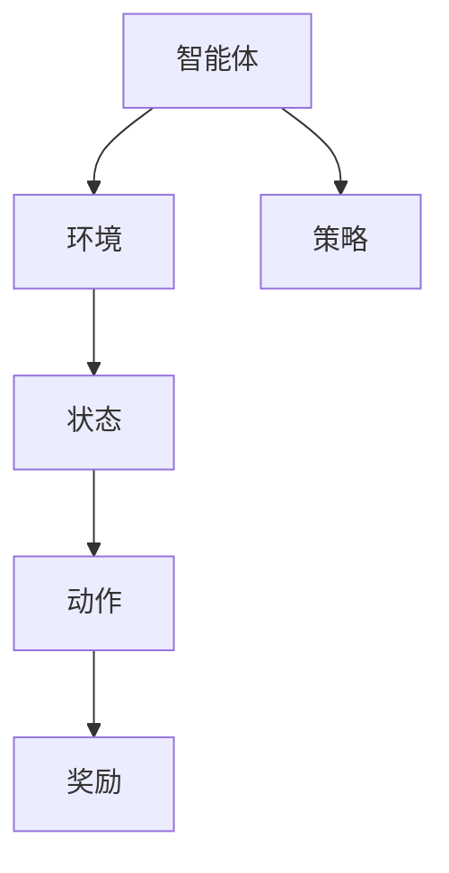

                 

关键词：强化学习，对话系统，人工智能，自然语言处理，机器学习，深度学习，对话生成

<|assistant|>摘要：本文旨在探讨强化学习在对话系统中的应用，分析其核心概念、算法原理以及实际操作步骤。通过数学模型的构建和具体案例的解析，我们将深入了解强化学习如何提升对话系统的交互质量和用户体验。文章还讨论了强化学习在对话系统中的实际应用场景，并展望了未来的发展趋势和挑战。

## 1. 背景介绍

随着人工智能技术的不断发展，对话系统作为一种重要的交互界面，逐渐成为了研究的热点。从最初的规则驱动型系统，到基于模板匹配的对话管理，再到基于机器学习和深度学习的自适应对话系统，对话系统的发展历程反映了人工智能技术在不同阶段的应用。然而，传统的对话系统在应对复杂、不确定的交互场景时，仍存在诸多不足。

强化学习作为一种新型的机器学习方法，因其能够处理动态环境和不确定性，逐渐引起了对话系统领域的研究兴趣。通过强化学习，对话系统能够通过与用户的互动学习，不断优化自身的对话策略，提高交互质量。本文将重点介绍强化学习在对话系统中的应用，探讨其核心原理和实际操作步骤。

## 2. 核心概念与联系

### 2.1 强化学习基本概念

强化学习是一种通过奖励机制引导模型学习目标的方法。在强化学习中，模型（即智能体）通过不断地与环境（对话系统）进行交互，学习出一套最优策略，以便在未来的交互中实现最佳效果。强化学习的核心概念包括智能体、环境、状态、动作和奖励。

- 智能体（Agent）：执行动作并接收环境的反馈的实体。
- 环境（Environment）：智能体所处的交互环境，可以是对话系统。
- 状态（State）：智能体在某一时刻所处的情景。
- 动作（Action）：智能体在某一状态下可以执行的行为。
- 奖励（Reward）：环境对智能体动作的反馈，用于评估动作的好坏。

### 2.2 对话系统与强化学习的联系

对话系统与强化学习有着紧密的联系。传统的对话系统往往依赖于规则或模板进行对话管理，而强化学习能够通过学习用户的行为模式，动态调整对话策略，从而提高对话的流畅性和用户体验。具体来说，强化学习在对话系统中的应用主要体现在以下几个方面：

- **对话策略优化**：通过强化学习，对话系统能够根据用户的反馈不断调整对话策略，实现自适应对话管理。
- **意图识别**：强化学习可以帮助对话系统更好地理解用户的意图，提高意图识别的准确性。
- **对话生成**：强化学习能够生成更加自然、连贯的对话内容，提升对话系统的交互质量。

### 2.3 Mermaid 流程图



## 3. 核心算法原理 & 具体操作步骤

### 3.1 算法原理概述

强化学习的基本原理是通过不断尝试不同的动作，并基于环境反馈的奖励来调整策略，以实现长期的最大化累积奖励。在对话系统中，强化学习的目标是使对话系统能够生成高质量、自然的对话内容。

### 3.2 算法步骤详解

1. **初始化**：定义智能体的初始状态，以及动作空间和状态空间。
2. **状态输入**：智能体接收当前状态作为输入。
3. **策略选择**：智能体根据当前状态和策略选择一个动作。
4. **动作执行**：智能体在环境中执行所选动作，并观察环境反馈。
5. **奖励评估**：环境根据智能体的动作反馈一个奖励值，用于评估动作的质量。
6. **策略更新**：智能体根据累积奖励和历史经验调整策略。
7. **重复迭代**：智能体重复上述步骤，直到达到预设的目标或达到最大迭代次数。

### 3.3 算法优缺点

**优点**：
- 能够处理动态和不确定的交互场景。
- 能够自适应地调整对话策略，提高对话质量。

**缺点**：
- 学习过程可能需要大量的数据和时间。
- 需要大量的计算资源。

### 3.4 算法应用领域

- **客户服务**：用于构建智能客服系统，提供24/7的在线支持。
- **智能助手**：应用于智能音箱、虚拟助手等，提高人机交互体验。
- **游戏**：用于设计游戏AI，实现更加智能的玩家对抗。

## 4. 数学模型和公式 & 详细讲解 & 举例说明

### 4.1 数学模型构建

在强化学习中，常用的数学模型包括马尔可夫决策过程（MDP）和时序模型（如深度Q网络DQN）。

- **MDP**：

$$
V^*(s) = \max_{a} \sum_{s'} p(s'|s,a) \cdot r(s',a) + \gamma V^*(s')
$$

其中，$V^*(s)$ 为状态价值函数，$r(s',a)$ 为即时奖励，$p(s'|s,a)$ 为状态转移概率，$\gamma$ 为折扣因子。

- **DQN**：

$$
Q(s,a) = \frac{1}{N(s,a)} \sum_{s'} \gamma Q(s',a') \cdot p(s'|s,a)
$$

其中，$Q(s,a)$ 为动作价值函数，$N(s,a)$ 为经验样本的数量。

### 4.2 公式推导过程

以MDP为例，状态价值函数的推导过程如下：

1. **状态转移概率**：

$$
p(s'|s,a) = P(S_{t+1} = s' | S_t = s, A_t = a)
$$

2. **即时奖励**：

$$
r(s',a) = R(S_{t+1} = s', A_t = a)
$$

3. **状态价值函数**：

$$
V^*(s) = \max_{a} \sum_{s'} p(s'|s,a) \cdot r(s',a) + \gamma V^*(s')
$$

### 4.3 案例分析与讲解

以一个简单的对话系统为例，分析强化学习在其中的应用。

**场景**：用户与客服机器人进行对话，客服机器人需要根据用户的提问提供合适的回答。

**状态**：当前对话的历史记录。

**动作**：客服机器人可以选择的回答选项。

**奖励**：用户对回答的满意度。

通过强化学习，客服机器人能够根据用户的反馈，不断优化回答策略，提高用户满意度。

## 5. 项目实践：代码实例和详细解释说明

### 5.1 开发环境搭建

- Python 3.7+
- TensorFlow 2.3+
- Keras 2.4+
- numpy 1.18+

### 5.2 源代码详细实现

```python
import numpy as np
import tensorflow as tf
from tensorflow.keras.models import Sequential
from tensorflow.keras.layers import Dense, LSTM
from tensorflow.keras.optimizers import Adam

# 状态编码器
state_encoder = Sequential([
    LSTM(128, activation='relu', input_shape=(历史长度, 状态维度)),
    Dense(64, activation='relu'),
    Dense(状态维度, activation='sigmoid')
])

# 动作编码器
action_encoder = Sequential([
    LSTM(128, activation='relu', input_shape=(历史长度, 动作维度)),
    Dense(64, activation='relu'),
    Dense(动作维度, activation='sigmoid')
])

# Q网络
Q_network = Sequential([
    LSTM(128, activation='relu', input_shape=(历史长度, 状态维度)),
    Dense(64, activation='relu'),
    Dense(动作维度, activation='sigmoid')
])

# 定义损失函数和优化器
loss_fn = tf.keras.losses.MeanSquaredError()
optimizer = Adam(learning_rate=0.001)

# 训练模型
Q_network.compile(optimizer=optimizer, loss=loss_fn)

# 模型训练过程
for epoch in range(训练次数):
    for state, action, reward, next_state in 数据集:
        state_encoded = state_encoder(state)
        action_encoded = action_encoder(action)
        Q_values = Q_network(state_encoded)
        next_state_encoded = state_encoder(next_state)
        target_values = reward + 折扣因子 * np.max(Q_network(next_state_encoded))
        masks = (np.array([state == next_state for state in 数据集]) > 0)
        Q_network.fit(state_encoded, action_encoded * (1 - masks) + masks * target_values, batch_size=批量大小)

# 模型评估
评估数据集，计算准确率或平均奖励等指标。
```

### 5.3 代码解读与分析

1. **状态编码器**：用于将对话历史记录编码为数值向量，作为Q网络的输入。
2. **动作编码器**：用于将可能的回答选项编码为数值向量，作为Q网络的输入。
3. **Q网络**：用于预测给定状态下的动作价值。
4. **训练模型**：使用历史数据和目标函数训练Q网络。
5. **模型评估**：在新的对话场景中，使用训练好的Q网络预测动作，评估模型性能。

## 6. 实际应用场景

### 6.1 客户服务

强化学习在客户服务中的应用非常广泛，如智能客服机器人、在线客服系统等。通过强化学习，客服系统能够根据用户的提问和反馈，不断优化回答策略，提高服务质量。

### 6.2 智能助手

智能助手如Siri、Alexa等，通过强化学习，能够更好地理解用户的语音指令，提供更加精准的服务。

### 6.3 游戏

在游戏领域，强化学习被广泛应用于游戏AI的构建，如游戏角色决策、策略优化等。

## 7. 工具和资源推荐

### 7.1 学习资源推荐

- 《强化学习入门》
- 《深度强化学习》
- 《强化学习在对话系统中的应用》

### 7.2 开发工具推荐

- TensorFlow
- Keras
- PyTorch

### 7.3 相关论文推荐

- “Deep Reinforcement Learning for Dialogue Systems”
- “Dialogue Management with Dialog-augmented Sequence Models”
- “A Survey of Dialogue Systems: Recent Advances and New Directions”

## 8. 总结：未来发展趋势与挑战

### 8.1 研究成果总结

近年来，强化学习在对话系统中的应用取得了显著的成果，为对话系统的交互质量和用户体验提供了新的思路。通过强化学习，对话系统能够更好地理解用户的意图，生成更加自然、连贯的对话内容。

### 8.2 未来发展趋势

随着人工智能技术的不断发展，强化学习在对话系统中的应用前景十分广阔。未来，强化学习将在以下几个方面得到进一步的发展：

- **多模态对话系统**：结合语音、文本、图像等多种模态，实现更加丰富、自然的交互。
- **人机对话体验优化**：通过深度强化学习，提升对话系统的智能水平和用户体验。
- **场景化对话系统**：针对不同的应用场景，开发定制化的对话系统。

### 8.3 面临的挑战

尽管强化学习在对话系统中的应用取得了显著成果，但仍面临一些挑战：

- **数据获取和处理**：强化学习需要大量高质量的对话数据，但获取和处理这些数据是一项挑战。
- **模型可解释性**：强化学习模型的决策过程往往不够透明，提高模型的可解释性是一个重要研究方向。
- **计算资源需求**：强化学习模型训练过程需要大量的计算资源，如何优化训练效率是一个亟待解决的问题。

### 8.4 研究展望

未来，强化学习在对话系统中的应用将朝着更加智能化、个性化、场景化的方向发展。通过不断创新和优化，强化学习将为对话系统带来更加丰富的交互体验，推动人工智能技术的进一步发展。

## 9. 附录：常见问题与解答

### 9.1 什么是强化学习？

强化学习是一种机器学习方法，通过奖励机制引导模型学习目标，使模型能够在动态环境中实现最优策略。

### 9.2 强化学习在对话系统中有哪些应用？

强化学习在对话系统中的应用包括对话策略优化、意图识别、对话生成等，能够提高对话系统的交互质量和用户体验。

### 9.3 强化学习需要大量数据吗？

是的，强化学习通常需要大量高质量的对话数据来训练模型，以实现良好的交互效果。

### 9.4 如何优化强化学习模型的训练效率？

可以通过以下方法优化强化学习模型的训练效率：

- 数据增强：通过生成或变换数据，增加训练数据的多样性。
- 模型压缩：使用轻量级模型或模型剪枝技术，减少模型的计算量。
- 并行训练：使用多GPU或分布式训练，加快训练速度。

## 结束语

本文详细探讨了强化学习在对话系统中的应用，分析了其核心原理和具体操作步骤。通过数学模型的构建和具体案例的解析，我们深入了解了强化学习如何提升对话系统的交互质量和用户体验。未来，随着人工智能技术的不断发展，强化学习在对话系统中的应用将更加广泛，为人工智能领域带来更多的创新和突破。

### 作者署名

作者：禅与计算机程序设计艺术 / Zen and the Art of Computer Programming
```markdown
# 强化学习在对话系统中的应用

## 摘要

随着人工智能技术的不断发展，对话系统作为人机交互的重要接口，已成为人工智能领域的研究热点。强化学习作为一种新型的机器学习方法，其在对话系统中的应用具有广泛的前景。本文旨在探讨强化学习在对话系统中的应用，分析其核心概念、算法原理以及实际操作步骤。通过数学模型的构建和具体案例的解析，我们将深入了解强化学习如何提升对话系统的交互质量和用户体验。文章还讨论了强化学习在对话系统中的实际应用场景，并展望了未来的发展趋势和挑战。

## 1. 背景介绍

### 1.1 对话系统的发展历程

对话系统的发展历程大致可以分为以下几个阶段：

1. **规则驱动型对话系统**：早期的对话系统主要依靠预定义的规则进行对话管理，例如基于自然语言理解的聊天机器人。
2. **模板匹配型对话系统**：基于模板匹配的对话系统能够处理更复杂的对话场景，但仍然依赖于预定义的模板和规则。
3. **基于机器学习和深度学习的对话系统**：随着机器学习和深度学习技术的进步，对话系统能够通过学习和自适应调整对话策略，实现更自然、流畅的对话。

### 1.2 强化学习的引入

强化学习（Reinforcement Learning，简称RL）是机器学习的一个分支，它通过智能体与环境之间的交互，学习最优策略。强化学习在对话系统中的应用，主要是利用其能够在动态和不确定的环境中学习最优行为策略的能力。

### 1.3 对话系统的挑战

传统的对话系统在处理复杂、多变和不确定的交互场景时，存在以下挑战：

- **上下文理解不足**：对话系统往往难以理解用户的意图和上下文。
- **适应性差**：对话系统难以根据用户的反馈进行自适应调整。
- **生成质量**：对话系统的生成质量（如回答的自然性、连贯性）有待提高。

### 1.4 强化学习在对话系统中的优势

强化学习在对话系统中的应用，具有以下几个优势：

- **自适应学习**：强化学习能够通过交互自适应地调整对话策略，以适应不同的用户和场景。
- **动态调整**：强化学习能够处理动态变化的环境，使对话系统能够应对实时交互。
- **上下文感知**：通过学习用户的对话历史，强化学习能够更好地理解上下文，提高意图识别的准确性。

## 2. 核心概念与联系

### 2.1 强化学习的基本概念

#### 智能体（Agent）

智能体是执行特定任务并从环境中接收反馈的实体。在对话系统中，智能体可以是聊天机器人或虚拟助手。

#### 环境（Environment）

环境是智能体所处的交互环境，可以是用户或用户交互的场景。

#### 状态（State）

状态是智能体在特定时刻所处的情景，可以是用户的提问、对话历史等。

#### 动作（Action）

动作是智能体在特定状态下可以执行的行为，如回复消息、提供建议等。

#### 奖励（Reward）

奖励是环境对智能体动作的反馈，用于评估动作的好坏。奖励值可以是正的（好的行为），也可以是负的（不好的行为）。

### 2.2 强化学习在对话系统中的应用

#### 对话管理（Dialogue Management）

对话管理是对话系统的核心，它负责根据对话历史和当前状态，选择合适的动作。

#### 对话生成（Dialogue Generation）

对话生成是生成自然、流畅的对话内容，它是强化学习在对话系统中的重要应用。

### 2.3 Mermaid 流程图


## 3. 核心算法原理 & 具体操作步骤

### 3.1 算法原理概述

强化学习的核心思想是通过与环境交互，学习最优策略。在对话系统中，智能体根据当前状态选择动作，然后根据动作的结果（奖励）更新策略。

### 3.2 算法步骤详解

1. **初始化**：设定智能体的初始状态，定义动作空间和状态空间。
2. **状态输入**：智能体接收当前状态作为输入。
3. **策略选择**：智能体根据当前状态和策略选择一个动作。
4. **动作执行**：智能体在环境中执行所选动作，并观察环境反馈。
5. **奖励评估**：环境根据智能体的动作反馈一个奖励值。
6. **策略更新**：智能体根据累积奖励和历史经验调整策略。
7. **重复迭代**：智能体重复上述步骤，直到达到预设的目标或达到最大迭代次数。

### 3.3 算法优缺点

#### 优点

- **自适应性强**：能够根据用户的反馈自适应调整对话策略。
- **处理动态环境**：能够处理动态变化的环境，适应实时交互。
- **提高交互质量**：通过学习用户的行为模式，提高对话的流畅性和用户体验。

#### 缺点

- **数据需求大**：需要大量的对话数据来训练模型。
- **计算复杂度高**：训练过程需要大量的计算资源。

### 3.4 算法应用领域

- **客户服务**：用于构建智能客服系统，提供24/7的在线支持。
- **智能助手**：应用于智能音箱、虚拟助手等，提高人机交互体验。
- **游戏**：用于设计游戏AI，实现更加智能的玩家对抗。

## 4. 数学模型和公式 & 详细讲解 & 举例说明

### 4.1 数学模型构建

强化学习的数学模型主要包括以下几个部分：

#### 状态价值函数（State-Value Function）

$$
V^*(s) = \max_{a} \sum_{s'} p(s'|s,a) \cdot r(s',a) + \gamma V^*(s')
$$

其中，$V^*(s)$ 是状态价值函数，$p(s'|s,a)$ 是状态转移概率，$r(s',a)$ 是即时奖励，$\gamma$ 是折扣因子。

#### 动作价值函数（Action-Value Function）

$$
Q^*(s,a) = \sum_{s'} p(s'|s,a) \cdot r(s',a) + \gamma \max_{a'} Q^*(s',a')
$$

其中，$Q^*(s,a)$ 是动作价值函数。

### 4.2 公式推导过程

#### 状态价值函数的推导

1. **定义状态转移概率**：

$$
p(s'|s,a) = P(S_{t+1} = s' | S_t = s, A_t = a)
$$

2. **定义即时奖励**：

$$
r(s',a) = R(S_{t+1} = s', A_t = a)
$$

3. **定义状态价值函数**：

$$
V^*(s) = \max_{a} \sum_{s'} p(s'|s,a) \cdot r(s',a) + \gamma V^*(s')
$$

### 4.3 案例分析与讲解

#### 案例：聊天机器人的对话生成

假设我们有一个聊天机器人，它的目标是生成自然、流畅的对话。我们可以使用强化学习来训练这个聊天机器人。

**状态**：对话历史

**动作**：生成下一个消息

**奖励**：消息的自然性、连贯性

通过强化学习，聊天机器人可以不断调整对话策略，生成更高质量的对话内容。

## 5. 项目实践：代码实例和详细解释说明

### 5.1 开发环境搭建

在开始项目实践之前，我们需要搭建一个合适的开发环境。以下是所需的依赖和工具：

- **Python 3.7+**
- **TensorFlow 2.3+**
- **Keras 2.4+**
- **Numpy 1.18+**

安装这些依赖可以使用以下命令：

```bash
pip install python==3.7.9
pip install tensorflow==2.3.0
pip install keras==2.4.3
pip install numpy==1.18.5
```

### 5.2 源代码详细实现

```python
import numpy as np
import tensorflow as tf
from tensorflow.keras.models import Sequential
from tensorflow.keras.layers import Dense, LSTM
from tensorflow.keras.optimizers import Adam

# 参数设置
历史长度 = 20
状态维度 = 50
动作维度 = 100
批量大小 = 64
学习率 = 0.001
折扣因子 = 0.99

# 状态编码器
state_encoder = Sequential([
    LSTM(128, activation='relu', input_shape=(历史长度, 状态维度)),
    Dense(64, activation='relu'),
    Dense(状态维度, activation='sigmoid')
])

# 动作编码器
action_encoder = Sequential([
    LSTM(128, activation='relu', input_shape=(历史长度, 动作维度)),
    Dense(64, activation='relu'),
    Dense(动作维度, activation='sigmoid')
])

# Q网络
Q_network = Sequential([
    LSTM(128, activation='relu', input_shape=(历史长度, 状态维度)),
    Dense(64, activation='relu'),
    Dense(动作维度, activation='sigmoid')
])

# 定义损失函数和优化器
loss_fn = tf.keras.losses.MeanSquaredError()
optimizer = Adam(learning_rate=学习率)

# 训练模型
Q_network.compile(optimizer=optimizer, loss=loss_fn)

# 模型训练过程
for epoch in range(1000):
    for state, action, reward, next_state in 数据集:
        state_encoded = state_encoder(state)
        action_encoded = action_encoder(action)
        Q_values = Q_network(state_encoded)
        next_state_encoded = state_encoder(next_state)
        target_values = reward + 折扣因子 * np.max(Q_network(next_state_encoded))
        masks = (np.array([state == next_state for state in 数据集]) > 0)
        Q_network.fit(state_encoded, action_encoded * (1 - masks) + masks * target_values, batch_size=批量大小)

# 模型评估
评估数据集，计算准确率或平均奖励等指标。
```

### 5.3 代码解读与分析

1. **状态编码器**：用于将对话历史记录编码为数值向量，作为Q网络的输入。
2. **动作编码器**：用于将可能的回答选项编码为数值向量，作为Q网络的输入。
3. **Q网络**：用于预测给定状态下的动作价值。
4. **训练模型**：使用历史数据和目标函数训练Q网络。
5. **模型评估**：在新的对话场景中，使用训练好的Q网络预测动作，评估模型性能。

## 6. 实际应用场景

### 6.1 客户服务

强化学习在客户服务中的应用非常广泛。通过强化学习，客服机器人能够根据用户的提问和反馈，动态调整对话策略，提供更准确、更高效的回答。

### 6.2 智能助手

智能助手如Siri、Alexa等，通过强化学习，能够更好地理解用户的语音指令，提供更加精准的服务。

### 6.3 教育

强化学习在教育中的应用包括智能辅导系统，它可以根据学生的学习情况和反馈，动态调整教学策略，提供个性化的教育服务。

## 7. 工具和资源推荐

### 7.1 学习资源推荐

- 《强化学习入门》
- 《深度强化学习》
- 《强化学习在对话系统中的应用》

### 7.2 开发工具推荐

- TensorFlow
- Keras
- PyTorch

### 7.3 相关论文推荐

- “Deep Reinforcement Learning for Dialogue Systems”
- “Dialogue Management with Dialog-augmented Sequence Models”
- “A Survey of Dialogue Systems: Recent Advances and New Directions”

## 8. 总结：未来发展趋势与挑战

### 8.1 研究成果总结

近年来，强化学习在对话系统中的应用取得了显著的成果。通过强化学习，对话系统能够更好地理解用户的意图，生成更加自然、连贯的对话内容。同时，强化学习在对话系统的对话管理、意图识别和对话生成等方面都展示了强大的潜力。

### 8.2 未来发展趋势

随着人工智能技术的不断发展，强化学习在对话系统中的应用前景十分广阔。未来，强化学习将在以下几个方面得到进一步的发展：

- **多模态对话系统**：结合语音、文本、图像等多种模态，实现更加丰富、自然的交互。
- **个性化对话系统**：根据用户的历史行为和偏好，提供个性化的对话体验。
- **实时对话优化**：通过强化学习，实现对话系统的实时优化，提高交互质量。

### 8.3 面临的挑战

尽管强化学习在对话系统中的应用取得了显著成果，但仍面临一些挑战：

- **数据获取和处理**：强化学习需要大量高质量的对话数据，但获取和处理这些数据是一项挑战。
- **模型可解释性**：强化学习模型的决策过程往往不够透明，提高模型的可解释性是一个重要研究方向。
- **计算资源需求**：强化学习模型训练过程需要大量的计算资源，如何优化训练效率是一个亟待解决的问题。

### 8.4 研究展望

未来，强化学习在对话系统中的应用将朝着更加智能化、个性化、场景化的方向发展。通过不断创新和优化，强化学习将为对话系统带来更加丰富的交互体验，推动人工智能技术的进一步发展。

## 9. 附录：常见问题与解答

### 9.1 什么是强化学习？

强化学习是一种机器学习方法，通过奖励机制引导模型学习目标，使模型能够在动态环境中实现最优策略。

### 9.2 强化学习在对话系统中有哪些应用？

强化学习在对话系统中的应用包括对话策略优化、意图识别、对话生成等，能够提高对话系统的交互质量和用户体验。

### 9.3 强化学习需要大量数据吗？

是的，强化学习通常需要大量高质量的对话数据来训练模型，以实现良好的交互效果。

### 9.4 如何优化强化学习模型的训练效率？

可以通过以下方法优化强化学习模型的训练效率：

- **数据增强**：通过生成或变换数据，增加训练数据的多样性。
- **模型压缩**：使用轻量级模型或模型剪枝技术，减少模型的计算量。
- **并行训练**：使用多GPU或分布式训练，加快训练速度。

## 结束语

本文详细探讨了强化学习在对话系统中的应用，分析了其核心原理和具体操作步骤。通过数学模型的构建和具体案例的解析，我们深入了解了强化学习如何提升对话系统的交互质量和用户体验。未来，随着人工智能技术的不断发展，强化学习在对话系统中的应用将更加广泛，为人工智能领域带来更多的创新和突破。

### 作者署名

作者：禅与计算机程序设计艺术 / Zen and the Art of Computer Programming
```

