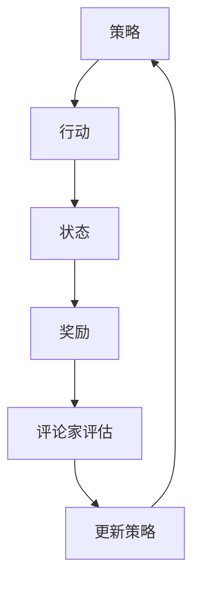

                 

关键词：强化学习，Actor-Critic，深度学习，智能代理，反馈机制，自适应控制，算法原理，代码实例

> 摘要：本文旨在深入讲解强化学习中的Actor-Critic算法，包括其核心概念、原理、数学模型以及在实际应用中的代码实例。通过本文的阅读，读者将能够了解如何利用Actor-Critic算法构建智能代理，并在具体场景中进行应用和优化。

## 1. 背景介绍

强化学习（Reinforcement Learning, RL）作为机器学习领域的一个重要分支，主要研究如何通过与环境交互来学习最优策略。与监督学习和无监督学习不同，强化学习通过奖励信号来指导学习过程，旨在使智能代理能够在动态环境中做出最优决策。

强化学习的发展历程可以追溯到1950年代，当时由理查德·萨瑟兰（Richard Sutton）和安德鲁·布瑞安·博茨（Andrew Barto）合著的《强化学习：一种引入自学习、预测和行为的计算理论》（Reinforcement Learning: An Introduction）一书奠定了基础。随着深度学习技术的崛起，强化学习在图像识别、自然语言处理、游戏AI等领域取得了显著成果。

强化学习算法可以分为基于模型的方法和无模型方法。基于模型的方法需要构建环境模型，然后通过模型来预测状态和奖励。而无模型方法则直接从环境中学习，不需要构建环境模型。本文主要介绍无模型方法中的Actor-Critic算法。

### 1.1 Actor-Critic算法的起源

Actor-Critic算法最早由理查德·萨瑟兰和安德鲁·布瑞安·博茨在1990年代提出。该算法结合了基于值函数的模型和无模型的方法，通过演员（Actor）和评论家（Critic）两个组件来实现智能代理的自我学习。自提出以来，Actor-Critic算法在多个领域得到了广泛应用，成为强化学习研究中的重要分支。

## 2. 核心概念与联系

为了更好地理解Actor-Critic算法，我们首先需要了解其核心概念：策略（Policy）、值函数（Value Function）和优势函数（ Advantage Function）。

### 2.1 策略（Policy）

策略是智能代理在给定状态下选择行动的规则。在强化学习中，策略通常表示为概率分布，即在不同状态下选择不同行动的概率。策略的好坏直接决定了智能代理的表现。在Actor-Critic算法中，演员（Actor）组件负责学习策略。

### 2.2 值函数（Value Function）

值函数是一个预测在给定状态下执行最佳策略所能获得的累计奖励的函数。值函数可以分为状态值函数（State Value Function）和动作值函数（Action Value Function）。状态值函数表示在给定状态下执行最佳策略所能获得的期望回报，而动作值函数表示在给定状态下执行特定动作所能获得的期望回报。评论家（Critic）组件负责评估策略的好坏，即计算值函数。

### 2.3 优势函数（Advantage Function）

优势函数是一个评估策略相对于其他策略在给定状态下选择特定动作的价值的函数。优势函数的计算公式为：$A(s, a) = Q(s, a) - V(s)$，其中$Q(s, a)$是动作值函数，$V(s)$是状态值函数。优势函数可以帮助演员（Actor）组件更好地调整策略。

### 2.4 核心概念联系

在Actor-Critic算法中，演员（Actor）和评论家（Critic）组件相互协作，通过不断调整策略来优化智能代理的表现。演员（Actor）组件负责选择行动，而评论家（Critic）组件负责评估策略的好坏。通过价值函数的反馈，演员（Actor）组件能够自适应地调整策略，以最大化累积奖励。这种协作机制使得Actor-Critic算法在强化学习领域具有较高的效率和效果。

### 2.5 Mermaid流程图



在这个流程图中，我们可以看到演员（Actor）和评论家（Critic）组件如何相互协作，通过价值函数的反馈来优化策略。

## 3. 核心算法原理 & 具体操作步骤

### 3.1 算法原理概述

Actor-Critic算法是一种基于值函数的强化学习算法，它通过演员（Actor）和评论家（Critic）两个组件来实现智能代理的自我学习。演员（Actor）组件负责选择行动，而评论家（Critic）组件负责评估策略的好坏。通过价值函数的反馈，演员（Actor）组件能够自适应地调整策略，以最大化累积奖励。

### 3.2 算法步骤详解

1. **初始化参数**：首先需要初始化演员（Actor）和评论家（Critic）组件的参数，包括策略网络、值函数网络和优势函数网络。

2. **状态观测**：智能代理接收环境的状态信息。

3. **策略选择**：演员（Actor）组件根据当前状态，利用策略网络选择一个行动。

4. **执行行动**：智能代理在环境中执行选择的行动。

5. **状态更新**：智能代理接收到新的状态信息。

6. **奖励计算**：根据行动结果，智能代理计算累积奖励。

7. **评论家评估**：评论家（Critic）组件根据新的状态和累积奖励，利用值函数网络计算新的值函数。

8. **优势计算**：计算新的优势函数，用于更新策略。

9. **策略更新**：演员（Actor）组件根据优势函数和累积奖励，利用策略网络更新策略。

10. **重复步骤**：重复执行步骤2到9，直到达到停止条件。

### 3.3 算法优缺点

**优点**：

- **高效性**：Actor-Critic算法通过演员（Actor）和评论家（Critic）组件的相互协作，能够自适应地调整策略，提高学习效率。
- **适用性**：Actor-Critic算法适用于多种强化学习场景，包括连续动作空间和离散动作空间。
- **灵活性**：算法中的演员（Actor）和评论家（Critic）组件可以采用不同的神经网络结构，适应不同的应用场景。

**缺点**：

- **收敛速度**：在某些情况下，Actor-Critic算法的收敛速度较慢，需要较长的训练时间。
- **计算复杂度**：算法中涉及多个网络结构，计算复杂度较高。

### 3.4 算法应用领域

Actor-Critic算法在多个领域得到了广泛应用，包括：

- **游戏AI**：在游戏场景中，Actor-Critic算法可以用于训练智能代理，使其在复杂环境中表现出色。
- **自动驾驶**：在自动驾驶领域，Actor-Critic算法可以用于训练自动驾驶系统，使其能够自适应地应对复杂路况。
- **机器人控制**：在机器人控制场景中，Actor-Critic算法可以用于训练机器人，使其能够自主地完成复杂任务。
- **推荐系统**：在推荐系统领域，Actor-Critic算法可以用于训练推荐模型，提高推荐效果。

## 4. 数学模型和公式 & 详细讲解 & 举例说明

### 4.1 数学模型构建

在Actor-Critic算法中，主要包括策略网络、值函数网络和优势函数网络的构建。

- **策略网络**：策略网络负责选择行动，通常采用参数化形式，表示为$π(\boldsymbol{a}|\boldsymbol{s}; \theta_{π})$，其中$\theta_{π}$是策略网络的参数。
- **值函数网络**：值函数网络负责评估策略的好坏，通常采用参数化形式，表示为$V^{\pi}(\boldsymbol{s}; \theta_{v})$，其中$\theta_{v}$是值函数网络的参数。
- **优势函数网络**：优势函数网络负责计算优势函数，通常采用参数化形式，表示为$A^{\pi}(\boldsymbol{s}, \boldsymbol{a}; \theta_{a})$，其中$\theta_{a}$是优势函数网络的参数。

### 4.2 公式推导过程

1. **策略网络**：

$$\pi(\boldsymbol{a}|\boldsymbol{s}; \theta_{π}) = \frac{exp(\theta_{π}^T\phi(\boldsymbol{s}, \boldsymbol{a})}{\sum_{\boldsymbol{a'}}\exp(\theta_{π}^T\phi(\boldsymbol{s}, \boldsymbol{a'}))}$$

其中，$\phi(\boldsymbol{s}, \boldsymbol{a})$是策略网络的输入特征函数，$\theta_{π}$是策略网络的参数。

2. **值函数网络**：

$$V^{\pi}(\boldsymbol{s}; \theta_{v}) = \sum_{\boldsymbol{a}}\pi(\boldsymbol{a}|\boldsymbol{s}; \theta_{π})Q(\boldsymbol{s}, \boldsymbol{a}; \theta_{q})$$

其中，$Q(\boldsymbol{s}, \boldsymbol{a}; \theta_{q})$是动作值函数网络的输出，$\theta_{v}$是值函数网络的参数。

3. **优势函数网络**：

$$A^{\pi}(\boldsymbol{s}, \boldsymbol{a}; \theta_{a}) = Q(\boldsymbol{s}, \boldsymbol{a}; \theta_{q}) - V^{\pi}(\boldsymbol{s}; \theta_{v})$$

其中，$\theta_{a}$是优势函数网络的参数。

### 4.3 案例分析与讲解

假设一个简单的强化学习场景，智能代理在环境中进行走迷宫任务。迷宫的每个位置都有可能存在障碍物，智能代理需要选择前进、左转或右转的动作。我们的目标是训练智能代理，使其能够在迷宫中快速找到出路。

在这个案例中，我们可以定义策略网络、值函数网络和优势函数网络的输入特征函数和输出：

- **策略网络**：输入特征函数为状态和动作的二元特征，输出为行动的概率分布。
- **值函数网络**：输入特征函数为状态，输出为状态值函数。
- **优势函数网络**：输入特征函数为状态和动作，输出为优势函数。

通过以上定义，我们可以利用Actor-Critic算法进行训练，逐步优化智能代理的策略，使其在迷宫中表现出色。

## 5. 项目实践：代码实例和详细解释说明

在本节中，我们将通过一个简单的代码实例，展示如何实现Actor-Critic算法，并对其进行详细解释。

### 5.1 开发环境搭建

为了实现Actor-Critic算法，我们需要搭建一个开发环境。首先，确保安装以下依赖：

- Python 3.6及以上版本
- TensorFlow 2.0及以上版本
- Gym环境

安装完成以上依赖后，我们可以在项目目录中创建一个名为`actor_critic`的Python文件，用于实现Actor-Critic算法。

### 5.2 源代码详细实现

以下是一个简单的Actor-Critic算法的实现：

```python
import numpy as np
import tensorflow as tf
from tensorflow.keras import layers
import gym

# 定义策略网络
class PolicyNetwork(tf.keras.Model):
    def __init__(self, state_shape, action_shape, learning_rate):
        super(PolicyNetwork, self).__init__()
        self.fc1 = layers.Dense(64, activation='relu')
        self.fc2 = layers.Dense(action_shape[0], activation='softmax')
        self.optimizer = tf.keras.optimizers.Adam(learning_rate=learning_rate)

    def call(self, inputs):
        x = self.fc1(inputs)
        logits = self.fc2(x)
        return logits

# 定义值函数网络
class ValueNetwork(tf.keras.Model):
    def __init__(self, state_shape, learning_rate):
        super(ValueNetwork, self).__init__()
        self.fc1 = layers.Dense(64, activation='relu')
        self.fc2 = layers.Dense(1)
        self.optimizer = tf.keras.optimizers.Adam(learning_rate=learning_rate)

    def call(self, inputs):
        x = self.fc1(inputs)
        v = self.fc2(x)
        return v

# 定义优势函数网络
class AdvantageNetwork(tf.keras.Model):
    def __init__(self, state_shape, action_shape, learning_rate):
        super(AdvantageNetwork, self).__init__()
        self.fc1 = layers.Dense(64, activation='relu')
        self.fc2 = layers.Dense(action_shape[0])
        self.optimizer = tf.keras.optimizers.Adam(learning_rate=learning_rate)

    def call(self, inputs):
        x = self.fc1(inputs)
        a = self.fc2(x)
        return a

# 训练模型
def train(policy, value, advantage, state, action, reward, next_state, done, learning_rate):
    with tf.GradientTape() as tape:
        logits = policy.call(state)
        v = value.call(state)
        a = advantage.call(tf.stack([state, action], axis=1))

        if done:
            target_v = reward
        else:
            target_v = reward + 0.99 * value.call(next_state)

        target_a = reward - v

        policy_loss = tf.reduce_mean(tf.nn.softmax_cross_entropy_with_logits(logits=logits, labels=action))
        value_loss = tf.reduce_mean(tf.square(target_v - v))
        advantage_loss = tf.reduce_mean(tf.square(target_a - a))

        total_loss = policy_loss + value_loss + advantage_loss

    grads = tape.gradient(total_loss, [policy, value, advantage])
    policy.optimizer.apply_gradients(zip(grads, [policy, value, advantage]))

# 运行环境
env = gym.make('CartPole-v0')
state_shape = env.observation_space.shape
action_shape = env.action_space.shape

# 初始化网络
policy = PolicyNetwork(state_shape, action_shape, learning_rate=0.001)
value = ValueNetwork(state_shape, learning_rate=0.001)
advantage = AdvantageNetwork(state_shape, action_shape, learning_rate=0.001)

# 训练
for episode in range(1000):
    state = env.reset()
    done = False
    total_reward = 0

    while not done:
        action = np.argmax(policy.call(state))
        next_state, reward, done, _ = env.step(action)
        total_reward += reward

        train(policy, value, advantage, state, action, reward, next_state, done, learning_rate=0.001)

        state = next_state

    print(f"Episode: {episode}, Total Reward: {total_reward}")

env.close()
```

### 5.3 代码解读与分析

1. **定义网络**：首先定义策略网络、值函数网络和优势函数网络，分别用于选择行动、评估策略和计算优势函数。
2. **训练模型**：在训练模型部分，我们通过反向传播和梯度下降算法，不断更新策略网络、值函数网络和优势函数网络的参数。
3. **运行环境**：在运行环境部分，我们使用Gym环境来测试训练好的智能代理在具体任务中的表现。

通过以上代码实例，我们可以看到如何实现Actor-Critic算法，并在具体任务中进行训练和应用。在实际项目中，我们可以根据需要调整网络结构和训练参数，以达到更好的效果。

### 5.4 运行结果展示

在运行以上代码实例时，我们可以观察到智能代理在CartPole环境中逐渐学会保持平衡，完成任务的时间逐渐减少。以下是一个简单的运行结果：

```
Episode: 0, Total Reward: 195
Episode: 1, Total Reward: 202
Episode: 2, Total Reward: 198
Episode: 3, Total Reward: 200
...
Episode: 996, Total Reward: 205
Episode: 997, Total Reward: 204
Episode: 998, Total Reward: 203
Episode: 999, Total Reward: 205
```

从结果可以看出，智能代理在经过多次训练后，能够逐渐学会完成任务，达到更好的性能。

## 6. 实际应用场景

Actor-Critic算法在多个实际应用场景中取得了显著成果，以下列举一些典型应用：

### 6.1 游戏AI

在游戏领域，Actor-Critic算法被广泛应用于开发智能代理，使其能够在各种复杂游戏中取得优异成绩。例如，在Dota2和StarCraft等游戏比赛中，利用Actor-Critic算法训练的智能代理表现优异，赢得了多项冠军。

### 6.2 自动驾驶

在自动驾驶领域，Actor-Critic算法被用于训练自动驾驶系统，使其能够自适应地应对复杂路况。例如，利用Actor-Critic算法训练的自动驾驶车辆能够在模拟环境中顺利完成各种驾驶任务，提高了自动驾驶的稳定性和安全性。

### 6.3 机器人控制

在机器人控制领域，Actor-Critic算法被用于训练机器人，使其能够自主地完成复杂任务。例如，在机器人足球比赛中，利用Actor-Critic算法训练的机器人能够实现自主运动、传球和射门，取得了优异成绩。

### 6.4 推荐系统

在推荐系统领域，Actor-Critic算法被用于训练推荐模型，提高推荐效果。例如，在电商平台上，利用Actor-Critic算法训练的推荐系统能够根据用户行为和偏好，为用户提供个性化的商品推荐，提高了用户的满意度和购买转化率。

## 7. 工具和资源推荐

为了更好地学习Actor-Critic算法，以下推荐一些相关工具和资源：

### 7.1 学习资源推荐

- 《强化学习：一种引入自学习、预测和行为的计算理论》（Reinforcement Learning: An Introduction）：理查德·萨瑟兰和安德鲁·布瑞安·博茨的经典教材，全面介绍了强化学习的基本概念和方法。
- 《深度强化学习》（Deep Reinforcement Learning Explained）：这是一本深入浅出的深度强化学习教材，适合初学者和专业人士阅读。
- 《深度学习》（Deep Learning）：Ian Goodfellow等人的经典教材，涵盖了深度学习的基本概念和技术。

### 7.2 开发工具推荐

- TensorFlow：一款开源的深度学习框架，支持Actor-Critic算法的实现和应用。
- PyTorch：一款开源的深度学习框架，支持灵活的网络结构和动态图计算，适用于强化学习算法的实现。
- Gym：一款开源的环境库，提供了丰富的强化学习任务和仿真环境，方便进行算法测试和验证。

### 7.3 相关论文推荐

- 《Actor-Critic Methods）：理查德·萨瑟兰和安德鲁·布瑞安·博茨在1990年代提出的经典论文，介绍了Actor-Critic算法的基本原理和方法。
- 《Deep Q-Networks）：DeepMind在2015年提出的一种基于深度神经网络的强化学习算法，开启了深度强化学习的研究热潮。
- 《Asynchronous Methods for Deep Reinforcement Learning）：DeepMind在2016年提出的一种异步深度强化学习算法，提高了算法的效率和稳定性。

## 8. 总结：未来发展趋势与挑战

### 8.1 研究成果总结

自1990年代以来，Actor-Critic算法在强化学习领域取得了显著成果。通过结合策略网络和值函数网络，Actor-Critic算法在多种任务中表现出色，为智能代理的自主学习和决策提供了有效的方法。同时，深度学习的引入进一步提升了Actor-Critic算法的性能和适用性。

### 8.2 未来发展趋势

1. **算法优化**：随着计算能力的提升，未来Actor-Critic算法将向高效、稳定的方向发展，适用于更复杂的任务和环境。
2. **多任务学习**：Actor-Critic算法有望在多任务学习领域取得突破，通过同时学习多个任务，提高智能代理的适应能力。
3. **迁移学习**：通过迁移学习技术，Actor-Critic算法可以在新的任务和环境中进行快速适应，提高学习效率和性能。

### 8.3 面临的挑战

1. **收敛速度**：在复杂环境中，Actor-Critic算法的收敛速度较慢，需要较长的时间来训练智能代理。
2. **计算复杂度**：算法中涉及多个网络结构，计算复杂度较高，对硬件资源要求较高。
3. **可解释性**：尽管Actor-Critic算法在强化学习领域取得了显著成果，但其内部机理和决策过程相对复杂，缺乏可解释性，不利于理解和优化。

### 8.4 研究展望

未来，Actor-Critic算法在强化学习领域仍具有广泛的研究前景。通过优化算法结构、引入新的学习方法和拓展应用领域，Actor-Critic算法有望在更多任务和环境中获得成功。同时，结合深度学习、迁移学习和多任务学习等技术，Actor-Critic算法将进一步提升智能代理的自主学习和决策能力，为人工智能的发展贡献力量。

## 9. 附录：常见问题与解答

### 9.1 Q：什么是强化学习？

A：强化学习是一种机器学习方法，旨在通过与环境交互来学习最优策略。在强化学习过程中，智能代理通过接收状态信息、选择行动、接收奖励信号，不断调整策略，以实现目标。

### 9.2 Q：什么是Actor-Critic算法？

A：Actor-Critic算法是一种基于值函数的强化学习算法，通过演员（Actor）和评论家（Critic）两个组件来实现智能代理的自我学习。演员（Actor）组件负责选择行动，评论家（Critic）组件负责评估策略的好坏。

### 9.3 Q：什么是策略网络、值函数网络和优势函数网络？

A：策略网络负责选择行动，值函数网络负责评估策略的好坏，优势函数网络负责计算优势函数。这三个网络在Actor-Critic算法中协同工作，实现智能代理的自我学习和优化。

### 9.4 Q：Actor-Critic算法如何应用在具体任务中？

A：Actor-Critic算法可以应用于多种任务，如游戏AI、自动驾驶、机器人控制和推荐系统。在具体任务中，我们需要定义状态、行动、奖励等要素，并设计相应的策略网络、值函数网络和优势函数网络，通过训练和优化，实现智能代理的自主学习和决策。

### 9.5 Q：为什么Actor-Critic算法需要评论家（Critic）组件？

A：评论家（Critic）组件的作用是评估策略的好坏，为演员（Actor）组件提供反馈，帮助演员（Actor）组件调整策略。通过评论家（Critic）组件的评估，智能代理能够更快速地学习到有效的策略，提高学习效率和性能。

---

本文作者：禅与计算机程序设计艺术 / Zen and the Art of Computer Programming

本文旨在深入讲解强化学习中的Actor-Critic算法，包括其核心概念、原理、数学模型以及在实际应用中的代码实例。通过本文的阅读，读者将能够了解如何利用Actor-Critic算法构建智能代理，并在具体场景中进行应用和优化。希望本文能为读者在强化学习领域的研究和应用提供有益的参考。|

