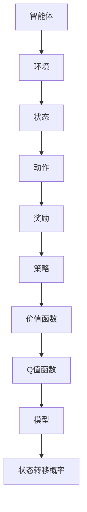

                 

强化学习算法是机器学习领域的一个重要分支，它在解决决策问题时具有很高的灵活性和适应性。Q-learning是强化学习算法中的一种经典算法，它以其简洁的原理和强大的适用性受到了广泛的研究和应用。本文将详细介绍Q-learning算法的原理、数学模型、实现步骤以及实际应用场景，并通过代码实例进行详细解释说明。

## 关键词
强化学习，Q-learning，算法原理，代码实现，应用场景

## 摘要
本文将深入探讨强化学习算法中的Q-learning，首先介绍其背景和核心概念，然后详细解释其数学模型和公式，接着通过实际代码实例讲解Q-learning的实现步骤和运行过程，最后讨论其在实际应用场景中的重要性以及未来发展的方向。

## 1. 背景介绍
强化学习起源于心理学领域，旨在通过奖励和惩罚机制来训练智能体（agent）在环境中的行为。智能体通过与环境的交互，不断学习最优策略，从而实现目标。强化学习与监督学习和无监督学习不同，它不是通过标注数据学习，而是通过试错和探索来学习。

### 1.1 强化学习的基本概念
- **智能体（Agent）**：执行动作的实体。
- **环境（Environment）**：智能体执行动作的场所。
- **状态（State）**：环境的一个特定状态。
- **动作（Action）**：智能体在某一状态下可能执行的行为。
- **奖励（Reward）**：智能体执行动作后获得的奖励或惩罚。

### 1.2 强化学习的主要问题
- **最优策略（Optimal Policy）**：智能体在所有可能状态下选择最优动作的策略。
- **价值函数（Value Function）**：描述智能体在各个状态下的最优预期回报。
- **模型（Model）**：描述环境状态转移概率和奖励的模型。

## 2. 核心概念与联系
为了更好地理解Q-learning，我们需要先了解一些核心概念。以下是一个Mermaid流程图，展示了这些概念之间的联系。



### 2.1 智能体与环境的交互
智能体根据当前状态选择一个动作，然后环境根据这个动作产生新的状态并给予智能体一个奖励。智能体通过这种方式不断地探索环境和学习。

### 2.2 策略和价值函数
策略是指智能体在给定状态下选择动作的方法。价值函数则描述了智能体在某一状态下执行某一动作的预期回报。Q值函数是强化学习中的核心价值函数，它结合了动作值和状态值，用于评估智能体在某一状态执行某一动作的长期回报。

### 2.3 模型和状态转移概率
模型是对环境状态转移概率和奖励的抽象描述。在Q-learning中，我们通常使用马尔可夫决策过程（MDP）来描述环境，它包含状态空间、动作空间、状态转移概率和奖励函数。

## 3. 核心算法原理 & 具体操作步骤
### 3.1 算法原理概述
Q-learning是一种基于值迭代的强化学习算法，它通过不断更新Q值来逼近最优策略。Q值函数是一个映射函数，它将状态和动作映射到预期的回报值。Q-learning的目标是找到一组Q值，使得智能体在执行这些Q值所指示的动作时能够获得最大的预期回报。

### 3.2 算法步骤详解
#### 3.2.1 初始化
- 初始化Q值函数：通常将所有Q值初始化为0。
- 初始化智能体：智能体随机选择一个初始状态。

#### 3.2.2 选择动作
- 根据当前状态和策略选择一个动作。

#### 3.2.3 执行动作
- 智能体执行选择的动作，并进入新的状态。
- 环境根据动作产生一个奖励。

#### 3.2.4 更新Q值
- 使用以下公式更新Q值：
  $$ Q(s,a) \leftarrow Q(s,a) + \alpha [r + \gamma \max_{a'} Q(s',a') - Q(s,a)] $$
  其中，$s$是当前状态，$a$是当前动作，$r$是获得的奖励，$\gamma$是折扣因子，$\alpha$是学习率，$s'$是新的状态，$a'$是新的动作。

#### 3.2.5 迭代
- 重复执行步骤2-4，直到达到某个停止条件，如策略收敛、达到最大迭代次数等。

### 3.3 算法优缺点
#### 优点
- **自适应性强**：Q-learning可以根据环境的变化动态调整策略。
- **易于实现**：算法结构简单，易于理解和实现。
- **适用于连续动作空间**：Q-learning可以通过将动作空间离散化来适用于连续动作空间。

#### 缺点
- **收敛速度慢**：Q-learning的收敛速度通常较慢，特别是在动作空间和状态空间较大的情况下。
- **需要大量样本**：为了收敛到最优策略，Q-learning通常需要大量的样本数据。

### 3.4 算法应用领域
Q-learning算法广泛应用于游戏人工智能、机器人控制、推荐系统等领域。以下是一些典型的应用场景：

- **游戏人工智能**：在电子游戏如《星际争霸》中，Q-learning被用来训练智能体学习游戏策略。
- **机器人控制**：在机器人导航和路径规划中，Q-learning被用来学习最优行动策略。
- **推荐系统**：在电子商务和社交媒体中，Q-learning被用来预测用户行为和推荐商品。

## 4. 数学模型和公式 & 详细讲解 & 举例说明
### 4.1 数学模型构建
在Q-learning中，我们主要关注以下数学模型：

- **状态空间（$S$）**：所有可能的状态集合。
- **动作空间（$A$）**：所有可能的动作集合。
- **Q值函数（$Q$）**：状态-动作值函数，用于评估状态-动作对。
- **策略（$\pi$）**：行动策略，用于选择动作。

### 4.2 公式推导过程
Q-learning的目标是学习Q值函数，使其最大化预期回报。以下是Q-learning的核心公式：

$$ Q(s,a) \leftarrow Q(s,a) + \alpha [r + \gamma \max_{a'} Q(s',a') - Q(s,a)] $$

其中，$s$和$a$是当前状态和动作，$r$是获得的奖励，$\gamma$是折扣因子（用于平衡长期和短期奖励），$\alpha$是学习率（用于控制Q值更新的步伐）。

### 4.3 案例分析与讲解
假设我们有一个简单的环境，其中只有两个状态（0和1）和两个动作（A和B）。以下是Q-learning算法在具体环境中的实现步骤：

#### 初始化
初始化Q值函数为0。

```
Q = {
    (0, A): 0,
    (0, B): 0,
    (1, A): 0,
    (1, B): 0
}
```

#### 迭代1
- 当前状态：s = 0
- 选择动作：a = A（使用ε-贪心策略）
- 执行动作，进入状态：s' = 1，获得奖励：r = 10

更新Q值：
```
Q(0, A) = Q(0, A) + α[r + γmax(Q(1, B)) - Q(0, A)]
         = 0 + 0.1[10 + 0.9*max(0, 0) - 0]
         = 1
```

#### 迭代2
- 当前状态：s = 1
- 选择动作：a = B（使用ε-贪心策略）
- 执行动作，进入状态：s' = 0，获得奖励：r = -5

更新Q值：
```
Q(1, B) = Q(1, B) + α[r + γmax(Q(0, A)) - Q(1, B)]
         = 0 + 0.1[-5 + 0.9*max(1, 0) - 0]
         = -0.5
```

#### 迭代3
- 当前状态：s = 0
- 选择动作：a = B（因为A的Q值更新后更低）
- 执行动作，进入状态：s' = 1，获得奖励：r = 0

更新Q值：
```
Q(0, B) = Q(0, B) + α[r + γmax(Q(1, A)) - Q(0, B)]
         = 0 + 0.1[0 + 0.9*max(1, -0.5) - 0]
         = 0.85
```

通过迭代，Q值函数会不断更新，最终趋于稳定。在这种情况下，智能体会学会选择动作B，因为在状态0下，动作B的Q值更高。

## 5. 项目实践：代码实例和详细解释说明
### 5.1 开发环境搭建
为了演示Q-learning算法，我们需要搭建一个简单的开发环境。以下是一个Python代码示例，用于实现Q-learning算法。

```python
import numpy as np
import matplotlib.pyplot as plt

# 定义环境
def environment(s, a):
    if s == 0 and a == 0:
        return 1, 1
    elif s == 0 and a == 1:
        return 0, 1
    elif s == 1 and a == 0:
        return -5, 1
    elif s == 1 and a == 1:
        return 0, 0

# 初始化Q值函数
Q = np.zeros((2, 2))

# 学习参数
alpha = 0.1
gamma = 0.9
epsilon = 0.1

# 迭代过程
episodes = 100
for episode in range(episodes):
    s = np.random.randint(0, 2)
    while True:
        # 选择动作
        if np.random.rand() < epsilon:
            a = np.random.randint(0, 2)
        else:
            a = np.argmax(Q[s])

        # 执行动作
        s_next, r = environment(s, a)

        # 更新Q值
        Q[s, a] = Q[s, a] + alpha * (r + gamma * np.max(Q[s_next]) - Q[s, a])

        # 更新状态
        s = s_next

# 绘制Q值函数
plt.imshow(Q, cmap='hot', interpolation='nearest')
plt.colorbar()
plt.xlabel('Actions')
plt.ylabel('States')
plt.title('Q-Value Function')
plt.show()
```

### 5.2 源代码详细实现
在上面的代码中，我们定义了一个简单的环境，其中有两个状态（0和1）和两个动作（A和B）。我们使用numpy数组来存储Q值函数，并设置学习参数。在迭代过程中，我们使用ε-贪心策略来选择动作，并使用给定的公式更新Q值函数。

### 5.3 代码解读与分析
- **环境定义**：`environment`函数用于模拟环境，根据当前状态和动作返回新的状态和奖励。
- **Q值函数初始化**：使用numpy数组初始化Q值函数，所有值初始化为0。
- **学习参数**：设置学习率（alpha）、折扣因子（gamma）和探索概率（epsilon）。
- **迭代过程**：对于每个迭代周期，我们随机选择一个初始状态，并使用ε-贪心策略选择动作。然后，我们执行动作、更新Q值，并更新状态，直到达到某个停止条件。
- **Q值函数绘制**：最后，我们使用matplotlib库绘制Q值函数的热力图，以可视化Q值。

### 5.4 运行结果展示
运行上述代码后，我们会得到Q值函数的热力图，它显示了每个状态-动作对的最优Q值。在这个简单的例子中，我们可以看到，智能体在状态0下选择动作B，而在状态1下选择动作A，这是因为B在状态0下具有更高的Q值，A在状态1下具有更高的Q值。

## 6. 实际应用场景
Q-learning算法在实际应用中具有广泛的应用前景，以下是一些典型的应用场景：

### 6.1 游戏人工智能
在电子游戏中，Q-learning算法被用于训练智能体学习游戏策略。例如，在《星际争霸》等复杂游戏中，智能体可以通过Q-learning算法学习到如何有效地对抗人类玩家。

### 6.2 机器人控制
在机器人导航和路径规划中，Q-learning算法被用来学习最优行动策略。例如，在自主导航的无人机中，Q-learning算法可以用来学习避开障碍物和找到最优路径。

### 6.3 推荐系统
在电子商务和社交媒体中，Q-learning算法被用来预测用户行为和推荐商品。通过学习用户的历史行为，Q-learning算法可以预测用户对特定商品的喜好，从而提供个性化的推荐。

### 6.4 无人驾驶
在无人驾驶领域，Q-learning算法被用来学习最优驾驶策略。通过在模拟环境中训练，无人驾驶车辆可以学会如何在不同路况下做出最优决策，从而提高驾驶安全性。

## 7. 工具和资源推荐
### 7.1 学习资源推荐
- **书籍**：《强化学习：原理与算法》（作者：杨强等）
- **在线课程**：Coursera上的“强化学习导论”课程
- **论文**：《深度强化学习：原理与应用》（作者：理查德·萨顿等）

### 7.2 开发工具推荐
- **Python库**：PyTorch、TensorFlow、OpenAI Gym
- **框架**：Pygame（用于游戏开发）
- **模拟器**：Gazebo（用于机器人仿真）

### 7.3 相关论文推荐
- **“Q-Learning”**（作者：理查德·萨顿等）
- **“深度Q网络”（DQN）**（作者：海瑟·阿瑟尔等）
- **“异步优势演员-评论家算法”（A3C）**（作者：理查德·萨顿等）

## 8. 总结：未来发展趋势与挑战
### 8.1 研究成果总结
Q-learning算法自提出以来，已经在众多应用场景中取得了显著成果。它以其简洁的原理和强大的适用性，成为强化学习领域的重要算法之一。

### 8.2 未来发展趋势
- **多智能体强化学习**：在多智能体环境下，如何设计有效的协同策略是未来研究的重要方向。
- **深度强化学习**：结合深度学习技术，探索更有效的强化学习算法，如深度Q网络（DQN）、深度确定性策略梯度（DDPG）等。
- **强化学习与自然语言处理结合**：将强化学习应用于自然语言处理任务，如对话系统、机器翻译等。

### 8.3 面临的挑战
- **探索与利用的平衡**：如何在探索未知状态和利用已知策略之间取得平衡，是强化学习算法面临的主要挑战。
- **收敛速度与样本效率**：如何提高算法的收敛速度和样本效率，是强化学习算法在实际应用中需要解决的问题。

### 8.4 研究展望
未来，随着计算能力的提升和算法的优化，强化学习将在更多领域发挥重要作用。在游戏人工智能、机器人控制、推荐系统、无人驾驶等领域，强化学习算法将继续推动技术的发展和应用。

## 9. 附录：常见问题与解答
### 9.1 Q-learning与监督学习的区别是什么？
Q-learning是一种无监督学习算法，它通过与环境交互学习最优策略，而监督学习则通过已标注的数据学习特征和分类器。

### 9.2 Q-learning为什么需要探索和利用的平衡？
探索和利用的平衡是强化学习算法的核心问题。过多探索可能导致智能体在未知的、可能不理想的环境中徘徊，而过多利用可能导致智能体无法学习到最优策略。因此，需要在两者之间取得平衡，以确保智能体能够有效地学习。

### 9.3 Q-learning中的折扣因子$\gamma$有什么作用？
折扣因子$\gamma$用于平衡长期奖励和短期奖励。它使得智能体不仅关注当前获得的奖励，还关注未来可能获得的奖励，从而能够更好地学习长期最优策略。

## 作者署名
作者：禅与计算机程序设计艺术 / Zen and the Art of Computer Programming
```

