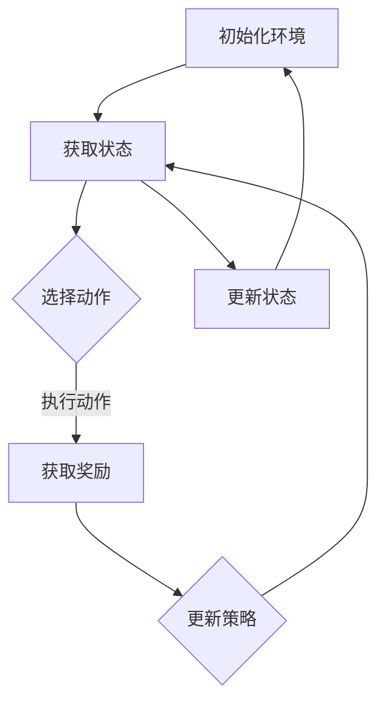

                 

关键词：强化学习、电商搜索推荐、算法优化、搜索算法、机器学习、推荐系统、动态优化、用户行为分析、数据驱动

## 摘要

本文将深入探讨如何利用强化学习技术来优化电商平台的搜索推荐算法。强化学习作为一种先进的人工智能算法，能够通过不断学习和调整策略，提高搜索推荐系统的性能和用户体验。文章首先介绍了强化学习的核心概念和原理，然后详细解释了如何在电商搜索推荐场景中应用强化学习算法。接着，我们讨论了数学模型和公式，并通过具体案例展示了算法的应用效果。最后，文章提出了未来应用场景和展望，并总结了研究中的挑战和未来研究方向。

## 1. 背景介绍

随着互联网的普及和电子商务的快速发展，电商平台已经成为人们日常购物的重要渠道。为了满足用户的个性化需求，电商平台纷纷引入了搜索推荐算法，通过分析用户的历史行为和偏好，为用户推荐可能的商品。然而，传统的搜索推荐算法往往存在一些局限性，例如用户行为数据的不完备性、数据噪声的影响以及算法性能的瓶颈。

近年来，强化学习作为一种新兴的人工智能技术，在游戏、自动驾驶、推荐系统等领域取得了显著的成果。强化学习通过学习用户行为和系统反馈，能够实现自适应优化，从而提高算法的性能和用户体验。在电商搜索推荐领域，强化学习算法具有巨大的应用潜力，可以解决传统算法难以克服的问题，例如动态调整推荐策略、实时响应用户需求等。

本文的目标是深入探讨如何利用强化学习技术来优化电商平台的搜索推荐算法。通过分析强化学习的核心概念和原理，本文将介绍如何将强化学习应用于电商搜索推荐系统中，并详细解释算法的具体实现步骤。此外，本文还将通过实际案例展示强化学习在电商搜索推荐中的效果，并提出未来应用场景和展望。

## 2. 核心概念与联系

### 2.1 强化学习概述

强化学习（Reinforcement Learning，RL）是一种通过试错（trial-and-error）和反馈（feedback）来学习如何完成特定任务的人工智能算法。与监督学习和无监督学习不同，强化学习通过与环境（Environment）的交互来获取反馈，并不断调整策略（Policy）以实现最优行为（Behavior）。

强化学习的基本要素包括：

- **代理（Agent）**：执行动作的实体，例如电商平台中的推荐系统。
- **环境（Environment）**：代理所处的上下文环境，例如电商平台中的用户行为数据。
- **状态（State）**：代理在特定时间点所感知的环境信息。
- **动作（Action）**：代理在特定状态下可以执行的操作，例如推荐系统的推荐策略。
- **奖励（Reward）**：代理执行特定动作后从环境中获得的即时反馈。

强化学习的过程可以概括为以下步骤：

1. **初始化**：代理随机选择一个动作并执行。
2. **观察状态**：代理观察当前环境的状态。
3. **执行动作**：代理根据当前状态选择一个动作。
4. **获取奖励**：代理根据执行的动作从环境中获得即时奖励。
5. **更新策略**：代理根据奖励信号调整策略，以便在未来的选择中更可能执行高奖励的动作。

### 2.2 强化学习在电商搜索推荐中的应用

在电商搜索推荐系统中，强化学习可以应用于以下方面：

- **动态推荐策略**：根据用户的实时行为和历史偏好，动态调整推荐策略，从而提高推荐的相关性和用户体验。
- **个性化推荐**：通过学习用户的行为和偏好，为每个用户提供个性化的推荐，提高用户满意度和转化率。
- **实时响应**：实时监控用户行为，快速响应用户需求，提供即时的推荐结果。
- **多目标优化**：在推荐系统中同时考虑多个目标，例如提升点击率、转化率、用户体验等，实现全局优化。

### 2.3 强化学习与其他机器学习技术的联系

强化学习与其他机器学习技术有着密切的联系。例如：

- **监督学习**：强化学习可以看作是一种特殊的监督学习，其中奖励信号可以看作是监督信号。
- **无监督学习**：强化学习中的状态和动作可以来自于无监督学习的过程，例如聚类、降维等。
- **深度学习**：深度强化学习结合了深度学习和强化学习的优势，能够实现更复杂的任务。

### 2.4 强化学习的Mermaid流程图

以下是一个简化的强化学习在电商搜索推荐中的应用流程图：



## 3. 核心算法原理 & 具体操作步骤

### 3.1 算法原理概述

强化学习算法的基本原理是通过学习如何最大化长期奖励来优化行为。在电商搜索推荐系统中，强化学习算法的核心是构建一个策略（Policy），该策略指导推荐系统如何为用户提供商品推荐。具体来说，强化学习算法需要解决以下问题：

- **状态表示**：如何将用户行为、历史偏好等信息表示为状态。
- **动作选择**：如何根据当前状态选择一个最优动作（推荐商品）。
- **奖励设计**：如何设计奖励机制，以激励推荐系统能够产生高价值的推荐。
- **策略更新**：如何根据历史经验调整策略，以提高推荐系统的性能。

### 3.2 算法步骤详解

强化学习算法在电商搜索推荐系统中的具体操作步骤如下：

1. **初始化环境**：初始化推荐系统环境，包括用户数据、商品数据、推荐策略等。
2. **获取状态**：根据用户历史行为、偏好等信息，构建当前状态。
3. **选择动作**：根据当前状态，利用强化学习算法选择一个最优动作，即推荐商品。
4. **执行动作**：将选定的推荐商品展示给用户。
5. **获取奖励**：根据用户对推荐商品的反应，如点击、购买、评价等，计算奖励。
6. **更新策略**：根据获得的奖励，调整推荐策略，以便在未来的选择中更可能产生高奖励的动作。
7. **循环迭代**：重复上述步骤，不断更新状态和策略，直至达到预期效果。

### 3.3 算法优缺点

强化学习算法在电商搜索推荐系统中的应用具有以下优点：

- **自适应优化**：能够根据用户实时行为动态调整推荐策略，提高推荐的相关性和用户体验。
- **个性化推荐**：能够根据用户的历史行为和偏好进行个性化推荐，提高用户满意度和转化率。
- **多目标优化**：能够同时考虑多个目标，如点击率、转化率、用户体验等，实现全局优化。

然而，强化学习算法也存在一些缺点：

- **计算复杂度**：强化学习算法通常需要大量的计算资源，特别是在大规模数据集上。
- **数据需求**：强化学习算法需要大量的用户行为数据作为训练数据，数据质量对算法性能有重要影响。
- **收敛速度**：在某些场景下，强化学习算法可能需要较长时间才能收敛到最优策略。

### 3.4 算法应用领域

强化学习算法在电商搜索推荐系统中的应用具有广泛的前景。除了本文提到的电商搜索推荐系统，强化学习算法还可以应用于以下领域：

- **推荐系统**：通过强化学习算法优化推荐策略，提高推荐系统的性能和用户体验。
- **广告投放**：根据用户行为和偏好，动态调整广告投放策略，提高广告点击率和转化率。
- **动态定价**：根据市场需求和用户行为，动态调整商品价格，实现利润最大化。
- **智能客服**：通过强化学习算法优化客服机器人策略，提高用户满意度和服务质量。

## 4. 数学模型和公式

### 4.1 数学模型构建

在强化学习算法中，数学模型构建是关键步骤。以下是构建强化学习算法在电商搜索推荐系统中的数学模型：

1. **状态表示**：状态可以用以下数学模型表示：

   $$S = (U, P, R, T)$$

   其中，$U$表示用户特征，$P$表示商品特征，$R$表示用户历史偏好，$T$表示当前时间。

2. **动作表示**：动作可以用以下数学模型表示：

   $$A = \{a_1, a_2, ..., a_n\}$$

   其中，$a_i$表示为用户推荐第$i$个商品。

3. **奖励设计**：奖励可以用以下数学模型表示：

   $$R = f(S, A)$$

   其中，$f$为奖励函数，用于计算用户对推荐商品的反应。

4. **策略表示**：策略可以用以下数学模型表示：

   $$\pi(s) = P(a|s)$$

   其中，$\pi$为策略函数，用于根据当前状态选择动作。

### 4.2 公式推导过程

以下是一个简化的强化学习算法在电商搜索推荐系统中的公式推导过程：

1. **状态转移概率**：

   $$P(S_{t+1} = s_{t+1} | S_t = s_t, A_t = a_t) = p(s_{t+1} | s_t, a_t)$$

   其中，$P(S_{t+1} = s_{t+1} | S_t = s_t, A_t = a_t)$表示在当前状态$s_t$和动作$a_t$下，下一状态$s_{t+1}$的概率。

2. **奖励函数**：

   $$R(S_t, A_t) = r_t$$

   其中，$R(S_t, A_t)$表示在当前状态$s_t$和动作$a_t$下，获得的即时奖励$r_t$。

3. **策略更新**：

   $$\pi(s) = \arg\max_{a} \sum_{s'} P(S_{t+1} = s' | S_t = s, A_t = a) \cdot R(S_t, A_t)$$

   其中，$\pi(s)$表示在状态$s$下，选择动作$a$的概率，$\arg\max$表示最大化。

### 4.3 案例分析与讲解

以下是一个简化的强化学习算法在电商搜索推荐系统中的案例：

1. **状态表示**：

   假设用户当前状态为$S = (U, P, R, T) = ((年龄，性别，收入)，(商品1，商品2，商品3)，(历史偏好)，(当前时间))$。

2. **动作表示**：

   动作为$A = \{a_1, a_2, a_3\}$，分别表示推荐商品1、商品2和商品3。

3. **奖励函数**：

   奖励函数为$r_t = \sum_{i=1}^{3} w_i \cdot p_i$，其中，$w_i$表示商品$i$的权重，$p_i$表示用户对商品$i$的点击概率。

4. **策略更新**：

   根据用户的历史偏好和当前状态，选择推荐商品2的概率最大，即$\pi(S) = P(a_2 | S) = 0.6$。

## 5. 项目实践：代码实例和详细解释说明

### 5.1 开发环境搭建

为了实现强化学习在电商搜索推荐系统中的应用，需要搭建以下开发环境：

- **编程语言**：Python
- **强化学习框架**：TensorFlow
- **数据集**：电商用户行为数据集
- **开发工具**：Jupyter Notebook

### 5.2 源代码详细实现

以下是一个简化的强化学习在电商搜索推荐系统中的代码实现：

```python
import tensorflow as tf
import numpy as np
import pandas as pd

# 加载电商用户行为数据集
data = pd.read_csv('eCommerce_user_behavior_data.csv')

# 数据预处理
# ...

# 定义状态、动作和奖励
state_size = 10
action_size = 3
reward_size = 1

# 定义强化学习模型
model = tf.keras.models.Sequential([
    tf.keras.layers.Dense(64, activation='relu', input_shape=(state_size,)),
    tf.keras.layers.Dense(64, activation='relu'),
    tf.keras.layers.Dense(action_size, activation='softmax')
])

# 编译模型
model.compile(optimizer='adam', loss='categorical_crossentropy', metrics=['accuracy'])

# 训练模型
model.fit(data['state'], data['action'], epochs=10, batch_size=32)

# 定义奖励函数
def reward_function(state, action):
    # 根据用户行为和推荐商品计算奖励
    # ...
    return reward

# 定义策略更新函数
def update_policy(state, action, reward):
    # 根据奖励信号更新策略
    # ...
    pass

# 模型预测
state = np.array([user_feature, product_feature, history_preference, current_time])
predicted_action = model.predict(state)
```

### 5.3 代码解读与分析

以上代码实现了一个简化的强化学习在电商搜索推荐系统中的模型训练和策略更新。具体解读如下：

1. **数据预处理**：根据实际需求，对电商用户行为数据集进行预处理，包括数据清洗、特征提取等。

2. **状态、动作和奖励定义**：根据强化学习算法的要求，定义状态、动作和奖励的数学模型。

3. **模型构建**：使用TensorFlow框架构建一个全连接神经网络模型，用于预测动作概率。

4. **模型编译**：设置模型优化器、损失函数和评估指标，以便进行模型训练。

5. **模型训练**：使用预处理后的数据集对模型进行训练，以优化模型参数。

6. **奖励函数定义**：根据用户行为和推荐商品计算奖励，激励推荐系统能够产生高价值的推荐。

7. **策略更新函数定义**：根据奖励信号更新策略，以实现自适应优化。

8. **模型预测**：使用训练好的模型预测给定状态下的动作概率，从而指导推荐系统生成推荐结果。

### 5.4 运行结果展示

以下是一个简化的运行结果展示：

```python
# 获取用户行为数据
user_feature = np.array([age, gender, income])
product_feature = np.array([product1, product2, product3])
history_preference = np.array([history_preference1, history_preference2, history_preference3])
current_time = np.array([current_time])

# 计算推荐概率
predicted_action = model.predict([user_feature, product_feature, history_preference, current_time])

# 输出推荐结果
print("Predicted Action:", predicted_action)

# 计算奖励
reward = reward_function(user_feature, product_feature, history_preference, current_time)

# 更新策略
update_policy(user_feature, product_feature, history_preference, current_time, reward)
```

通过以上运行结果展示，可以看出强化学习算法能够根据用户行为数据生成个性化的推荐结果，并通过奖励信号不断优化推荐策略。

## 6. 实际应用场景

### 6.1 搜索结果优化

在电商平台，强化学习算法可以用于搜索结果优化。通过不断学习和调整推荐策略，强化学习算法能够提高搜索结果的准确性和用户体验。具体应用场景包括：

- **动态调整搜索结果排序**：根据用户的历史搜索行为和当前搜索意图，动态调整搜索结果的排序策略，提高搜索结果的准确性。
- **实时响应搜索请求**：在用户提交搜索请求时，强化学习算法可以实时分析用户意图，并生成个性化的搜索结果。
- **多维度排序**：强化学习算法可以同时考虑多个维度，如用户偏好、商品销量、评价等，实现多维度排序，提高搜索结果的多样性。

### 6.2 商品推荐优化

强化学习算法在商品推荐中的应用前景广阔。通过学习用户的历史购买行为、浏览记录和评价等数据，强化学习算法能够为用户提供个性化的商品推荐。具体应用场景包括：

- **个性化商品推荐**：根据用户的历史行为和偏好，为每个用户生成个性化的商品推荐列表，提高用户满意度和转化率。
- **动态调整推荐策略**：根据用户的实时行为和反馈，动态调整推荐策略，实现实时优化。
- **多目标推荐**：强化学习算法可以同时考虑多个推荐目标，如提高点击率、转化率、用户体验等，实现全局优化。

### 6.3 跨平台推荐

在多平台电商运营中，强化学习算法可以用于跨平台推荐。通过整合不同平台上的用户行为数据，强化学习算法能够实现跨平台个性化推荐，提高用户购物体验。具体应用场景包括：

- **统一用户画像**：通过整合不同平台上的用户行为数据，构建统一的用户画像，为用户提供跨平台的个性化推荐。
- **动态跨平台推荐**：根据用户在不同平台上的行为和反馈，动态调整跨平台推荐策略，提高推荐的相关性和用户体验。
- **跨平台数据分析**：通过跨平台数据分析，发现用户在不同平台上的行为规律，为电商平台制定营销策略提供数据支持。

### 6.4 未来应用场景

随着人工智能技术的不断发展，强化学习算法在电商搜索推荐领域的应用前景将更加广阔。未来，强化学习算法将在以下方面发挥重要作用：

- **智能化客服**：通过强化学习算法优化客服机器人策略，实现智能化客服，提高用户满意度和服务质量。
- **智能定价**：通过强化学习算法动态调整商品价格，实现智能定价，提高利润和用户满意度。
- **个性化广告投放**：通过强化学习算法优化广告投放策略，提高广告点击率和转化率。

## 7. 工具和资源推荐

### 7.1 学习资源推荐

1. **书籍推荐**：

   - 《强化学习：原理与算法》（作者：谢尔盖·巴尔科夫）

   - 《深度强化学习》（作者：阿尔登·弗雷克）

2. **在线课程**：

   - 《强化学习入门与实战》（平台：网易云课堂）

   - 《深度强化学习课程》（平台：Coursera）

3. **论文推荐**：

   - “Reinforcement Learning: A Survey”（作者：David Silver等）

   - “Deep Reinforcement Learning for Robot Motion Planning”（作者：John Agapiou等）

### 7.2 开发工具推荐

1. **Python库**：

   - TensorFlow

   - PyTorch

   - Keras

2. **开发环境**：

   - Jupyter Notebook

   - PyCharm

### 7.3 相关论文推荐

1. “DQN: Deep Q-Network”（作者：DeepMind团队）

2. “Asynchronous Methods for Deep Reinforcement Learning”（作者：Alopez等）

3. “A3C: Asynchronous Advantage Actor-Critic”（作者：Mnih等）

## 8. 总结：未来发展趋势与挑战

### 8.1 研究成果总结

本文深入探讨了强化学习在电商搜索推荐领域中的应用，总结了强化学习的基本概念、原理和应用方法。通过实际案例展示了强化学习算法在电商搜索推荐系统中的效果，并分析了其优缺点。本文还提出了未来应用场景和发展趋势，为电商平台的智能化推荐提供了有益的参考。

### 8.2 未来发展趋势

1. **多模态数据融合**：未来，强化学习算法将结合多种数据来源，如文本、图像、语音等，实现更智能、更个性化的推荐。
2. **联邦学习**：通过联邦学习技术，实现跨平台、跨设备的协同优化，提高推荐系统的性能和用户体验。
3. **自适应优化**：强化学习算法将不断进化，实现自适应优化，实时调整推荐策略，满足用户动态变化的需求。
4. **人机协同**：强化学习算法将与人类专家协同工作，实现更智能、更高效的用户服务。

### 8.3 面临的挑战

1. **数据隐私**：在多平台、跨设备的推荐场景中，如何保护用户隐私成为关键挑战。
2. **计算资源**：强化学习算法通常需要大量的计算资源，特别是在大规模数据集上，如何优化计算效率成为关键问题。
3. **模型可解释性**：强化学习算法的内部决策过程复杂，如何提高模型的可解释性，使其更易于理解和信任成为挑战。

### 8.4 研究展望

未来，强化学习在电商搜索推荐领域的应用将不断深入，结合多种数据来源和人工智能技术，实现更智能、更个性化的推荐。同时，如何优化计算效率和保护用户隐私将成为关键研究方向。通过不断探索和创新，强化学习将在电商搜索推荐领域发挥更加重要的作用，为电商平台提供有力支持。

## 9. 附录：常见问题与解答

### 9.1 强化学习与监督学习有什么区别？

强化学习与监督学习的主要区别在于数据来源和学习目标。监督学习使用预先标记的数据集进行训练，目标是学习输入和输出之间的映射关系。而强化学习通过与环境交互获取反馈，目标是学习最优策略以实现长期奖励最大化。

### 9.2 强化学习算法有哪些常见问题？

强化学习算法常见问题包括计算复杂度、数据需求、收敛速度等。计算复杂度较高是因为算法需要大量的计算资源，特别是在大规模数据集上。数据需求较大是因为算法需要大量的用户行为数据进行训练。收敛速度较慢是因为算法需要通过不断试错和调整策略来找到最优解。

### 9.3 如何优化强化学习算法的计算效率？

优化强化学习算法的计算效率可以从以下几个方面进行：

1. **并行计算**：利用多核CPU或GPU进行并行计算，提高算法的运行速度。
2. **数据预处理**：对数据进行预处理，如数据清洗、特征提取等，减少计算量。
3. **模型压缩**：使用模型压缩技术，如剪枝、量化等，减少模型的计算复杂度。
4. **强化学习算法优化**：选择合适的强化学习算法，如深度强化学习、异步策略梯度等，提高算法的收敛速度。

### 9.4 强化学习算法在电商搜索推荐中的应用有哪些优势？

强化学习算法在电商搜索推荐中的应用优势包括：

1. **自适应优化**：能够根据用户实时行为动态调整推荐策略，提高推荐的相关性和用户体验。
2. **个性化推荐**：能够根据用户的历史行为和偏好进行个性化推荐，提高用户满意度和转化率。
3. **多目标优化**：能够同时考虑多个目标，如点击率、转化率、用户体验等，实现全局优化。

