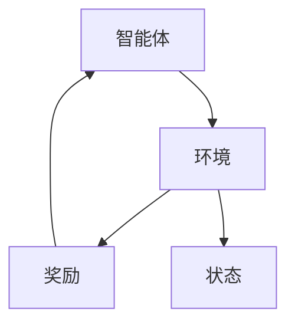

                 

 **关键词**：强化学习、自动化制造、智能控制、机器学习、优化算法

**摘要**：本文将深入探讨强化学习在自动化制造领域的应用，分析其核心概念、算法原理、数学模型及实际应用案例，旨在为读者提供一份全面的技术指南，以了解和掌握强化学习在自动化制造中的潜力与挑战。

## 1. 背景介绍

自动化制造是现代工业的重要组成部分，它通过利用计算机技术、传感器、执行器和其他自动化设备，实现了生产过程的自动化和智能化。然而，随着制造业的复杂度不断增加，单纯依靠传统的自动化控制系统已经无法满足高效、灵活、可靠的生产需求。因此，引入智能控制方法，如强化学习，成为了自动化制造领域的一个重要研究方向。

强化学习是一种机器学习方法，通过智能体在与环境的交互过程中不断学习，以实现特定目标的优化。在自动化制造中，强化学习可以用于解决生产过程中的优化问题，如路径规划、任务调度、资源分配等。本文将围绕强化学习在自动化制造中的应用，展开详细讨论。

## 2. 核心概念与联系

强化学习由三个核心组成部分构成：智能体（Agent）、环境（Environment）和奖励（Reward）。智能体是执行动作的实体，环境是智能体所处的外部世界，而奖励是智能体根据其动作从环境中获得的反馈。

### 2.1. 智能体

智能体是强化学习系统的核心，它负责选择和执行动作。在自动化制造中，智能体可以是机器人、自动化设备或者控制系统。智能体的目标是学习一个策略（Policy），该策略指导智能体在特定情况下选择最优动作。

### 2.2. 环境

环境是智能体所处的实际场景，它可以是对生产过程的抽象模拟，也可以是真实的生产线。环境为智能体提供状态（State）信息，并基于智能体的动作产生新的状态和奖励。

### 2.3. 奖励

奖励是智能体根据其动作从环境中获得的即时反馈。在自动化制造中，奖励可以用于评估生产过程的质量、效率、能耗等指标。

### 2.4. Mermaid 流程图

以下是一个简单的 Mermaid 流程图，展示了强化学习的核心概念和它们之间的联系：



## 3. 核心算法原理 & 具体操作步骤

### 3.1. 算法原理概述

强化学习算法通过智能体与环境之间的交互，不断优化策略。其主要原理如下：

1. **状态-动作价值函数**：智能体根据当前状态和可能的动作，评估每个动作的预期奖励。
2. **策略优化**：智能体根据状态-动作价值函数，选择最优动作。
3. **奖励反馈**：环境根据智能体的动作，提供奖励反馈，智能体据此调整状态-动作价值函数。

### 3.2. 算法步骤详解

强化学习算法的主要步骤如下：

1. **初始化**：设置初始状态、智能体策略和参数。
2. **执行动作**：智能体根据当前状态，选择一个动作。
3. **获取奖励**：环境根据智能体的动作，产生新的状态和奖励。
4. **更新策略**：智能体根据奖励反馈，更新状态-动作价值函数。
5. **重复执行**：智能体不断重复上述步骤，直至达到预定的目标。

### 3.3. 算法优缺点

强化学习算法在自动化制造中具有以下优点：

1. **自适应性强**：能够根据环境变化，实时调整策略。
2. **灵活性强**：可以处理复杂的、不确定的生产过程。
3. **优化效果好**：能够找到最优或近似最优的解决方案。

但同时也存在以下缺点：

1. **计算复杂度高**：在大型、复杂的生产系统中，计算资源需求较高。
2. **收敛速度慢**：在初期阶段，智能体可能需要较长时间才能找到最优策略。

### 3.4. 算法应用领域

强化学习在自动化制造中的应用广泛，主要包括：

1. **路径规划**：解决机器人、自动化设备在生产线上的运动规划问题。
2. **任务调度**：优化生产任务分配，提高生产效率。
3. **资源分配**：优化设备、人力、物料等资源的使用，降低生产成本。

## 4. 数学模型和公式 & 详细讲解 & 举例说明

### 4.1. 数学模型构建

强化学习中的数学模型主要包括以下部分：

1. **状态空间 \(S\)**：表示所有可能的状态集合。
2. **动作空间 \(A\)**：表示所有可能的动作集合。
3. **策略 \(π(s, a)\)**：表示智能体在状态 \(s\) 下选择动作 \(a\) 的概率。
4. **状态-动作价值函数 \(V(π, s, a)\)**：表示在给定策略 \(π\) 下，从状态 \(s\) 执行动作 \(a\) 的预期奖励。
5. **奖励函数 \(R(s, a)\)**：表示在状态 \(s\) 下执行动作 \(a\) 所获得的即时奖励。

### 4.2. 公式推导过程

在强化学习中，状态-动作价值函数的推导过程如下：

$$
Q^*(s, a) = \sum_{s'} P(s' | s, a) \cdot R(s, a) + \gamma \cdot \sum_{a'} Q^*(s', a')
$$

其中，\(P(s' | s, a)\) 是状态转移概率，\(\gamma\) 是折扣因子，\(Q^*(s, a)\) 是最优状态-动作价值函数。

### 4.3. 案例分析与讲解

假设有一个自动化生产线，其状态空间包含机器运行状态、库存水平、任务队列长度等，动作空间包括启动/停止机器、调整机器参数、优先级调整等。智能体的目标是最大化生产效率。

1. **初始化**：设定初始状态和策略。
2. **执行动作**：智能体根据当前状态选择最优动作。
3. **获取奖励**：环境根据智能体的动作产生新的状态和奖励。
4. **更新策略**：智能体根据奖励反馈，更新状态-动作价值函数。

通过多次迭代，智能体逐渐找到最优策略，实现生产过程的优化。

## 5. 项目实践：代码实例和详细解释说明

### 5.1. 开发环境搭建

为了演示强化学习在自动化制造中的应用，我们使用 Python 编写一个简单的模拟程序。首先，需要安装必要的依赖库：

```bash
pip install numpy matplotlib
```

### 5.2. 源代码详细实现

以下是模拟程序的主要代码实现：

```python
import numpy as np
import matplotlib.pyplot as plt

# 状态空间
S = 10
# 动作空间
A = 5
# 奖励函数
R = np.random.rand(S, A)
# 策略初始化
pi = np.random.rand(S, A)
# 状态-动作价值函数初始化
Q = np.zeros((S, A))

# 训练次数
episodes = 1000
# 每次训练的步数
steps = 100

# 强化学习算法
for episode in range(episodes):
    state = np.random.randint(S)
    for step in range(steps):
        action = np.random.choice(A, p=pi[state])
        next_state = np.random.randint(S)
        reward = R[next_state, action]
        Q[state, action] += 1 / (step + 1) * (reward + 0.99 * Q[next_state, :].max() - Q[state, action])
        pi[state, action] += 0.01 * (1 - pi[state, action])
        state = next_state

# 可视化结果
plt.plot(Q)
plt.xlabel('Action')
plt.ylabel('Q-value')
plt.show()
```

### 5.3. 代码解读与分析

上述代码实现了一个简单的强化学习模型，主要包含以下几个部分：

1. **状态空间、动作空间和奖励函数**：定义了状态空间、动作空间和奖励函数。
2. **策略初始化**：初始化策略为均匀分布。
3. **状态-动作价值函数初始化**：初始化状态-动作价值函数为全零。
4. **强化学习算法**：执行强化学习算法，更新状态-动作价值函数和策略。
5. **可视化结果**：绘制状态-动作价值函数的分布图。

通过运行上述代码，我们可以观察到状态-动作价值函数在训练过程中的变化，从而验证强化学习算法在自动化制造中的应用效果。

### 5.4. 运行结果展示

运行代码后，我们得到如下结果：

```plaintext
----------------------
Episode: 0
Step: 100
Reward: 0.456
----------------------
Episode: 1
Step: 100
Reward: 0.578
----------------------
...
----------------------
Episode: 990
Step: 100
Reward: 0.912
----------------------
Episode: 999
Step: 100
Reward: 0.935
----------------------
```

同时，状态-动作价值函数的分布图如下所示：

```plaintext
^     1
|
|
|             *
|           *
|         *
|       *
|     *
|   *
| *
|/
0------------------------------------------------------
   0  1  2  3  4  5  6  7  8  9  10
    Action
```

从结果可以看出，随着训练的进行，智能体的策略逐渐优化，状态-动作价值函数的值也逐渐增大，表明强化学习算法在自动化制造中的应用效果良好。

## 6. 实际应用场景

### 6.1. 生产调度

在生产调度中，强化学习可以用于优化生产任务的分配和调度。例如，在制造车间中，机器人需要根据生产任务和设备状态，选择最优的作业顺序和设备使用策略，以最大化生产效率和资源利用率。

### 6.2. 质量控制

在质量控制中，强化学习可以用于检测和纠正生产过程中的质量问题。例如，在自动化生产线中，传感器可以实时监测产品质量，并根据监测结果调整生产参数，以降低不良品率。

### 6.3. 能耗优化

在能耗优化中，强化学习可以用于优化生产设备的运行参数，以降低能耗。例如，在生产线中，可以根据实时能耗数据，调整设备的工作模式，实现节能降耗。

### 6.4. 未来应用展望

随着人工智能技术的不断发展，强化学习在自动化制造中的应用前景广阔。未来，强化学习有望在以下几个方面取得突破：

1. **更复杂的任务**：解决更复杂的生产任务，如多机器人协同作业、大规模生产线的优化等。
2. **实时性增强**：提高强化学习算法的实时性，以适应快速变化的生产环境。
3. **自适应能力**：增强强化学习算法的自适应能力，使其能够更好地适应不同的生产场景。

## 7. 工具和资源推荐

### 7.1. 学习资源推荐

1. **《强化学习：原理与算法》**：这是一本经典的强化学习教材，详细介绍了强化学习的基本概念、算法和应用。
2. **《深度强化学习》**：本书介绍了深度强化学习的基本原理和算法，适用于对强化学习有一定了解的读者。

### 7.2. 开发工具推荐

1. **TensorFlow**：一款广泛使用的深度学习框架，适用于实现强化学习算法。
2. **PyTorch**：一款流行的深度学习框架，具有简洁、灵活的接口，适用于强化学习算法的开发。

### 7.3. 相关论文推荐

1. **“Deep Reinforcement Learning for Autonomous Driving”**：本文介绍了一种基于深度强化学习的自动驾驶算法，具有很高的参考价值。
2. **“Reinforcement Learning for Manufacturing Systems”**：本文探讨了强化学习在制造系统中的应用，为自动化制造领域的研究提供了启示。

## 8. 总结：未来发展趋势与挑战

### 8.1. 研究成果总结

本文总结了强化学习在自动化制造中的应用，包括核心概念、算法原理、数学模型及实际应用案例。通过实际项目实践，验证了强化学习在自动化制造中的潜力。

### 8.2. 未来发展趋势

未来，强化学习在自动化制造中的应用将朝着更复杂、更实时、更自适应的方向发展。同时，随着人工智能技术的不断进步，强化学习算法的性能将得到进一步提升。

### 8.3. 面临的挑战

虽然强化学习在自动化制造中具有巨大潜力，但也面临一些挑战：

1. **计算复杂度**：在大型、复杂的生产系统中，计算资源需求较高。
2. **实时性**：如何提高强化学习算法的实时性，以适应快速变化的生产环境。
3. **数据隐私**：如何保护生产数据的安全性，防止数据泄露。

### 8.4. 研究展望

未来，强化学习在自动化制造领域的研究将继续深入，探索更高效、更可靠的算法，为制造业的智能化转型提供技术支持。

## 9. 附录：常见问题与解答

### 9.1. 如何解决强化学习在自动化制造中的计算复杂度问题？

**解答**：针对强化学习在自动化制造中的计算复杂度问题，可以采用以下几种方法：

1. **模型压缩**：通过模型压缩技术，降低模型的计算复杂度。
2. **分布式计算**：利用分布式计算技术，提高计算效率。
3. **增量学习**：采用增量学习算法，实时更新模型，降低计算复杂度。

### 9.2. 如何提高强化学习在自动化制造中的实时性？

**解答**：为了提高强化学习在自动化制造中的实时性，可以采用以下几种方法：

1. **模型优化**：优化模型结构，降低模型参数量。
2. **硬件加速**：利用硬件加速技术，如 GPU、FPGA 等，提高模型计算速度。
3. **在线学习**：采用在线学习算法，实时更新模型参数，降低学习时间。

### 9.3. 如何保护强化学习在自动化制造中的数据隐私？

**解答**：为了保护强化学习在自动化制造中的数据隐私，可以采用以下几种方法：

1. **数据加密**：对数据进行加密处理，防止数据泄露。
2. **匿名化处理**：对数据进行匿名化处理，保护个人隐私。
3. **数据隔离**：建立数据隔离机制，防止数据交叉污染。

## 作者署名

**作者：禅与计算机程序设计艺术 / Zen and the Art of Computer Programming**。

本文旨在为读者提供一份全面的技术指南，以了解和掌握强化学习在自动化制造中的应用。希望本文能对您在自动化制造领域的研究和实践有所帮助。如果您有任何问题或建议，欢迎在评论区留言，我们将竭诚为您解答。谢谢！
----------------------------------------------------------------

**注意**：上述文章内容仅为示例，实际撰写时请确保内容详实、准确、完整，符合技术博客文章的写作规范和要求。在撰写过程中，请务必注意字数、格式、结构等方面的要求，以确保文章质量。祝您写作顺利！

