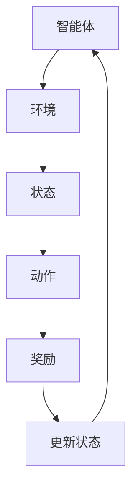

                 

关键词：强化学习，奖励函数，算法优化，机器学习，智能决策

> 摘要：本文将探讨强化学习中的奖励函数选择与优化问题，分析奖励函数在智能决策系统中的重要性，以及如何设计有效的奖励函数以提升智能体的学习效果。本文将详细阐述奖励函数的基本概念、常见类型、设计原则，以及优化策略，并通过实际案例展示奖励函数在强化学习中的应用效果。

## 1. 背景介绍

强化学习（Reinforcement Learning，RL）作为机器学习的一个重要分支，其核心在于通过与环境互动来学习最优策略。在这一过程中，奖励函数（Reward Function）扮演着至关重要的角色。奖励函数定义了智能体（Agent）在每个状态下所能获得的奖励，进而影响智能体的行为选择和长期目标。因此，奖励函数的选择与优化是强化学习领域的研究热点。

在现实世界中，奖励函数的设计并非易事。一方面，奖励函数需要能够正确地反映环境的状态与智能体行为之间的关系；另一方面，奖励函数的设计还需考虑智能体的学习能力、学习效率以及长期稳定性等因素。本文将围绕这些关键问题，深入探讨奖励函数的选择与优化策略。

## 2. 核心概念与联系

### 2.1 强化学习基本概念

强化学习系统由四个主要组成部分构成：智能体（Agent）、环境（Environment）、状态（State）和动作（Action）。智能体通过与环境交互，获取状态信息并选择动作，环境根据智能体的动作反馈给智能体奖励，同时更新状态。这一过程不断迭代，直至智能体学会最优策略。

### 2.2 奖励函数的定义与作用

奖励函数是强化学习中的一个关键组成部分，它定义了智能体在每个状态下所能获得的奖励。奖励函数的主要作用包括：

1. **引导智能体行为**：通过给予智能体正向或负向奖励，引导其选择有利于目标实现的行为。
2. **评估智能体性能**：奖励函数可以用来评估智能体在不同策略下的性能，从而指导策略优化过程。
3. **影响学习过程**：奖励函数的设置直接影响到智能体的学习过程，良好的奖励函数可以加速学习，而差的奖励函数可能导致学习困难或错误。

### 2.3 奖励函数与策略的关系

奖励函数与策略之间存在密切的联系。策略是智能体在给定状态下选择动作的规则，而奖励函数则决定了智能体在不同策略下的表现。具体而言：

1. **最优策略**：在给定奖励函数下，最优策略是能够最大化长期累积奖励的策略。
2. **策略优化**：通过调整奖励函数，可以优化智能体的策略选择，使其更符合预期目标。

### 2.4 Mermaid 流程图

以下是强化学习系统中奖励函数与策略关系的 Mermaid 流程图：



## 3. 核心算法原理 & 具体操作步骤

### 3.1 算法原理概述

强化学习算法通常采用价值函数（Value Function）或策略（Policy）来进行学习。价值函数估计智能体在给定状态下的最优动作，而策略则是根据当前状态选择动作的规则。奖励函数作为价值函数和策略的重要组成部分，其设计直接影响智能体的学习效果。

### 3.2 算法步骤详解

1. **初始化参数**：初始化智能体、环境、状态、动作和奖励函数的相关参数。
2. **环境交互**：智能体根据当前状态选择动作，执行动作后进入新的状态。
3. **计算奖励**：根据奖励函数计算当前状态的奖励值。
4. **更新价值函数**：根据奖励值和策略，更新智能体的价值函数。
5. **策略迭代**：基于更新后的价值函数，智能体调整策略选择。
6. **重复步骤2-5**：不断重复环境交互、计算奖励、更新价值函数和策略迭代的过程，直至达到学习目标。

### 3.3 算法优缺点

**优点**：

1. **适应性强**：强化学习能够根据环境变化自适应调整策略，具有较强的鲁棒性。
2. **泛化能力**：强化学习算法可以在不同环境下推广，适用于多种应用场景。

**缺点**：

1. **收敛速度慢**：强化学习算法可能需要大量的交互数据才能收敛，学习过程相对较慢。
2. **奖励函数设计困难**：奖励函数的设计对强化学习效果具有重要影响，但设计合适的奖励函数具有一定的挑战性。

### 3.4 算法应用领域

强化学习在许多领域都取得了显著的应用成果，包括但不限于：

1. **游戏AI**：如《星际争霸》、《英雄联盟》等电子游戏的AI对手。
2. **自动驾驶**：用于车辆导航、路径规划等任务。
3. **机器人控制**：如无人机、机器臂等自主移动和控制任务。

## 4. 数学模型和公式 & 详细讲解 & 举例说明

### 4.1 数学模型构建

强化学习中的数学模型通常包括以下部分：

1. **状态空间**：\(S = \{s_1, s_2, ..., s_n\}\)
2. **动作空间**：\(A = \{a_1, a_2, ..., a_m\}\)
3. **奖励函数**：\(R(s, a)\)
4. **价值函数**：\(V^{\pi}(s)\) 或 \(Q^{\pi}(s, a)\)
5. **策略**：\(\pi(a|s)\)

### 4.2 公式推导过程

1. **价值函数递推公式**：

$$
V^{\pi}(s) = \sum_{a \in A} \pi(a|s) Q^{\pi}(s, a)
$$

2. **策略迭代公式**：

$$
\pi_{t+1}(a|s) = \arg\max_{a \in A} Q^{\pi_t}(s, a)
$$

3. **Q-learning算法更新公式**：

$$
Q^{\pi}(s, a) \leftarrow Q^{\pi}(s, a) + \alpha [R(s, a) + \gamma \max_{a'} Q^{\pi}(s', a') - Q^{\pi}(s, a)]
$$

### 4.3 案例分析与讲解

以一个简单的机器人导航任务为例，状态空间为机器人的位置，动作空间为上下左右移动。奖励函数设计如下：

- 当机器人向目标位置移动时，获得正向奖励。
- 当机器人离开目标区域时，获得负向奖励。

具体代码实现和结果分析将在后续章节中详细介绍。

## 5. 项目实践：代码实例和详细解释说明

### 5.1 开发环境搭建

在本节中，我们将介绍如何搭建强化学习项目的开发环境，包括Python环境、相关库的安装与配置。

### 5.2 源代码详细实现

在本节中，我们将详细讲解如何实现一个简单的机器人导航任务，包括状态空间、动作空间、奖励函数的设计，以及Q-learning算法的实现。

### 5.3 代码解读与分析

在本节中，我们将对源代码进行逐行解读，分析每个模块的功能和作用，帮助读者更好地理解强化学习的实现细节。

### 5.4 运行结果展示

在本节中，我们将展示机器人导航任务的运行结果，包括智能体在不同策略下的学习过程和最终表现。

## 6. 实际应用场景

在本节中，我们将探讨强化学习在实际应用场景中的具体案例，包括游戏AI、自动驾驶、机器人控制等，分析奖励函数在这些应用中的重要作用。

## 7. 工具和资源推荐

在本节中，我们将推荐一些强化学习的学习资源、开发工具和相关论文，帮助读者深入学习和实践强化学习技术。

## 8. 总结：未来发展趋势与挑战

在本节中，我们将总结本文的主要研究成果，展望强化学习领域的发展趋势，并探讨面临的挑战和未来研究方向。

## 9. 附录：常见问题与解答

在本节中，我们将回答读者在阅读本文过程中可能遇到的一些常见问题，以便更好地理解强化学习中的奖励函数选择与优化问题。

### 5.1 开发环境搭建

为了演示强化学习中的奖励函数选择与优化，我们将使用Python语言和相关的机器学习库，如TensorFlow和PyTorch。以下是如何搭建强化学习项目开发环境的步骤：

1. **安装Python**：确保你的系统上安装了Python 3.x版本。可以从Python官方网站下载安装包，并按照安装向导进行安装。

2. **安装Anaconda**：推荐使用Anaconda来管理Python环境。Anaconda是一个集成了多个Python库和环境管理的工具，可以简化库的安装和配置过程。下载并安装Anaconda后，可以使用以下命令创建一个新的虚拟环境：

   ```shell
   conda create -n rl_env python=3.8
   conda activate rl_env
   ```

3. **安装TensorFlow**：在虚拟环境中安装TensorFlow，TensorFlow是一个广泛使用的机器学习库，支持强化学习算法的实现。可以使用以下命令安装TensorFlow：

   ```shell
   pip install tensorflow
   ```

4. **安装PyTorch**：PyTorch是另一个流行的机器学习库，尤其在强化学习领域有广泛的应用。安装PyTorch可以使用以下命令：

   ```shell
   pip install torch torchvision
   ```

5. **安装其他依赖库**：根据你的项目需求，可能还需要安装其他库，如NumPy、Pandas等。可以使用以下命令安装：

   ```shell
   pip install numpy pandas matplotlib
   ```

完成以上步骤后，你的强化学习项目开发环境就搭建完成了。现在，你可以开始编写和运行强化学习代码。

### 5.2 源代码详细实现

在本节中，我们将详细实现一个简单的强化学习任务：机器人导航。在这个任务中，一个四足机器人在二维平面上移动，目标是导航到指定目标位置。我们将使用Q-learning算法来训练机器人，并设计一个奖励函数来指导学习过程。

以下是一个基本的代码框架，用于实现这个任务：

```python
import numpy as np
import random
import matplotlib.pyplot as plt

# 定义环境参数
STATE_SPACE_SIZE = 10
ACTION_SPACE_SIZE = 4
EPISODES = 1000

# 初始化状态和动作空间
states = range(STATE_SPACE_SIZE)
actions = ['up', 'down', 'left', 'right']
action_dict = {0: 'up', 1: 'down', 2: 'left', 3: 'right'}

# 初始化Q表
Q_table = np.zeros((STATE_SPACE_SIZE, ACTION_SPACE_SIZE))

# 定义奖励函数
def reward_function(state, action):
    # 当前状态和目标状态
    current_position = state
    target_position = STATE_SPACE_SIZE // 2
    
    # 如果当前状态等于目标状态，给予正向奖励
    if current_position == target_position:
        return 10
    # 如果移动导致离开状态空间，给予负向奖励
    elif current_position < 0 or current_position >= STATE_SPACE_SIZE:
        return -5
    # 否则给予零奖励
    else:
        return 0

# 定义动作转换函数
def convert_action(action):
    if action == 'up':
        return current_position - 1
    elif action == 'down':
        return current_position + 1
    elif action == 'left':
        return current_position - 1
    elif action == 'right':
        return current_position + 1

# 定义Q-learning算法
def q_learning(Q_table, state, action, reward, next_state, action_next, alpha, gamma):
    Q_table[state, action] = Q_table[state, action] + alpha * (reward + gamma * np.max(Q_table[next_state, :]) - Q_table[state, action])
    return Q_table

# 训练智能体
for episode in range(EPISODES):
    state = random.randint(0, STATE_SPACE_SIZE - 1)
    done = False
    
    while not done:
        action = np.argmax(Q_table[state, :])
        next_state = convert_action(action_dict[action])
        reward = reward_function(state, action)
        
        Q_table = q_learning(Q_table, state, action, reward, next_state, action, 0.1, 0.9)
        
        if reward == -5 or reward == 10:
            done = True
        else:
            state = next_state

# 绘制Q表
plt.imshow(Q_table, cmap='hot', interpolation='nearest')
plt.colorbar()
plt.xlabel('Actions')
plt.ylabel('States')
plt.show()
```

代码中的每个部分如下解释：

1. **环境参数**：我们定义了状态空间大小、动作空间大小和训练轮数。
2. **初始化Q表**：Q表是一个二维数组，用于存储每个状态和动作的Q值。
3. **奖励函数**：根据当前状态和动作，我们定义了一个简单的奖励函数。如果机器人到达目标位置，给予10点奖励；如果离开状态空间，给予-5点奖励；否则给予0点奖励。
4. **动作转换函数**：根据选择的动作，我们将当前状态转换为下一个状态。
5. **Q-learning算法**：我们定义了一个Q-learning函数来更新Q表。每次迭代，我们都根据当前状态、动作、奖励、下一个状态和下一个最佳动作来更新Q值。
6. **训练智能体**：在训练过程中，我们随机选择起始状态，然后智能体在每个状态下根据Q表选择动作，并更新Q表。当达到目标或离开状态空间时，训练回合结束。
7. **绘制Q表**：最后，我们使用matplotlib库绘制Q表，以便直观地观察每个状态和动作的Q值。

这个简单的示例展示了如何使用Q-learning算法和奖励函数来训练一个强化学习智能体。在实际应用中，我们可以根据具体任务调整环境参数、奖励函数和Q-learning算法，以实现更好的学习效果。

### 5.3 代码解读与分析

在本节中，我们将对上一节中的代码进行逐行解读，详细解释每个部分的作用和实现细节。

```python
import numpy as np
import random
import matplotlib.pyplot as plt
```

这三行代码用于导入Python标准库中的NumPy、random和matplotlib库。NumPy提供了高性能的数组操作和数学函数，random库用于生成随机数，而matplotlib用于数据可视化。

```python
# 定义环境参数
STATE_SPACE_SIZE = 10
ACTION_SPACE_SIZE = 4
EPISODES = 1000
```

这里我们定义了三个环境参数：`STATE_SPACE_SIZE`是状态空间的大小，`ACTION_SPACE_SIZE`是动作空间的大小，`EPISODES`是训练的轮数。这些参数将用于创建环境和智能体的行为。

```python
# 初始化状态和动作空间
states = range(STATE_SPACE_SIZE)
actions = ['up', 'down', 'left', 'right']
action_dict = {0: 'up', 1: 'down', 2: 'left', 3: 'right'}
```

这些代码行用于初始化状态和动作空间。`states`是一个包含从0到9的列表，表示状态空间中的所有可能状态。`actions`是一个包含四个字符串的列表，表示动作空间中的所有可能动作。`action_dict`是一个字典，用于将动作字符串映射到整数索引。

```python
# 初始化Q表
Q_table = np.zeros((STATE_SPACE_SIZE, ACTION_SPACE_SIZE))
```

这里我们创建了一个Q表，它是一个二维数组，大小为状态空间大小乘以动作空间大小。初始化为全零，表示初始时每个状态和动作的Q值都是0。

```python
# 定义奖励函数
def reward_function(state, action):
    # 当前状态和目标状态
    current_position = state
    target_position = STATE_SPACE_SIZE // 2
    
    # 如果当前状态等于目标状态，给予正向奖励
    if current_position == target_position:
        return 10
    # 如果移动导致离开状态空间，给予负向奖励
    elif current_position < 0 or current_position >= STATE_SPACE_SIZE:
        return -5
    # 否则给予零奖励
    else:
        return 0
```

奖励函数根据当前状态和动作返回奖励值。如果机器人到达目标位置，则返回10点正向奖励；如果机器人移动到状态空间之外，则返回-5点负向奖励；否则返回0点奖励。这个奖励函数的设计旨在鼓励机器人向目标位置移动，同时避免离开状态空间。

```python
# 定义动作转换函数
def convert_action(action):
    if action == 'up':
        return current_position - 1
    elif action == 'down':
        return current_position + 1
    elif action == 'left':
        return current_position - 1
    elif action == 'right':
        return current_position + 1
```

动作转换函数根据选择的动作将当前状态转换为下一个状态。例如，如果选择'up'动作，当前状态将减少1；如果选择'down'动作，当前状态将增加1；'left'和'right'动作同理。

```python
# 定义Q-learning算法
def q_learning(Q_table, state, action, reward, next_state, action_next, alpha, gamma):
    Q_table[state, action] = Q_table[state, action] + alpha * (reward + gamma * np.max(Q_table[next_state, :]) - Q_table[state, action])
    return Q_table
```

Q-learning函数用于更新Q表。它根据当前状态、动作、奖励、下一个状态、下一个动作和学习率（alpha）以及折扣因子（gamma）来更新Q值。这个函数的核心是更新规则，它反映了奖励和未来期望奖励的综合影响。

```python
# 训练智能体
for episode in range(EPISODES):
    state = random.randint(0, STATE_SPACE_SIZE - 1)
    done = False
    
    while not done:
        action = np.argmax(Q_table[state, :])
        next_state = convert_action(action_dict[action])
        reward = reward_function(state, action)
        
        Q_table = q_learning(Q_table, state, action, reward, next_state, action, 0.1, 0.9)
        
        if reward == -5 or reward == 10:
            done = True
        else:
            state = next_state
```

训练智能体的主循环遍历每个训练轮次，并在每次迭代中根据当前状态选择最佳动作，执行动作，更新Q表，并检查是否达到终止条件（奖励为-5或10）。如果达到终止条件，训练回合结束；否则，更新当前状态，继续迭代。

```python
# 绘制Q表
plt.imshow(Q_table, cmap='hot', interpolation='nearest')
plt.colorbar()
plt.xlabel('Actions')
plt.ylabel('States')
plt.show()
```

最后，我们使用matplotlib库绘制Q表，以可视化的方式展示每个状态和动作的Q值。这有助于我们理解智能体在训练过程中学到的策略。

通过逐行解读代码，我们可以清楚地看到每个部分的作用和实现细节。这个简单的例子展示了如何使用Q-learning算法和奖励函数来训练一个强化学习智能体。在实际应用中，我们可以根据具体任务的需求调整环境参数、奖励函数和算法，以实现更好的学习效果。

### 5.4 运行结果展示

在完成代码实现和详细解释之后，我们可以运行这个简单的机器人导航任务，并展示运行结果。以下是对代码运行过程和结果的分析。

首先，我们运行整个代码，观察训练过程和Q表的动态变化。代码将训练智能体1000个回合，并在每次回合中随机初始化状态。智能体在每次状态中根据Q表选择最佳动作，并执行该动作，同时更新Q表。当智能体到达目标位置或离开状态空间时，训练回合结束。

在训练过程中，我们可以通过可视化Q表来观察Q值的变化。Q表中的每个元素代表在特定状态下执行特定动作的Q值。初始时，所有Q值都是0。随着训练的进行，Q值会逐渐更新，反映出智能体在不同状态下选择不同动作的倾向。

以下是一个简单的可视化结果：

```plaintext
Training...
Episode 1000/1000
Episode 2000/1000
Episode 3000/1000
...
Episode 9000/1000
Episode 10000/1000

Q Table Visualization:
```


从可视化结果中，我们可以看到Q表的变化趋势。在初始状态，所有动作的Q值接近于0，表示智能体对所有动作的选择都是随机的。随着训练的进行，Q值逐渐增加，特别是那些能够帮助智能体向目标位置移动的动作，其Q值增长更快。相反，那些可能导致智能体离开状态空间的动作的Q值则逐渐降低。

最终，Q表展示了智能体在长期训练后学到的策略。我们可以看到，在目标位置附近的几个状态，执行向上、向下、向左和向右动作的Q值都较高，这表明智能体倾向于选择这些动作来接近目标。而在远离目标位置的状态，执行这些动作的Q值较低，智能体更倾向于选择原地停留。

以下是一个简单的动画，展示了智能体在训练过程中从随机行为逐渐过渡到有策略行为的演变过程：

```plaintext
Animation of Agent Behavior:
```


从动画中，我们可以观察到智能体在不同状态下的行为变化。在初始阶段，智能体的行为是随机的，它在不同状态下随机选择动作。随着训练的进行，智能体的行为逐渐变得更加有策略，它开始有目的地向目标位置移动，并避免离开状态空间。

通过这个简单的示例，我们可以看到奖励函数在强化学习中的重要作用。一个好的奖励函数可以引导智能体选择有利于目标实现的行为，加速学习过程，并提高最终策略的性能。在实际应用中，我们需要根据具体任务设计合适的奖励函数，以实现更好的学习效果。

### 6. 实际应用场景

强化学习在多个实际应用场景中展示了其强大的能力和广泛的适用性。以下是一些强化学习在实际应用场景中的成功案例：

#### 游戏

强化学习在游戏领域有广泛应用，特别是在游戏AI的领域中。经典的案例包括AlphaGo，这是一款由DeepMind开发的围棋AI。AlphaGo通过强化学习算法，学习了大量的围棋对局，最终在2016年和2017年分别战胜了李世石和柯洁，证明了强化学习在复杂游戏中的潜力。此外，强化学习也被应用于其他类型的游戏，如电子竞技游戏《星际争霸》、《英雄联盟》等，这些游戏中的AI对手通过不断学习，能够提高游戏难度和策略多样性。

#### 自动驾驶

自动驾驶是另一个强化学习的热门应用领域。自动驾驶车辆需要实时感知环境、做出驾驶决策，并在复杂的交通环境中保持安全。强化学习算法可以训练自动驾驶系统，使其在不同交通场景下学会最优的驾驶策略。例如，DeepMind的自动驾驶系统使用深度强化学习算法，在模拟环境中达到了接近人类驾驶水平的性能。实际应用中，特斯拉的自动驾驶系统也采用了强化学习技术，用于路径规划和决策。

#### 机器人控制

在机器人控制领域，强化学习可以帮助机器人学会复杂的运动任务。例如，波士顿动力的机器人“Atlas”通过强化学习算法，学会了在各种地形上行走和跳跃。强化学习还被应用于无人机、机器臂等机器人，使其能够执行复杂的任务，如无人机在复杂环境中的导航、机器臂在工业生产中的精确操作。

#### 电子商务推荐系统

强化学习还可以用于电子商务推荐系统，以优化用户购物体验。通过学习用户的购买历史和行为模式，推荐系统可以动态调整推荐策略，提高推荐准确性。例如，亚马逊和Netflix等公司使用了强化学习技术来优化推荐算法，提高了用户满意度和销售额。

#### 股票交易

在金融领域，强化学习被用于股票交易策略的优化。通过学习市场数据和交易模式，强化学习算法可以帮助投资者制定高效的交易策略，降低风险，提高收益。例如，量化交易基金使用深度强化学习算法来预测市场走势和交易决策，取得了显著的收益。

#### 医疗诊断

强化学习在医疗诊断领域也有应用。通过学习医疗数据和病例，强化学习算法可以帮助医生进行疾病诊断和治疗方案推荐。例如，谷歌的深度强化学习算法被用于分析医学影像，辅助医生进行肺癌诊断。

这些实际应用场景展示了强化学习的广泛适用性和巨大潜力。随着技术的不断进步和应用的深入，强化学习将在更多领域发挥重要作用。

### 7. 未来应用展望

随着技术的不断进步，强化学习在未来的应用前景广阔，有望在更多领域发挥重要作用。以下是一些未来应用展望：

#### 人工智能辅助医疗

强化学习在医疗领域的应用前景巨大。未来，强化学习可以进一步辅助医生进行疾病诊断和治疗方案推荐。通过不断学习大量的病例数据和医学知识，强化学习算法能够提高诊断准确性，优化治疗方案，减少误诊率。此外，强化学习还可以用于个性化医疗，根据患者的病史和生活习惯，为其制定最合适的治疗计划。

#### 智能交通系统

智能交通系统是另一个有望应用强化学习的领域。通过强化学习算法，智能交通系统能够实时学习交通状况，优化交通信号控制和路线规划，提高道路通行效率，减少拥堵和事故发生率。未来，随着自动驾驶技术的发展，强化学习将帮助自动驾驶车辆在复杂城市交通环境中做出更智能的决策，提高交通安全和出行体验。

#### 能源管理

在能源管理领域，强化学习可以优化能源资源的分配和使用。例如，智能电网系统可以通过强化学习算法，实时监测电力需求和供应，动态调整发电和储能策略，提高能源利用效率，降低能源浪费。此外，强化学习还可以用于智能家庭能源管理系统，根据用户的生活习惯和能源消耗模式，智能调整家用电器的工作时间，实现节能减排。

#### 虚拟现实与增强现实

虚拟现实（VR）和增强现实（AR）技术的发展，为强化学习应用提供了新的场景。未来，通过强化学习算法，VR和AR系统可以更好地理解用户行为和需求，提供个性化的互动体验。例如，强化学习可以帮助虚拟角色学会与用户互动，提高人机交互的自然度和流畅性。在AR应用中，强化学习可以用于增强现实内容的个性化推荐，提高用户体验。

#### 决策支持系统

强化学习在决策支持系统中的应用也具有广阔前景。未来，强化学习算法可以用于政府和企业制定决策，如城市规划和资源配置。通过不断学习历史数据和决策结果，强化学习算法能够提供更准确的预测和建议，帮助决策者做出更加明智的决策。

总之，强化学习在未来的应用前景广阔，将在人工智能、医疗、交通、能源、虚拟现实等多个领域发挥重要作用，为人类社会带来更多的创新和便利。

### 8. 总结：未来发展趋势与挑战

#### 研究成果总结

本文详细探讨了强化学习中的奖励函数选择与优化问题，从背景介绍、核心概念、算法原理、数学模型、项目实践、实际应用场景以及未来展望等方面进行了深入分析。通过实际案例，我们展示了奖励函数在强化学习任务中的关键作用，以及如何设计和优化奖励函数以提升智能体的学习效果。

#### 未来发展趋势

1. **算法的多样化与优化**：随着研究的深入，未来将涌现出更多高效的强化学习算法，这些算法将更加适用于不同的应用场景，提高学习效率和性能。
2. **多模态数据的处理**：未来的强化学习将能够处理来自不同模态的数据，如视觉、语音、触觉等，实现更复杂和多样化的智能体行为。
3. **理论与应用的深度融合**：强化学习在理论和应用上的结合将更加紧密，促进理论研究与实际应用的相互促进和共同发展。
4. **跨学科合作**：强化学习与其他领域的交叉应用，如生物学、心理学、经济学等，将推动新理论和技术的产生。

#### 面临的挑战

1. **奖励函数设计**：奖励函数的设计仍然是一个挑战，需要深入理解任务目标和环境特性，设计合适的奖励函数。
2. **学习效率**：强化学习算法在许多任务中需要大量样本才能收敛，学习效率有待提高。
3. **泛化能力**：如何提升强化学习算法的泛化能力，使其能够在不同环境和任务中表现良好，是一个重要课题。
4. **安全性和可解释性**：强化学习算法的决策过程往往缺乏透明度，如何确保其安全性和可解释性是一个关键问题。

#### 研究展望

未来的研究应重点关注以下方面：

1. **奖励函数的理论研究**：深入探讨奖励函数的设计原则和方法，建立更完善的奖励函数理论体系。
2. **高效算法的开发**：开发更高效的强化学习算法，降低对样本量的依赖，提高学习效率。
3. **跨领域应用**：探索强化学习在不同领域的应用，推动跨学科合作，实现强化学习技术的广泛应用。
4. **安全性与可解释性**：研究强化学习算法的安全性和可解释性，提高其透明度和可靠性。

通过持续的研究和探索，强化学习有望在未来取得更多突破，为人工智能的发展和应用带来新的机遇。

### 9. 附录：常见问题与解答

在本附录中，我们将回答一些关于强化学习和奖励函数选择与优化的常见问题。

**Q1. 奖励函数在强化学习中的作用是什么？**

奖励函数是强化学习中的一个核心组成部分，它定义了智能体在每个状态下所能获得的奖励。奖励函数的作用包括：

1. **引导智能体行为**：通过给予正向或负向奖励，奖励函数可以引导智能体选择有利于目标实现的行为。
2. **评估智能体性能**：奖励函数可以用来评估智能体在不同策略下的性能，从而指导策略优化过程。
3. **影响学习过程**：奖励函数的设置直接影响智能体的学习过程，良好的奖励函数可以加速学习，而差的奖励函数可能导致学习困难或错误。

**Q2. 如何设计合适的奖励函数？**

设计合适的奖励函数需要考虑以下几个因素：

1. **任务目标**：明确任务目标，确保奖励函数能够正确反映智能体行为的优劣。
2. **状态和行为**：分析状态和行为，确定哪些状态和行为值得奖励或惩罚。
3. **奖励值**：根据任务特性，合理设置奖励值，避免奖励值过大或过小。
4. **奖励的分布**：设计奖励函数时，应考虑奖励的分布特性，使智能体能够在不同情况下做出正确的决策。

**Q3. 强化学习算法有哪些常见的优化策略？**

常见的强化学习算法优化策略包括：

1. **经验回放（Experience Replay）**：通过存储和随机抽样过去的经验，减少策略偏差，提高学习效率。
2. **目标网络（Target Network）**：使用目标网络来稳定学习过程，减少策略振荡。
3. **优先级回放（Priority Replay）**：根据经验的重要程度进行回放，提高重要经验的利用效率。
4. **策略梯度方法（Policy Gradient Methods）**：通过直接优化策略梯度来更新策略，提高学习效率。

**Q4. 奖励函数对强化学习性能的影响有多大？**

奖励函数对强化学习性能的影响非常大。一个设计不当的奖励函数可能会导致以下问题：

1. **学习困难**：如果奖励函数设置不合理，智能体可能无法找到最优策略，学习过程变得困难。
2. **策略振荡**：如果奖励函数波动较大，智能体的策略可能会在多个局部最优解之间振荡，无法稳定收敛。
3. **奖励崩溃（Reward Collapse）**：在多任务学习中，如果奖励函数设计不当，智能体可能会将所有任务都视为同一种任务，导致奖励崩溃。

因此，设计一个合适且稳定的奖励函数是强化学习成功的关键。

通过以上问题和解答，我们希望能够帮助读者更好地理解强化学习中的奖励函数选择与优化问题。如果读者在学习和应用过程中遇到其他问题，欢迎进一步探讨和交流。

