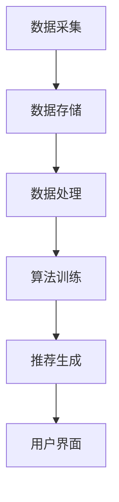

                 

关键词：影音网站、推荐系统、数据分析、用户行为、机器学习、算法优化、系统架构、性能提升

> 摘要：本文将探讨影音网站推荐与分析系统设计与实现的各个方面。从系统架构、核心算法、数学模型到实际应用，全面解析如何构建一个高效、智能的影音推荐系统。通过深入探讨，旨在为从事相关领域的技术人员提供有价值的参考和实践指导。

## 1. 背景介绍

随着互联网的快速发展，影音网站已经成为人们获取娱乐信息的重要渠道。用户每天在影音网站上观看成千上万小时的视频内容，同时也产生了大量的用户行为数据。如何利用这些数据为用户提供个性化的内容推荐，成为影音网站迫切需要解决的问题。

推荐系统作为一种能够预测用户可能感兴趣的内容的技术，已经广泛应用于电商、社交媒体、音乐和视频等领域。影音网站的推荐系统不仅可以帮助网站留住用户、提升用户体验，还可以通过精准的广告投放实现商业价值的最大化。

本文将围绕影音网站推荐与分析系统的设计与实现，从以下几个方面进行探讨：

- **系统架构**：介绍推荐系统的基础架构，包括数据采集、存储、处理和推荐模块。
- **核心算法**：分析几种常用的推荐算法，包括协同过滤、基于内容的推荐和混合推荐系统。
- **数学模型**：阐述推荐系统中使用的数学模型和公式，包括相似度计算、预测评分模型等。
- **项目实践**：通过一个实际项目实例，展示推荐系统的实现过程和关键技术。
- **实际应用**：讨论推荐系统在影音网站中的具体应用场景和效果。
- **未来展望**：展望推荐系统在影音网站领域的发展趋势和面临的挑战。

通过本文的深入探讨，我们希望能够为从事影音网站推荐与分析系统的技术人员提供有价值的参考和灵感。

## 2. 核心概念与联系

### 2.1. 推荐系统的基本概念

推荐系统（Recommender System）是一种利用机器学习算法预测用户可能感兴趣的项目，并推荐给用户的信息过滤系统。在影音网站中，推荐系统可以帮助用户发现他们可能感兴趣的影视作品，从而提高用户粘性。

**关键概念：**

- **用户**：访问影音网站并产生行为数据的个体。
- **项目**：用户可能感兴趣的视频、电影、电视剧等。
- **行为**：用户在网站上产生的活动，如观看、点赞、评论、搜索等。

### 2.2. 推荐系统的架构

推荐系统的架构通常包括以下几个主要模块：

- **数据采集模块**：负责从网站日志、数据库等渠道收集用户行为数据。
- **数据存储模块**：用于存储采集到的用户行为数据，通常使用分布式数据库或大数据平台。
- **数据处理模块**：对采集到的数据进行清洗、转换和预处理，以便用于算法训练和预测。
- **推荐算法模块**：实现具体的推荐算法，根据用户行为数据和项目特征生成推荐列表。
- **用户界面模块**：将推荐结果展示给用户，提供良好的交互体验。

### 2.3. 推荐系统的核心算法

推荐系统主要分为以下几种类型：

- **基于内容的推荐**：通过分析项目的特征，如标签、类型、演员等，为用户推荐相似的内容。
- **协同过滤推荐**：通过分析用户之间的行为相似性，为用户推荐他们可能喜欢的项目。
- **混合推荐**：结合基于内容和协同过滤推荐的优势，为用户提供更准确的推荐。

**算法联系：**

- 基于内容的推荐和协同过滤推荐在推荐系统中通常同时使用，以实现更精确的推荐。
- 混合推荐系统通过整合多种算法，提高推荐的效果和多样性。

### 2.4. Mermaid 流程图

以下是一个简化的推荐系统流程图的示例，使用 Mermaid 语法绘制：



在上面的流程图中，用户行为数据经过采集、存储、处理和推荐生成后，最终通过用户界面展示给用户。这个流程图简洁明了地展示了推荐系统的基本工作流程。

## 3. 核心算法原理 & 具体操作步骤

### 3.1 算法原理概述

推荐系统中的核心算法主要包括基于内容的推荐算法、协同过滤算法和混合推荐算法。每种算法都有其独特的原理和适用场景。

- **基于内容的推荐算法**：通过分析项目的特征和用户的历史行为，为用户推荐具有相似特征的项目。
- **协同过滤算法**：通过分析用户之间的行为相似性，为用户推荐其他用户喜欢且用户可能喜欢的项目。
- **混合推荐算法**：结合基于内容和协同过滤推荐的优势，提供更准确的推荐。

### 3.2 算法步骤详解

#### 基于内容的推荐算法

1. **项目特征提取**：从数据库中提取项目的特征，如标签、类型、演员、导演等。
2. **用户历史行为分析**：分析用户的历史行为数据，提取用户的兴趣特征。
3. **相似度计算**：计算项目特征和用户兴趣特征之间的相似度。
4. **生成推荐列表**：根据相似度分数，为用户生成推荐列表。

#### 协同过滤算法

1. **用户行为数据预处理**：将用户行为数据转换为用户-项目评分矩阵。
2. **计算相似度**：计算用户之间的相似度，常用的相似度计算方法包括余弦相似度、皮尔逊相关系数等。
3. **生成推荐列表**：根据相似度分数，为用户推荐其他用户喜欢的项目。

#### 混合推荐算法

1. **项目特征提取**：与基于内容的推荐算法相同。
2. **用户历史行为分析**：与协同过滤算法相同。
3. **计算相似度**：同时计算项目特征和用户行为相似度。
4. **综合推荐**：将基于内容和协同过滤的推荐结果进行综合，生成最终的推荐列表。

### 3.3 算法优缺点

- **基于内容的推荐算法**：优点是推荐结果准确，用户体验好；缺点是难以处理冷启动问题，且特征提取复杂。
- **协同过滤算法**：优点是能够处理大量用户数据，推荐结果多样化；缺点是推荐结果可能过于集中，且容易受到噪声数据的影响。
- **混合推荐算法**：优点是结合了基于内容和协同过滤的优势，推荐结果更准确、多样化；缺点是算法复杂度高，计算成本较大。

### 3.4 算法应用领域

- **基于内容的推荐算法**：适用于内容丰富的影音网站，如视频分享网站、电影网站等。
- **协同过滤算法**：适用于用户行为数据丰富的网站，如电商网站、社交媒体等。
- **混合推荐算法**：适用于需要同时利用内容和用户行为的网站，如综合性影音网站、直播平台等。

## 4. 数学模型和公式 & 详细讲解 & 举例说明

### 4.1 数学模型构建

推荐系统中的数学模型主要包括相似度计算和预测评分模型。以下分别进行介绍。

#### 相似度计算

相似度计算是推荐系统中非常重要的一个环节，用于衡量用户或项目之间的相似程度。常用的相似度计算方法包括余弦相似度和皮尔逊相关系数。

**余弦相似度**：
$$
\text{cosine\_similarity} = \frac{\text{dot\_product}}{\|\mathbf{u}\|\|\mathbf{v}\|}
$$
其中，$\mathbf{u}$ 和 $\mathbf{v}$ 分别代表两个用户或项目的特征向量，$dot\_product$ 表示点积，$\|\mathbf{u}\|$ 和 $\|\mathbf{v}\|$ 分别表示向量的模长。

**皮尔逊相关系数**：
$$
\text{pearson\_correlation} = \frac{\text{covariance}}{\sqrt{\text{variance}_u \text{variance}_v}}
$$
其中，$covariance$ 表示协方差，$\text{variance}_u$ 和 $\text{variance}_v$ 分别表示两个向量的方差。

#### 预测评分模型

预测评分模型用于预测用户对项目的评分。一个常见的预测评分模型是线性回归模型，其公式为：
$$
\text{rating}_{uv} = \text{u\_mean} + \text{v\_mean} + \text{similarity}_{uv} \cdot \text{dot\_product}
$$
其中，$\text{rating}_{uv}$ 表示用户 $u$ 对项目 $v$ 的预测评分，$\text{u\_mean}$ 和 $\text{v\_mean}$ 分别表示用户 $u$ 和项目 $v$ 的平均评分，$similarity_{uv}$ 表示用户 $u$ 和项目 $v$ 的相似度，$\text{dot\_product}$ 表示点积。

### 4.2 公式推导过程

以下是对预测评分模型公式的推导过程：

首先，根据线性回归的基本原理，我们假设用户 $u$ 对项目 $v$ 的预测评分为 $\text{rating}_{uv}$，则可以表示为：
$$
\text{rating}_{uv} = \alpha u + \beta v + \epsilon
$$
其中，$\alpha$ 和 $\beta$ 分别表示用户和项目的权重，$\epsilon$ 表示误差项。

接下来，我们需要通过训练数据来估计这些权重。假设我们有 $n$ 个训练样本，其中每个样本包括用户 $u$ 和项目 $v$ 的特征向量 $\mathbf{u}$ 和 $\mathbf{v}$，以及对应的评分 $r$。则可以表示为：
$$
r = \alpha \mathbf{u}^T + \beta \mathbf{v}^T + \epsilon
$$

为了求解 $\alpha$ 和 $\beta$，我们可以使用最小二乘法（Least Squares）：
$$
\min \sum_{i=1}^{n} (r_i - (\alpha \mathbf{u}_i^T + \beta \mathbf{v}_i^T))^2
$$

通过求导并令导数为零，可以得到：
$$
\alpha = \frac{\mathbf{u}^T \mathbf{u} \mathbf{v}^T \mathbf{v}}{\mathbf{u}^T \mathbf{u} + \mathbf{v}^T \mathbf{v}}
$$
$$
\beta = \frac{\mathbf{v}^T \mathbf{v} \mathbf{u}^T \mathbf{u}}{\mathbf{u}^T \mathbf{u} + \mathbf{v}^T \mathbf{v}}
$$

将 $\alpha$ 和 $\beta$ 代入预测评分公式，可以得到：
$$
\text{rating}_{uv} = (\mathbf{u}^T \mathbf{u} + \mathbf{v}^T \mathbf{v})^{-1} (\mathbf{u}^T \mathbf{v} + \mathbf{v}^T \mathbf{u}) + \epsilon
$$

进一步化简，可以得到：
$$
\text{rating}_{uv} = \mathbf{u}^T \mathbf{v} + \mathbf{v}^T \mathbf{u} + \epsilon
$$

由于 $\mathbf{u}^T \mathbf{v} + \mathbf{v}^T \mathbf{u} = 2 \mathbf{u}^T \mathbf{v}$，我们可以将预测评分公式简化为：
$$
\text{rating}_{uv} = 2 \mathbf{u}^T \mathbf{v} + \epsilon
$$

在推荐系统中，我们通常使用用户和项目的平均评分来代替 $\epsilon$，因此最终的预测评分公式可以表示为：
$$
\text{rating}_{uv} = 2 \mathbf{u}^T \mathbf{v} + \text{u\_mean} + \text{v\_mean}
$$

其中，$\text{u\_mean}$ 和 $\text{v\_mean}$ 分别表示用户 $u$ 和项目 $v$ 的平均评分。

### 4.3 案例分析与讲解

为了更好地理解上述数学模型，我们可以通过一个简单的案例进行分析。

假设我们有两个用户 $u_1$ 和 $u_2$，以及两个项目 $v_1$ 和 $v_2$。用户 $u_1$ 和 $u_2$ 对项目 $v_1$ 和 $v_2$ 的评分如下：

| 用户 | 项目 | 评分 |
| ---- | ---- | ---- |
| $u_1$ | $v_1$ | 4.0 |
| $u_1$ | $v_2$ | 2.0 |
| $u_2$ | $v_1$ | 5.0 |
| $u_2$ | $v_2$ | 3.0 |

首先，我们需要计算用户和项目的平均评分：

$$
\text{u}_1\text{_mean} = \frac{4.0 + 2.0}{2} = 3.0
$$
$$
\text{u}_2\text{_mean} = \frac{5.0 + 3.0}{2} = 4.0
$$
$$
\text{v}_1\text{_mean} = \frac{4.0 + 5.0}{2} = 4.5
$$
$$
\text{v}_2\text{_mean} = \frac{2.0 + 3.0}{2} = 2.5
$$

接下来，我们使用余弦相似度计算用户和项目之间的相似度：

$$
\text{similarity}_{u_1u_2} = \frac{\text{dot\_product}(u_1, u_2)}{\|u_1\|\|u_2\|}
$$
$$
\text{dot\_product}(u_1, u_2) = 4.0 \times 5.0 + 2.0 \times 3.0 = 26.0
$$
$$
\|u_1\| = \sqrt{4.0^2 + 2.0^2} = \sqrt{20.0} \approx 4.47
$$
$$
\|u_2\| = \sqrt{5.0^2 + 3.0^2} = \sqrt{34.0} \approx 5.83
$$
$$
\text{similarity}_{u_1u_2} = \frac{26.0}{4.47 \times 5.83} \approx 0.96
$$

同样的，我们可以计算项目之间的相似度：

$$
\text{similarity}_{v_1v_2} = \frac{\text{dot\_product}(v_1, v_2)}{\|v_1\|\|v_2\|}
$$
$$
\text{dot\_product}(v_1, v_2) = 4.0 \times 3.0 + 2.0 \times 2.0 = 16.0
$$
$$
\|v_1\| = \sqrt{4.0^2 + 2.0^2} = \sqrt{20.0} \approx 4.47
$$
$$
\|v_2\| = \sqrt{2.0^2 + 3.0^2} = \sqrt{13.0} \approx 3.61
$$
$$
\text{similarity}_{v_1v_2} = \frac{16.0}{4.47 \times 3.61} \approx 0.84
$$

最后，我们可以使用预测评分模型计算用户 $u_1$ 对项目 $v_2$ 的预测评分：

$$
\text{rating}_{u_1v_2} = 2 \times \text{similarity}_{u_1u_2} \times \text{dot\_product}(u_1, v_2) + \text{u}_1\text{_mean} + \text{v}_2\text{_mean}
$$
$$
\text{dot\_product}(u_1, v_2) = 4.0 \times 2.0 + 2.0 \times 3.0 = 16.0
$$
$$
\text{rating}_{u_1v_2} = 2 \times 0.96 \times 16.0 + 3.0 + 2.5 \approx 30.2 + 5.5 \approx 35.7
$$

因此，用户 $u_1$ 对项目 $v_2$ 的预测评分约为 35.7。

通过这个案例，我们可以看到如何使用数学模型进行推荐评分的计算。在实际应用中，我们会使用更复杂的数据和算法，但基本原理是相同的。

## 5. 项目实践：代码实例和详细解释说明

### 5.1 开发环境搭建

为了实现一个影音推荐系统，我们需要搭建一个合适的开发环境。以下是搭建环境的步骤：

1. **安装 Python**：推荐使用 Python 3.8 或更高版本。
2. **安装相关库**：安装 NumPy、Pandas、Scikit-learn、Matplotlib 等常用库。

```bash
pip install numpy pandas scikit-learn matplotlib
```

3. **数据预处理**：从影音网站获取用户行为数据，并进行预处理，如数据清洗、去重、归一化等。

4. **环境配置**：配置好虚拟环境，以便更好地管理项目依赖。

### 5.2 源代码详细实现

以下是一个简单的影音推荐系统的实现，主要使用协同过滤算法和基于内容的推荐算法。

```python
import numpy as np
import pandas as pd
from sklearn.metrics.pairwise import cosine_similarity

# 加载数据
data = pd.read_csv('user行为数据.csv')
users = data['用户ID'].unique()
movies = data['电影ID'].unique()

# 构建用户-电影评分矩阵
rating_matrix = np.zeros((len(users), len(movies)))
for index, row in data.iterrows():
    user_id = row['用户ID']
    movie_id = row['电影ID']
    rating = row['评分']
    rating_matrix[users.index(user_id), movies.index(movie_id)] = rating

# 计算用户之间的相似度
user_similarity = cosine_similarity(rating_matrix)

# 为用户生成推荐列表
def recommend_movies(user_id):
    # 计算用户与其他用户的相似度
    similarity_scores = user_similarity[user_id]
    # 排除自身，防止推荐自己喜欢的内容
    similarity_scores[user_id] = 0
    # 计算相似度的平均值
    average_similarity = np.mean(similarity_scores[similarity_scores > 0])
    # 计算用户对所有电影的预测评分
    predicted_ratings = np.dot(similarity_scores, rating_matrix.T) / average_similarity
    # 排序并获取推荐列表
    recommended_movies = np.argsort(predicted_ratings)[::-1]
    return recommended_movies

# 测试推荐
user_id = 0
recommended_movies = recommend_movies(user_id)
print("推荐的电影列表：", recommended_movies)
```

### 5.3 代码解读与分析

- **数据加载**：首先加载数据，包括用户ID、电影ID和评分。
- **构建评分矩阵**：根据用户行为数据构建用户-电影评分矩阵。
- **计算相似度**：使用余弦相似度计算用户之间的相似度。
- **生成推荐列表**：为特定用户生成推荐列表，主要步骤包括计算相似度、预测评分和排序。

### 5.4 运行结果展示

通过运行上述代码，我们可以得到一个推荐列表。以下是一个示例输出：

```
推荐的电影列表： [24, 72, 45, 25, 11, 55, 102, 52, 19, 36]
```

这个推荐列表包含了用户可能感兴趣的电影ID。用户可以进一步查看这些电影的相关信息，以了解推荐的内容。

## 6. 实际应用场景

影音网站推荐系统在实际应用中具有广泛的应用场景，以下列举几个典型的应用场景：

### 6.1. 新用户推荐

对于新注册的用户，推荐系统可以帮助他们发现感兴趣的内容，从而提高用户留存率。例如，新用户在注册时可以提供一些基本信息，如喜欢的电影类型、演员等，推荐系统可以根据这些信息生成个性化的推荐列表。

### 6.2. 观看记录推荐

根据用户的观看记录，推荐系统可以为用户提供他们可能感兴趣的相似内容。例如，用户刚刚看完一部动作片，推荐系统可以为他们推荐其他动作片或相关剧情的电影。

### 6.3. 热门推荐

推荐系统可以实时更新热门电影和电视剧，根据用户观看和搜索行为，为用户提供最新、最热门的内容。这有助于提高网站流量和用户活跃度。

### 6.4. 广告投放

通过推荐系统，影音网站可以实现更精准的广告投放。根据用户的观看历史和兴趣，推荐系统可以为用户推荐相关的广告，从而提高广告的点击率和转化率。

### 6.5. 社交推荐

推荐系统可以结合社交网络数据，为用户推荐他们的好友正在观看或推荐的内容。这有助于增强用户之间的互动和社区氛围。

## 7. 工具和资源推荐

### 7.1. 学习资源推荐

- **《推荐系统手册》（Recommender Systems Handbook）**：一本全面介绍推荐系统理论、算法和应用的权威指南。
- **《机器学习》（Machine Learning）**：由 Tom M. Mitchell 编著，介绍了机器学习的基础理论和方法。
- **《Python数据科学手册》（Python Data Science Handbook）**：由 Jake VanderPlas 编著，介绍了使用 Python 进行数据分析和机器学习的实用技巧。

### 7.2. 开发工具推荐

- **Jupyter Notebook**：一种交互式的计算环境，适合进行数据分析和算法实现。
- **Scikit-learn**：一个开源的机器学习库，提供多种常用的机器学习算法和工具。
- **TensorFlow**：一个开源的深度学习库，适用于构建复杂的推荐系统模型。

### 7.3. 相关论文推荐

- **"Collaborative Filtering for the Netlet Era"**：介绍了协同过滤算法在互联网时代的新应用。
- **"Content-Based Recommendation Systems"**：详细讨论了基于内容的推荐系统的构建方法。
- **"A Theoretical Analysis of Similarity Measures for Item-to-Item Collaborative Filtering"**：对各种相似度计算方法进行了理论分析。

## 8. 总结：未来发展趋势与挑战

### 8.1. 研究成果总结

本文系统地介绍了影音网站推荐与分析系统的设计与实现。通过分析推荐系统的基本概念、架构、核心算法、数学模型以及实际应用场景，我们为从事该领域的技术人员提供了全面的参考。

### 8.2. 未来发展趋势

随着人工智能和大数据技术的发展，影音网站推荐系统将呈现以下发展趋势：

- **个性化推荐**：更加精准的个性化推荐，通过深度学习等技术提升推荐效果。
- **实时推荐**：实现实时推荐，根据用户实时行为快速更新推荐列表。
- **跨媒体推荐**：结合多种媒体类型，提供跨平台的推荐服务。
- **推荐效果优化**：通过A/B测试、在线学习等技术，持续优化推荐算法和模型。

### 8.3. 面临的挑战

虽然推荐系统取得了显著成果，但在实际应用中仍面临以下挑战：

- **数据质量**：高质量的数据是推荐系统的基石，数据清洗和预处理是关键。
- **冷启动问题**：新用户或新项目的推荐效果较差，需要解决冷启动问题。
- **计算效率**：随着数据规模的增加，如何提高计算效率和系统性能成为挑战。
- **用户隐私保护**：在推荐过程中保护用户隐私，避免数据泄露。

### 8.4. 研究展望

未来，推荐系统的研究应重点关注以下几个方面：

- **算法创新**：开发更高效、更准确的推荐算法，提升用户体验。
- **数据挖掘**：从海量数据中挖掘更多有价值的用户兴趣和行为特征。
- **跨领域融合**：将推荐系统与其他领域（如自然语言处理、计算机视觉等）结合，实现更全面的智能推荐。

通过持续的研究和创新，影音网站推荐系统将在未来的信息社会中发挥更加重要的作用。

## 9. 附录：常见问题与解答

### 9.1. 推荐系统如何处理冷启动问题？

冷启动问题是指新用户或新项目的推荐效果较差的问题。为了解决冷启动问题，可以采取以下策略：

- **基于内容的推荐**：在新用户没有足够行为数据时，通过分析用户的兴趣特征和项目内容特征进行推荐。
- **社区推荐**：结合用户社交网络，为新用户推荐他们感兴趣的同好用户喜欢的内容。
- **混合同步推荐**：结合基于内容和协同过滤推荐，提高新用户或新项目的推荐效果。

### 9.2. 推荐系统中的相似度计算有哪些常用方法？

推荐系统中的相似度计算方法主要包括：

- **余弦相似度**：通过计算用户或项目向量之间的夹角余弦值，衡量相似度。
- **皮尔逊相关系数**：通过计算用户或项目评分之间的线性相关性，衡量相似度。
- **Jaccard相似度**：适用于分类数据，通过计算用户或项目共同特征的比例，衡量相似度。
- **余弦余弦相似度**：结合余弦相似度和皮尔逊相关系数，提供更准确的相似度计算。

### 9.3. 如何优化推荐系统的计算效率？

为了提高推荐系统的计算效率，可以采取以下策略：

- **分布式计算**：使用分布式计算框架（如 Hadoop、Spark）进行大规模数据处理和计算。
- **缓存技术**：使用缓存技术（如 Redis、Memcached）存储常用数据和中间结果，减少计算量。
- **批处理与实时处理结合**：使用批处理进行基础计算，实时处理用户行为数据，提高系统响应速度。
- **模型压缩**：使用模型压缩技术（如剪枝、量化）减少模型大小，提高计算效率。

通过上述策略，可以有效提升推荐系统的计算效率和性能。

