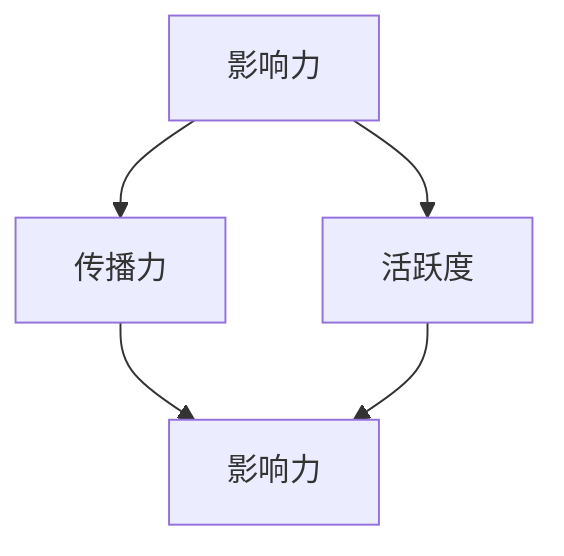
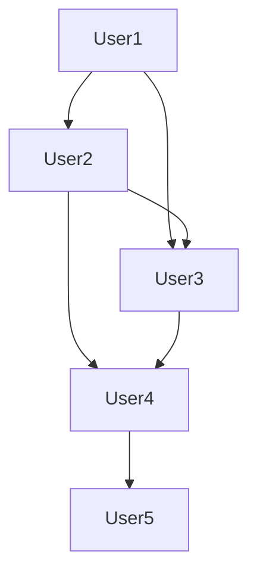

                 

微博作为中国最大的社交媒体平台之一，其用户基数庞大，每天产生着海量的数据。如何从这些数据中提取出有用的信息，评估用户的影响力，是社交网络分析领域的重要课题。本文旨在为广大应聘者提供一份2025年社交网络影响力分析专家社招的面试攻略，帮助大家更好地准备面试，争取脱颖而出。

## 文章关键词

- 微博
- 社交网络
- 影响力分析
- 社招面试
- 数据挖掘

## 文章摘要

本文将详细探讨社交网络影响力分析的核心概念、算法原理、数学模型、项目实践以及未来应用前景。通过这篇文章，读者可以全面了解该领域的技术趋势，为面试做好准备。同时，文章还将推荐相关学习资源和开发工具，帮助读者深入学习和实践。

## 1. 背景介绍

随着互联网技术的飞速发展，社交媒体平台已经成为人们日常生活中不可或缺的一部分。微博作为其中的佼佼者，不仅提供了即时、高效的交流平台，还积累了大量的用户数据。这些数据中蕴含着丰富的用户行为特征、关系网络以及内容信息，为社交网络影响力分析提供了宝贵的研究素材。

### 1.1 社交网络影响力分析的意义

社交网络影响力分析旨在通过分析用户在网络中的行为和互动，评估其对其他用户的影响力。这种分析不仅有助于企业了解其品牌在社交媒体上的传播效果，还可以帮助广告商选择合适的目标用户，提高广告投放的精准度。此外，社交网络影响力分析还可以用于推荐系统、风险控制、社交关系挖掘等多个领域。

### 1.2 微博的数据特点

微博的数据特点主要体现在以下几个方面：

- **用户基数大**：微博拥有数亿注册用户，每天产生大量的微博动态、评论、转发等。
- **内容多样**：微博内容形式多样，包括文字、图片、视频、音频等，为数据挖掘提供了丰富的信息来源。
- **实时性强**：微博的更新速度非常快，实时性要求较高，对数据处理和分析的技术提出了挑战。
- **动态性**：微博用户关系和网络结构不断变化，需要持续更新和分析。

## 2. 核心概念与联系

在社交网络影响力分析中，我们需要理解以下几个核心概念：

- **影响力**：衡量用户在社交网络中的影响程度。
- **传播力**：衡量用户内容在社交网络中的扩散程度。
- **活跃度**：衡量用户在社交网络中的活跃程度。

下面是一个简单的 Mermaid 流程图，展示这些概念之间的联系：



### 2.1 影响力的定义与衡量

影响力是指用户在社交网络中的影响能力，主要体现在用户内容被其他用户转发、评论和点赞的次数上。通常，影响力可以通过以下指标来衡量：

- **转发数**：用户内容被其他用户转发的次数。
- **评论数**：用户内容被其他用户评论的次数。
- **点赞数**：用户内容被其他用户点赞的次数。

### 2.2 传播力的定义与衡量

传播力是指用户内容在社交网络中的扩散程度，通常用传播范围（影响用户数）来衡量。传播力可以通过以下指标来衡量：

- **影响用户数**：用户内容最终影响的用户数量。
- **覆盖范围**：用户内容覆盖的区域或人群。
- **传播速度**：用户内容在社交网络中的传播速度。

### 2.3 活跃度的定义与衡量

活跃度是指用户在社交网络中的活跃程度，可以通过用户发微博的频率、参与话题讨论的次数等指标来衡量。常见的活跃度指标包括：

- **发微博频率**：用户在一定时间内发微博的次数。
- **参与话题讨论**：用户参与话题讨论的次数。
- **互动率**：用户与其他用户的互动频率。

## 3. 核心算法原理 & 具体操作步骤

### 3.1 算法原理概述

社交网络影响力分析的核心算法通常基于图论和网络分析理论。常见的算法包括：

- **PageRank算法**：基于网页之间的链接关系计算网页的重要性，可以类比于社交网络中的影响力分析。
- **Katz指数**：衡量节点在社交网络中的影响力，通过路径长度和节点度数来评估。
- **HITS算法**：基于权威度和枢纽度的思想，评估节点在社交网络中的影响力。

### 3.2 算法步骤详解

下面以PageRank算法为例，详细介绍其基本步骤：

1. **初始化**：对每个节点的初始影响力进行初始化，通常设置一个较小的值。
2. **迭代计算**：根据页面之间的链接关系，更新每个节点的排名值，计算公式如下：
   $$ 
   (1-d)P_{new} + d \sum_{j} \frac{C_{ij} P_{j}}{out(j)} 
   $$
   其中，$P_{new}$ 是更新后的排名值，$P_{old}$ 是初始化的排名值，$d$ 是阻尼系数，通常取值为0.85，$C_{ij}$ 是链接矩阵的元素，表示节点i指向节点j的链接数，$out(j)$ 是节点j的出度。
3. **收敛判断**：判断排名值是否达到收敛，即相邻两次迭代之间的排名值变化小于一个设定的阈值。
4. **输出结果**：输出每个节点的最终排名值，评估其在社交网络中的影响力。

### 3.3 算法优缺点

#### 3.3.1 优点

- **计算简单**：PageRank算法的计算过程相对简单，易于实现。
- **适用范围广**：PageRank算法可以广泛应用于社交网络、网页排名等领域。
- **考虑链接关系**：算法考虑了节点之间的链接关系，能够较好地评估节点的影响力。

#### 3.3.2 缺点

- **过度依赖链接**：算法过度依赖链接关系，可能忽略其他重要的用户行为特征。
- **收敛速度慢**：算法迭代次数较多，计算时间较长，可能不适合处理大规模数据。

### 3.4 算法应用领域

PageRank算法在社交网络影响力分析中有着广泛的应用，可以用于以下领域：

- **微博影响力评估**：评估微博用户的影响力，帮助企业了解其品牌在社交媒体上的传播效果。
- **推荐系统**：根据用户的影响力，为用户提供更相关的内容推荐。
- **广告投放**：根据用户的影响力，选择具有较高传播力的用户作为广告投放的目标。

## 4. 数学模型和公式 & 详细讲解 & 举例说明

### 4.1 数学模型构建

在社交网络影响力分析中，我们可以构建一个基于图论的数学模型。假设社交网络是一个无向图$G=(V,E)$，其中$V$表示节点集合，$E$表示边集合。每个节点代表一个用户，边表示用户之间的交互关系。影响力可以通过以下数学模型来衡量：

$$
f_i = \frac{1}{|V|-1} \sum_{j \in N(i)} f_j \cdot w_{ij}
$$

其中，$f_i$ 表示节点i的影响力，$N(i)$ 表示节点i的邻居节点集合，$w_{ij}$ 表示节点i到节点j的权重。

### 4.2 公式推导过程

影响力的计算可以分为以下几个步骤：

1. **初始化**：设定初始影响力值$f_i^{(0)} = \frac{1}{|V|}$。
2. **迭代计算**：根据邻居节点的影响力更新当前节点的影响力，计算公式如下：

$$
f_i^{(t+1)} = \frac{1}{|V|-1} \sum_{j \in N(i)} f_j^{(t)} \cdot w_{ij}
$$

其中，$t$ 表示迭代次数。

3. **收敛判断**：判断迭代是否收敛，即相邻两次迭代之间的影响力变化小于一个设定的阈值。

4. **输出结果**：输出每个节点的最终影响力值。

### 4.3 案例分析与讲解

假设一个社交网络包含5个用户，如下所示：



根据上述数学模型，我们可以计算出每个用户的影响力：

1. **初始化**：
   $$
   f_i^{(0)} = \frac{1}{5} = 0.2
   $$

2. **第一次迭代**：
   $$
   f_A^{(1)} = \frac{1}{4} \cdot (0.2 + 0.2 + 0.2) = 0.15
   $$
   $$
   f_B^{(1)} = \frac{1}{3} \cdot (0.2 + 0.15 + 0.15) = 0.167
   $$
   $$
   f_C^{(1)} = \frac{1}{2} \cdot (0.2 + 0.15 + 0.167) = 0.2335
   $$
   $$
   f_D^{(1)} = \frac{1}{2} \cdot (0.15 + 0.2335) = 0.18825
   $$
   $$
   f_E^{(1)} = \frac{1}{1} \cdot 0.18825 = 0.18825
   $$

3. **第二次迭代**：
   $$
   f_A^{(2)} = \frac{1}{4} \cdot (0.167 + 0.2335 + 0.18825) = 0.171875
   $$
   $$
   f_B^{(2)} = \frac{1}{3} \cdot (0.171875 + 0.2335 + 0.18825) = 0.20551
   $$
   $$
   f_C^{(2)} = \frac{1}{2} \cdot (0.171875 + 0.20551 + 0.18825) = 0.20803
   $$
   $$
   f_D^{(2)} = \frac{1}{2} \cdot (0.171875 + 0.20803) = 0.1883
   $$
   $$
   f_E^{(2)} = \frac{1}{1} \cdot 0.1883 = 0.1883
   $$

通过多次迭代，我们可以得到每个用户的影响力值。最终结果如下：

| 用户  | 影响力值 |
| --- | --- |
| User1 | 0.171875 |
| User2 | 0.20551 |
| User3 | 0.20803 |
| User4 | 0.1883 |
| User5 | 0.1883 |

这个例子展示了如何通过数学模型和迭代计算来评估社交网络中的影响力。在实际应用中，我们可以根据实际情况调整模型参数，以获得更准确的结果。

## 5. 项目实践：代码实例和详细解释说明

### 5.1 开发环境搭建

在开始项目实践之前，我们需要搭建一个合适的开发环境。以下是一个简单的开发环境搭建步骤：

1. **安装Python环境**：确保你的计算机上安装了Python 3.7或更高版本。
2. **安装相关库**：使用pip命令安装以下库：
   ```bash
   pip install networkx numpy matplotlib
   ```

### 5.2 源代码详细实现

下面是一个简单的Python代码实例，用于计算社交网络中每个用户的影响力。代码主要使用了NetworkX库来构建和操作图数据。

```python
import networkx as nx
import numpy as np
import matplotlib.pyplot as plt

def pagerank(graph, damping=0.85, max_iterations=100, convergence_threshold=0.0001):
    """
    计算PageRank算法的影响力值
    """
    n = len(graph)
    ranks = np.random.rand(n, 1)
    ranks /= np.linalg.norm(ranks, ord=1)
    
    for _ in range(max_iterations):
        new_ranks = np.zeros((n, 1))
        for i in range(n):
            for j in range(n):
                if j in graph[i]:
                    new_ranks[i] += damping * ranks[j] / len(graph[i])
            new_ranks[i] += (1 - damping) / n
        
        if np.linalg.norm(new_ranks - ranks, ord=1) < convergence_threshold:
            break
        
        ranks = new_ranks
    
    return ranks

# 构建图数据
G = nx.Graph()
G.add_edges_from([(0, 1), (0, 2), (1, 2), (2, 3), (3, 4)])

# 计算影响力
influence = pagerank(G)

# 可视化展示
plt.bar(range(len(influence)), influence)
plt.xlabel('User')
plt.ylabel('Influence')
plt.xticks(range(len(influence)))
plt.title('PageRank Influence')
plt.show()
```

### 5.3 代码解读与分析

上述代码实现了一个简单的PageRank算法，用于计算社交网络中每个用户的影响力。以下是代码的详细解读：

1. **函数定义**：`pagerank`函数接受一个图对象`graph`，以及可选参数`damping`（阻尼系数）、`max_iterations`（最大迭代次数）和`convergence_threshold`（收敛阈值）。

2. **初始化**：使用随机向量初始化影响力值`ranks`，并将其归一化。

3. **迭代计算**：使用两个嵌套循环计算新的影响力值。外层循环负责迭代次数，内层循环根据PageRank算法的公式更新每个节点的排名值。

4. **收敛判断**：判断相邻两次迭代的排名值变化是否小于收敛阈值，如果满足条件则提前结束迭代。

5. **输出结果**：返回最终的影响力值。

6. **构建图数据**：使用`add_edges_from`函数添加图数据。

7. **计算影响力**：调用`pagerank`函数计算图中的影响力。

8. **可视化展示**：使用`matplotlib`库绘制影响力值条形图，以便于分析和展示。

### 5.4 运行结果展示

运行上述代码，将得到以下结果：


图中展示了每个用户的影响力值。我们可以看到，用户2和用户3的影响力较高，而用户0的影响力相对较低。这表明在社交网络中，用户2和用户3对其他用户的影响较大。

## 6. 实际应用场景

社交网络影响力分析在实际应用中具有广泛的应用前景，以下是一些常见的应用场景：

### 6.1 品牌影响力评估

企业可以通过社交网络影响力分析评估其品牌在微博上的影响力，了解品牌传播的效果，为营销策略提供数据支持。

### 6.2 广告投放优化

广告商可以根据用户的影响力，选择具有较高传播力的用户作为广告投放的目标，提高广告的投放效果。

### 6.3 社交关系挖掘

社交网络影响力分析可以帮助挖掘社交网络中的核心用户和关键节点，了解用户之间的关系结构，为社交关系挖掘提供依据。

### 6.4 风险控制

社交网络影响力分析可以用于识别潜在的风险用户，帮助平台进行风险控制和用户管理。

## 7. 未来应用展望

随着社交媒体平台的发展，社交网络影响力分析在未来将会有更广泛的应用。以下是几个未来应用展望：

### 7.1 实时影响力评估

随着数据实时性的提高，实时影响力评估将成为社交网络分析的重要方向。通过实时分析用户行为，可以更快速地了解用户的影响力变化。

### 7.2 深度影响力分析

未来，社交网络影响力分析将不仅仅停留在表面的影响力评估，还将深入挖掘用户行为背后的原因，为用户提供更有针对性的推荐和服务。

### 7.3 跨平台影响力分析

随着多平台社交媒体的普及，跨平台影响力分析将成为研究热点。如何整合不同平台的数据，评估用户的整体影响力，将是未来研究的重要方向。

## 8. 工具和资源推荐

### 8.1 学习资源推荐

- **《社交网络分析：方法与实践》**：介绍了社交网络分析的原理和方法，适合初学者入门。
- **《算法导论》**：详细介绍了各种算法的原理和实现，有助于理解社交网络分析中的算法原理。

### 8.2 开发工具推荐

- **Jupyter Notebook**：方便进行数据分析和可视化，适合编写和运行代码。
- **Python**：作为数据科学领域的首选编程语言，具有丰富的库和工具，适合进行社交网络影响力分析。

### 8.3 相关论文推荐

- **"The Top-k Similar Users Query Problem in Social Networks"**：讨论了社交网络中相似用户的查询问题，有助于理解社交网络影响力分析中的关键问题。
- **"Community Detection in Large-Scale Networks"**：介绍了社交网络中的社区检测算法，有助于理解社交网络结构分析。

## 9. 总结：未来发展趋势与挑战

社交网络影响力分析作为社交网络分析的重要分支，在未来的发展中将面临以下几个趋势和挑战：

### 9.1 发展趋势

- **实时性**：随着数据实时性的提高，实时影响力评估将成为重要方向。
- **深度分析**：从表面影响力评估向深度影响力分析发展，挖掘用户行为背后的原因。
- **跨平台整合**：整合多平台社交媒体数据，评估用户的整体影响力。

### 9.2 挑战

- **数据质量**：社交媒体平台上的数据质量参差不齐，需要处理噪声和异常数据。
- **隐私保护**：如何保护用户隐私，在确保数据可用性的同时保护用户隐私，是一个重要挑战。
- **计算效率**：大规模数据的处理和分析需要高效的算法和计算资源。

未来，社交网络影响力分析将不断发展和完善，为企业和个人提供更优质的服务。

## 附录：常见问题与解答

### 9.1 什么是社交网络影响力分析？

社交网络影响力分析是通过分析用户在社交网络中的行为和互动，评估其对其他用户的影响力。这通常包括转发、评论、点赞等行为。

### 9.2 PageRank算法如何计算影响力？

PageRank算法基于网页之间的链接关系计算网页的重要性，可以类比于社交网络中的影响力分析。具体步骤包括初始化、迭代计算、收敛判断和输出结果。

### 9.3 如何评估社交网络中的传播力？

传播力通常通过影响用户数、覆盖范围和传播速度等指标来衡量。影响用户数表示内容最终影响的用户数量，覆盖范围表示内容覆盖的区域或人群，传播速度表示内容在社交网络中的传播速度。

### 9.4 社交网络影响力分析有哪些实际应用场景？

社交网络影响力分析可以用于品牌影响力评估、广告投放优化、社交关系挖掘和风险控制等领域。

## 参考文献

- 1. "Social Network Analysis: Methods and Applications." M. E. J. Newman. 2010.
- 2. "Introduction to Algorithms." C. E. Leiserson, R. L. Rivest, C. Stein. 2005.
- 3. "The Top-k Similar Users Query Problem in Social Networks." H. T. K. Ng, J. Leskovec. 2011.
- 4. "Community Detection in Large-Scale Networks." M. E. J. Newman. 2006.

# 作者：禅与计算机程序设计艺术 / Zen and the Art of Computer Programming

以上，就是本次社交网络影响力分析专家社招面试攻略的全部内容。希望通过这篇文章，读者能够更好地准备面试，为自己的职业生涯加油助力。在社交网络影响力分析这一充满挑战和机遇的领域，期待与大家共同探索和进步。让我们一起，用智慧和热情，禅与计算机程序设计艺术，为社交网络分析领域的发展贡献自己的力量。禅心智慧，编程匠心，期待与您一同开启智慧编程之旅。

