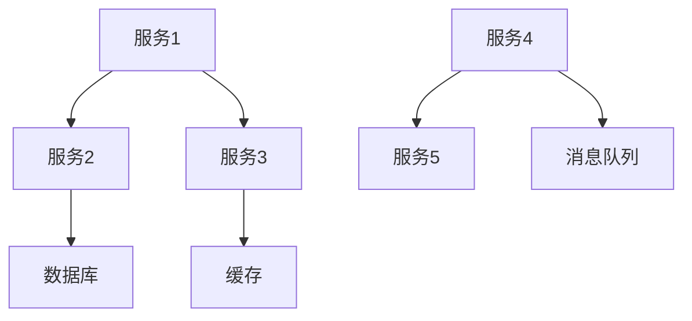
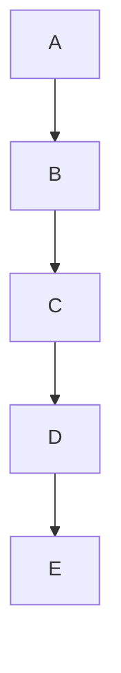

                 

 > **关键词：** 微服务架构，独立部署，扩展性，DevOps，服务治理，分布式系统，容器化，服务网格。

> **摘要：** 本文旨在深入探讨微服务架构在现代软件开发中的重要性，特别是在独立部署和扩展方面的优势。通过详细解释微服务架构的概念、核心原理、设计模式，以及实际操作步骤，本文将帮助读者理解如何构建高效、可扩展的分布式系统。此外，还将探讨微服务架构面临的关键挑战和未来发展趋势。

## 1. 背景介绍

### 1.1 微服务架构的起源

微服务架构（Microservices Architecture）的概念起源于2011年，由亚马逊首席技术官保罗·格雷厄姆（Paul Graham）首次提出。然而，它的理念实际上早在此前就已经在大型软件系统中得到了实践，例如金融行业的分布式交易系统。

微服务架构的主要思想是将复杂的应用程序分解为一系列独立的小型服务，每个服务负责实现特定的业务功能，并且可以独立部署、升级和扩展。这种架构风格是对传统的单体架构（Monolithic Architecture）的一种重要改进。

### 1.2 单体架构的局限性

单体架构将应用程序的所有功能集成到一个单一的代码库中。虽然这种架构在早期开发中可能较为简单，但随着项目的增长，它通常会遇到以下问题：

1. **技术债务积累**：随着功能的不断增加，维护成本逐渐升高。
2. **部署困难**：一旦需要更新某个模块，整个应用程序都需要重新部署。
3. **扩展性差**：扩展通常意味着在硬件层面进行垂直扩展，而非灵活的水平扩展。
4. **测试复杂**：对整个系统进行测试时，需要模拟所有的用例。

### 1.3 微服务架构的优势

微服务架构旨在解决单体架构的上述问题，其主要优势包括：

1. **独立性**：每个服务都是独立的，可以独立开发和部署。
2. **可扩展性**：可以根据需求独立扩展特定的服务。
3. **灵活的部署**：服务可以独立部署，无需担心其他服务的依赖。
4. **模块化**：服务之间通过轻量级的通信机制进行交互，降低系统的耦合度。

## 2. 核心概念与联系

### 2.1 微服务

微服务（Microservice）是一种小型、独立、可扩展的服务，每个服务都专注于实现特定的业务功能。它们通常采用 RESTful API 或消息队列进行通信。

### 2.2 服务治理

服务治理（Service Governance）是确保微服务系统能够稳定运行和高效协作的一系列机制，包括服务注册、发现、监控、负载均衡、安全控制等。

### 2.3 DevOps

DevOps（Development and Operations）是一种文化和实践，强调软件开发（Development）与IT运维（Operations）之间的紧密协作。它有助于提高软件交付的效率和质量。

### 2.4 Mermaid 流程图

下面是一个简化的微服务架构的 Mermaid 流程图：



## 3. 核心算法原理 & 具体操作步骤

### 3.1 算法原理概述

微服务架构的核心在于服务间的独立性和协同工作。以下是实现微服务架构的一些关键算法原理：

1. **服务发现**：通过服务注册中心，服务可以在运行时动态发现其他服务。
2. **负载均衡**：使用负载均衡算法将请求分配到不同的服务实例。
3. **服务监控**：监控服务的健康状态和性能，确保系统能够快速响应异常。
4. **故障转移**：当服务发生故障时，自动切换到其他健康的实例。

### 3.2 算法步骤详解

1. **服务注册与发现**
   - 服务启动时向服务注册中心注册自己的地址和端口。
   - 客户端从服务注册中心获取服务地址，并进行调用。

2. **负载均衡**
   - 采用轮询、最少连接、随机等算法，将请求分配到不同的服务实例。

3. **服务监控**
   - 定期检查服务的健康状态，如响应时间、错误率等。
   - 当服务异常时，触发警报或自动切换到备用实例。

4. **故障转移**
   - 当主服务发生故障时，自动切换到备用服务。
   - 更新服务注册中心中的服务地址信息。

### 3.3 算法优缺点

**优点：**
- **高可扩展性**：可以根据需求独立扩展特定的服务。
- **高容错性**：服务故障不会影响整个系统的运行。
- **独立部署**：减少服务间的依赖，提高部署的灵活性。

**缺点：**
- **分布式复杂性**：需要处理服务间的通信、数据一致性等问题。
- **管理难度**：需要管理和监控大量独立的服务。
- **开发难度**：需要适应分布式系统的开发模式。

### 3.4 算法应用领域

微服务架构适用于需要高可扩展性和高容错性的场景，如电子商务、金融科技、物联网等。

## 4. 数学模型和公式 & 详细讲解 & 举例说明

### 4.1 数学模型构建

在微服务架构中，我们可以使用以下数学模型来描述服务之间的依赖关系：

- **服务依赖图（Service Dependency Graph）**：
  - 节点表示服务，边表示服务之间的依赖关系。

### 4.2 公式推导过程

假设有一个服务依赖图 G，其中节点表示服务，边表示依赖关系。我们可以使用以下公式来计算图中的关键路径（Critical Path）：

- **关键路径长度（Critical Path Length）**：
  - \( L = \sum_{i=1}^{n} d_i \)

其中，\( d_i \) 表示图中第 i 条边的权重。

### 4.3 案例分析与讲解

假设我们有一个包含 5 个服务的微服务系统，服务之间的依赖关系如下图所示：



我们可以使用上述公式计算关键路径的长度：

- \( L = d_{AB} + d_{BC} + d_{CD} + d_{DE} \)
- \( L = 1 + 1 + 1 + 1 = 4 \)

这意味着，如果任何一个服务（A、B、C、D 或 E）发生故障，整个系统都会受到影响。

## 5. 项目实践：代码实例和详细解释说明

### 5.1 开发环境搭建

为了演示微服务架构的实践，我们将使用 Spring Boot 和 Kubernetes 来构建一个简单的电子商务系统。以下是搭建开发环境的基本步骤：

1. 安装 Java SDK（版本 11 或以上）。
2. 安装 Spring Boot（版本 2.5.5 或以上）。
3. 安装 Docker（版本 19.03 或以上）。
4. 安装 Kubernetes（版本 1.21 或以上）。

### 5.2 源代码详细实现

我们将实现一个简单的用户服务（UserService），该服务负责处理用户注册、登录等操作。以下是 UserService 的关键代码：

```java
@RestController
@RequestMapping("/users")
public class UserServiceController {
    
    @Autowired
    private UserService userService;
    
    @PostMapping("/register")
    public ResponseEntity<?> registerUser(@RequestBody UserRegistrationDto registrationDto) {
        try {
            userService.registerUser(registrationDto);
            return ResponseEntity.ok().build();
        } catch (Exception e) {
            return ResponseEntity.badRequest().build();
        }
    }
    
    @PostMapping("/login")
    public ResponseEntity<?> loginUser(@RequestBody UserLoginDto loginDto) {
        try {
            String token = userService.loginUser(loginDto);
            return ResponseEntity.ok().body(new JwtTokenResponse(token));
        } catch (Exception e) {
            return ResponseEntity.badRequest().build();
        }
    }
}
```

### 5.3 代码解读与分析

在这个例子中，我们定义了一个 `UserServiceController` 类，它负责处理用户服务的 HTTP 请求。以下是关键代码的解读：

1. **注册用户（registerUser）**：
   - 接收一个 `UserRegistrationDto` 对象，该对象包含用户的基本信息。
   - 调用 `UserService` 的 `registerUser` 方法进行用户注册。

2. **登录用户（loginUser）**：
   - 接收一个 `UserLoginDto` 对象，该对象包含用户名和密码。
   - 调用 `UserService` 的 `loginUser` 方法进行用户登录，并返回 JWT 令牌。

### 5.4 运行结果展示

1. **注册用户**：
   - 当用户发送一个注册请求时，服务将返回一个成功的响应。

2. **登录用户**：
   - 当用户发送一个登录请求时，服务将返回一个 JWT 令牌，用户可以使用此令牌进行后续的认证操作。

## 6. 实际应用场景

### 6.1 电子商务平台

微服务架构在电子商务平台中得到了广泛应用。例如，一个典型的电子商务平台可能包含用户服务、订单服务、库存服务、支付服务等。通过将各个服务独立部署，可以灵活地扩展系统的不同部分，提高系统的整体性能和可靠性。

### 6.2 物联网平台

在物联网（IoT）领域，微服务架构有助于处理大规模的设备数据。例如，一个物联网平台可以包含设备管理服务、数据存储服务、数据分析服务等。通过独立部署和扩展这些服务，可以有效地应对设备数据的快速增长。

### 6.3 金融科技平台

金融科技（FinTech）平台通常需要处理大量的交易数据。微服务架构可以帮助金融科技公司快速响应市场变化，确保交易系统的安全性和稳定性。例如，一个金融科技平台可以包含交易服务、风控服务、客户服务等多个微服务。

## 7. 工具和资源推荐

### 7.1 学习资源推荐

1. 《微服务设计》（Designing Microservices） - By Sam Newman
2. 《Kubernetes权威指南》（Kubernetes Up & Running）- By Kelsey Hightower
3. 《DevOps Handbook》- By John Allspaw and Patrick Debois

### 7.2 开发工具推荐

1. Docker：容器化平台，用于打包、分发和运行应用程序。
2. Kubernetes：用于自动化容器化应用程序的部署、扩展和管理。
3. Spring Boot：用于快速构建独立的、生产级别的 Spring 应用程序。

### 7.3 相关论文推荐

1. "Microservices: A Definition of a Microservice Architecture" - By Martin Fowler
2. "The Case for Microservices" - By Sam Newman
3. "Microservices: A Field Guide to Distributed Systems" - By Sam Newman

## 8. 总结：未来发展趋势与挑战

### 8.1 研究成果总结

微服务架构在过去十年中已经成为现代软件开发的主流架构风格。它通过将大型单体应用程序分解为独立的微服务，提高了系统的可扩展性和容错性。同时，DevOps文化和工具的发展进一步加速了微服务架构的落地和普及。

### 8.2 未来发展趋势

1. **服务网格（Service Mesh）**：服务网格提供了一种独立的通信层，用于管理微服务之间的通信。它有助于简化服务治理，提高系统的性能和可靠性。
2. **云原生技术**：随着云计算的不断发展，云原生技术（如 Kubernetes）将在微服务架构中发挥更加重要的作用。
3. **Serverless 计算**：Serverless 架构将使开发者能够更加专注于业务逻辑，而无需担心底层基础设施的管理。

### 8.3 面临的挑战

1. **分布式系统的复杂性**：微服务架构虽然提高了系统的灵活性，但也增加了系统的复杂性。如何有效地管理和监控大量服务成为了一个挑战。
2. **数据一致性和事务管理**：在分布式系统中，数据一致性和事务管理变得更加困难。如何确保跨服务的数据一致性是一个关键问题。

### 8.4 研究展望

未来，微服务架构将继续在分布式系统领域发挥重要作用。研究者将重点关注如何简化服务治理、提高系统的可靠性和性能。此外，随着新技术（如区块链、人工智能等）的发展，微服务架构也有望与其他技术相结合，推动软件开发的进一步创新。

## 9. 附录：常见问题与解答

### 9.1 什么是微服务架构？

微服务架构是一种将应用程序分解为小型、独立、可扩展服务的架构风格。每个服务负责实现特定的业务功能，并且可以独立部署、升级和扩展。

### 9.2 微服务架构与单体架构的区别是什么？

微服务架构与单体架构的主要区别在于服务的独立性、可扩展性和部署方式。微服务架构通过将应用程序分解为独立的微服务，提高了系统的灵活性、可维护性和容错性。

### 9.3 微服务架构适合哪些场景？

微服务架构适合需要高可扩展性和高容错性的场景，如电子商务平台、金融科技平台、物联网平台等。

### 9.4 如何管理微服务架构的复杂性？

通过使用服务网格、自动化部署和监控工具，可以有效地管理微服务架构的复杂性。此外，遵循良好的编码和实践习惯也有助于降低系统的复杂度。

### 9.5 微服务架构中的数据一致性和事务管理如何实现？

在微服务架构中，可以使用分布式事务管理机制（如两阶段提交协议）和最终一致性模型（如事件 sourcing 和补偿事务）来实现数据一致性和事务管理。

---

感谢您阅读本文，希望本文能够帮助您更好地理解微服务架构及其在实际应用中的优势、挑战和未来发展趋势。作者：禅与计算机程序设计艺术 / Zen and the Art of Computer Programming。
```

