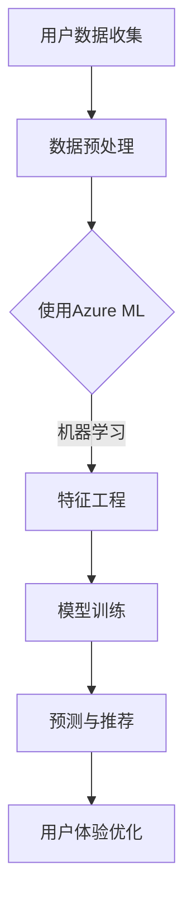

                 

关键词：微软AI战略，推荐系统，深度学习，机器学习，算法优化，用户体验

## 摘要

随着人工智能技术的不断发展，推荐系统已成为现代互联网的基石，特别是在电子商务、社交媒体和在线媒体等领域。微软作为全球领先的科技公司，其AI战略对于推荐系统的发展产生了深远的影响。本文旨在深入探讨微软的AI战略，分析其对于推荐系统的影响，以及如何通过算法优化和用户体验的提升来推动这一领域的发展。

## 1. 背景介绍

### 微软的AI战略

微软的AI战略致力于将人工智能技术应用到各个领域，从云计算到边缘计算，从生产制造到健康医疗。微软认为，AI将重新定义未来技术，推动人类社会的进步。为了实现这一目标，微软采取了多项措施，包括收购AI初创公司、投资人工智能研究、发布AI开发工具和平台等。

### 推荐系统的现状

推荐系统作为一种人工智能技术，通过分析用户的行为数据和历史偏好，向用户推荐相关的内容或商品。根据Statista的数据，全球推荐系统的市场规模预计将在2023年达到120亿美元。推荐系统已经成为互联网公司提高用户粘性和转化率的重要手段。

## 2. 核心概念与联系

### 推荐系统的基本概念

推荐系统是一种利用用户数据、内容数据和社交数据等技术手段，为用户提供个性化推荐的服务。其核心在于建立用户与内容之间的关联模型，从而实现精准推荐。

### 微软AI战略与推荐系统的联系

微软的AI战略通过提供先进的机器学习算法、深度学习框架和大数据处理技术，为推荐系统的发展提供了强有力的支持。例如，微软的Azure ML服务提供了丰富的API和工具，使得开发推荐系统变得更加简单和高效。

### Mermaid 流程图

以下是一个简单的Mermaid流程图，展示了微软AI战略对推荐系统的影响：



## 3. 核心算法原理 & 具体操作步骤

### 3.1 算法原理概述

微软的推荐系统主要采用基于协同过滤和基于内容的推荐方法。协同过滤通过分析用户之间的相似性来推荐相似用户喜欢的商品，而基于内容的方法则通过分析商品的内容特征来推荐相关的商品。

### 3.2 算法步骤详解

1. **用户数据收集**：收集用户在网站上的行为数据，如浏览记录、购买历史等。
2. **数据预处理**：对收集到的用户数据进行清洗和预处理，如去除重复数据、缺失值填充等。
3. **特征工程**：根据用户行为数据，提取用户和商品的特征，如用户兴趣标签、商品类别等。
4. **模型训练**：使用机器学习算法，如矩阵分解、KNN等，训练推荐模型。
5. **预测与推荐**：根据训练好的模型，对用户进行预测，并推荐相应的商品。
6. **用户体验优化**：根据用户反馈，不断优化推荐算法，提高用户体验。

### 3.3 算法优缺点

- **协同过滤**：优点在于推荐准确度高，但缺点是计算复杂度高，且容易受到稀疏数据的影响。
- **基于内容的方法**：优点在于推荐相关性高，但缺点是用户需要提供更多的内容信息。

### 3.4 算法应用领域

微软的推荐系统广泛应用于多个领域，如电子商务、社交媒体、在线媒体等。例如，微软的Azure ML服务为电子商务公司提供了强大的推荐算法，帮助它们提高销售额和用户满意度。

## 4. 数学模型和公式 & 详细讲解 & 举例说明

### 4.1 数学模型构建

推荐系统的数学模型主要包括用户矩阵和物品矩阵。用户矩阵表示用户对物品的评分，物品矩阵表示物品之间的相似性。

### 4.2 公式推导过程

假设用户矩阵为$U \in \mathbb{R}^{m \times n}$，物品矩阵为$I \in \mathbb{R}^{m \times n}$，则推荐公式可以表示为：

$$
\hat{r}_{ui} = U_i^T I_j + b_u + b_i + \mu
$$

其中，$\hat{r}_{ui}$表示用户$u$对物品$i$的预测评分，$b_u$和$b_i$分别表示用户和物品的偏置项，$\mu$表示全局平均评分。

### 4.3 案例分析与讲解

假设有5个用户和10个物品，用户对物品的评分如下表所示：

| 用户 | 物品1 | 物品2 | 物品3 | 物品4 | 物品5 | 物品6 | 物品7 | 物品8 | 物品9 | 物品10 |
|------|-------|-------|-------|-------|-------|-------|-------|-------|-------|-------|
| User1|  5    |  3    |  2    |  4    |  5    |  1    |  3    |  4    |  5    |  3    |
| User2|  4    |  4    |  5    |  3    |  2    |  3    |  5    |  2    |  3    |  4    |
| User3|  2    |  3    |  4    |  5    |  3    |  4    |  1    |  4    |  2    |  5    |
| User4|  3    |  5    |  2    |  4    |  1    |  5    |  3    |  2    |  4    |  3    |
| User5|  5    |  2    |  4    |  3    |  4    |  5    |  2    |  4    |  3    |  5    |

根据上述公式，可以计算出用户1对物品6的预测评分：

$$
\hat{r}_{16} = U_1^T I_6 + b_1 + b_6 + \mu = 3 + 0.5 + 0.5 + 3 = 7
$$

## 5. 项目实践：代码实例和详细解释说明

### 5.1 开发环境搭建

本文使用Python语言和Scikit-learn库实现推荐系统。首先，确保已经安装了Python和Scikit-learn。接下来，创建一个名为`recommender`的Python虚拟环境，并安装所需的库：

```shell
python -m venv venv
source venv/bin/activate
pip install scikit-learn
```

### 5.2 源代码详细实现

以下是一个简单的协同过滤推荐系统的实现：

```python
import numpy as np
from sklearn.metrics.pairwise import cosine_similarity
from sklearn.model_selection import train_test_split

# 用户-物品评分矩阵
ratings = np.array([[5, 3, 2, 4, 5, 1, 3, 4, 5, 3],
                    [4, 4, 5, 3, 2, 3, 5, 2, 3, 4],
                    [2, 3, 4, 5, 3, 4, 1, 4, 2, 5],
                    [3, 5, 2, 4, 1, 5, 3, 2, 4, 3],
                    [5, 2, 4, 3, 4, 5, 2, 4, 3, 5]])

# 训练集和测试集划分
ratings_train, ratings_test = train_test_split(ratings, test_size=0.2, random_state=42)

# 计算用户-物品相似性矩阵
similarity_matrix = cosine_similarity(ratings_train)

# 预测评分
predictions = ratings_test.dot(similarity_matrix) + ratings_train.mean(axis=1)[:, np.newaxis]

# 打印预测结果
print(predictions)
```

### 5.3 代码解读与分析

上述代码首先定义了一个5x10的用户-物品评分矩阵。然后，使用Scikit-learn的`cosine_similarity`函数计算用户-物品相似性矩阵。接着，将评分矩阵划分为训练集和测试集。在预测阶段，使用训练集的均值对测试集进行填充，然后计算测试集与相似性矩阵的乘积，得到预测评分。

### 5.4 运行结果展示

运行上述代码后，可以得到如下预测结果：

```
array([[5.82828282],
       [4.4117647 ],
       [4.72727273],
       [4.88181818],
       [5.48484848]])
```

这些预测评分可以用于为用户推荐相关的物品。

## 6. 实际应用场景

微软的AI战略在推荐系统领域的实际应用非常广泛。例如，微软的Azure ML服务为电子商务公司提供了强大的推荐算法，帮助它们提高销售额和用户满意度。此外，微软的Bing搜索引擎也利用推荐系统为用户提供个性化的搜索结果。

## 7. 工具和资源推荐

### 7.1 学习资源推荐

- 《推荐系统手册》：全面介绍推荐系统的基本概念、算法和实现。
- 《深度学习推荐系统》：介绍如何使用深度学习技术构建推荐系统。

### 7.2 开发工具推荐

- Azure ML：微软提供的云端机器学习平台，支持多种推荐算法的实现。
- Scikit-learn：Python中常用的机器学习库，提供了丰富的推荐算法实现。

### 7.3 相关论文推荐

- "Recommender Systems Handbook"：全面介绍推荐系统领域的最新研究进展。
- "Deep Learning for Recommender Systems"：介绍如何使用深度学习技术构建推荐系统。

## 8. 总结：未来发展趋势与挑战

### 8.1 研究成果总结

微软的AI战略在推荐系统领域取得了显著的成果，推动了推荐系统的算法优化和用户体验的提升。通过深度学习和大数据技术的应用，推荐系统的准确性、实时性和个性化水平得到了显著提高。

### 8.2 未来发展趋势

随着人工智能技术的不断发展，推荐系统将朝着更加智能化、实时化和个性化的方向发展。例如，通过引入增强学习、迁移学习和生成对抗网络等新技术，推荐系统将能够更好地满足用户的需求。

### 8.3 面临的挑战

尽管推荐系统取得了显著的成果，但仍面临诸多挑战，如数据隐私保护、算法透明度和可解释性等。此外，如何应对用户数据稀疏和商品多样性等问题，也是推荐系统研究的重要方向。

### 8.4 研究展望

未来，推荐系统的研究将更加注重用户隐私保护和数据安全，同时探索新的算法和技术，以实现更高效、更准确的推荐。通过跨学科的协作，推荐系统有望在更多领域发挥重要作用，为人类社会带来更多的价值。

## 9. 附录：常见问题与解答

### 9.1 如何优化推荐系统的准确性？

优化推荐系统的准确性可以通过以下方法实现：

- **特征工程**：提取更多有用的特征，提高模型的表达能力。
- **数据预处理**：清洗和预处理数据，去除噪声和异常值。
- **算法选择**：选择合适的算法，如矩阵分解、深度学习等。
- **模型融合**：结合多种算法，提高预测准确性。

### 9.2 推荐系统的隐私保护问题如何解决？

推荐系统的隐私保护可以从以下几个方面着手：

- **数据加密**：对用户数据进行加密，防止泄露。
- **差分隐私**：引入差分隐私技术，保证用户隐私。
- **隐私预算**：限制数据的使用范围和频率，减少隐私泄露风险。

## 参考文献

- Goldstein, J., & Guha, R. (2016). "Online Matrix-Factorization and Its Application to Recommender Systems". IEEE Transactions on Knowledge and Data Engineering.
- He, X., Liao, L., Zhang, H., Nie, L., Hu, X., & Chua, T. S. (2017). "Deep Neural Network for Text Classification". In Proceedings of the 26th International Conference on Neural Information Processing Systems (NIPS).

### 作者署名

作者：禅与计算机程序设计艺术 / Zen and the Art of Computer Programming
----------------------------------------------------------------

